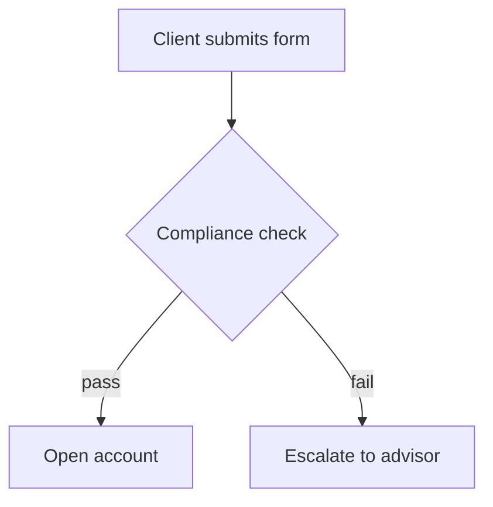

# Reading the incoming material

<!-- sync: local-wiki-ingest-sources v1 -->

Before anything can be placed, whatever the user handed over has to become an intake summary:
**topic, key facts, entities, shape.** This file covers how to get there from each source type, and
what must never be added along the way.

## The two rules that outrank the rest

### 1. Transcribe, don't author

**Nothing is added.** The note that lands in the vault contains what the source contained.
Not what it implies, not the surrounding context you happen to know, not the tidy version. If a
screenshot is cut off mid-sentence, the note says so. If a term is ambiguous, it stays ambiguous
and gets marked, not resolved.

Anything genuinely uncertain is marked in the note itself:

```
- Threshold: 15,000 EUR (screenshot cut off — verify)
```

### 2. Lose nothing

**The pass from source to vault is lossless.** Every distinct claim, value, name, step, condition,
exception, qualifier and edge case in the material lands somewhere in the vault. Summarizing,
condensing, "capturing the essence", keeping the highlights and dropping a detail because it looked
minor are all the same failure, and it is the one failure this skill cannot recover from: the
source goes back to the inbox or the bin, and what was dropped is gone.

**Exactly four things may be dropped. The list is exhaustive:**

1. **Chrome** — navigation, cookie banners, "Copy code", repeated page headers, cue timestamps.
2. **Speech artifacts** — filler, false starts, repetition, a sentence the speaker then restated.
   The claim survives; only the noise around it goes.
3. **Formatting the destination replaces** — the source's own heading ladder, its bullet markers,
   its numbering. The structure changes; the facts inside it do not.
4. **A claim the vault already states, verified by opening the note and reading the line.** Not
   assumed from a similar heading, not inferred from the index, not "it's probably covered".

Anything else is written, including — especially — the parts that look like detail:

- a number, a threshold, a date, a currency, a percentage, an identifier, a system name
- a condition, an exception, a "except when", a "only if", a "but not for"
- a qualifier: "usually", "since 2024", "for retail clients only"
- a name, a role, an owner, an authority
- an example the source gave, and the reason it gave for anything

**"Too long" is never a reason to drop anything.** A 3,600-line transcript that becomes 900 lines of
notes is the correct outcome, not a problem to fix. Material that feels too long for one note
**splits into more notes** (`references/placement-rules.md`), and it never gets compressed to fit.
Length is a structure decision; content is not negotiable.

**A claim that is more specific than what the vault already says is new.** The note says "above a
threshold" and the material says "above 15,000 EUR" — that is not a duplicate, that is the fact the
note was missing.

#### The completeness check — before any unit is reported as filed

Walk the unit's own `Key facts` list and name, for each one, the file and section it landed in. Any
claim with no destination is written now, or it is listed in the report as deliberately dropped,
with which of the four reasons applies. A unit reported as filed while one of its claims is
unaccounted for is a failed filing, whatever else the run did well.

**This check is necessary and not sufficient, because the list it walks is your own.** A pass that
thinned the material while extracting it produces a `Key facts` list that is already thin, and
walking that list confirms the thinning. Measuring against the **source** is the second pass, and in
`intake` it is a gate rather than a suggestion: `references/second-pass.md`, run per source file
before that file is marked filed.


## Screenshots and images

1. Read the image and transcribe its **informational content** — text, values, labels, table
   contents, the structure of a diagram. Not its visual appearance.
2. Tables become markdown tables or bullet lists, whichever the vault uses.
3. Diagrams, flowcharts, whiteboards become a step list — and a mermaid block (see Diagrams below).
4. UI screenshots: capture what the screen *says* (field names, values, states), not the layout,
   unless the layout is the point.
5. Unreadable regions are stated as such. Never fill them from context.
6. If the vault stores attachments and the image itself carries value beyond its text (a real
   diagram, a chart), save it to the vault's attachments location and embed it alongside the
   transcription. Pure text screenshots don't need saving.

Multiple screenshots of one continuous thing (a scrolled page, a sequence of steps) are one intake,
assembled in order — not several placements. In a batch, this grouping is decided up front
(`references/modes/intake.md` → Group related items) from filename sequence, mtime clustering, and
content continuity.

## Pasted text

- Preserve the author's structure — headings, lists, numbering — since it's evidence of the shape.
- Strip only chrome: navigation text, cookie banners, "Copy code" buttons, repeated headers.
- Keep code blocks fenced and language-tagged.
- Long paste that's really several topics → split it (see `references/placement-rules.md` →
  Splitting incoming material).

## A folder the user points at

A staging/inbox/dump folder is a **batch**, and batches are handled by
`references/modes/intake.md` — inventory and group first, extract second, decide the whole batch's
structure third. Everything in this file still applies, but per **intake unit** (a group of files
that are one piece of material) rather than per file.

The folder itself is read-only: nothing in it is deleted, moved, or edited.

## A file the user points at

Read it fully before deciding anything. If it's already markdown and already well-structured, the
placement decision may be "move this file into the right folder and index it" rather than merging
its content into another note — but the user's own file naming and structure survive intact.

**Unless it is a transcript.** A recording's transcript is never moved into the vault as a file,
however tidy it looks — see Recordings, presentations and discussions below.

## Web content and links

Only usable if the content is actually available — fetched, pasted, or otherwise in hand. A bare URL
with no content is not intake material: file the link itself under the right note with a one-line
description of what it is, and say that's what happened.

Always record the source URL in the note, in the vault's own citation style if it has one.

## Recordings, presentations and discussions — a transcript

A transcript is **raw knowledge, not a note.** What lands in the vault is what the recording taught;
the transcript itself never lands — not as a note, not as an appendix, not "kept for reference".
Copying a transcript out of the staging folder into a file and calling it filed is the worst
outcome this mode can produce: it moves bytes, indexes dialogue nobody will read, and leaves the
knowledge exactly as unfindable as it was in the inbox.

**Detect one before deciding anything else.** Any of these makes the material a transcript:

- a `.vtt`, `.srt`, `.sbv` or `.ttml` extension, or a `WEBVTT` first line
- cue timestamps — `00:00:08.059 --> 00:00:08.459`
- speaker tags — `<v Coric, Kristofor>`, or `Name:` opening most lines
- a wall of attributed spoken sentences, however it was exported — Teams, Zoom, Otter, or a
  recording somebody typed up by hand

An agenda, a slide export or a written meeting summary is **not** a transcript; it is pasted text or
a file, and the sections above cover it. A transcript *plus* the slides it goes with is one intake
unit, read together.

### Extraction is not summarization

A summary keeps the gist and drops the detail, which is exactly backwards: the recording is worth
processing *because* of the detail. Extraction keeps **every distinct claim** and throws away only
the speech — the filler, the repetition, the false starts, and the order somebody happened to say
things in.

A four-line "key takeaways" list out of a ninety-minute recording is a failed extraction, and so is
a verbatim copy. The right output is usually several notes' worth of structured knowledge: a process
with its steps, two or three definitions, a comparison table, a decision, and a short list of what
was left open.

### The passes, in order

1. **Reconstruct the prose.** Drop cue ids and timestamps, fold speaker tags into plain attribution,
   and stitch sentences that a cue boundary cut in half. Mechanical only — nothing is interpreted
   yet, and this reconstruction is never written to the vault.
2. **Keep the discussion; it is the most valuable part.** The presented half is the speaker's
   prepared model of the domain. The Q&A, the interruptions and the side arguments are where that
   model gets bounded, corrected and made concrete — the exceptions, the real thresholds, the "well,
   except when". Treat questions and answers as first-class source material, never as noise around
   the presentation.
3. **Segment by topic, not by time.** The recording's order is the order somebody spoke in, not the
   structure of the knowledge. Gather everything said about one topic into one place, wherever in
   the recording it was said: an answer at minute 70 belongs with the statement at minute 12 that it
   corrects.
4. **Turn each topic into an intake unit**, and run the normal summary on it — topic, key facts,
   entities, terms, open questions, shape. **One recording is many units.** A recording that yields
   exactly one note almost always means the segmentation never happened.
5. **Convert speech into statements.** "so basically what we do is, we, yeah, we take the Depot and
   then the manager kind of decides" becomes "The portfolio manager decides which securities the
   Depot holds." The claim survives, in the vault's vocabulary; the speech does not.
6. **Classify every claim by what kind of claim it is**, because speech mixes them freely and a note
   that flattens them is wrong in a way nobody can detect afterwards:

   | What was said | What lands in the vault |
   |---|---|
   | How something works, stated as fact | A plain claim |
   | A plan or an intention — "we'll probably add that next year" | Marked as planned, dated, attributed |
   | A hedge — "I think", "not sure", "roughly" | The claim, marked uncertain, keeping the speaker's own qualifier |
   | A question that got an answer | The resolved statement, never the Q&A form |
   | A question nobody answered | An open question (`references/open-questions.md`) |
   | A correction of something said earlier | Only the corrected version |
   | Two speakers disagreeing | Both positions, attributed, flagged unresolved |
   | A number, threshold, name or identifier | Verbatim, marked `(heard, verify)` when the export garbled it |
   | Greetings, scheduling, "can you see my screen", demo narration | Dropped |

7. **Attribute only where it carries weight** — who owns a thing, who decided, who disagreed, who is
   the authority for a claim the vault cannot otherwise check. Everything else loses the name: a note
   reading "Kristofor said the Depot holds securities" has turned a fact into a quote.
8. **Mark the gaps; never fill them.** A speaker points at a slide you do not have, or says "the
   usual process" and moves on. That is a hole in the material: state it as one, and put it in the
   vault's gaps log if it has one. Filling it from general knowledge is the failure this whole file
   exists to prevent.
9. **Cite the recording once per note it fed** — its title and date, in the vault's citation style.
   Timestamps are not reproduced; they point into a file the vault does not keep.

### Where the raw file ends up

Nowhere in the notes tree. It stays in the staging folder, which is read-only and git-ignored, and
it is trashed with the rest of the batch if and when the user says so. A user who explicitly asks to
keep the recording gets it saved to the vault's attachments location, never as a note and never
indexed as knowledge.

### Reading a long one

An hour of speech is a few thousand lines. Read it **once**, in order, in as few passes as the
reconstruction needs, then work from the segmented units rather than the file. Re-opening the
transcript per unit is how one recording costs more context than the entire vault it is being filed
into.

### Meeting and conversation notes that are not transcripts

Somebody's written-up notes of a meeting follow the same doctrine at much lower cost: decisions and
the reasoning behind them are the durable part and belong in the note, action items go wherever the
vault already tracks them, and attributions stay only where they carry weight.

## Diagrams

When the material describes a **multi-step process, workflow, state machine, or decision tree**,
write an inline mermaid block into the note, directly under the step list it visualizes:

````

````

- `flowchart TD` for processes and decision trees
- `sequenceDiagram` when the material is an exchange between actors or systems
- `stateDiagram-v2` for lifecycle or status transitions

Rules:

- Inline fenced block, in the note. Obsidian and GitHub render these natively — no separate file,
  no link to break.
- The diagram carries **only what the material stated**. No invented branches, no plausible-looking
  error paths that weren't described.
- Keep node labels short; the note's prose carries the detail.
- Past roughly 25 nodes, the process is too big for one diagram — split it by phase, one diagram per
  section, rather than producing something unreadable.
- Adding to a process that already has a diagram means **updating that diagram** in the same edit.
  A step list and its diagram disagreeing is worse than having no diagram.
- Don't add a diagram to material that isn't a process. A list of definitions, a reference table, or
  an observation gets no diagram.


### Validate every diagram you write

**A mermaid block is not finished until the validator passes on it.** Run it on the note you just
wrote, every time, before the run reports success:

```bash
python3 .agents/skills/local-wiki/scripts/mermaid_validator.py <the note you wrote>
```

Exit 0 means clean. Exit 1 prints the file, the line, and what is wrong — **fix it and re-run**;
never leave a broken diagram in the vault and never report the note as filed with the validator
failing.

This is not optional and not a style check. Every rule it enforces is a diagram that silently
failed to render, and the two that fire most often are produced by ordinary content:

- **an unquoted `{` in a label** — every REST path template has one, and `A([GET /v1/{id}/x])`
  opens a diamond mid-label and kills the whole block;
- **unquoted parentheses in a square label** — `E[fetchX()]` has balanced parens and still dies,
  because `(` is a shape token everywhere in an unquoted label.

Both are invisible when you re-read the diagram, which is exactly why this runs mechanically rather
than by eye.

## The intake summary

What steps 2 onward of `references/modes/update.md` actually consume:

- **Topic** — one line, using the vault's vocabulary where it has one
- **Key facts** — the claims, values, names, steps, verbatim in substance
- **Entities** — people, systems, terms, acronyms that may already have notes; these drive the
  duplicate search
- **Terms** — the domain vocabulary in the material, each resolved against the index's
  `## Business Glossary` as known, a known variant, or new (`references/glossary.md`)
- **Open questions** — what the material leaves unanswered: its `?`s, its `TBD`s, and the
  uncertainty markers transcription added above (`references/open-questions.md` → Detect)
- **Shape** — process / reference / definition / decision / observation. Shape decides whether a
  diagram applies and which structure the material becomes
  (`references/note-shaping.md` → Shape → structure).

The last two are why an uncertainty marker is worth writing carefully: it is not a shrug, it is the
input to the pass that tries to resolve it from the vault.
