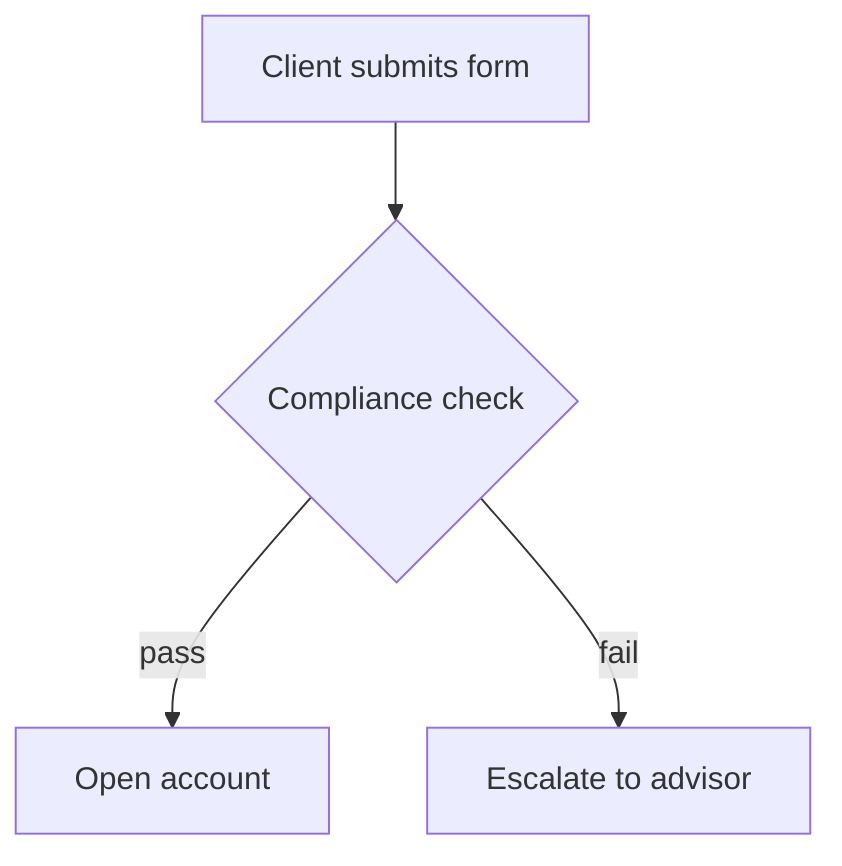

# Reading the incoming material

<!-- sync: local-wiki-ingest-sources v1 -->

Before anything can be placed, whatever the user handed over has to become an intake summary:
**topic, key facts, entities, shape.** This file covers how to get there from each source type, and
what must never be added along the way.

## The one rule that outranks the rest

**Transcribe, don't author.** The note that lands in the vault contains what the source contained.
Not what it implies, not the surrounding context you happen to know, not the tidy version. If a
screenshot is cut off mid-sentence, the note says so. If a term is ambiguous, it stays ambiguous
and gets marked, not resolved.

Anything genuinely uncertain is marked in the note itself:

```
- Threshold: 15,000 EUR (screenshot cut off — verify)
```

## Screenshots and images

1. Read the image and transcribe its **informational content** — text, values, labels, table
   contents, the structure of a diagram. Not its visual appearance.
2. Tables become markdown tables or bullet lists, whichever the vault uses.
3. Diagrams, flowcharts, whiteboards become a step list — and a mermaid block (see Diagrams below).
4. UI screenshots: capture what the screen *says* (field names, values, states), not the layout,
   unless the layout is the point.
5. Unreadable regions are stated as such. Never fill them from context.
6. If the vault stores attachments and the image itself carries value beyond its text (a real
   diagram, a chart), save it to the vault's attachments location and embed it alongside the
   transcription. Pure text screenshots don't need saving.

Multiple screenshots of one continuous thing (a scrolled page, a sequence of steps) are one intake,
assembled in order — not several placements. In a batch, this grouping is decided up front
(`references/modes/intake.md` → Group related items) from filename sequence, mtime clustering, and
content continuity.

## Pasted text

- Preserve the author's structure — headings, lists, numbering — since it's evidence of the shape.
- Strip only chrome: navigation text, cookie banners, "Copy code" buttons, repeated headers.
- Keep code blocks fenced and language-tagged.
- Long paste that's really several topics → split it (see `references/placement-rules.md` →
  Splitting incoming material).

## A folder the user points at

A staging/inbox/dump folder is a **batch**, and batches are handled by
`references/modes/intake.md` — inventory and group first, extract second, decide the whole batch's
structure third. Everything in this file still applies, but per **intake unit** (a group of files
that are one piece of material) rather than per file.

The folder itself is read-only: nothing in it is deleted, moved, or edited.

## A file the user points at

Read it fully before deciding anything. If it's already markdown and already well-structured, the
placement decision may be "move this file into the right folder and index it" rather than merging
its content into another note — but the user's own file naming and structure survive intact.

## Web content and links

Only usable if the content is actually available — fetched, pasted, or otherwise in hand. A bare URL
with no content is not intake material: file the link itself under the right note with a one-line
description of what it is, and say that's what happened.

Always record the source URL in the note, in the vault's own citation style if it has one.

## Conversation and meeting notes

- Separate **decisions** from **discussion**. Decisions are the durable part and belong in the note;
  discussion usually doesn't survive filing.
- Keep attributions where they matter ("X owns the migration") and drop them where they don't.
- Action items go wherever the vault already tracks them, if it does.

## Diagrams

When the material describes a **multi-step process, workflow, state machine, or decision tree**,
write an inline mermaid block into the note, directly under the step list it visualizes:

````

````

- `flowchart TD` for processes and decision trees
- `sequenceDiagram` when the material is an exchange between actors or systems
- `stateDiagram-v2` for lifecycle or status transitions

Rules:

- Inline fenced block, in the note. Obsidian and GitHub render these natively — no separate file,
  no link to break.
- The diagram carries **only what the material stated**. No invented branches, no plausible-looking
  error paths that weren't described.
- Keep node labels short; the note's prose carries the detail.
- Past roughly 25 nodes, the process is too big for one diagram — split it by phase, one diagram per
  section, rather than producing something unreadable.
- Adding to a process that already has a diagram means **updating that diagram** in the same edit.
  A step list and its diagram disagreeing is worse than having no diagram.
- Don't add a diagram to material that isn't a process. A list of definitions, a reference table, or
  an observation gets no diagram.


### Validate every diagram you write

**A mermaid block is not finished until the validator passes on it.** Run it on the note you just
wrote, every time, before the run reports success:

```bash
python3 .agents/skills/local-wiki/scripts/mermaid_validator.py <the note you wrote>
```

Exit 0 means clean. Exit 1 prints the file, the line, and what is wrong — **fix it and re-run**;
never leave a broken diagram in the vault and never report the note as filed with the validator
failing.

This is not optional and not a style check. Every rule it enforces is a diagram that silently
failed to render, and the two that fire most often are produced by ordinary content:

- **an unquoted `{` in a label** — every REST path template has one, and `A([GET /v1/{id}/x])`
  opens a diamond mid-label and kills the whole block;
- **unquoted parentheses in a square label** — `E[fetchX()]` has balanced parens and still dies,
  because `(` is a shape token everywhere in an unquoted label.

Both are invisible when you re-read the diagram, which is exactly why this runs mechanically rather
than by eye.

## The intake summary

What steps 2 onward of `references/modes/update.md` actually consume:

- **Topic** — one line, using the vault's vocabulary where it has one
- **Key facts** — the claims, values, names, steps, verbatim in substance
- **Entities** — people, systems, terms, acronyms that may already have notes; these drive the
  duplicate search
- **Terms** — the domain vocabulary in the material, each resolved against the index's
  `## Business Glossary` as known, a known variant, or new (`references/glossary.md`)
- **Open questions** — what the material leaves unanswered: its `?`s, its `TBD`s, and the
  uncertainty markers transcription added above (`references/open-questions.md` → Detect)
- **Shape** — process / reference / definition / decision / observation. Shape decides whether a
  diagram applies and which structure the material becomes
  (`references/note-shaping.md` → Shape → structure).

The last two are why an uncertainty marker is worth writing carefully: it is not a shrug, it is the
input to the pass that tries to resolve it from the vault.
