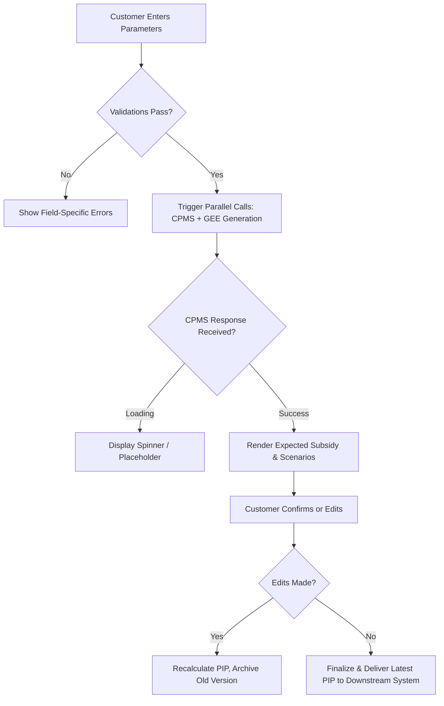

# 📊 Business Domain Analysis: Financial Product Configuration & Recommendation Flow

## 1. Executive Summary
The provided transcript reveals an active business and technical refinement session for a **state-subsidized savings/investment product configuration process**. The core objective is to modernize the customer journey from initial parameter entry through subsidy calculation, recommendation generation, document finalization, and downstream delivery. Key business drivers include regulatory compliance (contribution caps, child dependency rules), accurate state subsidy forecasting, parallel processing to reduce customer wait times, and strict document versioning for contract validity. Technical debates around caching, endpoint design, and UI modals are direct reflections of underlying business requirements: data accuracy, latency management, and user experience during iterative configuration.

---

## 2. Business Context
The organization offers a regulated savings product eligible for state subsidies ("Förderung"). Customers configure their savings plan (rate, interval, lump sum, children) to receive an optimized recommendation. The process involves multiple compliance checks, dynamic calculation engines, and document generation. Historically, sequential processing caused latency; the business is shifting to parallel execution. Document lifecycle management is critical: multiple configuration iterations may generate multiple versions of the product information document (PIP), but only the latest version holds contractual validity. Downstream systems require precise, filtered document delivery rather than bulk exports.

---

## 3. Key Concepts
| Concept | Business Meaning |
|---------|------------------|
| **PIP** | Product/Plan Information Paper: Core compliance & contract document containing calculation results, scenarios, and terms. |
| **GEE** | Suitability/Eligibility Declaration: Regulatory confirmation that the product matches customer profile. |
| **CPMS / PIP-Service** | Central Calculation & Subsidy Engine: Authoritative source for subsidy amounts, risk scenarios, and validation data. |
| **SAO** | Downstream Integration Target: Likely a policy administration or customer communication system receiving final documents. |
| **Sparrate / Einmalzahlung** | Savings Rate / Lump Sum: Core input parameters driving subsidy eligibility and caps. |
| **Übertrag** | Transfer Amount: Optional additional contribution requiring explicit customer acknowledgment. |

---

## 4. Business Process
1. **Trigger:** Customer initiates product configuration (via event or UI navigation).
2. **Data Entry & Validation:** Customer inputs savings parameters, payment interval, lump sum, transfer amount, and child details. System applies validation rules in real-time.
3. **Parallel Calculation & Generation:** 
   - Backend triggers CPMS/PIP-Service for subsidy calculation & scenarios.
   - Simultaneously generates GEE (suitability declaration).
4. **UI Presentation:** Displays expected total subsidy with loading state until response arrives. Shows recommendation banner and configuration summary.
5. **Iterative Configuration:** Customer may adjust parameters on a config page, triggering PIP recalculation. Previous versions are archived for advisory records; only the latest is contract-relevant.
6. **Finalization & Delivery:** Upon confirmation, system packages documents. Only the latest PIP is forwarded to downstream system ("SAO"). GEE and prior PIPs remain in internal/advisory storage.

---

## 5. Business Rules
| Rule Category | Description | Source/Context |
|---------------|-------------|----------------|
| **Contribution Cap** | Annualized savings rate + lump sum must not exceed €6,850. | Regulatory subsidy limit |
| **Payment Interval** | Fixed at every 2 months (previously misconfigured). | Product specification |
| **Child Dependency Period** | If child <18: Kindergeld duration ends on 18th birthday. If ≥18: ends on 25th birthday. User may override. | Subsidy calculation rule |
| **Transfer Confirmation** | "Übertrag" field requires explicit checkbox confirmation before proceeding. | Compliance/audit trail |
| **Document Validity** | Only the most recently generated PIP is valid for contract submission. Older versions are advisory-only. | Contract lifecycle management |
| **Subsidy Display** | Expected total subsidy must be shown to customer before final recommendation acceptance. | Transparency requirement |

---

## 6. Decision Logic

---

## 7. Actors & Roles
| Actor | Role / Responsibility |
|-------|------------------------|
| **Customer** | Inputs savings parameters, confirms transfers, reviews recommendations, accepts terms. |
| **Advisor/Representative** | Guides configuration, oversees document generation, manages advisory records (implied). |
| **CPMS Core System** | Authoritative calculation engine for subsidies, scenarios, and validation data. |
| **Document Generator Service** | Renders GEE and PIP documents based on CPMS output and customer inputs. |
| **Downstream System ("SAO")** | Receives final contract-relevant documents; acts as policy/contract repository. |

---

## 8. Important Business Objects
| Object | Purpose | Key Attributes | Lifecycle / State |
|--------|---------|----------------|-------------------|
| **Savings Configuration** | Captures customer intent & parameters | Sparrate, Einzahlungsintervall, Einmalzahlung, Übertrag, Kinder[] | Draft → Validated → Submitted → Archived/Contracted |
| **Child Dependency Record** | Determines subsidy eligibility period | Birthdate, KindergeldEndeDate (auto-calculated, editable) | Created during config → Linked to active configuration |
| **PIP Document** | Contract & product information record | VersionID, CalculationResults, Scenarios[], Status (Draft/Active/Archived) | Generated per iteration → Latest = Active; Others = Advisory |
| **GEE Document** | Suitability/Eligibility compliance proof | CustomerProfile, ProductMatch, Timestamp | Generated once per session → Stored with advisory record |
| **Subsidy Calculation Result** | Business output from CPMS | ExpectedFörderungGesamt, Verschnittszenarien[], ValidationFlags | Requested on config change → Cached for UI & Doc generation |

---

## 9. Inputs / Outputs
| Flow | Input | Output | Business Intent |
|------|-------|--------|-----------------|
| **Configuration Entry** | Savings rate, interval, lump sum, transfer amount, child data | Validated parameter set | Ensure regulatory compliance before calculation |
| **CPMS/PIP Service Call** | Validated parameters | Expected subsidy, scenarios, validation metadata | Provide accurate forecast & risk context to customer |
| **Document Generation** | CPMS response + customer inputs | PIP PDF, GEE PDF | Produce legally binding & advisory documents |
| **Downstream Delivery** | Latest PIP document | Single PIP file payload | Ensure contract system receives only valid version |

---

## 10. Dependencies
| Dependency Type | Description | Business Impact |
|-----------------|-------------|-----------------|
| **CPMS Calculation Engine** | Required for subsidy forecast & scenario generation | Bottleneck if latency high; requires caching or split retrieval |
| **Document Rendering Service** | Converts calculation results into formatted PIP/GEE | Slow rendering impacts UX; necessitates loading states |
| **Downstream System ("SAO")** | Receives final documents via API | Requires precise filtering (latest PIP only); versioning critical |
| **Frontend State Management** | Holds async responses & user edits across steps | Stateless architecture complicates partial data display; requires careful session handling |

---

## 11. Regulatory Aspects
- **Contribution Cap Compliance:** €6,850 annual limit enforces subsidy eligibility boundaries.
- **Child Dependency Rules:** Age-based Kindergeld duration aligns with state benefit regulations.
- **Suitability Documentation (GEE):** Mandatory proof that product matches customer profile before contract execution.
- **Document Versioning & Audit Trail:** Only latest PIP is contract-valid; prior versions must be retained for advisory compliance and dispute resolution.
- **Explicit Customer Acknowledgment:** Checkbox for transfer amount ensures informed consent and audit readiness.

---

## 12. Assumptions (Marked Explicitly)
| Assumption | Confidence | Rationale |
|------------|------------|-----------|
| "PIP" = Product/Plan Information Paper | High | Standard financial documentation term; matches context of scenarios & subsidy display |
| "GEE" = Geeignetheitsprüfung/Erklärung (Suitability Declaration) | Medium-High | Common in German financial advisory; aligns with compliance discussion |
| "SAO" is a downstream policy/contract system | Medium | Acronym not defined; behavior matches integration targets for document handover |
| €6,850 limit is regulatory (e.g., Riester/Rürup) | Medium | Matches known German subsidized savings caps; business rule explicitly enforced |
| Parallel GEE & PIP execution reduces customer wait time | High | Explicitly discussed as UX/process optimization goal |

---

## 13. Missing Information
- Exact regulatory framework name (e.g., Riester, Rürup, Bausparen subsidy)
- Full API contract/Swagger for CPMS/PIP-Service (mentioned as pending)
- Downstream system ("SAO") technical interface specifications
- Error handling & fallback behavior if CPMS times out or returns invalid data
- Data retention policy for archived PIP versions
- User override validation rules for child Kindergeld end dates

---

## 14. Risks
| Risk | Business Impact | Mitigation Suggestion |
|------|-----------------|------------------------|
| **CPMS Latency / Timeout** | Customer experience degradation; recommendation delay | Implement caching, graceful fallback states, timeout handling |
| **Document Version Confusion** | Contract submitted with outdated PIP → compliance breach | Enforce strict "latest-only" delivery logic; add version stamps in UI |
| **State Management Complexity** | Lost user inputs or inconsistent subsidy display across steps | Adopt session-based state persistence; validate on each step transition |
| **Endpoint Design Fragmentation** | Duplicate CPMS calls if not cached → performance & cost overhead | Implement backend caching layer; clearly separate UI vs. document endpoints |
| **UI/UX Friction (Layer vs Modal)** | Customer confusion or abandonment during child data entry | Conduct usability testing; align with established design system patterns |

---

## 15. Open Questions
1. What is the exact regulatory product name and governing framework?
2. How should the system handle partial CPMS responses (e.g., subsidy calculated but scenarios missing)?
3. What is the maximum allowed time for document rendering before timeout/cancellation?
4. Should child Kindergeld end dates be strictly validated against current date + 7 years, or fully editable?
5. Does "SAO" require additional metadata (e.g., version ID, timestamp) alongside the PIP file?
6. How are advisory records audited if multiple PIP versions exist?

---

## 16. Suggested Next Investigation Areas
- **Regulatory Mapping:** Confirm exact subsidy product framework to validate all business rules against official guidelines.
- **CPMS Interface Specification:** Obtain Swagger/API contract to map input/output fields, error codes, and latency SLAs.
- **Document Lifecycle Policy:** Define retention periods, archival triggers, and audit trail requirements for PIP versions.
- **UX Research:** Validate child data entry pattern (layer vs modal) with target users; align with design system standards.
- **Downstream Integration Workshop:** Clarify "SAO" expectations: file format, naming convention, versioning logic, retry mechanisms.
- **State Management Architecture:** Evaluate session persistence strategies to support parallel async calls without data loss.

---

## 17. Overall Big Picture
This domain represents a **regulated financial product configuration and recommendation workflow** where business compliance, accurate subsidy forecasting, and customer transparency intersect with technical execution. The process has evolved from sequential, latency-prone steps to a parallelized, state-aware architecture. Core business value lies in:
- Ensuring regulatory compliance through strict validation rules (€6,850 cap, child dependency periods)
- Providing real-time subsidy visibility to build customer trust
- Maintaining precise document versioning for contract validity and audit readiness
- Optimizing user experience through parallel processing and clear confirmation flows

The technical debates around caching, endpoint separation, and UI components are direct manifestations of these business priorities. Success depends on aligning backend calculation reliability, frontend state management, and downstream delivery precision with the underlying regulatory and customer-centric requirements.

---
🔍 **Analyst Note:** This reconstruction synthesizes fragmented technical discussions into a coherent business architecture model. All implementation details (endpoints, caching, modals) have been translated into their corresponding business activities, dependencies, or constraints. Where assumptions were necessary, they are explicitly flagged. Ready for validation against official product documentation and regulatory guidelines.