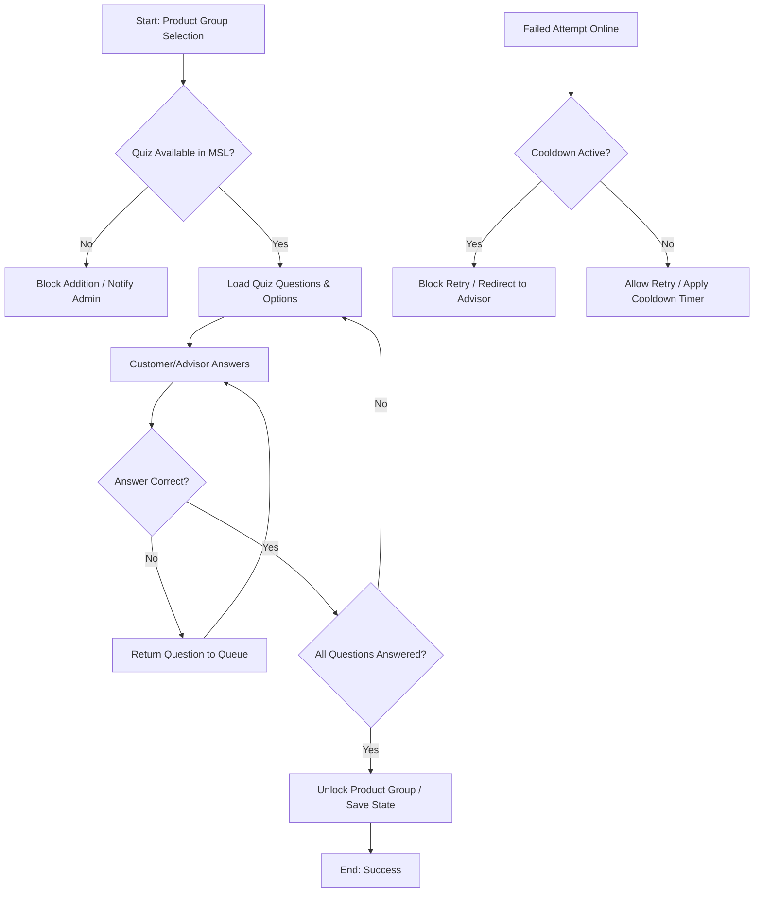

# Business Domain Analysis: Product Group Plausibility & Quiz Mechanism

## 1. Executive Summary
The organization is responding to regulatory audit findings requiring a mandatory, interactive plausibility check (quiz) for **all product groups**, not just complex ones. Previously, advisors could bypass verification via simple checkboxes. The new requirement mandates that both online customers and branch advisors must actively complete a system-driven quiz before a product group can be added to a portfolio. A secondary, optional enhancement proposes implementing a cooldown mechanism to prevent online users from repeatedly retrying failed quizzes within a short timeframe. Implementation is heavily frontend-focused, relies on centralized content delivery from MSL, and requires careful sequencing alongside technical debt remediation in the K&E-Personen module.

## 2. Business Context
Financial product distribution is subject to strict suitability and documentation obligations. Internal/external audits identified that the current plausibility verification process was too lax, allowing procedural bypasses rather than substantive customer understanding checks. To mitigate compliance risk and strengthen audit trails, the business must transition from passive acknowledgment (checkboxes) to active verification (interactive quizzes). This change affects both digital and branch channels, standardizing the customer experience while increasing operational friction that must be managed through clear UI/UX design and advisor training.

## 3. Key Concepts
| Concept | Business Definition |
|---------|---------------------|
| **Product Group** | A categorized bundle of financial products requiring suitability verification before onboarding. |
| **Plausibility Check / Quiz** | An interactive, multi-question validation step ensuring the customer understands product characteristics and risks. |
| **MSL (Master Data/Content System)** | Centralized repository providing standardized quiz questions and answer options to frontend systems. |
| **Cooldown Mechanism** | A state-persistence feature that temporarily blocks online retry attempts after a failed quiz to prevent gaming. |
| **K&E-Personen Module** | Core customer & portfolio management system currently experiencing technical debt; requires refactoring before new features are safely integrated. |

## 4. Business Process
1. **Trigger:** Customer or advisor initiates addition of a product group to a portfolio/account.
2. **Content Retrieval:** System fetches quiz data (questions + answer options) from MSL.
3. **Execution:** 
   - *Online:* Customer answers interactively.
   - *Branch:* Advisor guides customer through system-based interaction; no manual checkbox override allowed.
4. **Validation Loop:** If an answer is incorrect, the question returns to the queue for retry. All questions must be answered correctly.
5. **State Transition:** 
   - *Pass:* Product group unlocked/added to portfolio. Success state persisted.
   - *Fail + Cooldown Active (Online):* Access blocked for a defined period; customer directed to branch/advisor for assisted onboarding.
6. **Completion:** Process ends with either successful product addition or temporary block with advisory referral.

## 5. Business Rules
- **Mandatory Coverage:** Every product group must include a quiz, regardless of complexity tier.
- **No Bypass Allowed:** Advisors cannot mark plausibility as complete without interactive completion.
- **Multi-Question Support:** Product groups may contain multiple questions; all must be answered correctly before progression.
- **Retry Logic:** Incorrect answers loop back to the question queue until resolved.
- **Channel Parity:** Quiz execution is required in both online and branch channels.
- **Cooldown Policy (Optional):** Failed online attempts trigger a time-based block (e.g., 24h–7 days) to prevent rapid retries; duration may be configurable.

## 6. Decision Logic

## 7. Actors & Roles
| Actor | Role & Responsibilities |
|-------|-------------------------|
| **Customer** | Completes quiz interactively; must demonstrate understanding before product addition. |
| **Branch Advisor / Expert** | Guides customer through system quiz; cannot bypass with manual overrides; ensures compliance documentation. |
| **System (Frontend)** | Renders quiz UI, manages answer validation, handles retry loops, enforces cooldown timers. |
| **MSL Content Team** | Provides standardized question/answer data per product group; responsible for content accuracy & delivery timing. |
| **Compliance / Audit** | Defines plausibility requirements; validates that interactive checks replace procedural checkboxes. |

## 8. Important Objects
- **Product Group:** Parent entity requiring verification; owns quiz metadata.
- **Quiz Instance:** Runtime container holding active questions, answer states, and completion status.
- **Question & Answer Option:** Atomic validation units; stored centrally in MSL, consumed by frontend.
- **Customer Session / State Record:** Tracks attempt history, pass/fail outcomes, and cooldown expiration timestamps.
- **Portfolio/Account:** Target entity receiving the product group upon successful verification.

## 9. Inputs / Outputs
| Type | Description |
|------|-------------|
| **Inputs** | MSL quiz payload (questions + options), customer answers, session context, channel type (online/branch) |
| **Outputs** | Pass/Fail state, product group unlock/block signal, audit log entry, cooldown timer activation, UI feedback messages |

## 10. Dependencies
- **MSL Content Delivery:** Quiz data must be available and structured correctly before frontend implementation can proceed.
- **K&E-Personen Refactoring:** High technical debt in the core module increases risk of regression; refactoring is strongly recommended but may delay or run parallel to quiz rollout.
- **Test Automation Suite:** Playwright/Selenium tests will require updates to reflect interactive quiz flows instead of checkbox states.
- **Database/Session Storage:** Required for cooldown persistence and attempt tracking (currently missing in online flow).

## 11. Regulatory Aspects
- **Audit Compliance:** Direct response to regulatory/internal audit findings regarding lax plausibility checks.
- **Suitability Documentation:** Interactive quizzes create verifiable evidence of customer understanding, aligning with MiFID II/KYC suitability obligations.
- **Channel Standardization:** Eliminates compliance gaps between digital and branch channels where manual overrides were previously permitted.

## 12. Assumptions
| Assumption | Confidence | Rationale |
|------------|------------|-----------|
| MSL will deliver quiz data in a consistent, listable format automatically consumed by the frontend. | High | Discussed as standard integration pattern; no custom mapping required if structured correctly. |
| ~40+ product groups exist across Equity, O&F, and OTC categories. | Medium | Estimated from internal metrics; exact count may vary but does not impact architectural approach. |
| Cooldown duration (7 days vs 24h) is business-configurable rather than hardcoded. | High | Explicitly requested for flexibility; aligns with compliance risk management practices. |
| Refactoring K&E-Personen will not break existing quiz logic if done concurrently. | Medium | Developers acknowledge complexity but believe modular refactoring can coexist with feature development. |

## 13. Missing Information
- Exact data schema/contract between MSL and frontend for quiz payloads.
- Current state persistence architecture (session vs database) to determine cooldown implementation path.
- Regulatory mandate text specifying minimum plausibility standards or retention periods.
- Advisor training materials or process updates required for branch channel execution.
- Performance SLAs for quiz loading/rendering across 40+ product groups.

## 14. Risks
| Risk | Impact | Mitigation |
|------|--------|------------|
| **Technical Debt Regression** | High | Prioritize K&E-Personen refactoring; isolate quiz logic in modular components; extensive integration testing. |
| **MSL Delivery Delays** | Medium | Decouple frontend implementation from content availability; use mock data for development; establish SLA with MSL team. |
| **Customer Friction / Drop-off** | Medium | Optimize UX for quiz flow; provide clear guidance; allow offline/branch fallback for failed attempts. |
| **Test Suite Breakage** | Low-Medium | Update Playwright/Selenium early; shift from checkbox assertions to interactive state validation. |
| **Cooldown Bypass via Session Manipulation** | Medium | Store cooldown state server-side or in secure persistent storage; validate on every attempt. |

## 15. Open Questions
- What is the exact data contract and update frequency for MSL quiz content?
- Should cooldown be enforced per customer, per session, or per product group?
- How will failed attempts be logged for audit/compliance reporting?
- Will advisors receive system prompts or training aids to guide customers through quizzes?
- Is there a regulatory deadline for implementing the mandatory quiz across all channels?

## 16. Suggested Next Investigation Areas
1. **MSL Integration Specification:** Review API contracts, payload structure, and error handling for quiz data retrieval.
2. **State Management Architecture:** Evaluate current session vs database persistence to design cooldown implementation securely.
3. **Compliance Documentation Requirements:** Clarify audit trail expectations (timestamps, IP/device logs, advisor signatures).
4. **UX/Accessibility Review:** Assess quiz flow for mobile/desktop parity and branch usability constraints.
5. **Refactoring Impact Analysis:** Map K&E-Personen module boundaries to determine safe integration points for new quiz logic.

## 17. Overall Big Picture
This initiative represents a strategic shift from **procedural compliance** (checkboxes, manual overrides) to **substantive verification** (interactive, auditable customer understanding checks). It touches the core product onboarding workflow, requiring coordinated changes across frontend UI, content management (MSL), state persistence, and testing infrastructure. While technically frontend-heavy, the business impact is significant: it strengthens regulatory posture, standardizes cross-channel execution, and introduces new state-dependent behaviors (cooldowns) that will influence customer journeys and advisor workflows. Successful delivery depends on disciplined sequencing with K&E-Personen refactoring, robust MSL integration, and clear compliance documentation practices. The optional cooldown feature, while lower priority, addresses a critical vulnerability in current online flows where rapid retries could undermine the plausibility check's integrity.
