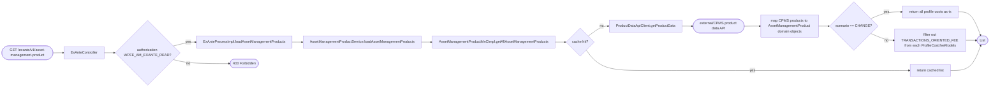
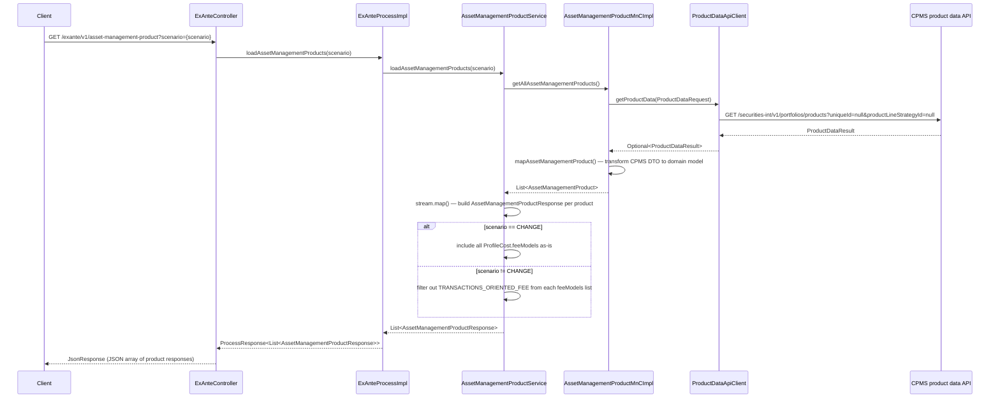

# Chain — ExAnteController · GET /exante/v1/asset-management-product

<!-- scaffold — phase 1 -->

- **Action point** — `ExAnteController` (wpfe-am / ucc-exante)
- **Kind** — rest-controller
- **Source** — `ucc-exante/src/main/java/coba/wtp/wpfe/ucc/exante/controller/ExAnteController.java`
- **Handler** — `loadAssetManagementProducts(Scenario)` — `ExAnteController.java:50`
- **Trigger** — `GET /exante/v1/asset-management-product?scenario={scenario}`
- **Preconditions** — authorization (`WPFE_AM_EXANTE_READ`) enforced by the process layer via `@PreAuthorize`; no request-body validation observed in the controller
- **First hop** — `ExAnteProcess` (wpfe-am / ucc-exante), specifically `ExAnteProcessImpl.loadAssetManagementProducts(Scenario)`

<!-- analysis — phase 2 -->

## Story

As a **retail customer opening or modifying an asset management mandate in an advisory session**, I want the full list of available asset management products with their cost structures so that the ExAnte calculator can present them for selection.

- **Given** an authenticated session carrying `WPFE_AM_EXANTE_READ` authorization
- **When** `GET /exante/v1/asset-management-product?scenario={scenario}` is called with a valid `Scenario` value (`CHANGE`, `OPENING`, or `MODIFICATION`)
- **Then** the system retrieves all asset management products from CPMS, maps them to lightweight response DTOs, and returns the list — filtering transaction-oriented fees when the scenario is not `CHANGE`
- **Unless** CPMS is unavailable — the call fails with a technical exception propagated to the client

## Chain

```text
Branch 1 · primary
  ExAnteController.loadAssetManagementProducts(Scenario)
  → ExAnteProcessImpl.loadAssetManagementProducts(Scenario)
  → AssetManagementProductService.loadAssetManagementProducts(Scenario)
  → AssetManagementProductMnCImpl.getAllAssetManagementProducts()
  → ProductDataApiClient.getProductData(ProductDataRequest)
  ⇒ [external]  CPMS product data API
```

- **Terminals reached** — `external` (CPMS product data API, via `wpfe-shared-cpms / ProductDataApiClient`)

## Diagrams

### Process flow — primary



### Sequence — primary



## Journey

When **the ExAnte frontend performs an initial page load** for a mandate change, opening, or modification scenario, the request enters at **[step 1]** to handle **loading all available asset management products**. Once that completes, the flow moves to **[step 2]** because **the process layer is responsible for business logic orchestration and authorization enforcement**. From there, **[step 3]** takes over to **fetch product data from CPMS through the MnC abstraction**, and so on through every hop until a terminal is reached or the response is assembled.

1. **ExAnteController.loadAssetManagementProducts** (wpfe-am / ucc-exante)

   **Source.** `ucc-exante/src/main/java/coba/wtp/wpfe/ucc/exante/controller/ExAnteController.java:50`

   **Role.** REST endpoint handler that receives the HTTP GET request with a `scenario` query parameter, delegates to the process layer, and wraps the result in a `JsonResponse`. The authorization check (`WPFE_AM_EXANTE_READ`) is enforced by Spring Security's `@PreAuthorize` annotation on the process method.

   **Preconditions.** Caller must be authenticated and carry `WPFE_AM_EXANTE_READ` authority. The `scenario` query parameter must be one of `CHANGE`, `OPENING`, or `MODIFICATION` (defined in `Scenario.java`).

   **On failure.** If the caller lacks authorization, Spring Security short-circuits with a 403 response before any process code runs.

   **Downstream.** Returns a `JsonResponse<List<AssetManagementProductResponse>>` to the HTTP client.

2. **ExAnteProcessImpl.loadAssetManagementProducts** (wpfe-am / ucc-exante)

   **Source.** `ucc-exante/src/main/java/coba/wtp/wpfe/ucc/exante/process/impl/ExAnteProcessImpl.java:96`

   **Role.** Process-layer orchestrator that delegates to the service layer. The `@PreAuthorize("protect('WPFE_AM_EXANTE_READ')")` annotation enforces authorization at this boundary.

   **On failure.** Authorization failure is handled by Spring Security before this method body executes.

   **Downstream.** Calls `assetManagementProductService.loadAssetManagementProducts(scenario)` and wraps the result in a `ProcessResponse<List<AssetManagementProductResponse>>`.

3. **AssetManagementProductService.loadAssetManagementProducts** (wpfe-am / ucc-exante)

   **Source.** `ucc-exante/src/main/java/coba/wtp/wpfe/ucc/exante/service/AssetManagementProductService.java:45`

   **Role.** Service-layer method that fetches the raw product list from CPMS via the MnC, then maps each `AssetManagementProduct` domain object into a lightweight `AssetManagementProductResponse` DTO. It also applies scenario-dependent filtering on profile costs.

   **Steps.**

   - **3.1 Fetch — all products from CPMS** · `AssetManagementProductService.java:46`

     **Role.** Calls `assetManagementProductMnC.getAllAssetManagementProducts()` to retrieve the full product catalogue from CPMS.

   - **3.2 Map — build response DTOs per product** · `AssetManagementProductService.java:47`

     **Role.** Streams over each `AssetManagementProduct` and builds an `AssetManagementProductResponse` using a builder pattern, extracting: `uniqueId`, `productLineStrategyId`, `productLineStrategyName`, `productLineMandate`, `productLineMandateName`, `minimumInvestments`, and `profileCosts`. The `generalAttributes` field is checked for null before accessing `minimumInvestments`.

   - **3.3 Filter — scenario-dependent profile cost treatment** · `AssetManagementProductService.java:54`

     **Role.** When `scenario == Scenario.CHANGE`, all `ProfileCost.feeModels` are returned as-is from CPMS. When the scenario is anything else (`OPENING` or `MODIFICATION`), transaction-oriented fees are filtered out by calling `filterTransactionOrientedFees()`, which removes any `FeeModel` whose `feeModelName()` equals `FeeModelName.TRANSACTIONS_ORIENTED_FEE`. This ensures that new mandate openings and modifications do not see legacy transaction-fee structures.

     **Effect.** The response list carries the same products but with a different fee model composition depending on the scenario. Nothing is dropped — only fees within each product's profile costs are removed.

4. **AssetManagementProductMnCImpl.getAllAssetManagementProducts** (wpfe-am / wpfe-am-commons)

   **Source.** `wpfe-am-commons/src/main/java/coba/wtp/wpfe/am/commons/mnc/impl/AssetManagementProductMnCImpl.java:53`

   **Role.** Map-and-Call layer that requests product data from CPMS via the API client, then maps the Swagger-generated `ProductDataResult` into domain-level `AssetManagementProduct` objects. The method is annotated with `@Cacheable(value = "getAllAssetManagementProducts", cacheManager = "assetManagementProductCache")`, so repeated calls may return cached results without hitting CPMS.

   **On failure.** If CPMS returns an error, the exception propagates from the API client through this layer. The method logs how many products were loaded (or that none were delivered) but does not swallow failures.

   **Steps.**

   - **4.1 Request — fetch product data from CPMS** · `AssetManagementProductMnCImpl.java:56`

     **Role.** Calls `productDataApi.getProductData()` with a `ProductDataRequest` carrying the current channel, request ID, and authentication context. Both `uniqueId` and `productLineStrategyId` are null because this endpoint retrieves all products.

   - **4.2 Map — transform CPMS DTO to domain model** · `AssetManagementProductMnCImpl.java:73`

     **Role.** For each `AssetManagementProduct` in the CPMS response, calls `mapAssetManagementProduct()` which recursively maps nested structures: `GeneralAttributes` (benchmark, allocation strategy, minimum investments, further agreements flags), `ProfileCosts` (investment volume thresholds and fee models), `TargetMarketAttributes`, and `SustainabilityAttributes`. Each sub-object is mapped field-by-field from the CPMS Swagger-generated type to the domain model.

     **Effect.** Produces a `List<AssetManagementProduct>` ready for service-layer consumption. The mapping preserves all data from CPMS without filtering or transformation beyond type conversion (e.g., `FeeModelNameEnum` string values are converted to `FeeModelName` enum via a switch).

5. **ProductDataApiClient.getProductData** (wpfe-shared / wpfe-shared-cpms)

   **Source.** `wpfe-shared/wpfe-shared-cpms/src/main/java/coba/wtp/wpfe/shared/cpms/api/productData/ProductDataApiClient.java:42`

   **Role.** HTTP API client that sends a GET request to the CPMS product data endpoint using Spring's RestTemplate. It builds the URL from a configurable base URL plus fixed path segments, attaches standard headers (channel, activity ID, machine name), and deserializes the JSON response into `ProductDataResult`.

   **Preconditions.** The `baseUrl` is injected via `@Value("${cpms.productData.baseUrl}")`. Authentication context comes from `SecurityContextHolder.getContext().getAuthentication()` at call time.

   **On failure.** Fatal — any exception during the HTTP exchange (connection error, timeout, 5xx response) is wrapped in a `TechnicalException` and re-thrown. No retry or fallback logic exists in this client.

   **Terminal — external**

   The outbound call goes to:
   ```
   GET {cpms.productData.baseUrl}/securities-int/v1/portfolios/products?uniqueId=null&productLineStrategyId=null
   ```
   Headers: `X-CCB-Channel` (from ApplicationContextProvider), `Coba-ActivityId` (request ID from ApplicationContextProvider), `Coba-MachineName` (hostname), `Accept: application/json;charset=UTF-8`.

6. **CPMS product data API** (external system)

   **Role.** The CPMS (Central Portfolio Management System) investment operations API that serves the master catalogue of asset management products. Returns a `ProductDataResult` containing a list of `AssetManagementProduct` objects, each with full cost structure, target market attributes, and sustainability data.

   **Terminal — external**

   Response path template:
   ```
   /securities-int/v1/portfolios/products?uniqueId={uniqueId}&productLineStrategyId={productLineStrategyId}
   ```
   The response body is a `ProductDataResult` containing `List<AssetManagementProduct>` — the full product catalogue when both query parameters are null.

## Data reached

- **external — CPMS product data API, via `ProductDataApiClient` (wpfe-shared / wpfe-shared-cpms)**
  - Business problem solved — As the **ExAnte frontend**, I need the complete list of asset management products with their cost structures so that customers can browse and select a product for mandate opening, modification, or change. Therefore we call this API at `GET /securities-int/v1/portfolios/products?uniqueId={uniqueId}&productLineStrategyId={productLineStrategyId}` to retrieve the full product catalogue from CPMS. Then we map each product through its nested cost and attribute structures (general attributes, profile costs with fee models, target market attributes, sustainability attributes), so we can present them in the ExAnte calculator — citing `AssetManagementProductMnCImpl.java:73` for the mapping logic.

  - **Request path**
    ```json
    {
      "uniqueId": null,
      "productLineStrategyId": null
    }
    ```
    Both parameters are null because this endpoint retrieves all products, not a single product. The request also carries HTTP headers: `X-CCB-Channel` (from ApplicationContextProvider), `Coba-ActivityId` (request ID from ApplicationContextProvider), and `Coba-MachineName` (hostname).

  - **Request body** — none (GET request with query parameters only).

  - **Response fields used**
    ```json
    {
      "productData": [
        {
          "id": "AM-001",
          "productLineStrategyId": "PLS-001",
          "productLineStrategyName": "Efficient Growth",
          "productLineMandate": "EFF",
          "productLineMandateName": "Efficient Mandate",
          "generalAttributes": {
            "benchmark": [{"wkn": "DE0008469008", "quota": 50.0}],
            "defaultAllocationStrategy": {"neutralRiskQuota": 50.0, "maximumStockQuota": 70.0, "maximumCurrencyQuota": 30.0},
            "minimumInvestments": {"display": 10000, "sales": 10000, "technical": 10000},
            "furtherAgreementsAllowed": true,
            "newCustomerAllowed": true,
            "mandateChangeAllowed": true,
            "strategyChangeAllowed": true,
            "overallSustainabilityPreferences": null,
            "onlyInternationalClients": false,
            "usPersonProduct": false,
            "vvFlexProduct": false,
            "isProductfinderProduct": false
          },
          "profileCosts": [
            {
              "investmentVolumeThresholdFrom": 0,
              "investmentVolumeThresholdTo": 100000,
              "feeModel": [
                {
                  "feeModelName": "ALL_IN_FEE",
                  "costComponentsPerUnit": [
                    {"costComponentEnum": "ASSET_MANAGEMENT_FEE_RATE", "value": 0.008},
                    {"costComponentEnum": "PROFIT_SHARE_RATE", "value": 0.15},
                    {"costComponentEnum": "MINIMUM_FEE", "value": 50.0}
                  ]
                }
              ]
            }
          ],
          "targetMarketAttributes": {
            "customerClassification": ["1", "2", "3"],
            "investmentGoal": "GROWTH",
            "investmentHorizon": "LONG_TERM",
            "minimumFinancialLossCapacity": "LOW",
            "minimumKnowledgeAndExperience": "BASIC",
            "minimumReturnProfile": "MODERATE",
            "minimumRiskProfile": "MEDIUM",
            "productGroups": ["STANDARD"],
            "salesStrategy": "ADVISORY"
          },
          "sustainabilityAttributes": {
            "categoryA": null,
            "categoryB": null,
            "categoryC": {"isCategoryC": false, "principleAdverseImpactAggregate": null},
            "quotaForPortfolio": 0.0
          }
        }
      ]
    }
    ```
    All fields from the CPMS response are mapped through `AssetManagementProductMnCImpl.java:73-185` — benchmark, allocation strategy, minimum investments, all agreement flags, profile costs with nested fee models and cost components per unit, target market attributes (customer classification as integer list, investment goal/horizon/risk/return profiles), and sustainability attributes (category A/B/C). No field is discarded at the MnC level.

  - **Response fields discarded** — none observed. The MnC maps every CPMS response field into the domain model.

## Acceptance Criteria

1. **Authenticated user receives all asset management products from CPMS** — Given an authenticated session with `WPFE_AM_EXANTE_READ` authority, when `GET /exante/v1/asset-management-product?scenario=CHANGE` is called, then the response contains a JSON array of `AssetManagementProductResponse` objects, each carrying `uniqueId`, `productLineStrategyId`, `productLineStrategyName`, `productLineMandate`, `productLineMandateName`, `minimumInvestments`, and `profileCosts`.
   - Evidence: `ExAnteController.java:50-53`, `AssetManagementProductService.java:47-62`
   - How to: call the endpoint with a valid session and assert that the response body is a non-empty JSON array where each element contains all seven fields. Verify against CPMS product catalogue.

2. **Authorization is enforced before any business logic runs** — Given an unauthenticated or unauthorized caller, when `GET /exante/v1/asset-management-product?scenario=CHANGE` is called, then the request is rejected with 403 Forbidden by Spring Security before `ExAnteProcessImpl.loadAssetManagementProducts()` executes.
   - Evidence: `ExAnteController.java:50`, `ExAnteProcessImpl.java:95`
   - How to: call the endpoint without authentication or without `WPFE_AM_EXANTE_READ` authority and confirm a 403 response is returned. Confirm from logs that no CPMS call was made.

3. **Scenario CHANGE returns all profile costs including transaction-oriented fees** — Given a valid request with `scenario=CHANGE`, when the endpoint is called, then each product's `profileCosts` list contains all fee models from CPMS, including those with `feeModelName = TRANSACTIONS_ORIENTED_FEE`.
   - Evidence: `AssetManagementProductService.java:54-55`
   - How to: call the endpoint with `scenario=CHANGE`, parse the response JSON, and confirm that at least one product's profile cost fee models list contains a `TRANSACTIONS_ORIENTED_FEE` entry if CPMS provides one.

4. **Scenario OPENING or MODIFICATION filters out transaction-oriented fees** — Given a valid request with `scenario=OPENING` or `scenario=MODIFICATION`, when the endpoint is called, then each product's `profileCosts` list excludes any fee model whose `feeModelName` equals `TRANSACTIONS_ORIENTED_FEE`.
   - Evidence: `AssetManagementProductService.java:56-61`, `filterTransactionOrientedFees()` at line 73
   - How to: call the endpoint with `scenario=OPENING`, parse the response, and confirm that no product's profile cost fee models list contains a `TRANSACTIONS_ORIENTED_FEE` entry. Compare against the CHANGE scenario response for the same products.

5. **CPMS failure propagates as a technical exception** — Given CPMS is unavailable or returns an error (e.g., 5xx), when the endpoint is called, then the request fails with a `TechnicalException` wrapping the underlying HTTP error, and no product list is returned.
   - Evidence: `ProductDataApiClient.java:56-61`
   - How to: stub the CPMS endpoint to return 500 or drop connections, call the ExAnte endpoint, and confirm a 5xx response with a technical exception in the error body. Confirm from logs that no products were returned.

6. **Results are cached on repeated calls** — Given the same user calls `GET /exante/v1/asset-management-product?scenario=CHANGE` twice in succession, when the second call executes, then the MnC returns results from the `getAllAssetManagementProducts` cache without making a new HTTP request to CPMS.
   - Evidence: `AssetManagementProductMnCImpl.java:52` (`@Cacheable(value = "getAllAssetManagementProducts", cacheManager = "assetManagementProductCache")`)
   - How to: call the endpoint twice in quick succession and check application logs for two separate "sending request to get product data" messages. Only one should appear if caching is active.

7. **Minimum investments are null-safe** — Given a CPMS product whose `generalAttributes` field is null, when the endpoint is called, then the response still includes that product with `minimumInvestments: null` rather than throwing a NullPointerException.
   - Evidence: `AssetManagementProductService.java:51-53`
   - How to: stub CPMS to return a product with `generalAttributes: null`, call the endpoint, and confirm the response contains the product with `minimumInvestments` set to null.

## Business Takeaways

- **What this does for the business** — retrieves the full asset management product catalogue from CPMS and presents it to the ExAnte frontend for mandate opening, modification, or change scenarios. For non-change scenarios, transaction-oriented fees are stripped so customers see only the relevant fee structure.
- **Depends on** — CPMS product data API (external, returns the complete AM product catalogue with cost structures); Spring Security authorization (`WPFE_AM_EXANTE_READ`)
- **Ingredients** — `scenario` (query parameter: CHANGE, OPENING, or MODIFICATION), authentication context (session)
- **Preparation** — fetch all products from CPMS via a cached MnC call, map the full product catalogue through nested cost and attribute structures
- **Dish** — `List<AssetManagementProductResponse>` with uniqueId, strategy identifiers, mandate info, minimum investments, and profile costs (fee models filtered by scenario)


