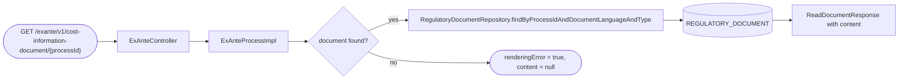
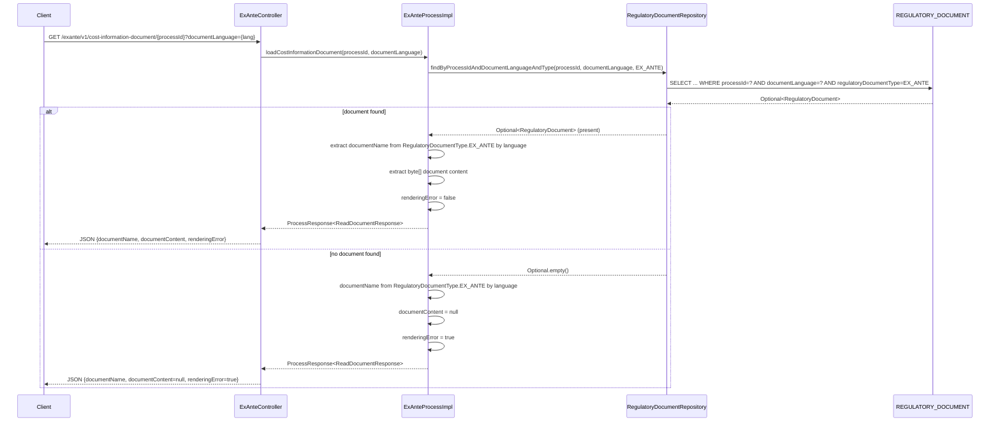

# Chain — ExAnteController · GET /exante/v1/cost-information-document/{processId}

<!-- scaffold — phase 1 -->

- **Action point** — `ExAnteController` (wpfe-am / ucc-exante)
- **Kind** — rest-controller
- **Source** — `ucc-exante/src/main/java/coba/wtp/wpfe/ucc/exante/controller/ExAnteController.java`
- **Handler** — `loadCostInformationDocument(String, DocumentLanguage)` — `ExAnteController.java:103`
- **Trigger** — `GET /exante/v1/cost-information-document/{processId}?documentLanguage={documentLanguage}`
- **Preconditions** — authorization (`WPFE_AM_EXANTE_READ`) enforced by the process layer via `@PreAuthorize`; no request-body validation observed in the controller
- **First hop** — `ExAnteProcess` (wpfe-am / ucc-exante), specifically `ExAnteProcessImpl.loadCostInformationDocument(String, DocumentLanguage)`

<!-- analysis — phase 2 -->

## Story

As a **retail customer in an advisory session**, I want to retrieve the ex-ante cost information document that was previously generated for my process so that I can review or re-download it.

- **Given** a valid `processId` identifying a completed ex-ante calculation and a `documentLanguage` (DE or EN)
- **When** `GET /exante/v1/cost-information-document/{processId}?documentLanguage={documentLanguage}` is called with authorization (`WPFE_AM_EXANTE_READ`)
- **Then** the system returns the document name, its binary PDF content, and a rendering-error flag
- **Unless** no document exists for that process ID and language — in which case `renderingError` is set to `true` and `documentContent` is null

## Chain

```text
Branch 1 · primary
  ExAnteController.loadCostInformationDocument(String, DocumentLanguage)
  → ExAnteProcessImpl.loadCostInformationDocument(String, DocumentLanguage)
  → RegulatoryDocumentRepository.findByProcessIdAndDocumentLanguageAndType(String, DocumentLanguage, RegulatoryDocumentType)
  ⇒ [db] REGULATORY_DOCUMENT table (wpfe-am / wpfe-am-commons)
```

- **Terminals reached** — `db` (`REGULATORY_DOCUMENT` table via Spring Data JPA in wpfe-am-commons)

## Diagrams

### Process flow — primary



### Sequence — primary



## Journey

When **[the client fires a GET request]**, the request enters at **[step 1]** to handle **[loading an ex-ante cost information document by process ID and language]**. Once that completes, the flow moves to **[step 2]** because **[authorization must be verified before any data is returned]**. From there, **[step 3]** takes over to **[query the database for the persisted PDF document]**, and so on through every hop until a terminal is reached or the response is assembled.

1. **ExAnteController.loadCostInformationDocument** (wpfe-am / ucc-exante)

   **Source.** `ucc-exante/src/main/java/coba/wtp/wpfe/ucc/exante/controller/ExAnteController.java:103`

   **Role.** Receives the HTTP GET request carrying a `processId` path parameter and a `documentLanguage` query parameter, then delegates to the process layer. No request-body validation is performed — only the two parameters are extracted from the URL.

   **Preconditions.** Authorization (`WPFE_AM_EXANTE_READ`) enforced by Spring Security's `@PreAuthorize` on the downstream process method; if unauthorized, the framework rejects before the process method body executes.

   **Effect.** Passes `processId` and `documentLanguage` to `exAnteProcess.loadCostInformationDocument()` and wraps whatever `ProcessResponse<ReadDocumentResponse>` is returned into a JSON `JsonResponse` via `JsonResponseBuilder.buildJsonResultResponse()`.

2. **ExAnteProcessImpl.loadCostInformationDocument** (wpfe-am / ucc-exante)

   **Source.** `ucc-exante/src/main/java/coba/wtp/wpfe/ucc/exante/process/impl/ExAnteProcessImpl.java:187`

   **Role.** Queries the regulatory document store for a previously generated ex-ante cost information PDF matching the given process ID, language, and type (`EX_ANTE`). Assembles a `ReadDocumentResponse` containing the document name (language-dependent), the raw PDF byte array, and a rendering-error flag.

   **Preconditions.** Authorization gate already passed by Spring Security at step 1.

   **On failure.** If the repository returns `Optional.empty()` — meaning no document was ever generated for this process ID and language combination — the method does not throw. Instead it produces a response with `documentContent = null` and `renderingError = true`, signaling to the caller that the document needs to be regenerated.

   **Effect.** Constructs a `ReadDocumentResponse` with three fields:
   - `documentName`: resolved from `RegulatoryDocumentType.EX_ANTE.getDocumentNameByLanguage(documentLanguage)` — either "Kosteninformation-vor-Abschluss-der-Vermögensverwaltung.pdf" (DE) or "cost-information-before-conclusion-of-asset-management.pdf" (EN).
   - `documentContent`: the raw PDF byte array from `RegulatoryDocument.getDocument()`, or null if not found.
   - `renderingError`: true when no document exists, false when one is returned.

3. **RegulatoryDocumentRepository.findByProcessIdAndDocumentLanguageAndType** (wpfe-am / wpfe-am-commons)

   **Source.** `wpfe-am-commons/src/main/java/coba/wtp/wpfe/am/commons/repository/RegulatoryDocumentRepository.java:58`

   **Role.** Executes a JPQL query that joins the `REGULATORY_DOCUMENT` entity with its `archivedDocumentDataList`, filtering on three criteria: exact `processId`, exact `documentLanguage`, and `regulatoryDocumentType = EX_ANTE`. Returns an `Optional<RegulatoryDocument>` — present if a matching document row exists, empty otherwise.

   **Preconditions.** The calling code supplies all three filter values; no session or authentication context is needed at this layer.

   **On failure.** A database connection error propagates as a Spring Data JPA exception (no retry or fallback in the repository). An empty result set yields `Optional.empty()`, not an error — this is the expected path when a document has not yet been generated.

   **Terminal — db**

   The query targets the `REGULATORY_DOCUMENT` table, which stores PDF documents as LOB (`byte[]`) columns. The entity maps to:
   - `ID` (primary key, sequence-generated)
   - `PROCESS_ID` (indexed for lookup)
   - `REGULATORY_DOCUMENT_TYPE` (enum: EX_ANTE or SUITABILITY)
   - `DOCUMENT_LANGUAGE` (enum: DE or EN)
   - `DOCUMENT` (LOB column holding the raw PDF bytes)
   - `UPDATED` (auto-timestamp)
   - `archivedDocumentDataList` (one-to-many child table, eagerly fetched via JPQL `left join fetch`)

4. **Response assembly** (wpfe-am / ucc-exante)

   **Source.** `ucc-exante/src/main/java/coba/wtp/wpfe/ucc/exante/process/impl/ExAnteProcessImpl.java:190`

   **Role.** Maps the repository result into a `ReadDocumentResponse` DTO. If the optional is present, extracts the document name (language-dependent) and the PDF byte array; if absent, sets content to null and error flag to true.

   **Effect.** Wraps the response in a `ProcessResponse<ReadDocumentResponse>` which the controller serializes as JSON back to the client.

## Data reached

- **db — REGULATORY_DOCUMENT table, via Spring Data JPA (wpfe-am / wpfe-am-commons)**
  - Business problem solved — As the **ex-ante document retrieval process**, I need the previously generated ex-ante cost information PDF to be able to return it to the client for review or re-download. Therefore we query `REGULATORY_DOCUMENT` via `RegulatoryDocumentRepository.findByProcessIdAndDocumentLanguageAndType(processId, documentLanguage, EX_ANTE)` for the document row matching this process ID and language, so we can serve the PDF bytes back — citing every file where that data actually gets used: `ExAnteProcessImpl.java:187` reads the result and maps it into a `ReadDocumentResponse`, which the controller serializes as JSON.

  - **Query** — `findByProcessIdAndDocumentLanguageAndType(processId, documentLanguage, EX_ANTE)` — read-only JPQL query with an eager join fetch on `archivedDocumentDataList`.
    ```sql
    select doc from RegulatoryDocument doc
    left join fetch doc.archivedDocumentDataList
    where doc.processId = ?1
      and doc.documentLanguage = ?2
      and doc.regulatoryDocumentType = ?3
    ```

  - **Arguments**
    ```json
    {
      "processId": "a1b2c3d4-5678-90ab-cdef-1234567890ab",
      "documentLanguage": "DE",
      "regulatoryDocumentType": "EX_ANTE"
    }
    ```
    `processId` ← request path parameter, origin: the client that initiated the ex-ante calculation.
    `documentLanguage` ← request query parameter, origin: the UI's language selection (DE or EN).
    `regulatoryDocumentType` ← constant `EX_ANTE`, hardcoded in the caller to filter for cost-information documents only.

  - **Response fields used**
    ```json
    {
      "id": 42,
      "processId": "a1b2c3d4-5678-90ab-cdef-1234567890ab",
      "regulatoryDocumentType": "EX_ANTE",
      "documentLanguage": "DE",
      "document": "[PDF bytes, e.g. 0x25504446 for %PDF header]",
      "updated": "2025-06-15T10:30:00"
    }
    ```
    `processId` → the join key (Journey step 3).
    `documentLanguage` → the join key (Journey step 3).
    `regulatoryDocumentType` → the join key, always EX_ANTE in this query.
    `DOCUMENT` (byte[]) → mapped to `ReadDocumentResponse.documentContent` at `ExAnteProcessImpl.java:192`, consumed by the client as the PDF payload.
    `updated` → not used in this chain; only relevant for the sibling method `findByProcessIdAndType` which selects the newest document per type.

  - **Response fields discarded** — `id`, `archivedDocumentDataList` (the eager-joined child collection is fetched but never consumed by this chain), and `updated`.

## Acceptance Criteria

1. **Existing document returned with content** — Given a valid `processId` for which an ex-ante cost information PDF was previously generated, when the GET request is called with the matching `documentLanguage`, then the response contains the correct document name (language-dependent), the full PDF byte array in `documentContent`, and `renderingError = false`.
   - Evidence: `ExAnteProcessImpl.java:187-194`
   - How to: read `loadCostInformationDocument()` end to end; confirm that when `regulatoryDocument.isPresent()`, the response is built with `documentName` from `RegulatoryDocumentType.EX_ANTE.getDocumentNameByLanguage(documentLanguage)`, `documentContent` from `regulatoryDocument.get().getDocument()`, and `renderingError = false`. To reproduce: generate an ex-ante document for a process, then call this endpoint with the same `processId` and confirm the response body contains non-null `documentContent`.

2. **Missing document returns error flag** — Given a `processId` for which no ex-ante cost information PDF exists (or it was generated in a different language), when the GET request is called, then the response has `renderingError = true`, `documentContent = null`, and the correct document name.
   - Evidence: `ExAnteProcessImpl.java:193`
   - How to: at line 193, read the `.isEmpty()` branch of the ternary; confirm it sets `renderingError` to `true` and passes `null` for content. To reproduce: call this endpoint with a `processId` that has no EX_ANTE document (e.g., one from a different process type or never calculated), and assert on `renderingError == true`.

3. **Unauthorized request is rejected before database access** — Given an unauthenticated or insufficiently-privileged caller, when the GET request is made, then Spring Security rejects it with 401/403 before any repository query executes.
   - Evidence: `ExAnteProcessImpl.java:187` — `@PreAuthorize("protect('WPFE_AM_EXANTE_READ')")`
   - How to: open the method annotation at line 187 and confirm the security expression requires `WPFE_AM_EXANTE_READ`. To reproduce: call this endpoint without the required authorization role and confirm a 403 response with no database query in the logs.

4. **Document name is language-dependent** — Given DE as `documentLanguage`, when an existing document is found, then `documentName` is "Kosteninformation-vor-Abschluss-der-Vermögensverwaltung.pdf"; given EN, it is "cost-information-before-conclusion-of-asset-management.pdf".
   - Evidence: `RegulatoryDocumentType.java:27-30` — the `getDocumentNameByLanguage()` switch returns german or english name based on language enum value.
   - How to: read `RegulatoryDocumentType.getDocumentNameByLanguage()` and confirm the DE/EN branching. To reproduce: call this endpoint with `documentLanguage=DE` and `documentLanguage=EN` for the same process, and assert that `documentName` differs between calls.

5. **Repository query uses exact match on all three filter fields** — Given a `processId`, `documentLanguage`, and type EX_ANTE, when the repository method is called, then only rows matching all three criteria are returned (at most one row due to the unique constraint).
   - Evidence: `RegulatoryDocumentRepository.java:58-62` — JPQL query with `WHERE doc.processId = ?1 AND doc.documentLanguage = ?2 AND doc.regulatoryDocumentType = ?3`.
   - How to: read the `@Query` annotation at line 58 and confirm all three equality predicates. To reproduce: insert two documents for the same process ID but different languages, then query each language separately and confirm only one row is returned per call.

## Business Takeaways

- **What this does for the business** — retrieves a previously generated ex-ante cost information PDF (the "Kosteninformation") from persistent storage so that an advisor or customer can review or re-download it during an advisory session. The document is language-specific: German customers see the German version, English-speaking ones get the English version.

- **Depends on** — the `REGULATORY_DOCUMENT` database table (read-only), which stores PDF documents as binary LOB columns keyed by process ID and document type.

- **Ingredients** — `processId` (request path parameter, from the client that initiated the ex-ante calculation), `documentLanguage` (request query parameter, DE or EN).

- **Preparation** — Spring Security verifies `WPFE_AM_EXANTE_READ` authorization; the repository queries for a matching EX_ANTE document by process ID and language.

- **Dish** — JSON response with `documentName`, `documentContent` (PDF bytes), and `renderingError` flag. If no document exists, content is null and error is true, signaling that the document needs to be regenerated via the POST endpoint.

