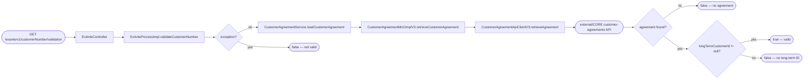
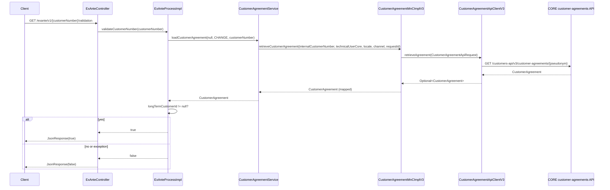

# Chain — ExAnteController · GET /exante/v1/{customerNumber}/validation

<!-- scaffold — phase 1 -->

- **Action point** — `ExAnteController` (wpfe-am / ucc-exante)
- **Kind** — rest-controller
- **Source** — `ucc-exante/src/main/java/coba/wtp/wpfe/ucc/exante/controller/ExAnteController.java`
- **Handler** — `validateCustomerNumber(String)` — `ExAnteController.java:66`
- **Trigger** — `GET /exante/v1/{customerNumber}/validation`
- **Preconditions** — authorization (`WPFE_AM_EXANTE_READ`) enforced by the process layer via `@PreAuthorize`; no request-body validation observed in the controller
- **First hop** — `ExAnteProcess` (wpfe-am / ucc-exante), specifically `ExAnteProcessImpl.validateCustomerNumber(String)`

<!-- analysis — phase 2 -->

## Story

As a **retail customer navigating the Ex-Ante cost calculator**, I want my short-term customer number validated against CORE so that the system can confirm I have an active long-term account before proceeding.

- **Given** a session with `WPFE_AM_EXANTE_READ` authorization
- **When** `GET /exante/v1/{customerNumber}/validation` is called with a short-term (internal) customer number
- **Then** the system checks whether that number maps to a long-term customer ID in CORE
- **If** it does, the response is `true`; if not or on any error, the response is `false`

## Chain

```text
Branch 1 · primary
  ExAnteController.validateCustomerNumber(String)
  → ExAnteProcessImpl.validateCustomerNumber(String)
  → CustomerAgreementService.loadCustomerAgreement(String, Scenario, String)
  → CustomerAgreementMnCImplV3.retrieveCustomerAgreement(String, String, Locale, String, String)
  → CustomerAgreementApiClientV3.retrieveAgreement(CustomerAgreementApiRequest)
  ⇒ [external]  CORE customer-agreements API (wpfe-shared / wpfe-shared-customer)
```

- **Terminals reached** — `external` (CORE customer-agreements API, via `CustomerAgreementApiClientV3` in wpfe-shared / wpfe-shared-customer)

## Diagrams

### Process flow — primary



### Sequence — primary



## Journey

When **the Ex-Ante page loads and needs to confirm the customer has a valid CORE account**, the request enters at **[step 1]** to handle **customer-number validation for the short-term (internal) number supplied by the frontend**. Once that completes, the flow moves to **[step 2]** because **the controller delegates all business logic to the process layer**.

1. **ExAnteController.validateCustomerNumber(String)** (wpfe-am / ucc-exante)

   **Source.** `ucc-exante/src/main/java/coba/wtp/wpfe/ucc/exante/controller/ExAnteController.java:66`

   **Role.** Receives the customer number from the URL path and delegates to the process layer for validation. Wraps the result in a `JsonResponse<Boolean>`.

   **Preconditions.** Authorization (`WPFE_AM_EXANTE_READ`) is enforced by `@PreAuthorize` on the process method, not here.

   **Downstream.** `ExAnteProcessImpl.validateCustomerNumber(String)`

2. **ExAnteProcessImpl.validateCustomerNumber(String)** (wpfe-am / ucc-exante)

   **Source.** `ucc-exante/src/main/java/coba/wtp/wpfe/ucc/exante/process/impl/ExAnteProcessImpl.java:120`

   **Role.** Validates the customer number by loading the associated CORE agreement and checking whether a long-term customer ID exists. Returns `true` if the mapping is present, `false` otherwise.

   **Preconditions.** `WPFE_AM_EXANTE_READ` authorization enforced via `@PreAuthorize` on this method (line 119).

   **On failure.** Any exception from the service layer — network error, CORE outage, malformed response — is caught at line 128. The exception is logged with `LOG.warn("Customer number is not valid.")` and `false` is returned. No retry or fallback logic exists; a transient failure is treated as invalid.

   **Effect.** Irreversible: the boolean result is returned to the caller. No side effects beyond logging.

   **Steps.**

   - **2.1 Load customer agreement** · `ExAnteProcessImpl.java:122`
     **Role.** Calls `customerAgreementService.loadCustomerAgreement(null, Scenario.CHANGE, customerNumber)`. The `processId` is passed as `null` (only needed for logging during archiving). `Scenario.CHANGE` indicates this validation occurs in the CHANGE process context.

   - **2.2 Check long-term ID** · `ExAnteProcessImpl.java:125`
     **Role.** Evaluates `customerAgreement.getLongTermCustomerId() != null`. A non-null value means the short-term number maps to a real CORE account; `null` means no agreement was found or the agreement has no long-term ID.

3. **CustomerAgreementService.loadCustomerAgreement(String, Scenario, String)** (wpfe-am / wpfe-am-commons)

   **Source.** `wpfe-am-commons/src/main/java/coba/wtp/wpfe/am/commons/service/exante/CustomerAgreementService.java:28`

   **Role.** Acts as the service-layer bridge between the process and the MnC. Supplies the technical user identity (`api.core.technicalUser` config value), locale, channel, and request ID from `ApplicationContextProvider`, then delegates to the MnC.

   **On failure.** Any exception from the MnC is logged with `LOG.error(...)` at line 38-42 (including scenario and processId context) and re-thrown. No retry or fallback — the caller (process impl) handles it.

   **Downstream.** `CustomerAgreementMnCImplV3.retrieveCustomerAgreement(String, String, Locale, String, String)`

4. **CustomerAgreementMnCImplV3.retrieveCustomerAgreement(String, String, Locale, String, String)** (wpfe-shared / wpfe-shared-customer)

   **Source.** `wpfe-shared-customer/src/main/java/coba/wtp/wpfe/shared/customer/v1/mnc/impl/CustomerAgreementMnCImplV3.java:82`

   **Role.** Maps the external API request parameters into a `CustomerAgreementApiRequest`, calls the API client, then maps the raw API response (`coba.wtp.wpfe.shared.customer.api.model.agreement.v3.CustomerAgreement`) into the domain `CustomerAgreement` object. This is the Map-and-Call step: it translates between Swagger-generated DTOs and Coba's domain model.

   **Steps.**

   - **4.1 Build API request** · `CustomerAgreementMnCImplV3.java:108`
     **Role.** Creates a `CustomerAgreementApiRequest` with channel, requestId, comsiId (technical user), and internalCustomerNumber.

   - **4.2 Call API client** · `CustomerAgreementMnCImplV3.java:90`
     **Role.** Calls `customerAgreementApiClient.retrieveAgreement(request)`, which returns an `Optional<CustomerAgreement>` from the CORE API.

   - **4.3 Map — customer ID and long-term ID** · `CustomerAgreementMnCImplV3.java:92-105`
     **Role.** Extracts `customerId` (the original internal number), `tenant`, and critically `longTermCustomerId` from the agreement's `uniqueAgreementId`. If no agreement is found, these fields are set to `null`.

   - **4.4 Map — type of customer** · `CustomerAgreementMnCImplV3.java:106-112`
     **Role.** Extracts the `typeOfCustomer` key value from the API response.

   - **4.5 Map — type of agreement** · `CustomerAgreementMnCImplV3.java:113-119`
     **Role.** Extracts the `typeOfAgreement` key value.

   - **4.6 Map — customer typology** · `CustomerAgreementMnCImplV3.java:120-126`
     **Role.** Extracts the `customerTypology` key value.

   - **4.7 Map — status** · `CustomerAgreementMnCImplV3.java:127-133`
     **Role.** Extracts the raw agreement status string.

   - **4.8 Map — agreement roles** · `CustomerAgreementMnCImplV3.java:134-140`
     **Role.** Maps each `AgreementRole` from the API response, including owner name (first/last/legal), role key and label, and address ID.

   - **4.9 Map — shipment addresses** · `CustomerAgreementMnCImplV3.java:141-147`
     **Role.** Maps additional addresses and alternate shipping address into `ShipmentAddress` objects, resolving country labels via `KeysMnC`.

5. **CustomerAgreementApiClientV3.retrieveAgreement(CustomerAgreementApiRequest)** (wpfe-shared / wpfe-shared-customer)

   **Source.** `wpfe-shared-customer/src/main/java/coba/wtp/wpfe/shared/customer/api/agreement/CustomerAgreementApiClientV3.java:48`

   **Role.** Builds the REST URL by pseudonymizing the customer number, then issues an HTTP GET to the CORE customer-agreements endpoint. Results are cached via `@Cacheable` on the method.

   **Steps.**

   - **5.1 Build URL** · `CustomerAgreementApiClientV3.java:74`
     **Role.** Calls `pseudonymService.retrievePseudonym(channel, requestId, internalCustomerNumber)` to get a pseudonymized path identifier, then constructs the URL as `/customers-api/v3/customer-agreements/{pseudonym}`.

   - **5.2 Issue HTTP GET** · `CustomerAgreementApiClientV3.java:54`
     **Role.** Uses `RestTemplate.exchange()` with `HttpMethod.GET` to call the CORE API. Sets `ComsiId` and optional `Tenant` headers from the request.

   - **5.3 Handle response** · `CustomerAgreementApiClientV3.java:60-68`
     **Role.** On success, wraps the body in `Optional.ofNullable()`. On `HttpClientErrorException`, logs the error and returns `Optional.empty()` (a 4xx is treated as "not found"). On any other exception, re-throws it up the stack.

   **Terminal — external** · CORE customer-agreements API at `/customers-api/v3/customer-agreements/{pseudonym}`. The call goes through a Stage-appropriated `RestTemplate` bean (`api.core.restTemplate`) which routes to the API Gateway and then to the CORE system.

## Data reached

- **external — CORE customer-agreements API, via `CustomerAgreementApiClientV3` (wpfe-shared / wpfe-shared-customer)**
  - Business problem solved — As the **Ex-Ante validation process**, I need the customer's agreement record from CORE to be able to confirm that a short-term (internal) customer number maps to an active long-term account. Therefore we call this API at `GET /customers-api/v3/customer-agreements/{pseudonym}` to retrieve the customer agreement. Then we read only `uniqueAgreementId` (mapped to `longTermCustomerId`) to gate the flow on whether a real CORE account exists, so we can confirm or deny the customer number before the Ex-Ante calculator proceeds (`ExAnteProcessImpl.java:125`).

  - **Request path**
    ```json
    {
      "pseudonym": "PSEUD-8f3a9c2e"
    }
    ```
    `pseudonym` — derived from the internal customer number via `PseudonymService.retrievePseudonym(channel, requestId, internalCustomerNumber)` at `CustomerAgreementApiClientV3.java:74`. Origin: request path parameter.

  - **Request headers**
    - `ComsiId`: technical user identity (e.g., `"TECH-USER-CORE"`) — from `${api.core.technicalUser}` config, set at `CustomerAgreementApiClientV3.java:84`
    - `Tenant`: optional tenant identifier — present only if the request carries one
    - `Accept: application/json` — set at `CustomerAgreementApiClientV3.java:85`

  - **Request body** — none (GET request).

  - **Response fields used**
    ```json
    {
      "agreement": {
        "uniqueAgreementId": "LT-1234567890",
        "typeOfCustomer": { "value": "PRIVATE" },
        "typeOfAgreement": { "value": "STANDARD" }
      }
    }
    ```
    `agreement.uniqueAgreementId` → the long-term customer ID check (`ExAnteProcessImpl.java:125`). Example value inferred from DTO definition at `wpfe-shared-customer/src/main/java/coba/wtp/wpfe/shared/customer/api/model/agreement/v3/CustomerAgreement.java`.
    `agreement.typeOfCustomer.value` → stored in domain object but not consumed by this chain's validation logic.
    `agreement.typeOfAgreement.value` → stored in domain object but not consumed by this chain's validation logic.

  - **Response fields discarded** — `tenant`, `status`, `customerTypology`, `agreementRoles`, `shipmentAddresses`, and all address/role sub-fields — the API returns a full customer agreement record to use one field (`uniqueAgreementId`) for validation. This is a coupling worth noting: the entire agreement payload is fetched, mapped, and discarded except for the long-term ID.

  - **Cache behavior** — The method is annotated with `@Cacheable(value = "retrieveAgreement", ...)` at line 48. Subsequent calls with the same request ID + customer number combination are served from cache (`customerAgreementCacheManager`) without hitting CORE, reducing latency and load on the external system.

## Acceptance Criteria

1. **Valid customer number — agreement exists with long-term ID** — Given a short-term customer number that maps to an existing CORE agreement with a non-null `uniqueAgreementId`, when `GET /exante/v1/{customerNumber}/validation` is called, then the response body is `true`.
   - Evidence: `ExAnteProcessImpl.java:125` — returns `customerAgreement.getLongTermCustomerId() != null`
   - How to: read line 125 and confirm it evaluates to `true` when `getLongTermCustomerId()` returns a non-null value. To reproduce: call the endpoint with a customer number known to have an active CORE agreement, and assert the response body is `true`.

2. **Invalid customer number — no agreement found** — Given a short-term customer number that does not exist in CORE, when `GET /exante/v1/{customerNumber}/validation` is called, then the API client returns `Optional.empty()`, the MnC maps all fields to `null`, and the process returns `false`.
   - Evidence: `CustomerAgreementApiClientV3.java:64` — on `HttpClientErrorException`, returns `Optional.empty()`; `CustomerAgreementMnCImplV3.java:92-105` — `.orElse(null)` sets `longTermCustomerId` to `null`
   - How to: read the catch block at line 64 and confirm it returns empty. Follow through the mapping chain (lines 92-105) to confirm all fields default to null. To reproduce: call with a non-existent customer number and assert the response body is `false`.

3. **CORE API outage — exception propagates up** — Given that CORE is unreachable or returns a non-4xx error (e.g., 500), when `GET /exante/v1/{customerNumber}/validation` is called, then `CustomerAgreementApiClientV3` re-throws the exception at line 68, which propagates through MnC → Service → Process, where it is caught and logged.
   - Evidence: `CustomerAgreementApiClientV3.java:67-68` — catch-all Exception block re-throws; `ExAnteProcessImpl.java:128-130` — catches all exceptions and returns `false`
   - How to: read the outer try-catch at line 67-68 and confirm it does not swallow non-client errors. Follow through to `ExAnteProcessImpl.java:128` where the catch block logs "Customer number is not valid." and returns false. To reproduce: stub CORE to return 500 and confirm the endpoint returns `false` with a WARN log.

4. **Cached response serves without hitting CORE** — Given a prior call for the same customer number within the cache TTL, when `GET /exante/v1/{customerNumber}/validation` is called again, then `CustomerAgreementApiClientV3.retrieveAgreement` returns from the `retrieveAgreement` cache without making an HTTP call.
   - Evidence: `CustomerAgreementApiClientV3.java:48` — `@Cacheable(value = "retrieveAgreement", ...)` with key based on requestId + customerNumber
   - How to: read the annotation at line 48 and confirm the cache key is `#root.target.cacheKey(#request)`, which combines request ID and internal customer number. To reproduce: call twice with the same parameters within TTL and verify from network logs that only one HTTP GET occurs.

5. **Authorization enforced before validation runs** — Given a session without `WPFE_AM_EXANTE_READ`, when `GET /exante/v1/{customerNumber}/validation` is called, then Spring Security rejects the request before any process code executes.
   - Evidence: `ExAnteProcessImpl.java:119` — `@PreAuthorize("protect('WPFE_AM_EXANTE_READ')")`
   - How to: read line 119 and confirm the annotation guards the method. To reproduce: call without the required authorization and assert a 403 response.

## Business Takeaways

- **What this does for the business** — confirms that a short-term (internal) customer number has an active long-term account in CORE before allowing the Ex-Ante cost calculator to proceed, preventing users from entering invalid or unregistered numbers into the product flow.
- **Depends on** — the CORE customer-agreements API (external, returns full agreement record but only `uniqueAgreementId` is consumed); a pseudonym service that maps internal IDs to path-safe identifiers
- **Ingredients** — `customerNumber` (URL path parameter from frontend)
- **Preparation** — resolve authorization (`WPFE_AM_EXANTE_READ`), load the CORE agreement via REST, extract the long-term customer ID
- **Dish** — `true` if a valid long-term account exists, `false` otherwise (including on any error or missing agreement)


