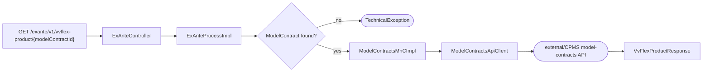
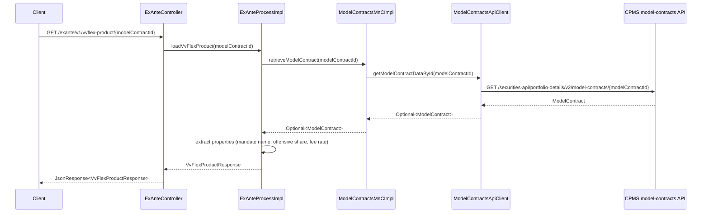

# Chain — ExAnteController · GET /exante/v1/vvflex-product/{modelContractId}

<!-- scaffold — phase 1 -->

- **Action point** — `ExAnteController` (wpfe-am / ucc-exante)
- **Kind** — rest-controller
- **Source** — `ucc-exante/src/main/java/coba/wtp/wpfe/ucc/exante/controller/ExAnteController.java`
- **Handler** — `loadVvFlexProduct(String)` — `ExAnteController.java:144`
- **Trigger** — `GET /exante/v1/vvflex-product/{modelContractId}`
- **Preconditions** — authorization (`WPFE_AM_EXANTE_READ`) enforced by the process layer via `@PreAuthorize`; no request-body validation observed in the controller
- **First hop** — `ExAnteProcess` (wpfe-am / ucc-exante), specifically `ExAnteProcessImpl.loadVvFlexProduct(String)`

<!-- analysis — phase 2 -->

## Story

As a **retail customer navigating the ExAnte cost calculator for a VV-Flex product**, I want to see the read-only product information of my model contract (line, strategy name, offensive share, fee rate) so that the advisor can confirm the correct product is selected before proceeding with the calculation.

- **Given** an advisory session whose context carries `WPFE_AM_EXANTE_READ` authorization and a valid `modelContractId`
- **When** `GET /exante/v1/vvflex-product/{modelContractId}` is called
- **Then** the model contract data is fetched from CPMS, its key properties are extracted, and a `VvFlexProductResponse` is returned with the mandate name, offensive share, fee rate, and available fee models
- **Unless** no ModelContract exists for the given ID — rejected with a technical exception before any response body is produced

## Chain

```text
Branch 1 · primary
  ExAnteController
  → ExAnteProcessImpl
  → ModelContractsMnCImpl
  → ModelContractsApiClient
  ⇒ [external]  CPMS model-contracts API (wpfe-shared / cpms)
```

- **Terminals reached** — `external` (CPMS model-contracts API, via `wpfe-shared-cpms / ModelContractsApiClient`)

## Diagrams

### Process flow — primary



### Sequence — primary



## Journey

When **[the UI calls this endpoint]**, the request enters at **[step 1]** to handle **[loading VV-Flex product information for a given model contract]**. Once that completes, the flow moves to **[step 2]** because **[the controller delegates business logic to the process layer]**. From there, **[step 3]** takes over to **[fetch the model contract from CPMS via the MnC]**, and so on through every hop until a terminal is reached or the response is assembled.

1. **ExAnteController.loadVvFlexProduct** (wpfe-am / ucc-exante)

   **Source.** `ucc-exante/src/main/java/coba/wtp/wpfe/ucc/exante/controller/ExAnteController.java:144`

   **Role.** REST entry point that receives a `modelContractId` path parameter and delegates to the process layer. Wraps the result in a `JsonResponse` for the frontend.

   **Preconditions.** Authorization enforced by `@PreAuthorize("protect('WPFE_AM_EXANTE_READ')")` on the process method (ExAnteProcessImpl.java:243). The controller itself performs no validation beyond path parameter binding.

   **On failure.** No exception handling in the controller — any exception from downstream propagates as an HTTP error response.

   **Downstream.** `ExAnteProcess.loadVvFlexProduct(String)` (wpfe-am / ucc-exante).

2. **ExAnteProcessImpl.loadVvFlexProduct** (wpfe-am / ucc-exante)

   **Source.** `ucc-exante/src/main/java/coba/wtp/wpfe/ucc/exante/process/impl/ExAnteProcessImpl.java:243`

   **Role.** Retrieves the VV-Flex model contract from CPMS, extracts its key properties (mandate name, offensive share percentage, asset management fee rate, and available fee models), and assembles a `VvFlexProductResponse` for display in the ExAnte themenblock.

   **Preconditions.** The caller must hold `WPFE_AM_EXANTE_READ` authorization (checked by Spring Security before this method executes).

   **On failure.** If `modelContractsMnC.retrieveModelContract(modelContractId)` returns an empty Optional, a `TechnicalException` is thrown with message "No ModelContract found with id: <id>" (`ExAnteProcessImpl.java:248-251`). This aborts the chain and produces an error response.

   **Effect.** Extracts four fields from the contract's properties:
     - `productLineMandateName` — resolved via `BilingualStringUtils.resolveTranslation()` in German (`ExAnteProcessImpl.java:253-254`). Falls back to null if properties are absent.
     - `shareOffensiveModules` — the Aktien-/Rohstoffquote (offensive asset share) as a BigDecimal (`ExAnteProcessImpl.java:255-256`). Falls back to null if properties are absent.
     - `assetManagementFeeRate` — standard fee rate as a decimal (`ExAnteProcessImpl.java:257-258`). Falls back to null if properties are absent.
     - `availableFeeModels` — extracted from `modelContract.getProperties().feeModelName().getValue()` as a single-element list (`ExAnteProcessImpl.java:260`).

   **Downstream.** A `VvFlexProductResponse` record containing the model contract ID, mandate name, offensive share, fee rate, and available fee models.

3. **ModelContractsMnCImpl.retrieveModelContract** (wpfe-shared / wpfe-shared-cpms)

   **Source.** `wpfe-shared/wpfe-shared-cpms/src/main/java/coba/wtp/wpfe/shared/cpms/mnc/impl/ModelContractsMnCImpl.java:108`

   **Role.** Map and Call (MnC) layer that calls the CPMS API client to fetch a single model contract by ID, then maps the Swagger-generated `ModelContract` DTO into the domain `ModelContract` object. For this chain only the outbound call matters — the mapping logic is exercised but does not change the outcome.

   **Downstream.** `ModelContractsApi.getModelContractDataById(String)` (wpfe-shared / wpfe-shared-cpms).

4. **ModelContractsApiClient.getModelContractDataById** (wpfe-shared / wpfe-shared-cpms)

   **Source.** `wpfe-shared/wpfe-shared-cpms/src/main/java/coba/wtp/wpfe/shared/cpms/api/modelcontracts/ModelContractsApiClient.java:73`

   **Role.** Builds an HTTP GET request to the CPMS model-contracts endpoint and executes it via RestTemplate. Adds channel and request ID headers from `ApplicationContextProvider`. Returns the response body wrapped in an Optional.

   **On failure.** Any exception during the REST call (network error, 4xx/5xx) is caught and re-thrown as a `TechnicalException` with message "Exception during: GET /model-contracts/{modelContractId} api call" (`ModelContractsApiClient.java:87-92`). No retry or fallback.

   **Terminal — external.** The outbound HTTP call goes to:
     - Base URL: `${api.cpms.baseurl}` (configured via Spring `@Value`)
     - Path template: `/securities-api/portfolio-details/v2/model-contracts/{modelContractId}`
     - Method: GET
     - Headers: `channel`, `requestId` from application context
     - Body: none (GET request)

## Data reached

- **external — CPMS model-contracts API, via `ModelContractsApiClient` (wpfe-shared / cpms)**
  - Business problem solved — As the **ExAnte process**, I need the read-only product information of a VV-Flex ModelContract (mandate name, offensive share percentage, asset management fee rate, available fee models) to be able to display the pre-selected line and its key attributes in the ExAnte cost calculator. Therefore we call this API at `GET /securities-api/portfolio-details/v2/model-contracts/{modelContractId}` to retrieve the model contract record. Then we extract only four fields — `productLineMandateName`, `shareOffensiveModules`, `assetManagementFeeRate`, and `feeModelName` — so we can populate the `VvFlexProductResponse` for the themenblock UI (`ExAnteProcessImpl.java:253-260`).

  - **Request path**
    ```json
    {
      "modelContractId": "mc-vvflex-12345"
    }
    ```
    `modelContractId` — path parameter, origin: URL path from the frontend themenblock.

  - **Request body** — none (GET request).

  - **Response fields used**
    ```json
    {
      "modelContractId": "mc-vvflex-12345",
      "properties": [
        {"definitionId": "coba-asset-management-product-lines-mandate-name", "propertyValue": "VV Efficient"},
        {"definitionId": "coba-general-attributes-share-offensive-modules", "propertyValue": 60.0},
        {"definitionId": "coba-profile-costs-fee-model-name", "propertyValue": "ALL_IN_FEE"},
        {"definitionId": "coba-profile-costs-asset-management-fee-rate", "propertyValue": 0.015}
      ]
    }
    ```
    `modelContractId` → returned as-is in the response (`ExAnteProcessImpl.java:260`).
    `properties[].propertyValue` where `definitionId = coba-asset-management-product-lines-mandate-name` → resolved to German via `BilingualStringUtils.resolveTranslation()` (`ExAnteProcessImpl.java:253-254`).
    `properties[].propertyValue` where `definitionId = coba-general-attributes-share-offensive-modules` → cast to BigDecimal, returned as `shareOffensiveModules` (`ExAnteProcessImpl.java:255-256`).
    `properties[].propertyValue` where `definitionId = coba-profile-costs-asset-management-fee-rate` → cast to BigDecimal, returned as `assetManagementFeeRate` (`ExAnteProcessImpl.java:257-258`).
    `properties[].propertyValue` where `definitionId = coba-profile-costs-fee-model-name` → converted via `FeeModelNameEnum.getValue()` and wrapped in a list (`ExAnteProcessImpl.java:260`).

  - **Response fields discarded** — `proportions`, `offensiveAssetsShare`, all other properties (investment goal, investment horizon, risk profile, customer classification, sales strategy, loss capacity, etc.) — the chain fetches a full model contract record but uses only four property values.

## Acceptance Criteria

1. **Valid modelContractId returns product information** — Given a `modelContractId` that exists in CPMS, when `GET /exante/v1/vvflex-product/{modelContractId}` is called with valid authorization, then the response contains a `VvFlexProductResponse` with `modelContractId`, `productLineMandateName`, `shareOffensiveModules`, `assetManagementFeeRate`, and `availableFeeModels` populated from the CPMS data.
   - Evidence: `ExAnteProcessImpl.java:253-260`
   - How to: read `loadVvFlexProduct()` end to end, confirm all four property extractions are present on the success path. To reproduce: call the endpoint with a known-good `modelContractId` and assert that all response fields are non-null.

2. **Non-existent modelContractId produces a technical exception** — Given a `modelContractId` that does not exist in CPMS, when `GET /exante/v1/vvflex-product/{modelContractId}` is called, then the MnC returns an empty Optional and `ExAnteProcessImpl.loadVvFlexProduct()` throws a `TechnicalException` with message "No ModelContract found with id: <id>" (`ExAnteProcessImpl.java:248-251`).
   - Evidence: `ExAnteProcessImpl.java:247`
   - How to: open the method at line 247, confirm `.orElseThrow()` is called on the Optional with a TechnicalException. To reproduce: call the endpoint with an invalid ID and confirm a 500-level error is returned.

3. **CPMS API failure produces a technical exception** — Given that `ModelContractsApiClient.getModelContractDataById` encounters any HTTP error (4xx, 5xx, network timeout), when the request reaches CPMS, then a `TechnicalException` is thrown with message "Exception during: GET /model-contracts/{modelContractId} api call" (`ModelContractsApiClient.java:87-92`). No retry or fallback is present.
   - Evidence: `ModelContractsApiClient.java:84-92`
   - How to: open the try/catch block at line 84, confirm no retry annotation and no catch that swallows the exception. To reproduce: stub the CPMS endpoint to return 503 and confirm a TechnicalException propagates.

4. **Missing properties on the model contract yield nulls** — Given a ModelContract whose `properties` field is null or missing expected property entries, when the response is assembled, then `productLineMandateName`, `shareOffensiveModules`, and `assetManagementFeeRate` are all null in the `VvFlexProductResponse` (`ExAnteProcessImpl.java:253-258`).
   - Evidence: `ExAnteProcessImpl.java:253-258`
   - How to: read lines 253-258, confirm each field uses a null-coalescing ternary (`modelContract.getProperties() != null ? ... : null`). To reproduce: call the endpoint with a model contract that has no properties and assert those three fields are null.

## Business Takeaways

- **What this does for the business** — displays read-only VV-Flex product information (mandate name, offensive share percentage, asset management fee rate, available fee models) in the ExAnte cost calculator so that the advisor and customer can confirm the correct model contract is selected before proceeding to calculate costs.
- **Depends on** — CPMS model-contracts API (external, GET by ID), Spring Security for `WPFE_AM_EXANTE_READ` authorization
- **Ingredients** — `modelContractId` (URL path from frontend themenblock)
- **Preparation** — fetch the full ModelContract from CPMS via REST, extract mandate name, offensive share, fee rate, and fee model name
- **Dish** — `VvFlexProductResponse` with model contract ID, mandate name, offensive share, fee rate, and available fee models

