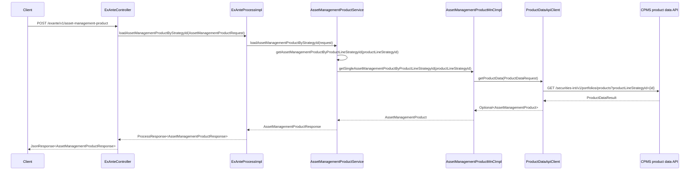

# Chain — ExAnteController · POST /exante/v1/asset-management-product

<!-- scaffold — phase 1 -->

- **Action point** — `ExAnteController` (wpfe-am / ucc-exante)
- **Kind** — rest-controller
- **Source** — `ucc-exante/src/main/java/coba/wtp/wpfe/ucc/exante/controller/ExAnteController.java`
- **Handler** — `loadAssetManagementProduct(JsonRequest<AssetManagementProductRequest>)` — `ExAnteController.java:57`
- **Trigger** — `POST /exante/v1/asset-management-product`
- **Preconditions** — authorization (`WPFE_AM_EXANTE_READ`) enforced by the process layer via `@PreAuthorize`; no request-body validation observed in the controller
- **First hop** — `ExAnteProcess` (wpfe-am / ucc-exante), specifically `ExAnteProcessImpl.loadAssetManagementProductByStrategyId(AssetManagementProductRequest)`

<!-- analysis — phase 2 -->

## Story

As a **retail customer navigating the ExAnte cost calculator**, I want to retrieve the full details of one specific asset management product (by its strategy identifier) so that I can review its fees, mandates and minimum investments before proceeding.

- **Given** an authenticated session carrying `WPFE_AM_EXANTE_READ`
- **When** `POST /exante/v1/asset-management-product` is called with a `productLineStrategyId` and a `scenario`
- **Then** the single matching product's core attributes and profile costs are returned
- **Unless** no product matches that strategy identifier — a technical exception is raised

## Chain

```text
Branch 1 · primary
  ExAnteController
  → ExAnteProcessImpl
  → AssetManagementProductService
  → AssetManagementProductMnCImpl
  → ProductDataApiClient
  ⇒ [external]  CPMS product data API (wpfe-shared / wpfe-shared-cpms)
```

- **Terminals reached** — `external` (CPMS product data API, via `wpfe-shared / wpfe-shared-cpms`)

## Diagrams

### Process flow — primary


### Sequence — primary



## Journey

When **[the trigger fires]**, the request enters at **[step 1]** to handle **[loading a single asset management product by strategy identifier]**. Once that completes, the flow moves to **[step 2]** because **[the controller delegates business logic to the process layer]**. From there, **[step 3]** takes over to **[fetch and map the product from CPMS]**, and so on through every hop until a terminal is reached or the response is assembled.

1. **ExAnteController.loadAssetManagementProduct** (wpfe-am / ucc-exante)

   **Source.** `ucc-exante/src/main/java/coba/wtp/wpfe/ucc/exante/controller/ExAnteController.java:57`

   **Role.** Receives the POST request containing an `AssetManagementProductRequest` and delegates to the process layer. Extracts the request body via `request.getData()` and wraps the result in a `JsonResponse`.

   **Preconditions.** Authorization enforced by `@PreAuthorize("protect('WPFE_AM_EXANTE_READ')")` on the process method — not directly on this controller method, but inherited through the call chain. Spring MVC deserializes the JSON body into `JsonRequest<AssetManagementProductRequest>` automatically.

   **On failure.** If the request body is malformed or missing required fields (`productLineStrategyId`, `scenario`), Spring's deserializer throws a `HttpMessageNotReadableException` before any business logic runs.

   **Effect.** None — purely a pass-through that wraps the process response in JSON.

   **Downstream.** `ExAnteProcessImpl.loadAssetManagementProductByStrategyId(AssetManagementProductRequest)`

2. **ExAnteProcessImpl.loadAssetManagementProductByStrategyId** (wpfe-am / ucc-exante)

   **Source.** `ucc-exante/src/main/java/coba/wtp/wpfe/ucc/exante/process/impl/ExAnteProcessImpl.java:96`

   **Role.** Applies the authorization gate and delegates to the service layer. The `@PreAuthorize("protect('WPFE_AM_EXANTE_READ')")` annotation ensures only authenticated users with the correct permission can proceed.

   **Preconditions.** Caller must hold `WPFE_AM_EXANTE_READ` authority, enforced by Spring Security's method-level pre-authentication.

   **On failure.** If the user lacks the required authority, Spring Security throws an `AccessDeniedException` before the service is ever called.

   **Effect.** None — delegates to the service and wraps its result in a `ProcessResponse<AssetManagementProductResponse>`.

   **Downstream.** `AssetManagementProductService.loadAssetManagementProductByStrategyId(AssetManagementProductRequest)`

3. **AssetManagementProductService.loadAssetManagementProductByStrategyId** (wpfe-am / ucc-exante)

   **Source.** `ucc-exante/src/main/java/coba/wtp/wpfe/ucc/exante/service/AssetManagementProductService.java:60`

   **Role.** Fetches the full `AssetManagementProduct` domain object by strategy ID, then maps it into a response DTO. Applies scenario-dependent profile cost filtering: if the scenario is `CHANGE`, all profile costs are included; otherwise (`NEW` or other scenarios), transaction-oriented fees are filtered out.

   **Steps.**

   - **3.1 Fetch product by strategy ID** · `AssetManagementProductService.java:62`
     **Role.** Calls `getAssetManagementProductByProductLineStrategyId(productLineStrategyId)` to retrieve the full domain object from the MnC layer.
     **On failure.** If no product matches, a technical exception is thrown (see step 3.1a).

   - **3.1a Validate product existence** · `AssetManagementProductService.java:76`
     **Role.** The helper method `getAssetManagementProductByProductLineStrategyId` calls the MnC and then `.orElseThrow()` with a technical exception if the result is empty.
     **Effect.** Aborts the chain with a technical error carrying code `am.ucc.exante.service.assetManagementProductService.getAssetManagementProductByUniqueId` and message `No asset management product found with productLineStrategyId {id}`.

   - **3.2 Map — build response DTO** · `AssetManagementProductService.java:64`
     **Role.** Extracts core identity fields (`uniqueId`, `productLineStrategyId`, `productLineStrategyName`, `productLineMandate`, `productLineMandateName`) and minimum investments from the domain object.

   - **3.3 Filter — scenario-dependent profile costs** · `AssetManagementProductService.java:70`
     **Role.** If `scenario == Scenario.CHANGE`, returns all profile costs as-is. Otherwise, calls `filterTransactionOrientedFees()` to remove any fee model whose name is `TRANSACTIONS_ORIENTED_FEE` from each profile cost entry.
     **Effect.** The response carries a reduced fee structure for non-CHANGE scenarios, hiding transaction-oriented fees that are irrelevant in those contexts.

   **Downstream.** A single `AssetManagementProductResponse` DTO carrying the product's identity, minimum investments and (conditionally filtered) profile costs.

4. **AssetManagementProductMnCImpl.getSingleAssetManagementProductByProductLineStrategyId** (wpfe-am / wpfe-am-commons)

   **Source.** `wpfe-am-commons/src/main/java/coba/wtp/wpfe/am/commons/mnc/impl/AssetManagementProductMnCImpl.java:82`

   **Role.** Requests product data from CPMS for a single strategy ID, then maps the raw CPMS response into an internal `AssetManagementProduct` domain object. The call is cached via `@Cacheable(value = "getSingleAssetManagementProductByProductLineStrategyId", cacheManager = "assetManagementProductCache")`, so repeated requests with the same strategy ID hit the cache instead of calling CPMS again.

   **Steps.**

   - **4.1 Call CPMS** · `AssetManagementProductMnCImpl.java:86`
     **Role.** Builds a `ProductDataRequest` carrying the channel, request ID, authentication context and the target `productLineStrategyId`, then calls `productDataApi.getProductData()`.

   - **4.2 Log outcome** · `AssetManagementProductMnCImpl.java:93`
     **Role.** Logs either the count of products returned or a message indicating no product was found for the given strategy ID.

   - **4.3 Map — CPMS object to domain object** · `AssetManagementProductMnCImpl.java:106`
     **Role.** If exactly one product is in the result, calls `mapAssetManagementProduct()` which recursively maps all nested structures: general attributes (benchmark, allocation strategy, minimum investments, sustainability flags), profile costs (fee models and their cost components per unit), target market attributes, and sustainability attributes.
     **Effect.** Produces a fully populated `AssetManagementProduct` domain object ready for downstream consumption.

   **On failure.** If CPMS returns an error, the exception propagates up through the MnC to the service layer (see step 5).

   **Downstream.** An `Optional<AssetManagementProduct>` — present with the mapped product if found, empty otherwise.

5. **ProductDataApiClient.getProductData** (wpfe-shared / wpfe-shared-cpms)

   **Source.** `wpfe-shared-cpms/src/main/java/coba/wtp/wpfe/shared/cpms/api/productData/ProductDataApiClient.java:42`

   **Role.** Sends an HTTP GET request to the CPMS product data API, building the URL from a configurable base URL plus fixed path segments. Passes channel and request ID headers derived from the `ProductDataRequest`. On success, returns the response body wrapped in `Optional`; on failure, throws a technical exception.

   **Steps.**

   - **5.1 Build request URL** · `ProductDataApiClient.java:68`
     **Role.** Constructs the full URL by concatenating `baseUrl + /securities-int/v1/portfolios/products` and appending query parameters (`uniqueId` or `productLineStrategyId`) from the request.

   - **5.2 Send HTTP GET** · `ProductDataApiClient.java:48`
     **Role.** Uses Spring's `RestTemplate.exchange()` to send a GET request with headers containing channel and request ID. Expects a `ProductDataResult` response body.

   - **5.3 Handle failure** · `ProductDataApiClient.java:60`
     **Role.** Catches any exception from the HTTP call (network error, 4xx/5xx status, deserialization failure) and throws a `TechnicalException` with code derived from `ProductDataApiClient.class.getName()` and message `Exception during: /portfolios/products api call`.

   **Terminal — external**

   **Downstream.** None — this is the outbound terminal of the chain. The response flows back through MnC mapping to the service layer.

## Data reached

- **external — CPMS product data API, via `ProductDataApiClient` (wpfe-shared / wpfe-shared-cpms)**
  - Business problem solved — As the **ExAnte cost calculator**, I need the full master data for one specific asset management product so that I can display its fees, mandates and minimum investments to the customer. Therefore we call this API at `GET /securities-int/v1/portfolios/products?productLineStrategyId={productLineStrategyId}` to retrieve the product record. Then we map every nested attribute — general attributes (benchmark, allocation strategy, sustainability flags), profile costs with their fee models and cost components per unit, target market attributes and sustainability attributes — so that the frontend can render a complete product detail view (`AssetManagementProductMnCImpl.java:106-145`).

  - **Request path**
    ```json
    /securities-int/v1/portfolios/products?productLineStrategyId="PLS-DE-001"
    ```
    `productLineStrategyId` — query parameter, origin: request body field from the ExAnte frontend.

  - **Request headers**
    - `channel` — derived from `ApplicationContextProvider.getChannel().asString()` (the current application channel)
    - `requestId` — derived from `ApplicationContextProvider.getRequestId()` (trace ID for the session)
    - Authentication context — from `SecurityContextHolder.getContext().getAuthentication()`

  - **Response fields used**
    ```json
    {
      "id": "AM-001",
      "productLineStrategyId": "PLS-DE-001",
      "productLineStrategyName": "Efficient Global Growth",
      "productLineMandate": "MANDATE-EFF-GLOBAL",
      "productLineMandateName": "Efficient Global Mandate",
      "generalAttributes": {
        "benchmark": [{"wkn": "DE0008449004", "quota": 50.0}],
        "defaultAllocationStrategy": {"neutralRiskQuota": 60.0, "maximumStockQuota": 100.0, "maximumCurrencyQuota": 30.0},
        "minimumInvestments": {"display": 50000, "sales": 25000, "technical": 10000},
        "furtherAgreementsAllowed": true,
        "newCustomerAllowed": true,
        "mandateChangeAllowed": false,
        "strategyChangeAllowed": true,
        "overallSustainabilityPreferences": "GREEN",
        "onlyInternationalClients": false,
        "usPersonProduct": false,
        "vvFlexProduct": false,
        "isProductfinderProduct": false
      },
      "profileCosts": [
        {
          "investmentVolumeThresholdFrom": 0,
          "investmentVolumeThresholdTo": 100000,
          "feeModels": [
            {
              "feeModelName": "ALL_IN_FEE",
              "costComponentsPerUnit": [
                {"costComponentEnum": "ASSET_MANAGEMENT_FEE_RATE", "value": 1.5},
                {"costComponentEnum": "PROFIT_SHARE_RATE", "value": 0.0},
                {"costComponentEnum": "MINIMUM_FEE", "value": 250.0}
              ]
            }
          ]
        }
      ],
      "targetMarketAttributes": {
        "customerClassification": [1, 2],
        "investmentGoal": "GROWTH",
        "investmentHorizon": "LONG_TERM",
        "minimumFinancialLossCapacity": "LOW",
        "minimumKnowledgeAndExperience": "BASIC",
        "minimumReturnProfile": "MODERATE",
        "minimumRiskProfile": "MEDIUM",
        "productGroups": ["FUND"],
        "salesStrategy": "DIRECT"
      },
      "sustainabilityAttributes": {
        "categoryA": 0.1,
        "categoryB": null,
        "categoryC": {"isCategoryC": false, "principleAdverseImpactAggregate": []},
        "quotaForPortfolio": 0.2
      }
    }
    ```
    Fields inferred from the CPMS Swagger-generated DTO at `coba.wtp.wpfe.shared.cpms.api.model.portfoliooperations.AssetManagementProduct` and mapped through `AssetManagementProductMnCImpl.java:106-145`. Example values are representative instances.

  - **Response fields discarded** — none observed; the MnC maps every field from the CPMS response into the domain object, though only a subset (identity, minimum investments, profile costs) is ultimately exposed in the `AssetManagementProductResponse` DTO returned to the frontend. The target market and sustainability attributes are mapped but not included in the final response for this endpoint.

## Acceptance Criteria

1. **Single product returned for valid strategy ID** — Given a `productLineStrategyId` that matches an existing asset management product in CPMS, when `POST /exante/v1/asset-management-product` is called with scenario `CHANGE`, then the response contains the full product record including all profile costs without any fee filtering.
   - Evidence: `AssetManagementProductService.java:70-72` — when `scenario == Scenario.CHANGE`, `profileCosts()` is returned as-is
   - How to: read the conditional at line 70 and confirm no filter is applied for `CHANGE`; call the endpoint with a known-good strategy ID and scenario `CHANGE`, then assert that all fee models (including `TRANSACTIONS_ORIENTED_FEE`) appear in the response.

2. **Transaction-oriented fees filtered for non-CHANGE scenarios** — Given a valid `productLineStrategyId` and a scenario other than `CHANGE`, when the endpoint is called, then any profile cost entries whose fee model name is `TRANSACTIONS_ORIENTED_FEE` are removed from the response.
   - Evidence: `AssetManagementProductService.java:80-84` — `filterTransactionOrientedFees()` filters out fee models where `feeModelName() != FeeModelName.TRANSACTIONS_ORIENTED_FEE`
   - How to: call the endpoint with scenario `NEW` (or any non-CHANGE value) and a strategy ID that has transaction-oriented fees; assert that no fee model in the response carries `TRANSACTIONS_ORIENTED_FEE`.

3. **Technical exception when product not found** — Given a `productLineStrategyId` that does not match any asset management product in CPMS, when the endpoint is called, then a technical exception is thrown with code `am.ucc.exante.service.assetManagementProductService.getAssetManagementProductByUniqueId` and message containing `No asset management product found with productLineStrategyId {id}`.
   - Evidence: `AssetManagementProductService.java:76-80` — `.orElseThrow()` raises a `TechnicalException` on empty result
   - How to: call the endpoint with an invalid strategy ID (e.g., `NONEXISTENT-ID`) and confirm the response is a 5xx error carrying the technical exception message.

4. **Cached response for repeated calls** — Given the same `productLineStrategyId`, when the endpoint is called multiple times, then subsequent calls hit the Spring cache (`assetManagementProductCache`) rather than calling CPMS again.
   - Evidence: `AssetManagementProductMnCImpl.java:82` — `@Cacheable(value = "getSingleAssetManagementProductByProductLineStrategyId", cacheManager = "assetManagementProductCache")`
   - How to: call the endpoint twice with the same strategy ID and check CPMS logs or network traces to confirm only one outbound HTTP request was made.

5. **CPMS API failure propagates as technical exception** — Given a CPMS outage or 5xx response, when the endpoint is called, then `ProductDataApiClient` throws a `TechnicalException` with message `Exception during: /portfolios/products api call`, which propagates up through MnC and service to the controller.
   - Evidence: `ProductDataApiClient.java:60-67` — catch block wraps any exception in a `TechnicalException`
   - How to: stub the CPMS endpoint to return 500 or drop connections, call the ExAnte endpoint, and confirm a technical exception is returned.

## Business Takeaways

**Restatement only.** Every line here cites a fact already established earlier in this same file. No source file is opened for this section.

- **What this does for the business** — retrieves the full master data for one specific asset management product from CPMS and returns its identity, minimum investments and profile costs to the ExAnte cost calculator frontend, filtering out transaction-oriented fees when the scenario is not CHANGE.
- **Depends on** — the CPMS product data API (external, single-product query by strategy ID)
- **Ingredients** — `productLineStrategyId` (request body), `scenario` (request body, controls fee filtering)
- **Preparation** — fetch the full product record from CPMS via an HTTP GET with channel and request headers
- **Dish** — `AssetManagementProductResponse` carrying unique ID, strategy name, mandate details, minimum investments and profile costs (conditionally filtered), or a technical exception if no product matches


