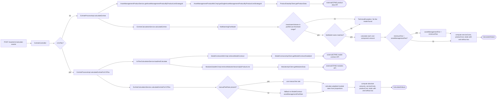

# Chain — ExAnteController · POST /exante/v1/calculate-exante

<!-- scaffold — phase 1 -->

- **Action point** — `ExAnteController` (wpfe-am / ucc-exante)
- **Kind** — rest-controller
- **Source** — `ucc-exante/src/main/java/coba/wtp/wpfe/ucc/exante/controller/ExAnteController.java`
- **Handler** — `calculateExAnte(JsonRequest<CalculateExAnteRequest>)` — `ExAnteController.java:123`
- **Trigger** — `POST /exante/v1/calculate-exante`
- **Preconditions** — authorization (`WPFE_AM_EXANTE_READ`) enforced by the process layer via `@PreAuthorize`; no request-body validation observed in the controller. The handler branches on `data.isVvFlex()` to dispatch to either the standard or VV-Flex code path.
- **First hop** — `ExAnteProcess` (wpfe-am / ucc-exante), specifically `ExAnteProcessImpl.calculateExAnte(CalculateExAnteRequest)` or `calculateExAnteForVVFlex(CalculateExAnteForVVFlexRequest)`

<!-- analysis — phase 2 -->

## Story

As a **retail customer using the Ex-Ante cost calculator**, I want my investment costs calculated upfront so that I can see exactly what fees and charges will apply to my portfolio before committing.

- **Given** an advisory session carrying `WPFE_AM_EXANTE_READ` authorization, with either a standard product's `productLineStrategyId` or a VV-Flex temporary model contract's `modelContractId`
- **When** `POST /exante/v1/calculate-exante` is called with an investment volume and optional manual fee rate
- **Then** the system retrieves the relevant product data from CPMS, computes all cost components (asset management fees, profit share, custody fees, securities commissions, other fees, external services, product costs, grants), applies VAT where applicable, and returns a full breakdown of service costs, product costs, and total costs — both excluding and including tax
- **Unless** the customer is not authorized (`WPFE_AM_EXANTE_READ` enforced by `@PreAuthorize`) or no matching fee model / asset management product / model contract exists in CPMS — in which case a technical exception is thrown

## Chain

Branch 1 · primary (standard path)
  ExAnteController.calculateExAnte()
  → ExAnteProcessImpl.calculateExAnte(CalculateExAnteRequest)
    → AssetManagementProductService.getAssetManagementProductByProductLineStrategyId(String)
      → AssetManagementProductMnCImpl.getSingleAssetManagementProductByProductLineStrategyId(String)
        → ProductDataApiClient.getProductData(ProductDataRequest)
        ⇒ [external]  CPMS product data API
    → ExAnteCalculationService.calculateExAnte(CalculateExAnteRequest, AssetManagementProduct)
    ⇒ [none]  pure cost computation

Branch 2 · diverges at ExAnteController (VV-Flex path)
  ExAnteController.calculateExAnte()
  → ExAnteProcessImpl.calculateExAnteForVVFlex(CalculateExAnteForVVFlexRequest)
    → VvFlexCalculationService.loadAndCalculate(String, String, BigDecimal, BigDecimal)
      → ModelContractsMnCImpl.retrieveModelContract(String)
        → ModelContractsApiClient.getModelContractDataById(String)
        ⇒ [external]  CPMS model contract API
      → ModulesDataMnCImpl.retrieveModulesHierarchyByProductLine(String)
        → ModulesApiClient.getModulesData(ModulesDataRequest)
        ⇒ [external]  CPMS modules API
    → ExAnteCalculationService.calculateExAnteForVVFlex(CalculateExAnteForVVFlexRequest, ModelContract, List<Module>)
    ⇒ [none]  pure cost computation

- **Terminals reached** — `external` (CPMS product data API via ProductDataApiClient, CPMS model contract API via ModelContractsApiClient, CPMS modules API via ModulesApiClient), `none` (pure cost computation in ExAnteCalculationService)

## Diagrams

### Process flow — primary



### Sequence — primary

```mermaid
sequenceDiagram
    participant Client
    participant Controller as ExAnteController
    participant Process as ExAnteProcessImpl
    participant AMService as AssetManagementProductService
    participant AMMnC as AssetManagementProductMnCImpl
    participant AMApi as ProductDataApiClient
    participant CPMS as CPMS product data API
    participant CalcSvc as ExAnteCalculationService
    participant VvFlexSvc as VvFlexCalculationService
    participant MCmCn as ModelContractsMnCImpl
    participant MCApi as ModelContractsApiClient
    moduleCPMS as CPMS model contract API
    modmCn as ModulesDataMnCImpl
    modApi as ModulesApiClient
    modCPMS as CPMS modules API

    Client->>Controller: POST /exante/v1/calculate-exante
    Controller->>Process: calculateExAnte(request)
    Process->>AMService: getAssetManagementProductByProductLineStrategyId(productLineStrategyId)
    AMService->>AMMnC: getSingleAssetManagementProductByProductLineStrategyId(id)
    AMMnC->>AMApi: getProductData(ProductDataRequest)
    AMPi->>CPMS: GET /securities-int/v1/portfolios/products?productLineStrategyId={id}
    CPMS-->>AMPi: ProductDataResult
    AMPi-->>AMMnC: Optional<ProductDataResult>
    AMMnC-->>AMService: AssetManagementProduct
    AMService-->>Process: AssetManagementProduct
    Process->>CalcSvc: calculateExAnte(request, product)
    CalcSvc->>CalcSvc: findMatchingFeeModel — filter profileCosts by investmentVolume range
    CalcSvc->>CalcSvc: determine fee rate (manual or from cost components)
    CalcSvc->>CalcSvc: calculate each component amount × volume
    CalcSvc->>CalcSvc: apply minimum fee override if applicable
    CalcSvc->>CalcSvc: sum serviceCosts, productCost, totals with/without tax
    CalcSvc-->>Process: CalculatedValues
    Process-->>Controller: JsonResponse<CalculatedValues>
    Controller-->>Client: 200 OK body=CalculatedValues
```

## Journey

When the **retail customer triggers an Ex-Ante cost calculation** in their advisory session, the request enters at **[step 1]** to handle the branching between standard and VV-Flex product paths. Once that completes, the flow moves to **[step 2 or step 7]** because the system must retrieve different data depending on whether this is a standard asset management product or a VV-Flex temporary model contract.

Below is each step in call order — what it does, why it exists, how it handles failure, and what passes the baton forward. The journey covers both branches from the same entry point.

1. **ExAnteController.calculateExAnte** (wpfe-am / ucc-exante)

   **Source.** `ucc-exante/src/main/java/coba/wtp/wpfe/ucc/exante/controller/ExAnteController.java:123`

   **Role.** Receives the POST request, extracts the `CalculateExAnteRequest` from the JSON wrapper, and branches on whether this is a standard product or VV-Flex product. For standard products it constructs no extra object — just passes the original data through. For VV-Flex it wraps the fields into a `CalculateExAnteForVVFlexRequest` before dispatching.

   **Preconditions.** Authorization enforced by `@PreAuthorize("protect('WPFE_AM_EXANTE_READ')")` on the handler method, applied by Spring Security before the method body executes. No request-body validation observed in the controller itself.

   **On failure.** If the JSON body cannot be deserialized into `CalculateExAnteRequest`, Spring's `HttpMessageNotReadableException` propagates as a 400 Bad Request — no custom handling in this controller.

   **Effect.** Branches to one of two process methods based on `request.getData().isVvFlex()`. The `isVvFlex()` check returns true when `modelContractId` is non-null and not blank (standard products have a `productLineStrategyId` instead).

   **Downstream.** Either `ExAnteProcessImpl.calculateExAnte(CalculateExAnteRequest)` for standard, or `ExAnteProcessImpl.calculateExAnteForVVFlex(CalculateExAnteForVVFlexRequest)` for VV-Flex.

2. **ExAnteProcessImpl.calculateExAnte** (wpfe-am / ucc-exante)

   **Source.** `ucc-exante/src/main/java/coba/wtp/wpfe/ucc/exante/process/impl/ExAnteProcessImpl.java:143`

   **Role.** Orchestrates the standard Ex-Ante calculation by first resolving the asset management product from CPMS using the customer's selected product line strategy ID, then delegating to `ExAnteCalculationService` with both the request and the resolved product.

   **Preconditions.** The caller must have passed authorization (enforced at step 1). The `productLineStrategyId` in the request must identify a valid asset management product in CPMS.

   **On failure.** If no matching `AssetManagementProduct` is found by strategy ID, `TechnicalExceptionFactory.createAndLogTechnicalException` throws — the exception propagates up through the process layer to the controller and surfaces as an error response. No retry or fallback.

   **Effect.** Assembles two arguments for the calculation service: the original request (containing investment volume, optional manual fee rate, fee model name) and the resolved product (containing profile costs with fee models).

   **Downstream.** `AssetManagementProductService.getAssetManagementProductByProductLineStrategyId(String)` and `ExAnteCalculationService.calculateExAnte(CalculateExAnteRequest, AssetManagementProduct)`.

3. **AssetManagementProductService.getAssetManagementProductByProductLineStrategyId** (wpfe-am / ucc-exante)

   **Source.** `ucc-exante/src/main/java/coba/wtp/wpfe/ucc/exante/service/AssetManagementProductService.java:78`

   **Role.** Resolves a single asset management product from CPMS by its strategy ID. This is the gateway to fetching cost data — without it, no fee model can be matched and no costs can be calculated.

   **On failure.** If `assetManagementProductMnC.getSingleAssetManagementProductByProductLineStrategyId()` returns an empty Optional, a `TechnicalException` is thrown with message "No asset management product found with productLineStrategyId {id}". This is logged at the service level and propagates as a 5xx error.

   **Effect.** Returns an `AssetManagementProduct` containing profile costs (each with fee models and cost components), general attributes, target market attributes, and sustainability attributes — all mapped from CPMS data.

   **Downstream.** The resolved product is passed to `ExAnteCalculationService.calculateExAnte()` for the actual computation.

4. **AssetManagementProductMnCImpl.getSingleAssetManagementProductByProductLineStrategyId** (wpfe-am / wpfe-am-commons)

   **Source.** `wpfe-am-commons/src/main/java/coba/wtp/wpfe/am/commons/mnc/impl/AssetManagementProductMnCImpl.java:78`

   **Role.** Calls the CPMS product data API with a filter for one specific product line strategy ID, then maps the single result from the external CPMS DTO into the internal domain model `AssetManagementProduct`. The mapping covers general attributes (benchmarks, allocation strategy, minimum investments), profile costs with fee models and cost components per unit, target market attributes, and sustainability attributes.

   **Preconditions.** The `productLineStrategyId` is passed as a query parameter to CPMS. Authentication context is injected from Spring Security's `SecurityContextHolder`.

   **On failure.** If the API call throws (network error, 5xx), the exception propagates through the MnC layer unchanged — no retry or fallback at this level. The method is annotated with `@Cacheable(value = "getSingleAssetManagementProductByProductLineStrategyId", cacheManager = "assetManagementProductCache")`, so a cache miss triggers the API call; a cache hit returns immediately from the Spring Cache without hitting CPMS.

   **Effect.** Returns an `Optional<AssetManagementProduct>` — present if CPMS found one matching product, empty otherwise. The result is cached under the strategy ID key.

   **Downstream.** `ProductDataApiClient.getProductData(ProductDataRequest)`.

5. **ProductDataApiClient.getProductData** (wpfe-shared / wpfe-shared-cpms)

   **Source.** `wpfe-shared-cpms/src/main/java/coba/wtp/wpfe/shared/cpms/api/productData/ProductDataApiClient.java:42`

   **Role.** Makes an outbound HTTP GET request to the CPMS product data endpoint. Builds the URL from a configured base URL (`${cpms.productData.baseUrl}`) plus path segments `/securities-int/v1/portfolios/products`, appending `productLineStrategyId` as a query parameter when present.

   **On failure.** Any exception during the REST call (connection error, timeout, non-2xx response) is wrapped in a `TechnicalException` via `TechnicalExceptionFactory.createAndLogTechnicalException` and re-thrown. No retry logic — fatal failure.

   **Effect.** Returns `Optional<ProductDataResult>` containing the CPMS product data DTO on success, or empty Optional if the response body was null (which should not happen for a 2xx response).

   **Terminal — external.** HTTP GET to `/securities-int/v1/portfolios/products?productLineStrategyId={productLineStrategyId}` against the CPMS investment operations API. The base URL is configured via `cpms.productData.baseUrl` property.

6. **ExAnteCalculationService.calculateExAnte** (wpfe-am / wpfe-am-commons)

   **Source.** `wpfe-am-commons/src/main/java/coba/wtp/wpfe/am/commons/service/exante/ExAnteCalculationService.java:40`

   **Role.** Computes the full Ex-Ante cost breakdown for a standard asset management product. This is pure computation — no outbound calls, no database access. It performs these sub-steps:

   **Steps.**

   6.1 **Find matching fee model** · `ExAnteCalculationService.java:208`
       **Role.** Filters the product's profile costs by investment volume range (the request's `investmentVolume` must fall between `thresholdFrom` and optionally `thresholdTo`), then filters within that profile cost's fee models for one matching the requested `feeModel` name. Throws if no match is found.

   6.2 **Determine fee rate** · `ExAnteCalculationService.java:219`
       **Role.** If a `manualFeeRate` was provided in the request, converts it from percentage to decimal-percentage (divides by 100). Otherwise reads the `ASSET_MANAGEMENT_FEE_RATE` cost component from the matched fee model's `costComponentsPerUnits`.

   6.3 **Calculate each service cost component** · `ExAnteCalculationService.java:52-78`
       **Role.** For each of seven cost components — asset management fee, profit share, custody fee, securities commission, other fees, external services, and product costs including grants — reads the rate from the matched fee model's cost components, multiplies by investment volume to get an absolute amount. The minimum fee rule is applied: if `minimumFee` exceeds the computed `assetManagementFee`, the asset management fee is bumped up to the minimum.

   6.4 **Calculate product costs** · `ExAnteCalculationService.java:79-80`
       **Role.** Sums `productCostsIncludingGrants` and `payedOutGrants` into a single `productCost`. Both rates come from the fee model's cost components.

   6.5 **Compute totals** · `ExAnteCalculationService.java:82-83`
       **Role.** `serviceCosts = assetManagementFee + profitShare + custodyFee + securitiesCommission + otherFees + externalServices`. `totalCostsExcludingTaxes = serviceCosts + productCost`. `totalCostsIncludingTaxes = serviceCosts × 1.19 (VAT) + productCost` — note that VAT applies only to service costs, not to product costs.

   6.6 **Round and build result** · `ExAnteCalculationService.java:85-120`
       **Role.** Rounds every monetary amount and percentage to 2 decimal places using `HALF_UP` rounding. Recalculates percentages as `(amount / investmentVolume) × 100`. Builds a `CalculatedValues` object carrying all individual costs, subtotals, and totals — both absolute amounts and percentages.

   **On failure.** If no matching fee model is found (step 6.1), a `TechnicalException` is thrown with message "No feeModel found with name {name}". No retry or fallback.

   **Effect.** Returns a fully populated `CalculatedValues` object with all cost components, subtotals, and totals — both absolute amounts and percentages relative to investment volume.

   **Downstream.** The result is wrapped in a `ProcessResponse<CalculatedValues>` by the process layer, then returned as JSON through the controller.

7. **ExAnteProcessImpl.calculateExAnteForVVFlex** (wpfe-am / ucc-exante)

   **Source.** `ucc-exante/src/main/java/coba/wtp/wpfe/ucc/exante/process/impl/ExAnteProcessImpl.java:150`

   **Role.** Orchestrates the VV-Flex Ex-Ante calculation by delegating to `VvFlexCalculationService.loadAndCalculate()`, which handles loading both the model contract and its modules from CPMS, then computing costs.

   **Preconditions.** The caller must have passed authorization (enforced at step 1). The `modelContractId` in the request must identify a valid temporary model contract in CPMS.

   **On failure.** If no matching model contract is found in CPMS, `TechnicalExceptionFactory.createAndLogTechnicalException` throws — propagated through the process layer to the controller as an error response. No retry or fallback.

   **Effect.** Returns a `ProcessResponse<CalculatedValues>` containing VV-Flex-specific cost calculations where profit share and custody fees are always zero (VV-Flex uses ALL_IN_FEE structure), and module-level costs are weighted by the model contract's proportions.

   **Downstream.** `VvFlexCalculationService.loadAndCalculate(String, String, BigDecimal, BigDecimal)`.

8. **VvFlexCalculationService.loadAndCalculate** (wpfe-am / wpfe-am-commons)

   **Source.** `wpfe-am-commons/src/main/java/coba/wtp/wpfe/am/commons/service/VvFlexCalculationService.java:64`

   **Role.** Loads the VV-Flex model contract and its module hierarchy from CPMS, flattens the hierarchical module structure (AssetCategory → AssetClass → ModuleClass → Module) into a flat list, then delegates to `ExAnteCalculationService.calculateExAnteForVVFlex()` for pure computation.

   **Steps.**

   8.1 **Retrieve model contract** · `VvFlexCalculationService.java:74`
       **Role.** Calls `modelContractsMnC.retrieveModelContract(modelContractId)` to fetch the temporary VV-Flex model contract from CPMS, which contains the fee structure, proportions (weighting of each module), and properties including the asset management fee rate.

   8.2 **Retrieve modules hierarchy** · `VvFlexCalculationService.java:81`
       **Role.** Calls `modulesDataMnC.retrieveModulesHierarchyByProductLine(productLinesFilter)` to fetch all VV-Flex modules from CPMS, then flattens the four-level hierarchy (AssetCategory → AssetClass → ModuleClass → Module) into a flat `List<Module>` by streaming through each level.

   8.3 **Calculate costs** · `VvFlexCalculationService.java:86`
       **Role.** Delegates to `exAnteCalculationService.calculateExAnteForVVFlex(request, modelContract, modules)` with the loaded data for pure computation of VV-Flex-specific cost breakdown.

   8.4 **Extract mandate name** · `VvFlexCalculationService.java:90`
       **Role.** Reads the product line mandate name from the model contract's properties (e.g., "VV Efficient") and returns it alongside the calculated values in a `VvFlexResult` record.

   **On failure.** If no matching model contract is found, a `TechnicalException` is thrown. If modules endpoint returns 404, `ModulesApiClient` catches this and returns an empty Optional — which results in an empty module list passed to the calculation service (the calculation still runs but with zero module-level costs).

   **Effect.** Returns a `VvFlexResult` containing both the computed `CalculatedValues` and the product line mandate name.

9. **ModelContractsMnCImpl.retrieveModelContract** (wpfe-shared / wpfe-shared-cpms)

   **Source.** `wpfe-shared-cpms/src/main/java/coba/wtp/wpfe/shared/cpms/mnc/impl/ModelContractsMnCImpl.java:108`

   **Role.** Calls the CPMS model contracts API by ID, then maps the external CPMS DTO into the internal domain model `ModelContract`. The mapping extracts properties (fee rates, strategy names, allowed channels), proportions (module weightings as percentages of total investment), and offensive assets share.

   **On failure.** If CPMS returns no matching contract, an empty Optional is returned — which causes `VvFlexCalculationService` to throw a `TechnicalException`. No retry or fallback at the MnC layer.

   **Effect.** Returns an `Optional<ModelContract>` containing the full model contract with its properties and proportions.

   **Downstream.** `ModelContractsApiClient.getModelContractDataById(String)`.

10. **ModelContractsApiClient.getModelContractDataById** (wpfe-shared / wpfe-shared-cpms)

    **Source.** `wpfe-shared-cpms/src/main/java/coba/wtp/wpfe/shared/cpms/api/modelcontracts/ModelContractsApiClient.java:60`

    **Role.** Makes an outbound HTTP GET request to the CPMS model contracts endpoint. Builds the URL from a configured base URL plus path `/model-contracts/{modelContractId}`.

    **On failure.** Any exception during the REST call is wrapped in a `TechnicalException` and re-thrown — fatal failure, no retry.

    **Effect.** Returns `Optional<ModelContract>` containing the CPMS model contract DTO on success.

    **Terminal — external.** HTTP GET to `/model-contracts/{modelContractId}` against the CPMS portfolio details API. The base URL is configured via the parent abstract client's `baseurl` property (inherited from `SecuritiesPortfolioDetailsApiAbstractRestClient`).

11. **ModulesDataMnCImpl.retrieveModulesHierarchyByProductLine** (wpfe-shared / wpfe-shared-cpms)

    **Source.** `wpfe-shared-cpms/src/main/java/coba/wtp/wpfe/shared/cpms/mnc/impl/ModulesDataMnCImpl.java:95`

    **Role.** Calls the CPMS modules API with an optional product line filter, then maps the flat list of module data from CPMS into a hierarchical domain model (AssetCategory → AssetClass → ModuleClass → Module). The mapping extracts module properties including cost rates (securities commission, other fees, external services), limits, acquisition types, weighting types, and investment strategies. Modules are grouped by their temporary class/asset-class IDs to build the hierarchy.

    **On failure.** If CPMS returns no data or throws an error, a `TechnicalException` is thrown — fatal failure, no retry.

    **Effect.** Returns a `List<AssetCategory>` containing three categories (offensive, defensive, alternative-investments), each with its asset classes, module classes, and modules.

    **Downstream.** The hierarchy is flattened by `VvFlexCalculationService` into a flat list of `Module` objects for the calculation service.

12. **ModulesApiClient.getModulesData** (wpfe-shared / wpfe-shared-cpms)

    **Source.** `wpfe-shared-cpms/src/main/java/coba/wtp/wpfe/shared/cpms/api/modules/ModulesApiClient.java:38`

    **Role.** Makes an outbound HTTP GET request to the CPMS modules endpoint. Builds the URL from a hardcoded base (`CPMS_DIRECT_URL` = `https://cpms-midtier-int-snap.tuc.apps.cloud.internal/securities-int/v1`) plus path `/portfolios/modules`, appending `properties` and/or `moduleIds` as query parameters.

    **On failure.** A 404 response is caught and logged, returning an empty Optional (graceful degradation — the calculation can still proceed with zero module costs). Any other exception is wrapped in a `TechnicalException` and re-thrown.

    **Effect.** Returns `Optional<ModulesDataResult>` containing the CPMS modules data DTO on success.

    **Terminal — external.** HTTP GET to `/portfolios/modules?properties={...}` against the CPMS investment operations API. The base URL is hardcoded in the class as a constant string.

13. **ExAnteCalculationService.calculateExAnteForVVFlex** (wpfe-am / wpfe-am-commons)

    **Source.** `wpfe-am-commons/src/main/java/coba/wtp/wpfe/am/commons/service/exante/ExAnteCalculationService.java:97`

    **Role.** Computes the full Ex-Ante cost breakdown for a VV-Flex product. This is pure computation — no outbound calls, no database access. It performs these sub-steps:

    **Steps.**

    13.1 **Resolve asset management fee rate** · `ExAnteCalculationService.java:120`
         **Role.** If a `manualFeeRate` was provided in the request, converts it from percentage to decimal-percentage (divides by 100). Otherwise falls back to the `assetManagementFeeRate` property on the loaded model contract. If neither is present, defaults to zero.

    13.2 **Calculate weighted module rates** · `ExAnteCalculationService.java:135`
         **Role.** Iterates over each proportion in the model contract (each representing a module's weight as a percentage of total investment). For each non-zero-weighted proportion, looks up the corresponding module and reads its cost rate for five components: securities commission, other fees, external services, product costs including grants, and payed out grants. If a module has no cost rate defined (null), falls back to the contract-level default rate. Multiplies each module's rate by its weight and sums across all modules to get weighted aggregate rates.

    13.3 **Calculate absolute amounts** · `ExAnteCalculationService.java:160-172`
         **Role.** For each cost component, multiplies the rate (asset management fee rate or weighted module rate) by investment volume to get an absolute amount. Profit share and custody fees are always zero for VV-Flex products because they use ALL_IN_FEE structure.

    13.4 **Compute totals** · `ExAnteCalculationService.java:175-176`
         **Role.** `serviceCosts = assetManagementFee + profitShare(0) + custodyFee(0) + securitiesCommission + otherFees + externalServices`. `productCost = productCostsIncludingGrants + payedOutGrants`. `totalCostsExcludingTaxes = serviceCosts + productCost`. `totalCostsIncludingTaxes = serviceCosts × 1.19 (VAT) + productCost` — same VAT treatment as standard: only service costs are taxed.

    13.5 **Round and build result** · `ExAnteCalculationService.java:178-206`
         **Role.** Rounds every monetary amount and percentage to 2 decimal places using `HALF_UP` rounding. Recalculates percentages as `(amount / investmentVolume) × 100`. Sets initial costs, initial transaction costs, and currency conversion costs to zero (not relevant for VV-Flex). Builds a `CalculatedValues` object carrying all individual costs, subtotals, totals, plus the product line mandate name and share of offensive modules.

    **On failure.** No failure path within this method — it assumes valid inputs from the MnC layer. If module rates are all zero (empty or null modules), the calculation still produces a result with zero module-level costs.

    **Effect.** Returns a fully populated `CalculatedValues` object for VV-Flex products, where profit share and custody fees are always zero, initial/transaction/currency conversion costs are always zero, and module-level costs reflect weighted proportions from the model contract.

    **Terminal — none.** Pure computation with no outbound calls. The result is passed back through `VvFlexCalculationService` → `ExAnteProcessImpl` → controller as JSON.

## Data reached

- **external — CPMS product data API, via `ProductDataApiClient` (wpfe-shared / wpfe-shared-cpms)**
  - Business problem solved — As the **standard Ex-Ante calculation**, I need the asset management product's profile costs and fee models to be able to compute the customer's exact investment costs. Therefore we call this API at `GET /securities-int/v1/portfolios/products?productLineStrategyId={productLineStrategyId}` to retrieve the product data for one specific strategy. Then we map the CPMS DTO into our domain model so that `ExAnteCalculationService` can find the matching fee model and compute all cost components (`AssetManagementProductMnCImpl.java:78`, `ExAnteCalculationService.java:40`).

  - **Request path**
    ```text
    /securities-int/v1/portfolios/products?productLineStrategyId={productLineStrategyId}
    ```
    `productLineStrategyId` — query parameter, origin: request body field `CalculateExAnteRequest.productLineStrategyId`, provided by the customer's product selection in the UI.

  - **Request body** — none (GET request).

  - **Response fields used**
    ```json
    {
      "id": "am-prod-001",
      "productLineStrategyId": "PLS-BEST-EQ-45",
      "productLineStrategyName": "Best Aktien 45%",
      "profileCosts": [
        {
          "investmentVolumeThresholdFrom": 10000,
          "investmentVolumeThresholdTo": 500000,
          "feeModel": [
            {
              "feeModelName": "ALL_IN_FEE",
              "costComponentsPerUnit": [
                {"costComponentEnum": "ASSET_MANAGEMENT_FEE_RATE", "value": 1.25},
                {"costComponentEnum": "PROFIT_SHARE_RATE", "value": 0.0},
                {"costComponentEnum": "MINIMUM_FEE", "value": 75.0},
                {"costComponentEnum": "CUSTODY_FEE_RATE", "value": 0.15},
                {"costComponentEnum": "SECURITIES_COMMISSION_RATE", "value": 0.08},
                {"costComponentEnum": "OTHER_FEE_RATE", "value": 0.02},
                {"costComponentEnum": "EXTERNAL_SERVICES_RATE", "value": 0.05},
                {"costComponentEnum": "PRODUCT_COST_INCLUDING_GRANTS_RATE", "value": 0.30},
                {"costComponentEnum": "PAYED_OUT_GRANTS_RATE", "value": 0.10}
              ]
            }
          ]
        }
      ],
      "generalAttributes": {
        "minimumInvestments": {"display": 10000, "sales": 10000, "technical": 10000},
        "newCustomerAllowed": true
      }
    }
    ```
    Inferred from DTO definitions at `coba.wtp.wpfe.shared.cpms.api.model.portfoliooperations.AssetManagementProduct` and `ProfileCosts`. Example values represent a typical Best-Linie equity product.

  - **Response fields discarded** — `targetMarketAttributes`, `sustainabilityAttributes`, `benchmark`, `allocationStrategy`, `furtherAgreementsAllowed`, `strategyChangeAllowed`, `mandateChangeAllowed`, `overallSustainabilityPreferences`, `onlyInternationalClients`, `usPersonProduct` — the calculation service only needs profile costs and fee models; all target market and sustainability attributes are loaded but never consumed in this chain.

- **external — CPMS model contract API, via `ModelContractsApiClient` (wpfe-shared / wpfe-shared-cpms)**
  - Business problem solved — As the **VV-Flex Ex-Ante calculation**, I need the temporary model contract's fee structure and module proportions to be able to compute weighted costs across multiple investment modules. Therefore we call this API at `GET /model-contracts/{modelContractId}` to retrieve one specific VV-Flex model contract. Then we extract the asset management fee rate, the list of module weightings (proportions), and the product line mandate name (`ModelContractsMnCImpl.java:108`, `VvFlexCalculationService.java:74`).

  - **Request path**
    ```text
    /model-contracts/{modelContractId}
    ```
    `modelContractId` — path parameter, origin: request body field `CalculateExAnteRequest.modelContractId`, provided by the VV-Flex product selection in the UI.

  - **Request body** — none (GET request).

  - **Response fields used**
    ```json
    {
      "modelContractId": "mc-vvflex-temp-001",
      "properties": [
        {"definitionId": "coba-profile-costs-asset-management-fee-rate", "propertyValue": 1.5},
        {"definitionId": "coba-asset-management-product-line-strategy", "propertyValue": "VV-EFFICIENT-45"},
        {"definitionId": "coba-asset-management-product-lines-mandate-name-de", "propertyValue": "VV Efficient 45%"},
        {"definitionId": "coba-general-attributes-share-offensive-modules", "propertyValue": 0.45}
      ],
      "proportions": [
        {"moduleId": "mod-tech-growth", "currentValue": 0.6},
        {"moduleId": "mod-dividend-stable", "currentValue": 0.25},
        {"moduleId": "mod-bond-macro", "currentValue": 0.15}
      ]
    }
    ```
    Inferred from DTO definitions at `coba.wtp.wpfe.shared.cpms.api.model.v2.portfoliodetails.ModelContract`. Example values represent a typical VV Efficient temporary contract.

  - **Response fields discarded** — currency, name, allowedCustomerChannels, pensionStrategy, stockStrategy, alternateStrategy, minimumRiskReturnProfile, customerClassification, investmentGoal, investmentHorizon, minimumKnowledgeAndExperience, salesStrategy, minimumFinancialLossCapacity, feeModelName, categoryA/B/C, technicalMinimumPayoutAmount — the calculation only consumes assetManagementFeeRate, productLineMandateName, shareOffensiveModules, and proportions.

- **external — CPMS modules API, via `ModulesApiClient` (wpfe-shared / wpfe-shared-cpms)**
  - Business problem solved — As the **VV-Flex Ex-Ante calculation**, I need each module's cost rates (securities commission, other fees, external services, product costs including grants, payed out grants) to be able to weight them by their proportion in the model contract and compute aggregate costs. Therefore we call this API at `GET /portfolios/modules?properties={...}` to retrieve all VV-Flex modules from CPMS. Then we map each module's properties into our domain model so that weighted rates can be computed (`ModulesDataMnCImpl.java:95`, `ExAnteCalculationService.java:135`).

  - **Request path**
    ```text
    /portfolios/modules?properties={propertyKey}:{"propertyValue"}
    ```
    `properties` — query parameter, origin: optional request body field `CalculateExAnteRequest.productLinesFilter`, used to narrow the module set. If null or empty, all VV-Flex modules are returned.

  - **Request body** — none (GET request).

  - **Response fields used**
    ```json
    {
      "modulesData": [
        {
          "moduleId": "mod-tech-growth",
          "properties": [
            {"definitionId": "coba-general-attributes-module-id", "propertyValue": "mod-tech-growth"},
            {"definitionId": "coba-profile-costs-securities-commission-rate", "propertyValue": 0.12},
            {"definitionId": "coba-profile-costs-other-fee-rate", "propertyValue": 0.03},
            {"definitionId": "coba-profile-costs-external-service-fee-rate", "propertyValue": 0.06},
            {"definitionId": "coba-profile-costs-product-costIncluding-rate", "propertyValue": 0.25},
            {"definitionId": "coba-profile-costs-payout-rate", "propertyValue": 0.08}
          ]
        }
      ]
    }
    ```
    Inferred from DTO definitions at `coba.wtp.wpfe.shared.cpms.api.model.portfoliooperations.v3.ModuleData`. Example values represent a typical growth-oriented module.

  - **Response fields discarded** — acquisitionType, weightType, groupingType, expectedReturn, expectedVolatility, usPersonProduct, onlyInternationalClient, weightingPoints, lookthroughTag, moduleStartDate, limits (lower/upper percentage of liquid part, lower/upper percentage of asset category, lower/upper absolute) — the calculation only consumes cost rates; all structural and risk parameters are loaded but never consumed in this chain.

- **none — pure Ex-Ante cost computation**
  - Business problem solved — As the **cost calculator**, I need to transform fee rates into absolute monetary amounts, apply minimum fee rules, sum service and product costs, and compute VAT-inclusive totals so that the customer sees a complete, accurate breakdown of all charges. Therefore we perform pure in-memory arithmetic on the loaded cost data (`ExAnteCalculationService.java:40` for standard, `ExAnteCalculationService.java:97` for VV-Flex), applying a 1.19 VAT multiplier to service costs only.

## Acceptance Criteria

1. **Standard product — full cost breakdown returned** — Given a request with a valid `productLineStrategyId`, `investmentVolume`, and `feeModel`, when the POST is called, then the response contains all individual cost components (asset management fees, profit share, custody fees, securities commissions, other fees, external services), subtotals (service costs, product costs), and totals (excluding and including tax) — both as absolute amounts and percentages.
   - Evidence: `ExAnteCalculationService.java:40-120` — every cost component is computed, summed, rounded to 2 decimal places, and included in the `CalculatedValues` builder.
   - How to: call the endpoint with a valid standard product strategy ID (e.g., "PLS-BEST-EQ-45"), investment volume of 100000 EUR, and fee model "ALL_IN_FEE"; assert that all fields in `CalculatedValues` are non-null and percentages sum correctly to total cost percentage.

2. **VV-Flex product — weighted module costs returned** — Given a request with a valid `modelContractId`, when the POST is called, then the response contains module-level costs (securities commissions, other fees, external services) that reflect the weighted proportions from the model contract, plus asset management fee from either manual override or contract default.
   - Evidence: `ExAnteCalculationService.java:135-206` — each proportion's weight multiplies its module's cost rate; results are summed into aggregate rates then multiplied by investment volume.
   - How to: call the endpoint with a VV-Flex model contract ID containing known proportions and module rates; verify that `securitiesCommissions = Σ(module.securitiesCommissionRate × module.proportion) × investmentVolume` for each module in the contract.

3. **Manual fee rate overrides standard fee** — Given a request with both a `productLineStrategyId` and a non-null `manualFeeRate`, when the POST is called, then the asset management fee is calculated using the manual rate (converted from percentage to decimal-percentage) rather than reading the rate from the product's cost components.
   - Evidence: `ExAnteCalculationService.java:219` — `determineFeeRate()` returns `percentageToDecimalPercentage(manualFeeRate)` when it is non-null, bypassing the cost component lookup entirely.
   - How to: call with a standard product and a manual fee rate of 1.50%; verify that `assetManagementFees / investmentVolume × 100` equals approximately 1.50% (within rounding tolerance), not the product's default rate from CPMS.

4. **Minimum fee override applies** — Given a request where the computed asset management fee is below the product's minimum fee, when the POST is called, then `assetManagementFees` in the response equals the minimum fee amount rather than the calculated amount.
   - Evidence: `ExAnteCalculationService.java:67-68` — `if (minimumFee != null && minimumFee.compareTo(assetManagementFee) > 0)` replaces the computed fee with the minimum.
   - How to: call with a small investment volume where the default rate × volume falls below the product's minimum fee; verify that `assetManagementFees` equals `minimumFee`, not the calculated amount.

5. **VAT applies only to service costs, not product costs** — Given any request (standard or VV-Flex), when the POST is called, then `totalCostsIncludingTax = serviceCosts × 1.19 + productCost` — the VAT multiplier of 1.19 is applied exclusively to service costs.
   - Evidence: `ExAnteCalculationService.java:83` (standard) and `ExAnteCalculationService.java:176` (VV-Flex) — both compute `totalCostsIncludingTaxes = serviceCosts.multiply(TAX).add(productCost)` where `TAX = BigDecimal.valueOf(1.19)`.
   - How to: call with known values; verify that `(totalCostsIncludingTax - totalCostsExcludingTax) / serviceCosts` equals approximately 0.19 (the VAT rate).

6. **VV-Flex profit share and custody fees are always zero** — Given a VV-Flex request, when the POST is called, then `profitShare`, `custodyFees`, their percentage fields, and all initial/transaction/currency conversion costs are exactly zero.
   - Evidence: `ExAnteCalculationService.java:167-168` (profit share and custody set to ZERO) and `ExAnteCalculationService.java:200-205` (initial costs, transaction costs, currency conversion costs all set to zero).
   - How to: call the endpoint with a VV-Flex model contract ID; assert that `profitShare`, `custodyFees`, `initialCosts`, `initialTransactionCosts`, and `currencyConversionCosts` are all exactly 0.

7. **No matching fee model throws technical exception** — Given a request with an investment volume that falls outside any profile cost threshold range, or a `feeModel` name not present in the matched profile cost's fee models, when the POST is called, then a technical exception is thrown and the response is an error.
   - Evidence: `ExAnteCalculationService.java:214-217` — `.findFirst().orElseThrow(...)` with message "No feeModel found with name {name}".
   - How to: call with an investment volume that does not fall within any profile cost's threshold range; verify the response is a 5xx error with the technical exception message.

8. **Standard product not found throws technical exception** — Given a request with a `productLineStrategyId` that does not exist in CPMS, when the POST is called, then a technical exception is thrown before any cost calculation runs.
   - Evidence: `AssetManagementProductService.java:78-82` — `.orElseThrow(...)` with message "No asset management product found with productLineStrategyId {id}". The exception propagates through `ExAnteProcessImpl.calculateExAnte()` to the controller.
   - How to: call with a non-existent strategy ID; verify the response is a 5xx error and that no CPMS modules API call was made (only the product data API would have been called).

9. **VV-Flex model contract not found throws technical exception** — Given a request with a `modelContractId` that does not exist in CPMS, when the POST is called, then a technical exception is thrown before any cost calculation runs.
   - Evidence: `VvFlexCalculationService.java:74-78` — `.orElseThrow(...)` with message "No ModelContract found with id: {id}". The exception propagates through `ExAnteProcessImpl.calculateExAnteForVVFlex()` to the controller.
   - How to: call with a non-existent model contract ID; verify the response is a 5xx error and that no modules API call was made (only the model contracts API would have been called).

10. **Authorization enforced** — Given an unauthenticated or unauthorized request (missing `WPFE_AM_EXANTE_READ`), when the POST is called, then Spring Security rejects the request before it reaches the controller method.
    - Evidence: `ExAnteController.java:123` and `ExAnteProcessImpl.java:143,150` — `@PreAuthorize("protect('WPFE_AM_EXANTE_READ')")` on both process methods; Spring Security intercepts before the method body executes.
    - How to: call without valid session credentials or with a role lacking `WPFE_AM_EXANTE_READ`; verify the response is 403 Forbidden and that no backend calls were made.

11. **Modules API 404 degrades gracefully** — Given a VV-Flex request where the modules endpoint returns HTTP 404, when the POST is called, then the calculation proceeds with zero module-level costs (securities commissions, other fees, external services, product costs including grants, payed out grants are all zero) and still returns a valid response.
    - Evidence: `ModulesApiClient.java:52-56` — 404 is caught, logged, and an empty Optional is returned; this flows through `ModulesDataMnCImpl` as an empty list, which means the weighted module rates in `ExAnteCalculationService.java:135` sum to zero.
    - How to: stub the modules endpoint to return 404; verify the response contains a valid `CalculatedValues` with non-zero asset management fee but zero module-level costs.

## Business Takeaways

- **What this does for the business** — calculates and presents the full upfront cost breakdown for both standard asset management products (Best-Linie, Expert-Linie) and VV-Flex products (Efficient, Exclusive), enabling customers to see exactly what they will pay in fees before committing. For standard products, costs are derived from CPMS product data using a fee model matched by investment volume range; for VV-Flex products, module-level costs are weighted by the temporary model contract's proportions.

- **Depends on** — the CPMS product data API (external, asset management product profile costs and fee models); the CPMS model contracts API (external, VV-Flex temporary contract properties and module weightings); the CPMS modules API (external, per-module cost rates for VV-Flex products)

- **Ingredients** — `productLineStrategyId` or `modelContractId` (request body), `feeModel` (request body, standard only), `manualFeeRate` (optional request body override), `investmentVolume` in EUR (request body), `productLinesFilter` (optional VV-Flex module filter)

- **Preparation** — fetch the asset management product from CPMS by strategy ID (standard) or load the model contract and modules hierarchy from CPMS (VV-Flex), map external DTOs to internal domain models, resolve the matching fee model by investment volume range

- **Dish** — `CalculatedValues` with all individual cost components (asset management fees, profit share, custody fees, securities commissions, other fees, external services, product costs including grants, payed out grants, initial costs, initial transaction costs, currency conversion costs), subtotals (service costs, product costs), and totals excluding and including 19% VAT — both as absolute amounts and percentages

