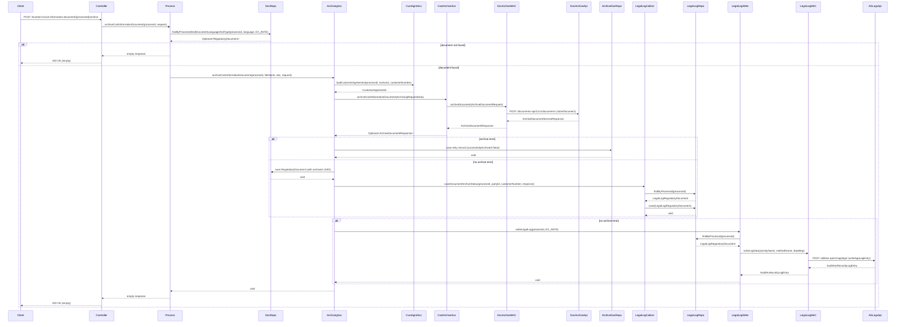

# Chain — ExAnteController · POST /exante/v1/cost-information-document/{processId}/archive

<!-- scaffold — phase 1 -->

- **Action point** — `ExAnteController` (wpfe-am / ucc-exante)
- **Kind** — rest-controller
- **Source** — `ucc-exante/src/main/java/coba/wtp/wpfe/ucc/exante/controller/ExAnteController.java`
- **Handler** — `archiveCostInformationDocument(String, JsonRequest<ExAnteDocumentArchiveRequest>)` — `ExAnteController.java:113`
- **Trigger** — `POST /exante/v1/cost-information-document/{processId}/archive`
- **Preconditions** — authorization (`WPFE_AM_EXANTE_READ`) enforced by the process layer via `@PreAuthorize`; no request-body validation observed in the controller
- **First hop** — `ExAnteProcess` (wpfe-am / ucc-exante), specifically `ExAnteProcessImpl.archiveCostInformationDocument(String, ExAnteDocumentArchiveRequest)`

<!-- analysis — phase 2 -->

## Story

As a **bank advisor or back-office operator** in an advisory session, I want to archive the ExAnte cost information PDF document for a process so that it is stored permanently in the DDMS document archive and all regulatory audit trails are updated.

- **Given** a `processId` identifying a completed ExAnte calculation and an `ExAnteDocumentArchiveRequest` carrying the customer number, scenario, and document language
- **When** `POST /exante/v1/cost-information-document/{processId}/archive` is called with that request body
- **Then** the previously generated cost information PDF is retrieved from the database, sent to the DDMS documents archive API, and a legal log entry is written — all gated on whether the document actually exists for that process
- **Unless** no ExAnte regulatory document was ever saved for this `processId` — in which case the call silently returns without error

## Chain

```text
Branch 1 · primary
  ExAnteController.archiveCostInformationDocument(String, JsonRequest<ExAnteDocumentArchiveRequest>)
  → ExAnteProcessImpl.archiveCostInformationDocument(String, ExAnteDocumentArchiveRequest)
    → RegulatoryDocumentRepository.findByProcessIdAndDocumentLanguageAndType(String, DocumentLanguage, RegulatoryDocumentType)
      ⇒ [db]  REGULATORY_DOCUMENT
Branch 2 · diverges at ExAnteProcessImpl
  → DocumentArchivingService.archiveCostInformationDocument(String, String, RegulatoryDocument, ExAnteDocumentArchiveRequest)
    → CustomerAgreementService.loadCustomerAgreement(String, Scenario, String)
      ⇒ [external]  customer agreement service (wpfe-shared / wpfe-shared-customer)
    → CostInformationArchiveService.archiveCostInformationDocument(ArchivingRequestData)
      → DocumentArchiveMnCImpl.archiveDocument(ArchiveDocumentRequest)
        → DocumentsArchiveApiClient.storeDocument(StoreDocumentRequest)
          ⇒ [external]  DDMS documents archive API (wpfe-shared / wpfe-shared-documents)
    → RegulatoryDocumentArchiveRepository.save(RegulatoryDocumentArchive)
      ⇒ [db]  REGULATORY_DOCUMENT_ARCHIVE
    → RegulatoryDocumentRepository.save(RegulatoryDocument)
      ⇒ [db]  REGULATORY_DOCUMENT
    → LegalLogCollectDataService.saveDocumentArchiveStatus(String, String, String, ArchiveDocumentResponse)
      → LegalLogRegulatoryDocumentRepository.findByProcessId(String)
        ⇒ [db]  LEGAL_LOG_REGULATORY_DOCUMENT
      → LegalLogRegulatoryDocumentRepository.save(LegalLogRegulatoryDocument)
        ⇒ [db]  LEGAL_LOG_REGULATORY_DOCUMENT
    → LegalLogWriteDataService.writeLegalLog(String, RegulatoryDocumentType)
      → LegalLogRegulatoryDocumentRepository.findByProcessId(String)
        ⇒ [db]  LEGAL_LOG_REGULATORY_DOCUMENT
      → LegalLogMnCImpl.writeLogData(String, String, Map<String, String>)
        → AuditAndSecurityLogApiClient.writeAppLogEntry(AuditAndSecurityLogRequest)
          ⇒ [external]  A+S Logs utilities API (wpfe-shared / wpfe-shared-logs)
```

- **Terminals reached** — `external` (DDMS documents archive API, via `DocumentsArchiveApiClient`; A+S Logs utilities API, via `AuditAndSecurityLogApiClient`; customer agreement service, via `CustomerAgreementService`), `db` (`REGULATORY_DOCUMENT`, `REGULATORY_DOCUMENT_ARCHIVE`, `LEGAL_LOG_REGULATORY_DOCUMENT`)

## Diagrams

### Process flow — primary

```mermaid
flowchart LR
  A(["POST /exante/v1/cost-information-document/{processId}/archive"]) --> B[ExAnteController]
  B --> C[ExAnteProcessImpl.archiveCostInformationDocument]
  C --> D{RegulatoryDocument found?}
  D -- no --> E([empty ProcessResponse])
  D -- yes --> F[CustomerAgreementService.loadCustomerAgreement]
  F --> G[CostInformationArchiveService.archiveCostInformationDocument]
  G --> H[DocumentArchiveMnCImpl.archiveDocument]
  H --> I[DocumentsArchiveApiClient.storeDocument]
  I --> J([external/DDMS documents archive API])
  J --> K{archive error?}
  K -- yes --> L[RegulatoryDocumentArchiveRepository.save retry record]
  L --> M([db/REGULATORY_DOCUMENT_ARCHIVE])
  K -- no --> N[saveArchivedDocumentUUID]
  N --> O[RegulatoryDocumentRepository.save]
  O --> P([db/REGULATORY_DOCUMENT])
  N --> Q[LegalLogCollectDataService.saveDocumentArchiveStatus]
  Q --> R{legal log exists?}
  R -- no --> S[throw BusinessException]
  R -- yes --> T[LegalLogRegulatoryDocumentRepository.save]
  T --> U([db/LEGAL_LOG_REGULATORY_DOCUMENT])
  K -- no --> V{archive error null?}
  V -- no --> W(legal log retry — skipped)
  V -- yes --> X[LegalLogWriteDataService.writeLegalLog]
  X --> Y[LegalLogMnCImpl.writeLogData]
  Y --> Z[AuditAndSecurityLogApiClient.writeAppLogEntry]
  Z --> AA([external/A+S Logs utilities API])
```



### Sequence — primary



## Journey

When the **advisor or back-office operator clicks "Archive"** in the ExAnte cost information calculator UI, the request enters at step 1 to archive a previously generated PDF document into the DDMS permanent archive. Once that completes, the flow moves to step 2 because the process layer must first verify the document exists before attempting any archival.

1. **ExAnteController.archiveCostInformationDocument** (wpfe-am / ucc-exante)

   **Source.** `ucc-exante/src/main/java/coba/wtp/wpfe/ucc/exante/controller/ExAnteController.java:108`

   **Role.** Receives the HTTP POST carrying a `processId` path parameter and an `ExAnteDocumentArchiveRequest` body (scenario, document language, customer number), then delegates to the process layer.

   **Preconditions.** Authorization enforced by `@PreAuthorize("protect('WPFE_AM_EXANTE_READ')")` on the process method — the controller itself does not check permissions. The request body must be a valid JSON with all four fields populated.

   **Effect.** Wraps the process response in `JsonResponseBuilder.buildJsonResultResponse()` and returns it as the HTTP 200 OK body (always empty for this endpoint).

   **Downstream.** ExAnteProcessImpl.archiveCostInformationDocument(String, ExAnteDocumentArchiveRequest)

2. **ExAnteProcessImpl.archiveCostInformationDocument** (wpfe-am / ucc-exante)

   **Source.** `ucc-exante/src/main/java/coba/wtp/wpfe/ucc/exante/process/impl/ExAnteProcessImpl.java:237`

   **Role.** Locates the ExAnte cost information PDF in the database by process ID, document language (DE), and regulatory document type (EX_ANTE). If found, delegates to DocumentArchivingService for the full archival workflow. If not found, returns an empty ProcessResponse silently — no error is raised.

   **Steps.**

   - **2.1 Query — find the ExAnte cost information document** · `ExAnteProcessImpl.java:240`

     **Role.** Calls `regulatoryDocumentRepository.findByProcessIdAndDocumentLanguageAndType(processId, request.documentLanguage(), RegulatoryDocumentType.EX_ANTE)` to retrieve the previously saved PDF. The query uses a JPQL that left-joins `archivedDocumentDataList` so archived metadata is eagerly loaded.

     **Effect.** Returns an `Optional<RegulatoryDocument>` — present if a document was generated for this process, empty otherwise.

   - **2.2 Conditional — archive only if the document exists** · `ExAnteProcessImpl.java:243`

     **Role.** Uses `.ifPresent()` to invoke DocumentArchivingService only when the Optional is non-empty. If the document does not exist (the process was started but never completed, or the document was deleted), the method returns an empty ProcessResponse without error.

     **On failure.** Nothing fails — a missing document is treated as a no-op, which means an advisor who re-archives after deleting the document will get a silent success with nothing actually archived. This is a potential data integrity gap.

   **Downstream.** Branch 1: DocumentArchivingService (when document found). Branch 2: empty return (when not found).

3. **DocumentArchivingService.archiveCostInformationDocument** (wpfe-am / ucc-exante)

   **Source.** `ucc-exante/src/main/java/coba/wtp/wpfe/ucc/exante/service/document/DocumentArchivingService.java:64`

   **Role.** Orchestrates the full archival workflow for one ExAnte cost information document. Loads customer agreement data to obtain the long-term customer number, determines the acting party identifier based on channel type (branch vs. online), calls the DDMS archive service with the PDF byte array and metadata, then updates local database records and legal logs.

   **Steps.**

   - **3.1 Load — customer agreement for long-term ID** · `DocumentArchivingService.java:70`

     **Role.** Calls `customerAgreementService.loadCustomerAgreement(processId, scenario, customerNumber)` to retrieve the CustomerAgreement entity and extract the `longTermCustomerId`. This is needed by DDMS as a reference field in the archive metadata.

     **Also reached by:** [exante-controller-get-validation](../chain-traces/exante-controller-get-validation.md)

   - **3.2 Resolve — acting party identifier** · `DocumentArchivingService.java:74-78`

     **Role.** Determines who performed the archive action. If the channel is a branch (teller counter), it reads from the authentication context's PersonContext to get the teller's BPKN. Otherwise (online banking), it falls back to the PersonIdentifier from the user session. This identifier is used as the `partyId` in both the retry record and the legal log.

   - **3.3 Archive — send PDF to DDMS** · `DocumentArchivingService.java:80`

     **Role.** Builds an `ArchivingRequestData` object containing the process ID, scenario, document language, customer number, long-term customer number, acting party BPKN, filename, and the raw PDF byte array from the RegulatoryDocument entity. Passes it to CostInformationArchiveService which maps it into a DDMS-specific ArchiveDocumentRequest with full metadata.

     **Effect.** Returns an `Optional<ArchiveDocumentResponse>` containing either the external document UUID assigned by DDMS or an error object if the archive call failed.

   - **3.4 Conditional — retry record on failure** · `DocumentArchivingService.java:82`

     **Role.** If `archiveDocumentResponse.get().getArchiveDocumentError() != null`, saves a `RegulatoryDocumentArchive` entity with `successfullyArchived = false`. This enables a background job to retry the DDMS call later. The retry record carries the party ID, customer number, long-term customer number, scenario, and a reference to the original RegulatoryDocument.

   - **3.5 Conditional — persist archived UUID on success** · `DocumentArchivingService.java:87`

     **Role.** If no archive error occurred, creates an `ArchivedDocumentData` entity with the external document UUID from DDMS, the archiving base date (formatted as `yyyyMMdd`), and a reference back to the RegulatoryDocument. Adds it to the `archivedDocumentDataList` on the existing RegulatoryDocument entity and saves the updated entity via `regulatoryDocumentRepository.save()`. This links the local document record to its permanent archive location.

   - **3.6 Update — legal log archive status** · `DocumentArchivingService.java:92`

     **Role.** Calls `legalLogCollectDataService.saveDocumentArchiveStatus(processId, actingPartyId, customerNumber, response)` which fetches or creates a LegalLogRegulatoryDocument entity for this process and writes the archive outcome (API status, external document UUID) into its DocumentArchiveStatus sub-object. This is always called regardless of success or failure.

   - **3.7 Conditional — write legal log on clean success** · `DocumentArchivingService.java:94`

     **Role.** If no archive error occurred (`getArchiveDocumentError() == null`), calls `legalLogWriteDataService.writeLegalLog(processId, RegulatoryDocumentType.EX_ANTE)` to send a structured audit entry to the A+S Logs system. The legal log is deliberately skipped on failure because the retry path writes its own legal log later (see step 3.4's retry record).

   **On failure.** If CustomerAgreementService throws an exception, it propagates up and aborts the entire archive operation. If DDMS returns an error, the PDF is not archived but local records are still updated with the error status.

4. **CustomerAgreementService.loadCustomerAgreement** (wpfe-am / wpfe-am-commons)

   **Source.** `wpfe-am-commons/src/main/java/coba/wtp/wpfe/am/commons/service/exante/CustomerAgreementService.java:28`

   **Role.** Loads the customer agreement for a given process ID, scenario, and customer number. Returns a CustomerAgreement entity carrying the long-term customer ID needed by DDMS.

   **Also reached by:** [exante-controller-get-validation](../chain-traces/exante-controller-get-validation.md)

5. **CostInformationArchiveService.archiveCostInformationDocument** (wpfe-am / wpfe-am-commons)

   **Source.** `wpfe-am-commons/src/main/java/coba/wtp/wpfe/am/commons/service/document/archiving/exante/CostInformationArchiveService.java:67`

   **Role.** Maps the generic ArchivingRequestData into a DDMS-specific ArchiveDocumentRequest with full metadata. The metadata includes storage quality ("1"), storage rules ("F001"), document type ID (PK or FK depending on channel), file format ("pdf/ua1"), creator info, language, timestamps, customer identifiers, and confidentiality settings. Encodes the PDF byte array as Base64 before sending.

   **Steps.**

   - **5.1 Map — generate DDMS metadata** · `CostInformationArchiveService.java:98`

     **Role.** Builds a Metadata object with ~30 fields including storage quality, document type ID (determined by ChannelUtils.isFKChannel), reference period from date, language, upload time, creator system ("44-04-21"), program name ("Wertpapier Frontend WPFE"), source system ("01-36-63"), damage potential ("3"), and confidentiality level. The document type ID differs between private client (PK) and corporate client (FK) channels.

   - **5.2 Encode — Base64 the PDF** · `CostInformationArchiveService.java:78`

     **Role.** Encodes the raw PDF byte array as a Base64 string for transmission over HTTP to DDMS.

   **Downstream.** DocumentArchiveMnCImpl.archiveDocument(ArchiveDocumentRequest)

6. **DocumentArchiveMnCImpl.archiveDocument** (wpfe-shared / wpfe-shared-documents)

   **Source.** `wpfe-shared/wpfe-shared-documents/src/main/java/coba/wtp/wpfe/shared/documents/v1/mnc/impl/DocumentArchiveMnCImpl.java:47`

   **Role.** Maps the ArchiveDocumentRequest into a StoreDocumentRequest (adding channel, request ID, and security context), then calls DocumentsArchiveApiClient.storeDocument(). Catches HTTP 4xx and 5xx errors and wraps them in an ApiCallError on the response object rather than throwing — this allows the caller to inspect the error and decide whether to retry.

   **On failure.** HttpClientErrorException or HttpServerErrorException are caught, logged with the status code and body, and stored as an ArchiveDocumentError on the response. Other exceptions are similarly captured. The method never throws — it always returns a response object that may or may not contain an error.

   **Downstream.** DocumentsArchiveApiClient.storeDocument(StoreDocumentRequest)

7. **DocumentsArchiveApiClient.storeDocument** (wpfe-shared / wpfe-shared-documents)

   **Source.** `wpfe-shared/wpfe-shared-documents/src/main/java/coba/wtp/wpfe/shared/documents/api/archivedocument/DocumentsArchiveApiClient.java:53`

   **Role.** Performs an HTTP POST to the DDMS documents archive API at `{baseurl}/documents-api/11/v1/documents?supplierId=01-36-63` with the ArchiveDocumentRequest as JSON body. Returns the response body wrapped in Optional.

   **Terminal — external** · DDMS documents archive API (wpfe-shared / wpfe-shared-documents)

8. **RegulatoryDocumentArchiveRepository.save** (wpfe-am / wpfe-am-commons)

   **Source.** `wpfe-am-commons/src/main/java/coba/wtp/wpfe/am/commons/repository/RegulatoryDocumentArchiveRepository.java:1`

   **Role.** Persists a retry record for a failed DDMS archive operation. The entity carries the party ID, customer number, long-term customer number, scenario, and flags indicating `successfullyArchived = false` and `successfullyUpdatedMetaData = NOT_METADATA_UPDATE`. A background job reads these records to retry the archive.

   **Terminal — db** · REGULATORY_DOCUMENT_ARCHIVE table (wpfe-am / wpfe-am-commons)

9. **RegulatoryDocumentRepository.save** (wpfe-am / wpfe-am-commons)

   **Source.** `wpfe-am-commons/src/main/java/coba/wtp/wpfe/am/commons/repository/RegulatoryDocumentRepository.java:1`

   **Role.** Persists the updated RegulatoryDocument entity with its newly populated `archivedDocumentDataList`. The ArchivedDocumentData sub-entity carries the external document UUID from DDMS, archiving base date, and party ID. This links the local cost information PDF to its permanent archive location.

   **Terminal — db** · REGULATORY_DOCUMENT table (wpfe-am / wpfe-am-commons)

10. **LegalLogCollectDataService.saveDocumentArchiveStatus** (wpfe-am / wpfe-am-commons)

    **Source.** `wpfe-am-commons/src/main/java/coba/wtp/wpfe/am/commons/service/LegalLogCollectDataService.java:97`

    **Role.** Fetches the LegalLogRegulatoryDocument entity for this process ID. If not found, throws a BusinessException (cancelling exception with message key "wpfe.am.legallog.no_legal_log_data"). Sets the party ID, customer number, core tenant, and document archive status (API OK or ERROR based on whether ArchiveDocumentResponse contains an error). Saves the updated entity.

    **Steps.**

    - **10.1 Fetch — legal log for process** · `LegalLogCollectDataService.java:113`

      **Role.** Calls `legalLogRegulatoryDocumentRepository.findByProcessId(processId)`. Throws if empty — this means the document was never rendered (no legal log was initialized), which is a precondition violation.

    - **10.2 Update — archive status** · `LegalLogCollectDataService.java:123`

      **Role.** Creates or updates the DocumentArchiveStatus sub-object with the external document UUID and API status (OK if no error, ERROR otherwise). Sets party ID, customer number, and core tenant.

    **On failure.** BusinessException thrown if no legal log exists for this process — the archive cannot proceed without a pre-initialized legal log entry from the document render step.

11. **LegalLogRegulatoryDocumentRepository.findByProcessId** (wpfe-am / wpfe-am-commons)

    **Source.** `wpfe-am-commons/src/main/java/coba/wtp/wpfe/am/commons/repository/LegalLogRegulatoryDocumentRepository.java:7`

    **Role.** Reads the legal log regulatory document entity for a given process ID. Used by both LegalLogCollectDataService and LegalLogWriteDataService.

    **Terminal — db** · LEGAL_LOG_REGULATORY_DOCUMENT table (wpfe-am / wpfe-am-commons)

12. **LegalLogRegulatoryDocumentRepository.save** (wpfe-am / wpfe-am-commons)

    **Source.** `wpfe-am-commons/src/main/java/coba/wtp/wpfe/am/commons/repository/LegalLogRegulatoryDocumentRepository.java:1`

    **Role.** Persists the updated LegalLogRegulatoryDocument entity with its DocumentArchiveStatus sub-object. This records whether the archive call succeeded or failed in the legal log.

    **Terminal — db** · LEGAL_LOG_REGULATORY_DOCUMENT table (wpfe-am / wpfe-am-commons)

13. **LegalLogWriteDataService.writeLegalLog** (wpfe-am / wpfe-am-commons)

    **Source.** `wpfe-am-commons/src/main/java/coba/wtp/wpfe/am/commons/service/LegalLogWriteDataService.java:54`

    **Role.** Reads the legal log regulatory document for this process, maps its data into a key-value map (party ID, customer number, process ID, tenant, render status, archive status), and sends it to the A+S Logs system via LegalLogMnC. For EX_ANTE documents, it includes the ExAnte render status and archive status keys.

    **Steps.**

    - **13.1 Fetch — legal log for process** · `LegalLogWriteDataService.java:56`

      **Role.** Same query as step 10.1 — reads LegalLogRegulatoryDocument by process ID. Throws BusinessException if not found.

    - **13.2 Map — common data fields** · `LegalLogWriteDataService.java:84`

      **Role.** Puts party ID, customer number, unique process ID, and tenant into the data map under German keys ("Handelnde Person", "Kundennummer", "Einzigartige Prozess-ID", "Mandant").

    - **13.3 Map — ExAnte render status** · `LegalLogWriteDataService.java:64`

      **Role.** Maps the DocumentRenderStatus API status to a German key ("Status DocFamily ExAnte") with value OK, ERROR, or UNKNOWN.

    - **13.4 Map — ExAnte archive status** · `LegalLogWriteDataService.java:65`

      **Role.** Maps the DocumentArchiveStatus to "Status Archivierung ExAnte" with value containing the external document UUID on success, or ERROR on failure.

    - **13.5 Send — write log data** · `LegalLogWriteDataService.java:67`

      **Role.** Calls `legalLogMnC.writeLogData(activityName, methodName, data)` where activity name and method name are ExAnte-specific constants from LegalLogMethod enum.

    **On failure.** BusinessException thrown if no legal log exists for this process — same precondition as step 10.1.

14. **LegalLogMnCImpl.writeLogData** (wpfe-shared / wpfe-shared-logs)

    **Source.** `wpfe-shared/wpfe-shared-logs/src/main/java/coba/wtp/wpfe/shared/logs/v1/mnc/impl/LegalLogMnCImpl.java:50`

   **Role.** Maps the key-value data map into a ComDyn-encoded payload string (hex encoding with length prefixes), builds an AuditAndSecurityLogRequest with channel, request ID, authentication context, action name, activity name, and timestamp. Calls AuditAndSecurityLogApiClient.writeAppLogEntry().

    **Steps.**

    - **14.1 Encode — ComDyn payload** · `LegalLogMnCImpl.java:68`

      **Role.** Iterates through each key-value pair in the data map and encodes it using ComDyn format: each character is hex-encoded (except A-Z, a-z, 0-9 which pass through), prefixed with an 'S' length marker (6-digit zero-padded count). The entire payload is then prefixed with a 'C' length marker. This binary-compatible encoding is required by the A+S Logs mainframe interface.

    - **14.2 Build — request with channel context** · `LegalLogMnCImpl.java:78`

      **Role.** Sets internal user ID for online channels or staff number for branch channels, consumer ID from channel config, and application name from Spring Boot properties.

    **Downstream.** AuditAndSecurityLogApiClient.writeAppLogEntry(AuditAndSecurityLogRequest)

15. **AuditAndSecurityLogApiClient.writeAppLogEntry** (wpfe-shared / wpfe-shared-logs)

    **Source.** `wpfe-shared/wpfe-shared-logs/src/main/java/coba/wtp/wpfe/shared/logs/api/AuditAndSecurityLogApiClient.java:42`

    **Role.** Performs an HTTP POST to the A+S Logs utilities API at `{baseurl}/utilities-api/v1/applogs/` with the AuditAndSecurityLogRequest as JSON body. Adds a CoBa-Consumer-Channel-Number header. Catches 4xx and 5xx errors silently (logs them but does not rethrow) and returns Optional.empty() on failure — the caller receives null.

    **Terminal — external** · A+S Logs utilities API (wpfe-shared / wpfe-shared-logs)

## Data reached

- **external — DDMS documents archive API, via `DocumentsArchiveApiClient` (wpfe-shared / wpfe-shared-documents)**
  - Business problem solved — As the **archiving service**, I need to store the ExAnte cost information PDF permanently in the DDMS document management system so that it survives local database operations and is accessible for regulatory audits. Therefore we POST `POST /documents-api/11/v1/documents?supplierId=01-36-63` with a Base64-encoded PDF and ~30 metadata fields to retrieve an external document UUID from DDMS.

  - **Request path**
    ```json
    {
      "processRunId": "abc-123-def",
      "fullFileName": "Kosteninformation_VV_2024.pdf",
      "representationDescr": "Kosteninformation zur Vermögensverwaltung"
    }
    ```
    `processRunId` ← request path parameter, origin: controller trigger
    `fullFileName` ← derived from RegulatoryDocumentType.EX_ANTE + document language, origin: process layer
    `representationDescr` ← "Kosteninformation zur Vermögensverwaltung" (DE) or "Cost information for an Asset Management Agreement" (EN), origin: hardcoded in CostInformationArchiveService.java:31-32

  - **Request body** — ArchiveDocumentRequest with Metadata containing ~30 fields including storage quality ("1"), document type ID (PK="800150044037" for private client, FK="800150030176" for corporate client), file format ("pdf/ua1"), creator system ("44-04-21"), language ("de" or "en"), upload time (ISO timestamp with milliseconds), customer number, long-term customer number, person ID (BPKN of acting party), program name ("Wertpapier Frontend WPFE"), source system ("01-36-63"), damage potential ("3"), confidentiality level ("2"), and the PDF as a Base64 string.

  - **Response fields used**
    ```json
    {
      "externalDocumentId": "EXT-UUID-7f8a9b0c",
      "internalDocumentId": "INT-UUID-3d4e5f6a"
    }
    ```
    `externalDocumentId` → stored as ArchivedDocumentData.externalDocumentUUID (Journey step 3.5)
    `internalDocumentId` → captured but not used in this chain

  - **Response fields discarded** — internalDocumentId is returned by DDMS but never consumed; the response also carries no error indicator on success.

- **external — A+S Logs utilities API, via `AuditAndSecurityLogApiClient` (wpfe-shared / wpfe-shared-logs)**
  - Business problem solved — As the **legal log write service**, I need to record that an ExAnte document was successfully archived in the central Audit and Security Logs system so that compliance auditors can verify the archive action. Therefore we POST `POST /utilities-api/v1/applogs/` with a ComDyn-encoded payload containing German-labeled key-value pairs (party ID, customer number, process ID, tenant, render status, archive status).

  - **Request path**
    ```json
    {
      "actionName": "Archivierung",
      "activityName": "ExAnte",
      "data": "C000012S000004Handelnde PersonS00000712345678..."
    }
    ```
    `actionName` ← hardcoded German label, origin: LegalLogWriteDataService.java (e.g., "Archivierung")
    `activityName` ← ExAnte-specific constant from LegalLogMethod enum
    `data` ← ComDyn-encoded key-value map, origin: step 14.1

  - **Request body** — AuditAndSecurityLogRequest with channel number, request ID, authentication context, timestamp (ISO 8601), internal user ID or staff number depending on channel type, consumer ID from Spring config, and application name.

  - **Response fields used**
    ```json
    {
      "correlationId": "CORR-abc-def-123"
    }
    ```
    `correlationId` → wrapped into AuditAndSecurityLogEntry but not further consumed in this chain

  - **Response fields discarded** — the API catches all HTTP errors internally and returns Optional.empty() on failure; no structured error information is returned to the caller.

- **external — customer agreement service, via `CustomerAgreementService` (wpfe-shared / wpfe-shared-customer)**
  - Business problem solved — As the **archiving service**, I need the customer's long-term customer ID so that DDMS receives a complete reference number in the archive metadata. Therefore we call `POST /customer-agreement/v1/agreement` (or equivalent internal endpoint) with processId, scenario, and customer number to retrieve the CustomerAgreement entity.

  - **Request path** — resolved internally by CustomerAgreementService; exact HTTP path not visible in this module's source code.

  - **Response fields used**
    ```json
    {
      "longTermCustomerId": "LT-9876543210"
    }
    ```
    `longTermCustomerId` → passed to DDMS as part of archive metadata (Journey step 3.3)

  - **Response fields discarded** — the full CustomerAgreement entity carries many more fields (customer name, address, products) that are not used in this chain.

- **db — `REGULATORY_DOCUMENT`, via `RegulatoryDocumentRepository` (wpfe-am / wpfe-am-commons)**
  - Business problem solved — As the **process layer**, I need to retrieve the previously generated ExAnte cost information PDF so that it can be sent to DDMS for permanent archiving. Therefore we query `REGULATORY_DOCUMENT` via `findByProcessIdAndDocumentLanguageAndType(processId, documentLanguage, EX_ANTE)` with a JPQL left-join on `archivedDocumentDataList` to eagerly load archived metadata. Then we update the entity's `archivedDocumentDataList` with the new external UUID and save it back.

  - **Query** — `findByProcessIdAndDocumentLanguageAndType(String, DocumentLanguage, RegulatoryDocumentType)` — read-only on the initial lookup; write via `save()` after updating archivedDocumentDataList.

  - **Argument**
    ```json
    {
      "processId": "abc-123-def",
      "documentLanguage": "DE",
      "regulatoryDocumentType": "EX_ANTE"
    }
    ```
    `processId` ← request path parameter, origin: controller trigger
    `documentLanguage` ← from ExAnteDocumentArchiveRequest.scenario(), origin: UI selection
    `regulatoryDocumentType` ← hardcoded as RegulatoryDocumentType.EX_ANTE in the process layer

  - **Response fields used** — `processId`, `documentLanguage`, `regulatoryDocumentType`, `document` (byte[] PDF), and `archivedDocumentDataList` (eagerly loaded via JPQL left join). The PDF byte array is Base64-encoded for DDMS transmission.

  - **Response fields discarded** — entity ID, updated timestamp, and any archived document data that was already present before this archive operation.

- **db — `REGULATORY_DOCUMENT_ARCHIVE`, via `RegulatoryDocumentArchiveRepository` (wpfe-am / wpfe-am-commons)**
  - Business problem solved — As the **archiving service**, I need to persist a retry record when DDMS rejects the archive so that a background job can attempt the call again later. Therefore we save a RegulatoryDocumentArchive entity with `successfullyArchived = false` and a reference back to the original RegulatoryDocument.

  - **Query** — `save(RegulatoryDocumentArchive)` — write-only, no read in this chain.

  - **Argument**
    ```json
    {
      "partyId": "1234567890",
      "customerNumber": "C-987654",
      "longTermCustomerNumber": "LT-9876543210",
      "scenario": "OPENING",
      "successfullyArchived": false,
      "archivingAborted": false
    }
    ```
    `partyId` ← acting party BPKN from authentication context, origin: step 3.2
    `customerNumber` ← from ExAnteDocumentArchiveRequest, origin: UI input
    `longTermCustomerNumber` ← from CustomerAgreementService, origin: step 3.1
    `scenario` ← from ExAnteDocumentArchiveRequest, origin: UI selection

- **db — `LEGAL_LOG_REGULATORY_DOCUMENT`, via `LegalLogRegulatoryDocumentRepository` (wpfe-am / wpfe-am-commons)**
  - Business problem solved — As the **legal log service**, I need to record whether the archive operation succeeded or failed in the legal log so that compliance auditors can trace the full document lifecycle. Therefore we query `LEGAL_LOG_REGULATORY_DOCUMENT` via `findByProcessId(processId)` for the pre-initialized legal log entry, then update its DocumentArchiveStatus sub-object with the external UUID and API status.

  - **Query** — `findByProcessId(String)` — read-only lookup; `save()` writes the updated entity back.

  - **Argument**
    ```json
    {
      "processId": "abc-123-def"
    }
    ```
    `processId` ← request path parameter, origin: controller trigger

  - **Response fields used** — party ID, customer number, core tenant (set by LegalLogCollectDataService), DocumentArchiveStatus sub-object with external document UUID and API status (OK or ERROR). For the write path, also reads DocumentRenderStatus to include in the A+S Logs payload.

  - **Response fields discarded** — Suitability sub-object (not relevant for ExAnte documents), any render status data from prior operations.

## Acceptance Criteria

1. **Document found and archived successfully** — Given a process ID with an existing ExAnte cost information PDF in REGULATORY_DOCUMENT, when `POST /exante/v1/cost-information-document/{processId}/archive` is called with valid request body fields, then the PDF is sent to DDMS via POST `/documents-api/11/v1/documents`, the external document UUID is stored in REGULATORY_DOCUMENT.archivedDocumentDataList, a retry record is NOT created in REGULATORY_DOCUMENT_ARCHIVE, the legal log's DocumentArchiveStatus is set to OK, and an A+S Logs entry is written with archive status containing the external UUID.
   - Evidence: `ExAnteProcessImpl.java:240-248`, `DocumentArchivingService.java:64-103`, `CostInformationArchiveService.java:67-95`, `DocumentsArchiveApiClient.java:53`
   - How to: call the endpoint with a processId that has an existing REGULATORY_DOCUMENT row of type EX_ANTE, stub DDMS to return success, and verify from query logs that REGULATORY_DOCUMENT is updated with archivedDocumentDataList, REGULATORY_DOCUMENT_ARCHIVE is not written, LEGAL_LOG_REGULATORY_DOCUMENT DocumentArchiveStatus.apiStatus = OK, and A+S Logs receives a POST.

2. **No document found — silent no-op** — Given a process ID for which no ExAnte regulatory document exists in the database, when `POST /exante/v1/cost-information-document/{processId}/archive` is called, then the response is HTTP 200 OK with an empty body and NO calls are made to CustomerAgreementService, DDMS, any repository save, or A+S Logs.
   - Evidence: `ExAnteProcessImpl.java:243` — `.ifPresent()` on Optional.empty() executes nothing
   - How to: call the endpoint with a processId that has no REGULATORY_DOCUMENT row of type EX_ANTE and confirm from query logs that only the initial findByProcessIdAndDocumentLanguageAndType query runs (returning empty) and no other database writes or external calls occur.

3. **DDMS archive failure — retry record created** — Given a process ID with an existing ExAnte document, when DDMS returns an HTTP 500 error during the storeDocument call, then the response is still HTTP 200 OK (the error is captured internally), a RegulatoryDocumentArchive entity is saved with successfullyArchived=false in REGULATORY_DOCUMENT_ARCHIVE, the legal log's DocumentArchiveStatus.apiStatus is set to ERROR, and NO A+S Logs entry is written for the archive action.
   - Evidence: `DocumentArchiveMnCImpl.java:53-60` (catches HttpServerErrorException), `DocumentArchivingService.java:82-87` (saves retry on error), `DocumentArchivingService.java:94-96` (skips legal log write on error)
   - How to: call the endpoint with a valid processId, stub DDMS storeDocument to return 500, and verify REGULATORY_DOCUMENT_ARCHIVE has a new row with successfullyArchived=false, LEGAL_LOG_REGULATORY_DOCUMENT DocumentArchiveStatus.apiStatus = ERROR, and no A+S Logs POST occurred.

4. **Legal log not pre-initialized — exception thrown** — Given a process ID where the legal log entry does not exist in LEGAL_LOG_REGULATORY_DOCUMENT (e.g., the document was never rendered through the normal flow), when `POST /exante/v1/cost-information-document/{processId}/archive` is called and the document exists, then LegalLogCollectDataService.saveDocumentArchiveStatus throws a BusinessException with message key "wpfe.am.legallog.no_legal_log_data" and the request fails.
   - Evidence: `LegalLogCollectDataService.java:113-117`
   - How to: create a REGULATORY_DOCUMENT row for a processId that has no corresponding LEGAL_LOG_REGULATORY_DOCUMENT row, call the endpoint, and confirm the response is a 500 with the BusinessException message.

5. **Document language correctly passed to DDMS** — Given an ExAnte document in German (DE), when archived, then the DDMS metadata includes representationDescr = "Kosteninformation zur Vermögensverwaltung" and language = "de". Given English (EN), then representationDescr = "Cost information for an Asset Management Agreement" and language = "en".
   - Evidence: `CostInformationArchiveService.java:31-32` (TITLE_DE, TITLE_EN constants) and `CostInformationArchiveService.java:86` (language from DocumentLanguage)
   - How to: call the endpoint with documentLanguage=DE and verify DDMS receives "de" in metadata; repeat with EN and verify "en".

6. **Document type ID depends on channel** — Given a private client (PK) channel, when the archive request is sent to DDMS, then the metadata's documentTypeId = "800150044037". Given a corporate client (FK) channel, then documentTypeId = "800150030176".
   - Evidence: `CostInformationArchiveService.java:39-40` and `CostInformationArchiveService.java:82` (ChannelUtils.isFKChannel check)
   - How to: call the endpoint with a PK channel context and verify documentTypeId = "800150044037"; repeat with FK channel and verify "800150030176".

## Business Takeaways

- **What this does for the business** — archives an ExAnte cost information PDF from temporary local storage into DDMS permanent document management, records the archive outcome in the legal log, and writes a compliance audit entry to A+S Logs. If the document was never generated, the call silently succeeds with no effect.
- **Depends on** — the REGULATORY_DOCUMENT table (read then write), the customer agreement service (external, long-term customer ID only), DDMS documents archive API (external, PDF + metadata → external UUID), and A+S Logs utilities API (external, compliance audit entry)
- **Ingredients** — `processId` (request path parameter), `scenario` (request body), `documentLanguage` (DE or EN, request body), `customerNumber` (request body)
- **Preparation** — the ExAnte cost information PDF must have been previously generated and saved to REGULATORY_DOCUMENT by the create-cost-information-document endpoint; a legal log entry must exist in LEGAL_LOG_REGULATORY_DOCUMENT initialized during document rendering
- **Dish** — HTTP 200 OK with empty body (always), plus side effects: DDMS stores the PDF permanently, REGULATORY_DOCUMENT is updated with the external UUID, and the legal log records archive success or failure
