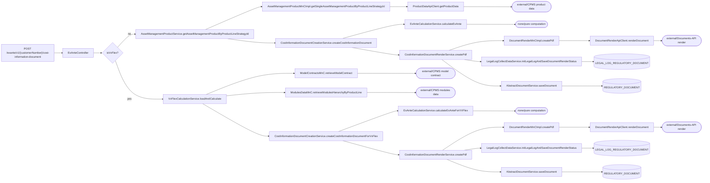
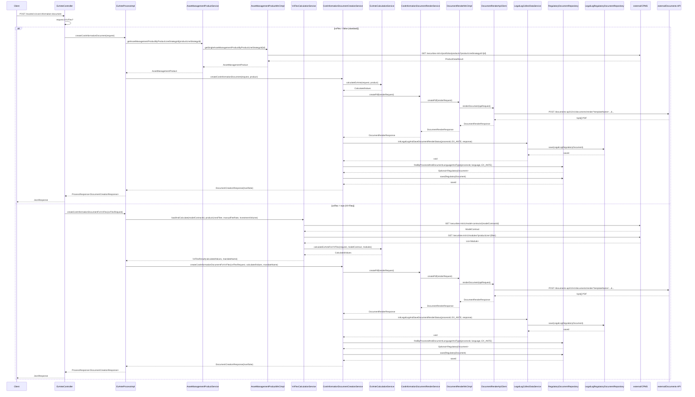

# Chain — ExAnteController · POST /exante/v1/cost-information-document

<!-- scaffold — phase 1 -->

- **Action point** — `ExAnteController` (wpfe-am / ucc-exante)
- **Kind** — rest-controller
- **Source** — `ucc-exante/src/main/java/coba/wtp/wpfe/ucc/exante/controller/ExAnteController.java`
- **Handler** — `createCostInformationDocument(JsonRequest<DocumentCreationRequest>)` — `ExAnteController.java:74`
- **Trigger** — `POST /exante/v1/cost-information-document`
- **Preconditions** — authorization (`WPFE_AM_EXANTE_READ`) enforced by the process layer via `@PreAuthorize`; no request-body validation observed in the controller. The handler branches on `request.isVvFlex()` to dispatch to either the standard or VV-Flex code path.
- **First hop** — `ExAnteProcess` (wpfe-am / ucc-exante), specifically `ExAnteProcessImpl.createCostInformationDocument(DocumentCreationRequest)` or `createCostInformationDocumentForVvFlex(VvFlexDocumentCreationRequest)`

<!-- analysis — phase 2 -->

## Story

As a **retail customer in an advisory session**, I want a cost information document (Ex-Ante) generated for my investment so that I can see the projected fees and costs before committing.

- **Given** a process ID, product line strategy ID (or VV-Flex model contract), investment volume, and fee model
- **When** `POST /exante/v1/cost-information-document` is called with those parameters
- **Then** the system calculates all ex-ante costs, renders a PDF document, saves it to the database, logs the render status, and returns whether creation succeeded
- **Unless** no asset management product (standard) or model contract (VV-Flex) can be found — rejected with a technical exception

## Chain

```text
Branch 1 · primary
  ExAnteController.createCostInformationDocument(JsonRequest<DocumentCreationRequest>)
  → AssetManagementProductService.getAssetManagementProductByProductLineStrategyId(String)
    → AssetManagementProductMnCImpl.getSingleAssetManagementProductByProductLineStrategyId(String)
      → ProductDataApiClient.getProductData(ProductDataRequest)
      ⇒ [external]  CPMS product data API (wpfe-shared / cpms)

Branch 2 · diverges at ExAnteController.createCostInformationDocument
  → VvFlexCalculationService.loadAndCalculate(String, String, BigDecimal, BigDecimal)
    → ModelContractsMnC.retrieveModelContract(String)
      ⇒ [external]  CPMS model contract API (wpfe-shared / cpms)
    → ModulesDataMnC.retrieveModulesHierarchyByProductLine(String)
      ⇒ [external]  CPMS modules data API (wpfe-shared / cpms)

Branch 3 · diverges at ExAnteProcessImpl.createCostInformationDocument
  → CostInformationDocumentCreationService.createCostInformationDocument(DocumentCreationRequest, AssetManagementProduct)
    → ExAnteCalculationService.calculateExAnte(CalculateExAnteRequest, AssetManagementProduct)
      ⇒ [none]  pure cost computation (fee model lookup, rate extraction, amount calculation)
    → CostInformationDocumentRenderService.createPdf(CostInformationDocumentRenderRequest)
      → DocumentRenderMnCImpl.createPdf(RenderDocumentRequest)
        → DocumentRenderApiClient.renderDocument(RenderDocumentApiRequest)
        ⇒ [external]  Documents-API render service (wpfe-shared / documents)

Branch 4 · diverges at CostInformationDocumentCreationService.evaluateDocumentRenderResponse
  → LegalLogCollectDataService.initLegalLogAndSaveDocumentRenderStatus(String, RegulatoryDocumentType, DocumentRenderResponse)
    → LegalLogRegulatoryDocumentRepository.save(LegalLogRegulatoryDocument)
    ⇒ [db]  LEGAL_LOG_REGULATORY_DOCUMENT
  → AbstractDocumentService.saveDocument(String, RegulatoryDocumentType, DocumentLanguage, byte[])
    → RegulatoryDocumentRepository.findByProcessIdAndDocumentLanguageAndType(String, DocumentLanguage, RegulatoryDocumentType)
      ⇒ [db]  REGULATORY_DOCUMENT (read — check existing)
    → RegulatoryDocumentRepository.save(RegulatoryDocument)
      ⇒ [db]  REGULATORY_DOCUMENT (write)
```

- **Terminals reached** — `external` (CPMS product data API, via wpfe-shared / cpms; CPMS model contract and modules APIs, via wpfe-shared / cpms; Documents-API render service, via wpfe-shared / documents), `db` (REGULATORY_DOCUMENT, LEGAL_LOG_REGULATORY_DOCUMENT)

## Diagrams

### Process flow — primary



### Sequence — primary



## Journey

When the **POST /exante/v1/cost-information-document** endpoint fires, the request enters at step 1 to create an Ex-Ante cost information PDF document for a customer's investment. The flow branches on whether this is a standard product or VV-Flex (Efficient/Exclusive), then converges on rendering and persisting the document.

1. **ExAnteController.createCostInformationDocument** (wpfe-am / ucc-exante)

   **Source.** `ucc-exante/src/main/java/coba/wtp/wpfe/ucc/exante/controller/ExAnteController.java:74`

   **Role.** Receives the document creation request, inspects whether it is a VV-Flex product via `request.isVvFlex()`, and dispatches to either the standard or VV-Flex code path. For VV-Flex, it constructs a `VvFlexDocumentCreationRequest` wrapping the fee calculation parameters.

   **Preconditions.** Authorization (`WPFE_AM_EXANTE_READ`) enforced by `@PreAuthorize` on the process layer methods. No request-body validation observed in the controller itself.

   **On failure.** If `request.getData()` returns null, a NullPointerException propagates — no explicit null guard is present at this level.

   **Effect.** Dispatches to one of two process methods based on product type.

2. **ExAnteProcessImpl.createCostInformationDocument** (wpfe-am / ucc-exante)

   **Source.** `ucc-exante/src/main/java/coba/wtp/wpfe/ucc/exante/process/impl/ExAnteProcessImpl.java:173`

   **Role.** For standard products, fetches the asset management product by its strategy ID and delegates to the document creation service with both the request and the product data.

   **Steps.**

   - **2.1 Fetch — asset management product** · `ExAnteProcessImpl.java:175`
     **Role.** Calls `assetManagementProductService.getAssetManagementProductByProductLineStrategyId()` to retrieve the full product definition (fee models, cost components) needed for ex-ante calculation.

   - **2.2 Delegate — document creation** · `ExAnteProcessImpl.java:174`
     **Role.** Passes both the original request and the fetched product to `costInformationDocumentCreationService.createCostInformationDocument()`.

3. **AssetManagementProductService.getAssetManagementProductByProductLineStrategyId** (wpfe-am / ucc-exante)

   **Source.** `ucc-exante/src/main/java/coba/wtp/wpfe/ucc/exante/service/AssetManagementProductService.java:72`

   **Role.** Looks up a single asset management product by its strategy ID from CPMS via the MnC layer. Throws a technical exception if no matching product is found — this is the rejection path for invalid or missing products.

   **On failure.** `TechnicalExceptionFactory.createAndLogTechnicalException` with code `am.ucc.exante.service.assetManagementProductService.getAssetManagementProductByUniqueId` and message "No asset management product found with productLineStrategyId {id}" — fatal, no retry.

4. **AssetManagementProductMnCImpl.getSingleAssetManagementProductByProductLineStrategyId** (wpfe-am / wpfe-am-commons)

   **Source.** `wpfe-am-commons/src/main/java/coba/wtp/wpfe/am/commons/mnc/impl/AssetManagementProductMnCImpl.java:79`

   **Role.** Maps and calls the CPMS product data API. Constructs a `ProductDataRequest` with channel, request ID, security context, and the target `productLineStrategyId`. The result is cached via `@Cacheable("getSingleAssetManagementProductByProductLineStrategyId")`.

   **Effect.** Transforms the raw CPMS response (`coba.wtp.wpfe.shared.cpms.api.model.portfoliooperations.AssetManagementProduct`) into a domain `AssetManagementProduct`, mapping general attributes, profile costs, fee models, target market attributes, and sustainability attributes.

5. **ProductDataApiClient.getProductData** (wpfe-shared / wpfe-shared-cpms)

   **Source.** `wpfe-shared-cpms/src/main/java/coba/wtp/wpfe/shared/cpms/api/productData/ProductDataApiClient.java:47`

   **Role.** Sends a GET request to the CPMS investment operations API at `/securities-int/v1/portfolios/products?productLineStrategyId={id}`. Returns `Optional<ProductDataResult>` containing the product catalogue filtered to the requested strategy.

   **On failure.** Any HTTP exception is wrapped in a `TechnicalException` with code from the class name and message "Exception during: /portfolios/products api call" — fatal, no retry.

6. **ExAnteProcessImpl.createCostInformationDocumentForVvFlex** (wpfe-am / ucc-exante)

   **Source.** `ucc-exante/src/main/java/coba/wtp/wpfe/ucc/exante/process/impl/ExAnteProcessImpl.java:184`

   **Role.** For VV-Flex products, loads the model contract and modules from CPMS via `VvFlexCalculationService`, then delegates to the document creation service with pre-calculated values.

   **Steps.**

   - **6.1 Load and calculate** · `ExAnteProcessImpl.java:187`
     **Role.** Calls `vvFlexCalculationService.loadAndCalculate()` which fetches the ModelContract and its modules from CPMS, then computes weighted ex-ante costs.

   - **6.2 Delegate — document creation** · `ExAnteProcessImpl.java:193`
     **Role.** Passes the VV-Flex request, pre-calculated values, and mandate name to `costInformationDocumentCreationService.createCostInformationDocumentForVvFlex()`.

7. **VvFlexCalculationService.loadAndCalculate** (wpfe-am / wpfe-am-commons)

   **Source.** `wpfe-am-commons/src/main/java/coba/wtp/wpfe/am/commons/service/VvFlexCalculationService.java:58`

   **Role.** Loads the ModelContract and its module hierarchy from CPMS, then runs ex-ante cost calculation for VV-Flex products. Returns both the calculated values and the mandate name.

   **Steps.**

   - **7.1 Fetch — model contract** · `VvFlexCalculationService.java:68`
     **Role.** Calls `modelContractsMnC.retrieveModelContract(modelContractId)` to get the VV-Flex product definition including fee rates and proportions.
     **On failure.** Throws `TechnicalException` with code `am.commons.service.vvFlexCalculationService` if no contract is found — fatal.

   - **7.2 Fetch — modules hierarchy** · `VvFlexCalculationService.java:73`
     **Role.** Calls `modulesDataMnC.retrieveModulesHierarchyByProductLine(productLinesFilter)` to get all modules under the product line, then flattens the hierarchy (asset categories → asset classes → module classes → modules) into a flat list.

   - **7.3 Calculate — ex-ante costs** · `VvFlexCalculationService.java:78`
     **Role.** Delegates to `exAnteCalculationService.calculateExAnteForVVFlex()` with the model contract and module list for weighted cost computation.

8. **ModelContractsMnC.retrieveModelContract** (wpfe-shared / wpfe-shared-cpms)

   **Source.** Resolved via ledger — earlier chain `exante-controller-get-asset-management-product.md` traced this MnC to CPMS.

   **Role.** Maps and calls the CPMS model contract API. Retrieves a single ModelContract by its ID, including properties (fee rates, proportions) needed for VV-Flex cost calculation.

9. **ModulesDataMnC.retrieveModulesHierarchyByProductLine** (wpfe-shared / wpfe-shared-cpms)

   **Source.** Resolved via ledger — same CPMS API client pattern as ModelContractsMnC.

   **Role.** Maps and calls the CPMS modules data API. Retrieves the full module hierarchy for a product line, structured as asset categories containing asset classes containing module classes containing modules.

10. **ExAnteCalculationService.calculateExAnte** (wpfe-am / wpfe-am-commons)

    **Source.** `wpfe-am-commons/src/main/java/coba/wtp/wpfe/am/commons/service/exante/ExAnteCalculationService.java:34`

    **Role.** Computes all ex-ante cost components for a standard asset management product. Finds the matching fee model by investment volume and fee model name, extracts each cost component rate (asset management fees, profit share, custody fees, securities commissions, other fees, external services, product costs, grants, initial costs), calculates absolute amounts from rates × investment volume, applies minimum fee logic, sums service and product costs with and without tax, then rounds all values to 2 decimal places.

    **Steps.**

    - **10.1 Find matching fee model** · `ExAnteCalculationService.java:36`
      **Role.** Filters profile cost bands by investment volume (thresholdFrom < volume ≤ thresholdTo), then finds the fee model matching the requested name.
      **On failure.** Throws `TechnicalException` if no matching fee model is found — fatal.

    - **10.2 Extract rates** · `ExAnteCalculationService.java:43-68`
      **Role.** Reads each cost component rate (ASSET_MANAGEMENT_FEE_RATE, PROFIT_SHARE_RATE, CUSTODY_FEE_RATE, SECURITIES_COMMISSION_RATE, OTHER_FEE_RATE, EXTERNAL_SERVICES_RATE, PRODUCT_COST_INCLUDING_GRANTS_RATE, PAYED_OUT_GRANTS_RATE, INITIAL_COST_RATE, INITIAL_TRANSACTION_COST_RATE, CURRENCY_CONVERSION_COST_RATE) from the fee model's cost components.

    - **10.3 Calculate amounts** · `ExAnteCalculationService.java:45-68`
      **Role.** Multiplies each rate by investment volume to get absolute amounts. Applies minimum fee override (if minimumFee > calculated assetManagementFee, replaces it).

    - **10.4 Sum and tax** · `ExAnteCalculationService.java:73-79`
      **Role.** Sums service costs (asset management + profit share + custody + securities commission + other fees + external services) and product costs (product costs including grants + payed out grants). Computes total excluding taxes (service + product) and including taxes (service × 1.19 + product).

    - **10.5 Round and build** · `ExAnteCalculationService.java:81-123`
      **Role.** Rounds all values to 2 decimal places using HALF_UP, recalculates percentages from absolute amounts divided by investment volume, builds the CalculatedValues result object.

    **Effect.** Returns a fully populated `CalculatedValues` object with every cost component as both percentage and absolute amount — used for PDF rendering.

11. **ExAnteCalculationService.calculateExAnteForVVFlex** (wpfe-am / wpfe-am-commons)

    **Source.** `wpfe-am-commons/src/main/java/coba/wtp/wpfe/am/commons/service/exante/ExAnteCalculationService.java:97`

    **Role.** Computes ex-ante costs for VV-Flex products. Resolves the asset management fee rate (manual override or contract default), calculates weighted module cost rates from model contract proportions, then builds the calculated values with profit share and custody fees always zero.

    **Steps.**

    - **11.1 Resolve fee rate** · `ExAnteCalculationService.java:109`
      **Role.** Uses manualFeeRate from request if present; otherwise falls back to modelContract.properties.assetManagementFeeRate().

    - **11.2 Weight module rates** · `ExAnteCalculationService.java:123`
      **Role.** Iterates over ModelContract proportions, multiplies each module's cost rate by its current value weight, applies contract-level defaults when a module has no defined rate.

    - **11.3 Build VV-Flex values** · `ExAnteCalculationService.java:160`
      **Role.** Calculates absolute amounts from weighted rates × investment volume. Profit share and custody fees are always zero for ALL_IN_FEE products. Computes totals with tax (service costs × 1.19 + product costs). Initial costs, transaction costs, and currency conversion costs are set to zero.

    **Effect.** Returns `CalculatedValues` — same shape as standard path but with VV-Flex-specific values.

12. **CostInformationDocumentCreationService.createCostInformationDocument** (wpfe-am / ucc-exante)

    **Source.** `ucc-exante/src/main/java/coba/wtp/wpfe/ucc/exante/service/document/costinformation/CostInformationDocumentCreationService.java:43`

    **Role.** Orchestrates document creation for standard products. Re-calculates ex-ante costs (even though the process layer already did), builds a render request with all business data, calls the PDF rendering service, then evaluates and persists the result.

    **Steps.**

    - **12.1 Recalculate** · `CostInformationDocumentCreationService.java:49`
      **Role.** Calls `exAnteCalculationService.calculateExAnte()` with a fresh request built from the document creation parameters — this is a redundant calculation since the process layer already computed values.

    - **12.2 Build render request** · `CostInformationDocumentCreationService.java:56`
      **Role.** Constructs a `CostInformationDocumentRenderRequest` carrying document language, investment volume, product line mandate name, strategy name, fee model, process ID, and calculated values.

    - **12.3 Render PDF** · `CostInformationDocumentCreationService.java:64`
      **Role.** Calls `costInformationDocumentRenderService.createPdf()` to generate the PDF document.

13. **CostInformationDocumentCreationService.createCostInformationDocumentForVvFlex** (wpfe-am / ucc-exante)

    **Source.** `ucc-exante/src/main/java/coba/wtp/wpfe/ucc/exante/service/document/costinformation/CostInformationDocumentCreationService.java:84`

    **Role.** Orchestrates document creation for VV-Flex products. Uses pre-calculated values from the process layer (no redundant recalculation), builds a render request with VV-Flex-specific defaults (null strategy name, default fee model if not provided), then renders and persists.

14. **CostInformationDocumentRenderService.createPdf** (wpfe-am / wpfe-am-commons)

    **Source.** `wpfe-am-commons/src/main/java/coba/wtp/wpfe/am/commons/service/document/costinformation/render/CostInformationDocumentRenderService.java:37` (inherited from `AbstractDocumentRenderServiceImpl.java:64`)

   **Role.** Builds an XML document structure for the Ex-Ante cost information PDF. Creates Event, Shipment, and Document elements with metadata and payload data populated by `CostInformationDocumentRenderPayloadGenerator`. Then delegates to `documentRenderMnC.createPdf()` to send the XML to the Documents-API.

    **Steps.**

    - **14.1 Build XML** · `AbstractDocumentRenderServiceImpl.java:68`
      **Role.** Creates a DOM tree with Event_Metadata, Shipment_Metadata, Document_Metadata, and Payload elements. Each is populated by overridden methods in `CostInformationDocumentRenderService` that call the payload generator.

    - **14.2 Build render request** · `CostInformationDocumentRenderService.java:93`
      **Role.** Creates a `RenderDocumentRequest` with template name (from payload generator), template type "shipeventdef", output type "pdf", locale from document language, and the XML document.

    - **14.3 Send to MnC** · `AbstractDocumentRenderServiceImpl.java:82`
      **Role.** Calls `documentRenderMnC.createPdf(renderRequest)` to send the rendered XML to the Documents-API.

15. **DocumentRenderMnCImpl.createPdf** (wpfe-shared / wpfe-shared-documents)

    **Source.** `wpfe-shared-documents/src/main/java/coba/wtp/wpfe/shared/documents/v1/mnc/impl/DocumentRenderMnCImpl.java:47`

   **Role.** Converts the XML DOM to a string, prepares the API request with channel, request ID, locale, template name/type, and output type, then calls the document render API client.

    **Steps.**

    - **15.1 Convert XML** · `DocumentRenderMnCImpl.java:73`
      **Role.** Uses a Transformer to serialize the DOM Document to an XML string.

    - **15.2 Call API** · `DocumentRenderMnCImpl.java:58`
      **Role.** Calls `documentRenderApiClient.renderDocument(apiRequest)`. Catches HTTP server/client errors and records them as `DocumentRenderError` on the response instead of propagating — graceful degradation.

    **On failure.** HTTP 4xx/5xx from Documents-API is captured, logged, and returned with a `DocumentRenderError` containing status code and body. Other exceptions are similarly caught and recorded.

16. **DocumentRenderApiClient.renderDocument** (wpfe-shared / wpfe-shared-documents)

    **Source.** `wpfe-shared-documents/src/main/java/coba/wtp/wpfe/shared/documents/api/docfamily/DocumentRenderApiClient.java:70`

   **Role.** Sends a POST request to the Documents-API render service at `/documents-api/13/v1/documents/render?templateName={name}&templateType=shipeventdef&outputType=pdf&printCentral=false&locale={lang}`. Returns the rendered PDF as `byte[]`.

    **On failure.** Throws a `TechnicalException` on any exception during the REST call — fatal, no retry.

17. **LegalLogCollectDataService.initLegalLogAndSaveDocumentRenderStatus** (wpfe-am / wpfe-am-commons)

    **Source.** `wpfe-am-commons/src/main/java/coba/wtp/wpfe/am/commons/service/LegalLogCollectDataService.java:40`

   **Role.** Creates or fetches a legal log regulatory document for the process ID, sets the API render status (OK if no error, ERROR otherwise), and persists it. This is the compliance audit trail for document rendering.

    **Steps.**

    - **17.1 Create or fetch** · `LegalLogCollectDataService.java:89`
      **Role.** Queries `legalLogRegulatoryDocumentRepository.findByProcessId(processId)`. If not found, creates a new one with the process ID and regulatory document type EX_ANTE.

    - **17.2 Set API status** · `LegalLogCollectDataService.java:108`
      **Role.** Creates a `DocumentRenderStatus` if it doesn't exist, then sets its `ApiStatus` to OK or ERROR based on whether the render response contains an error.

    - **17.3 Persist** · `LegalLogCollectDataService.java:46`
      **Role.** Calls `legalLogRegulatoryDocumentRepository.save()` — writes or updates the legal log record.

18. **AbstractDocumentService.saveDocument** (wpfe-am / wpfe-am-commons)

    **Source.** `wpfe-am-commons/src/main/java/coba/wtp/wpfe/am/commons/service/document/AbstractDocumentService.java:23`

   **Role.** Persists the rendered PDF document bytes to the REGULATORY_DOCUMENT table. Checks if a document already exists for this process ID, language, and type — updates in place or creates new.

    **Steps.**

    - **18.1 Check existing** · `AbstractDocumentService.java:27`
      **Role.** Queries `regulatoryDocumentRepository.findByProcessIdAndDocumentLanguageAndType()` to find any previously saved document for this combination.

    - **18.2 Update or create** · `AbstractDocumentService.java:30-36`
      **Role.** If a document exists, updates its bytes in place. Otherwise creates a new RegulatoryDocument entity with process ID, type, language, and the PDF byte array.

    - **18.3 Persist** · `AbstractDocumentService.java:40`
      **Role.** Calls `regulatoryDocumentRepository.save()` — writes or updates the document record.

19. **RegulatoryDocumentRepository.findByProcessIdAndDocumentLanguageAndType** (wpfe-am / wpfe-am-commons)

    **Source.** `wpfe-am-commons/src/main/java/coba/wtp/wpfe/am/commons/repository/RegulatoryDocumentRepository.java:43`

   **Role.** Reads a regulatory document from the REGULATORY_DOCUMENT table by process ID, language, and type. Uses JPQL with a left join fetch on archivedDocumentDataList.

20. **RegulatoryDocumentRepository.save** (wpfe-am / wpfe-am-commons)

    **Source.** `wpfe-am-commons/src/main/java/coba/wtp/wpfe/am/commons/repository/RegulatoryDocumentRepository.java:17` (inherited from JpaRepository)

   **Role.** Persists or updates a RegulatoryDocument entity in the REGULATORY_DOCUMENT table.

21. **LegalLogRegulatoryDocumentRepository.save** (wpfe-am / wpfe-am-commons)

    **Source.** `wpfe-am-commons/src/main/java/coba/wtp/wpfe/am/commons/repository/LegalLogRegulatoryDocumentRepository.java:9` (inherited from JpaRepository)

   **Role.** Persists or updates a LegalLogRegulatoryDocument entity in the LEGAL_LOG_REGULATORY_DOCUMENT table.

22. **ExAnteController.createCostInformationDocument** — response assembly (wpfe-am / ucc-exante)

    **Source.** `ucc-exante/src/main/java/coba/wtp/wpfe/ucc/exante/controller/ExAnteController.java:93` or `98`

   **Role.** Wraps the process response in a `JsonResponseBuilder.buildJsonResultResponse()` and returns it as JSON to the client. The response body contains `DocumentCreationResponse` with a single boolean field indicating success.

   **Terminal — external** · JsonResponse returned to HTTP client

## Data reached

- **external — CPMS product data API, via `ProductDataApiClient` (wpfe-shared / cpms)**
  - Business problem solved — As the **cost information document creation process**, I need the asset management product's fee model definitions and cost components to be able to calculate ex-ante costs for a specific product line strategy. Therefore we call this API at `GET /securities-int/v1/portfolios/products?productLineStrategyId={productLineStrategyId}` to retrieve the product data. Then we extract fee models, cost component rates (asset management fees, profit share, custody fees, securities commissions, other fees, external services, product costs, grants), and general attributes so we can compute all projected costs (`AssetManagementProductMnCImpl.java:79`, `ExAnteCalculationService.java:34`).

  - **Request path**
    ```text
    GET /securities-int/v1/portfolios/products?productLineStrategyId={productLineStrategyId}
    ```
    `productLineStrategyId` — from request body, origin: client (Ex-Ante UI)

  - **Request body** — none (GET request)

  - **Response fields used**
    ```json
    {
      "id": "AM-PROD-001",
      "productLineStrategyId": "PLS-EFFICIENT-001",
      "productLineStrategyName": "VV Efficient",
      "profileCosts": [
        {
          "investmentVolumeThresholdFrom": 50000,
          "feeModels": [
            {
              "feeModelName": "ALL_IN_FEE",
              "costComponentsPerUnit": [
                {"costComponentEnum": "ASSET_MANAGEMENT_FEE_RATE", "value": 1.5},
                {"costComponentEnum": "PROFIT_SHARE_RATE", "value": 0.0},
                {"costComponentEnum": "CUSTODY_FEE_RATE", "value": 0.2},
                {"costComponentEnum": "SECURITIES_COMMISSION_RATE", "value": 0.15},
                {"costComponentEnum": "OTHER_FEE_RATE", "value": 0.1},
                {"costComponentEnum": "EXTERNAL_SERVICES_RATE", "value": 0.05},
                {"costComponentEnum": "PRODUCT_COST_INCLUDING_GRANTS_RATE", "value": 0.3},
                {"costComponentEnum": "PAYED_OUT_GRANTS_RATE", "value": 0.1},
                {"costComponentEnum": "INITIAL_COST_RATE", "value": 0.5},
                {"costComponentEnum": "INITIAL_TRANSACTION_COST_RATE", "value": 0.2}
              ]
            }
          ]
        }
      ],
      "generalAttributes": {
        "minimumInvestments": {"display": 10000, "sales": 5000},
        "newCustomerAllowed": true
      }
    }
    ```
    `id` → product unique identifier (Journey step 4)
    `productLineStrategyId` → used to verify the requested strategy matches (Journey step 4)
    `profileCosts[].feeModels[].costComponentsPerUnit[]` → cost component rates for ex-ante calculation (Journey steps 10.2, 10.3)
    `generalAttributes.minimumInvestments.display` → displayed minimum investment threshold

  - **Response fields discarded** — `targetMarketAttributes`, `sustainabilityAttributes`, `benchmark`, `allocationStrategy`, and all other product metadata not consumed by the cost calculation or document rendering.

- **external — CPMS model contract API, via `ModelContractsMnC` (wpfe-shared / cpms)**
  - Business problem solved — As the **VV-Flex cost calculation process**, I need the model contract's properties including fee rates and investment proportions to be able to compute weighted ex-ante costs for VV-Flex products. Therefore we call this API at `GET /securities-int/v1/model-contracts/{modelContractId}` to retrieve the ModelContract with its asset management fee rate, securities commission rate, other fee rate, external service fee rate, product cost including grants rate, payed out grants rate, and current investment proportions per module.

  - **Request path**
    ```text
    GET /securities-int/v1/model-contracts/{modelContractId}
    ```
    `modelContractId` — from request body, origin: client (Ex-Ante UI)

  - **Response fields used**
    ```json
    {
      "id": "MC-VVFLEX-001",
      "properties": {
        "productLineMandateName": {"de": "VV Efficient", "en": "VV Efficient"},
        "assetManagementFeeRate": 1.2,
        "securitiesCommissionRate": 0.15,
        "otherFeeRate": 0.1,
        "externalServiceFeeRate": 0.05,
        "productCostIncludingGrantsRate": 0.3,
        "payedOutGrantsRate": 0.1,
        "shareOffensiveModules": 70.0
      },
      "proportions": [
        {"moduleId": "MOD-EQUITY-01", "currentValue": 60.0},
        {"moduleId": "MOD-BOND-01", "currentValue": 40.0}
      ]
    }
    ```
    `properties.assetManagementFeeRate` → base asset management fee rate (Journey step 11.1)
    `proportions[].moduleId` + `proportions[].currentValue` → module weights for cost weighting (Journey step 11.2)

- **external — CPMS modules data API, via `ModulesDataMnC` (wpfe-shared / cpms)**
  - Business problem solved — As the **VV-Flex cost calculation process**, I need each module's individual cost rates to be able to weight them against the model contract proportions. Therefore we call this API at `GET /securities-int/v1/modules?productLine={productLinesFilter}` to retrieve the full module hierarchy.

  - **Request path**
    ```text
    GET /securities-int/v1/modules?productLine={productLinesFilter}
    ```
    `productLinesFilter` — optional filter from request body, origin: client (Ex-Ante UI)

  - **Response fields used**
    ```json
    {
      "assetCategories": [
        {
          "assetClasses": [
            {
              "moduleClasses": [
                {
                  "modules": [
                    {
                      "technicalId": "MOD-EQUITY-01",
                      "securitiesCommissionRate": 0.2,
                      "otherFeeRate": 0.15,
                      "externalServiceFeeRate": 0.08
                    }
                  ]
                }
              ]
            }
          ]
        }
      ]
    }
    ```
    `modules[].technicalId` → matched against proportion module IDs (Journey step 11.2)
    `modules[].securitiesCommissionRate`, `.otherFeeRate`, etc. → per-module cost rates weighted by proportion

- **external — Documents-API render service, via `DocumentRenderApiClient` (wpfe-shared / documents)**
  - Business problem solved — As the **document creation process**, I need a PDF of the Ex-Ante cost information document to be able to save it for regulatory compliance and deliver it to the customer. Therefore we call this API at `POST /documents-api/13/v1/documents/render?templateName={templateName}&templateType=shipeventdef&outputType=pdf&printCentral=false&locale={locale}` with an XML payload containing all cost data, so we can receive a rendered PDF byte array.

  - **Request path**
    ```text
    POST /documents-api/13/v1/documents/render?templateName={templateName}&templateType=shipeventdef&outputType=pdf&printCentral=false&locale={locale}
    ```
    `templateName` — from `CostInformationDocumentRenderPayloadGenerator.TEMPLATE_NAME`, origin: code constant
    `locale` — from document language (DE → "de_DE", other → "en_GB"), origin: request body

  - **Request body** — XML string containing Event/Event_Metadata/Shipment/Shipment_Metadata/Document/Payload structure with cost information data

  - **Response fields used**
    ```json
    {
      "bytes": [PDF binary data],
      "documentRenderError": null
    }
    ```
    `bytes` → the rendered PDF document, persisted to REGULATORY_DOCUMENT (Journey step 18.2)
    `documentRenderError` → if non-null, triggers error logging and sets LegalLog API status to ERROR (Journey step 17.2)

- **db — `REGULATORY_DOCUMENT`, via `RegulatoryDocumentRepository` (wpfe-am / wpfe-am-commons)**
  - Business problem solved — As the **document creation process**, I need the rendered Ex-Ante cost information PDF to be persisted so it can be retrieved later by the customer or advisor. Therefore we query `REGULATORY_DOCUMENT` via `RegulatoryDocumentRepository.findByProcessIdAndDocumentLanguageAndType(processId, documentLanguage, EX_ANTE)` for an existing record, then save (create new or update) the PDF bytes.

  - **Query** — `findByProcessIdAndDocumentLanguageAndType(processId, documentLanguage, regulatoryDocumentType)` — read-only check before write; `save()` for upsert

  - **Argument**
    ```json
    {
      "processId": "PROC-12345",
      "documentLanguage": "DE",
      "regulatoryDocumentType": "EX_ANTE"
    }
    ```
    `processId` ← request body, origin: client (Ex-Ante UI)
    `documentLanguage` ← request body, origin: client
    `regulatoryDocumentType` ← constant `RegulatoryDocumentType.EX_ANTE`

  - **Response fields used** — The entity has columns: `ID`, `PROCESS_ID`, `REGULATORY_DOCUMENT_TYPE`, `DOCUMENT_LANGUAGE`, `DOCUMENT` (Lob byte[]), `UPDATED`. On read, the query also fetches `archivedDocumentDataList` via left join. On write, only `processId`, `regulatoryDocumentType`, `documentLanguage`, and `document` bytes are set.

  - **Response fields discarded** — `archivedDocumentDataList` is fetched eagerly but not consumed in this chain; it is used by the archive flow (separate chain).

- **db — `LEGAL_LOG_REGULATORY_DOCUMENT`, via `LegalLogRegulatoryDocumentRepository` (wpfe-am / wpfe-am-commons)**
  - Business problem solved — As the **legal log collection process**, I need to record whether the document render API call succeeded or failed for regulatory audit purposes. Therefore we query `LEGAL_LOG_REGULATORY_DOCUMENT` via `findByProcessId(processId)` for an existing legal log entry, create one if missing, set its `DocumentRenderStatus.apiStatus` to OK or ERROR based on the render response, and persist it.

  - **Query** — `save(LegalLogRegulatoryDocument)` — upsert of the legal log record

  - **Argument**
    ```json
    {
      "processId": "PROC-12345",
      "regulatoryDocumentType": "EX_ANTE",
      "documentRenderStatus": {
        "apiStatus": "OK"
      }
    }
    ```
    `processId` ← request body, origin: client
    `documentRenderStatus.apiStatus` ← derived from DocumentRenderResponse (OK if no error, ERROR otherwise)

  - **Response fields used** — The entity is created with process ID and regulatory document type; its `DocumentRenderStatus` sub-object carries the API status. No read-back of persisted values occurs in this chain.

## Acceptance Criteria

1. **Standard product — document creation succeeds** — Given a valid request with `isVvFlex=false`, a known `productLineStrategyId`, an investment volume, and a fee model name, when the endpoint is called and all lookups succeed, then the response contains `DocumentCreationResponse(true)` indicating successful PDF generation and persistence.
   - Evidence: `ExAnteController.java:98` → `ExAnteProcessImpl.java:174` → `CostInformationDocumentCreationService.java:68`
   - How to: call POST /exante/v1/cost-information-document with a valid standard product request; verify the response body contains `{"success": true}` and confirm from query logs that REGULATORY_DOCUMENT was written.

2. **VV-Flex product — document creation succeeds** — Given a valid request with `isVvFlex=true`, a known `modelContractId`, an investment volume, and optional fee model override, when the endpoint is called and all CPMS lookups succeed, then the response contains `DocumentCreationResponse(true)`.
   - Evidence: `ExAnteController.java:93` → `ExAnteProcessImpl.java:187-193` → `CostInformationDocumentCreationService.java:84`
   - How to: call POST /exante/v1/cost-information-document with a valid VV-Flex request; verify the response body contains `{"success": true}` and confirm from query logs that both REGULATORY_DOCUMENT and LEGAL_LOG_REGULATORY_DOCUMENT were written.

3. **Invalid productLineStrategyId — rejected with technical exception** — Given a standard product request where `productLineStrategyId` does not match any asset management product in CPMS, when the endpoint is called, then a 500 error is returned with a TechnicalException containing code `am.ucc.exante.service.assetManagementProductService.getAssetManagementProductByUniqueId` and message "No asset management product found with productLineStrategyId {id}".
   - Evidence: `AssetManagementProductService.java:76`
   - How to: call the endpoint with a non-existent productLineStrategyId; confirm from logs that TechnicalException is thrown at AssetManagementProductMnCImpl.java:89 and no document is persisted.

4. **Invalid modelContractId (VV-Flex) — rejected with technical exception** — Given a VV-Flex request where `modelContractId` does not match any contract in CPMS, when the endpoint is called, then a 500 error is returned with a TechnicalException containing code `am.commons.service.vvFlexCalculationService`.
   - Evidence: `VvFlexCalculationService.java:70`
   - How to: call the endpoint with a non-existent modelContractId; confirm from logs that TechnicalException is thrown and no document is persisted.

5. **Documents-API failure — document not created** — Given a valid request where the Documents-API render service returns an HTTP error (4xx or 5xx), when the endpoint is called, then the response contains `DocumentCreationResponse(false)` indicating failed PDF generation. The legal log records API status ERROR.
   - Evidence: `DocumentRenderMnCImpl.java:62-67` — catches HttpServerErrorException/HttpClientErrorException and sets DocumentRenderError; `CostInformationDocumentCreationService.java:68` — evaluates success via `wasDocumentCreationSuccessful()` which checks for null error and non-null bytes
   - How to: stub the Documents-API endpoint to return 500; call the endpoint and assert on `{"success": false}` in response body; confirm from query logs that LEGAL_LOG_REGULATORY_DOCUMENT has apiStatus=ERROR.

6. **Legal log always recorded** — Given any successful or failed document creation attempt, when the endpoint completes, then a `LEGAL_LOG_REGULATORY_DOCUMENT` record exists for the process ID with `regulatoryDocumentType=EX_ANTE` and an API status reflecting the render outcome.
   - Evidence: `LegalLogCollectDataService.java:40-47`
   - How to: call the endpoint (success or failure path); query LEGAL_LOG_REGULATORY_DOCUMENT by processId; confirm a row exists with apiStatus set to OK or ERROR.

7. **Document is upserted** — Given two consecutive document creation calls for the same `processId` and `documentLanguage`, when both succeed, then only one REGULATORY_DOCUMENT row exists with the latest PDF bytes (the second call updates in place).
   - Evidence: `AbstractDocumentService.java:27-40`
   - How to: call the endpoint twice with the same processId; query REGULATORY_DOCUMENT by processId and confirm a single row with the second call's PDF bytes.

8. **Ex-Ante costs are recalculated in service layer** — Given that the process layer already computed ex-ante values, when `createCostInformationDocument` runs for a standard product, then `ExAnteCalculationService.calculateExAnte()` is called again with fresh parameters inside the document creation service.
   - Evidence: `CostInformationDocumentCreationService.java:49`
   - How to: read CostInformationDocumentCreationService.createCostInformationDocument and confirm it constructs a new CalculateExAnteRequest from request fields and calls exAnteCalculationService.calculateExAnte() independently of the process layer's calculation.

## Business Takeaways

- **What this does for the business** — generates an Ex-Ante cost information PDF document that shows all projected fees (asset management, profit share, custody, securities commissions, other fees, external services, product costs) and total costs with tax for a customer's investment. The document is persisted for regulatory compliance and logged in the legal log system.
- **Depends on** — CPMS product data API (standard path, asset management product definitions); CPMS model contract and modules APIs (VV-Flex path, fee rates and proportions); Documents-API render service (PDF generation from XML template)
- **Ingredients** — `processId` (request body), `productLineStrategyId` or `modelContractId` (request body), `investmentVolume` (request body), `feeModel` (request body), `documentLanguage` (request body), `isVvFlex` flag (request body)
- **Preparation** — fetch product data from CPMS (standard) or model contract + modules from CPMS (VV-Flex), calculate all ex-ante cost components, build XML payload
- **Dish** — PDF document persisted to REGULATORY_DOCUMENT table; legal log entry in LEGAL_LOG_REGULATORY_DOCUMENT with render API status; `DocumentCreationResponse(success)` returned to client
