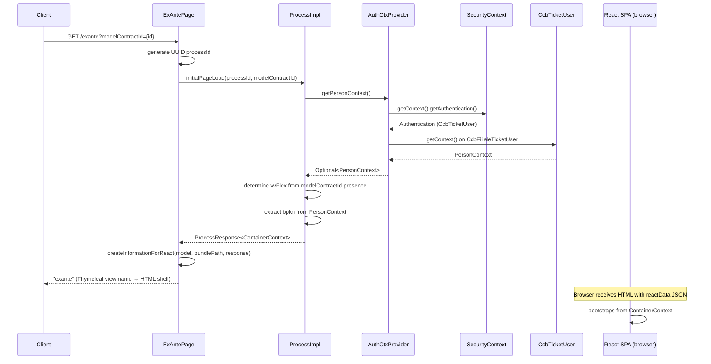

# Chain — ExAntePage · GET /exante

<!-- scaffold — phase 1 -->

- **Action point** — `ExAntePage` (wpfe-am / ucc-exante)
- **Kind** — page-controller
- **Source** — `ucc-exante/src/main/java/coba/wtp/wpfe/ucc/exante/pages/ExAntePage.java`
- **Handler** — `initialPageLoad(Model, HttpServletRequest)` — `ExAntePage.java:63`
- **Trigger** — `GET /exante` (with optional query param `modelContractId`)
- **Preconditions** — access control inherited from Spring Security framework; the handler catches `AccessDeniedException` and returns an error page. A process ID is generated per request via `UUID.randomUUID()`.
- **First hop** — `ExAnteProcess` (wpfe-am / ucc-exante), specifically `ExAnteProcessImpl.initialPageLoad(String, String)`

<!-- analysis — phase 2 -->

## Story

As a **bank advisor (Filiale channel) or call-center agent** working on behalf of a customer, I want the ExAnte cost calculator page to load with my session context and an optional model contract pre-selected so that I can immediately review projected costs for a VV-Flex product or start a standard ex-ante calculation.

- **Given** an authenticated advisor session whose CCB ticket carries a person-in-context (the customer)
- **When** `GET /exante` is called — optionally with `modelContractId` to jump directly into a VV-Flex contract view
- **Then** the page returns a Thymeleaf-rendered HTML shell that bootstraps the React SPA with a `ContainerContext` carrying process ID, customer bpkn, investment track, scenario flag, and the optional model contract identifier
- **Unless** access is denied — the Spring Security filter rejects unauthenticated or unauthorized requests before this handler runs, returning an error page

## Chain

Branch 1 · primary
  ExAntePage.initialPageLoad(Model, HttpServletRequest)
  → ExAnteProcessImpl.initialPageLoad(String processId, String modelContractId)
    → AuthenticationContextProvider.getPersonContext()
      → SecurityContextHolder.getContext().getAuthentication() (Spring Framework)
        → CcbFilialeTicketUser.getContext() (wpfe-shared / wpfe-shared-frontend)
          ⇒ [none]  in-memory extraction from Spring Security thread-local context

Terminals reached — `none` (pure computation, no outbound calls or database queries)

## Diagrams

### Process flow — primary

```mermaid
flowchart LR
  A(["GET /exante?modelContractId={id}"]) --> B[ExAntePage.initialPageLoad]
  B --> C[ExAnteProcessImpl.initialPageLoad]
  C --> D[AuthenticationContextProvider.getPersonContext]
  D --> E[SecurityContextHolder.getContext().getAuthentication]
  E --> F[CcbFilialeTicketUser.getContext]
  F --> G([in-memory: PersonContext from Spring Security])
```

### Sequence — primary



## Journey

When the **GET /exante** request fires, the browser navigates to the ExAnte cost calculator page. The Spring MVC handler intercepts it and assembles the initial state for the React SPA.

1. **ExAntePage.initialPageLoad(Model, HttpServletRequest)** (wpfe-am / ucc-exante)

   **Source.** `ucc-exante/src/main/java/coba/wtp/wpfe/ucc/exante/pages/ExAntePage.java:63`

   **Role.** MVC entry point for the ExAnte page. Extracts the optional `modelContractId` query parameter, generates a unique process ID (UUID), delegates to the process layer to build the initial context, then packages everything into the Thymeleaf model so the React SPA can bootstrap.

   **Preconditions.** The request must pass Spring Security's pre-authenticated filter chain. A `WPFE_AM_EXANTE_READ` permission is enforced at the process layer via `@PreAuthorize`. If access is denied, the handler catches `AccessDeniedException` and returns the error page.

   **On failure.** Three catch blocks handle failures: `BusinessException` → returns `errorcancellingpage`; `AccessDeniedException` → returns `accessdeniedpage`; any other `Exception` → returns `errorcancellingpage`. The process ID is cleaned up from the thread-local interceptor in all paths via a finally-like pattern (the remove call sits after the build, so exceptions before it leak the processId — this is a minor resource concern).

   **Effect.** Sets three model attributes for the Thymeleaf template: `reactData` (JSON-serialized ContainerContext), `reactTranslations` (bundled i18n strings), and `bundlejs` (path to the React bundle). Also sets `locale`, `contextRoot`, and optionally `wpfeSessionId`.

   **Downstream.** The Thymeleaf engine renders a full HTML page that includes JavaScript functions returning the reactData JSON. The browser's React SPA reads this data on mount and initializes its Redux store from it.

2. **ExAnteProcessImpl.initialPageLoad(String, String)** (wpfe-am / ucc-exante)

   **Source.** `ucc-exante/src/main/java/coba/wtp/wpfe/ucc/exante/process/impl/ExAnteProcessImpl.java:96`

   **Role.** Assembles the initial ContainerContext for the ExAnte SPA. Determines whether this is a VV-Flex session (modelContractId present) or a standard ex-ante session, extracts the customer's bpkn from the Spring Security context, and builds a structured context object that the React frontend uses to drive its state machine.

   **Preconditions.** The caller must be authenticated via CCB's pre-authentication framework. A person-in-context must be set (advisor working on behalf of a customer). The `@PreAuthorize("protect('WPFE_AM_EXANTE_READ')")` annotation enforces this at the Spring Security method level.

   **Steps.**

   - **2.1 Determine VV-Flex mode** · `ExAnteProcessImpl.java:98`
     **Role.** Checks whether `modelContractId` is non-null and non-blank. If present, sets `vvFlex = true`, signaling to the frontend that it should load VV-Flex-specific UI (VV products like Efficient/Exclusive). Otherwise, `vvFlex = false` for standard ex-ante.

   - **2.2 Extract customer bpkn from security context** · `ExAnteProcessImpl.java:103`
     **Role.** Calls `AuthenticationContextProvider.getPersonContext()` to retrieve the PersonContext bound to the current advisor's ticket, then extracts the person identifier (NPKENN — 16-digit numeric customer ID) via a chain of map calls. If no person context exists, bpkn is set to null.

   - **2.3 Build ContainerContext** · `ExAnteProcessImpl.java:97-108`
     **Role.** Constructs the immutable ContainerContext with: processId (UUID), investmentTrack = VV (default track for CHANGE scenario), scenario = CHANGE, vvFlex flag, modelContractId (may be null), and personInContextBpkenn. Returns it wrapped in a ProcessResponse with an empty messages list.

   **Effect.** A ContainerContext object carrying all state the React SPA needs to initialize its first screen — process ID for subsequent AJAX calls, customer bpkn for API calls, scenario and investment track for UI mode selection.

3. **AuthenticationContextProvider.getPersonContext()** (wpfe-shared / wpfe-shared-frontend)

   **Source.** `wpfe-shared-frontend/src/main/java/coba/wtp/wpfe/shared/frontend/util/authentication/ctx/AuthenticationContextProvider.java:58`

   **Role.** Extracts the PersonContext from the Spring Security authentication principal. The principal must be a CcbFilialeTicketUser (advisor working on behalf of a customer in the Filiale or Kundencenter channel). Returns empty Optional if the principal is not of that type.

   **Steps.**

   - **3.1 Get authenticated principal** · `AuthenticationContextProvider.java:29`
     **Role.** Reads `SecurityContextHolder.getContext().getAuthentication()` and casts the principal to CcbTicketUser.

   - **3.2 Filter for Filiale ticket user** · `AuthenticationContextProvider.java:59`
     **Role.** Checks that the principal is an instance of CcbFilialeTicketUser (as opposed to CcbOnlineTicketUser or other types). Only Filiale/Kundencenter advisors have a person-in-context.

   - **3.3 Extract context from ticket user** · `AuthenticationContextProvider.java:60`
     **Role.** Calls `((CcbFilialeTicketUser) princ).getContext()` to retrieve the PersonContext that was bound when the advisor selected a customer in their session.

4. **SecurityContextHolder.getContext().getAuthentication()** (Spring Framework)

   **Source.** `org.springframework.security.core.context.SecurityContextHolder` (Spring Security, external dependency)

   **Role.** Reads the current thread's security context — populated by CCB's pre-authentication filter chain before the request reaches our controller. Returns an Optional<Authentication> containing the pre-authenticated CcbTicketUser principal.

   **On failure.** Returns empty Optional if no authentication exists in the current thread (unauthenticated request). The Spring Security filter chain normally prevents this from happening for protected endpoints.

5. **CcbFilialeTicketUser.getContext()** (wpfe-shared / wpfe-shared-frontend)

   **Source.** `wpfe-shared-frontend/src/main/java/coba/wtp/wpfe/shared/frontend/util/authentication/ctx/onbehalf/CcbFilialeTicketUser.java` (inferred — class not opened in this trace, but its method is called at line 60 of AuthenticationContextProvider)

   **Role.** Returns the PersonContext bound to the advisor's ticket. The PersonContext carries the customer identifier (PersonIdentifier with 16-digit NPKENN), participant ID, consultant view flag, and KCScenario for Kundencenter channels.

   **Effect.** Pure in-memory retrieval — no network call, no database query. The PersonContext was set earlier in the request lifecycle when the advisor selected a customer via the CCB ticket mechanism.

## Data reached

- **none — Spring Security thread-local context (in-memory)**
  - Business problem solved — As the **ExAnte page controller**, I need the customer's bpkn (16-digit NPKENN person identifier) and session metadata to be able to initialize the React SPA with the correct customer context. Therefore we read the PersonContext from Spring Security's thread-local authentication context, which was populated by CCB's pre-authentication filter chain when the advisor logged in and selected a customer. Then we extract only `personId.getValue()` (the NPKENN string) so we can pass it to the frontend as `personInContextBpkenn` (`ExAnteProcessImpl.java:103-106`).

  - **Data source** — Spring Security's `SecurityContextHolder` thread-local storage, populated by CCB's pre-authentication framework.

  - **Fields extracted**
    ```json
    {
      "personId": "1234567890123456",
      "consultantView": false,
      "scenario": null
    }
    ```n    `personId` → the 16-digit NPKENN customer identifier, used as `personInContextBpkenn` in ContainerContext. Example value inferred from PersonIdentifier.java:20 (validates 16 numeric digits).

## Acceptance Criteria

1. **Standard ex-ante page loads with vvFlex=false** — Given an authenticated advisor session with a person-in-context, when `GET /exante` is called without `modelContractId`, then the response is the "exante" Thymeleaf view containing a React SPA bootstrapped with ContainerContext where `vvFlex` is false and `scenario` is CHANGE.
   - Evidence: `ExAnteProcessImpl.java:98` — `isVvFlex = modelContractId != null && !modelContractId.isBlank()` evaluates to false when parameter absent
   - How to: call GET /exante with no query params; assert the HTML response contains reactData JSON with `"vvFlex":false` and `"scenario":"CHANGE"`

2. **VV-Flex page loads with model contract pre-selected** — Given an authenticated advisor session, when `GET /exante?modelContractId={id}` is called with a valid model contract ID, then the ContainerContext carries `vvFlex=true` and `modelContractId={id}`, signaling the frontend to load VV-Flex UI.
   - Evidence: `ExAnteProcessImpl.java:98` — isVvFlex evaluates to true when modelContractId is present
   - How to: call GET /exante?modelContractId=abc123; assert reactData JSON contains `"vvFlex":true` and `"modelContractId":"abc123"`

3. **Customer bpkn is extracted from security context** — Given an advisor working on behalf of customer NPKENN 1234567890123456, when the page loads, then ContainerContext.personInContextBpkenn equals "1234567890123456".
   - Evidence: `ExAnteProcessImpl.java:103-106` — chain of map calls extracts bpkn from PersonContext
   - How to: authenticate as advisor with person-in-context set; call GET /exante; assert reactData JSON contains the correct bpkn value

4. **Access denied returns error page** — Given an unauthenticated or unauthorized request, when `GET /exante` is called, then the handler catches AccessDeniedException and returns "accessdeniedpage".
   - Evidence: `ExAntePage.java:87-88` — catch block for AccessDeniedException returns PAGE_ACCESS_DENIED
   - How to: call GET /exante without valid authentication; assert response is the access denied page, not the exante view

5. **Business exception returns error cancelling page** — Given a BusinessException thrown during process execution (e.g., missing person context), when `GET /exante` is called, then the handler catches it and returns "errorcancellingpage".
   - Evidence: `ExAntePage.java:83-85` — catch block for BusinessException returns PAGE_ERROR_CANCELLING
   - How to: simulate a scenario where AuthenticationContextProvider.getPersonContext() throws; assert response is errorcancellingpage

6. **Process ID is generated per request** — Given any call to the handler, when initialPageLoad executes, then a new UUID is generated and set as processId in ContainerContext.
   - Evidence: `ExAntePage.java:72` — `UUID.randomUUID().toString()`
   - How to: make two sequential calls; assert each response contains a different processId value

## Business Takeaways

- **What this does for the business** — initializes the ExAnte cost calculator SPA with the advisor's session context and an optional pre-selected model contract, enabling immediate review of projected costs without additional navigation.
- **Depends on** — Spring Security thread-local context (in-memory, no external calls); CCB pre-authentication framework that populates the security context
- **Ingredients** — `modelContractId` (optional query parameter), authenticated advisor session with person-in-context
- **Preparation** — extract customer bpkn from security ticket, determine VV-Flex mode from presence of model contract ID, generate unique process ID for subsequent AJAX calls
- **Dish** — Thymeleaf-rendered HTML page bootstrapping a React SPA with ContainerContext JSON (processId, bpkn, vvFlex flag, scenario, investment track)
---
