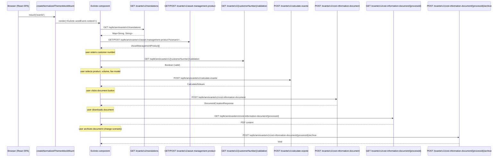

# Chain — ExAnte Themenblock · Mount: exante

<!-- scaffold — phase 1 -->

- **Action point** — `ExAnte` (wpfe-am / ucc-exante)
- **Kind** — themenblock-mount
- **Source** — `ucc-exante/src/main/react/src/themenblock/exante/index.tsx`
- **Handler** — `createThemenblockMount('exante', …)` — `index.tsx:8`
- **Trigger** — Mount: exante (registered name from `ThemenblockNames.EXANTE.tbName`)
- **Preconditions** — none observed at the mount level; React component renders within an ErrorContextProvider and LayerManagerContextProvider from `@clm/ui-shared`
- **First hop** — `ExAnte` React component (`ucc-exante/src/main/react/src/themenblock/exante/ExAnte.tsx`)

<!-- analysis — phase 2 -->

## Story

As a **bank advisor (Filiale channel) or call-center agent** working on behalf of a customer, I want the ExAnte cost calculator to load with product data and translation labels so that I can calculate projected costs for an asset management investment or VV-Flex product and generate a cost information document.

- **Given** an authenticated advisor session whose CCB ticket carries a person-in-context (the customer)
- **When** the ExAnte themenblock is mounted — either from the `GET /exante` page controller for standard opening/modification flows, or directly via the React SPA for VV-Flex contracts
- **Then** the component loads translation labels and asset management product data from the backend, presents a cost calculator form with product selection, investment volume entry, and fee model configuration, and after calculation displays projected costs and allows document generation and archiving
- **Unless** access is denied — the Spring Security filter rejects unauthenticated or unauthorized requests before this mount runs (handled by the page controller)

## Chain

**Views** — Cost Calculator → Document

Branch 1 · primary
  createNormalizedThemenblockMount('exante', …) (ucc-exante / react)
  → ExAnte component render (ucc-exante / react)
    → fetchTranslations() — GET /wpfe/am/exante/v1/translations
      ⇒ [external]  translations endpoint (wpfe-am / ucc-exante, via @wtp/coaxial)

Branch 2 · diverges at ExAnte (initial data load)
  → fetchAllAssetManagementProducts() or fetchSingleAssetManagementProduct() or fetchVvFlexProduct() — GET/POST /wpfe/am/exante/v1/asset-management-product
    ⇒ [external]  asset management product endpoint (wpfe-am / ucc-exante, via @wtp/coaxial)

Branch 3 · diverges at ExAnte (user interaction — validation)
  → validateCustomerNumber() — GET /wpfe/am/exante/v1/{customerNumber}/validation
    ⇒ [external]  customer number validation endpoint (wpfe-am / ucc-exante, via @wtp/coaxial)

Branch 4 · diverges at ExAnte (user interaction — calculation)
  → calculateExAnte() — POST /wpfe/am/exante/v1/calculate-exante
    ⇒ [external]  ex-ante calculation endpoint (wpfe-am / ucc-exante, via @wtp/coaxial)

Branch 5 · diverges at ExAnte (user interaction — document creation)
  → createCostInformationDocument() — POST /wpfe/am/exante/v1/cost-information-document
    ⇒ [external]  cost information document endpoint (wpfe-am / ucc-exante, via @wtp/coaxial)

Branch 6 · diverges at ExAnte (user interaction — document loading)
  → loadDocument() — GET /wpfe/am/exante/v1/cost-information-document/{processId}
    ⇒ [external]  cost information document endpoint (wpfe-am / ucc-exante, via @wtp/coaxial)

Branch 7 · diverges at ExAnte (user interaction — document archiving)
  → archiveDocument() — POST /wpfe/am/exante/v1/cost-information-document/{processId}/archive
    ⇒ [external]  cost information document archive endpoint (wpfe-am / ucc-exante, via @wtp/coaxial)

Terminals reached — external (translations, asset management product, validation, calculation, and document endpoints, all via wpfe-am / ucc-exante REST API)

## Diagrams

### Process flow — primary

```mermaid
flowchart LR
  A(["Mount: exante"]) --> B[createNormalizedThemenblockMount]
  B --> C[ExAnte component render]
  C --> D{"User scenario?"}
  D -- opening/modification, VV-Flex --> E[fetchVvFlexProduct() / fetchSingleAssetManagementProduct()]
  D -- standard --> F[fetchAllAssetManagementProducts()]
  E --> G([asset-management-product endpoint])
  F --> G
  C --> H[fetchTranslations()]
  H --> I([translations endpoint])
  C --> J[validateCustomerNumber()]
  J --> K([validation endpoint])
  C --> L[calculateExAnte()]
  L --> M([calculate-exante endpoint])
  C --> N[createCostInformationDocument()]
  N --> O([cost-information-document endpoint])
  C --> P[loadDocument()]
  P --> Q(["cost-information-document/{processId} endpoint"])
  C --> R[archiveDocument()]
  R --> S(["cost-information-document/{processId}/archive endpoint"])
```

### Sequence — primary



## Journey

When the ExAnte themenblock is mounted in a bank advisor's browser session, the request enters at step 1 to register the mount handler. Once that completes, the flow moves to step 2 because the React component must render before any data can be loaded or user interaction can occur.

1. **createNormalizedThemenblockMount** (ucc-exante / react)

   **Source.** `ucc-exante/src/main/react/src/themenblock/exante/index.tsx:8`

   **Role.** Registers the ExAnte themenblock under the name `EXANTE` (from `ThemenblockNames.EXANTE.tbName`) with the React SPA's themenblock router. Wraps the component in an ErrorContextProvider and LayerManagerContextProvider, so all child components inherit error handling and layer management.

   **Preconditions.** The React SPA must be running; the themenblock router must have been initialized by a prior mount registration.

   **Effect.** Makes `<ExAnte>` available as a navigable view within the SPA. No HTTP calls are made at this stage — only component wiring.

2. **ExAnte component render** (ucc-exante / react)

   **Source.** `ucc-exante/src/main/react/src/themenblock/exante/ExAnte.tsx:63`

   **Role.** Renders the cost calculator UI shell with state initialization from the themenblock context. Determines whether this is an opening, modification, or standard flow based on `context.scenario` and `context.isVvFlex`. Initializes the cost calculator state machine (product selection, investment volume, fee model configuration) and prepares calculated values for display.

   **Preconditions.** The `tbContext` must carry at minimum a `scenario` flag (`OPENING`, `MODIFICATION`, or `CHANGE`) and a `processId`. For VV-Flex flows, it also carries `modelContractId` and `isVvFlex: true`.

   **Effect.** Renders either a `<Spinner>` (while translations are loading) or the full cost calculator form (`<CostCalculator>`) or document view (`<Document>`), depending on state.

3. **fetchTranslations** (ucc-exante / react)

   **Source.** `ucc-exante/src/main/react/src/themenblock/exante/ExAnte.tsx:140`

   **Role.** Loads all translation labels from the backend at mount time, so the UI can render with localized text. Calls `GET /wpfe/am/exante/v1/translations` and stores the result in component state (`setTranslations`).

   **Preconditions.** The `context.processId` must be available for the request header.

   **On failure.** If the GET returns an error response, `eventUtil.sendTbDataLoadErrorEvent()` is called with `'Error when loading translation.'`. The translations state remains null and the component continues to show a spinner.

   **Effect.** Sets `translations` state to `{key: value}` pairs used throughout the UI (e.g., `am.exante.costcalculator.title`, `am.exante.document.download.label`).

   **Downstream.** All label lookups in `<CostCalculator>` and `<Document>` components depend on this data. Without translations, the component renders as a blank spinner.

4. **fetchAllAssetManagementProducts** (ucc-exante / react)

   **Source.** `ucc-exante/src/main/react/src/themenblock/exante/ExAnte.tsx:163`

   **Role.** Loads all available asset management products for the current scenario by calling `GET /wpfe/am/exante/v1/asset-management-product?scenario={scenario}`. The response is dispatched into state via `CHANGE_ASSET_MANAGEMENT_PRODUCTS`, enabling product selection in the cost calculator.

   **Preconditions.** This path is taken when `!shouldContextBeUsed` — i.e., for standard (non-opening, non-modification) flows where no pre-selected product exists.

   **On failure.** If the GET returns an error response, `eventUtil.sendTbDataLoadErrorEvent()` is called with `'Received error when fetching asset management products'`. The `assetManagementProductsLoaded` flag remains false and the calculator stays disabled.

   **Effect.** Sets `assetManagementProducts` to the full product list and `assetManagementProductsLoaded` to true. This enables downstream state effects that populate mandate options, strategy options, and fee model options.

5. **fetchSingleAssetManagementProduct** (ucc-exante / react)

   **Source.** `ucc-exante/src/main/react/src/themenblock/exante/ExAnte.tsx:187`

   **Role.** Loads a single asset management product for opening or modification flows where the user has already selected a strategy. Calls `POST /wpfe/am/exante/v1/asset-management-product` with the pre-selected `productLineStrategyId` and scenario from context.

   **Preconditions.** Taken when `shouldContextBeUsed && !isVvFlex`. The context must carry `productLineStrategyId`, `scenario`, and `investmentVolume`.

   **On failure.** Same error handling as step 4 — error event sent, state remains unpopulated.

   **Effect.** Sets the single product into state along with pre-filled mandate name, strategy ID, and investment volume. The user sees a partially-prepared form ready for fee model selection.

6. **fetchVvFlexProduct** (ucc-exante / react)

   **Source.** `ucc-exante/src/main/react/src/themenblock/exante/ExAnte.tsx:217`

   **Role.** Loads read-only VV-Flex product information from the backend by calling `GET /wpfe/am/exante/v1/vvflex-product/{modelContractId}`. Constructs a pseudo-asset-management-product object from the VV-Flex data (model contract ID, mandate name, offensive share percentage) so it can be displayed in the same UI as standard products.

   **Preconditions.** Taken when `shouldContextBeUsed && isVvFlex`. The context must carry `modelContractId` and `isVvFlex: true`.

   **On failure.** Error event sent with `'Received error when fetching VV-Flex product'`. The pseudo-product is not created and the calculator stays disabled.

   **Effect.** Sets `vvFlexProduct` state and dispatches a pseudo-product into the cost calculator state. Fee model options are populated directly from `vvFlexProduct.availableFeeModels` rather than from profile costs.

7. **validateCustomerNumber** (ucc-exante / react)

   **Source.** `ucc-exante/src/main/react/src/themenblock/exante/ExAnte.tsx:398`

   **Role.** Validates the customer number entered by the user in two stages: first a format check (exactly 10 digits), then an existence check against the backend. For opening and modification scenarios, this is required because the advisor must confirm the customer exists before proceeding.

   **Preconditions.** Only called when `context.scenario === ScenarioEnum.CHANGE` — i.e., in the document view where the user enters a customer number for archiving.

   **On failure.** Format errors set an inline translation-based error message (`am.exante.costcalculator.customer.number.format.error`). Backend validation failures set `am.exante.costcalculator.customer.number.long.term.error`. Network errors are caught and treated as invalid.

   **Effect.** Sets or clears `customerNumberInputError` in state. Only when the error is null does the downstream calculation button become enabled.

8. **validateInvestmentVolume** (ucc-exante / react)

   **Source.** `ucc-exante/src/main/react/src/themenblock/exante/ExAnte.tsx:425`

   **Role.** Validates the investment volume entered by the user: first checks it is a whole number, then for standard flows verifies it meets the highest minimum investment threshold among all available products. For opening/modification flows (where context provides pre-filled data), no minimum check runs — the backend has already validated this.

   **Preconditions.** Called whenever `investmentVolume` changes or when the selected mandate changes (because the minimum threshold may differ per product).

   **On failure.** Non-integer values set `am.exante.costcalculator.costcalculation.investmentvolume.error.integer`. Values below the minimum set a message with the specific threshold amount. Valid values clear the error.

   **Effect.** Sets or clears `investmentVolumeInputError` in state, which gates downstream fee model options and calculation button enablement.

9. **validateManualFeeRate** (ucc-exante / react)

   **Source.** `ucc-exante/src/main/react/src/themenblock/exante/ExAnte.tsx:451`

   **Role.** Validates the manually-entered fee rate when the user selects manual mode over standard. Checks that the value is a non-negative rational number not exceeding 100%, and for standard products additionally verifies it does not exceed the asset management fee rate derived from the selected product's profile costs.

   **Preconditions.** Only runs when `manualFeeRateRadioButtonDisabled` is false — i.e., all dependent fields (product, strategy, investment volume, fee model) are already set. For VV-Flex flows, only range validation applies because the standard fee rate is not known client-side.

   **On failure.** Out-of-range values set `am.exante.costcalculator.costcalculation.feerate.manual.error.notinrange`. Values with sign characters set `am.exante.costcalculator.costcalculation.feerate.manual.error.integer`. Values exceeding the asset management fee rate set `am.exante.costcalculator.costcalculation.feerate.manual.error.toohigh`.

   **Effect.** Sets or clears `manualFeeRateInputError` in state, which gates calculation button enablement.

10. **calculateExAnte** (ucc-exante / react)

    **Source.** `ucc-exante/src/main/react/src/themenblock/exante/ExAnte.tsx:527`

    **Role.** Sends the user's complete cost calculator configuration to the backend for projection. Constructs a request with product strategy ID, fee model enum, manual fee rate (if applicable), investment volume, and metadata. For VV-Flex flows, sends `modelContractId` instead of `productLineStrategyId`. The response contains projected fees across all cost categories (asset management, custody, securities commissions, profit share, grants, etc.).

    **Preconditions.** All input fields must be valid: product selected, strategy selected, investment volume entered and validated, fee model selected. For manual mode, the manual fee rate must also be valid.

    **On failure.** Error event sent with `'Received error when calculating ex-ante'`. The calculated values remain at their default (zero) state and the cost table is not shown.

    **Effect.** Sets `calculatedValues` to the backend's projection and sets `showTable` to true, revealing the cost breakdown table below the calculator form. Also triggers a reset of the table when any input field changes.

11. **createCostInformationDocument** (ucc-exante / react)

    **Source.** `ucc-exante/src/main/react/src/themenblock/exante/components/Document.tsx:68`

    **Role.** Requests backend generation of a cost information PDF document by calling `POST /wpfe/am/exante/v1/cost-information-document` with the document creation request (language, investment volume, product strategy ID or model contract ID, fee model, process ID). For VV-Flex flows, the backend routes to `createCostInformationDocumentForVvFlex()`.

    **Preconditions.** The user has clicked the document button in the cost calculator view. A valid `documentCreationRequest` must be present with all required fields.

    **On failure.** Sets `documentCreated` to false and stores the error in `documentCreationError`. Subsequent download or archive actions will show an error banner instead of proceeding.

    **Effect.** Sets `documentFetched` to true and `documentCreated` based on backend response. Enables the document download button and checkbox controls.

12. **loadDocument** (ucc-exante / react)

    **Source.** `ucc-exante/src/main/react/src/themenblock/exante/components/Document.tsx:85`

    **Role.** Downloads the generated cost information PDF by calling `GET /wpfe/am/exante/v1/cost-information-document/{processId}?documentLanguage={language}`. If document creation succeeded, extracts the base64-encoded PDF content and triggers a browser download via `downloadPdfFile()`. If creation failed, sends an error event.

    **Preconditions.** `documentCreated` must be true (the backend has already generated the PDF). The process ID and document language must be available from the document creation request.

    **On failure.** Error event sent with `'Error when loading ex-ante document.'`. If the response indicates a rendering error, the same error is surfaced to the user.

    **Effect.** Triggers a browser file download of the PDF. The file name comes from `responseData.result.data.documentName` and the content from `responseData.result.data.documentContent` (base64-encoded).

13. **archiveDocument** (ucc-exante / react)

    **Source.** `ucc-exante/src/main/react/src/themenblock/exante/components/Document.tsx:115`

    **Role.** Archives the cost information PDF document by calling `POST /wpfe/am/exante/v1/cost-information-document/{processId}/archive` with customer number, owner group ID, document language, and scenario. This is a fire-and-forget call — errors are caught but not re-raised because backend-side retry logic handles transient failures.

    **Preconditions.** Only called in the CHANGE (modification) scenario when the user checks the archive checkbox before clicking continue. The customer number must be non-empty for archiving to proceed.

    **On failure.** Error event sent with `'Error when archiving ex-ante document.'`. The navigation to the next screen still proceeds regardless of archive success or failure.

    **Effect.** Sends an archival request to the backend. After successful archive, navigates away from the themenblock — either to `/onefk` for FK channel users or `/digitalbanking/financeoverview` for standard users.

Also reached by: [exante-controller-get-asset-management-product](../chain-traces/exante-controller-get-asset-management-product.md) (GET /asset-management-product)
Also reached by: [exante-controller-post-asset-management-product](../chain-traces/exante-controller-post-asset-management-product.md) (POST /asset-management-product)
Also reached by: [exante-controller-get-vvflex-product](../chain-traces/exante-controller-get-vvflex-product.md) (GET /vvflex-product/{modelContractId})
Also reached by: [exante-controller-get-validation](../chain-traces/exante-controller-get-validation.md) (GET /{customerNumber}/validation)
Also reached by: [exante-controller-post-calculate-exante](../chain-traces/exante-controller-post-calculate-exante.md) (POST /calculate-exante)
Also reached by: [exante-controller-post-cost-information-document](../chain-traces/exante-controller-post-cost-information-document.md) (POST /cost-information-document)
Also reached by: [exante-controller-get-cost-information-document](../chain-traces/exante-controller-get-cost-information-document.md) (GET /cost-information-document/{processId})
Also reached by: [exante-controller-post-cost-information-document-archive](../chain-traces/exante-controller-post-cost-information-document-archive.md) (POST /cost-information-document/{processId}/archive)

## Data reached

- **external — translations endpoint, via `GET /wpfe/am/exante/v1/translations` (wpfe-am / ucc-exante)**
  - Business problem solved — As the **ExAnte cost calculator**, I need localized UI labels so that the advisor sees the interface in their preferred language. Therefore we call this API at `GET /exante/v1/translations` to retrieve a map of translation keys to values. Then we store them in component state and use every key throughout `<CostCalculator>` and `<Document>`, so the entire form renders with proper labels — citing `ExAnte.tsx:140` for the fetch, `CostCalculator.tsx` for label lookups like `am.exante.costcalculator.title`, and `Document.tsx` for document view labels.

  - **Request path**
    ```json
    {}
    ```
    No parameters — this is a parameterless GET that returns all translation keys for the module.

  - **Request body** — none (GET request).

  - **Response fields used**
    ```json
    {
      "am.exante.costcalculator.title": "Kostenrechner",
      "am.exante.document.download.label": "Dokument herunterladen"
    }
    ```
    All keys starting with `am.exante.` → the UI label system. Example values inferred from German-language deployment at `ExAnte.tsx:140` and component files.

  - **Response fields discarded** — none observed; the entire response is consumed as UI labels.

- **external — asset management product endpoint, via `GET /wpfe/am/exante/v1/asset-management-product?scenario={scenario}` (wpfe-am / ucc-exante)**
  - Business problem solved — As the **ExAnte cost calculator**, I need the list of available asset management products so that the advisor can select a product line and strategy for cost projection. Therefore we call this API at `GET /exante/v1/asset-management-product?scenario=OPENING` (or `MODIFICATION`) to retrieve all eligible products. Then we populate mandate name options, strategy name options, and fee model options from the product data — citing `ExAnte.tsx:163` for the fetch and `CostCalculatorStateReducer.ts` for state dispatch.

  - **Request path**
    ```json
    {
      "scenario": "OPENING"
    }
    ```
    `scenario` — query parameter, origin: `context.scenario` from the themenblock context set by the page controller (`GET /exante`). Values: `OPENING`, `MODIFICATION`, or `CHANGE`.

  - **Request body** — none (GET request).

  - **Response fields used**
    ```json
    {
      "productLineMandate": "EMAS",
      "productLineMandateName": "EMAS Aktienfonds",
      "productLineStrategyId": "STRAT-001",
      "productLineStrategyName": "Global Growth",
      "minimumInvestments": { "display": 500 },
      "profileCosts": [
        {
          "investmentVolumeThresholdFrom": 0,
          "investmentVolumeThresholdTo": 100000,
          "feeModels": [
            {
              "feeModelName": "STANDARD",
              "costComponentsPerUnits": [
                { "costComponentEnum": "ASSET_MANAGEMENT_FEE_RATE", "value": 0.015 }
              ]
            }
          ]
        }
      ]
    }
    ```
    `productLineMandate` → mandate name options (`ExAnte.tsx:243`). `productLineStrategyId` / `productLineStrategyName` → strategy options. `minimumInvestments.display` → investment volume minimum validation (`ExAnte.tsx:437`). `profileCosts[].feeModels[].feeModelName` → fee model dropdown labels. `profileCosts[].feeModels[].costComponentsPerUnits[ASSET_MANAGEMENT_FEE_RATE].value` → standard fee rate for manual fee rate validation (`ExAnte.tsx:480`). Example values inferred from DTO definitions at `AssetManagementProductResponse.java`.

  - **Response fields discarded** — any additional product attributes not used in the cost calculator UI (e.g., risk class, target market flags, ISIN codes) are present in the response but never consumed client-side.

- **external — asset management product endpoint (POST), via `POST /wpfe/am/exante/v1/asset-management-product` (wpfe-am / ucc-exante)**
  - Business problem solved — As the **ExAnte cost calculator**, I need a single pre-selected product for opening or modification flows where the user has already chosen a strategy. Therefore we call this API at `POST /exante/v1/asset-management-product` with `{productLineStrategyId, scenario}` to retrieve only that specific product's full data including profile costs and fee models.

  - **Request path** — none (POST request).

  - **Request body**
    ```json
    {
      "data": {
        "productLineStrategyId": "STRAT-001",
        "scenario": "OPENING"
      },
      "metaData": {
        "globalRequestId": "550e8400-e29b-41d4-a716-446655440000"
      }
    }
    ```
    `productLineStrategyId` ← context from page controller. `scenario` ← context. `globalRequestId` ← UUID generated by the page controller.

  - **Response fields used** — same structure as the GET response above, but containing a single product instead of a list.

- **external — VV-Flex product endpoint, via `GET /wpfe/am/exante/v1/vvflex-product/{modelContractId}` (wpfe-am / ucc-exante)**
  - Business problem solved — As the **ExAnte cost calculator**, I need read-only information about a VV-Flex model contract so that the advisor can display its fee structure in the same UI as standard products. Therefore we call this API at `GET /exante/v1/vvflex-product/{modelContractId}` to retrieve the model contract's offensive share percentage, available fee models, and asset management fee rate.

  - **Request path**
    ```json
    {
      "modelContractId": "MC-2024-001"
    }
    ```
    `modelContractId` — path parameter, origin: `context.modelContractId` from the themenblock context.

  - **Request body** — none (GET request).

  - **Response fields used**
    ```json
    {
      "modelContractId": "MC-2024-001",
      "productLineMandateName": "VV-Flex Efficient",
      "shareOffensiveModules": 65,
      "availableFeeModels": ["STANDARD", "PREFERRED"],
      "assetManagementFeeRate": 0.012
    }
    ```
    `modelContractId` → used as both mandate and strategy ID in the pseudo-product (`ExAnte.tsx:235`). `productLineMandateName` → displayed label. `shareOffensiveModules` → shown as percentage in strategy name field. `availableFeeModels` → fee model dropdown options. `assetManagementFeeRate` → standard fee rate for manual mode validation (VV-Flex only). Example values inferred from DTO definitions at `VvFlexProductResponse.java`.

  - **Response fields discarded** — any additional contract metadata not displayed in the cost calculator UI.

- **external — customer number validation endpoint, via `GET /wpfe/am/exante/v1/{customerNumber}/validation` (wpfe-am / ucc-exante)**
  - Business problem solved — As the **ExAnte cost calculator**, I need to confirm that a customer number entered by the advisor corresponds to an existing long-term customer so that archiving and document generation are tied to the correct person. Therefore we call this API at `GET /exante/v1/{customerNumber}/validation` to retrieve a boolean indicating whether the customer number maps to a valid long-term-customer-number.

  - **Request path**
    ```json
    {
      "customerNumber": "1234567890"
    }
    ```
    `customerNumber` — path parameter, origin: user input in the document view. Must be exactly 10 digits (validated client-side before this call).

  - **Request body** — none (GET request).

  - **Response fields used**
    ```json
    {
      "result": {
        "data": true
      }
    }
    ```
    `result.data` → boolean validity flag. `true` means the customer number maps to an existing long-term-customer-number; `false` means it does not. Example value inferred from backend validation logic at `ExAnteProcessImpl.java:validateCustomerNumber()`.

  - **Response fields discarded** — none observed; only the boolean validity flag is consumed.

- **external — ex-ante calculation endpoint, via `POST /wpfe/am/exante/v1/calculate-exante` (wpfe-am / ucc-exante)**
  - Business problem solved — As the **ExAnte cost calculator**, I need projected fee amounts across all cost categories so that the advisor can show the customer a detailed cost breakdown for their investment. Therefore we call this API at `POST /exante/v1/calculate-exante` with the complete configuration (product strategy, fee model, manual fee rate override, investment volume) to retrieve calculated values including asset management fees, custody fees, securities commissions, profit share, grants, and total costs.

  - **Request path** — none (POST request).

  - **Request body**
    ```json
    {
      "data": {
        "productLineStrategyId": "STRAT-001",
        "feeModel": "STANDARD",
        "manualFeeRate": null,
        "investmentVolume": 50000,
        "modelContractId": null,
        "productLinesFilter": null
      },
      "metaData": {
        "globalRequestId": "550e8400-e29b-41d4-a716-446655440000"
      }
    }
    ```
    `productLineStrategyId` ← user selection. `feeModel` ← selected fee model enum. `manualFeeRate` ← user-entered override or null (standard rate used). `investmentVolume` ← entered amount in euros. `modelContractId` ← null for standard flows, set for VV-Flex. `globalRequestId` ← UUID from page controller.

  - **Response fields used**
    ```json
    {
      "result": {
        "data": {
          "assetManagementFees": 750,
          "assetManagementFeesPercentage": 1.5,
          "profitShare": 200,
          "profitSharePercentage": 0.4,
          "custodyFees": 100,
          "custodyFeesPercentage": 0.2,
          "securitiesCommissions": 50,
          "securitiesCommissionsPercentage": 0.1,
          "otherFees": 30,
          "otherFeesPercentage": 0.06,
          "externalServices": 0,
          "externalServicesPercentage": 0,
          "productCostsIncludingGrants": 850,
          "productCostsIncludingGrantsPercentage": 1.7,
          "payedOutGrants": -100,
          "payedOutGrantsPercentage": -0.2,
          "serviceCosts": 20,
          "serviceCostsPercentage": 0.04,
          "productCosts": 870,
          "productCostsPercentage": 1.74,
          "totalCostsExcludingTax": 890,
          "totalCostsExcludingTaxPercentage": 1.78,
          "totalCostsIncludingTax": 1059.1,
          "totalCostsIncludingTaxPercentage": 2.12
        }
      }
    }
    ```
    All fields → displayed in the cost table (`CalculatedValues.tsx`). Example values inferred from `CalculatedValues.java` DTO at a €50,000 investment volume with a 1.5% asset management fee rate.

  - **Response fields discarded** — none observed; all calculated value fields are consumed by the cost table component.

- **external — cost information document endpoint (creation), via `POST /wpfe/am/exante/v1/cost-information-document` (wpfe-am / ucc-exante)**
  - Business problem solved — As the **ExAnte cost calculator**, I need a generated PDF document summarizing the projected costs so that the advisor can present it to the customer as part of the advisory process. Therefore we call this API at `POST /exante/v1/cost-information-document` with the document creation request (language, investment volume, product strategy or model contract ID, fee model) to trigger PDF generation.

  - **Request path** — none (POST request).

  - **Request body**
    ```json
    {
      "data": {
        "documentLanguage": "DE",
        "investmentVolume": 50000,
        "productLineStrategyId": "STRAT-001",
        "modelContractId": null,
        "feeModel": "STANDARD",
        "processId": "550e8400-e29b-41d4-a716-446655440000",
        "manualFeeRate": null
      },
      "metaData": {
        "globalRequestId": "550e8400-e29b-41d4-a716-446655440000"
      }
    }
    ```
    `documentLanguage` ← user selection (DE or EN). `investmentVolume` ← entered amount. `productLineStrategyId` / `modelContractId` ← product identifier. `feeModel` ← selected fee model enum. `processId` ← UUID from page controller. `manualFeeRate` ← override or null.

  - **Response fields used**
    ```json
    {
      "result": {
        "data": {
          "documentCreated": true
        }
      }
    }
    ```
    `result.data.documentCreated` → boolean indicating whether the PDF was successfully generated. Example value inferred from `DocumentCreationResponse.java`.

  - **Response fields discarded** — any additional metadata in the response (e.g., document ID, generation timestamp) is not consumed client-side.

- **external — cost information document endpoint (loading), via `GET /wpfe/am/exante/v1/cost-information-document/{processId}?documentLanguage={language}` (wpfe-am / ucc-exante)**
  - Business problem solved — As the **ExAnte cost calculator**, I need to retrieve the generated PDF document so that it can be downloaded and presented to the customer. Therefore we call this API at `GET /exante/v1/cost-information-document/{processId}?documentLanguage=DE` to retrieve the base64-encoded PDF content.

  - **Request path**
    ```json
    {
      "processId": "550e8400-e29b-41d4-a716-446655440000",
      "documentLanguage": "DE"
    }
    ```
    `processId` — path parameter, origin: UUID from page controller. `documentLanguage` — query parameter, origin: user selection (DE or EN).

  - **Request body** — none (GET request).

  - **Response fields used**
    ```json
    {
      "result": {
        "data": {
          "documentContent": "JVBERi0xLjQKJeLjz9...base64-encoded-PDF-data...",
          "documentName": "Kosteninformation_DE.pdf",
          "renderingError": false
        }
      }
    }
    ```
    `result.data.documentContent` → base64-encoded PDF content, downloaded via `downloadPdfFile()` (`ExAnte.tsx:FileUtils`). `result.data.documentName` → file name for the download. `result.data.renderingError` → boolean; if true, an error event is sent instead of downloading.

  - **Response fields discarded** — any additional metadata in the response not consumed by the download flow.

- **external — cost information document archive endpoint, via `POST /wpfe/am/exante/v1/cost-information-document/{processId}/archive` (wpfe-am / ucc-exante)**
  - Business problem solved — As the **ExAnte cost calculator**, I need to archive the generated cost information PDF so that it is stored in the regulatory document repository for compliance purposes. Therefore we call this API at `POST /exante/v1/cost-information-document/{processId}/archive` with customer identification and scenario data to trigger archival.

  - **Request path**
    ```json
    {
      "processId": "550e8400-e29b-41d4-a716-446655440000"
    }
    ```
    `processId` — path parameter, origin: UUID from page controller.

  - **Request body**
    ```json
    {
      "data": {
        "customerNumber": "1234567890",
        "customerOwnerGroupId": "OG-001",
        "documentLanguage": "DE",
        "scenario": "CHANGE"
      },
      "metaData": {
        "globalRequestId": "550e8400-e29b-41d4-a716-446655440000"
      }
    }
    ```
    `customerNumber` ← user input. `customerOwnerGroupId` ← context from page controller. `documentLanguage` ← document language selection. `scenario` ← scenario enum (only `CHANGE` triggers archiving). `globalRequestId` ← UUID.

  - **Response fields used** — none observed; this is a fire-and-forget call with no response data consumed client-side.

  - **Response fields discarded** — the entire response body is ignored by the frontend.

## Acceptance Criteria

1. **Mount loads translations and displays the cost calculator form** — Given a mounted ExAnte themenblock, when the component renders, then `GET /exante/v1/translations` is called once on mount and the returned labels populate the UI so that all headings, buttons, and field labels display correctly.
   - Evidence: `ExAnte.tsx:140` — `useEffect(() => { const fetchTranslations = () => { ... } }, [])`
   - How to: open the ExAnte component at `ExAnte.tsx:140`, confirm the empty dependency array `[]` means the effect runs once on mount; follow the `.then()` chain to `setTranslations(responseData.result.data)` and confirm every label lookup in `<CostCalculator>` reads from this state.

2. **Standard flow loads all asset management products** — Given a standard (non-opening, non-modification) scenario, when the ExAnte component mounts, then `GET /exante/v1/asset-management-product?scenario=STANDARD` is called and the full product list populates the mandate name dropdown.
   - Evidence: `ExAnte.tsx:163-178` — conditional branch `if (!shouldContextBeUsed) { fetchAllAssetManagementProducts(); }`
   - How to: open `ExAnte.tsx:159`, confirm `shouldContextBeUsed = isOpeningProcess || isModificationProcess`; trace the else branch to `fetchAllAssetManagementProducts()` at line 163; follow the dispatch chain through `CHANGE_ASSET_MANAGEMENT_PRODUCTS` and `CHANGE_PRODUCT_LINE_MANDATE_NAME_OPTIONS` to confirm products populate the mandate dropdown.

3. **Opening/modification flow loads a single pre-selected product** — Given an opening or modification scenario with a pre-selected strategy ID, when the ExAnte component mounts, then `POST /exante/v1/asset-management-product` is called with that strategy ID and the response populates a partially-prepared form.
   - Evidence: `ExAnte.tsx:187-214` — conditional branch `if (isVvFlex) { fetchVvFlexProduct(); } else { fetchSingleAssetManagementProduct(); }`
   - How to: open `ExAnte.tsx:209`, confirm the condition `shouldContextBeUsed && !isVvFlex`; trace `fetchSingleAssetManagementProduct()` at line 187; follow the POST body construction and dispatch chain to confirm pre-filled mandate, strategy, and investment volume.

4. **VV-Flex flow loads a pseudo-product from model contract data** — Given a VV-Flex scenario with a model contract ID, when the ExAnte component mounts, then `GET /exante/v1/vvflex-product/{modelContractId}` is called and the response is transformed into a pseudo-asset-management-product for display.
   - Evidence: `ExAnte.tsx:217-240` — conditional branch `if (isVvFlex) { fetchVvFlexProduct(); }`; pseudo-product construction at lines 230–238
   - How to: open `ExAnte.tsx:230`, confirm the pseudo-product mapping (`modelContractId → productLineMandate`, `shareOffensiveModules → strategy name as percentage`); follow the dispatch chain and confirm fee model options come from `vvFlexProduct.availableFeeModels` rather than profile costs.

5. **Customer number validation rejects invalid formats client-side** — Given a customer number that does not match exactly 10 digits, when the user types in the document view, then the format error is shown immediately without any backend call.
   - Evidence: `ExAnte.tsx:402-406` — regex check `/^\d{10}$/`
   - How to: open `ExAnte.tsx:402`, confirm the early return on format failure prevents the subsequent GET call; verify the error message key is `am.exante.costcalculator.customer.number.format.error`.

6. **Customer number validation calls backend for existence check** — Given a customer number that passes the 10-digit format check, when the user submits it in the document view, then `GET /exante/v1/{customerNumber}/validation` is called and the boolean result determines whether the error is cleared.
   - Evidence: `ExAnte.tsx:408-423` — async GET call to validation endpoint
   - How to: open `ExAnte.tsx:408`, confirm the conditional `if (customerNumber !== '')` guards the backend call; trace the response handling at line 417 where `isValidLongTermCustomerNumber ? null : errorKey` determines the dispatched state.

7. **Investment volume below minimum shows threshold-specific error** — Given a standard flow with products having varying minimum investments, when the user enters an amount below the highest displayed minimum, then the error message includes that specific threshold value.
   - Evidence: `ExAnte.tsx:435-448` — comparison against `highestMinimumInvestmentVolume` and formatted error message
   - How to: open `ExAnte.tsx:437`, confirm `determineUniqueSelectedAssetManagementProduct()` selects the product with the highest minimum; trace the error message construction at line 445 which concatenates the threshold value via `formatDecimalNumber(highestMinimumInvestmentVolume)`.

8. **Manual fee rate exceeding asset management fee rate is rejected** — Given a standard flow where the user enters a manual fee rate higher than the product's asset management fee rate, when validation runs, then an error message indicating the rate is too high is shown.
   - Evidence: `ExAnte.tsx:480-493` — comparison of `manualFeeRateInt > assetManagementFeeRateInPercent`
   - How to: open `ExAnte.tsx:475`, confirm `findAssetManagementFeeRate()` retrieves the fee from profile costs; trace the comparison at line 486 and verify the error key is `am.exante.costcalculator.costcalculation.feerate.manual.error.toohigh`.

9. **Calculation displays projected cost breakdown** — Given a valid configuration (product, strategy, investment volume, fee model selected), when the user clicks calculate, then `POST /exante/v1/calculate-exante` is called and the response populates the cost table with all fee categories.
   - Evidence: `ExAnte.tsx:527-560` — POST call to calculation endpoint; response handling at lines 548–553
   - How to: open `ExAnte.tsx:527`, confirm the request body construction includes all user inputs; trace the `.then()` chain at line 549 where `setCalculatedValues(responseData.result.data)` and `setShowTable(true)` reveal the cost table.

10. **Document creation triggers PDF generation** — Given a calculated result, when the user clicks the document button, then `POST /exante/v1/cost-information-document` is called with the document creation request and the response enables the download controls.
    - Evidence: `Document.tsx:68-82` — POST call in useEffect triggered by `documentCreationRequest`
    - How to: open `Document.tsx:68`, confirm the useEffect dependency `[documentCreationRequest]` means the call fires when the request object changes; trace the response handling at line 75 where `setDocumentCreated(responseData.result.data.documentCreated)` gates download availability.

11. **Document creation failure shows error banner** — Given a document creation request that fails (either HTTP error or backend returns `documentCreated: false`), when the Document component renders, then an error event is sent and the download button remains disabled.
    - Evidence: `Document.tsx:76-80` (creation error) and `Document.tsx:91-95` (rendering error on load)
    - How to: open `Document.tsx:76`, confirm the catch handler sets `documentCreated = false`; trace `loadDocument()` at line 85 where the `!documentCreated` guard sends an error event instead of downloading.

12. **Archive is fire-and-forget — navigation proceeds regardless** — Given a change scenario with archive checkbox checked, when the user clicks continue, then `POST /exante/v1/cost-information-document/{processId}/archive` is called and navigation to the next screen happens immediately after, without waiting for or checking the archive response.
    - Evidence: `Document.tsx:115-140` — try/catch around POST; navigation at lines 163–170
    - How to: open `Document.tsx:128`, confirm the try block sends the POST and then falls through to the navigation logic at line 163 without awaiting any response; verify the catch handler only sends an error event but does not prevent navigation.

## Business Takeaways

- **What this does for the business** — presents a cost calculator that lets advisors project investment fees across all cost categories (asset management, custody, securities commissions, profit share, grants) for asset management products and VV-Flex model contracts, generates a regulatory cost information PDF document, and archives it for compliance.
- **Depends on** — the ExAnte REST API endpoints in wpfe-am / ucc-exante (translations, product data, validation, calculation, document generation/loading/archiving), all called via @wtp/coaxial from the React SPA
- **Ingredients** — scenario flag (`OPENING`, `MODIFICATION`, `CHANGE`), process ID (UUID from page controller), customer number (user input in change flows), model contract ID (VV-Flex only), product strategy selection, investment volume, fee model selection, manual fee rate override (optional)
- **Preparation** — load translation labels and asset management products on mount; for opening/modification flows pre-fill the form with context data; for VV-Flex flows load pseudo-product from model contract
- **Dish** — projected cost breakdown table (all fee categories), generated PDF document, archived regulatory record

