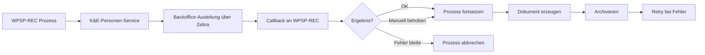
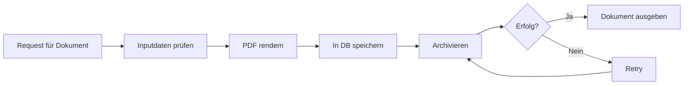

### 1. GEE-Dokumente, PIP-Dokument und Datenausleitung

**1. Business Context & Value**

* **Objective:** Die im nächsten Sprint vorgesehenen Dokumente und Ausleitungen sollen finalisiert werden, darunter das PIP-Dokument und die GEE-Datenausleitung.
* **Business Value:** Das schließt die noch offenen Basislieferobjekte für AVD ab und bringt die Dokumentations- und Ausleitungsthemen auf einen umsetzbaren Stand.
* **Key Decisions:** Die GEE-Datenausleitung ist fachlich bereits weitgehend bekannt und soll ähnlich zur AE laufen. Der wesentliche Unterschied liegt im ABTXN-Block mit drei getrennt zu übertragenden Texten. Das Mapping wird zunächst als eher simpel eingeschätzt, kann aber bei Verkauf oder Änderungen komplexer werden. 

**2. Technical Details**

* **Implementation Strategy:** Umsetzung der Datenausleitung mit bestehender Struktur, ergänzt um die fehlenden eSINs der Shares und den ABTXN-Block mit drei Texten.
* **Components/Systems Impacted:** Dokumentenerzeugung, Ausleitung/Mapping, vermutlich Archivierungs- und Dokumentenlogik.
* **Technical Constraints/Risks:** Der ABTXN-Block ist der kritische Punkt. Zusätzliche Variablen bei späteren Vorgängen wie Verkauf oder Änderungen können das Mapping erweitern. 

**3. Step-by-Step Processing Logic**

1. PIP-Dokument finalisieren.
2. GEE-Datenausleitung implementieren.
3. eSINs der Shares ergänzen.
4. ABTXN in drei Textblöcke aufsplitten.
5. Mapping gegen die vorhandenen fachlichen Texte validieren.
6. Bei späteren Prozessvarianten weitere Variablen ergänzen.

**4. Visual Diagram (Mermaid)**

**5. Action Items & Next Steps**

* PIP-Dokument finalisieren.
* eSINs der Shares ergänzen.
* ABTXN-Mapping mit drei Textblöcken konkretisieren.
* Bei Bedarf nochmal schätzen, wenn das Mapping detaillierter ist. 

---

### 2. Share-Label, WKN-Mapping und Ablage in WBFW Commons

**1. Business Context & Value**

* **Objective:** Die Namen und Labels der Shares sollen stabil im System verfügbar sein.
* **Business Value:** Die Frontend-Anzeige und weitere Verwendungen sollen nicht von einem zusätzlichen Wertpapierstamm-Aufruf abhängen.
* **Key Decisions:** Statt nur die WKNs zu halten, sollen die Share-Namen in WBFW Commons abgelegt und daraus gelesen werden. Ein zusätzlicher WST-Aufruf wurde bewusst verworfen, weil der Name voraussichtlich stabil bleibt. 

**2. Technical Details**

* **Implementation Strategy:** WKNs und Bezeichnungen in einer Property in WBFW Commons speichern, die Share-Labels statisch halten und aus Testdaten bzw. Commons lesen.
* **Components/Systems Impacted:** WBFW Commons, Frontend-Anzeige, Testdaten, mögliche spätere Fund-/Share-Mapping-Logik.
* **Technical Constraints/Risks:** Es wurde angesprochen, dass sich Fondsnamen künftig ändern könnten; das wurde aber als eher unwahrscheinlich eingeschätzt. 

**3. Step-by-Step Processing Logic**

1. Share-WKNs und Share-Bezeichnungen festlegen.
2. Namen in WBFW Commons ablegen.
3. Frontend/Verbraucher lesen die Anzeige aus Commons oder Testdaten.
4. Kein zusätzlicher WST-Aufruf für Namensauflösung.
5. Falls sich Fachbezeichnungen ändern, später gezielt anpassen.

**5. Action Items & Next Steps**

* Share-Namen in WBFW Commons eintragen.
* Das Mapping zwischen WKN, technischem Namen und Frontend-Label sauber dokumentieren.
* Spätere Namensänderungen als eigenes Pflege-Thema behandeln. 

---

### 3. Playwright-Migration für lange Selenium-Tests

**1. Business Context & Value**

* **Objective:** Selenium-Tests sollen schrittweise auf Playwright migriert werden.
* **Business Value:** Die Testlandschaft wird moderner, wartbarer und teilweise automatisierbar; außerdem entlastet das die Fachseite bei der Testvorbereitung.
* **Key Decisions:** Für einfache Tests existiert bereits ein Ansatz; für längere End-to-End-Strecken soll erst eine Analyse-Story geklärt werden, ob die Migration robust funktioniert. Als konkrete Teststrecke wurde MoneyMate genannt.

**2. Technical Details**

* **Implementation Strategy:** Ein Skill bzw. automatisierter Ansatz für die Migration existiert bereits grob; die Langstrecken-Tests sollen zunächst analysiert werden, bevor massenhaft migriert wird.
* **Components/Systems Impacted:** Testautomation, Selenium, Playwright, Testdaten/Kunden, Analyse-Story.
* **Technical Constraints/Risks:** Die Testkunden sind teilweise kaputt; bei langen Eröffnungsstrecken ist noch unklar, ob die automatische Migration so trivial ist wie bei den bereits migrierten KI-Personen-Tests. 

**3. Step-by-Step Processing Logic**

1. Analyse-Story für lange Teststrecken anlegen.
2. MoneyMate oder ähnliche Strecken als Pilot wählen.
3. Prüfen, ob die automatisierte Migration zuverlässig ist.
4. Auf Basis der Analyse die Story Points abschätzen.
5. Danach konkrete Migrationen priorisieren.

**5. Action Items & Next Steps**

* Analyse-Story für die Migration langer Selenium-Tests auf Playwright anlegen.
* MoneyMate als Pilot-/Langstreckenfall verwenden.
* Story Points nach Analyse neu bewerten. 

---

### 4. Finalization-Service-Refactoring, UI-Code-Optimierung und K&E-Refactoring

**1. Business Context & Value**

* **Objective:** Technische Altlasten in der Finalization-Schicht und in der UI vereinfachen.
* **Business Value:** Weniger Kopplung, weniger Defekte durch Querabhängigkeiten, bessere Wartbarkeit und sinnvollere technische Tickets für die nächsten Sprints.
* **Key Decisions:** Der große Refactoring-Block wird nicht mehr in 8.5 erledigt, sondern in 8.6 separat vom großen Release. Für K&E-Refactoring soll vorab eine Analyse-Story entstehen.

**2. Technical Details**

* **Implementation Strategy:** Der zentrale Finalization-/Wrapper-Service soll aufgelöst und stärker in Prozesslogik überführt werden; zusätzlich kann der Dokumentarchivierungsservice separat angegangen werden. UI-seitig wurden Vereinfachungen an Backend-Abrufen, Wiederverwendung und fachlich unnötiger Logik genannt.
* **Components/Systems Impacted:** Finalization-Service, Dokumentarchivierung, UI-Code, Prozesslogik, Shared-Objekte, MSL-/Freigabe-Logik.
* **Technical Constraints/Risks:** Das Refactoring kann bestehende Dinge brechen. Es gibt starke Abhängigkeiten und Querlogik; deshalb erst Analyse und dann schrittweise Umbauten.

**3. Step-by-Step Processing Logic**

1. Analyse-Story für den Ist-Zustand erstellen.
2. Finalization-Service und Dokumentarchivierungsservice getrennt betrachten.
3. UI-Logik auf unnötige Felder und Wiederholungen prüfen.
4. Vereinfachungen in den Prozessketten umsetzen.
5. K&E-Refactoring separat für 8.6 planen.
6. Änderungen nur in kleinen, abgesicherten Schritten ausrollen.

**5. Action Items & Next Steps**

* Analyse-Story für den Finalization-/K&E-Refactor anlegen.
* Archivierungsservice zuerst betrachten.
* UI-Abrufe und wiederholte Feldweitergabe reduzieren.
* Refactoring erst in 8.6 weiterführen.

---

### 5. Prozess-ID-Filter und Validierung

**1. Business Context & Value**

* **Objective:** Die Prozess-ID-Logik im Shared-Filter soll bereinigt werden.
* **Business Value:** Weniger Altlasten aus dem alten SDK-Handling, klarere Regeln für Logging und Nachvollziehbarkeit.
* **Key Decisions:** Das alte SDK-Handling soll raus. Die eigentliche Frage war, ob man den Header-Standard früher prüft; die bestehende Body-/Metadata-Logik bleibt vorerst wegen der Frontend-Anforderungen bestehen. Die Prozess-ID selbst soll nicht weiter aufwendig validiert werden.

**2. Technical Details**

* **Implementation Strategy:** Zuerst Header prüfen, altes SDK-Handling entfernen, dann die Story separat ziehen.
* **Components/Systems Impacted:** Shared Filter, API-Client-Logging, Request-Handling, Frontend-Requests.
* **Technical Constraints/Risks:** Das System erwartet je nach Methode unterschiedliche Quellen für die Prozess-ID; ein generisches Pattern muss für mehrere Anwendungen funktionieren. Eine tiefe Prozess-ID-Validierung wäre aufwendig, weil dafür BP-Kenntnisse und weitere Kontextdaten nötig wären.

**3. Step-by-Step Processing Logic**

1. Alte SDK-Logik aus dem Filter entfernen.
2. Erst Header prüfen, dann Body/Metadata nur bei Bedarf.
3. Filter-Story separat schneiden.
4. Prozess-ID nicht unnötig tief validieren.
5. Nur die fachlich notwendigen Felder prüfen.

**5. Action Items & Next Steps**

* Separate Story für den Prozess-ID-Filter anlegen.
* SDK-Altlogik entfernen.
* Header-Standard vorziehen und sauber dokumentieren. 

---

### 6. WPSP-REC: K&E-Personen-Service, Backoffice-Ausleitung, Callback und Dokumente

**1. Business Context & Value**

* **Objective:** WPSP-REC soll um drei fehlende Bausteine ergänzt werden: K&E-Personen-Service, Backoffice-Ausleitung und Dokumentgenerierung.
* **Business Value:** Der Prozess wird vollständiger, robuster und fachlich näher an den realen Ausnahmefällen im Backoffice.
* **Key Decisions:** Der K&E-Personen-Service kommt zurück, weil wieder K&E-Personen im Frontend auftauchen. Die Backoffice-Ausleitung soll je Service umgesetzt werden. Für den ersten Wurf der Dokumente wird ein Endpunkt pro Dokument bevorzugt, der direkt erstellt und archiviert.

**2. Technical Details**

* **Implementation Strategy:**

  * K&E-Personen-Service: einfacher Aufruf mit bis zu drei Produktgruppen.
  * Backoffice-Ausleitung: Zebra-API anbinden, Templates befüllen, Callback-Mechanismus integrieren.
  * Dokumente: Endpunkte für Dokumenterzeugung, Archivierung und Retry; später eventuell Re-Render.
* **Components/Systems Impacted:** WPSP-REC, Zebra, Shared API, Backoffice-Callback, Dokumentenarchivierung, K&E-Personen-Service, mögliche Shared-Umzüge.
* **Technical Constraints/Risks:**

  * Die Zebra-API ist vermutlich noch nicht in Shared.
  * Callback und Wiederaufnahme nach manueller Backoffice-Bearbeitung müssen sauber modelliert werden.
  * Für Dokumente ist noch offen, welche Zusatzdaten der Endpunkt selbst beschafft und welche vom Konsumenten kommen.
  * Ein späteres Refactoring in den Service Provider könnte die Architektur erneut verschieben.

**3. Step-by-Step Processing Logic**

1. K&E-Personen-Service wieder aktivieren.
2. Backoffice-Ausleitung via Zebra-Template und API aufbauen.
3. Callback-URL an Zebra übergeben.
4. Auf Callback warten und je nach Antwort den Prozess fortführen oder abbrechen.
5. Dokumentenendpunkte entwerfen: erzeugen, archivieren, retry.
6. Bei manueller Backoffice-Klärung den fehlerhaften Schritt überspringen und den Prozess fortsetzen.
7. Langfristig prüfen, ob Teile des Workflows in den Service Provider verschoben werden.

**4. Visual Diagram (Mermaid)**

**5. Action Items & Next Steps**

* K&E-Personen-Service kurzfristig wieder einbauen.
* Zebra-Ausleitung fachlich mit Zebra klären.
* Callback-Design festziehen.
* Dokumentenendpunkte für Rahmenvereinbarung, Anlegerprofil und Kunde/Person vorbereiten.

---

### 7. Dokumentendpunkte: Autarkie, Prozess-ID und Aufwandsschätzung

**1. Business Context & Value**

* **Objective:** Die Dokumente für WPHG/WPSP sollen vom passenden Prozess erzeugt werden.
* **Business Value:** Die Dokumentenerzeugung bleibt an der fachlich richtigen Stelle und kann später wiederverwendbar ausgebaut werden.
* **Key Decisions:** Für den ersten Wurf wurde entschieden, dass die Dokumente direkt aus dem Frontend-/Backend-of-Frontend-Teil erzeugt und archiviert werden sollen. Die Idee, lediglich eine Prozess-ID durchzureichen, wurde verworfen, weil die Dokumente vor der eigentlichen Dunkelverarbeitung sichtbar sein müssen.

**2. Technical Details**

* **Implementation Strategy:** Ein Dokumentenendpunkt soll das PDF erzeugen, in der Datenbank speichern, archivieren und bei Bedarf retriable machen. Für die ersten Dokumente wurde grob mit 20 Punkten gerechnet; mit Retry und Re-Render eher Richtung 30.
* **Components/Systems Impacted:** Dokumenten-API, PDF-Rendering, Archivierung, Retry-Mechanismus, Prozess-Instanz-ID, Long-Term Customer ID und weitere Zusatzdaten.
* **Technical Constraints/Risks:**

  * Ein rein autarker Dokumentenendpunkt erhöht den Swagger-Umfang, macht den Service aber allgemein nutzbar.
  * Wenn zusätzliche Daten fehlen, muss geklärt werden, ob der Konsument sie mitliefert oder der Service sie selbst beschafft.
  * Eine Prozess-ID allein reicht in diesem Kontext nicht aus, weil die Dokumente vor der Dunkelverarbeitung verfügbar sein müssen.

**3. Step-by-Step Processing Logic**

1. Dokumenttyp festlegen.
2. Benötigte Daten am Eingang des Endpunkts bereitstellen.
3. PDF rendern.
4. Dokument in DB speichern.
5. Archivieren.
6. Retry bei Archivierungsfehlern.
7. Optional Re-Render bei Bedarf.
8. Später prüfen, ob zusätzliche Dokumentarten und Freigabeschritte nötig sind.

**4. Visual Diagram (Mermaid)**

**5. Action Items & Next Steps**

* Endpunkt-Design finalisieren: autark vs. Prozess-ID-Variante.
* Datenbedarf pro Dokument festlegen.
* Aufwandsschätzung für den ersten Dokumentenendpunkt mit Retry dokumentieren.
* Re-Render-Frage gesondert klären.

---

### 8. Restanten aus dem Finalization-Block und Dokumentarchivierung

**1. Business Context & Value**

* **Objective:** Offene Restanten aus dem Finalization-Block sollen technisch sauber abgearbeitet werden.
* **Business Value:** Die Architektur wird klarer, weil ein großer Wrapper-Service und die Dokumentarchivierung entkoppelt bzw. reduziert werden.
* **Key Decisions:** Der Archivierungsservice soll als erstes angefasst werden; danach können Metadaten-Updates folgen. Es ist noch offen, wie stark das später in einen Service Provider migriert wird. 

**2. Technical Details**

* **Implementation Strategy:** Analyse des großen Services, dann Aufteilung in kleinere, vertikalere Bausteine. Die Dokumentarchivierung wird als eigener Kandidat betrachtet.
* **Components/Systems Impacted:** Finalization-Service, Dokumentarchivierung, Metadaten-Update, vertikale Schichten.
* **Technical Constraints/Risks:** Die Architekturverletzung durch den zentralen Service ist bekannt. Änderungen sind riskant, weil viele Abhängigkeiten existieren. 

**3. Step-by-Step Processing Logic**

1. Ist-Zustand analysieren.
2. Archivierungsservice zuerst isolieren.
3. Danach Metadaten-Update betrachten.
4. Kleine, kontrollierte Refactorings durchführen.
5. Später mögliche Migration in einen Service Provider bewerten.

**5. Action Items & Next Steps**

* Analyse-Story für den Restanten-Block anlegen.
* Archivierungsservice priorisieren.
* Metadaten-Update als Folgeaufgabe behandeln. 

---

### 9. Abhängigkeiten: POS, DepotStamm, API-Portal und Swagger-Frage

**1. Business Context & Value**

* **Objective:** Externe und interne Abhängigkeiten sollen rechtzeitig bewertet und gepflegt werden.
* **Business Value:** Veraltete oder drohende Schnittstellenänderungen werden sichtbar, bevor sie produktiv Probleme machen.
* **Key Decisions:**

  * POS/Standing Order: Versionshebung wurde angesprochen.
  * DepotStamm: die PUT-Endpunkte müssen erweitert werden, weil Host-Services abgeschaltet werden und die Konsumenten künftig auf neue Endpunkte wechseln sollen.
  * API-Portal: alte/deprecated Projekte sollen aufgeräumt werden.
  * AVD-Swagger: offenbar gab es Fragen von außen, obwohl die Architekturklärung noch nicht final war.

**2. Technical Details**

* **Implementation Strategy:** Versionsanpassung bei POS, Erweiterung der DepotStamm-Endpunkte, Aufräumen im Developer/API-Portal, Klärung von Swagger-Fragen mit WPPL.
* **Components/Systems Impacted:** POS/Standing Order, DepotStamm, Host-Service-Integration, API-Portal, Swagger, WPPL.
* **Technical Constraints/Risks:**

  * DepotStamm verlangt mehr Variablen in den PUT-Endpunkten, weil Rumba bzw. Host-Services abgelöst werden.
  * Dunkelverarbeitung hat nicht immer denselben Kontext wie ein Frontend-Request.
  * Lasttests und Konsumentenlast sind noch offen.
  * Die AVD-Kommunikation wirkte für die Teilnehmer teilweise verfrüht oder unklar.

**3. Step-by-Step Processing Logic**

1. POS-/Standing-Order-Version klären.
2. DepotStamm-API auf zusätzliche Felder vorbereiten.
3. Konsumenten- und Lastsituation mit den Betroffenen klären.
4. Alte Projekte im API-Portal aufräumen.
5. Swagger-Anfrage über WPPL bzw. Olli/Denise richtig einordnen.

**5. Action Items & Next Steps**

* Versionsfrage bei POS/Standing Order klären.
* DepotStamm-Anforderung in die Dependency/Kommunikation aufnehmen.
* API-Portal-Altlasten bereinigen.
* AVD-Swagger-Fragen an die richtige Stelle weitergeben.

---

### 10. Pentest-Findings und Prozess-ID-Validierung

**1. Business Context & Value**

* **Objective:** Vier kleinere Pentest-Findings aus der Wiederanlage sollen in 5.6 mitgenommen werden.
* **Business Value:** Sicherheits- und Validierungsprobleme werden noch vor dem Release entschärft.
* **Key Decisions:** Die Findings wurden als berechtigt eingeschätzt. Ein Punkt ist die Prozess-ID-Validierung; diese soll nicht zu einer unnötig komplexen Speicherung und Verifikation ausgebaut werden. 

**2. Technical Details**

* **Implementation Strategy:** Betroffene Validierungen und Felder prüfen, aber die Prozess-ID nicht übermäßig streng in BP-Ken-Kontexten validieren.
* **Components/Systems Impacted:** Wiederanlage, Protect-/Approval-Logik, Prozess-ID-Prüfung, Security Account Number.
* **Technical Constraints/Risks:** Eine saubere Prozess-ID-Prüfung würde deutlich mehr Speicherung und Kontextauflösung erfordern. Das wurde bewusst nicht verfolgt. 

**3. Step-by-Step Processing Logic**

1. Pentest-Findings übernehmen.
2. Betroffene Prüflogik bereinigen.
3. Prozess-ID-Validierung nur begrenzt anfassen.
4. Sicherheitsrelevante Fälle separat behandeln.
5. In 5.6 ausliefern.

**5. Action Items & Next Steps**

* Die vier Findings in die 5.6-Tickets integriert lassen.
* Prozess-ID-Prüfung nicht unnötig ausweiten.
* Detaillierte Review der Wiederanlage-Validierungen im Code fortführen. 

Wenn du willst, kann ich daraus als Nächstes eine saubere Markdown-Notizdatei bauen, direkt in genau dieser Struktur.
