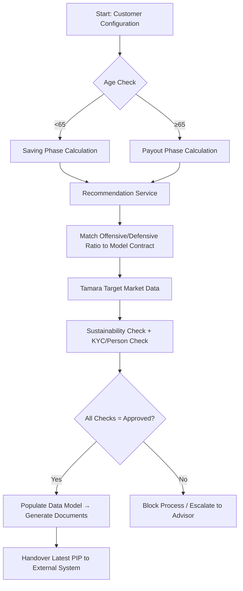

# Business Knowledge Extraction Report

## 1. Executive Summary
The extracted knowledge describes the business domain of an **Early Retirement Savings & Advisory Process (AVD/FRÜHSTART)** within a German financial services context. The process covers customer onboarding, suitability assessment, product recommendation, regulatory compliance checks, document generation, and external handover. Key business drivers include audit-driven customer verification requirements, strict input validation tied to state-subsidized pension limits, and parallel processing of advisory vs. contractual documentation.

---

## 2. Business Context & Domain Scope
- **Domain:** Retail Pension Advisory & Early Retirement Account Management (AVD/FRÜHSTART)
- **Scope:** End-to-end customer journey from initial configuration through suitability checks, product recommendation, compliance validation, document generation, and external delivery.
- **Primary Objective:** Enable customers (including minors via legal representatives) to configure early retirement savings plans while ensuring regulatory compliance, accurate subsidy calculation, and proper documentation handover.

---

## 3. Key Business Concepts & Glossary
| Term | Business Meaning |
|------|------------------|
| **AVD / FRÜHSTART** | Early Retirement Savings Account (minors eligible from age 6) |
| **GE** | Geeignetheitserklärung (Suitability Declaration) – confirms product matches customer profile |
| **PIP** | Produktinformationspapier / Plan Document – detailed product & subsidy information |
| **Tamara** | Internal target market & suitability data service |
| **CPMS** | External calculation engine for expected state subsidies/promotions |
| **Marktkenntnisse** | Product Knowledge Records – tracks customer’s prior understanding of specific markets |
| **Basis-Info** | Basic Information Document – triggers signature obligation on first capture or update |
| **Inhaber** | Account Holder (natural person; may be a minor with legal representative) |

---

## 4. Core Business Processes & Workflows
### 4.1 Recommendation & Suitability Orchestration
1. **Trigger:** Customer initiates recommendation process.
2. **Phase Calculation:** System determines Saving Phase (<65) vs. Payout Phase (≥65) based on customer’s birth date.
3. **Recommendation Service:** Returns offensive/defensive module ratios.
4. **Model Contract Selection:** Matches ratio to one of 21 predefined model contracts.
5. **Target Market & Checks:** Retrieves Tamara target market data, then runs Sustainability Check and KYC/Person Check in sequence.
6. **Validation Consolidation:** All checks must return approved status (codes 10/20). Any other result blocks the process.
7. **Data Model Population:** Fully populated model required for document generation and frontend display.

### 4.2 PIP Configuration & Calculation
1. Customer inputs savings rate, one-time payment, transfer amount, and child details.
2. System validates inputs against regulatory thresholds.
3. PIP calculation runs in parallel with GE via CPMS service.
4. Expected promotion/subsidy is calculated and displayed to customer.
5. Final configuration triggers document generation (PIP + GE).

### 4.3 Product Knowledge Verification (Quiz)
1. For every product group (~40+), customer must complete an interactive quiz.
2. Advisor in branch must actively guide customer through the system; manual checkbox approval is prohibited.
3. All questions per product group must be answered correctly to unlock the product.
4. Failed attempts may trigger a temporary online access block (cooldown).

---

## 5. Business Rules & Validation Logic
| Rule Category | Business Rule |
|---------------|---------------|
| **Age & Phase** | Saving phase applies if customer <65; payout phase if ≥65. Leap year birthdays must resolve to Feb 28 or Mar 1 (never Feb 29). |
| **Subsidy Limit** | Annualized savings rate + one-time payment ≤ €6,850 (regulatory threshold for state-subsidized pension schemes). |
| **Child Eligibility** | If child <18, Kindergeld eligibility defaults to 18th birthday; if ≥18, defaults to 25th birthday. Both are editable by customer. |
| **Document Versioning** | Only the latest PIP is delivered externally. Multiple PIPs may exist internally: advisory-phase PIP remains valid until contract attachment. GE is never sent externally. |
| **Product Knowledge Tracking** | System must detect if a customer’s product knowledge recording in a market is their first-ever capture. If list is empty or returns 404, treat as initial capture. |
| **Signature Obligation** | Basis-Info document requires signature if it’s the first capture OR if updated. Combination logic applies (OR condition). |

---

## 6. Decision Logic & State Transitions

---

## 7. Actors, Roles & Responsibilities
| Role | Business Responsibility |
|------|-------------------------|
| **Customer (Inhaber)** | Provides personal data, completes quizzes, confirms configuration, signs documents |
| **Legal Representative** | Acts on behalf of minor customers; child’s birth date drives eligibility logic |
| **Advisor / Expert (Filiale)** | Guides customer through quiz in branch system; cannot bypass verification with manual ticks |
| **Compliance / Audit Team** | Defines product knowledge tracking rules, signature obligations, and plausibilization standards |
| **Document Generation Service** | Renders GE & PIP based on fully populated business data model |
| **External System (Sau)** | Receives latest PIP document; does not receive GE or historical versions |

---

## 8. Important Business Objects & Data Requirements
| Object | Purpose | Key Attributes / Rules |
|--------|---------|------------------------|
| **Customer Profile** | Identity & eligibility verification | BP-Cent (natural person ID), birth date, age phase (<65/≥65) |
| **Model Contract** | Defines investment strategy | 21 variants; matched via offensive/defensive ratio |
| **PIP Document** | Product & subsidy information | Versioned; latest only for external delivery |
| **GE Document** | Suitability confirmation | Tied to advisory phase; never sent externally |
| **Product Group Record** | Quiz & knowledge tracking | ~40+ groups; requires quiz completion; tracks first-capture status |
| **Child Record** | Subsidy calculation input | Birth date, Kindergeld eligibility age (18/25), editable |

---

## 9. Regulatory & Compliance Drivers
- **Audit Requirement:** Mandatory interactive quizzes for all product groups to ensure customer understanding and prevent advisor bypass.
- **German Pension Regulations:** €6,850 annual contribution limit aligns with Riester/state-subsidized pension rules.
- **Document Retention & Delivery:** Strict version control; only current PIP delivered externally; GE retained internally for advisory compliance.
- **Product Knowledge Tracking:** Must preserve logic detecting first-time market knowledge capture to satisfy MiFID II / BaFin suitability documentation standards.

---

## 10. Dependencies & External Interfaces (Business View)
| Dependency | Business Impact |
|------------|-----------------|
| **CPMS Calculation Engine** | Provides expected subsidy/promotion; drives frontend display and PIP content |
| **Master Data Source (MSL)** | Supplies quiz questions, product group definitions, and duration parameters |
| **External Document Handover System** | Receives latest PIP only; requires clear versioning logic |
| **Document Generation Service** | Depends on fully populated business data model; triggers signature workflows |

---

## 11. Assumptions & Inferences
- **Assumption:** The €6,850 limit refers to German state-subsidized pension contribution thresholds (Riester/sonstige Förderung).
- **Inference:** "Codes 10 and 20 pass" likely represent internal business status codes for approved checks; exact mapping requires validation with compliance team.
- **Assumption:** Minors can open early retirement accounts from age 6, transitioning automatically to standard AVD at 18/25 without manual contract reissuance.
- **Inference:** Cooldown mechanism (7-day block after failed quiz) is a risk-mitigation feature to prevent repeated unauthorized attempts online; requires persistent state tracking.

---

## 12. Risks & Pain Points
| Risk | Business Impact |
|------|-----------------|
| **Quiz Bypass Potential** | Customers may retry indefinitely if cooldown isn’t enforced, undermining compliance intent |
| **Document Version Confusion** | Displaying multiple PIPs in summary could mislead customers about contract validity |
| **First-Capture Detection Gap** | Relying on empty list/404 to detect first product knowledge capture is fragile; deleted records may trigger false positives |
| **Parallel Processing Latency** | Waiting for full document render before showing expected subsidy creates poor UX; requires careful state management |

---

## 13. Open Questions & Next Investigation Areas
1. **Minor Account Transition:** How exactly does an early retirement account convert to standard AVD at age 18/25? Is it automatic or manual?
2. **OTC Context Clarification:** What is the business scope of OTC (Over-The-Counter) advisors in this process? Are they excluded from quiz requirements?
3. **Shared Secret Validation:** What is the exact business purpose of the security validation endpoint mentioned for external handover?
4. **Cooldown Implementation Scope:** Is a 7-day block mandatory, or can it be configurable per product group/market?
5. **Document Display Logic:** Why are multiple PIPs excluded from customer summary views despite internal versioning?

---

## 14. Overall Big Picture
The domain represents a **regulated retail pension advisory workflow** where customer suitability, subsidy calculation, and compliance verification intersect. The business prioritizes:
- **Audit readiness** through mandatory interactive product knowledge verification
- **Regulatory alignment** via strict contribution limits and document versioning
- **Customer clarity** by separating advisory documentation (GE) from contractual delivery (PIP)
- **Operational efficiency** through parallel calculation paths and centralized data modeling

The process is heavily dependent on accurate personal data, external calculation engines, and robust state management to ensure compliance while maintaining a smooth customer experience. Future work must address quiz enforcement persistence, document version clarity, and first-capture detection reliability.