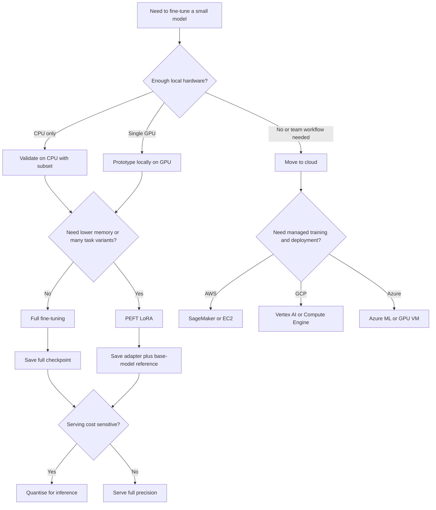

# Fine-Tuning Small Models Locally and Across AWS, GCP, and Azure

## Executive summary

The main deliverable is a ready-to-download Markdown tutorial: [Download the Markdown tutorial](sandbox:/mnt/data/fine_tuning_tutorial.md)

For someone preparing for real job tasks, the safest teaching path is to start with a **small, well-documented model and a simple supervised task**, then scale the exact same workflow across frameworks and clouds. In practice, that means beginning with **DistilBERT** for sequence classification, because DistilBERT was designed as a smaller, faster, cheaper variant of BERT, and Hugging Face’s model cards show DistilBERT family checkpoints at roughly the **67M-parameter** scale; only then should you branch into larger or more operationally complex options such as chat-style causal LMs, multi-GPU jobs, or heavy managed-cloud orchestration. citeturn16search0turn29search0turn29search3

The strongest tutorial design is **progressive** rather than tool-centric. The official Hugging Face training guide explicitly supports fine-tuning with **Trainer**, **native PyTorch**, and **TensorFlow/Keras**, while Lightning exists to reduce boilerplate around the training loop. On the infrastructure side, AWS SageMaker, Google Cloud Vertex AI, and Azure Machine Learning all formalise training around **containerised workloads**, which means a single local project structure can be reused with different launch commands and managed services. citeturn2search9turn2search16turn21search1turn32view1turn31view1turn31view2

Because the user left **region**, **budget**, and **target model size** unspecified, it would be misleading to present a fake “one true” cloud cost table. The official pricing and service pages from AWS, Google Cloud, and Azure all emphasise that billed cost depends on the exact service mix, region, instance family, and pricing model; Google’s pricing pages additionally separate raw GPU prices from accelerator-optimised VM bundles. The practical answer is to recommend **low-risk starting points** and treat the providers’ calculators as the source of truth for final budgeting. citeturn23view2turn23view1turn23view3turn24search1

The tutorial attached above follows that logic closely. It includes prerequisites, reproducible scripts, local CPU-only and GPU examples, AWS/GCP/Azure workflows, LoRA/PEFT, quantised inference, evaluation, augmentation, Docker, and CI notes. The rest of this report explains **why that structure is the right one** and where the most important trade-offs sit. citeturn32view0turn31view1turn31view3turn28search2turn28search11

## Scope and assumptions

A comprehensive hands-on tutorial has to narrow the problem enough to be teachable. Here the most defensible default is **binary text classification on IMDb** with a small DistilBERT checkpoint, because Hugging Face’s official sequence-classification guide uses DistilBERT on IMDb, and TensorFlow’s official text-classification materials also use IMDb as a canonical teaching dataset. That keeps the tutorial aligned with primary documentation, easy to validate locally, and transferable to production patterns such as support-ticket routing, sentiment scoring, moderation prototypes, or simple document triage. citeturn30search9turn30search17turn30search2turn30search10

That default does **not** mean the tutorial is limited to one model family. If the job context later shifts toward generation rather than classification, there is a natural optional branch into very small causal LMs, such as **TinyLlama-1.1B** or **SmolLM2-135M**, both of which Hugging Face lists as lightweight model cards on the Hub. The important teaching principle is that the student should first master **dataset loading, tokenisation, collators, metrics, checkpointing, and debug loops** on a compact model before changing the task type or model class. citeturn29search1turn29search2turn16search2turn2search9

The other key assumption is that the tutorial should teach both **full fine-tuning** and **parameter-efficient fine-tuning**. That is justified by the original **LoRA** paper, which showed that freezing the base model and training low-rank adapters can drastically reduce trainable parameters and memory demand, and by the **QLoRA** paper, which extended that logic to quantised backbones for much larger language models. The official Hugging Face PEFT documentation now treats this as a first-class workflow rather than a niche trick. citeturn16search0turn16search1turn16search2turn36search9turn36search10

## Tutorial architecture

A good tutorial should feel like an operations playbook, not a disconnected set of code snippets. The complete workflow the attached Markdown teaches is: choose a task, inspect data, tokenise, run a tiny CPU smoke test, move to local GPU or managed cloud, tune hyperparameters, evaluate with task-appropriate metrics, save or export the model, and then deploy or benchmark inference. That structure follows the way Hugging Face, TensorFlow, PyTorch, and the cloud platforms describe their workflows: data preparation first, then training, then metrics and artefacts, then containerised serving or managed endpoints. citeturn2search9turn30search1turn18search0turn31view1turn31view4turn32view0

The decision flow below captures the most useful branching logic for a practitioner preparing for real tasks. It formalises two questions that matter more than any single library choice: **local or cloud**, and **full fine-tuning or PEFT**. Those are the inflection points that determine memory footprint, cost, operational complexity, and how portable the training artefacts will be. citeturn16search0turn16search1turn32view1turn35search0turn31view2



The timeline view is equally important for learners, because it makes clear that “fine-tuning” is not just gradient updates. It is a short ML lifecycle: dataset curation, tokenisation, smoke tests, training, tuning, evaluation, export, deployment, and monitoring. That lifecycle view is exactly where cloud services add value, since all three major providers separate **training jobs**, **artefacts**, and **endpoints** in their official product models. citeturn32view1turn31view1turn31view4turn32view3


## Local fine-tuning path

The local path should begin with a **CPU-only smoke test**, not because CPU training is ideal, but because it catches the highest-value failures at the lowest cost: malformed text, mislabeled columns, padding errors, sequence-length explosions, broken metrics, or save/load mistakes. Official Hugging Face documentation emphasises dataset preparation, tokenisation, and dynamic padding; PyTorch’s save/load guide and TensorFlow’s Keras documentation likewise centre reproducibility and checkpoint hygiene, which are precisely the things most often broken in first attempts. citeturn2search9turn2search16turn18search0turn15search6turn31view3

For the concrete baseline, the tutorial uses `distilbert-base-uncased` with a **downsampled IMDb split**. That combination is intentionally conservative. IMDb is easy to reason about, DistilBERT is small enough for local iteration, and a 1k–2k example subset is enough to validate the whole pipeline without burning time or money. The task is to get a complete working path first: `load_dataset`, clean text, tokenise with truncation, use `DataCollatorWithPadding`, train, evaluate with Accuracy and F1, then save tokenizer plus model artefacts. citeturn30search9turn30search17turn20search0turn20search2turn18search0

A representative Hugging Face snippet looks like this:

```python
from datasets import load_dataset
from transformers import (
    AutoTokenizer, AutoModelForSequenceClassification,
    DataCollatorWithPadding, Trainer, TrainingArguments
)

dataset = load_dataset("imdb")
train_ds = dataset["train"].shuffle(seed=42).select(range(2000))
valid_ds = dataset["test"].shuffle(seed=42).select(range(500))

tokenizer = AutoTokenizer.from_pretrained("distilbert-base-uncased")

def tok(batch):
    return tokenizer(batch["text"], truncation=True, max_length=256)

train_ds = train_ds.map(tok, batched=True)
valid_ds = valid_ds.map(tok, batched=True)

model = AutoModelForSequenceClassification.from_pretrained(
    "distilbert-base-uncased", num_labels=2
)

trainer = Trainer(
    model=model,
    args=TrainingArguments(
        output_dir="outputs/hf-distilbert",
        per_device_train_batch_size=8,
        per_device_eval_batch_size=8,
        num_train_epochs=2,
        eval_strategy="epoch",
        save_strategy="epoch",
        report_to="none",
        seed=42
    ),
    train_dataset=train_ds,
    eval_dataset=valid_ds,
    data_collator=DataCollatorWithPadding(tokenizer=tokenizer),
)
trainer.train()
trainer.save_model("outputs/hf-distilbert")
tokenizer.save_pretrained("outputs/hf-distilbert")
```

Once that works, moving to a **single local GPU** is mostly a runtime optimisation, not a conceptual change. The same code typically scales by increasing sample count, batch size, and turning on mixed precision when appropriate. That is exactly why DistilBERT is such a good teaching model: the workflow stays stable while the learner experiences the real engineering differences between CPU debugging and GPU iteration. For learners who want cleaner loop structure or easier multi-device extensibility, Lightning is a reasonable second implementation, because its value proposition is primarily reduced engineering boilerplate around the training loop. citeturn16search0turn29search0turn21search1

TensorFlow/Keras belongs in the tutorial for a different reason: many job environments still expect Keras fluency. Hugging Face’s training guide explicitly documents a Keras fine-tuning path where tokenised `datasets` objects are converted to `tf.data.Dataset`, while TensorFlow’s Keras materials frame the workflow around `compile`, `fit`, and standard model saving. A learner who can train the same task both ways is much better prepared for heterogeneous codebases. citeturn2search9turn2search16turn2search15turn30search10

## Cloud implementation patterns

The cloud chapter of the tutorial should teach one transferable principle above all: **package the same code into a container or framework image, then move the launch surface from local CLI to managed job APIs**. AWS, GCP, and Azure all converge on that model even though their resource names differ. That convergence is important for job preparation, because it means the “real” deployable unit is not a notebook; it is a containerised training application with explicit inputs, outputs, metrics, and environment definitions. citeturn32view1turn32view2turn31view1turn31view3turn31view2

On **AWS**, SageMaker provides official Hugging Face support through AWS Deep Learning Containers and the Hugging Face estimator, while also allowing CLI and Boto3 orchestration if you need lower-level control. SageMaker’s own training overview describes its core as the containerisation of ML workloads and the management of AWS compute resources. For a small-model tutorial, the most realistic advice is to start with a **single-GPU** job, not distributed training. In instance-family terms, **G4dn** is positioned by AWS as a low-cost option for small-scale training and inference on **T4 GPUs**, while **G5** uses **A10G GPUs with 24 GB GPU memory** and is positioned for stronger single-node ML training and inference. citeturn32view0turn32view1turn33view0turn33view1

On **Google Cloud**, the clean managed path is a **Vertex AI CustomJob**. Google’s documentation is unusually explicit: you create a training application, decide between a prebuilt or custom container, store data in accessible cloud storage, push the image to Artifact Registry or Docker Hub, and submit a custom job. For simple entry-level GPU work, **G2** is the natural starting point, and Google’s Compute Engine docs specify that G2 instances use **NVIDIA L4** GPUs. For heavier jobs, **A2** is the natural step up, and Google documents A2 as the A100-backed accelerator-optimised family. The same platform also supports built-in hyperparameter tuning. citeturn31view1turn33view2turn23view1turn35search1

On **Azure**, the closest equivalent is an **Azure ML command job** plus a defined **environment**. Microsoft’s docs describe command jobs as Docker-container executions that can be used for single-node or distributed training, while environments encapsulate the runtime dependencies and can be defined from a Docker image, build context, or conda specification. For training hardware, Azure’s GPU families span several different profiles: **NCasT4_v3** exposes **T4 GPUs with 16 GB memory**, **NVadsA10_v5** exposes **partial or full A10 GPUs up to 24 GB**, and **NC_A100_v4** exposes **A100 80 GB** GPUs for larger workloads. For deployment, Azure ML’s managed online endpoints are the cleanest “real-time inference” path and even recommend local Docker debugging before cloud rollout. citeturn31view2turn31view3turn31view4turn33view4turn33view5turn33view3

Because the region is unspecified, the most honest cross-cloud cost table is qualitative rather than pseudo-precise. The table below is an **analytical synthesis** of official instance-family docs and pricing guidance, not a substituted invoice; use the provider calculators for final budgeting. Google’s pricing page additionally shows that raw on-demand **T4 GPU pricing** on standard VMs is listed at **$0.35 per GPU-hour** before the VM itself is added, which illustrates why comparing “GPU price” and “VM price” across providers can otherwise become muddled. citeturn23view1turn23view2turn24search1turn23view3

| Platform path | Sensible starting point | Cost tier | Why this is the right first step |
|---|---|---|---|
| Local CPU | DistilBERT on 1k–2k examples | Lowest | Best for data, tokenisation, and save/load debugging |
| Local GPU | DistilBERT full fine-tune on a single consumer GPU | Low to medium | Fastest feedback loop once the pipeline is stable |
| AWS | SageMaker or EC2 on G4dn | Low to medium | AWS positions G4dn/T4 for small-scale training and lower-cost entry |
| AWS | SageMaker on G5 | Medium | A10G and 24 GB per GPU make G5 a stronger single-node default |
| GCP | Vertex AI or Compute Engine G2 with one L4 | Medium | G2 is the natural L4-backed managed starting point |
| GCP | Vertex AI A2 with A100 | High | Good step-up when memory or throughput become limiting |
| Azure | Azure ML or VM on NCasT4_v3 | Low to medium | T4-based option for economical GPU access |
| Azure | Azure ML on NVadsA10_v5 or NC_A100_v4 | Medium to high | A10 or A100 depending whether you need moderate or serious headroom |

The tutorial also includes command skeletons that reflect the official service models. They are deliberately simple, because the learner needs to understand the *shape* of each workflow first:

```bash
# AWS CLI idea
aws sagemaker create-training-job ...

# GCP CLI idea
gcloud ai custom-jobs create --worker-pool-spec=...

# Azure CLI idea
az ml job create --file cloud/azure_job.yml
```

Those simplified commands are not meant to replace the provider docs. They are meant to teach the common pattern: **define code, environment, compute, then submit a job**. citeturn12search4turn14search0turn31view2

## PEFT, quantisation, evaluation, and debugging

The tutorial is right to include **LoRA/PEFT** as a core branch rather than a side note. The original LoRA paper makes the central case clearly: as models grow, full fine-tuning becomes increasingly expensive, and low-rank adaptation keeps the base model frozen while training a much smaller number of parameters. The Hugging Face PEFT documentation reflects that same trade-off in practical form: configure a `LoraConfig`, wrap the base model with `get_peft_model`, and save adapters rather than fully duplicating all pretrained weights. citeturn16search0turn16search2turn36search9

For a small-model tutorial, LoRA is useful for two reasons. First, it teaches the **adapter mental model** that now appears widely in real-world fine-tuning work. Second, it prepares the learner for bigger model families where full fine-tuning is no longer sensible. If the job context later grows toward larger causal LMs, the attached tutorial’s LoRA chapter becomes a stepping stone toward **QLoRA**, which the original paper describes as backpropagating through a frozen **4-bit quantised** model into low-rank adapters. citeturn16search1turn16search3

Quantisation belongs in the tutorial, but mainly on the **inference** side. For a small classifier, the cleanest operational route is usually **ONNX Runtime**, because the ONNX Runtime documentation positions quantisation as a model-size and performance optimisation path, and Hugging Face Optimum provides export and quantisation support for ONNX Runtime. For learners focused on CPU serving or low-cost deployment, that is often more practical than teaching CUDA-only quantisation paths first. citeturn27search0turn27search1turn18search2turn18search9

Evaluation should be taught as more than “print one metric.” The most useful minimum bundle for a classifier is **Accuracy**, **F1**, a confusion matrix, and a small manual review of false positives and false negatives. Hugging Face provides evaluate modules for Accuracy and F1, while scikit-learn’s documentation defines F1 as the harmonic mean of precision and recall and provides `classification_report` for a compact textual summary. That combination is simple enough for a beginner and still credible in an interview or production handoff. citeturn20search0turn20search2turn20search3

For data augmentation, the tutorial should stay conservative. The **EDA** paper is a reasonable primary source for light augmentation in text classification, especially in smaller-data regimes, but augmentation must remain label-preserving. That means learners should first try **more real data, better labels, and split hygiene**, then only add careful augmentation such as synonym replacement or back-translation when the label semantics are stable. citeturn19search0turn19search3

In practice, the most common debugging problems are remarkably repetitive: out-of-memory errors, variable-length tensor padding mistakes, wrong label column names, mismatch between `num_labels` and dataset labels, bad train/validation splits, and cloud-container entrypoint failures. The attached tutorial’s debugging chapter is therefore one of its highest-value sections, because these errors are what usually block people from turning a notebook success into a repeatable engineering workflow. The official docs on padding, job environments, and local endpoint debugging strongly support that emphasis. citeturn2search16turn31view3turn31view4

## Comparison tables and recommendations

The table below summarises the main methodological choices as a practitioner would actually use them. It is a synthesis of the official docs and papers cited throughout the report, not a verbatim vendor table. citeturn16search0turn16search1turn32view1turn31view1turn31view2

| Choice | Best when | Main advantage | Main disadvantage | Recommended first use |
|---|---|---|---|---|
| Full fine-tuning | model is small and task is stable | simplest mental model, maximum flexibility | more memory and larger artefacts | DistilBERT on local CPU/GPU |
| LoRA / PEFT | memory is tight or many task variants are needed | smaller trainable footprint and adapter artefacts | more moving parts than full fine-tune | second pass after full baseline |
| CPU-only local | validating data and code | cheapest and safest debugging path | slow | first smoke test |
| Local single GPU | rapid iteration matters | best feedback loop per hour of work | hardware-dependent | after CPU smoke test |
| Managed cloud job | teams, IAM, logs, reproducibility matter | operational clarity and artefact tracking | more setup and billing complexity | once local training is stable |
| Quantised inference | serving cost or RAM matters | lower memory footprint, often better CPU economics | export/compatibility checks required | after accuracy is already acceptable |

The cloud recommendation table below is similarly practical. It answers the question, “If I had to start Monday, where would I begin?” rather than pretending that every workload needs the biggest GPU family. citeturn33view0turn33view1turn33view2turn33view4turn33view5turn33view3

| Environment | Recommended start | Why | Required command pattern |
|---|---|---|---|
| Local CPU | DistilBERT + 2k-sample subset | validates the full pipeline cheaply | `python scripts/train_hf_distilbert.py` |
| Local GPU | same project, bigger subset and batch | preserves workflow, improves iteration speed | same command with larger arguments |
| AWS | SageMaker or EC2 G4dn first, G5 when needed | G4dn is AWS’s small-scale/low-cost entry; G5 is a stronger single-node default | `aws sagemaker create-training-job ...` or SDK |
| GCP | Vertex AI CustomJob on G2/L4 first | clean managed path and good entry GPU family | `gcloud ai custom-jobs create ...` |
| Azure | Azure ML command job on NCasT4_v3 first | clean containerised job model with economical T4 start | `az ml job create --file ...` |

The container and CI/CD choices in the downloadable tutorial are also well judged. Docker’s documentation recommends building and testing images in CI, while GitHub Actions defines workflows as YAML files in `.github/workflows` and supports matrix variations for jobs. That is exactly enough CI/CD for a small-model tutorial: lint, compile or smoke-test scripts, optionally build a container, and keep the workflow deterministic. citeturn28search2turn28search11turn28search16turn28search1

The bottom-line recommendation is straightforward. If the learner wants the best return on time, they should follow this order: **local CPU smoke test → local GPU full fine-tune → PEFT variant → one managed cloud job → ONNX or managed endpoint deployment**. That sequence mirrors the way the official tools are designed to be used and teaches the most transferable skills per hour spent. citeturn2search9turn32view1turn31view1turn31view4turn18search9

## Open questions and limitations

The most important limitation is cost precision. Because the request left **region**, **budget ceiling**, and **target model size** unspecified, exact cross-cloud cost estimates would be brittle and potentially misleading. The attached tutorial therefore uses **qualitative cost tiers** and points readers toward official calculators and pricing pages for final budgeting. citeturn23view2turn23view1turn24search1turn23view3

The second limitation is task scope. The main hands-on path is intentionally centred on **sequence classification** rather than instruction tuning of a small chat model, because it is much easier to teach rigorously across Hugging Face, Lightning, and Keras. The tutorial does mention the causal-LM branch and PEFT logic, but a full instruction-tuning track would sensibly be a separate follow-on module rather than being mixed into the beginner-safe baseline. citeturn2search9turn16search2turn29search1turn29search2