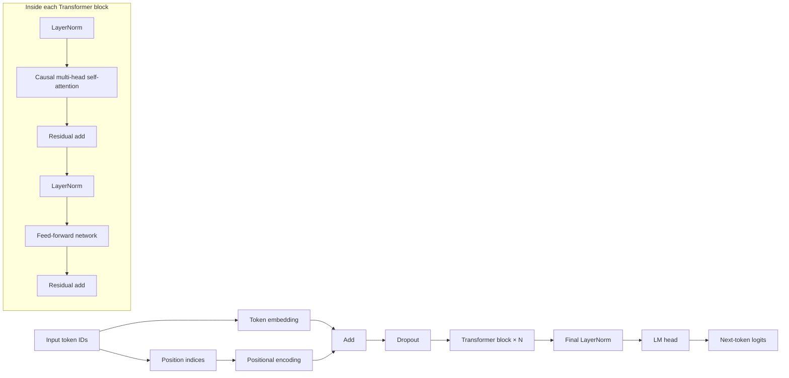

# Building and Training a Demo Large Language Model in PyTorch

## Executive Summary

This tutorial is a research-grounded, downloadable-ready Markdown guide for building and training a **small decoder-only Transformer language model** in PyTorch. It is deliberately sized for learning and experimentation rather than frontier-scale training, but it implements the same core ideas used in modern GPT-like causal language models: token embeddings, positional information, masked multi-head self-attention, residual connections, layer normalisation, a position-wise feed-forward network, next-token cross-entropy training, checkpointing, and autoregressive sampling. The heart of the tutorial is the **attention mechanism**, shown both mathematically and in annotated PyTorch code. citeturn18view0turn22search0turn12view1

The recommended teaching path is to implement attention **manually first** so that the scaling, masking, softmax, head reshaping, and output projection are fully transparent, then to switch to PyTorch’s fused `scaled_dot_product_attention()` path for better runtime performance once the mechanics are clear. PyTorch’s own documentation notes that `nn.MultiheadAttention` uses optimised `scaled_dot_product_attention()` implementations when possible, which makes this progression both educational and practical. citeturn12view1turn0search4turn12view0

Architecturally, the tutorial uses a **decoder-only causal LM** because Hugging Face’s causal language modelling guidance aligns that objective with next-token prediction and left-to-right masking. For stability, it uses a **Pre-LN** Transformer block rather than the original Post-LN ordering, because later analysis showed that Pre-LN gives better-behaved gradients at initialisation and reduces warm-up sensitivity. For position handling, the tutorial defaults to **learned absolute positional embeddings** for simplicity, while also explaining **sinusoidal encodings** from the original Transformer paper and discussing **RoPE** as the most relevant next upgrade path. citeturn22search0turn20view0turn18view0turn5search1

For data, no specific constraint was supplied, so this guide assumes **no fixed hardware or dataset requirement**. It therefore presents two sensible defaults: **WikiText-2** for faster, classic small-scale experiments and **TinyStories** for visibly better small-model text generation, because TinyStories was explicitly introduced to make coherent training of very small language models feasible. citeturn19view0turn19view1turn10search0turn16view1

## Goals and Audience

The goal is not to replicate a production LLM stack. The goal is to understand, end to end, how a GPT-style causal language model works, how attention is computed, how text becomes tokens, how those tokens become logits, and how training, validation, and sampling fit together in one coherent PyTorch project. That scope matches an audience with **intermediate Python and machine learning knowledge**, especially readers already comfortable with tensors, optimisation, and backpropagation, but who want a deeper systems-level understanding of Transformer language modelling. citeturn22search0turn14view2

A useful mental model is that this project teaches a **demo-scale LLM**: small enough to run on a workstation, but faithful enough to teach the same mechanics used by larger models. The original Transformer paper established the attention-centric architecture; GPT-style decoder-only language models apply the same machinery to left-to-right generation; Hugging Face’s causal LM documentation formalises this as next-token prediction under a left-only visibility constraint. citeturn16view5turn5search0turn22search0

The table below defines the tutorial’s success criteria.

| Area | What this tutorial does | What it deliberately does not do |
|---|---|---|
| Architecture | Builds a small decoder-only Transformer with attention from scratch | Reproduce frontier-scale architectures, MoE, long-context scaling, or instruction-tuning stacks |
| Training | Covers tokenisation, data packing, loss, AdamW, AMP, gradient accumulation, clipping, checkpointing, validation | Cover distributed training frameworks such as FSDP, tensor parallelism, or large-cluster orchestration |
| Inference | Implements greedy, top-k, and top-p sampling | Provide highly optimised cached decoding or serving infrastructure |
| Evaluation | Uses validation loss and perplexity, plus qualitative prompts | Provide a full benchmark suite or safety red-teaming harness |

That framing is consistent with the original Transformer formulation, PyTorch training primitives, and Hugging Face’s causal language modelling workflow. citeturn18view0turn12view9turn22search0

## Prerequisites and Project Setup

No specific constraints were given, so the baseline assumption is **“whatever hardware you have, scaled to fit”**. In practice, a CPU is fine for syntax checks and tiny smoke tests, but a recent CUDA GPU is strongly preferable for meaningful runs because PyTorch’s automatic mixed precision is designed to speed up training while maintaining accuracy, and its most visible benefits are on CUDA-capable hardware. Recent PyTorch guidance also highlights `DataLoader` batching, multiprocessing, and memory pinning as key throughput levers. citeturn12view2turn1search0turn12view7turn1search4

A practical starting stack is: recent Python 3, **PyTorch**, **Transformers**, **Datasets**, and **tqdm**. Hugging Face’s dataset loader is flexible enough to read Hub datasets or local files; its tokenizer classes support loading pretrained fast tokenizers and also retraining them from iterators when desired. citeturn15view3turn14view2turn12view5

The dataset choice matters more than many newcomers expect. **WikiText** offers a long-standing language-modelling benchmark with over 100 million tokens in the broader family, and the `wikitext-2-v1` subset is small enough for local experiments. **TinyStories** is especially attractive for demo LMs because it was explicitly designed so that models well below mainstream “LLM” scale can still learn coherent English generation. citeturn19view0turn19view1turn10search0turn16view1

| Prerequisite | Baseline recommendation | Notes |
|---|---|---|
| Hardware | No fixed requirement; single GPU preferred | AMP is most useful on CUDA hardware; CPU-only is mainly for smoke tests. citeturn12view2turn1search0 |
| Software | Python, PyTorch, Transformers, Datasets, tqdm | This is enough for a complete demo LM pipeline. citeturn15view3turn14view2 |
| Dataset | `Salesforce/wikitext` or `roneneldan/TinyStories` | WikiText is easier to iterate on; TinyStories is better for visibly coherent small-model generations. citeturn19view0turn19view1turn10search0turn16view1 |
| Tokeniser | Hugging Face fast tokenizer | Fast tokenizers support efficient encoding and optional retraining from iterators. citeturn14view1turn14view2 |

A compact project layout is enough:

```text
demo-llm/
├── requirements.txt
├── model.py
├── train.py
└── sample.py
```

A minimal install command is:

```bash
python -m venv .venv
source .venv/bin/activate
pip install torch transformers datasets tqdm sentencepiece
```

The model-size table below compares three sensible profiles. The parameter counts are **approximate**, derived from the decoder-only architecture defined later, with a 32k vocabulary and tied output embeddings.

| Profile | Layers | d_model | Heads | FFN width | Max sequence length | Approx. parameters | Best use |
|---|---:|---:|---:|---:|---:|---:|---|
| Mini | 4 | 192 | 4 | 768 | 256 | ~8.0M | Fast smoke tests; TinyStories-style experiments |
| Demo | 4 | 256 | 4 | 1024 | 256 | ~11.4M | Best balance for first complete run |
| Workshop | 6 | 384 | 6 | 1536 | 512 | ~23.2M | Better sample quality on a stronger single GPU |

These shapes stay close to the Transformer design patterns established in the original paper while remaining small enough for local teaching runs. citeturn18view0turn5search0

## Transformer Design and Attention Mechanics

The original Transformer paper defines a stack of self-attention and feed-forward blocks with residual connections and layer normalisation. For causal language modelling, we keep only the **decoder-style left-to-right path**: every position may attend only to itself and earlier positions, never to future tokens. Hugging Face’s causal language modelling guide states this behaviour directly: the model predicts the next token and can only attend to tokens on the left. citeturn18view0turn22search0



The attention mechanism begins with a sequence representation \(X \in \mathbb{R}^{B \times T \times C}\), where \(B\) is batch size, \(T\) is sequence length, and \(C\) is model width. We compute queries, keys, and values by learned projections:

\[
Q = XW_Q,\qquad K = XW_K,\qquad V = XW_V
\]

We then split the last dimension into \(H\) heads of width \(d_h=C/H\), compute pairwise similarity scores, apply the causal mask, and normalise with softmax:

\[
\text{Attention}(Q,K,V)=\text{softmax}\left(\frac{QK^\top + M}{\sqrt{d_h}}\right)V
\]

where \(M_{ij}=0\) when token \(j\) is visible to token \(i\), and \(M_{ij}=-\infty\) for illegal future connections. Multi-head attention concatenates the per-head outputs and applies a final output projection:

\[
\text{MHA}(X)=\text{Concat}(\text{head}_1,\dots,\text{head}_H)W_O
\]

This is the scaled dot-product attention defined in the original Transformer. The division by \(\sqrt{d_h}\) is there to stop dot products from growing too large and pushing softmax into tiny-gradient regions. citeturn18view0

The feed-forward part is applied independently at every position:

\[
\text{FFN}(x)=W_2\,\phi(W_1x+b_1)+b_2
\]

In the original paper \(\phi\) was ReLU; in modern decoder implementations GELU is common, and this tutorial uses GELU because it is a practical modern default. Residual connections keep information flowing through depth, and layer normalisation normalises activations across a layer on a per-example basis, using the same computation at train and test time. citeturn18view0turn11search0

For **layer norm placement**, this tutorial uses **Pre-LN**:

\[
x \leftarrow x + \text{Attention}(\text{LN}(x))
\]
\[
x \leftarrow x + \text{FFN}(\text{LN}(x))
\]

That differs from the original Post-LN arrangement but is easier to train in practice. Later analysis showed that Pre-LN gives better-behaved gradients at initialisation, whereas Post-LN more often requires carefully tuned warm-up for stable convergence. citeturn20view0turn20view1

For **positional information**, three practical choices matter:

| Positional method | Why people use it | Main downside | Recommendation here |
|---|---|---|---|
| Learned absolute embeddings | Simplest implementation; pairs naturally with a fixed `max_seq_len` | Does not extrapolate gracefully beyond the trained context window | **Default in code** |
| Sinusoidal encodings | Parameter-free and introduced in the original Transformer; may extrapolate better | Less aligned with many modern decoder stacks | **Explained and supported** |
| RoPE | Excellent modern upgrade path for long-context decoders | More implementation complexity than a first tutorial needs | **Discussed, not implemented** |

The original Transformer authors reported that learned and sinusoidal position encodings performed similarly in their experiments, while RoPE was introduced later as a more advanced positional treatment for Transformer language models. citeturn18view0turn5search1

A final practical note: self-attention has a quadratic dependence on sequence length, so doubling context length is not a small change. The original paper explicitly compares self-attention with recurrent and convolutional layers and highlights its short path length and parallelisability, but also makes the sequence-length cost visible. citeturn18view0

## End-to-End PyTorch Implementation

The code below is intentionally compact but complete enough to run. It uses a **manual attention implementation for learning**, with an option to route the attention inner loop through PyTorch’s fused `scaled_dot_product_attention()` for better performance. Loss uses PyTorch cross-entropy over **unnormalised logits**, and checkpointing follows PyTorch’s recommended `state_dict` workflow. citeturn12view0turn12view9turn12view3

**`requirements.txt`**

```text
torch
transformers
datasets
tqdm
sentencepiece
```

**`model.py`**

```python
from dataclasses import dataclass
import math

import torch
import torch.nn as nn
import torch.nn.functional as F


@dataclass
class GPTConfig:
    vocab_size: int
    max_seq_len: int = 256
    d_model: int = 256
    n_layers: int = 4
    n_heads: int = 4
    d_ff: int = 1024
    dropout: float = 0.1
    attn_dropout: float = 0.1
    pos_encoding: str = "learned"   # "learned" or "sinusoidal"
    use_sdpa: bool = True           # use PyTorch fused SDPA when available


class SinusoidalPositionalEncoding(nn.Module):
    def __init__(self, max_seq_len: int, d_model: int):
        super().__init__()
        pe = torch.zeros(max_seq_len, d_model)
        position = torch.arange(0, max_seq_len, dtype=torch.float32).unsqueeze(1)
        div_term = torch.exp(
            torch.arange(0, d_model, 2, dtype=torch.float32)
            * (-math.log(10000.0) / d_model)
        )
        pe[:, 0::2] = torch.sin(position * div_term)
        pe[:, 1::2] = torch.cos(position * div_term)
        self.register_buffer("pe", pe.unsqueeze(0), persistent=False)

    def forward(self, length: int) -> torch.Tensor:
        return self.pe[:, :length, :]


class CausalSelfAttention(nn.Module):
    def __init__(self, config: GPTConfig):
        super().__init__()
        assert config.d_model % config.n_heads == 0, "d_model must divide n_heads evenly"

        self.n_heads = config.n_heads
        self.head_dim = config.d_model // config.n_heads
        self.scale = self.head_dim ** -0.5
        self.use_sdpa = config.use_sdpa

        self.qkv_proj = nn.Linear(config.d_model, 3 * config.d_model)
        self.out_proj = nn.Linear(config.d_model, config.d_model)

        self.attn_dropout = config.attn_dropout
        self.attn_dropout_layer = nn.Dropout(config.attn_dropout)
        self.resid_dropout = nn.Dropout(config.dropout)

        mask = torch.tril(torch.ones(config.max_seq_len, config.max_seq_len, dtype=torch.bool))
        self.register_buffer("causal_mask", mask, persistent=False)

    def forward(self, x: torch.Tensor) -> torch.Tensor:
        bsz, seq_len, d_model = x.shape

        qkv = self.qkv_proj(x)
        q, k, v = qkv.chunk(3, dim=-1)

        q = q.view(bsz, seq_len, self.n_heads, self.head_dim).transpose(1, 2)
        k = k.view(bsz, seq_len, self.n_heads, self.head_dim).transpose(1, 2)
        v = v.view(bsz, seq_len, self.n_heads, self.head_dim).transpose(1, 2)

        # Preferred fast path: PyTorch fused SDPA with causal masking.
        if self.use_sdpa and hasattr(F, "scaled_dot_product_attention"):
            y = F.scaled_dot_product_attention(
                q,
                k,
                v,
                attn_mask=None,
                dropout_p=self.attn_dropout if self.training else 0.0,
                is_causal=True,
            )
        else:
            # Transparent teaching path: explicit score -> mask -> softmax -> weighted sum.
            scores = (q @ k.transpose(-2, -1)) * self.scale
            scores = scores.masked_fill(
                ~self.causal_mask[:seq_len, :seq_len],
                float("-inf"),
            )
            probs = F.softmax(scores, dim=-1)
            probs = self.attn_dropout_layer(probs)
            y = probs @ v

        y = y.transpose(1, 2).contiguous().view(bsz, seq_len, d_model)
        y = self.out_proj(y)
        return self.resid_dropout(y)


class FeedForward(nn.Module):
    def __init__(self, config: GPTConfig):
        super().__init__()
        self.net = nn.Sequential(
            nn.Linear(config.d_model, config.d_ff),
            nn.GELU(approximate="tanh"),
            nn.Linear(config.d_ff, config.d_model),
            nn.Dropout(config.dropout),
        )

    def forward(self, x: torch.Tensor) -> torch.Tensor:
        return self.net(x)


class TransformerBlock(nn.Module):
    def __init__(self, config: GPTConfig):
        super().__init__()
        self.ln1 = nn.LayerNorm(config.d_model)
        self.attn = CausalSelfAttention(config)
        self.ln2 = nn.LayerNorm(config.d_model)
        self.ffn = FeedForward(config)

    def forward(self, x: torch.Tensor) -> torch.Tensor:
        x = x + self.attn(self.ln1(x))  # Pre-LN attention
        x = x + self.ffn(self.ln2(x))   # Pre-LN feed-forward
        return x


class DemoGPT(nn.Module):
    def __init__(self, config: GPTConfig):
        super().__init__()
        self.config = config

        self.token_embedding = nn.Embedding(config.vocab_size, config.d_model)

        if config.pos_encoding == "learned":
            self.position_embedding = nn.Embedding(config.max_seq_len, config.d_model)
        elif config.pos_encoding == "sinusoidal":
            self.position_embedding = SinusoidalPositionalEncoding(
                config.max_seq_len, config.d_model
            )
        else:
            raise ValueError("pos_encoding must be 'learned' or 'sinusoidal'")

        self.dropout = nn.Dropout(config.dropout)
        self.blocks = nn.ModuleList([TransformerBlock(config) for _ in range(config.n_layers)])
        self.ln_f = nn.LayerNorm(config.d_model)

        # Weight tying reduces parameters and is common in LM implementations.
        self.lm_head = nn.Linear(config.d_model, config.vocab_size, bias=False)
        self.lm_head.weight = self.token_embedding.weight

        self.apply(self._init_weights)

    def _init_weights(self, module: nn.Module) -> None:
        if isinstance(module, nn.Linear):
            nn.init.normal_(module.weight, mean=0.0, std=0.02)
            if module.bias is not None:
                nn.init.zeros_(module.bias)
        elif isinstance(module, nn.Embedding):
            nn.init.normal_(module.weight, mean=0.0, std=0.02)

    def forward(self, input_ids: torch.Tensor) -> torch.Tensor:
        bsz, seq_len = input_ids.shape
        if seq_len > self.config.max_seq_len:
            raise ValueError(
                f"Sequence length {seq_len} exceeds max_seq_len={self.config.max_seq_len}"
            )

        tok = self.token_embedding(input_ids)

        if self.config.pos_encoding == "learned":
            pos_ids = torch.arange(seq_len, device=input_ids.device)
            pos = self.position_embedding(pos_ids).unsqueeze(0)
        else:
            pos = self.position_embedding(seq_len)

        x = self.dropout(tok + pos)
        for block in self.blocks:
            x = block(x)
        x = self.ln_f(x)
        return self.lm_head(x)

    def num_parameters(self) -> int:
        return sum(p.numel() for p in self.parameters())
```

**`train.py`**

```python
import argparse
import math
import random
from dataclasses import asdict
from pathlib import Path

import numpy as np
import torch
import torch.nn.functional as F
from datasets import load_dataset
from torch.utils.data import DataLoader, Dataset
from tqdm import tqdm
from transformers import AutoTokenizer

from model import GPTConfig, DemoGPT


def set_seed(seed: int) -> None:
    random.seed(seed)
    np.random.seed(seed)
    torch.manual_seed(seed)
    if torch.cuda.is_available():
        torch.cuda.manual_seed_all(seed)


class PackedTextDataset(Dataset):
    """
    Simple in-memory dataset for demo training.
    It concatenates tokenised text with EOS markers and then slices it
    into fixed-length causal LM training blocks.
    """
    def __init__(
        self,
        dataset_name: str,
        dataset_config: str | None,
        split: str,
        text_field: str,
        tokenizer,
        seq_len: int,
        max_examples: int | None = None,
    ):
        ds = load_dataset(dataset_name, dataset_config, split=split)

        if max_examples is not None:
            max_examples = min(max_examples, len(ds))
            ds = ds.select(range(max_examples))

        texts = [t for t in ds[text_field] if isinstance(t, str) and t.strip()]
        eos_id = tokenizer.eos_token_id
        token_ids = []

        for start in tqdm(range(0, len(texts), 256), desc=f"Tokenising {split}"):
            batch = texts[start:start + 256]
            enc = tokenizer(batch, add_special_tokens=False)["input_ids"]
            for ids in enc:
                token_ids.extend(ids + [eos_id])

        ids = torch.tensor(token_ids, dtype=torch.long)
        n_seq = (len(ids) - 1) // seq_len
        if n_seq <= 0:
            raise ValueError("Not enough tokens to make even one training block.")

        self.inputs = ids[: n_seq * seq_len].view(n_seq, seq_len)
        self.targets = ids[1 : n_seq * seq_len + 1].view(n_seq, seq_len)

    def __len__(self) -> int:
        return self.inputs.size(0)

    def __getitem__(self, idx: int):
        return self.inputs[idx], self.targets[idx]


def build_optimizer(model: DemoGPT, lr: float, weight_decay: float):
    decay, no_decay = [], []
    for _, p in model.named_parameters():
        if not p.requires_grad:
            continue
        if p.dim() >= 2:
            decay.append(p)
        else:
            no_decay.append(p)

        optimizer = torch.optim.AdamW(
            [
                {"params": decay, "weight_decay": weight_decay},
                {"params": no_decay, "weight_decay": 0.0},
            ],
            lr=lr,
            betas=(0.9, 0.95),
        )
    return optimizer


def set_lr(optimizer, lr: float) -> None:
    for group in optimizer.param_groups:
        group["lr"] = lr


def cosine_warmup_lr(step: int, warmup_steps: int, max_steps: int, max_lr: float, min_lr: float) -> float:
    if step < warmup_steps:
        return max_lr * float(step + 1) / float(max(1, warmup_steps))
    progress = float(step - warmup_steps) / float(max(1, max_steps - warmup_steps))
    progress = min(max(progress, 0.0), 1.0)
    return min_lr + 0.5 * (max_lr - min_lr) * (1.0 + math.cos(math.pi * progress))


def loss_fn(logits: torch.Tensor, targets: torch.Tensor) -> torch.Tensor:
    vocab = logits.size(-1)
    return F.cross_entropy(logits.view(-1, vocab), targets.view(-1))


@torch.no_grad()
def evaluate(model, loader, device, use_amp: bool, amp_dtype, max_batches: int | None = None):
    model.eval()
    losses = []

    for idx, (x, y) in enumerate(loader):
        if max_batches is not None and idx >= max_batches:
            break

        x = x.to(device, non_blocking=True)
        y = y.to(device, non_blocking=True)

        with torch.autocast(device_type="cuda", dtype=amp_dtype, enabled=use_amp):
            logits = model(x)
            loss = loss_fn(logits, y)

        losses.append(loss.item())

    mean_loss = float(np.mean(losses))
    ppl = math.exp(min(mean_loss, 20.0))
    model.train()
    return mean_loss, ppl


def save_checkpoint(path: Path, model, optimizer, step: int, best_val_loss: float, config: GPTConfig) -> None:
    ckpt = {
        "model": model.state_dict(),
        "optimizer": optimizer.state_dict(),
        "step": step,
        "best_val_loss": best_val_loss,
        "model_config": asdict(config),
    }
    torch.save(ckpt, path)


def load_checkpoint(path: Path, model, optimizer=None, map_location="cpu"):
    ckpt = torch.load(path, map_location=map_location)
    model.load_state_dict(ckpt["model"])
    if optimizer is not None and "optimizer" in ckpt:
        optimizer.load_state_dict(ckpt["optimizer"])
    return ckpt


def main():
    parser = argparse.ArgumentParser()
    parser.add_argument("--dataset_name", default="Salesforce/wikitext")
    parser.add_argument("--dataset_config", default="wikitext-2-raw-v1")
    parser.add_argument("--train_split", default="train")
    parser.add_argument("--val_split", default="validation")
    parser.add_argument("--text_field", default="text")
    parser.add_argument("--max_train_examples", type=int, default=None)
    parser.add_argument("--max_val_examples", type=int, default=2000)

    parser.add_argument("--tokenizer_name", default="openai-community/gpt2")
    parser.add_argument("--output_dir", default="outputs/demo")

    parser.add_argument("--max_seq_len", type=int, default=256)
    parser.add_argument("--d_model", type=int, default=256)
    parser.add_argument("--n_layers", type=int, default=4)
    parser.add_argument("--n_heads", type=int, default=4)
    parser.add_argument("--d_ff", type=int, default=1024)
    parser.add_argument("--dropout", type=float, default=0.1)
    parser.add_argument("--attn_dropout", type=float, default=0.1)
    parser.add_argument("--pos_encoding", choices=["learned", "sinusoidal"], default="learned")

    parser.add_argument("--batch_size", type=int, default=8)
    parser.add_argument("--grad_accum_steps", type=int, default=8)
    parser.add_argument("--max_steps", type=int, default=3000)
    parser.add_argument("--warmup_steps", type=int, default=200)
    parser.add_argument("--max_lr", type=float, default=3e-4)
    parser.add_argument("--min_lr", type=float, default=3e-5)
    parser.add_argument("--weight_decay", type=float, default=0.1)
    parser.add_argument("--grad_clip", type=float, default=1.0)

    parser.add_argument("--log_every", type=int, default=20)
    parser.add_argument("--eval_every", type=int, default=200)
    parser.add_argument("--save_every", type=int, default=200)

    parser.add_argument("--seed", type=int, default=42)
    parser.add_argument("--num_workers", type=int, default=2)
    parser.add_argument("--resume", type=str, default=None)
    parser.add_argument("--amp", action="store_true")
    parser.add_argument("--amp_dtype", choices=["float16", "bfloat16"], default="float16")
    args = parser.parse_args()

    out_dir = Path(args.output_dir)
    out_dir.mkdir(parents=True, exist_ok=True)

    set_seed(args.seed)

    device = "cuda" if torch.cuda.is_available() else "cpu"
    use_amp = args.amp and device == "cuda"
    amp_dtype = torch.float16 if args.amp_dtype == "float16" else torch.bfloat16
    use_scaler = use_amp and amp_dtype == torch.float16
    scaler = torch.amp.GradScaler("cuda", enabled=use_scaler)

    tokenizer = AutoTokenizer.from_pretrained(args.tokenizer_name, use_fast=True)
    tokenizer.save_pretrained(out_dir / "tokenizer")

    train_ds = PackedTextDataset(
        args.dataset_name,
        args.dataset_config,
        args.train_split,
        args.text_field,
        tokenizer,
        args.max_seq_len,
        args.max_train_examples,
    )
    val_ds = PackedTextDataset(
        args.dataset_name,
        args.dataset_config,
        args.val_split,
        args.text_field,
        tokenizer,
        args.max_seq_len,
        args.max_val_examples,
    )

    train_loader = DataLoader(
        train_ds,
        batch_size=args.batch_size,
        shuffle=True,
        drop_last=True,
        num_workers=args.num_workers,
        pin_memory=(device == "cuda"),
        persistent_workers=(args.num_workers > 0),
    )
    val_loader = DataLoader(
        val_ds,
        batch_size=args.batch_size,
        shuffle=False,
        drop_last=False,
        num_workers=args.num_workers,
        pin_memory=(device == "cuda"),
        persistent_workers=(args.num_workers > 0),
    )

    config = GPTConfig(
        vocab_size=len(tokenizer),
        max_seq_len=args.max_seq_len,
        d_model=args.d_model,
        n_layers=args.n_layers,
        n_heads=args.n_heads,
        d_ff=args.d_ff,
        dropout=args.dropout,
        attn_dropout=args.attn_dropout,
        pos_encoding=args.pos_encoding,
        use_sdpa=True,
    )

    model = DemoGPT(config).to(device)
    optimizer = build_optimizer(model, args.max_lr, args.weight_decay)

    step = 0
    best_val_loss = float("inf")
    running_loss = 0.0

    if args.resume:
        ckpt = load_checkpoint(Path(args.resume), model, optimizer, map_location=device)
        step = ckpt.get("step", 0)
        best_val_loss = ckpt.get("best_val_loss", float("inf"))

    print(f"Device: {device}")
    print(f"Parameters: {model.num_parameters():,}")

    optimizer.zero_grad(set_to_none=True)
    progress = tqdm(total=args.max_steps, initial=step, desc="Updates")

    while step < args.max_steps:
        for micro_step, (x, y) in enumerate(train_loader, start=1):
            x = x.to(device, non_blocking=True)
            y = y.to(device, non_blocking=True)

            lr = cosine_warmup_lr(step, args.warmup_steps, args.max_steps, args.max_lr, args.min_lr)
            set_lr(optimizer, lr)

            with torch.autocast(device_type="cuda", dtype=amp_dtype, enabled=use_amp):
                logits = model(x)
                loss = loss_fn(logits, y)
                scaled_loss = loss / args.grad_accum_steps

            if scaler.is_enabled():
                scaler.scale(scaled_loss).backward()
            else:
                scaled_loss.backward()

            running_loss += loss.item()

            if micro_step % args.grad_accum_steps != 0:
                continue

            if scaler.is_enabled():
                scaler.unscale_(optimizer)

            grad_norm = torch.nn.utils.clip_grad_norm_(model.parameters(), args.grad_clip)

            if scaler.is_enabled():
                scaler.step(optimizer)
                scaler.update()
            else:
                optimizer.step()

            optimizer.zero_grad(set_to_none=True)
            step += 1
            progress.update(1)

            if step % args.log_every == 0:
                avg_loss = running_loss / args.log_every
                train_ppl = math.exp(min(avg_loss, 20.0))
                print(
                    f"step={step} lr={lr:.2e} train_loss={avg_loss:.4f} "
                    f"train_ppl={train_ppl:.2f} grad_norm={float(grad_norm):.3f}"
                )
                running_loss = 0.0

            if step % args.eval_every == 0:
                val_loss, val_ppl = evaluate(model, val_loader, device, use_amp, amp_dtype)
                print(f"[eval] step={step} val_loss={val_loss:.4f} val_ppl={val_ppl:.2f}")

                save_checkpoint(out_dir / "last.pt", model, optimizer, step, best_val_loss, config)
                if val_loss < best_val_loss:
                    best_val_loss = val_loss
                    save_checkpoint(out_dir / "best.pt", model, optimizer, step, best_val_loss, config)

            if step % args.save_every == 0:
                save_checkpoint(out_dir / f"step_{step}.pt", model, optimizer, step, best_val_loss, config)

            if step >= args.max_steps:
                break

    save_checkpoint(out_dir / "final.pt", model, optimizer, step, best_val_loss, config)
    print("Training complete.")


if __name__ == "__main__":
    main()
```

**`sample.py`**

```python
import argparse
from pathlib import Path

import torch
from transformers import AutoTokenizer

from model import GPTConfig, DemoGPT


def load_model(checkpoint_path: str, device: str):
    ckpt = torch.load(checkpoint_path, map_location=device)
    config = GPTConfig(**ckpt["model_config"])
    model = DemoGPT(config)
    model.load_state_dict(ckpt["model"])
    model.to(device).eval()

    tokenizer_dir = Path(checkpoint_path).parent / "tokenizer"
    tokenizer = AutoTokenizer.from_pretrained(tokenizer_dir, use_fast=True)
    return model, tokenizer


def sample_next_token(logits, strategy: str, temperature: float, top_k: int, top_p: float):
    if strategy == "greedy":
        return torch.argmax(logits, dim=-1, keepdim=True)

    logits = logits / max(temperature, 1e-5)
    probs = torch.softmax(logits, dim=-1)

    if strategy == "top-k":
        k = min(top_k, probs.size(-1))
        topk_probs, topk_idx = torch.topk(probs, k=k, dim=-1)
        topk_probs = topk_probs / topk_probs.sum(dim=-1, keepdim=True)
        next_in_topk = torch.multinomial(topk_probs, num_samples=1)
        return topk_idx.gather(-1, next_in_topk)

    if strategy == "top-p":
        sorted_probs, sorted_idx = torch.sort(probs, descending=True, dim=-1)
        cdf = torch.cumsum(sorted_probs, dim=-1)
        mask = cdf > top_p
        mask[..., 1:] = mask[..., :-1].clone()
        mask[..., 0] = False
        sorted_probs = sorted_probs.masked_fill(mask, 0.0)
        sorted_probs = sorted_probs / sorted_probs.sum(dim=-1, keepdim=True)
        next_in_sorted = torch.multinomial(sorted_probs, num_samples=1)
        return sorted_idx.gather(-1, next_in_sorted)

    raise ValueError(f"Unknown strategy: {strategy}")


@torch.no_grad()
def generate(model, tokenizer, prompt: str, max_new_tokens: int, strategy: str, temperature: float, top_k: int, top_p: float, device: str):
    input_ids = tokenizer(prompt, return_tensors="pt").input_ids.to(device)

    for _ in range(max_new_tokens):
        idx = input_ids[:, -model.config.max_seq_len :]
        logits = model(idx)[:, -1, :]
        next_id = sample_next_token(logits, strategy, temperature, top_k, top_p)
        input_ids = torch.cat([input_ids, next_id], dim=1)

        if tokenizer.eos_token_id is not None and next_id.item() == tokenizer.eos_token_id:
            break

    return tokenizer.decode(input_ids[0], skip_special_tokens=True)


def main():
    parser = argparse.ArgumentParser()
    parser.add_argument("--checkpoint", required=True)
    parser.add_argument("--prompt", default="Once upon a time")
    parser.add_argument("--max_new_tokens", type=int, default=80)
    parser.add_argument("--strategy", choices=["greedy", "top-k", "top-p"], default="top-p")
    parser.add_argument("--temperature", type=float, default=0.9)
    parser.add_argument("--top_k", type=int, default=50)
    parser.add_argument("--top_p", type=float, default=0.9)
    args = parser.parse_args()

    device = "cuda" if torch.cuda.is_available() else "cpu"
    model, tokenizer = load_model(args.checkpoint, device)
    text = generate(
        model,
        tokenizer,
        prompt=args.prompt,
        max_new_tokens=args.max_new_tokens,
        strategy=args.strategy,
        temperature=args.temperature,
        top_k=args.top_k,
        top_p=args.top_p,
        device=device,
    )
    print(text)


if __name__ == "__main__":
    main()
```

If you want a **new tokenizer trained on your corpus**, Hugging Face fast tokenizers support retraining from iterators. This is optional, because a pretrained tokenizer is often the fastest route to a working demo and the tokenizer is only a preprocessing component, not a pretrained language model’s weights. citeturn14view2turn12view5

```python
from datasets import load_dataset
from transformers import AutoTokenizer

base = AutoTokenizer.from_pretrained("openai-community/gpt2", use_fast=True)
ds = load_dataset("roneneldan/TinyStories", split="train[:50000]")
texts = (row["text"] for row in ds)

tokenizer = base.train_new_from_iterator(texts, vocab_size=32000)
tokenizer.save_pretrained("outputs/custom_tokenizer")
```

## Training Evaluation and Sampling

The training loop uses **cross-entropy loss over unnormalised logits**, **AdamW** for optimisation, **automatic mixed precision** where available, **gradient accumulation** to simulate larger effective batches, **gradient clipping** to reduce instability, and **state-dict checkpointing** for restartable training. PyTorch documents each of these pieces directly: `CrossEntropyLoss` expects logits, AMP is built around `torch.autocast` and `GradScaler`, `clip_grad_norm_` clips the global gradient norm, and saving/loading via `state_dict` is the recommended checkpoint method. AdamW is motivated by the decoupled weight decay formulation from Loshchilov and Hutter. citeturn12view9turn12view2turn7search1turn12view3turn16view6


Use one of the following launch commands.

**Fast first run on WikiText-2**

```bash
python train.py \
  --dataset_name Salesforce/wikitext \
  --dataset_config wikitext-2-raw-v1 \
  --train_split train \
  --val_split validation \
  --text_field text \
  --max_seq_len 256 \
  --d_model 256 \
  --n_layers 4 \
  --n_heads 4 \
  --d_ff 1024 \
  --batch_size 8 \
  --grad_accum_steps 8 \
  --max_steps 3000 \
  --warmup_steps 200 \
  --max_lr 3e-4 \
  --min_lr 3e-5 \
  --weight_decay 0.1 \
  --amp \
  --output_dir outputs/wikitext_demo
```

**Better qualitative generations on a TinyStories slice**

```bash
python train.py \
  --dataset_name roneneldan/TinyStories \
  --dataset_config "" \
  --train_split "train[:2%]" \
  --val_split "train[2%:2.2%]" \
  --text_field text \
  --max_seq_len 256 \
  --d_model 256 \
  --n_layers 4 \
  --n_heads 4 \
  --d_ff 1024 \
  --batch_size 8 \
  --grad_accum_steps 8 \
  --max_steps 5000 \
  --warmup_steps 300 \
  --max_lr 3e-4 \
  --min_lr 3e-5 \
  --weight_decay 0.1 \
  --amp \
  --output_dir outputs/tinystories_demo
```

For evaluation, the simplest trustworthy metric is **validation loss**, often converted to **perplexity** as \(\exp(\text{loss})\). This is not a full quality benchmark, but it is a good operational metric for debugging training dynamics. Sampling then complements validation by showing whether the model has actually learned syntax, repetition control, and short-range coherence. Hugging Face’s generation docs define the core decoding controls: **greedy decoding** when `do_sample=False`, **top-k** as keeping only the highest-probability \(k\) tokens, and **top-p** as keeping the smallest prefix of sorted tokens whose cumulative probability exceeds `top_p`. PyTorch provides the `topk` and `multinomial` primitives used in a manual implementation. citeturn13view2turn13view0turn13view1turn4search1turn4search9

Run sampling like this:

```bash
python sample.py \
  --checkpoint outputs/tinystories_demo/best.pt \
  --prompt "Once upon a time" \
  --strategy top-p \
  --top_p 0.9 \
  --temperature 0.9 \
  --max_new_tokens 120
```

The table below compares practical training choices. The LR ranges are **good starting sweeps**, not laws of nature; exact optima depend on model size, dataset, tokeniser, context length, and precision settings.

| Scenario | Micro-batch | Grad accumulation | Effective sequences/update | Optimiser | Suggested max LR sweep | Weight decay | Comment |
|---|---:|---:|---:|---|---|---:|---|
| Mini profile on modest GPU | 8 | 8 | 64 | AdamW | 2e-4 to 4e-4 | 0.05 to 0.1 | Strong learning signal with cheap updates |
| Demo profile on 12–16 GB GPU | 8 | 8 | 64 | AdamW | 2e-4 to 3e-4 | 0.1 | Best default for most readers |
| Workshop profile on stronger GPU | 8 | 8 | 64 | AdamW | 1e-4 to 2e-4 | 0.1 | Lower LR often helps at greater width/depth |

That recommendation is consistent with AdamW’s decoupled weight decay motivation and with PyTorch’s optimiser and AMP guidance. citeturn16view6turn8search0turn12view2

An illustrative workstation timeline is below. It is intentionally approximate and assumes a local single-machine workflow rather than distributed infrastructure.

| Phase | Typical purpose | Rough elapsed time |
|---|---|---|
| Environment setup | Install dependencies and verify CUDA | 10–30 minutes |
| Data and tokeniser smoke test | Confirm dataset field, tokeniser, and block packing | 10–20 minutes |
| Short overfit/sanity run | Check that loss decreases on a tiny subset | 10–30 minutes |
| Main WikiText-2 demo run | End-to-end training and validation | 1–3 hours |
| Main TinyStories slice run | Longer run for more coherent samples | 4–12 hours |
| Sampling and checkpoint review | Compare `last.pt` and `best.pt` outputs | 10–30 minutes |

Those timings are best read as planning anchors, not guarantees; the real variables are corpus size, sequence length, and whether AMP is active. citeturn19view1turn16view1turn12view2

## Debugging Performance and Responsible Use

A Transformer training run usually fails in recognisable ways. The fastest way to debug is to treat the system as four layers: **data**, **shapes**, **numerics**, and **throughput**. PyTorch’s documentation is especially useful here because it is explicit about the expected shapes and semantics of `CrossEntropyLoss`, about DataLoader worker behaviour, about AMP usage, and about reproducibility limits across platforms and releases. citeturn12view9turn21view2turn12view2turn2search1

| Symptom | Most likely cause | Practical fix |
|---|---|---|
| Loss is `nan` or explodes | LR too high, no grad clipping, bad mask, or invalid mixed-precision path | Lower `max_lr`, verify the causal mask, enable clipping, and test a short fp32 run |
| Loss never drops | Token blocks mis-packed, labels misaligned, tokenizer mismatch, or model too small | Verify that targets are `input_ids` shifted by one token; overfit 1–2 batches first |
| Repeated junk generations | Too little training, too small context, high temperature, or dataset too noisy | Train longer, lower temperature, try TinyStories, or increase width slightly |
| Training is slow despite GPU | Data loading bottleneck or no AMP | Use `pin_memory=True`, tune `num_workers`, and enable AMP |
| Duplicate samples with streaming/iterable input | Iterable dataset sharding configured incorrectly | Use a map-style dataset for the first tutorial, or follow worker-splitting guidance carefully |

The throughput side is often overlooked. PyTorch’s performance guidance and attention docs make five improvements especially relevant for this tutorial: use SDPA when possible, use AMP on CUDA, tune DataLoader workers and pinned memory, consider `torch.compile` after the model is stable, and remember that sequence length is a first-order cost driver for attention. `torch.compile` can accelerate code with minimal source changes, but graph breaks reduce the benefit. citeturn12view1turn12view0turn12view2turn21view0turn12view4turn18view0

| Technique | Why it helps | Caveat |
|---|---|---|
| `scaled_dot_product_attention()` | Uses optimised attention backends automatically | Less pedagogically transparent than fully manual attention |
| AMP | Faster training and lower memory use on CUDA | `GradScaler` is mainly necessary for float16, not usually for bf16 |
| Gradient accumulation | Larger effective batch without larger VRAM | Slower wall-clock per optimiser update |
| DataLoader tuning | Hides I/O latency and speeds host-to-device transfer | Overusing workers can make things worse on small datasets |
| `torch.compile` | JIT-compiles graphs into faster kernels | Compilation overhead and graph breaks can offset gains on tiny runs |

On **responsible use**, four issues deserve explicit attention. First, dataset provenance matters: Hugging Face’s dataset system is built around dataset cards and README metadata precisely so that users can inspect sources, licences, and intended use. Second, **WikiText** carries a CC BY-SA licence in its dataset card. Third, **TinyStories** is synthetic and generated by larger models, which makes it useful for small-model learning but also means it inherits the biases and artefacts of its upstream generation pipeline. Fourth, a causal LM is trained to predict plausible next tokens, not to verify truth, so its generations should be treated as samples from a learned distribution rather than guaranteed facts or safe advice. citeturn15view3turn19view1turn16view1turn10search0turn22search0

| Risk area | Why it matters | Practical mitigation |
|---|---|---|
| Licensing | You need to know what you are allowed to redistribute or fine-tune on | Read dataset cards and licence fields before publication or product use |
| Bias | Small models still reproduce biases in source data or source-model generations | Review samples qualitatively and diversify or filter corpora |
| Hallucination | Next-token prediction does not imply factuality | Keep use cases low-stakes unless you add retrieval, verification, and evaluation |
| Misuse | Even demo models can generate harmful or misleading text | Constrain datasets, prompts, and deployment surface area |

## Open Questions and Limitations

This tutorial is intentionally **educational first**. It does not implement KV-cache decoding, distributed training, sequence packing optimised for heterogeneous lengths, or specialised long-context positional methods such as RoPE. Its `sample.py` script therefore recomputes the visible prefix at every generation step, whereas production-generation APIs often use cached past key/value states to speed decoding. Hugging Face’s generation configuration explicitly documents cache usage for faster decoding. citeturn13view3

The `PackedTextDataset` shown here is also deliberately simple: it loads and tokenises an entire split into memory. That is ideal for first experiments and small datasets, but it is not the right pattern for very large corpora. For larger-scale work, Hugging Face documents dataset streaming and iterable datasets, and PyTorch documents the care needed to avoid duplicated samples when iterable datasets are consumed by multiple workers. citeturn15view1turn21view1turn21view2

Finally, validation loss and perplexity are necessary but not sufficient. They are excellent for ensuring that optimisation is working, but they do not replace targeted evaluation for truthfulness, safety, robustness, or domain alignment. In that sense, this tutorial teaches the **core mechanics of training and generating with a Transformer LM**, not the full problem of building a safe production language model. citeturn12view9turn22search0