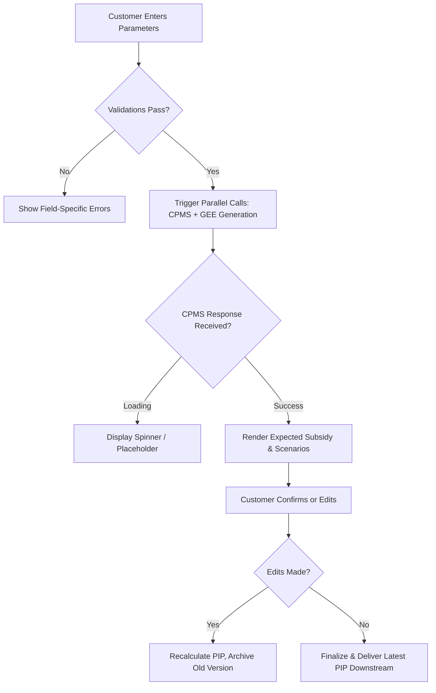

# PIP Configuration & Subsidy Calculation

Deep extraction of the state-subsidised savings product configuration flow: parameter entry, CPMS
subsidy calculation, PIP/GEE generation, iterative reconfiguration, and downstream document delivery.
Expands section 4.2 of [[knowledge]].

## 1. Scope

Modernising the customer journey from initial parameter entry through subsidy calculation,
recommendation generation, document finalisation and downstream delivery. The business drivers are
regulatory compliance (contribution caps, child dependency rules), accurate state subsidy
forecasting, parallel processing to cut customer wait times, and strict document versioning for
contract validity. The technical debates in the source — caching, endpoint design, UI modals — are
reflections of those requirements: data accuracy, latency management, and user experience during
iterative configuration.

## 2. Business Context

The organisation offers a regulated savings product eligible for state subsidies ("Förderung").
Customers configure their savings plan (rate, interval, lump sum, children) to receive an optimised
recommendation. The process involves multiple compliance checks, dynamic calculation engines and
document generation.

Historically, sequential processing caused latency; the business is shifting to parallel execution.
Document lifecycle management is critical: multiple configuration iterations may generate multiple
PIP versions, but only the latest holds contractual validity. Downstream systems require precise,
filtered document delivery rather than bulk exports.

## 3. Key Concepts

| Concept | Business Meaning |
|---------|------------------|
| **PIP** | Produktinformationspapier. Core compliance and contract document containing calculation results, scenarios and terms. |
| **GEE** | Geeignetheitserklärung. Regulatory confirmation that the product matches the customer profile. |
| **CPMS / PIP-Service** | Central calculation and subsidy engine. Authoritative source for subsidy amounts, risk scenarios and validation data. |
| **SAO** | Downstream integration target; a policy administration or customer communication system receiving final documents. See the naming collision flagged in section 12. |
| **Sparrate / Einmalzahlung** | Savings rate / lump sum. Core input parameters driving subsidy eligibility and caps. |
| **Übertrag** | Transfer amount. Optional additional contribution requiring explicit customer acknowledgment. |

## 4. Business Process

1. **Trigger:** Customer initiates product configuration, via event or UI navigation.
2. **Data entry and validation:** Customer inputs savings parameters, payment interval, lump sum,
   transfer amount and child details. The system applies validation rules in real time.
3. **Parallel calculation and generation:** Backend triggers CPMS/PIP-Service for subsidy calculation
   and scenarios; simultaneously generates the GEE.
4. **UI presentation:** Displays expected total subsidy with a loading state until the response
   arrives, then the recommendation banner and configuration summary.
5. **Iterative configuration:** Customer may adjust parameters on a config page, triggering PIP
   recalculation. Previous versions are archived for advisory records; only the latest is
   contract-relevant.
6. **Finalisation and delivery:** On confirmation the system packages documents. Only the latest PIP
   is forwarded downstream. The GEE and prior PIPs remain in internal/advisory storage.

## 5. Business Rules

| Rule Category | Description | Source/Context |
|---------------|-------------|----------------|
| **Contribution cap** | Annualised savings rate + lump sum must not exceed €6,850. | Regulatory subsidy limit |
| **Payment interval** | Fixed at every 2 months (previously misconfigured). | Product specification |
| **Child dependency period** | If child <18, Kindergeld duration ends on the 18th birthday; if ≥18, on the 25th. User may override. | Subsidy calculation rule |
| **Transfer confirmation** | The Übertrag field requires explicit checkbox confirmation before proceeding. | Compliance/audit trail |
| **Document validity** | Only the most recently generated PIP is valid for contract submission. Older versions are advisory-only. | Contract lifecycle management |
| **Subsidy display** | Expected total subsidy must be shown to the customer before final recommendation acceptance. | Transparency requirement |

## 6. Decision Logic

## 7. Actors & Roles

| Actor | Role / Responsibility |
|-------|------------------------|
| **Customer** | Inputs savings parameters, confirms transfers, reviews recommendations, accepts terms. |
| **Advisor/Representative** | Guides configuration, oversees document generation, manages advisory records (implied, not stated in the source). |
| **CPMS core system** | Authoritative calculation engine for subsidies, scenarios and validation data. |
| **Document generator service** | Renders GEE and PIP documents from CPMS output and customer inputs. |
| **Downstream system (SAO)** | Receives final contract-relevant documents; acts as policy/contract repository. |

## 8. Important Business Objects

| Object | Purpose | Key Attributes | Lifecycle / State |
|--------|---------|----------------|-------------------|
| **Savings configuration** | Captures customer intent and parameters | Sparrate, Einzahlungsintervall, Einmalzahlung, Übertrag, Kinder[] | Draft → Validated → Submitted → Archived/Contracted |
| **Child dependency record** | Determines subsidy eligibility period | Birthdate, KindergeldEndeDate (auto-calculated, editable) | Created during config → Linked to active configuration |
| **PIP document** | Contract and product information record | VersionID, CalculationResults, Scenarios[], Status (Draft/Active/Archived) | Generated per iteration → Latest = Active, others advisory |
| **GEE document** | Suitability/eligibility compliance proof | CustomerProfile, ProductMatch, Timestamp | Generated once per session → Stored with advisory record |
| **Subsidy calculation result** | Business output from CPMS | ExpectedFörderungGesamt, Verschnittszenarien[], ValidationFlags | Requested on config change → Cached for UI and doc generation |

## 9. Inputs / Outputs

| Flow | Input | Output | Business Intent |
|------|-------|--------|-----------------|
| **Configuration entry** | Savings rate, interval, lump sum, transfer amount, child data | Validated parameter set | Ensure regulatory compliance before calculation |
| **CPMS/PIP service call** | Validated parameters | Expected subsidy, scenarios, validation metadata | Provide accurate forecast and risk context |
| **Document generation** | CPMS response + customer inputs | PIP PDF, GEE PDF | Produce legally binding and advisory documents |
| **Downstream delivery** | Latest PIP document | Single PIP file payload | Ensure the contract system receives only the valid version |

## 10. Dependencies

| Dependency | Description | Business Impact |
|-----------------|-------------|-----------------|
| **CPMS calculation engine** | Required for subsidy forecast and scenario generation | Bottleneck if latency is high; requires caching or split retrieval |
| **Document rendering service** | Converts calculation results into formatted PIP/GEE | Slow rendering hurts UX; necessitates loading states |
| **Downstream system (SAO)** | Receives final documents via API | Requires precise filtering (latest PIP only); versioning critical |
| **Frontend state management** | Holds async responses and user edits across steps | Stateless architecture complicates partial data display |

## 11. Regulatory Aspects

- **Contribution cap compliance:** the €6,850 annual limit enforces subsidy eligibility boundaries.
- **Child dependency rules:** age-based Kindergeld duration aligns with state benefit regulations.
- **Suitability documentation (GEE):** mandatory proof that the product matches the customer profile
  before contract execution.
- **Document versioning and audit trail:** only the latest PIP is contract-valid; prior versions must
  be retained for advisory compliance and dispute resolution.
- **Explicit customer acknowledgment:** the checkbox for the transfer amount ensures informed consent
  and audit readiness.

## 12. Assumptions

| Assumption | Confidence | Rationale |
|------------|------------|-----------|
| PIP = Product/Plan Information Paper | High | **Confirmed by the vault**: [[knowledge]] defines PIP as Produktinformationspapier / plan document. |
| GEE = Geeignetheitsprüfung/Erklärung (suitability declaration) | Medium-High | **Confirmed by the vault**: [[mifid-wphg-banking-notes]] defines GEE as Geeignetheitserklärung. |
| SAO is a downstream policy/contract system | Medium | Acronym not defined in the source; behaviour matches integration targets for document handover. |
| €6,850 limit is regulatory (e.g. Riester/Rürup) | Medium | Matches known German subsidised savings caps; explicitly enforced as a business rule. |
| Parallel GEE and PIP execution reduces customer wait time | High | Explicitly discussed as a UX/process optimisation goal. |

> ⚠️ **Naming collision — SAO vs Sau, unresolved.** This source uses `SAO` for the **downstream**
> recipient of the latest PIP. The vault already carries two conflicting readings: [[AV-ev]] defines
> `SAO` as *Sales/Advisory Operations*, an **upstream** system that triggers product configuration,
> while `WBF-E-SAU` (aka `Sau`) is the downstream recipient of finalised document metadata — which is
> what this source describes. The two have not been merged, because they carry independent
> expansions. Confirm with the team which system the transcript meant before relying on either.

## 13. Missing Information

- Exact regulatory framework name (Riester, Rürup, Bausparen subsidy).
- Full API contract/Swagger for CPMS/PIP-Service (noted as pending in the source).
- Downstream system (SAO) technical interface specifications.
- Error handling and fallback behaviour if CPMS times out or returns invalid data.
- Data retention policy for archived PIP versions.
- User override validation rules for child Kindergeld end dates.

## 14. Risks

| Risk | Business Impact | Mitigation Suggestion |
|------|-----------------|------------------------|
| **CPMS latency / timeout** | Degraded customer experience; recommendation delay | Caching, graceful fallback states, timeout handling |
| **Document version confusion** | Contract submitted with an outdated PIP → compliance breach | Enforce strict latest-only delivery; add version stamps in the UI |
| **State management complexity** | Lost user inputs or inconsistent subsidy display across steps | Session-based state persistence; validate on each step transition |
| **Endpoint design fragmentation** | Duplicate CPMS calls if not cached → performance and cost overhead | Backend caching layer; separate UI from document endpoints |
| **UI/UX friction (layer vs modal)** | Customer confusion or abandonment during child data entry | Usability testing; align with the design system |

## 15. Open Questions

- **Regulatory product name and governing framework:** the vault's working assumption is the German
  state-subsidised pension scheme (Riester / sonstige Förderung) — [[knowledge]] sections 9 and 11
  (answered 2026-08-03) — but that note flags it as an unverified assumption, so the exact framework
  is still open.
- **Child Kindergeld end dates — strictly validated or fully editable?** Both defaults (18th and 25th
  birthday) are editable by the customer — [[knowledge]] section 5 (answered 2026-08-03). Whether a
  strict upper bound such as current date + 7 years should also apply is still open.
- **Does the downstream system require metadata alongside the PIP file?** Yes — archive metadata
  linking the document to the specific depot/reference level is updated as its own lifecycle step,
  and the downstream core depot system receives finalised document *metadata*, not just the file —
  [[AV-ev]] sections 4 and 7 (answered 2026-08-03). The exact field list remains open, and this
  answer inherits the SAO/Sau naming caveat above.
- How should the system handle partial CPMS responses (subsidy calculated but scenarios missing)?
- What is the maximum allowed time for document rendering before timeout/cancellation?
- How are advisory records audited when multiple PIP versions exist?

## 16. Suggested Next Investigation Areas

- **Regulatory mapping:** confirm the exact subsidy product framework to validate all business rules
  against official guidelines.
- **CPMS interface specification:** obtain the Swagger/API contract to map input/output fields, error
  codes and latency SLAs.
- **Document lifecycle policy:** define retention periods, archival triggers and audit trail
  requirements for PIP versions.
- **UX research:** validate the child data entry pattern (layer vs modal) with target users.
- **Downstream integration workshop:** clarify SAO expectations — file format, naming convention,
  versioning logic, retry mechanisms — and settle the SAO/Sau naming collision.
- **State management architecture:** evaluate session persistence strategies supporting parallel
  async calls without data loss.

## 17. Big Picture

A regulated financial product configuration and recommendation workflow where business compliance,
accurate subsidy forecasting and customer transparency intersect with technical execution. The
process has evolved from sequential, latency-prone steps to a parallelised, state-aware
architecture. The core business value lies in enforcing regulatory compliance through strict
validation (€6,850 cap, child dependency periods), providing real-time subsidy visibility to build
customer trust, maintaining precise document versioning for contract validity and audit readiness,
and optimising the experience through parallel processing and clear confirmation flows.

## See also

- [[knowledge]] — the AVD summary report this note expands (section 4.2)
- [[recommendation-compliance-orchestration]] — the upstream recommendation and compliance checks
- [[AV-ev]] — the document lifecycle: TIP/GE/Ex-Anton generation, DocFamily archiving, WBF-E-SAU handover
- [[mifid-wphg-banking-notes]] — the generic MiFID II/WpHG obligations behind these rules

---
*Reconstructed from a sprint refinement transcript; implementation details (endpoints, caching,
modals) were translated into business activities, dependencies and constraints. Assumptions are
flagged explicitly above. Not yet validated against official product documentation.*
