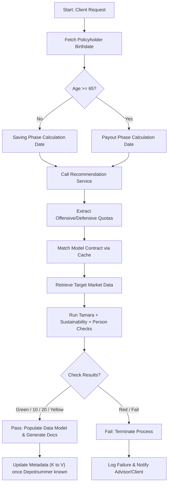

# Recommendation & Compliance Orchestration

Deep extraction of the orchestration layer that turns a client request into a compliant
recommendation: phase determination, model contract matching, the Tamara/sustainability/person
checks, and the document and metadata steps that follow. Expands section 4.1 of [[knowledge]].

## 1. Scope

An automated financial product recommendation and regulatory compliance assessment workflow. The
core capability is orchestrating multiple downstream services to evaluate customer suitability,
target market alignment, sustainability criteria and personal data validation before generating
mandatory advisory documents.

The unresolved problems in the source are age-based calculation logic (saving vs payout phases),
leap years, detecting first-time product knowledge capture without a legacy trigger, and
policyholder identity resolution for minors. The workflow is tightly coupled to regulatory
documentation obligations and requires precise state transitions based on compliance check outcomes.

## 2. Business Context

- **Domain:** retail pension and investment advisory (German market — Frühstartdepot, AVD,
  BaFin/MiFID II alignment).
- **Business problem:** automate the suitability, target market and documentation workflow for new
  or existing clients while ensuring regulatory compliance, accurate age/phase calculations, and
  proper handling of minor policyholders.
- **Operational setting:** frontend advisory interface → orchestration service → backend calculation
  and compliance engines → document generation → archive/client notification.
- **Delivery context:** MVP scope with phased rollout; some complex scenarios such as minor
  transitions are deferred to later releases.

## 3. Key Concepts

| Concept | Business Meaning |
|---------|------------------|
| **Pension Scheme Calculation Date** | Reference date for phase determination and premium calculation, derived from customer age/birthdate. |
| **Saving phase vs payout phase** | Lifecycle stage: <65 years = saving, ≥65 years = payout. Dictates calculation logic and target market parameters. |
| **Model Contract** | Predefined investment portfolio template mapped to offensive/defensive asset quotas. |
| **Target market data** | Regulatory product classification and suitability boundaries used by the compliance engines. |
| **Tamara** | Internal target market / suitability assessment engine. A system — not the generic TaMrA concept. |
| **First-time vs update knowledge capture** | Regulatory trigger determining whether mandatory documentation and signature are required. |
| **Policyholder (Inhaber) vs representative** | Legal entity owning the account. For minors the child is the policyholder regardless of who acts on their behalf. |

## 4. Business Process

1. **Trigger:** client initiates a recommendation/advice session via the frontend.
2. **Phase determination:** the system calculates the Pension Scheme Calculation Date from the
   policyholder birthdate and current age.
3. **Recommendation generation:** the recommendation service returns offensive/defensive module
   quotas.
4. **Contract selection:** quotas are matched against cached Model Contracts to identify the correct
   template.
5. **Target market extraction:** the selected contract provides target market parameters.
6. **Compliance checks:** Tamara (suitability/target market), sustainability check, person/party
   validation. These may run in parallel technically, but the business logic requires the prior step
   to have completed.
7. **Result consolidation:** the system evaluates check outcomes against internal thresholds.
8. **Decision point:** Green (or scores 10/20) continues; Yellow is allowed with operational
   handling; Red/Fail terminates the process immediately.
9. **Data model population and document generation:** the fully populated model feeds the document
   renderer; signature requirements are applied based on knowledge capture status.
10. **Metadata update:** once the Depotnummer is known, metadata levels are updated (K → V) via a
    shared endpoint.

## 5. Business Rules

| Rule Category | Business Rule | Confidence |
|---------------|---------------|------------|
| Age/phase logic | Customer age determines saving vs payout phase at a threshold of 65 years. | High |
| Date handling | Leap year birthdays must resolve to Feb 28 or Mar 1; never Feb 29 in calculations. | High |
| Contract mapping | Offensive/defensive quota ratios uniquely identify one Model Contract out of 21 options. | High |
| Compliance thresholds | Only Green (or internal scores 10/20) and Yellow pass; all other outcomes block the process. | Medium |
| Knowledge capture detection | If the market knowledge list is empty or returns 404, assume first-time capture → triggers signature requirement. | Low (fallback logic) |
| Minor policyholder rule | Birthdate and legal status belong to the child (policyholder), not the acting representative. | High |
| Document signature trigger | Signature required if Basis-Info is issued AND/OR market knowledge is a first-time capture. | Medium |

> ⚠️ **Refines an earlier rule.** [[knowledge]] section 5 records that *all* checks must return codes
> 10/20 and that any other result blocks the process. This source adds a third outcome: Yellow also
> passes, with operational handling, and only Red/Fail terminates. Confidence is medium and the
> operational handling path for Yellow is itself an open question below.

## 6. Decision Logic

## 7. Actors

- **Policyholder:** natural person owning the account; can be a minor from age 6.
- **Legal representative:** acts on behalf of minor policyholders; does not inherit birthdate or
  legal status for calculations.
- **Advisory system / frontend user:** initiates the workflow, views results, collects signatures.
- **Orchestration service (business logic layer):** coordinates service calls, enforces sequencing,
  consolidates results.
- **Compliance engines:** Tamara, sustainability checker, person data validator.
- **External/shared systems:** MSR (market knowledge repository), TNV (rights management), AVD/Sarah
  (backend pension processors).

## 8. Important Objects

| Object | Purpose | Owner | Key Attributes | Lifecycle |
|--------|---------|-------|----------------|-----------|
| Policyholder | Legal account owner | Customer data management | BP-Cent ID, birthdate, age, status | Created → Active → Transition (minor) |
| Recommendation | Investment proposal | Recommendation service | Offensive/defensive quotas, scheme date | Generated → Validated → Archived |
| Model Contract | Portfolio template | Product catalog | Contract ID, asset ratios, target market | Cached → Mapped → Used |
| Check result | Compliance outcome | Tamara / sustainability / person services | Status (Green/Yellow/Red), score | Evaluated → Passed/Blocked |
| Data model | Unified state container | Orchestration service | Filled fields, document flags, signatures | Populated → Rendered → Submitted |

## 9. Inputs / Outputs

- **Inputs:** policyholder birthdate, age, quota ratios, market knowledge status (MSR), depot context.
- **Outputs:** completed data model, pass/fail decision, generated advisory documents, metadata
  updates, client notifications.
- **Data flow intent:** source (customer/context) → transformation (phase/quota logic) → destination
  (checks/data model) → validation (thresholds) → output (docs/state).

## 10. Dependencies

| Dependency | Description | Business Impact |
|-----------------|-------------|-----------------|
| Data acquisition | Policyholder birthdate must be resolved from person data, not from context or the calculator. | Critical for phase calculation and compliance accuracy. |
| System integration | Tamara, sustainability and person checks depend on target market data from the Model Contract. | Sequential dependency; parallel execution only possible after contract selection. |
| External API | MSR market knowledge list availability dictates first-time detection fallback. | Fallback logic introduces regulatory risk if data is stale or deleted. |
| Rights management | TNV read/write permissions control frontend actions for the online channel. | Access control must align with policyholder vs representative roles. |

## 11. Regulatory Aspects

- **MiFID II / BaFin alignment:** target market assessment, suitability checks and mandatory
  documentation for first-time product knowledge capture are strongly implied.
- **Documentation obligation:** signature required when Basis-Info is issued or when market knowledge
  is newly captured or updated.
- **Audit trail:** metadata level updates (K → V) and check result consolidation ensure traceability
  for compliance reviews.
- **Minor protection:** special handling for policyholders from age 6; automatic backend transition
  to AVD without manual advisor intervention.

## 12. Assumptions

| Assumption | Basis | Confidence |
|------------|-------|------------|
| Green/10/20 refers to internal compliance scoring thresholds. | The source mentions a table with values 10 and 20 passing. | Medium |
| Leap year fallback defaults to Feb 28. | Explicitly stated in the discussion. | High |
| MVP excludes full minor transition logic; handled by the Sarah system later. | Discussion notes auto-notification, no manual process needed. | Medium |
| OTC advisors are a separate team with minimal integration scope. | The source confirms independent build and testing coordination. | High |

## 13. Missing Information

- Exact regulatory references (specific BaFin circulars or MiFID II articles) tied to check
  thresholds.
- Precise MVP boundaries for Frühstartdepot minors (age cutoff, contract type).
- TNV rights configuration process and mapping table for online vs branch channels.
- MSR API contract details for market knowledge retrieval and deletion handling.
- Operational workflow for Yellow results (manual review? escalation path?).

## 14. Risks

| Risk | Impact | Mitigation Suggestion |
|------|--------|-----------------------|
| Fallback logic for first-time knowledge capture is flawed | Regulatory non-compliance if a customer deletes and re-adds knowledge | Use an explicit audit flag or timestamp-based detection instead of a list-emptiness check |
| Complex orchestration increases failure points | Process termination, poor UX, advisor friction | Retry mechanisms, clear error states, partial result caching |
| Leap year / age calculation bugs | Incorrect phase determination → suitability mismatch | Unit test boundary cases; add a date validation layer before service calls |
| Parallel vs sequential dependency misalignment | Data inconsistency or wasted API calls | Enforce business sequencing in the orchestration layer; document technical parallelisation limits |

## 15. Open Questions

- **MVP scope for minors starting Frühstartdepot at age 6 — is the contract type fixed or dynamic?**
  Entry from age 6 is confirmed — [[knowledge]] section 11 and the AVD glossary entry (answered
  2026-08-03). The contract type and the transition mechanism remain open: [[knowledge]] open
  question 1 asks the same thing (how an early retirement account converts to standard AVD at 18/25,
  automatically or manually) and the vault does not answer it.
- How are Yellow compliance results handled operationally — manual override, escalation queue?
- Who owns TNV rights configuration, and how is it synchronised with online channel permissions?
- What is the exact OTC advisor team contact for testing coordination? ([[knowledge]] open question 2
  separately asks what the OTC advisors' business scope is, also unanswered.)
- Should first-time knowledge detection be replaced with a timestamp or audit-log based approach?
  [[knowledge]] section 12 records the same fragility as a risk — deleted records may trigger false
  positives — but proposes no replacement.

## 16. Suggested Next Investigation Areas

- **Regulatory mapping:** align check thresholds (Green/Yellow/Red) with explicit MiFID II/BaFin
  requirements.
- **Data validation layer:** design a robust birthdate and age calculation module with leap year and
  phase boundary tests.
- **Knowledge capture logic:** replace the list-emptiness fallback with audit-trail or
  document-signature timestamp detection.
- **Minor policyholder lifecycle:** clarify contract transition rules, notification triggers and AVD
  integration points.
- **Orchestration contract:** define explicit API contracts, error handling and retry policies for
  the recommendation-to-checks flow.

## 17. Big Picture

A centralised compliance and recommendation orchestration layer bridging frontend advisory tools with
backend pension calculation, target market assessment and document generation. It enforces regulatory
suitability rules while automating complex lifecycle calculations (age phases, leap years, minor
policyholders). The architecture prioritises data consistency, auditability and sequential dependency
management over pure technical parallelisation. Success depends on resolving the ambiguous fallback
logic, clarifying MVP boundaries for minors, and aligning internal scoring thresholds with explicit
regulatory obligations. This workflow is the control plane ensuring every client recommendation meets
legal standards before documentation and contract execution proceed.

## See also

- [[knowledge]] — the AVD summary report this note expands (section 4.1)
- [[pip-configuration-subsidy-calculation]] — the downstream PIP configuration and subsidy flow
- [[product-group-plausibility-quiz]] — the product knowledge quiz feeding the signature trigger
- [[mifid-wphg-banking-notes]] — target market (TaMrA), GEE and the generic MiFID II obligations

---
*Reconstructed from a development discussion transcript. Assumptions and confidence levels are
recorded above as the source stated them; not yet validated against official documentation.*
