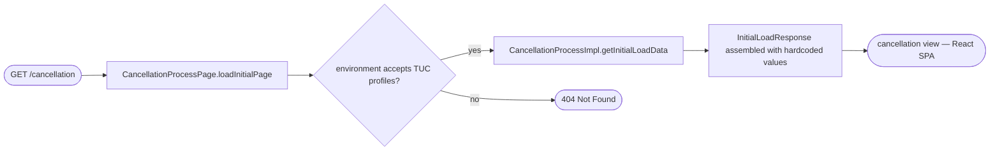
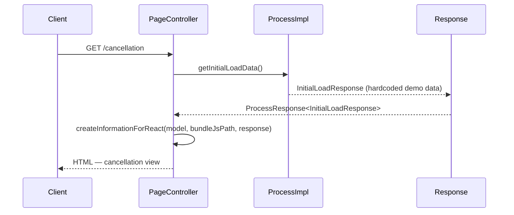

# Chain — CancellationProcessPage · GET /cancellation

<!-- scaffold — phase 1 -->

- **Action point** — `CancellationProcessPage` (ucc-cancellation)
- **Kind** — page-controller
- **Source** — `ucc-cancellation/src/main/java/coba/wtp/wpfe/ucc/cancellation/pages/CancellationProcessPage.java`
- **Handler** — `loadInitialPage(Model)` — `.../CancellationProcessPage.java:58`
- **Trigger** — `GET /cancellation`
- **Preconditions** — environment must accept TUC profiles (`cloud-tuc01`, `cloud-tuc02`, or `local-tuc`); otherwise a 404 is returned immediately. No explicit authentication check in the handler itself — session context is expected to be established by the Spring Security middleware before the page renders.
- **First hop** — `CancellationProcess.getInitialLoadData()` (no arguments)

<!-- analysis — phase 2 -->

## Story

As a **customer in the cancellation flow**, I want to load the initial state of the cancellation page so that the React SPA can render the correct account details and document URLs.

- **Given** an authenticated session with a natural person context, on a TUC environment (`cloud-tuc01`, `cloud-tuc02`, or `local-tuc`)
- **When** `GET /cancellation` is called (or `POST /cancellation` with form parameters for the parameterised variant)
- **Then** the page controller delegates to the cancellation process, which assembles an `InitialLoadResponse` containing account identifiers and document URLs
- **Unless** the environment does not accept TUC profiles — a 404 is returned immediately; or the user lacks the `WPFE_AM_CANCELLATION_PROCESS_READ` permission — access denied

Written from the code, never from what the flow is assumed to look like. The actor here is whoever holds the session context that the Spring Security middleware has established before the page renders.

## Chain

```text
Branch 1 · primary
  CancellationProcessPage.loadInitialPage(Model)
  → CancellationProcessImpl.getInitialLoadData()
  ⇒ [none]  pure computation — hardcoded demo data assembled into InitialLoadResponse
```

- **Terminals reached** — `none` (pure computation, no outbound calls)

## Diagrams

### Process flow — primary



### Sequence — primary



## Journey

When **the browser navigates to `/cancellation`**, the request enters at step 1 to handle the page load for the cancellation flow. Once that completes, the flow moves to step 2 because the process method is called to assemble the initial data needed by the React SPA.

1. **CancellationProcessPage.loadInitialPage(Model)** (wpfe-am / ucc-cancellation)

   **Source.** `ucc-cancellation/src/main/java/coba/wtp/wpfe/ucc/cancellation/pages/CancellationProcessPage.java:58`

   **Role.** Entry point for the cancellation page. Checks that the environment accepts TUC profiles, then delegates to the cancellation process to assemble initial load data. Handles business exceptions by rendering an error view and access denied exceptions by returning a dedicated access-denied view.

   **Preconditions.** Environment must accept one of `cloud-tuc01`, `cloud-tuc02` or `local-tuc`; otherwise a 404 is thrown immediately, before any process method is called. Session context carrying the authenticated natural person is expected to be established by Spring Security middleware.

   **On failure.** Business exceptions are caught and logged with their message IDs; the error view (`errorcancellingpage`) is returned instead of the cancellation page. Access denied exceptions return `accessdeniedpage`. Technical exceptions are re-thrown as 500s.

   **Effect.** Renders either the `cancellation` view (with React bundle and initial data), an error view, or an access-denied view.

2. **CancellationProcessImpl.getInitialLoadData()** (wpfe-am / ucc-cancellation)

   **Source.** `ucc-cancellation/src/main/java/coba/wtp/wpfe/ucc/cancellation/process/read/impl/CancellationProcessImpl.java:40`

   **Role.** Assembles the initial load response for demo mode. Returns hardcoded values for all account identifiers (`vvFlex`, technical securities account number, display name, customer number, and account condition model label) so that the cancellation page can render without any external data source.

   **Preconditions.** The caller must hold the `WPFE_AM_CANCELLATION_PROCESS_READ` permission — enforced by `@PreAuthorize("protect('WPFE_AM_CANCELLATION_PROCESS_READ')")` on this method. No arguments are passed; all values are hardcoded.

   **Effect.** Returns an `InitialLoadResponse` with every field set to a fixed demo value (`"false"`, `"500400564100"`, etc.). The response is wrapped in a `ProcessResponse<InitialLoadResponse>` and returned to the page controller.

   **Downstream.** The assembled `InitialLoadResponse` flows back through the process method, into the page controller's catch block (where it succeeds), and then into `createInformationForReact`, which attaches the data to the model so that the React SPA can read it from the DOM. This is pure computation — no external API calls, no database queries.

   **Steps.**

   - **2.1 Create InitialLoadResponse** · `CancellationProcessImpl.java:40`

     **Role.** Instantiates a new `InitialLoadResponse` object and sets every field to a hardcoded demo value — the technical securities account number, display name, customer number, and account condition model label are all fixed strings.

   - **2.2 Wrap in ProcessResponse** · `CancellationProcessImpl.java:41`

     **Role.** Wraps the populated response object inside a `ProcessResponse<InitialLoadResponse>` so that it can be returned through the process interface contract, which carries both data and metadata (success flag, messages). The success flag is implicitly true because no error path exists in this method.

## Data reached

- **none — pure computation via hardcoded values**
  - Business problem solved — As the **cancellation page**, I need account identifiers and document URLs to be able to render the cancellation flow's initial state. Therefore we assemble an `InitialLoadResponse` with fixed demo values directly in memory, so we can serve the React SPA without any external data source.

## Acceptance Criteria

1. **TUC environment returns 200** — Given a request on a TUC environment (`cloud-tuc01`, `cloud-tuc02`, or `local-tuc`), when `GET /cancellation` is called, then the response status is 200 and the body contains the cancellation view HTML.
   - Evidence: `CancellationProcessPage.java:58`
   - How to: read line 61 (`if (!environment.acceptsProfiles(TUC_PROFILES))`) and confirm that a non-TUC environment throws `ResponseStatusException(HttpStatus.NOT_FOUND)`. To reproduce: call the endpoint on any non-TUC profile and assert on status 404.

2. **Non-TUC environment returns 404** — Given a request on a non-TUC environment, when `GET /cancellation` is called, then the response status is 404 (Not Found).
   - Evidence: `CancellationProcessPage.java:61`
   - How to: read line 61 and confirm that `ResponseStatusException(HttpStatus.NOT_FOUND)` is thrown. To reproduce: call the endpoint on a non-TUC profile and assert on status 404.

3. **Hardcoded demo data is returned** — Given an authenticated session, when `GET /cancellation` is called, then the response body contains hardcoded values for all account identifiers (`"500400564100"`, etc.) and document URLs from application configuration.
   - Evidence: `CancellationProcessImpl.java:40-42`
   - How to: read lines 40–42 of the process method and confirm that every field is set to a literal string. To reproduce: call the endpoint with an authenticated session on TUC and inspect the response body for the hardcoded values.

4. **Access denied without permission** — Given a user without `WPFE_AM_CANCELLATION_PROCESS_READ`, when `GET /cancellation` is called, then access is denied (403) before any process method executes.
   - Evidence: `CancellationProcessImpl.java:39`
   - How to: read line 39 and confirm the `@PreAuthorize("protect('WPFE_AM_CANCELLATION_PROCESS_READ')")` annotation. To reproduce: call the endpoint with a session that lacks this permission and assert on status 403.

## Business Takeaways

- **What this does for the business** — loads the initial state of the cancellation page, providing account identifiers and document URLs so that the React SPA can render the flow's starting screen. In demo mode all values are hardcoded; in production (parameterised variant) they come from form data plus application configuration.
- **Depends on** — environment profiles (TUC only), Spring Security for authentication/authorization, application configuration for document URLs
- **Ingredients** — session context (natural person), TUC profile acceptance
- **Preparation** — check TUC profile, verify permission, assemble hardcoded response
- **Dish** — HTML rendering of the cancellation view with React bundle and initial data

---

## Cross-cutting rules

- One chain file per trigger — endpoint, schedule, listener, runner or mount — never per class.
- No tables, anywhere. Lists only, at most one sub-bullet level.
- No Open questions section: `UNKNOWN` is written inline, where the missing fact belongs, with a
  one-line reason. `## Business Takeaways` is the terminal section.
- Every claim about behaviour cites a `file:line`. A claim with no path is not checkable.
- Every acronym is expanded on first use, or marked `UNKNOWN`. `MnC` is **Map and Call**.
- Every class is attributed to its repository, and a shared class to its shared module too:
  `PersonApiClient (wpfe-shared / person)`.
- No host, no `BASE_URL` — path templates and parameters only.
- A discarded response field is named, not summarised away.
- Cross-links use a relative path plus a target-file anchor, never a bare same-document anchor.
  **A heading containing an em dash produces a double hyphen in its anchor** — `## Step 1 — Prepare`
  becomes `#step-1--prepare`, and getting it wrong produces a link that silently goes nowhere.

## Write plan

| Pass | Written by | Sections |
|---|---|---|
| scaffold | step 02 | the header block above the analysis marker |
| 1 | the tracer | Story, Chain, Diagrams |
| 2 | the tracer | Journey |
| 3 | the tracer | Data reached, Acceptance Criteria, Business Takeaways |

Each pass stops on a section boundary — never mid-sentence, mid-list, or inside a fenced Mermaid
block. Passes 2 and 3 append; they never re-emit what an earlier pass wrote, and never touch the
scaffold. A chain whose Acceptance Criteria alone would break the 300-line budget splits them into
`chain-traces/<slug>-criteria.md`, registered in `manifest.json` before the first write.

