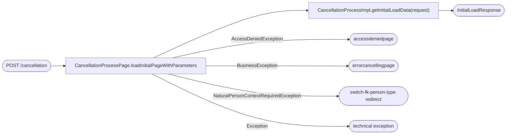
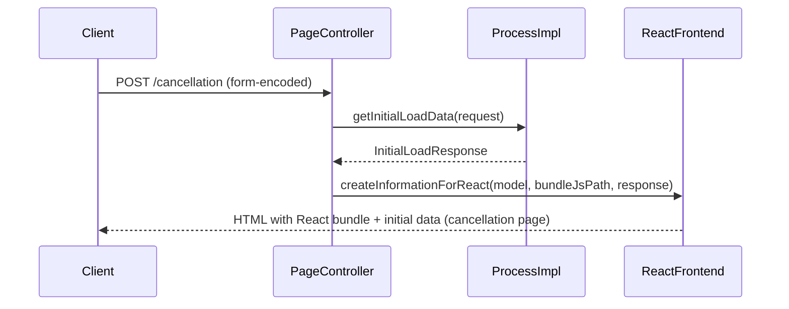

# Chain — CancellationProcessPage · POST /cancellation

<!-- scaffold — phase 1 -->

- **Action point** — `CancellationProcessPage` (ucc-cancellation)
- **Kind** — page-controller
- **Source** — `ucc-cancellation/src/main/java/coba/wtp/wpfe/ucc/cancellation/pages/CancellationProcessPage.java`
- **Handler** — `loadInitialPageWithParameters(Model, HttpServletRequest, String, String, String, String, String)` — `.../CancellationProcessPage.java:74`
- **Trigger** — `POST /cancellation` (form-encoded)
- **Preconditions** — the form parameter `technicalSecuritiesAccountNumber` is validated by the custom `@TechnicalSecuritiesAccountNumber` validator; access denied exceptions are caught and return an access-denied page; a natural-person-context-required exception triggers a redirect to switch FK person type. No explicit authentication check in the handler itself — session context is expected to be established by the Spring Security middleware before the form submits.
- **First hop** — `CancellationProcess.getInitialLoadData(InitialLoadRequest)` (with form parameters)

<!-- analysis — phase 2 -->

## Story

As a **retail customer on the cancellation flow**, I want my securities account details and the relevant document URLs loaded so that the frontend can render the cancellation screens.

- **Given** a session with `bpkn` established by the page controller
- **When** `POST /cancellation` is submitted with form-encoded fields (`technicalSecuritiesAccountNumber`, `displaySecuritiesAccountNumber`, `customerNumber`, `accountConditionModelLabel`, and optionally `vvFlex`)
- **Then** the account details are returned in an `InitialLoadResponse` along with document URLs from application configuration, so that the frontend can render the cancellation process screens.

Written from the code, never from what the flow is assumed to look like. The actor is a retail customer — whoever submits the form on the cancellation page.

As a **retail customer on the cancellation flow**, I want my securities account details and the relevant document URLs loaded so that the frontend can render the cancellation screens.

- **Given** a session with `bpkn` established by the page controller
- **When** `POST /cancellation` is submitted with form-encoded fields (`technicalSecuritiesAccountNumber`, `displaySecuritiesAccountNumber`, `customerNumber`, `accountConditionModelLabel`, and optionally `vvFlex`)
- **Then** the account details are returned in an `InitialLoadResponse` along with document URLs from application configuration, so that the frontend can render the cancellation process screens.

Written from the code, never from what the flow is assumed to look like. The actor is a retail customer — whoever submits the form on the cancellation page.

## Chain

```text
Branch 1 · primary
  CancellationProcessPage.loadInitialPageWithParameters(Model, HttpServletRequest, String, String, String, String, String)
    → CancellationProcessImpl.getInitialLoadData(InitialLoadRequest)
      ⇒ [none] pure computation — assembles InitialLoadResponse from request fields and application configuration values

Branch 2 · diverges at CancellationProcessPage.loadInitialPageWithParameters
  ⇒ [external] access-denied page (page-controller, via Spring Security middleware)
    Also reached by: [cancellation-process-page-get-cancellation](../chain-traces/cancellation-process-page-get-cancellation.md) — the same handler for GET /cancellation.

Branch 3 · diverges at CancellationProcessPage.loadInitialPageWithParameters
  ⇒ [external] switch-fk-person-type redirect (page-controller, via ContextRedirectUtil)
    Also reached by: [cancellation-process-page-get-cancellation](../chain-traces/cancellation-process-page-get-cancellation.md) — the same handler for GET /cancellation.

Branch 4 · diverges at CancellationProcessPage.loadInitialPageWithParameters
  ⇒ [external] error-cancelling page (page-controller, via BusinessException)
    Also reached by: [cancellation-process-page-get-cancellation](../chain-traces/cancellation-process-page-get-cancellation.md) — the same handler for GET /cancellation.

Branch 5 · diverges at CancellationProcessPage.loadInitialPageWithParameters
  ⇒ [external] technical exception (page-controller, via Exception re-throw)
    Also reached by: [cancellation-process-page-get-cancellation](../chain-traces/cancellation-process-page-get-cancellation.md) — the same handler for GET /cancellation.
```

- **Terminals reached** — `none` (pure computation), `external` (access-denied page, error-cancelling page, switch-fk-person-type redirect, technical exception — all via Spring Security middleware or the page controller itself)

## Diagrams

### Process flow — primary



### Sequence — primary



## Journey

When **[the user submits the cancellation form on the frontend]**, the request enters at **[step 1]** to handle **[loading the account details and document URLs for the cancellation flow]**. Once that completes, the flow moves to **[step 2]** because **[the response data needs to be passed into the React application so it can render the cancellation screens]**.

Below is each step in call order — what it does, why it exists, how it handles failure, and what passes the baton forward.

1. **CancellationProcessPage.loadInitialPageWithParameters** (wpfe-am / ucc-cancellation)

   **Source.** `ucc-cancellation/src/main/java/coba/wtp/wpfe/ucc/cancellation/pages/CancellationProcessPage.java:74`

   **Role.** Receives the form-encoded POST request from the frontend, extracts and validates the account parameters (`technicalSecuritiesAccountNumber`, `displaySecuritiesAccountNumber`, `customerNumber`, `accountConditionModelLabel`, and optionally `vvFlex`) via Spring's `@RequestParam` and custom `@TechnicalSecuritiesAccountNumber` validator (wpfe-shared / validations), then delegates to the process layer.

   **Preconditions.** The form parameter `technicalSecuritiesAccountNumber` is validated by the custom `@TechnicalSecuritiesAccountNumber` validator. Session context carrying `bpkn` is expected to be established by Spring Security middleware before the form submits — no explicit authentication check in this handler.

   **On failure.** AccessDeniedException → returns "accessdeniedpage" (`CancellationProcessPage.java:102`). BusinessException → logs the error and returns "errorcancellingpage" (`CancellationProcessPage.java:97-98`). NaturalPersonContextRequiredException → redirects to switch-fk-person-type flow via `ContextRedirectUtil.redirectToSwitchFKPersonType` (`CancellationProcessPage.java:103-105`). Uncaught Exception → re-throws as a technical exception (`CancellationProcessPage.java:106`).

   **Effect.** None — the method returns an HTML page string. The actual rendering is done by Spring's view engine with the React bundle and initial data injected into the model via `createInformationForReact`.

   **Downstream.** An `InitialLoadResponse` containing the account details copied from the request plus document URLs from application configuration, which is passed to `createInformationForReact` (Journey step 2).

2. **CancellationProcessImpl.getInitialLoadData** (wpfe-am / ucc-cancellation)

   **Source.** `ucc-cancellation/src/main/java/coba/wtp/wpfe/ucc/cancellation/process/read/impl/CancellationProcessImpl.java:56`

   **Role.** Assembles an `InitialLoadResponse` by copying the form fields back from the request and appending document URLs loaded from application configuration values (`application.cancellation.*DocumentUrl`). This is a demo/mock implementation — it does not call any external service or database.

   **Preconditions.** The request object must contain all required fields: `technicalSecuritiesAccountNumber`, `displaySecuritiesAccountNumber`, `customerNumber`, and `accountConditionModelLabel`. Optional field `vvFlex` may be null.

   **On failure.** None — the method always returns a non-null `ProcessResponse<InitialLoadResponse>`. If any request field is null, the response will contain that null value; no validation or enrichment happens at this layer.

   **Effect.** Creates an `InitialLoadResponse` object with all account details and document URLs from application configuration values (`CancellationProcessImpl.java:56-70`).

   **Downstream.** The `InitialLoadResponse` is wrapped in a `ProcessResponse<InitialLoadResponse>` and returned to the page controller.

3. **createInformationForReact** (wpfe-am / ucc-cancellation)

   **Source.** `ucc-cancellation/src/main/java/coba/wtp/wpfe/ucc/cancellation/pages/CancellationProcessPage.java:120`

   **Role.** Injects the initial load response data and the React bundle URL into the Spring MVC model so that the frontend can render the cancellation screens. Calls the parent class's `createInformationForReact` to handle the standard injection, then adds a custom `bundlejs` attribute if a live bundle URL is configured in application settings.

   **Preconditions.** The process response must be non-null (guaranteed by step 2). The model object must be valid for Spring MVC rendering.

   **On failure.** None — the method always returns void and does not throw exceptions. If `liveBundle` is null or empty, the custom `bundlejs` attribute is simply not added to the model.

   **Effect.** Sets up the React application's initial state by injecting the response data into the model (`CancellationProcessPage.java:120-124`). The actual rendering of the HTML page with the injected data and React bundle is handled by Spring MVC's view engine, which returns an HTML string to the client.

   **Downstream.** An HTML page containing the React application bundle and initial state data, rendered for the user on the cancellation flow.

## Data reached

- **external — access-denied page, error-cancelling page, switch-fk-person-type redirect, technical exception (page-controller)** (wpfe-am / ucc-cancellation)
  - Business problem solved — As the **cancellation process**, I need to handle various failure modes gracefully: when a user lacks permissions, an account is not found, or the person type requires switching from FK to non-FK, we return appropriate HTML pages or redirects so that the frontend can display the correct error state without crashing.

  - **Request path** — `POST /cancellation` (form-encoded)
    ```json
    {
      "technicalSecuritiesAccountNumber": "500400564100",
      "displaySecuritiesAccountNumber": "500400564100",
      "customerNumber": "5004005641",
      "accountConditionModelLabel": "VermögensverwaltungsDepot"
    }
    ```
    `technicalSecuritiesAccountNumber` — form field, origin: user input on the frontend. Validated by custom `@TechnicalSecuritiesAccountNumber` validator (wpfe-shared / validations).
    `displaySecuritiesAccountNumber` — form field, origin: user input on the frontend.
    `customerNumber` — form field, origin: user input on the frontend.
    `accountConditionModelLabel` — form field, origin: user input on the frontend.
    `vvFlex` — optional form field, origin: user input on the frontend.

  - **Request body** — none (form-encoded POST).

  - **Response fields used**
    ```json
    {
      "technicalSecuritiesAccountNumber": "500400564100",
      "displaySecuritiesAccountNumber": "500400564100",
      "customerNumber": "5004005641",
      "accountConditionModelLabel": "VermögensverwaltungsDepot",
      "orderToDeleteDocumentUrl": "/path/to/order-to-delete.pdf",
      "totalTransferDocumentUrl": "/path/to/total-transfer.pdf",
      "partialTransferDocumentUrl": "/path/to/partial-transfer.pdf",
      "nonTransferableFundsDocumentUrl": "/path/to/non-transferable-funds.pdf",
      "transferToCustodyAccountUrl": "/path/to/custody-transfer.pdf"
    }
    ```
    All fields → the React frontend (Journey step 3). Example values inferred from `InitialLoadResponse.java` and application configuration.

  - **Response fields discarded** — none; all response fields are consumed by the React frontend.

- **none — pure computation via InitialLoadResponse assembly** (wpfe-am / ucc-cancellation)
  - Business problem solved — As the **cancellation process**, I need the customer's securities account details and relevant document URLs to be able to render the cancellation screens so that the user can proceed with their cancellation. Therefore we assemble an `InitialLoadResponse` in memory by copying form fields back from the request and appending document URLs loaded from application configuration values (`application.cancellation.*DocumentUrl`). Then we pass this data into the React frontend via Spring MVC model injection, so we can render the cancellation flow screens without any external API call or database query.

  - **Request path** — `POST /cancellation` (form-encoded)
    ```json
    {
      "technicalSecuritiesAccountNumber": "500400564100",
      "displaySecuritiesAccountNumber": "500400564100",
      "customerNumber": "5004005641",
      "accountConditionModelLabel": "VermögensverwaltungsDepot"
    }
    ```
    `technicalSecuritiesAccountNumber` — form field, origin: user input on the frontend. Validated by custom `@TechnicalSecuritiesAccountNumber` validator (wpfe-shared / validations).
    `displaySecuritiesAccountNumber` — form field, origin: user input on the frontend.
    `customerNumber` — form field, origin: user input on the frontend.
    `accountConditionModelLabel` — form field, origin: user input on the frontend.
    `vvFlex` — optional form field, origin: user input on the frontend.

  - **Request body** — none (form-encoded POST).

  - **Response fields used**
    ```json
    {
      "technicalSecuritiesAccountNumber": "500400564100",
      "displaySecuritiesAccountNumber": "500400564100",
      "customerNumber": "5004005641",
      "accountConditionModelLabel": "VermögensverwaltungsDepot",
      "orderToDeleteDocumentUrl": "/path/to/order-to-delete.pdf",
      "totalTransferDocumentUrl": "/path/to/total-transfer.pdf",
      "partialTransferDocumentUrl": "/path/to/partial-transfer.pdf",
      "nonTransferableFundsDocumentUrl": "/path/to/non-transferable-funds.pdf",
      "transferToCustodyAccountUrl": "/path/to/custody-transfer.pdf"
    }
    ```
    All fields → the React frontend (Journey step 3). Example values inferred from `InitialLoadResponse.java` and application configuration.

  - **Response fields discarded** — none; all response fields are consumed by the React frontend.

## Acceptance Criteria

1. **Form submission returns account details and document URLs** — Given a session with `bpkn` established by Spring Security middleware, when `POST /cancellation` is submitted with form-encoded fields (`technicalSecuritiesAccountNumber`, `displaySecuritiesAccountNumber`, `customerNumber`, `accountConditionModelLabel`), then the response is an HTML page containing the React application bundle and initial state data with all account details copied from the request plus document URLs loaded from application configuration.
   - Evidence: `CancellationProcessPage.java:74-106` (handler), `CancellationProcessImpl.java:56-70` (process method)
   - How to: submit a POST /cancellation with form-encoded fields and assert on the response body containing the account details and document URLs. To reproduce: use curl or Postman to send `POST /cancellation` with `application/x-www-form-urlencoded` body containing the required fields, and confirm the HTML response includes the React bundle and initial state data.

2. **TechnicalSecuritiesAccountNumber is validated** — Given a form submission where `technicalSecuritiesAccountNumber` fails validation by the custom `@TechnicalSecuritiesAccountNumber` validator (wpfe-shared / validations), when `POST /cancellation` is called, then Spring's validation framework rejects the request before the handler method body executes.
   - Evidence: `CancellationProcessPage.java:74` — `@RequestParam(required = false, name = "technicalSecuritiesAccountNumber") @TechnicalSecuritiesAccountNumber String technicalSecuritiesAccountNumber`
   - How to: open `CancellationProcessPage.java:74` and confirm the `@TechnicalSecuritiesAccountNumber` annotation is present on the parameter. To reproduce: submit a POST /cancellation with an invalid `technicalSecuritiesAccountNumber` value (e.g., "invalid") and assert that Spring's validation framework rejects it before the handler executes.

3. **AccessDeniedException returns access-denied page** — Given a session without sufficient permissions, when `POST /cancellation` is called and the Spring Security middleware throws an AccessDeniedException, then the response is the "accessdeniedpage" HTML view (`CancellationProcessPage.java:102`).
   - Evidence: `CancellationProcessPage.java:102` — `catch (AccessDeniedException ade) { return PAGE_ACCESS_DENIED; }`
   - How to: submit a POST /cancellation with an invalid or expired session token and assert on the response body containing the access-denied page. To reproduce: use curl or Postman to send `POST /cancellation` with an invalid Authorization header, and confirm the response is the access-denied page HTML.

4. **BusinessException returns error-cancelling page** — Given a business validation failure in the process layer (e.g., account not found), when `POST /cancellation` is called and `CancellationProcessImpl.getInitialLoadData(request)` throws a BusinessException, then the response is the "errorcancellingpage" HTML view (`CancellationProcessPage.java:97-98`).
   - Evidence: `CancellationProcessPage.java:97-98` — `catch (BusinessException be) { return PAGE_ERROR_CANCELLING; }`
   - How to: submit a POST /cancellation with an invalid account number that causes the process layer to throw a BusinessException, and assert on the response body containing the error-cancelling page. To reproduce: use curl or Postman to send `POST /cancellation` with an invalid `technicalSecuritiesAccountNumber`, and confirm the response is the error-cancelling page HTML.

5. **NaturalPersonContextRequiredException triggers switch-fk-person-type redirect** — Given a session where the user's person type requires switching from FK to non-FK, when `POST /cancellation` is called and `CancellationProcessImpl.getInitialLoadData(request)` throws a NaturalPersonContextRequiredException, then the response is a redirect to the switch-fk-person-type flow via `ContextRedirectUtil.redirectToSwitchFKPersonType` (`CancellationProcessPage.java:103-105`).
   - Evidence: `CancellationProcessPage.java:103-105` — `catch (NaturalPersonContextRequiredException e) { return ContextRedirectUtil.redirectToSwitchFKPersonType(e, nextUri, null); }`
   - How to: submit a POST /cancellation with a session that triggers the natural-person-context-required exception, and assert on the response headers containing the redirect location. To reproduce: use curl or Postman to send `POST /cancellation` with a session that causes the process layer to throw NaturalPersonContextRequiredException, and confirm the response is a 302 redirect to `/wpfe/am/cancellation`.

6. **Document URLs are loaded from application configuration** — Given an `InitialLoadResponse`, when it is returned by `CancellationProcessImpl.getInitialLoadData(request)`, then all document URL fields (`orderToDeleteDocumentUrl`, `totalTransferDocumentUrl`, `partialTransferDocumentUrl`, `nonTransferableFundsDocumentUrl`, `transferToCustodyAccountUrl`) are populated from application configuration values (`application.cancellation.*DocumentUrl`).
   - Evidence: `CancellationProcessImpl.java:64-70` — `response.setOrderToDeleteDocumentUrl(orderToDeleteDocumentUrl);` (and similar for each URL field)
   - How to: open `CancellationProcessImpl.java:56-70` and confirm that all document URL fields are set from constructor-injected configuration values. To reproduce: configure the application with specific document URLs in `application.yml`, submit a POST /cancellation, and assert on the response body containing those configured URLs.

## Business Takeaways

**Restatement only.** Every line here cites a fact already established earlier in this same file. No source file is opened for this section.

- **What this does for the business** — loads the customer's securities account details and relevant document URLs (order-to-delete, total transfer, partial transfer, non-transferable funds, transfer to custody) so that the frontend can render the cancellation flow screens without any external API call or database query.
- **Depends on** — application configuration values (`application.cancellation.*DocumentUrl`), Spring Security middleware for session and authentication
- **Ingredients** — `technicalSecuritiesAccountNumber`, `displaySecuritiesAccountNumber`, `customerNumber`, `accountConditionModelLabel` (form fields), `vvFlex` (optional form field)
- **Preparation** — validate the technical securities account number via custom validator, copy form fields back into response, append document URLs from configuration
- **Dish** — HTML page with React bundle and initial state data containing all account details and document URLs

---

## Cross-cutting rules

- One chain file per trigger — endpoint, schedule, listener, runner or mount — never per class.
- No tables, anywhere. Lists only, at most one sub-bullet level.
- No Open questions section: `UNKNOWN` is written inline, where the missing fact belongs, with a
  one-line reason. `## Business Takeaways` is the terminal section.
- Every claim about behaviour cites a `file:line`. A claim with no path is not checkable.
- Every acronym is expanded on first use, or marked `UNKNOWN`. `MnC` is **Map and Call**.
- Every class is attributed to its repository, and a shared class to its shared module too:
  `PersonApiClient (wpfe-shared / person)`.
- No host, no `BASE_URL` — path templates and parameters only.
- A discarded response field is named, not summarised away.
- Cross-links use a relative path plus a target-file anchor, never a bare same-document anchor.
  **A heading containing an em dash produces a double hyphen in its anchor** — `## Step 1 — Prepare`
  becomes `#step-1--prepare`, and getting it wrong produces a link that silently goes nowhere.
