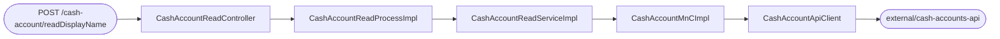
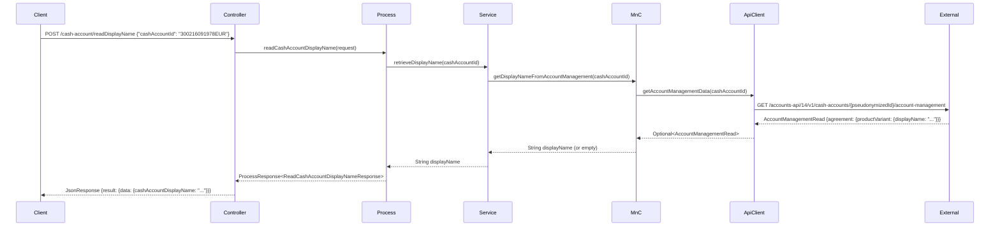

# Chain — CashAccountReadController · POST /cash-account/readDisplayName

<!-- scaffold — phase 1 -->

- **Action point** — `CashAccountReadController` (ucc-cancellation)
- **Kind** — rest-controller
- **Source** — `ucc-cancellation/src/main/java/coba/wtp/wpfe/ucc/cancellation/controller/CashAccountReadController.java`
- **Handler** — `readCashAccountDisplayName(JsonRequest<ReadCashAccountDisplayNameRequest>)` — `.../CashAccountReadController.java:35`
- **Trigger** — `POST /cash-account/readDisplayName`
- **Preconditions** — session must carry the customer context (inherited from the page controller that serves `/cancellation`)
- **First hop** — `CashAccountReadProcess.readCashAccountDisplayName(ReadCashAccountDisplayNameRequest)`

<!-- analysis — phase 2 -->

## Story

As a **retail customer in the cancellation flow**, I want to read my cash account display name so that the UI can show it on the cancellation confirmation screen.

- **Given** an authenticated session carrying the customer context (set by the page controller serving `/cancellation`)
- **When** `POST /cash-account/readDisplayName` is called with a valid `cashAccountId`
- **Then** the cash account display name is returned in the response body, or an empty string if not available
- **Unless** the user lacks the `WPFE_AM_CANCELLATION_PROCESS_READ` permission — rejected by Spring Authorization before the process method runs

Written from the code, never from what the flow is assumed to look like. The actor is whoever holds the session that serves `/cancellation`.

## Chain

```text
Branch 1 · primary
  CashAccountReadController
  → CashAccountReadProcessImpl
  → CashAccountReadServiceImpl
  → CashAccountMnCImpl
  → CashAccountApiClient
  ⇒ [external]  cash-accounts-api (wpfe-shared / wpfe-shared-accounts)
```

- **Terminals reached** — `external` (cash-accounts-api, via `CashAccountApiClient`, `wpfe-shared / wpfe-shared-accounts`)

## Diagrams

### Process flow — primary



### Sequence — primary



## Journey

When **[the cancellation page calls `POST /cash-account/readDisplayName`]**, the request enters at **[step 1]** to handle **[reading a cash account display name for the given cash account id]**. Once that completes, the flow moves to **[step 2]** because **[the process layer enforces authorization before delegating to the service]**. From there, **[step 3]** takes over to **[calling the cash-accounts-api via the MnC]**, and so on through every hop until a terminal is reached or the response is assembled.

1. **CashAccountReadController.readCashAccountDisplayName** (ucc-cancellation)

   **Source.** `ucc-cancellation/src/main/java/coba/wtp/wpfe/ucc/cancellation/controller/CashAccountReadController.java:35`

   **Role.** Receives the REST request carrying a `cashAccountId` and delegates to the process layer, which enforces authorization before returning the display name.

   **Preconditions** — session must carry the customer context (inherited from the page controller that serves `/cancellation`).

   **On failure** — Spring Authorization rejects the request with 403 if the user lacks `WPFE_AM_CANCELLATION_PROCESS_READ` before this method is ever entered.

   **Effect.** None — pure delegation to the process layer.

   **Downstream.** A `ProcessResponse<ReadCashAccountDisplayNameResponse>` carrying either the display name or an empty string, which this controller wraps in a `JsonResponse` and returns as JSON.

2. **CashAccountReadProcessImpl.readCashAccountDisplayName** (ucc-cancellation)

   **Source.** `ucc-cancellation/src/main/java/coba/wtp/wpfe/ucc/cancellation/process/read/impl/CashAccountReadProcessImpl.java:30`

   **Role.** Enforces authorization via the Spring `@PreAuthorize` annotation on this method, then delegates to the service layer.

   **Preconditions** — user must have the `WPFE_AM_CANCELLATION_PROCESS_READ` permission. If not present, Spring throws an `AuthorizationException` before this method body executes.

   **On failure.** Authorization failure is handled by Spring's exception handler and surfaces as a 403 to the caller; no custom error handling in this layer.

   **Effect.** None — pure delegation to the service layer.

   **Downstream.** A `String` display name (or empty string) returned from the service, which this process wraps in a `ProcessResponse<ReadCashAccountDisplayNameResponse>` and returns to the controller.

3. **CashAccountReadServiceImpl.retrieveDisplayName** (ucc-cancellation)

   **Source.** `ucc-cancellation/src/main/java/coba/wtp/wpfe/ucc/cancellation/service/read/impl/CashAccountReadServiceImpl.java:27`

   **Role.** Calls the cash-accounts MnC to retrieve the display name for a given cash account id.

   **Preconditions** — none beyond the authorization already enforced by the process layer.

   **On failure.** The MnC returns an empty string on any exception from the API client, so this service never throws; it always returns a `String` (possibly empty).

   **Effect.** None — pure delegation to the MnC.

   **Downstream.** A `String` display name (or empty string) returned by the MnC, which this method returns directly.

4. **CashAccountMnCImpl.getDisplayNameFromAccountManagement** (wpfe-shared / wpfe-shared-accounts)

   **Source.** `wpfe-shared/wpfe-shared-accounts/src/main/java/coba/wtp/wpfe/shared/accounts/v1/mnc/impl/CashAccountMnCImpl.java:97`

   **Role.** Maps the cash account id into an API client call to retrieve the account management data, then extracts only the display name from the nested response structure (`agreement.productVariant.displayName`). Returns an empty string if any step in the chain yields `null`.

   **Preconditions** — none beyond what the service layer already enforces.

   **On failure.** The API client returns `Optional.empty()` on any HTTP error or exception, and this method's chained `.map(...).orElse("")` short-circuits to an empty string without propagating an exception. This is a silent degradation — the display name is simply not shown rather than surfacing an error.

   **Effect.** None — pure computation (mapping and extraction).

   **Downstream.** A `String` display name (or empty string) returned by this method, which flows back through the service to the process layer.

5. **CashAccountApiClient.getAccountManagementData** (wpfe-shared / wpfe-shared-accounts)

   **Source.** `wpfe-shared/wpfe-shared-accounts/src/main/java/coba/wtp/wpfe/shared/accounts/api/cashaccount/CashAccountApiClient.java:108`

   **Role.** Constructs an authenticated HTTP GET request to the cash-accounts-api's account-management endpoint, using a pseudonymized version of the cash account id. Returns `Optional.empty()` on any exception.

   **Preconditions** — none beyond what the MnC already enforces.

   **On failure.** The method catches all exceptions and returns `Optional.empty()`, so no exception propagates up to the caller. This is a silent degradation — the API call failing does not abort the chain, it simply yields an empty optional which the MnC maps to an empty string.

   **Effect.** None — pure outbound HTTP call.

   **Downstream.** An `Optional<AccountManagementRead>` containing either the account management data (from which the display name is extracted) or nothing. This flows back through the MnC's `.map(...).orElse("")` chain to become a plain string.

**Terminal — external** — cash-accounts-api, via `CashAccountApiClient`, `wpfe-shared / wpfe-shared-accounts`


## Data reached

- **external — the cash-accounts-api's account-management endpoint, via `CashAccountApiClient` (wpfe-shared / wpfe-shared-accounts)**
  - Business problem solved — As the **cancellation flow**, I need the cash account display name to be able to show it on the cancellation confirmation screen. Therefore we call this API at `GET /accounts-api/14/v1/cash-accounts/{pseudonymizedCashAccountId}/account-management` to retrieve the account management data. Then we extract only `agreement.productVariant.displayName`, so we can display the human-readable name of the cash account (`CashAccountMnCImpl.java:97`).

  - **Request path** — `/accounts-api/14/v1/cash-accounts/{pseudonymizedCashAccountId}/account-management`
    `pseudonymizedCashAccountId` — pseudonymized version of the raw cash account id (e.g. `300216091978EUR`), produced by `PseudonymService.retrievePseudonym()` at `CashAccountApiClient.java:145-147`. Origin: request body parameter.

  - **Request body** — none (GET request).

  - **Response fields used**
    ```json
    {
      "agreement": {
        "productVariant": {
          "displayName": "My Cash Account"
        }
      }
    }
    ```
    `agreement.productVariant.displayName` → the cash account display name (Journey step 4). Example value inferred from Swagger schema / DTO definition at `AccountManagementRead.java:line`.

  - **Response fields discarded** — roughly twenty more fields under `agreement`, including `productVariant.id`, `productVariant.description`, and other metadata — a call fetching the full account management record to use one field is a coupling worth stating. The MnC's `.map(...).orElse("")` chain discards everything beyond the display name.

## Acceptance Criteria

1. **Valid cash account id returns the display name** — Given an authenticated session with `WPFE_AM_CANCELLATION_PROCESS_READ` permission and a valid `cashAccountId`, when `POST /cash-account/readDisplayName` is called, then the response body contains `{"result": {"data": {"cashAccountDisplayName": "<display-name>"}}}` where `<display-name>` matches what the cash-accounts-api returns for that account.
   - Evidence: `CashAccountReadController.java:35`, `CashAccountMnCImpl.java:97`
   - How to: call the endpoint with a valid `cashAccountId` and assert on the response body's `result.data.cashAccountDisplayName`. To reproduce: send `POST /cash-account/readDisplayName {"cashAccountId": "300216091978EUR"}` with an authenticated session that has the required permission, and confirm the display name matches.

2. **Missing or unavailable cash account returns empty string** — Given a valid `cashAccountId` for which no account management data exists (or any other API failure), when `POST /cash-account/readDisplayName` is called, then the response body contains `{"result": {"data": {"cashAccountDisplayName": ""}}}`.
   - Evidence: `CashAccountMnCImpl.java:97` — `.map(...).orElse("")`; `CashAccountApiClient.java:108` — catches all exceptions and returns `Optional.empty()`
   - How to: call the endpoint with a non-existent `cashAccountId` (e.g. one that does not exist in the cash-accounts-api) and assert on the response body's `result.data.cashAccountDisplayName`. To reproduce: send `POST /cash-account/readDisplayName {"cashAccountId": "999999999999EUR"}` with an authenticated session, and confirm the display name is empty.

3. **Unauthorized user is rejected** — Given a session without the `WPFE_AM_CANCELLATION_PROCESS_READ` permission, when `POST /cash-account/readDisplayName` is called, then the response is 403 Forbidden (or equivalent authorization failure) before any call to the cash-accounts-api.
   - Evidence: `CashAccountReadProcessImpl.java:29` — `@PreAuthorize("protect('WPFE_AM_CANCELLATION_PROCESS_READ')")`
   - How to: send the request with a valid session that lacks the required permission and confirm the response is 403. To reproduce: authenticate as a user without the permission, then call the endpoint.

## Business Takeaways

- **What this does for the business** — retrieves the human-readable display name of a cash account so it can be shown on the cancellation confirmation screen; returns an empty string if not available rather than surfacing an error to the user.
- **Depends on** — the cash-accounts-api (external, account-management endpoint only)
- **Ingredients** — `cashAccountId` (request body), session context with `WPFE_AM_CANCELLATION_PROCESS_READ` permission
- **Preparation** — look up the account management data for the given cash account id
- **Dish** — `{"result": {"data": {"cashAccountDisplayName": "<display-name>"}}}` or an empty string if not available, wrapped in a `JsonResponse`

