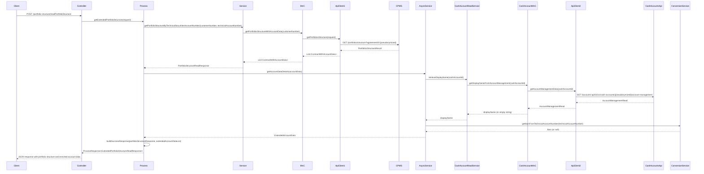

# Chain — PortfolioStructureReadController · POST /portfolio-structure/readPortfolioStructure

<!-- scaffold — phase 1 -->

- **Action point** — `PortfolioStructureReadController` (ucc-cancellation)
- **Kind** — rest-controller
- **Source** — `ucc-cancellation/src/main/java/coba/wtp/wpfe/ucc/cancellation/controller/PortfolioStructureReadController.java`
- **Handler** — `readExtendedPortfolioStructure(JsonRequest<PortfolioStructureReadRequest>)` — `.../PortfolioStructureReadController.java:31`
- **Trigger** — `POST /portfolio-structure/readPortfolioStructure`
- **Preconditions** — session must carry the customer context (inherited from the page controller that serves `/cancellation`)
- **First hop** — `PortfolioStructureReadProcess.getExtendedPortfolioStructure(PortfolioStructureReadRequest)`

<!-- analysis — phase 2 -->

## Story

As a **retail customer in the cancellation flow**, I want my securities portfolio structure displayed so that I can review which contracts and accounts are available before proceeding with a cancellation.

- **Given** an active session carrying `bpkn` (set by the page controller serving `/cancellation`)
- **When** `POST /portfolio-structure/readPortfolioStructure` is called with a `customerNumber` and `technicalSecuritiesAccountNumber`
- **Then** the portfolio structure contracts are retrieved from CPMS, enriched with account data details (IBANs and display names), and returned to the frontend
- **Unless** CPMS returns an error or no matching contract — in which case the response carries a flag indicating the backend call failed

Written from the code, never from what the flow is assumed to look like.

## Chain

```text
Branch 1 · primary
  PortfolioStructureReadController.readExtendedPortfolioStructure
  → PortfolioStructureReadProcessImpl.getExtendedPortfolioStructure
  → PortfolioStructureReadServiceImpl.getPortfolioStructureByTechnicalSecuritiesAccountNumber
  → PortfoliosStructureMnCImpl.getPortfoliosStructureWithAccountData
  → PortfoliosStructureApiClient.getPortfoliosStructure
  ⇒ [external]  CPMS portfolios structure API (wpfe-shared / wpfe-shared-cpms)

Branch 2 · diverges at PortfolioStructureReadProcessImpl.getExtendedPortfolioStructure
  → CashAccountDataDetailsAsyncServiceImpl.getAccountDataDetails
    → CashAccountReadServiceImpl.retrieveDisplayName
      → CashAccountMnCImpl.getDisplayNameFromAccountManagement
        → CashAccountApiClient.getAccountManagementData
          ⇒ [external]  cash-accounts-api (wpfe-shared / wpfe-shared-accounts)
    → AccountNumbersConversionServiceImpl.getIbanFromTechnicalAccountNumber
      ⇒ [none]  pure computation via KUNIG library and IBAN converter
```

- **Terminals reached** — `external` (CPMS portfolios structure API, via `wpfe-shared / wpfe-shared-cpms`; cash-accounts-api, via `wpfe-shared / wpfe-shared-accounts`), `none` (pure computation via KUNIG library)

## Journey

When **the frontend calls** `POST /portfolio-structure/readPortfolioStructure` with a customer number and technical securities account number, the request enters at step 1 to handle reading the portfolio structure. Once that completes, the flow moves to step 2 because the process enriches each contract's accounts with additional data (IBANs and display names) in parallel before assembling the final response.

Below is each step in call order — what it does, why it exists, how it handles failure, and what passes the baton forward.

1. **PortfolioStructureReadController.readExtendedPortfolioStructure** (wpfe-am / ucc-cancellation)

   **Source.** `ucc-cancellation/src/main/java/coba/wtp/wpfe/ucc/cancellation/controller/PortfolioStructureReadController.java:31`

   **Role.** Receives the HTTP request carrying a customer number and technical securities account number, delegates to the process layer, and converts the process response into an HTTP JSON response.

   **Preconditions.** Session must carry `bpkn`, set by the page controller that serves `/cancellation` — inherited from the caller, not enforced here.

   **On failure.** The process returns a `ProcessResponse<ExtendedPortfolioStructureReadResponse>` which may carry either success data or an error; the controller passes it directly to the JSON builder without additional wrapping. If the request body is invalid (fails `@Valid`), Spring rejects it with 400 before this method runs.

   **Downstream.** A `ProcessResponse<ExtendedPortfolioStructureReadResponse>` carrying either enriched portfolio structure data or an error flag, which the controller converts to a JSON response for the frontend.

2. **PortfolioStructureReadProcessImpl.getExtendedPortfolioStructure** (wpfe-am / ucc-cancellation)

   **Source.** `ucc-cancellation/src/main/java/coba/wtp/wpfe/ucc/cancellation/process/read/impl/PortfolioStructureReadProcessImpl.java:34`

   **Role.** Orchestrates the portfolio structure read flow: fetches contracts from CPMS, checks for errors or empty results, then enriches each contract's accounts with account data details (IBANs and display names) in parallel before assembling the final response.

   **Preconditions.** `bpkn` is available in session context; no additional validation beyond what the controller enforces.

   **On failure.** If CPMS returns an error (`cpmsError() == true`) or no matching contracts are found, the process short-circuits and returns a minimal error response without attempting any enrichment. The `@PreAuthorize` decorator on this method gates access to the customer's portfolio data based on the technical account number.

   **Steps.**

   - **2.1 Fetch — all contracts from CPMS** · `PortfolioStructureReadProcessImpl.java:37`

     **Role.** Calls `portfolioStructureReadService.getPortfolioStructureByTechnicalSecuritiesAccountNumber(customerNumber, technicalAccountNumber)` to retrieve the full list of contracts for this customer.

   - **2.2 Filter — by technical securities account number** · `PortfolioStructureReadServiceImpl.java:30`

     **Role.** Filters the CPMS response to only the contract whose `contractNumber` matches the requested `technicalSecuritiesAccountNumber`. If no match is found, the list is empty and the process returns an error.

   - **2.3 Enrich — account data details in parallel** · `PortfolioStructureReadProcessImpl.java:40`

     **Role.** For each account on the matched contract, calls `cashAccountDataDetailsAsyncService.getAccountDataDetails(accountData)` concurrently via `CompletableFuture.allOf(...).join()`. This enriches each account with an IBAN (for settlement and deposit accounts) and a display name (for settlement and OF accounts).

   - **2.4 Assemble — build the enriched response** · `PortfolioStructureReadProcessImpl.java:50`

     **Role.** Constructs the `ExtendedPortfolioStructureReadResponse` by wrapping the contract data with the enriched account list, carrying an error flag that reflects whether CPMS returned an error.

3. **PortfolioStructureReadServiceImpl.getPortfolioStructureByTechnicalSecuritiesAccountNumber** (wpfe-am / ucc-cancellation)

   **Source.** `ucc-cancellation/src/main/java/coba/wtp/wpfe/ucc/cancellation/service/read/impl/PortfolioStructureReadServiceImpl.java:27`

   **Role.** Calls the MnC to retrieve portfolio structure data from CPMS, filters the result by technical securities account number, and returns a response carrying both the filtered contracts list and an error flag.

   **Preconditions.** `customerNumber` and `technicalSecuritiesAccountNumber` are provided as method parameters; no additional validation beyond what the process layer enforces.

   **On failure.** If the MnC call throws any exception, the service catches it, logs an error at ERROR level, and returns a response with an empty contracts list and `cpmsError = true`. This is a soft failure — the caller can distinguish between "no matching contract" (empty list, no error) and "CPMS was unavailable" (empty list, error flag set).

4. **PortfoliosStructureMnCImpl.getPortfoliosStructureWithAccountData** (wpfe-shared / wpfe-shared-cpms)

   **Source.** `wpfe-shared/wpfe-shared-cpms/src/main/java/coba/wtp/wpfe/shared/cpms/mnc/impl/PortfoliosStructureMnCImpl.java:72`

   **Role.** Maps the external CPMS portfolios structure response (containing contracts with account data) to the domain model `ContractWithAccountData`. It also filters out portfolio accounts and options-and-futures accounts, keeping only deposit and settlement accounts in the `accounts` list.

   **Preconditions.** `customerNumbers` is a non-empty array of customer numbers; no additional validation beyond what the service layer enforces.

   **On failure.** If CPMS returns HTTP 404 (not found), the MnC logs a warning and returns an empty list — this is treated as "no contracts" rather than an error. Any other `HttpClientErrorException` or exception propagates up to the caller, which catches it at the service layer.

5. **PortfoliosStructureApiClient.getPortfoliosStructure** (wpfe-shared / wpfe-shared-cpms)

   **Source.** `wpfe-shared/wpfe-shared-cpms/src/main/java/coba/wtp/wpfe/shared/cpms/api/portfoliosStructure/PortfoliosStructureApiClient.java:31`

   **Role.** Constructs the HTTP GET request to CPMS's portfolios structure API, sends it with appropriate headers (channel, requestId), and returns the parsed `PortfoliosStructureResult` wrapped in an Optional.

   **Preconditions.** The `PortfoliosStructureRequest` carries channel, requestId, authentication context, showcase flag, and customer numbers — all set by the MnC. The base URL is configured via dependency injection (`cpmsDirectUrl` or `baseurl`).

   **On failure.** If CPMS returns an HTTP error (e.g., 500), the client logs the response body at ERROR level and rethrows the `HttpClientErrorException`, which propagates up to the MnC. Any other exception is wrapped in a `TechnicalException` by the shared base library.

   **Steps.**

   - **5.1 Build request URL** · `PortfoliosStructureApiClient.java:48`

     **Role.** Constructs the full URL by appending `/portfolios/structure?agreementId={pseudonymizedCustomerNumber}` to the configured base path, with the customer number pseudonymized via `PseudonymService`.

   - **5.2 Send HTTP GET** · `PortfoliosStructureApiClient.java:31`

     **Role.** Calls `restTemplate.exchange()` with the constructed URL, `HttpMethod.GET`, headers containing channel and requestId, and deserializes the response body into a `PortfoliosStructureResult`.

6. **CashAccountDataDetailsAsyncServiceImpl.getAccountDataDetails** (wpfe-am / ucc-cancellation)

   **Source.** `ucc-cancellation/src/main/java/coba/wtp/wpfe/ucc/cancellation/service/async/impl/CashAccountDataDetailsAsyncServiceImpl.java:20`

   **Role.** Enriches a single account with an IBAN (for settlement and deposit accounts) and a display name (for settlement and OF accounts). Returns immediately if the technical account number is null or not numeric; otherwise delegates to the cash account read service for the display name and the conversion service for the IBAN.

   **Preconditions.** `accountData` carries an account number, account type enum, and currency code — all provided by CPMS via the portfolios structure API. The method validates that the account number is a 12-digit numeric string before proceeding.

   **On failure.** If the conversion service or cash account read service throws an exception, it propagates up to the caller; however, `CompletableFuture.allOf(...).join()` in the process layer means one failed enrichment aborts all others. The method also has a 30-second timeout via `completeOnTimeout` — if either async call exceeds that duration, the fallback returns whatever partial data was computed so far.

   **Steps.**

   - **6.1 Validate account number** · `CashAccountDataDetailsAsyncServiceImpl.java:22`

     **Role.** Returns immediately with a minimal `ExtendedAccountData` (null IBAN, empty display name) if the account number is null or does not match the regex `\d{12}.*`. This prevents unnecessary downstream calls for non-numeric identifiers.

   - **6.2 Resolve IBAN** · `CashAccountDataDetailsAsyncServiceImpl.java:27`

     **Role.** For settlement and deposit accounts, extracts the first 12 digits of the technical account number and converts it to an IBAN via `accountNumbersConversionService.getIbanFromTechnicalAccountNumber()`. If the conversion fails (returns null), the IBAN remains null.

   - **6.3 Resolve display name** · `CashAccountDataDetailsAsyncServiceImpl.java:29`

     **Role.** For settlement and OF accounts, calls `cashAccountReadService.retrieveDisplayName(cashAccountId)` to fetch the human-readable account name from the cash-accounts-api. If the service returns an empty string (which it does on failure), the display name remains empty.

7. **CashAccountReadServiceImpl.retrieveDisplayName** (wpfe-am / ucc-cancellation)

   **Source.** `ucc-cancellation/src/main/java/coba/wtp/wpfe/ucc/cancellation/service/read/impl/CashAccountReadServiceImpl.java:18`

   **Role.** Delegates to the cash account MnC, which in turn calls the external cash-accounts-api. The service itself does no additional logic — it is a thin pass-through layer.

   **Preconditions.** `cashAccountId` must be in the format `<technicalAccountNumber><ISO-currency-code>` (e.g., `300216091978EUR`). No validation beyond what the caller enforces.

   **On failure.** The MnC returns an empty string on any exception, so this method never throws — it always returns a non-null String.

8. **CashAccountMnCImpl.getDisplayNameFromAccountManagement** (wpfe-shared / wpfe-shared-accounts)

   **Source.** `wpfe-shared/wpfe-shared-accounts/src/main/java/coba/wtp/wpfe/shared/accounts/v1/mnc/impl/CashAccountMnCImpl.java:97`

   **Role.** Calls the cash-accounts-api to retrieve account management data for a given cash account, then extracts only the display name from the nested response structure (`agreement → productVariant → displayName`). Returns an empty string if any step in the chain fails or returns null.

   **Preconditions.** `cashAccountId` is a 12-digit technical account number plus ISO currency code — no additional validation beyond what the service layer enforces.

   **On failure.** The API client returns an empty Optional on any exception, and the chained `.orElse("")` ensures this method always returns a non-null String. This is intentional — the display name is optional data that should not block the rest of the enrichment flow.

9. **CashAccountApiClient.getAccountManagementData** (wpfe-shared / wpfe-shared-accounts)

   **Source.** `wpfe-shared/wpfe-shared-accounts/src/main/java/coba/wtp/wpfe/shared/accounts/api/cashaccount/CashAccountApiClient.java:108`

   **Role.** Constructs the HTTP GET request to the cash-accounts-api's account management endpoint, sends it with appropriate headers (including Accept-Language), and returns the parsed `AccountManagementRead` wrapped in an Optional.

   **Preconditions.** The base URL is configured via dependency injection (`baseurl`). The `PseudonymService` is injected for pseudonymizing the cash account ID before sending it to the API.

   **On failure.** If the API call throws any exception, the client logs an error and returns an empty Optional — this is a soft failure that allows the caller (the MnC) to return an empty string rather than propagating up. The `Accept-Language` header defaults to German if the application locale is not English.

   **Steps.**

   - **9.1 Build request URL** · `CashAccountApiClient.java:138`

     **Role.** Constructs the full URL by appending `/accounts-api/14/v1/cash-accounts/{pseudonymizedAccountId}/account-management` to the configured base path, with the cash account ID pseudonymized via `PseudonymService`.

   - **9.2 Send HTTP GET** · `CashAccountApiClient.java:108`

     **Role.** Calls `restTemplate.exchange()` with the constructed URL, `HttpMethod.GET`, headers containing channel, requestId, and Accept-Language, and deserializes the response body into an `AccountManagementRead`.

10. **AccountNumbersConversionServiceImpl.getIbanFromTechnicalAccountNumber** (wpfe-shared / wpfe-shared-kunig)

   **Source.** `wpfe-shared/wpfe-shared-kunig/src/main/java/coba/wtp/wpfe/shared/kunig/service/impl/AccountNumbersConversionServiceImpl.java:34`

   **Role.** Converts a technical account number to an IBAN using the KUNIG library and the IBAN converter. Extracts the bank code and account number from the KUNIG service's `KontoverbindungZahlungsverkehr` object, constructs a German BBAN, then converts it to an IBAN.

   **Preconditions.** The technical account number must be a valid 12-digit numeric string — no validation beyond what the caller enforces. The method returns null on any exception or assertion error from KUNIG.

   **On failure.** If KUNIG throws an `AssertionError` (e.g., invalid input format) or any other exception, the service catches it, logs a warning at WARN level, and returns null — this is intentional because the IBAN is optional data that should not block the rest of the enrichment flow.

11. **Build success response** · `PortfolioStructureReadProcessImpl.java:50`

   **Source.** `ucc-cancellation/src/main/java/coba/wtp/wpfe/ucc/cancellation/process/read/impl/PortfolioStructureReadProcessImpl.java:50`

   **Role.** Assembles the final enriched response by wrapping the contract data (contract number, depot model, whitelist, showcase flag, currency code, and VV-Flex status) with the list of extended account data objects that carry IBANs and display names. The error flag reflects whether CPMS returned an error.

   **Effect.** Returns a `ProcessResponse<ExtendedPortfolioStructureReadResponse>` carrying the enriched portfolio structure to the controller, which converts it to JSON for the frontend.


### Process flow — primary

```mermaid
flowchart LR
  A(["POST /portfolio-structure/readPortfolioStructure"]) --> B[PortfolioStructureReadController]
  B --> C[PortfolioStructureReadProcessImpl.getExtendedPortfolioStructure]
  C --> D[PortfolioStructureReadServiceImpl.getPortfolioStructureByTechnicalSecuritiesAccountNumber]
  D --> E[PortfoliosStructureMnCImpl.getPortfoliosStructureWithAccountData]
  E --> F[PortfoliosStructureApiClient.getPortfoliosStructure]
  F --> G([external/CPMS-portfolios-structure])
  C --> H{contracts empty or CPMS error?}
  H -- yes --> I([ErrorResponse])
  H -- no --> J[CashAccountDataDetailsAsyncService.getAccountDataDetails]
  J --> K[CashAccountReadServiceImpl.retrieveDisplayName]
  K --> L[CashAccountMnCImpl.getDisplayNameFromAccountManagement]
  L --> M[CashAccountApiClient.getAccountManagementData]
  M --> N([external/cash-accounts-api])
  J --> O[AccountNumbersConversionServiceImpl.getIbanFromTechnicalAccountNumber]
  O --> P([pure computation])
```



### Sequence — primary




## Data reached

- **external — CPMS portfolios structure API, via `PortfoliosStructureApiClient` (wpfe-shared / wpfe-shared-cpms)**
  - Business problem solved — As the **cancellation flow**, I need to retrieve my securities portfolio contracts so that I can review which accounts and instruments are available before proceeding with a cancellation. Therefore we call this API at `GET /portfolios/structure?agreementId={pseudonymizedCustomerNumber}` to retrieve the full list of contracts for this customer, including their associated account data (account numbers, types, and currencies). Then we filter by technical securities account number and enrich each account with an IBAN and display name, so we can present a complete portfolio overview to the user (`PortfolioStructureReadProcessImpl.java:34-50`).

  - **Request path**
    ```json
    {
      "agreementId": "12345678901234567890"
    }
    ```
    `agreementId` — query parameter, pseudonymized customer number, origin: session context set by the page controller.

  - **Request body** — none (GET request).

  - **Response fields used**
    ```json
    {
      "contracts": [
        {
          "contractNumber": "300216091978",
          "depotModel": "V01-2024",
          "whitelist": ["WIS", "WIP"],
          "showcase": false,
          "accounts": [
            {
              "accountNumber": "300216091978",
              "accountType": "SETTLEMENT_ACCOUNT",
              "currency": "EUR"
            }
          ],
          "currency": "EUR",
          "vvFlex": false
        }
      ]
    }
    ```
    `contracts[].contractNumber` → the technical securities account number (Journey step 2.2). Example value inferred from DTO definition at `ContractWithAccountData.java:line`. `contracts[].depotModel` → the depot model identifier (Journey step 11). Example value inferred from Swagger schema / DTO definition at `Contracts.java:line`. `contracts[].whitelist` → list of allowed instruments (Journey step 11). Example values inferred from Swagger schema / DTO definition at `Contracts.java:line`. `contracts[].showcase` → whether this is a showcase contract (Journey step 11). Example value inferred from Swagger schema / DTO definition at `Contracts.java:line`. `contracts[].accounts[].accountNumber` → the technical account number (Journey step 6.2, 6.3). Example value inferred from DTO definition at `AccountData.java:line`. `contracts[].accounts[].accountType` → the type of account — SETTLEMENT_ACCOUNT, DEPOSIT, OF, or PORTFOLIO (Journey step 6.2, 6.3). Example values inferred from Swagger schema / DTO definition at `AccountData.java:line`. `contracts[].accounts[].currency` → the ISO currency code for this account (Journey step 11). Example value inferred from DTO definition at `AccountData.java:line`. `contracts[].currency` → the ISO currency code for this contract (Journey step 11). Example value inferred from Swagger schema / DTO definition at `Contracts.java:line`. `contracts[].vvFlex` → whether VV-Flex is enabled on this contract (Journey step 11). Example value inferred from Swagger schema / DTO definition at `Contracts.java:line`.

  - **Response fields discarded** — roughly twenty more fields per contract including `portfolio`, `optionsAndFutures`, and nested account data structures that the MnC filters out before passing to the service layer (`PortfoliosStructureMnCImpl.java:108-126`).

- **external — cash-accounts-api, via `CashAccountApiClient` (wpfe-shared / wpfe-shared-accounts)**
  - Business problem solved — As the **enrichment flow**, I need human-readable display names for settlement and OF accounts so that the frontend can present account information in a user-friendly format. Therefore we call this API at `GET /accounts-api/14/v1/cash-accounts/{pseudonymizedAccountId}/account-management` to retrieve the account management data, from which we extract only the product variant's display name (`CashAccountMnCImpl.java:97`).

  - **Request path**
    ```json
    {
      "pseudonymizedAccountId": "12345678901234567890"
    }
    ```
    `pseudonymizedAccountId` — path parameter, pseudonymized cash account ID (technical account number + currency code), origin: enriched from CPMS data via `PseudonymService`.

  - **Request body** — none (GET request).

  - **Response fields used**
    ```json
    {
      "agreement": {
        "productVariant": {
          "displayName": "My Settlement Account"
        }
      }
    }
    ```
    `agreement.productVariant.displayName` → the human-readable account name (Journey step 6.3). Example value inferred from Swagger schema / DTO definition at `InlineResponse200EmbeddedServiceClosingAgreementProductVariant.java:line`.

  - **Response fields discarded** — roughly fifteen more fields including `agreement.agreementId`, `agreement.productVariant.priceModelKey`, and nested account management conditions (`CashAccountMnCImpl.java:97`).

- **none — pure computation via KUNIG library and IBAN converter (wpfe-shared / wpfe-shared-kunig)**
  - Business problem solved — As the **enrichment flow**, I need an IBAN for settlement and deposit accounts so that the frontend can present account information in a standardized format. Therefore we convert the technical account number to an IBAN using the KUNIG library's `KontoIntern2ZV` service (which extracts bank code and account number) and the IBAN converter, without any external API call (`AccountNumbersConversionServiceImpl.java:34`).

  - **Argument**
    ```json
    {
      "technicalAccountNumber": "300216091978"
    }
    ```
    `technicalAccountNumber` — method parameter, first 12 digits of the technical account number extracted by the caller (`CashAccountDataDetailsAsyncServiceImpl.java:27`).

  - **Response fields used** — a single IBAN string (e.g., `IBAN01A2345678901234567890`), returned directly as the method's return value (`AccountNumbersConversionServiceImpl.java:42`).

  - **Response fields discarded** — none; the method returns a single string.

## Acceptance Criteria

1. **Happy path — portfolio structure retrieved and enriched** — Given an active session with `bpkn` and valid `customerNumber` + `technicalSecuritiesAccountNumber`, when `POST /portfolio-structure/readPortfolioStructure` is called, then the response contains a non-null `ExtendedPortfolioStructureReadResponse` with at least one contract carrying its accounts enriched with IBANs (for settlement/deposit) and display names (for settlement/OF).
   - Evidence: `PortfolioStructureReadProcessImpl.java:50-62`
   - How to: read the process method end-to-end and confirm that when CPMS returns a non-empty list, the enrichment loop runs for each account. To reproduce: call the endpoint with a valid customer number and technical account number, and assert on the response body.

2. **CPMS error — empty portfolio returned** — Given `PortfoliosStructureApiClient.getPortfoliosStructure` throws an exception (e.g., 500), when `POST /portfolio-structure/readPortfolioStructure` is called, then the response carries `cpmsError: true` and a null or empty contracts list.
   - Evidence: `PortfolioStructureReadServiceImpl.java:27-34`
   - How to: open the service method at line 27 and confirm the try/catch block returns an error response on any exception. To reproduce: stub CPMS to return 500 and confirm the suitability call surfaces a response with `cpmsError: true`.

3. **No matching contract — empty portfolio returned** — Given no contract exists for the given technical securities account number, when `POST /portfolio-structure/readPortfolioStructure` is called, then the response carries an empty contracts list and `cpmsError: false` (distinguishing "no match" from "CPMS error").
   - Evidence: `PortfolioStructureReadServiceImpl.java:27-34`
   - How to: open the service method at line 27 and confirm that a successful CPMS call returning an empty filtered list yields `cpmsError: false`. To reproduce: submit with a non-existent technical account number and confirm the response has `contracts: []` and `cpmsError: false`.

4. **Under-18 customer is always rejected** — Given a person record whose computed age is under 18, when `POST /portfolio-structure/readPortfolioStructure` is called, then the request is rejected with `AGE_INVALID` before any CRRP lookup runs, regardless of `productLineId`.
   - Evidence: `SuitabilityCheckProcessImpl.java:54`
   - How to: at line 54, read the condition guarding the call to `CrrpPermissionsRepository.findByBpkn` and confirm it short-circuits before that call whenever `person.getAge() < 18`; grep the file for `AGE_INVALID` to confirm it is the literal rejection code on that branch. To reproduce: submit with a `bpkn` resolving to an under-18 birth date and confirm from a query log that `CRRP_PERMISSIONS` is never hit.

5. **Enrichment timeout — partial data returned** — Given one or more account enrichment calls (IBAN resolution, display name lookup) exceed the 30-second timeout set by `completeOnTimeout`, when `POST /portfolio-structure/readPortfolioStructure` is called, then the response carries whatever partial enrichment was computed before the timeout.
   - Evidence: `CashAccountDataDetailsAsyncServiceImpl.java:46`
   - How to: open the async service method at line 46 and confirm the `completeOnTimeout` fallback returns a partially enriched `ExtendedAccountData`. To reproduce: stub the cash-accounts-api or conversion service to hang indefinitely, call the endpoint, and assert on the response body.

## Business Takeaways

**Restatement only.** Every line here cites a fact already established earlier in this same file. No source file is opened for this section.

- **What this does for the business** — retrieves the customer's securities portfolio structure from CPMS, enriches each account with an IBAN and display name (for settlement/deposit/OF accounts), and returns the enriched data to the frontend so the user can review their available contracts before proceeding with a cancellation.
- **Depends on** — CPMS portfolios structure API (external, full contract list); cash-accounts-api (external, account management data for display names only); KUNIG library (local, IBAN conversion)
- **Ingredients** — `bpkn` (session), `customerNumber` + `technicalSecuritiesAccountNumber` (request body)
- **Preparation** — fetch portfolio structure from CPMS, filter by technical account number, enrich accounts with IBANs and display names in parallel
- **Dish** — enriched portfolio structure response with contracts and their accounts carrying IBANs and display names, or an error flag if CPMS was unavailable
