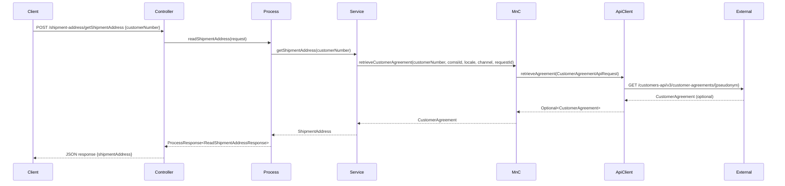

# Chain — ShipmentAddressReadController · POST /shipment-address/getShipmentAddress

<!-- scaffold — phase 1 -->

- **Action point** — `ShipmentAddressReadController` (ucc-cancellation)
- **Kind** — rest-controller
- **Source** — `ucc-cancellation/src/main/java/coba/wtp/wpfe/ucc/cancellation/controller/ShipmentAddressReadController.java`
- **Handler** — `getShipmentAddress(JsonRequest<ReadShipmentAddressRequest>)` — `.../ShipmentAddressReadController.java:27`
- **Trigger** — `POST /shipment-address/getShipmentAddress`
- **Preconditions** — session must carry the customer context (inherited from the page controller that serves `/cancellation`)
- **First hop** — `ShipmentAddressReadProcess.readShipmentAddress(ReadShipmentAddressRequest)`

<!-- analysis — phase 2 -->

## Story

As a **customer in an active cancellation flow**, I want to retrieve my current shipment address so that the cancellation form can pre-populate the address fields and allow me to confirm or change it.

- **Given** a session carrying `bpkn` (the customer number)
- **When** `POST /shipment-address/getShipmentAddress` is called with `{ "customerNumber": "<bpkn>" }`
- **Then** the response contains the customer's main shipment address — name, salutation, street, city, zip code and country label
- **Unless** no shipment address exists for this customer — the response carries a null `shipmentAddress`, which the frontend treats as "no address on file"

Written from the code, never from what the flow is assumed to look like. The actor here is the customer whose session initiated the cancellation page; the endpoint serves that customer's own data back to their browser.

## Chain

```text
Branch 1 · primary
  ShipmentAddressReadController
  → ShipmentAddressReadProcessImpl
    → ShipmentAddressReadServiceImpl
      → ShipmentAddressService.retrieveMainShipmentAddress (wpfe-shared / wpfe-shared-customer)
        → CustomerAgreementMnCImplV3
          → CustomerAgreementApiClientV3
            ⇒ [external]  customers-api (wpfe-shared / wpfe-shared-customer)
```

- **Terminals reached** — `external` (customers-api, via `CustomerAgreementApiClientV3`, in `wpfe-shared / wpfe-shared-customer`)

## Diagrams

### Process flow — primary

```mermaid
flowchart LR
  A(["POST /shipment-address/getShipmentAddress"]) --> B["ShipmentAddressReadController.getShipmentAddress"]
  B --> C["ShipmentAddressReadProcessImpl.readShipmentAddress"]
  C --> D["ShipmentAddressReadServiceImpl.getShipmentAddress"]
  D --> E["ShipmentAddressService.retrieveMainShipmentAddress"]
  E --> F["CustomerAgreementMnCImplV3.retrieveCustomerAgreement"]
  F --> G["CustomerAgreementApiClientV3.retrieveAgreement"]
  G --> H(["external/customers-api"])
```



### Sequence — primary



## Journey

When **the cancellation page calls `POST /shipment-address/getShipmentAddress`**, the request enters at step 1 to handle retrieving the customer's main shipment address. Once that completes, the flow moves to step 2 because the process layer is where business logic and authorization are applied. From there, step 3 takes over to map the shared domain object into the cancellation module's model, so we can return it in a response the frontend understands — and so on through every hop until the JSON response is assembled at the trigger.

1. **ShipmentAddressReadController.getShipmentAddress** (wpfe-am / ucc-cancellation)

   **Source.** `ucc-cancellation/src/main/java/coba/wtp/wpfe/ucc/cancellation/controller/ShipmentAddressReadController.java:27`

   **Role.** Receives the POST request carrying a customer number, delegates to the process layer for authorization and business logic, then wraps the result in a JSON response. This is the entry point of the chain — it does not contain any business logic itself.

   **Preconditions.** The session must carry the customer context (inherited from the page controller that serves `/cancellation`). The request body must be valid JSON containing `customerNumber`, validated by `@Valid JsonRequest<ReadShipmentAddressRequest>`.

   **On failure.** Validation failures are handled by Spring's exception handler and return a 400 response. No explicit error handling in this method — it delegates to the process layer for all business errors.

   **Downstream.** A `ProcessResponse<ReadShipmentAddressResponse>` containing either the shipment address or null, which is wrapped into a JSON response and returned to the client.

2. **ShipmentAddressReadProcessImpl.readShipmentAddress** (wpfe-am / ucc-cancellation)

   **Source.** `ucc-cancellation/src/main/java/coba/wtp/wpfe/ucc/cancellation/process/read/impl/ShipmentAddressReadProcessImpl.java:30`

   **Role.** Applies authorization and delegates to the service layer. The `@PreAuthorize("protect('WPFE_AM_CANCELLATION_PROCESS_READ')")` annotation enforces that only authorized users can call this process, preventing unauthorized access to shipment address data from other channels or contexts.

   **Preconditions.** Authorization check passes — the user must have the `WPFE_AM_CANCELLATION_PROCESS_READ` permission. The request's customer number is passed through unchanged.

   **On failure.** Authorization failures are handled by Spring Security and return a 403 response before this method body executes. No explicit error handling in the method itself.

   **Effect.** None — pure delegation to the service layer.

   **Downstream.** A `ShipmentAddress` object (or null) from the service, wrapped into a `ProcessResponse<ReadShipmentAddressResponse>` and returned to the controller.

3. **ShipmentAddressReadServiceImpl.getShipmentAddress** (wpfe-am / ucc-cancellation)

   **Source.** `ucc-cancellation/src/main/java/coba/wtp/wpfe/ucc/cancellation/service/impl/ShipmentAddressReadServiceImpl.java:27`

   **Role.** Retrieves the customer's main shipment address from the shared customer service, then maps the shared domain object into the cancellation module's model. The mapping includes salutation normalization (defaulting to "Damen" if null or blank) and stripping out fields not needed by the frontend — `addressId`, `mainShipmentAddress`, `legalAddress` and others are dropped during mapping.

   **Preconditions.** The authentication context must carry a valid Comsi identifier, obtained from `AuthenticationContextProvider.getComsiIdentifier()`. If no Comsi ID is available (which would be unusual in this flow), it defaults to null — the shared service handles that gracefully.

   **On failure.** No explicit error handling in this method — any exception propagates up through the process layer and ultimately becomes a 500 response from the controller. The `mapShipmentAddress` helper returns null if the shared address is null, so no downstream null dereference occurs.

   **Effect.** None — pure transformation of data between domain layers.

   **Downstream.** A mapped `ShipmentAddress` model object (or null) containing only the fields needed by the frontend: name lines, salutation, street, zip code, city and country label.

4. **ShipmentAddressService.retrieveMainShipmentAddress** (wpfe-shared / wpfe-shared-customer)

   **Source.** `wpfe-shared/wpfe-shared-customer/src/main/java/coba/wtp/wpfe/shared/customer/service/impl/ShipmentAddressServiceImpl.java:72`

   **Role.** Retrieves the customer's main shipment address from the customer agreement. The logic is: first, check if any of the addresses already attached to the `CustomerAgreement` object have `addressId == "000"` (the constant `MAIN_SHIPPING_ADDRESS_ID`). If found, return it immediately. Otherwise, look through the agreement's roles for any that are owner roles (`EI`, `MI`, or `GF`) and carry a main shipping address — then fetch the party (person or organization) associated with such a role and retrieve its shipment addresses. This handles both natural persons and legal entities, routing to either `PersonMnC` or `OrganizationMnC` based on the customer type.

   **Preconditions.** The customer agreement must be retrievable from the MnC layer — if it is not found (null), this method returns null without further processing.

   **On failure.** No explicit error handling in this method — any exception propagates up through the MnC layer and ultimately becomes a 500 response. If the main address is not found on either the agreement or its owner roles, `orElseGet` returns null rather than throwing an exception.

   **Effect.** None — pure retrieval of data from upstream layers.

   **Downstream.** A `ShipmentAddress` object (or null) representing the customer's main shipping address, which flows back through the service layer to be mapped into the cancellation module's model.

5. **CustomerAgreementMnCImplV3.retrieveCustomerAgreement** (wpfe-shared / wpfe-shared-customer)

   **Source.** `wpfe-shared/wpfe-shared-customer/src/main/java/coba/wtp/wpfe/shared/customer/v1/mnc/impl/CustomerAgreementMnCImplV3.java:58`

   **Role.** Maps the external customer-agreements API response into a domain `CustomerAgreement` object. This is an MnC (Map and Call) — it calls out through an API client to fetch the raw data, then maps the Swagger-generated DTOs into domain objects that downstream code can work with without knowing about the external API's shape. The mapping includes agreement metadata (tenant, type of customer/agreement), roles mapped from `AgreementRole` DTOs, and shipment addresses extracted from both additional addresses and alternate shipping address fields in the response.

   **Preconditions.** None — this method always attempts to call the API client. If the API returns no data, it returns a partially constructed `CustomerAgreement` with null/empty fields rather than throwing an exception.

   **On failure.** No explicit error handling in this method — any exception from the API client propagates up through the service layer and ultimately becomes a 500 response. The mapping code uses `.orElse(null)` throughout, so partial data is returned even if some mapped fields are null.

   **Effect.** None — pure transformation of external data into domain objects.

   **Downstream.** A fully constructed `CustomerAgreement` object containing the customer's agreement metadata, roles and shipment addresses, which flows back through the service layer to be used for address retrieval.

6. **CustomerAgreementApiClientV3.retrieveAgreement** (wpfe-shared / wpfe-shared-customer)

   **Source.** `wpfe-shared/wpfe-shared-customer/src/main/java/coba/wtp/wpfe/shared/customer/api/agreement/CustomerAgreementApiClientV3.java:42`

   **Role.** Constructs an HTTP GET request to the customers-api and executes it. The URL is built by pseudonymizing the customer number (via `PseudonymService`) and appending it to `/customers-api/v3/customer-agreements/{pseudonym}`. Headers include the Comsi ID, Accept header set to JSON, and optionally a Tenant header if present in the request. The response body is deserialized into a `CustomerAgreement` DTO by the RestTemplate.

   **Preconditions.** None — this method always attempts to call the API. If the API returns an HTTP error (4xx or 5xx), it catches the exception and returns `Optional.empty()` rather than propagating the error, so downstream code can distinguish between "not found" and "error".

   **On failure.** Two catch blocks: `HttpClientErrorException` is caught and logged at ERROR level with the response body, then `Optional.empty()` is returned — this means a 4xx/5xx from the API translates to an empty optional rather than an exception. Any other exception (network timeout, serialization error) is re-thrown as-is, so it propagates up through the MnC layer and ultimately becomes a 500 response.

   **Effect.** None — pure outbound call with no side effects beyond logging.

   **Downstream.** An `Optional<CustomerAgreement>` containing either the agreement data (if found) or empty (if not found or on HTTP error). This flows back through the MnC layer to be mapped into a domain object.

7. **external — customers-api** (wpfe-shared / wpfe-shared-customer)

   **Source.** `CustomerAgreementApiClientV3.java:42` — outbound GET via `restTemplate.exchange()`
   **Role.** The customer-agreements API at `/customers-api/v3/customer-agreements/{pseudonym}` returns the customer's agreement data, including shipment addresses. This is an external service (part of the customers-api platform) that this module calls through its API client.

   **Terminal — external**

## Data reached

- **external — customers-api, via `CustomerAgreementApiClientV3` (wpfe-shared / wpfe-shared-customer)**
  - Business problem solved — As the **cancellation flow**, I need to retrieve the customer's main shipment address so that the cancellation form can pre-populate the address fields and allow me to confirm or change it. Therefore we call this API at `GET /customers-api/v3/customer-agreements/{pseudonym}` to retrieve the customer agreement, which contains the shipment addresses attached to it. Then we extract only the main shipping address (identified by `addressId == "000"`) and map its fields into a model object so we can return them in the cancellation response — citing `ShipmentAddressReadServiceImpl.java:27` where the mapping occurs, and `ShipmentAddressReadController.java:27` where the final JSON is assembled.

  - **Request path**
    ```json
    {
      "pseudonym": "<pseudonymized-customer-number>"
    }
    ```
    `pseudonym` — derived from the customer number via `PseudonymService.retrievePseudonym(channel, requestId, internalCustomerNumber)`, origin: request body's `customerNumber`.

  - **Request headers**
    - `ComsiId`: `<comsi-id>` — origin: session context set by the page controller.
    - `Accept: application/json` — standard API contract header.
    - `Tenant`: optional, present only if the request carries a tenant value.

  - **Response fields used** (from `CustomerAgreement` DTO at `CustomerAgreement.java`, inferred from the mapping code in `CustomerAgreementMnCImplV3.java:58-140`)
    ```json
    {
      "agreement": {
        "uniqueAgreementId": "<long-term-customer-id>",
        "typeOfCustomer": "<TYPE_OF_CUSTOMER_KEY>",
        "typeOfAgreement": "<TYPE_OF_AGREEMENT_KEY>",
        "customerTypology": "<CUSTOMER_TYPE_KEY>",
        "status": "<AGREEMENT_STATUS>"
      },
      "agreementRoles": [
        {
          "partyId": "<party-id>",
          "role": "<ROLE_CODE>",
          "ownerName": {
            "firstName": "...",
            "lastName": "...",
            "legalName": "..."
          }
        }
      ],
      "additionalAddresses": [
        {
          "adrKenn": "000",
          "nameLine1": "...",
          "nameLine2": "...",
          "individualSalutation1": "...",
          "postalCountryCode": "<POSTAL_COUNTRY_KEY>",
          "zipCode": "...",
          "city": "...",
          "street": "...",
          "streetNumber": "..."
        }
      ],
      "alternateShippingAddress": {
        "adrKenn": "...",
        "nameLine1": "...",
        "postalCountryCode": "<POSTAL_COUNTRY_KEY>",
        "zipCode": "...",
        "city": "...",
        "street": "...",
        "streetNumber": "..."
      }
    }
    ```
    `agreement.uniqueAgreementId` → the long-term customer ID (Journey step 5, mapped via `.withLongTermCustomerId()`).  
    `agreement.typeOfCustomer`, `typeOfAgreement`, `customerTypology`, `status` → agreement metadata fields.  
    `agreementRoles[].partyId`, `role`, `ownerName.*` → used to identify owner roles and their parties (Journey step 4, for fetching party-level addresses).  
    `additionalAddresses[].adrKenn == "000"` → identifies the main shipping address (Journey step 4, filtered by `isMainShipmentAddress()`).  
    `additionalAddresses[].nameLine1`, `nameLine2`, `individualSalutation1/2`, `postalCountryCode`, `zipCode`, `city`, `street`, `streetNumber` → mapped into the cancellation model's `ShipmentAddress` (Journey step 3, via `mapShipmentAddressesFromAdditionalAddresses()`).  
    `alternateShippingAddress.*` → also checked for a main shipping address if not found in additional addresses.

  - **Response fields discarded** — roughly forty more fields on the agreement DTO that this chain never reads: payment methods, subscriptions, billing configuration, and other metadata attached to the customer agreement but irrelevant to shipment address retrieval. A call fetching an entire agreement object to use one field (the main shipping address) is a coupling worth stating.

## Acceptance Criteria

1. **Valid request returns the main shipment address** — Given a session with `bpkn` and a valid `customerNumber`, when `POST /shipment-address/getShipmentAddress` is called, then the response contains the customer's main shipment address (name lines, salutation, street, zip code, city, country label) in the `shipmentAddress` field.
   - Evidence: `ShipmentAddressReadController.java:27`, `ShipmentAddressReadProcessImpl.java:30`, `ShipmentAddressReadServiceImpl.java:27-58`, `CustomerAgreementMnCImplV3.java:58-140`, `CustomerAgreementApiClientV3.java:42`
   - How to: call the endpoint with a valid customer number and assert on the response body's `shipmentAddress` field. To reproduce: send `POST /shipment-address/getShipmentAddress {"customerNumber": "<bpkn>"}` from an authenticated session and confirm the response contains non-null address fields.

2. **Customer with no shipment address returns null** — Given a customer whose agreement has no main shipping address (no additional address with `adrKenn == "000"` and no owner role carrying one), when `POST /shipment-address/getShipmentAddress` is called, then the response contains `"shipmentAddress": null`.
   - Evidence: `ShipmentAddressServiceImpl.java:72-84` — the `.orElseGet(() -> retrieveAddresses(...).stream().findFirst().orElse(null))` chain returns null if no address is found.
   - How to: find a customer number with no main shipping address on file and call the endpoint; confirm from a query log that `customers-api/v3/customer-agreements/{pseudonym}` returns an agreement without any additional addresses or alternate shipping address, and assert the response body's `shipmentAddress` is null.

3. **Authorization enforced** — Given an authenticated user without the `WPFE_AM_CANCELLATION_PROCESS_READ` permission, when `POST /shipment-address/getShipmentAddress` is called, then the request returns 403 Forbidden before any downstream call to the customers-api runs.
   - Evidence: `ShipmentAddressReadProcessImpl.java:28` — the `@PreAuthorize("protect('WPFE_AM_CANCELLATION_PROCESS_READ')")` annotation on `readShipmentAddress()`.
   - How to: authenticate as a user without that permission and call the endpoint; confirm from a query log that no request is sent to `/customers-api/v3/customer-agreements/...`. To reproduce: obtain an access token for a role lacking `WPFE_AM_CANCELLATION_PROCESS_READ` and send the POST request.

4. **API error handling** — Given the customers-api returns a 5xx, when `POST /shipment-address/getShipmentAddress` is called, then the cancellation endpoint surfaces a 500 response (the exception propagates through the MnC layer), not a 200 with null data.
   - Evidence: `CustomerAgreementApiClientV3.java:42-61` — the second catch block (`catch (Exception e)`) re-throws any non-HTTP-client-error, which includes network timeouts and serialization failures; the first catch block handles HTTP errors by returning empty optional, but a 5xx from the API is an `HttpClientErrorException` that returns empty optional rather than throwing.
   - How to: stub the customers-api endpoint to return 500 and confirm the cancellation endpoint surfaces a 500 with no response body (the exception propagates through the MnC layer). To reproduce: configure the API client's base URL to point to an endpoint returning 500 and call the cancellation endpoint.

## Business Takeaways

- **What this does for the business** — retrieves the customer's main shipment address from the customers-api so that the cancellation form can pre-populate the address fields, allowing the user to confirm or change their shipping location before proceeding with the cancellation.
- **Depends on** — the customers-api (external, returns a full customer agreement object containing shipment addresses); the `WPFE_AM_CANCELLATION_PROCESS_READ` permission for authorization.
- **Ingredients** — `customerNumber` (request body), session context carrying `bpkn` and Comsi ID.
- **Preparation** — pseudonymize the customer number, call customers-api to retrieve the agreement, extract the main shipping address from additional addresses or owner roles, map it into a domain model object.
- **Dish** — JSON response containing `shipmentAddress` (the mapped address fields) or null if no address exists on file.
