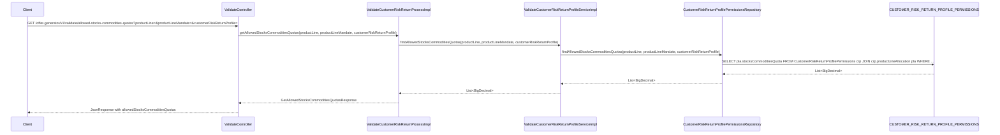

# Chain — ValidateController · GET /allowed-stocks-commodities-quotas

<!-- scaffold — phase 1 -->

- **Action point** — `ValidateController` (wpfe-am / ucc-offer-generator)
- **Kind** — rest-controller
- **Source** — `ucc-offer-generator/src/main/java/coba/wtp/wpfe/ucc/offer/generator/controller/ValidateController.java`
- **Handler** — `getAllowedStocksCommoditiesQuotas(ProductLineEnum, ProductLineMandateEnum, Integer)` — `.../ValidateController.java:128`
- **Trigger** — `GET /offer-generator/v1/validate/allowed-stocks-commodities-quotas`
- **Preconditions** — none observed
- **First hop** — `ValidateCustomerRiskReturnProcess.getAllowedStocksCommoditiesQuotas()` (wpfe-am / ucc-offer-generator)

<!-- analysis — phase 2 -->

## Story

As an **advisor (or retail customer in an advisory session)**, I want to retrieve the allowed stocks and commodities quota range for a given product line, mandate, and risk profile so that the UI can display valid options without requiring the customer to enter a quota value first.

- **Given** query parameters `productLine`, optional `productLineMandate`, and `customerRiskReturnProfile`
- **When** `GET /offer-generator/v1/validate/allowed-stocks-commodities-quotas` is called
- **Then** the system returns a list of all allowed stocks/commodities quota values (minimum and maximum) from the configuration table for that product line, mandate, and risk profile combination
- **Unless** no matching configuration row exists — in which case an empty list is returned

## Chain

```text
Branch 1 · primary
  ValidateController
  → ValidateCustomerRiskReturnProcessImpl
    → ValidateCustomerRiskReturnProfileServiceImpl
      → CustomerRiskReturnProfilePermissionsRepository.findAllowedStocksCommoditiesQuotas()
      ⇒ [db] CUSTOMER_RISK_RETURN_PROFILE_PERMISSIONS
```

- **Terminals reached** — `db` (`CUSTOMER_RISK_RETURN_PROFILE_PERMISSIONS`, via JPA repository)

## Diagrams

### Process flow — primary

```mermaid
flowchart LR
  A(["GET /offer-generator/v1/validate/allowed-stocks-commodities-quotas"]) --> B[ValidateController]
  B --> C[ValidateCustomerRiskReturnProcessImpl]
  C --> D[ValidateCustomerRiskReturnProfileServiceImpl]
  D --> E["CustomerRiskReturnProfilePermissionsRepository.findAllowedStocksCommoditiesQuotas()"]
  E --> F[(CUSTOMER_RISK_RETURN_PROFILE_PERMISSIONS)]
  F --> G([List<BigDecimal> allowed quotas])
```



### Sequence — primary



## Journey

When **the trigger fires** (a GET request to `/offer-generator/v1/validate/allowed-stocks-commodities-quotas`), the request enters at **[step 1]** to retrieve the allowed stocks and commodities quota range for a given product line, mandate, and customer risk return profile. Once that completes, the flow moves to **[step 2]** because the controller delegates business logic to the process layer. From there, **[step 3]** takes over to query the configuration repository, and so on through every hop until a terminal is reached or the response is assembled.

1. **ValidateController.getAllowedStocksCommoditiesQuotas** (wpfe-am / ucc-offer-generator)

   **Source.** `ucc-offer-generator/src/main/java/coba/wtp/wpfe/ucc/offer/generator/controller/ValidateController.java:128`

   **Role.** REST entry point that receives three query parameters — `productLine` (required), `productLineMandate` (optional), and `customerRiskReturnProfile` (required) — and delegates to the process layer to retrieve allowed quota values.

   **Preconditions.** None observed. Spring handles parameter binding; no authentication or session state is enforced at this endpoint.

   **Downstream.** A `ProcessResponse<GetAllowedStocksCommoditiesQuotasResponse>` wrapping a list of allowed stocks/commodities quota BigDecimal values.

2. **ValidateCustomerRiskReturnProcessImpl.getAllowedStocksCommoditiesQuotas** (wpfe-am / ucc-offer-generator)

   **Source.** `ucc-offer-generator/src/main/java/coba/wtp/wpfe/ucc/offer/generator/process/impl/ValidateCustomerRiskReturnProcessImpl.java:50`

   **Role.** Thin process-layer pass-through that forwards the three parameters to the service layer and wraps the result in a `GetAllowedStocksCommoditiesQuotasResponse` inside a `ProcessResponse`.

   **Downstream.** A `List<BigDecimal>` of allowed quota values from the service, wrapped as `new GetAllowedStocksCommoditiesQuotasResponse(allowedQuotaRange)`.

3. **ValidateCustomerRiskReturnProfileServiceImpl.findAllowedStocksCommoditiesQuotas** (wpfe-am / ucc-offer-generator)

   **Source.** `ucc-offer-generator/src/main/java/coba/wtp/wpfe/ucc/offer/generator/service/impl/ValidateCustomerRiskReturnProfileServiceImpl.java:147`

   **Role.** Service-layer method that directly delegates to the repository's `findAllowedStocksCommoditiesQuotas` query. No business logic, filtering, or transformation is applied — it returns exactly what the database returns.

   **Downstream.** A `List<BigDecimal>` of quota values from the JPQL query result.

4. **CustomerRiskReturnProfilePermissionsRepository.findAllowedStocksCommoditiesQuotas** (wpfe-am / ucc-offer-generator)

   **Source.** `ucc-offer-generator/src/main/java/coba/wtp/wpfe/ucc/offer/generator/repository/CustomerRiskReturnProfilePermissionsRepository.java:73`

   **Role.** Spring Data JPA repository method executing a JPQL query that joins `CustomerRiskReturnProfilePermissions` with its `productLineAllocation` association, filters by product line, optional mandate (NULL-safe comparison), customer risk return profile, and the `allowed = true` flag, then returns all matching `stocksCommoditiesQuota` values as a list of `BigDecimal`.

   **Query.**
   ```sql
   SELECT pla.stocksCommoditiesQuota
   FROM CustomerRiskReturnProfilePermissions crp
        JOIN crp.productLineAllocation pla
   WHERE pla.productLine = :productLine
     AND ((:productLineMandate IS NULL AND pla.productLineMandate IS NULL)
          OR pla.productLineMandate = :productLineMandate)
     AND crp.customerRiskReturnProfile = :customerRiskReturnProfile
     AND crp.allowed = true
   ```

   **Terminal — db**

## Data reached

- **db — `CUSTOMER_RISK_RETURN_PROFILE_PERMISSIONS`, via `CustomerRiskReturnProfilePermissionsRepository` (wpfe-am / ucc-offer-generator)**
  - Business problem solved — As the **offer generator validation flow**, I need to know which stocks/commodities quota values are permitted for a given product line, mandate, and customer risk return profile so that the UI can present valid options to the advisor. Therefore we query `CUSTOMER_RISK_RETURN_PROFILE_PERMISSIONS` via `CustomerRiskReturnProfilePermissionsRepository.findAllowedStocksCommoditiesQuotas(productLine, productLineMandate, customerRiskReturnProfile)` for all rows where `allowed = true`, joined through `productLineAllocation`, so we can return the full set of permitted quota values (`CustomerRiskReturnProfilePermissionsRepository.java:73-84`).

  - **Query** — `findAllowedStocksCommoditiesQuotas(productLine, productLineMandate, customerRiskReturnProfile)` — read-only JPQL query with a JOIN to the `productLineAllocation` association.

  - **Arguments**
    ```json
    {
      "productLine": "STOCKS",
      "productLineMandate": null,
      "customerRiskReturnProfile": 3
    }
    ```
    `productLine` ← request query parameter, required. `productLineMandate` ← request query parameter, optional (NULL means match any mandate). `customerRiskReturnProfile` ← request query parameter, required.

  - **Response fields used** — `stocksCommoditiesQuota` (BigDecimal) from the joined `ProductLineAllocation` entity. Example: `[10.50, 25.00, 40.75]`. These are the individual quota values that are permitted for the given configuration.

  - **Response fields discarded** — All other columns on both `CustomerRiskReturnProfilePermissions` (`allowed`, `customerRiskReturnProfile`) and `ProductLineAllocation` (`productLine`, `productLineMandate`) are used in the WHERE clause but not returned. The query selects only `stocksCommoditiesQuota`.

## Acceptance Criteria

1. **Allowed quotas returned for a valid configuration** — Given a product line, optional mandate, and customer risk return profile that match one or more rows where `allowed = true`, when the endpoint is called, then the response contains a non-empty list of `BigDecimal` quota values.
   - Evidence: `CustomerRiskReturnProfilePermissionsRepository.java:73-84`
   - How to: open the JPQL query at line 73 and confirm it selects `pla.stocksCommoditiesQuota` from the joined tables with the correct WHERE clause. To reproduce: call the endpoint with parameters matching a known configuration row in `CUSTOMER_RISK_RETURN_PROFILE_PERMISSIONS`, and assert on the response body containing the expected quota values.

2. **Empty list when no allowed rows match** — Given parameters that do not match any row where `allowed = true`, when the endpoint is called, then the response contains an empty list (not null).
   - Evidence: `CustomerRiskReturnProfilePermissionsRepository.java:73-84` — JPQL returns an empty collection on no match.
   - How to: call the endpoint with parameters that do not exist in the configuration table and confirm the response body is `{"allowedStocksCommoditiesQuotas": []}`. Verify from a query log that the database was hit but returned zero rows.

3. **Optional mandate handled correctly** — Given `productLineMandate` is null, when the endpoint is called, then all matching rows are returned regardless of their mandate value (including NULL mandates).
   - Evidence: `CustomerRiskReturnProfilePermissionsRepository.java:78-79` — the NULL-safe comparison `(:productLineMandate IS NULL AND pla.productLineMandate IS NULL) OR pla.productLineMandate = :productLineMandate`.
   - How to: call with `productLineMandate=null` and confirm rows with both NULL and non-NULL mandates are included. Then call with a specific mandate value and confirm only matching rows are returned.

4. **Only allowed=true rows returned** — Given configuration rows where `allowed = false`, when the endpoint is called, then those quota values are excluded from the result.
   - Evidence: `CustomerRiskReturnProfilePermissionsRepository.java:83` — `AND crp.allowed = true` in the WHERE clause.
   - How to: insert a test row with `allowed = false` and confirm it does not appear in the response. Then set `allowed = true` on that same row and confirm it appears.

## Business Takeaways

- **What this does for the business** — retrieves all permitted stocks/commodities quota values from the configuration table for a given product line, mandate, and customer risk profile, so the UI can present valid options to the advisor without requiring the customer to guess acceptable values.
- **Depends on** — the `CUSTOMER_RISK_RETURN_PROFILE_PERMISSIONS` database table (read-only), joined with `PRODUCT_LINE_ALLOCATION`
- **Ingredients** — `productLine` (required query param), `productLineMandate` (optional query param), `customerRiskReturnProfile` (required query param)
- **Preparation** — JPQL joins the permissions entity to its product line allocation, filters by allowed=true and matching parameters
- **Dish** — `List<BigDecimal>` of quota values wrapped in `GetAllowedStocksCommoditiesQuotasResponse`, returned as JSON via `JsonResponse`
---

