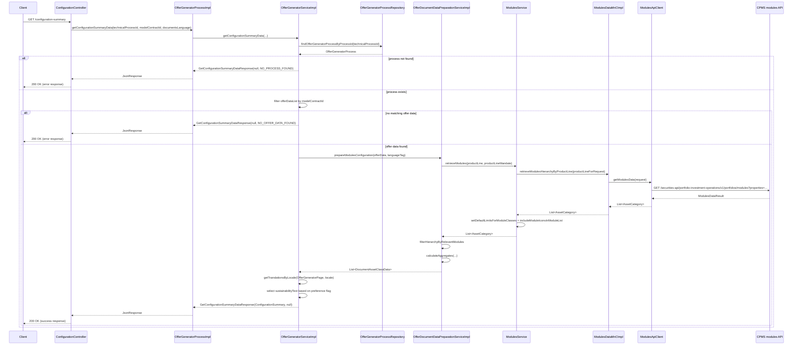

# Chain — ConfigurationController · GET /configuration-summary

<!-- scaffold — phase 1 -->

- **Action point** — `ConfigurationController` (wpfe-am / ucc-offer-generator)
- **Kind** — rest-controller
- **Source** — `ucc-offer-generator/src/main/java/coba/wtp/wpfe/ucc/offer/generator/controller/ConfigurationController.java`
- **Handler** — `getConfigurationSummaryData(String, String, String)` — `.../ConfigurationController.java:48`
- **Trigger** — `GET /offer-generator/v1/configuration-summary`
- **Preconditions** — none observed
- **First hop** — `OfferGeneratorProcess.getConfigurationSummaryData()` (wpfe-am / ucc-offer-generator)

<!-- analysis — phase 2 -->

## Story

As an **SAO (Standalone Offer Generator) user viewing the summary configuration document**, I want the system to retrieve and assemble the offer's module hierarchy, investment volume, risk profile, and sustainability text so that the summary document can be rendered.

- **Given** a `technicalProcessId` identifying an existing offer-generator process, a `modelContractId`, and a `documentsLanguage`
- **When** `GET /offer-generator/v1/configuration-summary?technicalProcessId=...&modelContractId=...&documentsLanguage=...` is called
- **Then** the system returns a `GetConfigurationSummaryDataResponse` containing either a `ConfigurationSummary` with module hierarchy data, or an error code (`NO_PROCESS_FOUND`, `NO_OFFER_DATA_FOUND`, `UNEXPECTED_ERROR`)
- **Unless** no process exists for the given `technicalProcessId` — rejected with `NO_PROCESS_FOUND`

## Chain

```text
Branch 1 · primary
  ConfigurationController.getConfigurationSummaryData(String, String, String)
  → OfferGeneratorProcessImpl.getConfigurationSummaryData(String, String, String)
  → OfferGeneratorServiceImpl.getConfigurationSummaryData(String, String, String)
    → find process by technicalProcessId
      → OfferGeneratorProcessRepository.findOfferGeneratorProcessByProcessId(String)
      ⇒ [db]  OFFER_GENERATOR_PROCESS
    → filter offer data list by modelContractId
    → prepare modules configuration
      → ModulesService.retrieveModules(ProductLineEnum, ProductLineMandateEnum)
        → ModulesHierarchyProviderServiceImpl.retrieveModulesHierarchy(ProductLineEnum, ProductLineMandateEnum)
          → ModulesDataMnCImpl.retrieveModulesHierarchyByProductLine(String)
            → ModulesApiClient.getModulesData(ModulesDataRequest)
            ⇒ [external]  CPMS modules API (wpfe-shared / cpms)
      → AggregatesCalculationServiceImpl.calculateAggregates(...)
      ⇒ [none]  pure computation — proportion and absolute value calculation
    → load translations from ResourceBundle
    ⇒ [none]  ignored class — TranslationsUtil matches **/translations/**
    → select sustainability text based on preference flag
⇒ [external]  CPMS modules API (wpfe-shared / cpms)
```

- **Terminals reached** — `db` (`OFFER_GENERATOR_PROCESS`), `external` (CPMS modules API, via `wpfe-shared / cpms`), `none` (pure computation in aggregates service and translation loading)

## Diagrams

### Process flow — primary

```mermaid
flowchart LR
  A(["GET /offer-generator/v1/configuration-summary"]) --> B[ConfigurationController]
  B --> C[OfferGeneratorProcessImpl]
  C --> D[OfferGeneratorServiceImpl]
  D --> E{process exists?}
  E -- no --> F([NO_PROCESS_FOUND])
  E -- yes --> G{offer data for modelContractId?}
  G -- no --> H([NO_OFFER_DATA_FOUND])
  G -- yes --> I[prepareModulesConfiguration]
  I --> J[retrieveModules from CPMS]
  J --> K[ModulesApiClient.getModulesData]
  K --> L([external/CPMS modules API])
  L --> M[map to AssetCategory hierarchy]
  M --> N[calculateAggregates]
  N --> O([pure computation — none])
  O --> P[load translations from ResourceBundle]
  P --> Q([none — ignored class])
  Q --> R{sustainabilityPreference?}
  R -- true --> S(["offer.generator.document.sustainable"])
  R -- false --> T(["offer.generator.document.not-suitable"])
  S --> U([ConfigurationSummary + documentAssetClassData])
  T --> U
```



### Sequence — primary



## Journey

When the **SAO user requests the configuration summary document**, the request enters at step 1 to handle retrieval of module hierarchy and offer data. Once that completes, the flow moves to step 2 because the process layer delegates business logic to the service. From there, step 3 takes over to look up the process from the database, and so on through every hop until a terminal is reached or the response is assembled.

1. **ConfigurationController.getConfigurationSummaryData** (wpfe-am / ucc-offer-generator)

   **Source.** `ucc-offer-generator/src/main/java/coba/wtp/wpfe/ucc/offer/generator/controller/ConfigurationController.java:56`

   **Role.** Receives the REST request carrying `technicalProcessId`, `modelContractId`, and `documentsLanguage`, then delegates to the process layer. Wraps the resulting `ProcessResponse` into a `JsonResponse` via `JsonResponseBuilder`.

   **Preconditions.** None observed — no authentication or session guard is applied on this endpoint (unlike `getInitialConfiguration` which uses `@PreAuthorize`).

   **Effect.** Returns a JSON response containing either the configuration summary data or an error code.

   **Downstream.** `OfferGeneratorProcess.getConfigurationSummaryData()`

2. **OfferGeneratorProcessImpl.getConfigurationSummaryData** (wpfe-am / ucc-offer-generator)

   **Source.** `ucc-offer-generator/src/main/java/coba/wtp/wpfe/ucc/offer/generator/process/impl/OfferGeneratorProcessImpl.java:189`

   **Role.** Thin process-layer pass-through — receives the three parameters and delegates directly to `OfferGeneratorService.getConfigurationSummaryData()`, wrapping the result in a `ProcessResponse`.

   **Downstream.** `OfferGeneratorService.getConfigurationSummaryData()`

3. **OfferGeneratorServiceImpl.getConfigurationSummaryData** (wpfe-am / ucc-offer-generator)

   **Source.** `ucc-offer-generator/src/main/java/coba/wtp/wpfe/ucc/offer/generator/service/impl/OfferGeneratorServiceImpl.java:148`

   **Role.** Orchestrates the configuration summary assembly: looks up the process, finds the matching offer data, prepares module configuration from CPMS, loads translations, and assembles the final response.

   **Steps.**

   3.1 **Look up process by technicalProcessId** · `OfferGeneratorServiceImpl.java:150`

       **Role.** Queries the database for an `OfferGeneratorProcess` matching the given `technicalProcessId`.

       **On failure.** Returns immediately with error code `NO_PROCESS_FOUND`, so no further work is done.

       **Downstream.** `OfferGeneratorProcessRepository.findOfferGeneratorProcessByProcessId()`

   3.2 **Filter offer data by modelContractId** · `OfferGeneratorServiceImpl.java:156`

       **Role.** From the process's `offerDataList`, filters to find exactly one `OfferData` whose `modelContractId` matches the request parameter. This is a business rule — each process can have multiple offers, and only the one tied to the given model contract is relevant.

       **On failure.** Returns immediately with error code `NO_OFFER_DATA_FOUND`, so no CPMS call or translation loading occurs.

   3.3 **Map documentsLanguage to locale tag** · `OfferGeneratorServiceImpl.java:162`

       **Role.** Converts the incoming `documentsLanguage` parameter (`"de"`) into a full IETF language tag (`"de-DE"` for German, defaulting to `"en-GB"` for English). This determines which translation bundle and CPMS product line is used.

   3.4 **Prepare modules configuration** · `OfferGeneratorServiceImpl.java:165`

       **Role.** Delegates to the document preparation service to build the module hierarchy with calculated aggregates. Wrapped in a try-catch — any exception yields error code `UNEXPECTED_ERROR`.

       **Downstream.** `OfferDocumentDataPreparationService.prepareModulesConfiguration()`

   3.5 **Load translations from ResourceBundle** · `OfferGeneratorServiceImpl.java:169`

       **Role.** Loads translation strings for the `OfferGeneratorPage` bundle at the resolved locale, so that sustainability preference labels can be looked up by key.

       **On failure.** `MissingResourceException` is caught and logged as a warning; an empty map is returned. The subsequent lookup will produce `null`, which becomes the displayed text.

       **Effect.** This hop resolves to `TranslationsUtil`, which matches the ignore pattern `**/translations/**`. Per the trace contract, this chain stops here with `[none]` — no further tracing of the ResourceBundle loading.

   3.6 **Select sustainability text based on preference flag** · `OfferGeneratorServiceImpl.java:170`

       **Role.** Reads the `sustainabilityPreference` boolean from the process entity. If true, selects the translation key `"offer.generator.document.sustainable"`; if false or null, selects `"offer.generator.document.not-suitable"`. This is a business rule that determines which label appears on the summary document.

   3.7 **Assemble and return ConfigurationSummary** · `OfferGeneratorServiceImpl.java:172`

       **Role.** Constructs a `ConfigurationSummary` record carrying four fields — investment volume (string), sustainability text, risk-return profile (string), and the module configuration list — then wraps it in a success response with null error.

4. **OfferGeneratorProcessRepository.findOfferGeneratorProcessByProcessId** (wpfe-am / ucc-offer-generator)

   **Source.** `ucc-offer-generator/src/main/java/coba/wtp/wpfe/ucc/offer/generator/repository/OfferGeneratorProcessRepository.java:16`

   **Role.** JPA repository method that queries the `OFFER_GENERATOR_PROCESS` table for a row whose `PROCESS_ID` column matches the given parameter. Returns an empty `Optional` when no match exists.

   **Terminal — db**

5. **OfferDocumentDataPreparationServiceImpl.prepareModulesConfiguration** (wpfe-am / ucc-offer-generator)

   **Source.** `ucc-offer-generator/src/main/java/coba/wtp/wpfe/ucc/offer/generator/service/document/impl/OfferDocumentDataPreparationServiceImpl.java:167`

   **Role.** Builds the hierarchical module configuration for document generation. It resolves the product line mandate, retrieves the full module hierarchy from CPMS via `ModulesService`, filters it to only include modules present in the offer's proportions, calculates absolute values and percentages through the aggregates service, then maps everything into a nested `DocumentAssetClassData` → `DocumentModuleData` structure.

   **Steps.**

   5.1 **Resolve product line mandate** · `OfferDocumentDataPreparationServiceImpl.java:174`

       **Role.** Converts the stored string `productLineMandate` from `OfferData` into a `ProductLineMandateEnum`. If null, the mandate is left as null (no filtering by mandate).

   5.2 **Retrieve full module hierarchy from CPMS** · `OfferDocumentDataPreparationServiceImpl.java:178`

       **Role.** Calls `ModulesService.retrieveModules()` with the offer's product line and mandate to get the complete asset category → asset class → module class → module hierarchy from CPMS.

       **Downstream.** `ModulesService` → `ModulesHierarchyProviderService` → `ModulesDataMnC` → `ModulesApiClient` → external CPMS API (see Branch 1)

   5.3 **Filter hierarchy to relevant modules** · `OfferDocumentDataPreparationServiceImpl.java:180`

       **Role.** Uses `ModuleHierarchyHelper.filterHierarchyByRelevantModules()` to drop every module whose ID or technical ID does not appear in the offer's `moduleProportions` map. This ensures only modules actually selected by the customer are included in the summary.

   5.4 **Calculate aggregates** · `OfferDocumentDataPreparationServiceImpl.java:182`

       **Role.** Calls `AggregatesCalculationService.calculateAggregates()` to compute absolute values and proportions for every module, asset class, and asset category based on the investment volume and module proportions.

       **Effect.** Produces a `CalculatedAggregates` object with nested aggregate lists at each hierarchy level.

   5.5 **Map aggregates into DocumentAssetClassData** · `OfferDocumentDataPreparationServiceImpl.java:184`

       **Role.** Iterates over the asset class aggregates, looks up their translated labels from the ResourceBundle, and for each asset class finds its child modules in the filtered hierarchy. For every module it resolves the corresponding `ModuleAggregate` (throwing if missing), extracts the module name via translation fallback, and builds a `DocumentModuleData` with absolute value and percentage strings.

       **Effect.** Produces the final `List<DocumentAssetClassData>` returned to the caller.

6. **ModulesService.retrieveModules** (wpfe-am / ucc-offer-generator)

   **Source.** `ucc-offer-generator/src/main/java/coba/wtp/wpfe/ucc/offer/generator/service/impl/ModulesServiceImpl.java:73`

   **Role.** Retrieves the module hierarchy for a product line, sets default limits on any missing module class limits, and merges CMS module icons with translations into each module.

   **Steps.**

   6.1 **Retrieve hierarchy from provider** · `ModulesServiceImpl.java:75`

       **Role.** Delegates to `ModulesHierarchyProviderService.retrieveModulesHierarchy()` which calls CPMS via the MnC layer.

   6.2 **Set default limits for module classes** · `ModulesServiceImpl.java:76`

       **Role.** Walks every asset class and module class in the hierarchy; where a `ModuleClassLimits` is null or has null limit fields, it fills them with `BigDecimal.ONE` (100%). This ensures downstream calculations always have non-null limits.

   6.3 **Include module icons from CMS** · `ModulesServiceImpl.java:77`

       **Role.** Loads all `ModuleIcon` entities with translations from the local database, then for each module in the hierarchy finds its icon by matching module ID or technical ID. If an icon is missing or has no translation, it retries a single sync from CMS; if that also fails, it throws a `TechnicalException`. Finally, it extracts German and English translations into `ModuleTranslation` objects and attaches them to the module.

7. **ModulesHierarchyProviderServiceImpl.retrieveModulesHierarchy** (wpfe-am / ucc-offer-generator)

   **Source.** `ucc-offer-generator/src/main/java/coba/wtp/wpfe/ucc/offer/generator/service/impl/ModulesHierarchyProviderServiceImpl.java:30`

   **Role.** Maps the product line enum to a CPMS filter string and delegates to the MnC. Results are cached under Spring's `@Cacheable("cpmsModules")` keyed by product line name and mandate.

   **Steps.**

   7.1 **Map product line to CPMS filter** · `ModulesHierarchyProviderServiceImpl.java:36`

       **Role.** Converts the Java enum into a string that CPMS understands:
       - `EXCLUSIVE` → `"product-line-exclusive"`
       - `EFFICIENT` → `"product-line-efficient"`
       - `EXPERT/SUSTAINABLE` → `"product-line-expert-sustainable"`
       - `EXPERT/INDEX_SELECTION` → `"product-line-expert-index-selection"`
       - `EXPERT/ACTIVE_SELECTION` → `"product-line-expert-active-selection"`

   7.2 **Delegate to MnC** · `ModulesHierarchyProviderServiceImpl.java:45`

       **Role.** Calls `modulesDataMnC.retrieveModulesHierarchyByProductLine()` with the filter string.

8. **ModulesDataMnCImpl.retrieveModulesHierarchyByProductLine** (wpfe-shared / cpms)

   **Source.** `wpfe-shared/wpfe-shared-cpms/src/main/java/coba/wtp/wpfe/shared/cpms/mnc/impl/ModulesDataMnCImpl.java:107`

   **Role.** Map and Call layer — builds a `ModulesDataRequest` with the product line filter property, calls the API client to fetch raw module data from CPMS, then maps the flat list of modules into a nested hierarchy (AssetCategory → AssetClass → ModuleClass → Module) with bidirectional parent-child relationships.

   **Steps.**

   8.1 **Build request and call API** · `ModulesDataMnCImpl.java:109`

       **Role.** Creates a properties map keyed by `"coba-asset-management-product-line"` with the filter string, builds a `ModulesDataRequest`, and calls `modulesApi.getModulesData()`.

   8.2 **Map flat modules to hierarchy** · `ModulesDataMnCImpl.java:120`

       **Role.** Filters out modules without a valid module ID property, maps each module's properties (expected return, volatility, limits, grouping info, risk profile, etc.) into domain objects, groups them by temp module class ID → asset class ID → asset category (offensive / defensive / alternative-investments), and sets bidirectional parent references.

   **Downstream.** `ModulesApiClient.getModulesData()`

9. **ModulesApiClient.getModulesData** (wpfe-shared / cpms)

   **Source.** `wpfe-shared/wpfe-shared-cpms/src/main/java/coba/wtp/wpfe/shared/cpms/api/modules/ModulesApiClient.java:47`

   **Role.** Makes an outbound HTTP GET to the CPMS modules endpoint with query parameters for properties filtering. Handles 404 by returning empty Optional; any other exception is wrapped in a `TechnicalException`.

   **Terminal — external**

10. **AggregatesCalculationServiceImpl.calculateAggregates** (wpfe-am / ucc-offer-generator)

    **Source.** `ucc-offer-generator/src/main/java/coba/wtp/wpfe/ucc/offer/generator/service/impl/AggregatesCalculationServiceImpl.java:53`

    **Role.** Pure computation — initializes aggregate objects at every hierarchy level (module, module class, asset class, asset category), calculates proportions and absolute values by multiplying each module's proportion against the total investment volume, computes slider limits using the `LimitsService`, and derives a key risk indicator as a weighted average of minimum risk return profiles.

    **Effect.** Produces a fully populated `CalculatedAggregates` object with all aggregate lists filled. No outbound calls are made.

    **Terminal — none**

11. **TranslationsUtil.getTranslationsByLocale** (wpfe-am / ucc-offer-generator)

    **Source.** `ucc-offer-generator/src/main/java/coba/wtp/wpfe/ucc/offer/generator/util/translations/TranslationsUtil.java:14`

    **Role.** Loads a Java ResourceBundle for the given class name and locale, iterates all keys, and returns them as a `Map<String, String>`. Catches `MissingResourceException` and logs a warning.

    **Effect.** This hop resolves to an ignored class matching the pattern `**/translations/**`. Per the trace contract, this chain stops here with `[none]` — no further tracing of ResourceBundle internals.

    **Terminal — none (ignored)**

## Data reached

- **db — `OFFER_GENERATOR_PROCESS`, via `OfferGeneratorProcessRepository` (wpfe-am / ucc-offer-generator)**
  - Business problem solved — As the **configuration summary service**, I need the offer generator process record for a given `technicalProcessId` to be able to access its associated offer data, sustainability preference flag, and scenario. Therefore we query `OFFER_GENERATOR_PROCESS` via `OfferGeneratorProcessRepository.findOfferGeneratorProcessByProcessId(technicalProcessId)` for the process row, so we can filter its nested offer data list by model contract ID.

  - **Query** — `findOfferGeneratorProcessByProcessId(String processId)` — read-only JPA method on `JpaRepository<OfferGeneratorProcess, String>`.

  - **Argument**
    ```json
    {
      "processId": "a1b2c3d4-e5f6-7890-abcd-ef1234567890"
    }
    ```
    `processId` ← request parameter `technicalProcessId`, origin: REST query string.

  - **Response fields used** — `offerDataList` (used to filter by modelContractId), `sustainabilityPreference` (used to select the sustainability text label). The entity also carries `influence`, `scenario`, and `customerRiskProfile`, but these are not consumed in this chain.

- **external — CPMS modules API, via `ModulesApiClient` (wpfe-shared / cpms)**
  - Business problem solved — As the **module configuration service**, I need the full module hierarchy (asset categories → asset classes → module classes → modules) for a given product line to be able to calculate investment proportions and build the document's module structure. Therefore we call this API at `GET /securities-api/portfolio-investment-operations/v1/portfolios/modules?properties=coba-asset-management-product-line:"product-line-{line}"` to retrieve the raw module data from CPMS.

  - **Request path**
    ```json
    {
      "properties": "coba-asset-management-product-line:\"product-line-exclusive\""
    }
    ```
    `properties` — query parameter, origin: product line enum mapped to a string by `ModulesHierarchyProviderServiceImpl` (e.g. `EXCLUSIVE` → `"product-line-exclusive"`).

  - **Request body** — none (GET request).

  - **Response fields used** — The response is a `ModulesDataResult` containing a flat list of modules, each with properties like module ID (`coba-general-attributes-module-id`), asset class (`coba-general-attributes-asset-class`), expected return (`coba-general-attributes-expected-return`), expected volatility (`coba-general-attributes-expected-volatility`), minimum risk profile (`coba-target-markets-minimum-risk-profile`), limits (lower/upper percentage of liquid part, asset category, absolute), and grouping info. The MnC maps these into a nested `AssetCategory → AssetClass → ModuleClass → Module` hierarchy.

  - **Response fields discarded** — Properties not consumed by the MnC mapping include payout rate (`coba-profile-costs-payout-rate`), securities commission rate (`coba-profile-costs-securities-commission-rate`), other fee rate, external service fee rate, lookthrough tag, module start date, and US person product flag.

- **none — pure computation in `AggregatesCalculationServiceImpl`**
  - Business problem solved — As the **document preparation service**, I need to compute absolute investment values and proportions for every module, asset class, and asset category based on the total investment volume and per-module proportion percentages. Therefore we perform pure arithmetic: multiply each module's proportion by the investment volume to get its absolute value, sum up modules into asset classes and asset categories, and calculate slider limits using the `LimitsService`.

  - **Input** — `List<AssetCategory>` (filtered hierarchy), `Map<String, BigDecimal>` (module proportions keyed by module ID or technical ID), `BigDecimal entireInvestmentAmount`, `boolean includeAlternativeInvestments`.

  - **Output** — `CalculatedAggregates` with lists of `ModuleAggregate`, `ModuleClassAggregate`, `AssetClassAggregate`, and `AssetCategoryAggregate`, each carrying proportion, absolute value, and slider limits where applicable.

## Acceptance Criteria

1. **Existing process, matching offer data found** — Given a `technicalProcessId` that resolves to an existing `OfferGeneratorProcess` with at least one `OfferData` whose `modelContractId` matches the request parameter, when `GET /offer-generator/v1/configuration-summary` is called with valid parameters and language `"de"`, then the response contains a non-null `ConfigurationSummary` with investment volume, sustainability text (resolved from translation key `"offer.generator.document.sustainable"` or `"offer.generator.document.not-suitable"`), risk-return profile as string, and a list of `DocumentAssetClassData` entries.
   - Evidence: `OfferGeneratorServiceImpl.java:150-176`
   - How to: call the endpoint with a known valid `technicalProcessId` and `modelContractId`; assert that `response.configurationSummary` is non-null, `response.error` is null, and `configurationSummary.documentAssetClassData` contains entries for each asset class in the offer.

2. **No process found** — Given a `technicalProcessId` that does not match any row in `OFFER_GENERATOR_PROCESS`, when the endpoint is called, then the response contains `null` configuration summary and error code `NO_PROCESS_FOUND`.
   - Evidence: `OfferGeneratorServiceImpl.java:152`
   - How to: call with a non-existent process ID (e.g. `"nonexistent-uuid"`); assert that `response.configurationSummary` is null and `response.error` equals `"NO_PROCESS_FOUND"`.

3. **Process exists but no matching offer data** — Given a valid `technicalProcessId` whose process has an `offerDataList`, when the endpoint is called with a `modelContractId` that does not match any entry's `modelContractId`, then the response contains `null` configuration summary and error code `NO_OFFER_DATA_FOUND`.
   - Evidence: `OfferGeneratorServiceImpl.java:156-159`
   - How to: call with a valid process ID but an invalid model contract ID; assert that `response.configurationSummary` is null and `response.error` equals `"NO_OFFER_DATA_FOUND"`. Confirm from query log that the CPMS modules API is never called.

4. **Language mapping — German vs English** — Given `documentsLanguage = "de"`, when the endpoint is called, then the language tag used for translation loading and CPMS filtering resolves to `"de-DE"`; for any other value (including null or empty), it defaults to `"en-GB"`.
   - Evidence: `OfferGeneratorServiceImpl.java:162`
   - How to: call with `documentsLanguage=de` and verify the translation bundle loaded is `OfferGeneratorPage_de_DE`; call with `documentsLanguage=en` and verify `OfferGeneratorPage_en_GB` is loaded.

5. **Sustainability text selection** — Given a process whose `sustainabilityPreference` is true, when the endpoint returns successfully, then the `ConfigurationSummary.sustainabilityPreferenceText` contains the value of translation key `"offer.generator.document.sustainable"`; if false or null, it contains `"offer.generator.document.not-suitable"`.
   - Evidence: `OfferGeneratorServiceImpl.java:170-171`
   - How to: call with a process that has `sustainabilityPreference = true` in the database; assert on the response text. Repeat with `sustainabilityPreference = false` and confirm different text.

6. **Unexpected error during module configuration** — Given a valid process and offer data, when the CPMS API returns an unexpected exception (not 404) during `prepareModulesConfiguration`, then the response contains `null` configuration summary and error code `UNEXPECTED_ERROR`.
   - Evidence: `OfferGeneratorServiceImpl.java:165-168`
   - How to: stub the CPMS modules endpoint to return a 5xx; call the endpoint and assert that `response.error` equals `"UNEXPECTED_ERROR"`. Confirm from logs that `TechnicalExceptionFactory.createAndLogTechnicalException` is thrown by `ModulesApiClient`.

7. **Module hierarchy includes only selected modules** — Given an offer with module proportions for three specific modules out of a larger CPMS catalog, when the endpoint returns successfully, then each `DocumentAssetClassData.modules` list contains entries only for those three modules (or their parent asset class's filtered children).
   - Evidence: `OfferDocumentDataPreparationServiceImpl.java:180`
   - How to: call with an offer that has proportions set for a subset of modules; assert on the response that no module outside the selected set appears in any `DocumentAssetClassData.modules` list.

## Business Takeaways

- **What this does for the business** — Assembles the configuration summary document data for SAO (Standalone Offer Generator), retrieving the customer's offer process from the database, fetching the full module hierarchy from CPMS, filtering it to only include modules selected in the offer, calculating absolute investment values and percentages at every hierarchy level, loading localized text labels, and returning a structured response with investment volume, sustainability preference label, risk-return profile, and nested asset class/module data.

- **Depends on** — `OFFER_GENERATOR_PROCESS` table (read-only via JPA repository); CPMS modules API (external HTTP GET for module hierarchy data)

- **Ingredients** — `technicalProcessId` (request parameter), `modelContractId` (request parameter), `documentsLanguage` (request parameter, maps to locale tag)

- **Preparation** — Look up process by technical process ID; reject if not found. Filter offer data list by model contract ID; reject if no match. Map language parameter to IETF locale tag. Retrieve full module hierarchy from CPMS and filter to selected modules only.

- **Dish** — `ConfigurationSummary` (investmentVolume, sustainabilityPreferenceText, riskReturnProfile, documentAssetClassData) or an error code (`NO_PROCESS_FOUND`, `NO_OFFER_DATA_FOUND`, `UNEXPECTED_ERROR`)
