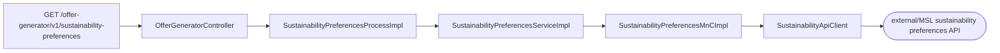
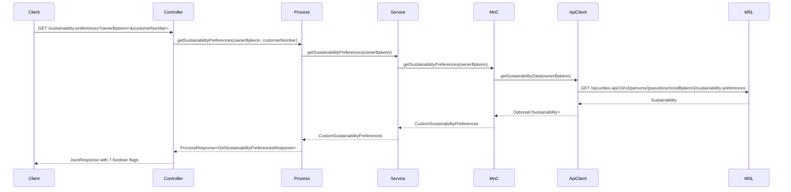

# Chain — OfferGeneratorController · GET /sustainability-preferences

<!-- scaffold — phase 1 -->

- **Action point** — `OfferGeneratorController` (wpfe-am / ucc-offer-generator)
- **Kind** — rest-controller
- **Source** — `ucc-offer-generator/src/main/java/coba/wtp/wpfe/ucc/offer/generator/controller/OfferGeneratorController.java`
- **Handler** — `getCustomSustainabilityPreferences(String, String)` — `.../OfferGeneratorController.java:124`
- **Trigger** — `GET /offer-generator/v1/sustainability-preferences`
- **Preconditions** — none observed
- **First hop** — `SustainabilityPreferencesProcess.getSustainabilityPreferences()` (wpfe-am / ucc-offer-generator)

<!-- analysis — phase 2 -->

## Story

As a **retail customer browsing the offer generator**, I want my custom sustainability preferences
retrieved so that the UI can display my ESG and climate-related investment settings.

- **Given** an active advisory session carrying `ownerBpkenn` and `customerNumber`
- **When** `GET /offer-generator/v1/sustainability-preferences?ownerBpkenn={ownerBpkenn}&customerNumber={customerNumber}` is called
- **Then** the customer's seven sustainability preference flags are returned as a JSON response
- **Unless** no preferences exist for that owner — in which case all flags default to `false`

## Chain

```text
Branch 1 · primary
  OfferGeneratorController
  → SustainabilityPreferencesProcessImpl
  → SustainabilityPreferencesServiceImpl
  → SustainabilityPreferencesMnCImpl
  → SustainabilityApiClient
  ⇒ [external]  MSL sustainability preferences API (wpfe-shared / wpfe-shared-regulations)
```

- **Terminals reached** — `external` (MSL sustainability preferences API, via `SustainabilityApiClient` in `wpfe-shared / wpfe-shared-regulations`)

## Diagrams

### Process flow — primary



### Sequence — primary



## Journey

When **the trigger fires**, the request enters at **[step 1]** to retrieve a customer's custom sustainability preferences. Once that completes, the flow moves to **[step 2]** because the process layer enforces authorization and delegates to the service. From there, **[step 3]** takes over to fetch raw data from the MSL external system via an API client, and so on through every hop until a terminal is reached or the response is assembled.

1. **OfferGeneratorController.getCustomSustainabilityPreferences** (wpfe-am / ucc-offer-generator)

   **Source.** `ucc-offer-generator/src/main/java/coba/wtp/wpfe/ucc/offer/generator/controller/OfferGeneratorController.java:124`

   **Role.** Entry point for the sustainability preferences retrieval. Accepts `ownerBpkenn` and `customerNumber` as request parameters, delegates to the process layer, and wraps the result in a JSON response.

   **Preconditions.** None observed — no session validation or input sanitization beyond Spring's standard parameter binding.

   **Downstream.** `SustainabilityPreferencesProcessImpl.getSustainabilityPreferences(ownerBpkenn, customerNumber)`

2. **SustainabilityPreferencesProcessImpl.getSustainabilityPreferences** (wpfe-am / ucc-offer-generator)

   **Source.** `ucc-offer-generator/src/main/java/coba/wtp/wpfe/ucc/offer/generator/process/impl/SustainabilityPreferencesProcessImpl.java:30`

   **Role.** Process-layer gate that enforces authorization before the data fetch. The method is annotated with `@PreAuthorize("protectWith('WPFE_AM_OG_READ', {'internalCustomerNumber': #customerNumber})")`, which checks that the caller has the `WPFE_AM_OG_READ` permission for the given customer number.

   **On failure.** Authorization failure returns an HTTP 403 Forbidden from Spring Security before any service call is made.

   **Steps.**

   - **2.1 Authorize** · `SustainabilityPreferencesProcessImpl.java:30`
     **Role.** The `@PreAuthorize` annotation triggers Spring Security's method-level authorization, verifying the caller holds `WPFE_AM_OG_READ` for the provided customer number.
     **On failure.** Throws an access denied exception; no service call is made.

   - **2.2 Fetch preferences** · `SustainabilityPreferencesProcessImpl.java:34`
     **Role.** Calls `sustainabilityPreferencesService.getSustainabilityPreferences(ownerBpkenn)` to retrieve the customer's raw sustainability data from MSL, then wraps it in a response DTO.
     **Downstream.** `GetSustainabilityPreferencesResponse` — a record with seven boolean fields extracted from the preferences model.

3. **SustainabilityPreferencesServiceImpl.getSustainabilityPreferences** (wpfe-am / ucc-offer-generator)

   **Source.** `ucc-offer-generator/src/main/java/coba/wtp/wpfe/ucc/offer/generator/service/impl/SustainabilityPreferencesServiceImpl.java:21`

   **Role.** Thin service-layer pass-through. Delegates directly to the MnC without additional business logic, validation, or transformation.

   **Downstream.** `SustainabilityPreferencesMnCImpl.getSustainabilityPreferences(ownerBpkenn)`

4. **SustainabilityPreferencesMnCImpl.getSustainabilityPreferences** (wpfe-am / ucc-offer-generator)

   **Source.** `ucc-offer-generator/src/main/java/coba/wtp/wpfe/ucc/offer/generator/mnc/impl/SustainabilityPreferencesMnCImpl.java:38`

   **Role.** Map-and-Call layer that fetches raw sustainability data from the MSL API client and maps it into a domain model (`CustomSustainabilityPreferences`). Handles two outcomes: preferences exist (map them) or they do not (return all-false defaults).

   **Steps.**

   - **4.1 Fetch raw data** · `SustainabilityPreferencesMnCImpl.java:38`
     **Role.** Calls `sustainabilityApiClient.getSustainabilityData(ownerBpkenn)` to retrieve the full `Sustainability` object from MSL.
     **On failure.** A 404 Not Found is caught by the API client and returns an empty `Sustainability` object (not null), so this step always produces a non-null result. Other HTTP errors propagate as `TechnicalExceptionFactory` exceptions.

   - **4.2 Check data presence** · `SustainabilityPreferencesMnCImpl.java:39`
     **Role.** Tests whether the returned `Sustainability` object contains a non-empty `sustainabilityData` list. If empty or absent, all preference flags default to false.
     **Effect.** Short-circuits to `CustomSustainabilityPreferences.createWithAllFalse()` when no data is available.

   - **4.3 Map — sustainable economic activities** · `SustainabilityPreferencesMnCImpl.java:47`
     **Role.** Reads `sustainabilityProfile.getHasCategoryA()` and normalizes it via `setBooleanValue()`, which coerces null to false by checking `Boolean.TRUE.equals(value)`.

   - **4.4 Map — pursue sustainability goals** · `SustainabilityPreferencesMnCImpl.java:48`
     **Role.** Reads `sustainabilityProfile.getHasCategoryB()` and normalizes it the same way.

   - **4.5 Map — mitigate adverse ESG impacts** · `SustainabilityPreferencesMnCImpl.java:49`
     **Role.** Reads `sustainabilityProfile.getHasCategoryC()` and normalizes it the same way.

   - **4.6 Map — biodiversity flag** · `SustainabilityPreferencesMnCImpl.java:51`
     **Role.** Reads `principleAdverseImpactsAggregationC.getBiodiversity()` from the first sustainability data entry and normalizes it.

   - **4.7 Map — climate change flag** · `SustainabilityPreferencesMnCImpl.java:52`
     **Role.** Reads `principleAdverseImpactsAggregationC.getClimateChange()` and normalizes it.

   - **4.8 Map — human and labour rights flag** · `SustainabilityPreferencesMnCImpl.java:53`
     **Role.** Reads `principleAdverseImpactsAggregationC.getHumanAndLabourRights()` and normalizes it.

   - **4.9 Map — water, waste and consumption of resources flag** · `SustainabilityPreferencesMnCImpl.java:54`
     **Role.** Reads `principleAdverseImpactsAggregationC.getWaterWasteConsumptionOfResources()` and normalizes it.

   - **4.10 Build domain model** · `SustainabilityPreferencesMnCImpl.java:46-55`
     **Role.** Assembles all seven flags into a `CustomSustainabilityPreferences` object using the builder pattern, then returns it to the service layer.

5. **SustainabilityApiClient.getSustainabilityData** (wpfe-shared / wpfe-shared-regulations)

   **Source.** `wpfe-shared/wpfe-shared-regulations/src/main/java/coba/wtp/wpfe/shared/regulations/api/sustainability/SustainabilityApiClient.java:108`

   **Role.** HTTP client that performs a GET request to the MSL sustainability preferences endpoint. Pseudonymizes the `ownerBpkenn` via `PseudonymService`, builds the full URL with channel and request ID headers, and handles two failure modes: 404 returns an empty `Sustainability` object (not null), while other HTTP errors throw a `TechnicalExceptionFactory` exception.

   **On failure.**
   - 404 Not Found → returns `Optional.of(new Sustainability())` — an empty but non-null result, so the caller sees no data rather than an error.
   - Other HttpClientErrorException or general Exception → throws `TechnicalExceptionFactory.createAndLogTechnicalException()` with code `reg.commons.securities.regulatory.get-sustainability-preferences`, propagating up as a fatal error with no retry.

   **Terminal — external**

## Data reached

- **external — MSL sustainability preferences API, via `SustainabilityApiClient` (wpfe-shared / wpfe-shared-regulations)**
  - Business problem solved — As the **offer generator**, I need the customer's sustainability preference flags to be able to display their ESG and climate-related investment settings on the offer generation screen. Therefore we call this API at `GET /securities-api/10/v3/persons/{pseudonymizedBpkenn}/sustainability-preferences` to retrieve the full sustainability record for a person identified by their pseudonymized owner BPKENN. Then we extract seven boolean flags — three from the sustainability profile (category A, B, C) and four from the principle adverse impacts aggregation — so we can present them as individual toggles in the UI (`SustainabilityPreferencesMnCImpl.java:39-55`).

  - **Request path**
    ```json
    {
      "pseudonymizedBpkenn": "PSEUDONYM_12345"
    }
    ```
    `pseudonymizedBpkenn` — derived from the request parameter `ownerBpkenn`, pseudonymized via `PseudonymService.retrievePseudonym(channel, requestId, bpkenn)` at `SustainabilityApiClient.java:178`.

  - **Request headers**
    ```json
    {
      "channel": "WEB",
      "requestId": "REQ-abc-def"
    }
    ```
    `channel` ← from `ApplicationContextProvider.getChannel()`, the current UI channel. `requestId` ← from `ApplicationContextProvider.getRequestId()`, a unique request correlation ID.

  - **Response fields used**
    ```json
    {
      "sustainabilityData": [
        {
          "sustainabilityProfile": {
            "hasCategoryA": true,
            "hasCategoryB": false,
            "hasCategoryC": null
          },
          "principleAdverseImpactsAggregationC": {
            "biodiversity": true,
            "climateChange": true,
            "humanAndLabourRights": false,
            "waterWasteConsumptionOfResources": null
          }
        }
      ]
    }
    ```
    `sustainabilityData[0].sustainabilityProfile.hasCategoryA` → `sustainableEconomicActivitiesActive` (Journey step 4.3). Example value inferred from DTO definition at `Sustainability.java:line`. `sustainabilityData[0].sustainabilityProfile.hasCategoryB` → `pursueSustainabilityGoalsActive` (step 4.4). `sustainabilityData[0].sustainabilityProfile.hasCategoryC` → `mitigateAdverseEsgImpactsActive` (step 4.5). `sustainabilityData[0].principleAdverseImpactsAggregationC.biodiversity` → `biodiversity` (step 4.6). `climateChange` → `climateChange` (step 4.7). `humanAndLabourRights` → `humanAndLabourRights` (step 4.8). `waterWasteConsumptionOfResources` → `waterWasteConsumptionOfResources` (step 4.9).

  - **Response fields discarded** — The full `Sustainability` object carries additional fields beyond the seven used here, including any metadata or nested structures not referenced by `CustomSustainabilityPreferences`. Only the first entry in `sustainabilityData[]` is consumed; subsequent entries are ignored.

## Acceptance Criteria

1. **Customer with existing sustainability preferences** — Given an `ownerBpkenn` that has a non-empty `sustainabilityData` list on file, when `GET /offer-generator/v1/sustainability-preferences` is called, then the response contains seven boolean fields reflecting the actual values from MSL (category A/B/C and four PAI flags), with null values normalized to false.
   - Evidence: `SustainabilityPreferencesMnCImpl.java:39-55`
   - How to: open `SustainabilityPreferencesMnCImpl.java` lines 39–55, confirm the builder sets all seven fields from the first entry in `sustainabilityData[]`, and verify that `setBooleanValue()` coerces null to false via `Boolean.TRUE.equals(value)`. To reproduce: call the endpoint with an `ownerBpkenn` known to have sustainability data on file, and assert each boolean field matches the MSL response.

2. **Customer without sustainability preferences** — Given an `ownerBpkenn` that has no sustainability data in MSL (empty list or missing entry), when `GET /offer-generator/v1/sustainability-preferences` is called, then all seven flags are returned as `false`.
   - Evidence: `SustainabilityPreferencesMnCImpl.java:39`
   - How to: at line 39, read the condition `!sustainabilityData.get().getSustainabilityData().isEmpty()` and confirm it short-circuits to `CustomSustainabilityPreferences.createWithAllFalse()` when the list is empty. To reproduce: call the endpoint with an `ownerBpkenn` that has no sustainability preferences on file, and assert all seven response fields are false.

3. **MSL returns 404 Not Found** — Given the MSL API returns HTTP 404 for a given `ownerBpkenn`, when the request is made, then the chain completes successfully with all flags set to `false` (no error propagates to the caller).
   - Evidence: `SustainabilityApiClient.java:123`
   - How to: at line 123, read the catch block for `HttpClientErrorException` and confirm that a 404 status returns `Optional.of(new Sustainability())` — an empty but non-null object. The MnC then sees an empty list and defaults all flags to false. To reproduce: stub the MSL endpoint to return 404 and confirm the offer-generator response is a valid JSON with seven false booleans.

4. **MSL returns other HTTP error (5xx, 4xx)** — Given the MSL API returns any non-404 HTTP error, when the request is made, then a `TechnicalExceptionFactory` exception is thrown and propagates up as an unhandled server error.
   - Evidence: `SustainabilityApiClient.java:126`
   - How to: at line 126, read the else branch of the 404 check and confirm it throws `TechnicalExceptionFactory.createAndLogTechnicalException()` with code `reg.commons.securities.regulatory.get-sustainability-preferences`. No retry or fallback is present. To reproduce: stub the MSL endpoint to return 500 and confirm the offer-generator surfaces a 5xx error.

5. **Authorization check enforced** — Given a caller without `WPFE_AM_OG_READ` permission for the given customer number, when the request is made, then Spring Security rejects it with HTTP 403 before any service call.
   - Evidence: `SustainabilityPreferencesProcessImpl.java:30`
   - How to: at line 30, read the `@PreAuthorize` annotation and confirm it requires `WPFE_AM_OG_READ` for the customer number. To reproduce: call the endpoint with credentials lacking this permission and assert an HTTP 403 response.

## Business Takeaways

- **What this does for the business** — retrieves a retail customer's seven sustainability preference flags (three ESG profile categories plus four principle adverse impact areas) from the MSL external system and returns them as simple boolean toggles, enabling the offer generator UI to display and edit the customer's ESG investment settings.
- **Depends on** — the MSL sustainability preferences API (external, read-only), Spring Security for authorization
- **Ingredients** — `ownerBpkenn` (request parameter, identifies the person in MSL), `customerNumber` (request parameter, used for authorization)
- **Preparation** — pseudonymize the owner BPKENN via PseudonymService, fetch sustainability data from MSL, map seven boolean flags from the response
- **Dish** — `GetSustainabilityPreferencesResponse` with seven boolean fields: `sustainableEconomicActivitiesActive`, `pursueSustainabilityGoalsActive`, `mitigateAdverseEsgImpactsActive`, `biodiversity`, `climateChange`, `humanAndLabourRights`, `waterWasteConsumptionOfResources`

- **An irreversible effect appears twice** — the MSL API call is a read-only fetch with no side effects; the authorization check at step 2.1 gates access but does not modify state.


