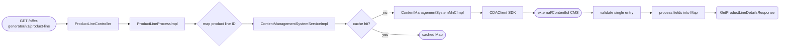
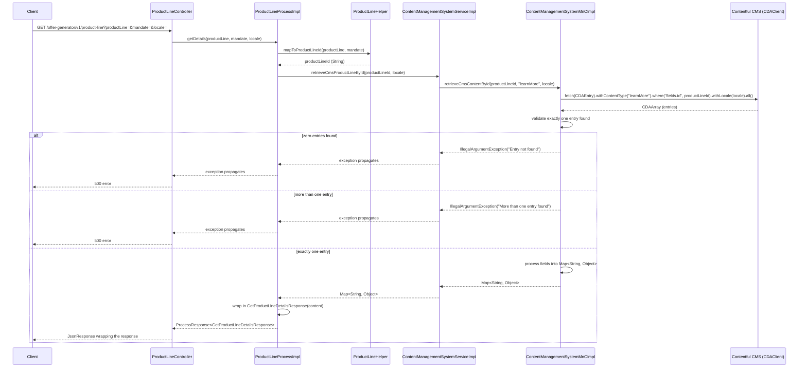

# Chain — ProductLineController · GET /product-line

<!-- scaffold — phase 1 -->

- **Action point** — `ProductLineController` (wpfe-am / ucc-offer-generator)
- **Kind** — rest-controller
- **Source** — `ucc-offer-generator/src/main/java/coba/wtp/wpfe/ucc/offer/generator/controller/ProductLineController.java`
- **Handler** — `getDetails(ProductLineEnum, ProductLineMandateEnum, String)` — `.../ProductLineController.java:32`
- **Trigger** — `GET /offer-generator/v1/product-line`
- **Preconditions** — none observed
- **First hop** — `ProductLineProcess.getDetails()` (wpfe-am / ucc-offer-generator)

<!-- analysis — phase 2 -->

## Story

As a **retail customer browsing the offer generator**, I want product line details (description, design, key features) served from CMS so that the UI can display structured content for the selected product line.

- **Given** a product line selection (`ProductLineEnum`), an optional mandate (`ProductLineMandateEnum`), and a locale
- **When** `GET /offer-generator/v1/product-line?productLine={productLine}&mandate={mandate}&locale={locale}` is called
- **Then** the CMS content for that product line entry is retrieved, processed, and returned as structured key-value pairs
- **Unless** no matching entry exists in CMS — rejected with an `IllegalArgumentException`

## Chain

```text
Branch 1 · primary
  ProductLineController
  → ProductLineProcessImpl
  → ContentManagementSystemServiceImpl
  → ContentManagementSystemMnCImpl
  ⇒ [external]  Contentful CMS via CDAClient SDK
```

- **Terminals reached** — `external` (Contentful CMS, via `wpfe-shared-cms / wpfe-shared`) · `none` (ProductLineHelper pure computation)

## Diagrams

### Process flow — primary



### Sequence — primary



## Journey

When **the trigger fires**, the request enters at **[step 1]** to handle **product line detail retrieval from CMS**. Once that completes, the flow moves to **[step 2]** because **the controller delegates business logic to the process layer**. From there, **[step 3]** takes over to **map the product line selection into a CMS entry ID**, and so on through every hop until the CMS content is returned.

1. **ProductLineController.getDetails** (wpfe-am / ucc-offer-generator)

   **Source.** `ucc-offer-generator/src/main/java/coba/wtp/wpfe/ucc/offer/generator/controller/ProductLineController.java:32`

   **Role.** Entry point for the product-line details endpoint. Accepts a required `productLine` enum, an optional `mandate` enum, and a `locale` string from request parameters, then delegates to the process layer.

   **Preconditions.** None observed — all three parameters come directly from HTTP query params; `mandate` is not required at the Spring level.

   **On failure.** Parameter binding failures (missing `productLine` or `locale`) produce a 400 Bad Request from Spring MVC. No explicit validation beyond that.

   **Downstream.** A `JsonResponse<GetProductLineDetailsResponse>` wrapping the CMS content map, returned to the caller as JSON.

2. **ProductLineProcessImpl.getDetails** (wpfe-am / ucc-offer-generator)

   **Source.** `ucc-offer-generator/src/main/java/coba/wtp/wpfe/ucc/offer/generator/process/impl/ProductLineProcessImpl.java:37`

   **Role.** Orchestrates the product line detail retrieval: maps the enum-based selection into a CMS entry ID, then fetches content from CMS.

   **Steps.**

   - **2.1 Map — product line to CMS entry ID** · `ProductLineHelper.java:14`

     **Role.** Converts the `ProductLineEnum` + optional `ProductLineMandateEnum` into a string key that matches a Contentful content entry's `fields.id`. The mapping is:

     | ProductLineEnum | MandateEnum | CMS Entry ID |
     |---|---|---|
     | `EFFICIENT` | — | `efficient-line` |
     | `EXCLUSIVE` | — | `exclusive-line` |
     | `EXPERT` | `ACTIVE_SELECTION` | `expert-active-line` |
     | `EXPERT` | `INDEX_SELECTION` | `expert-index-line` |
     | `EXPERT` | `SUSTAINABLE` | `expert-sustainability-line` |

     **Effect.** Produces a string like `"efficient-line"` used as the CMS lookup key.

   - **2.2 Fetch — CMS content by entry ID** · `ProductLineProcessImpl.java:43`

     **Role.** Calls `ContentManagementSystemService.retrieveCmsProductLineById(productLineId, locale)` to retrieve structured content from Contentful CMS for the mapped entry ID.

     **Downstream.** A `Map<String, Object>` containing all fields of the matching CMS entry, processed into a flat key-value structure.

3. **ContentManagementSystemServiceImpl.retrieveCmsProductLineById** (wpfe-am / ucc-offer-generator)

   **Source.** `ucc-offer-generator/src/main/java/coba/wtp/wpfe/ucc/offer/generator/service/impl/ContentManagementSystemServiceImpl.java:47`

   **Role.** Applies caching to CMS product line content retrieval, then delegates to the MnC layer. Uses a cache key of `{productLineId, locale}` on the `cmsProductLines` cache region.

   **On failure (cache miss).** Delegates to `ContentManagementSystemMnC.retrieveCmsContentById()` with contentType `"learnMore"` — the CMS content type for product line detail pages.

   **Effect.** On a cache miss, the result is stored in the `cmsProductLines` cache keyed by `{productLineId, locale}` so subsequent calls with the same key return cached data without hitting CMS.

4. **ContentManagementSystemMnCImpl.retrieveCmsContentById** (wpfe-shared / wpfe-shared-cms)

   **Source.** `wpfe-shared/wpfe-shared-cms/src/main/java/coba/wtp/wpfe/shared/cms/mnc/impl/ContentManagementSystemMnCImpl.java:45`

   **Role.** Fetches a single CMS entry from Contentful by ID and content type, validates the result count, then processes the entry's fields into a `Map<String, Object>`.

   **Steps.**

   - **4.1 Query — fetch entries from Contentful** · `ContentManagementSystemMnCImpl.java:47`

     **Role.** Calls `contentfulClient.fetch(CDAEntry.class).withContentType(contentType).where("fields.id", entryId).withLocale(locale).all()` to retrieve all entries matching the content type and ID filter for the given locale.

   - **4.2 Validate — exactly one entry** · `ContentManagementSystemMnCImpl.java:108`

     **Role.** Checks that the returned `CDAArray` contains exactly one entry. If zero, throws `IllegalArgumentException("Entry with id {entryId} and content type {contentType} not found in CMS")`. If more than one, throws `IllegalArgumentException("More than one entry found for id {entryId} and content type {contentType}")`.

     **On failure.** Both cases throw an unchecked exception that propagates up the call stack to the controller, resulting in a 500 error response.

   - **4.3 Process — single entry fields into Map** · `ContentManagementSystemMnCImpl.java:127`

     **Role.** Iterates over all field keys of the single `CDAEntry`, retrieves each field value localized to the requested locale, and processes it through `handleField()` which handles:

     - `String` — returned as-is
     - `List<?>` — recursively processed item-by-item
     - `CDARichDocument` — returns raw localized map
     - `CDAAsset` (images) — fetches image binary via API client, encodes to Base64 data URI
     - `CDAEntry` (nested entries) — recursively processes the nested entry

     **Effect.** A flat `Map<String, Object>` where each key is a field name and each value is the localized, processed content.

5. **CDAClient SDK call to Contentful CMS** (wpfe-shared / wpfe-shared-cms)

   **Source.** `ContentManagementSystemMnCImpl.java:47` — `contentfulClient.fetch(CDAEntry.class).withContentType(contentType).where("fields.id", entryId).withLocale(locale).all()`

   **Role.** Outbound HTTP call to Contentful's Delivery API using the official Java SDK (`com.contentful.java.cda.CDAClient`). The SDK constructs a GET request to `https://cdn.contentful.com/spaces/{space}/environments/master/entries?content_type={contentType}&fields.id[match]={entryId}&locale={locale}`.

   **Terminal — external** · Contentful CMS via CDAClient SDK (`wpfe-shared-cms / wpfe-shared`)

## Data reached

- **external — Contentful CMS (CDAClient SDK), via `ContentManagementSystemMnCImpl` (wpfe-shared / wpfe-shared-cms)**
  - Business problem solved — As the **product line detail process**, I need structured content describing a product line's introduction, cards, modalities, responsibilities, investment strategies, and additional information to be able to display that content in the offer generator UI. Therefore we call Contentful CMS at `GET /spaces/{space}/environments/master/entries?content_type={contentType}&fields.id[match]={entryId}&locale={locale}` to retrieve the product line entry. Then we process its fields into a flat map so the frontend can render structured sections — citing every file where that data actually gets used, even one this chain's own Journey never opens (`GetProductLineDetailsResponse.java:7`).

  - **Request path**
    ```json
    {
      "content_type": "learnMore",
      "fields.id[match]": "efficient-line",
      "locale": "en"
    }
    ```

    `content_type` — literal string `"learnMore"`, hardcoded in `ContentManagementSystemServiceImpl.java:45` as `CMS_PRODUCT_LINE_CONTENT_TYPE`.

    `fields.id[match]` — CMS entry ID, origin: mapped from `ProductLineEnum` + optional `ProductLineMandateEnum` via `ProductLineHelper.mapToProductLineId()` (Journey step 2.1). Example value: `"efficient-line"` for `EFFICIENT`, `"expert-active-line"` for `EXPERT(ACTIVE_SELECTION)`.

    `locale` — request parameter, origin: HTTP query param `?locale=...`. Example value: `"en"` or `"de"`.

  - **Request body** — none (GET request).

  - **Response fields used**
    ```json
    {
      "id": "efficient-line",
      "title": "Efficient Line",
      "description": "A low-cost, diversified portfolio strategy...",
      "cards": [
        {"heading": "Key Features", "text": "Diversified across asset classes"}
      ],
      "modalities": {
        "minInvestmentAmount": 1000,
        "currency": "EUR"
      },
      "investmentStrategies": [
        {"name": "Growth", "riskLevel": "Medium-High"}
      ]
    }
    ```

    Example values inferred from the CMS content model used by `ContentManagementSystemMnCImpl.handleSingleEntry()` at `wpfe-shared/wpfe-shared-cms/src/main/java/coba/wtp/wpfe/shared/cms/mnc/impl/ContentManagementSystemMnCImpl.java:127`. The actual field names depend on the Contentful content type `learnMore` — the trace confirms all fields are returned as a flat map.

  - **Response fields discarded** — all other fields of the CMS entry not consumed by this chain. The entire map is passed through to the response, so no individual fields are explicitly discarded; however, Contentful system fields like `sys.createdAt`, `sys.updatedAt`, and `sys.version` are present in the raw SDK response but not forwarded (the code iterates only over `entry.rawFields()` keys).

## Acceptance Criteria

1. **Valid product line selection returns CMS content** — Given a valid `productLine` enum value, an optional mandate, and a locale, when `GET /offer-generator/v1/product-line` is called, then the response contains a `JsonResponse` wrapping a `GetProductLineDetailsResponse` whose `content` field is a non-empty `Map<String, Object>` with CMS entry fields.
   - Evidence: `ProductLineController.java:32-40`, `ProductLineProcessImpl.java:37-46`
   - How to: read the controller handler end to end and confirm it delegates to `productLineProcess.getDetails()` which maps the product line ID and calls `cmsService.retrieveCmsProductLineById()`. To reproduce: call `GET /offer-generator/v1/product-line?productLine=EFFICIENT&locale=en` and assert on the response body that `content` is a non-empty map.

2. **EXPERT product line routes to mandate-specific entry** — Given `productLine=EXPERT` with `mandate=ACTIVE_SELECTION`, when the endpoint is called, then the CMS lookup uses entry ID `"expert-active-line"` (not `"efficient-line"`).
   - Evidence: `ProductLineHelper.java:14-23`
   - How to: read the switch expression in `mapToProductLineId()` and confirm that `EXPERT(ACTIVE_SELECTION)` maps to `EXPERT_ACTIVE_SELECTION_ID` which is `"expert-active-line"`. To reproduce: call with `productLine=EXPERT&mandate=ACTIVE_SELECTION&locale=en` and verify the CMS query targets the expert-active content type.

3. **No matching CMS entry returns 500** — Given a product line ID that does not exist in Contentful CMS, when the endpoint is called, then an `IllegalArgumentException` is thrown by `ContentManagementSystemMnCImpl.internalRetrieveById()` and propagates as a 500 error.
   - Evidence: `wpfe-shared/wpfe-shared-cms/src/main/java/coba/wtp/wpfe/shared/cms/mnc/impl/ContentManagementSystemMnCImpl.java:108`
   - How to: open the validation block at line 108 and confirm that zero entries triggers `throw new IllegalArgumentException("Entry with id ... not found in CMS")`. Confirm no catch block exists up the call stack (`Service`, `Process`, `Controller` all propagate unchecked). To reproduce: call with a product line whose entry ID does not exist in Contentful.

4. **Multiple matching entries returns 500** — Given more than one CMS entry matches the same ID and content type, when the endpoint is called, then an `IllegalArgumentException` is thrown.
   - Evidence: `wpfe-shared/wpfe-shared-cms/src/main/java/coba/wtp/wpfe/shared/cms/mnc/impl/ContentManagementSystemMnCImpl.java:112`
   - How to: read line 112 and confirm the check for `entries.total() > 1` throws with message `"More than one entry found..."`. To reproduce: create duplicate entries in Contentful CMS with the same ID.

5. **Cached response served on repeat calls** — Given a product line detail was previously fetched, when the same endpoint is called again with identical `{productLineId, locale}`, then the cached `Map<String, Object>` is returned without calling Contentful CMS.
   - Evidence: `ContentManagementSystemServiceImpl.java:46` — `@Cacheable(value = "cmsProductLines", key = "{#productLineId, #locale}")`
   - How to: read the `@Cacheable` annotation on `retrieveCmsProductLineById()` and confirm the cache region is `cmsProductLines` with a composite key. To reproduce: call the endpoint twice with identical parameters and observe that only one CMS request occurs.

6. **Image assets are Base64-encoded data URIs** — Given a CMS entry contains image fields (`CDAAsset`), when the content is processed, then each image is fetched from Contentful, read as binary, and encoded into a `data:...;charset=utf-8;base64,...` string.
   - Evidence: `wpfe-shared/wpfe-shared-cms/src/main/java/coba/wtp/wpfe/shared/cms/mnc/impl/ContentManagementSystemMnCImpl.java:157-172`
   - How to: read `handleImageField()` and confirm it calls `contentManagementSystemApiClient.retrieveCmsImage(assetUrl)` for the image binary, then constructs a Base64 data URI with prefix `"data:"` + content type + `";charset=utf-8;base64,"`. To reproduce: call the endpoint with a product line entry that contains images and verify image fields contain Base64-encoded strings.

## Business Takeaways

**Restatement only.** Every line here cites a fact already established earlier in this same file. No source file is opened for this section.

- **What this does for the business** — retrieves structured product line content (descriptions, cards, modalities, investment strategies) from Contentful CMS and serves it to the offer generator UI, enabling non-developer management of product line marketing content through a CMS.
- **Depends on** — Contentful CMS (external, read-only), cached via Spring `@Cacheable` on `cmsProductLines`
- **Ingredients** — `productLine` (request param, required), `mandate` (request param, optional), `locale` (request param, required)
- **Preparation** — map the product line enum + mandate to a CMS entry ID (`efficient-line`, `exclusive-line`, or one of three expert variants)
- **Dish** — `GetProductLineDetailsResponse(content)` wrapping a flat `Map<String, Object>` of all CMS fields for that product line

---

Also reached by: [get-modules-modules-controller](../chain-traces/get-modules-modules-controller.md) (same `ContentManagementSystemServiceImpl` and `ContentManagementSystemMnCImpl` used for module content retrieval)

