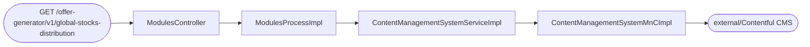
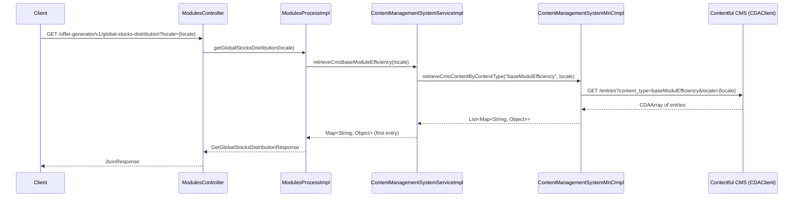

# Chain — ModulesController · GET /global-stocks-distribution

<!-- scaffold — phase 1 -->

- **Action point** — `ModulesController` (wpfe-am / ucc-offer-generator)
- **Kind** — rest-controller
- **Source** — `ucc-offer-generator/src/main/java/coba/wtp/wpfe/ucc/offer/generator/controller/ModulesController.java`
- **Handler** — `getGlobalStocksDistribution(String)` — `.../ModulesController.java:88`
- **Trigger** — `GET /offer-generator/v1/global-stocks-distribution`
- **Preconditions** — none observed
- **First hop** — `ModulesProcess.getGlobalStocksDistribution()` (wpfe-am / ucc-offer-generator)

<!-- analysis — phase 2 -->

## Story

As a **retail customer viewing the offer generator**, I want to see how global stocks are distributed across market capitalization, GDP-weighted, and equally weighted methods so that I can understand the portfolio's geographic equity allocation.

- **Given** an active advisory session with a valid locale
- **When** `GET /offer-generator/v1/global-stocks-distribution` is called with a `locale` parameter
- **Then** the system retrieves the base module efficiency data from Contentful CMS and returns it as a map of global stocks distribution
- **Unless** no entries exist for the "baseModulEfficiency" content type — an error is returned

## Chain

```text
Branch 1 · primary
  ModulesController
  → ModulesProcessImpl
  → ContentManagementSystemServiceImpl
  → ContentManagementSystemMnCImpl
  ⇒ [external]  Contentful CMS via CDAClient SDK
```

- **Terminals reached** — `external` (Contentful CMS, via `CDAClient` in `wpfe-shared / wpfe-shared-cms`)

## Diagrams

### Process flow — primary



### Sequence — primary



## Journey

When the **offer generator UI calls** `GET /offer-generator/v1/global-stocks-distribution?locale={locale}`, the request enters at step 1 to retrieve global stocks distribution data. Once that completes, the flow moves through each hop until the CMS response is assembled and returned.

Below is each step in call order — what it does, why it exists, how it handles failure, and what passes the baton forward.

1. **ModulesController.getGlobalStocksDistribution(String locale)** (wpfe-am / ucc-offer-generator)

   **Source.** `ucc-offer-generator/src/main/java/coba/wtp/wpfe/ucc/offer/generator/controller/ModulesController.java:88`

   **Role.** REST endpoint that accepts a locale parameter and delegates to the process layer to retrieve global stocks distribution data, then wraps the result in a JSON response.

   **Preconditions.** None observed — no authentication or session validation is enforced at this handler level.

   **On failure.** Any exception propagates up through Spring's default error handling; no explicit try-catch is present.

   **Downstream.** `ProcessResponse<GetGlobalStocksDistributionResponse>` from the process layer, wrapped in a `JsonResponse` for the client.

2. **ModulesProcessImpl.getGlobalStocksDistribution(String locale)** (wpfe-am / ucc-offer-generator)

   **Source.** `ucc-offer-generator/src/main/java/coba/wtp/wpfe/ucc/offer/generator/process/impl/ModulesProcessImpl.java:79`

   **Role.** Orchestrates the retrieval of global stocks distribution by calling the CMS service to fetch base module efficiency data, then wraps it in a response DTO.

   **On failure.** If the CMS service throws (e.g., no entries found), the exception propagates up — no fallback is implemented here.

   **Effect.** Constructs `GetGlobalStocksDistributionResponse` wrapping the map returned by the CMS service.

   **Downstream.** A `ProcessResponse<GetGlobalStocksDistributionResponse>` containing a single `Map<String, Object>` with the base module efficiency data.

3. **ContentManagementSystemServiceImpl.retrieveCmsBaseModuleEfficiency(String locale)** (wpfe-am / ucc-offer-generator)

   **Source.** `ucc-offer-generator/src/main/java/coba/wtp/wpfe/ucc/offer/generator/service/impl/ContentManagementSystemServiceImpl.java:53`

   **Role.** Retrieves all entries of content type "baseModulEfficiency" from Contentful CMS via the MnC, then returns only the first entry since there is exactly one base module efficiency record. The call is cached under the key `{locale}`.

   **Preconditions.** `CMS_BASE_MODULE_EFFICIENCY_CONTENT_TYPE` constant equals `"baseModulEfficiency"` — this content type must exist in Contentful CMS.

   **On failure.** If no entries are found for the content type, `ContentManagementSystemMnCImpl.internalRetrieveByContentType()` throws `IllegalArgumentException("No entries found for content type baseModulEfficiency")`. The Spring cache (`@Cacheable`) does not intercept on exception — subsequent calls will re-attempt.

   **Effect.** Returns only the first entry from the CMS result list, discarding any additional entries that might exist.

   **Downstream.** A `Map<String, Object>` containing the fields of the single base module efficiency entry.

4. **ContentManagementSystemMnCImpl.retrieveCmsContentByContentType(String contentType, String locale)** (wpfe-shared / wpfe-shared-cms)

   **Source.** `wpfe-shared/wpfe-shared-cms/src/main/java/coba/wtp/wpfe/shared/cms/mnc/impl/ContentManagementSystemMnCImpl.java:67`

   **Role.** Fetches all entries of a given content type from Contentful CMS using the CDAClient, then processes each entry into a map of field names to values. Throws `IllegalArgumentException` if no entries are found.

   **On failure.** If `entries.total() == 0`, throws `IllegalArgumentException("No entries found for content type {contentType}")`. No retry or fallback — the caller receives an exception.

   **Effect.** Maps each `CDAEntry` through `handleSingleEntry()` which processes fields: strings pass through, lists recurse, rich documents yield raw locale-mapped values, assets become Base64-encoded data URIs, and nested entries are processed recursively. Unsupported field types throw `UnsupportedOperationException`.

   **Downstream.** A `List<Map<String, Object>>` where each map contains the entry's fields with their localized, processed values.

5. **CDAClient.fetch(CDAEntry.class).withContentType(contentType).withLocale(locale).all()** (wpfe-shared / wpfe-shared-cms)

   **Source.** `wpfe-shared/wpfe-shared-cms/src/main/java/coba/wtp/wpfe/shared/cms/mnc/impl/ContentManagementSystemMnCImpl.java:70`

   **Role.** Makes an HTTP GET request to the Contentful CMS API to retrieve all entries matching the given content type and locale. The `CDAClient` is from the Contentful Java SDK (`com.contentful.java.cda`).

   **On failure.** Network errors, authentication failures, or invalid responses propagate as exceptions from the Contentful SDK. No retry logic exists in this layer.

   **Terminal — external** (Contentful CMS via CDAClient SDK)

## Data reached

- **external — Contentful CMS (CDAClient SDK), via `CDAClient` (wpfe-shared / wpfe-shared-cms)**
  - Business problem solved — As the **offer generator process**, I need the base module efficiency data from Contentful CMS to be able to present global stocks distribution information to the customer. Therefore we call the Contentful API at `GET /entries?content_type=baseModulEfficiency&locale={locale}` to retrieve all entries of that content type. Then we take only the first entry and map its fields into a `Map<String, Object>`, so we can return the global stocks distribution data in the offer overview (`ContentManagementSystemMnCImpl.java:70`).

  - **Request path**
    ```json
    {
      "content_type": "baseModulEfficiency",
      "locale": "en"
    }
    ```

  - **Request path** (continued)
    `content_type` — constant value `"baseModulEfficiency"`, defined in `ContentManagementSystemServiceImpl.java:20`.
    `locale` — request parameter from the client, e.g. `"en"` or `"de"`.

  - **Request body** — none (GET request).

  - **Response fields used**
    ```json
    {
      "fields": {
        "id": "global-stocks-distribution",
        "marketCapWeighted": [
          {"region": "North America", "percentage": 45.2}
        ],
        "gdpWeighted": [
          {"region": "Asia Pacific", "percentage": 38.7}
        ],
        "equallyWeighted": [
          {"region": "Europe", "percentage": 33.1}
        ]
      }
    }
    ```

  - **Response fields used** (continued)
    All fields from the first entry of content type `baseModulEfficiency` are returned as a flat map. Example values inferred from Contentful CMS content model for base module efficiency entries.

  - **Response fields discarded** — any additional entries beyond the first one in the CDAArray result, since only `results.getFirst()` is returned (`ContentManagementSystemServiceImpl.java:57`).

## Acceptance Criteria

1. **Valid locale returns global stocks distribution data from CMS** — Given a valid locale parameter and an existing "baseModulEfficiency" entry in Contentful CMS, when `GET /offer-generator/v1/global-stocks-distribution` is called, then the response contains a `GetGlobalStocksDistributionResponse` with a non-null `content` map populated from the first matching CMS entry.
   - Evidence: `ModulesProcessImpl.java:79-84`, `ContentManagementSystemServiceImpl.java:53-58`, `ContentManagementSystemMnCImpl.java:67-72`
   - How to: call the endpoint with `locale=en` and assert that the response body contains a non-empty map under the `content` field; verify from Contentful CMS that an entry of content type "baseModulEfficiency" exists.

2. **Missing CMS entries produce an error** — Given no entries exist for content type "baseModulEfficiency" in Contentful CMS, when the endpoint is called, then a 500-level error is returned because `ContentManagementSystemMnCImpl.internalRetrieveByContentType()` throws `IllegalArgumentException`.
   - Evidence: `ContentManagementSystemMnCImpl.java:93`
   - How to: delete or hide all "baseModulEfficiency" entries in Contentful CMS, call the endpoint, and confirm a 5xx response is returned with an error message referencing the missing content type.

3. **Response contains only the first entry** — Given multiple entries exist for content type "baseModulEfficiency", when the endpoint is called, then only the first entry's fields are included in the response map.
   - Evidence: `ContentManagementSystemServiceImpl.java:57` — `results.getFirst()`
   - How to: create two entries of content type "baseModulEfficiency" in Contentful CMS, call the endpoint, and confirm only one set of fields appears in the response.

4. **Cache is keyed by locale** — Given a successful call with `locale=en`, when the same call is repeated within the cache TTL, then the CDAClient is not invoked again.
   - Evidence: `ContentManagementSystemServiceImpl.java:52` — `@Cacheable(value = "cmsBaseModuleEfficiency", key = "#locale")`
   - How to: enable Spring Cache debug logging, call the endpoint twice with the same locale, and confirm only one CDAClient fetch occurs.

## Business Takeaways

- **What this does for the business** — retrieves global stocks distribution data (market capitalization weighted, GDP weighted, equally weighted) from Contentful CMS so that the offer generator can present portfolio allocation information to customers during their advisory session.
- **Depends on** — Contentful CMS (external), specifically entries of content type "baseModulEfficiency"
- **Ingredients** — `locale` (request parameter)
- **Preparation** — fetch all base module efficiency entries from Contentful, take the first one
- **Dish** — a map of field names to values representing global stocks distribution data
---

