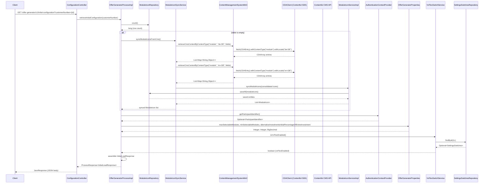

# Chain — ConfigurationController · GET /initial-configuration

<!-- scaffold — phase 1 -->

- **Action point** — `ConfigurationController` (wpfe-am / ucc-offer-generator)
- **Kind** — rest-controller
- **Source** — `ucc-offer-generator/src/main/java/coba/wtp/wpfe/ucc/offer/generator/controller/ConfigurationController.java`
- **Handler** — `getInitialConfiguration(String)` — `.../ConfigurationController.java:34`
- **Trigger** — `GET /offer-generator/v1/initial-configuration`
- **Preconditions** — none observed
- **First hop** — `OfferGeneratorProcess.retrieveInitialConfiguration()` (wpfe-am / ucc-offer-generator)

<!-- analysis — phase 2 -->

## Story

As a **retail customer or bank advisor opening the offer generator**, I want the application to receive its initial configuration so that it can render the correct number of selectable modules, know whether VV Flex is enabled, and determine if the session is an online banking session.

- **Given** a request carrying an optional `customerNumber` query parameter and a pre-authenticated Spring Security ticket
- **When** `GET /offer-generator/v1/initial-configuration?customerNumber={customerNumber}` is called
- **Then** the response contains module selection limits, the VV Flex feature flag, and whether the session has an online participant — all assembled from configuration properties, a database switch, and the security context
- **Unless** the ModuleIcon table is empty (e.g. after deployment), in which case it first syncs module icons from Contentful CMS before returning the response

## Chain

```text
Branch 1 · primary
  ConfigurationController.getInitialConfiguration(customerNumber)
  → OfferGeneratorProcessImpl.retrieveInitialConfiguration(customerNumber)
    → ModuleIconRepository.count()
      ⇒ [db] MODULE_ICON
    → AuthenticationContextProvider.getParticipantIdentifier()
      ⇒ [none]
    → OfferGeneratorProperties (Spring Boot @ConfigurationProperties)
      ⇒ [none]
    → VvFlexSwitchServiceImpl.isVvFlexEnabled()
      → SettingsSwitchesRepository.findById(1L)
        ⇒ [db] SETTINGS_SWITCHES
  ⇒ [external] Contentful CMS API, via CDAClient (wpfe-shared / cms)
```

- **Terminals reached** — `db` (`MODULE_ICON`, `SETTINGS_SWITCHES`), `none` (security context read, configuration properties), `external` (Contentful CMS API, via `CDAClient` in wpfe-shared / cms)

## Diagrams

### Process flow — primary

```mermaid
flowchart LR
  A([GET /offer-generator/v1/initial-configuration]) --> B[ConfigurationController]
  B --> C[OfferGeneratorProcessImpl.retrieveInitialConfiguration]
  C --> D{ModuleIcon table empty?}
  D -- yes --> E[ModuleIconRepository.count]
  E --> F[(MODULE_ICON)]
  F --> G[ModuleIconSyncService.syncModuleIconsFromCms]
  G --> H[ContentManagementSystemMnC.retrieveCmsContentByContentType]
  H --> I[CDAClient.fetch - Contentful SDK]
  I --> J([external/Contentful CMS API])
  J --> K[ModuleIconServiceImpl.syncModuleIcons]
  K --> L[(MODULE_ICON)]
  L --> M[return synced icons]
  D -- no --> N[AuthenticationContextProvider.getParticipantIdentifier]
  N --> O([none - security context read])
  D -- yes after sync --> P[OfferGeneratorProperties]
  P --> Q([none - config properties])
  D -- no --> R[VvFlexSwitchServiceImpl.isVvFlexEnabled]
  R --> S[SettingsSwitchesRepository.findById]
  S --> T[(SETTINGS_SWITCHES)]
  T --> U([none - cached db read])
  N --> V[assemble InitialLoadResponse]
  P --> V
  Q --> V
  R --> V
  U --> V
  V --> W([InitialLoadResponse JSON])
```



### Sequence — primary



## Journey

When the **offer generator frontend** fires a GET request to load its initial state, the request enters at step 1 to handle retrieving the application's startup configuration. Once that completes, the flow moves through each data source until the response is assembled.

Below is each step in call order — what it does, why it exists, how it handles failure, and what passes the baton forward.

1. **ConfigurationController.getInitialConfiguration(String customerNumber)** (wpfe-am / ucc-offer-generator)

   **Source.** `ucc-offer-generator/src/main/java/coba/wtp/wpfe/ucc/offer/generator/controller/ConfigurationController.java:34`

   **Role.** REST entry point that delegates to the process layer and wraps the result in a `JsonResponse`. The `customerNumber` parameter is optional — it is passed through but not used by this endpoint's own logic.

   **Preconditions.** Spring Security must have already authenticated the request; the `@PreAuthorize` annotation is on the process method, not the controller, so the controller itself enforces nothing beyond what Spring MVC provides.

   **Effect.** Returns a JSON response containing the initial configuration payload.

   **Downstream.** `OfferGeneratorProcessImpl.retrieveInitialConfiguration(customerNumber)`

2. **OfferGeneratorProcessImpl.retrieveInitialConfiguration(String customerNumber)** (wpfe-am / ucc-offer-generator)

   **Source.** `ucc-offer-generator/src/main/java/coba/wtp/wpfe/ucc/offer/generator/process/impl/OfferGeneratorProcessImpl.java:83`

   **Role.** Orchestrates the initial configuration assembly: checks whether module icons need syncing from CMS, reads the customer's participant identifier from the security context, fetches configurable module selection limits and percentages from Spring Boot properties, and determines whether the VV Flex feature is enabled. Assembles all values into an `InitialLoadResponse`.

   **Preconditions.** `@PreAuthorize("protectWith('WPFE_AM_OG_READ', {'internalCustomerNumber': #customerNumber})")` — the caller must hold the `WPFE_AM_OG_READ` permission for the given customer number. This is enforced by Spring Security's method-level authorization.

   **Steps.**

   - **2.1 Check — ModuleIcon table emptiness** · `OfferGeneratorProcessImpl.java:86`

     **Role.** Calls `moduleIconRepository.count()` to determine whether the MODULE_ICON database table has any rows. This is a deployment-safety check: after deploying to a new stage or running locally, the icon table may be empty and needs seeding from CMS.

     **On failure.** The count returns 0L if the table is empty; no exception is thrown — it is a simple row-count query through JPA.

     **Effect.** If the count is zero, triggers a full sync of module icons from Contentful CMS (step 2.2). If non-zero, skips directly to step 2.3.

   - **2.2 Sync — ModuleIcon table from CMS** · `OfferGeneratorProcessImpl.java:89`

     **Role.** Calls `moduleIconSyncService.syncModuleIconsFromCms()` to populate the MODULE_ICON table with icon data retrieved from Contentful CMS for both German (de-DE) and English (en-GB) locales. This is a one-time seeding operation per deployment.

     **On failure.** Each locale's CMS fetch is wrapped in its own try/catch — if fetching de-DE fails, en-GB still proceeds, and vice versa. Errors are logged but do not abort the overall flow; partial data (one locale only) is still saved to the database.

     **Effect.** Writes or updates ModuleIcon entities with icon bytes, names, helper texts, and translations into MODULE_ICON via `ModuleIconServiceImpl.syncModuleIcons()`.

   - **2.3 Resolve — participant identifier** · `OfferGeneratorProcessImpl.java:91`

     **Role.** Reads the pre-authenticated Spring Security ticket from the thread-local security context to determine whether this session belongs to an online banking participant (TNVEKENN user id type) or a branch advisor (COMSIID). Extracts the participant value if present.

     **Effect.** Produces `hasOnlineParticipant` — a boolean used by the frontend to decide which UI variant to render.

   - **2.4 Assemble — InitialLoadResponse** · `OfferGeneratorProcessImpl.java:95`

     **Role.** Constructs an `InitialLoadResponse` carrying five values:
       1. `maxSelectableModules` from `OfferGeneratorProperties.maxSelectableModules()`
       2. `minSelectableModules` from `OfferGeneratorProperties.minSelectableModules()`
       3. `alternativeInvestmentsInitialPercentageOfEntireInvestment` from `OfferGeneratorProperties.alternativeInvestmentsInitialPercentageOfEntireInvestment()`
       4. `vvFlexEnabled` from `VvFlexSwitchServiceImpl.isVvFlexEnabled()`
       5. `hasOnlineParticipant` from the security context resolution

     **Downstream.** Returned to the controller, which wraps it in a `JsonResponse`.

3. **ModuleIconRepository.count()** (wpfe-am / ucc-offer-generator)

   **Source.** `ucc-offer-generator/src/main/java/coba/wtp/wpfe/ucc/offer/generator/repository/ModuleIconRepository.java:17` (inherited from `JpaRepository<ModuleIcon, String>`) — the `count()` method is a Spring Data JPA built-in.

   **Role.** Counts all rows in the MODULE_ICON table to determine whether module icons have been seeded. This is a read-only query with no custom JPQL — it uses the default JPA count implementation.

   **Effect.** Returns a `long` representing the row count.

   **Terminal — db** · MODULE_ICON table via Spring Data JPA `JpaRepository.count()`

4. **ModuleIconSyncService.syncModuleIconsFromCms()** (wpfe-am / ucc-offer-generator)

   **Source.** `ucc-offer-generator/src/main/java/coba/wtp/wpfe/ucc/offer/generator/service/impl/ModuleIconSyncServiceImpl.java:52`

   **Role.** Iterates over two CMS locales (de-DE and en-GB), fetches module icon content from Contentful CMS for each, maps the raw CMS data into `ModuleIcon` entities with translations, consolidates them by moduleId so each icon carries both locale's translation, then persists the consolidated set to the database.

   **Steps.**

   - **4.1 Fetch — CMS content for de-DE** · `ModuleIconSyncServiceImpl.java:58`

     **Role.** Calls `contentManagementSystemMnC.retrieveCmsContentByContentType("module", "de-DE", fields)` to retrieve module icon entries from Contentful CMS. The fields requested are `fields.id`, `fields.name`, `fields.icon`, and `fields.helperText`.

     **On failure.** Caught by the try/catch at line 60; error is logged with locale context, and processing continues to en-GB.

   - **4.2 Fetch — CMS content for en-GB** · `ModuleIconSyncServiceImpl.java:58`

     **Role.** Same as step 4.1 but for the "en-GB" locale.

     **On failure.** Caught and logged identically to step 4.1.

   - **4.3 Map — CMS entries to ModuleIcon entities** · `ModuleIconSyncServiceImpl.java:62`

     **Role.** For each CMS entry, extracts moduleId, icon bytes (Base64-decoded from the CMS response), name, and helper text using `ModuleIconSyncHelper`, then constructs a `ModuleIcon` entity with one `ModuleIconTranslation` for the current locale.

   - **4.4 Consolidate — merge translations by moduleId** · `ModuleIconSyncServiceImpl.java:78`

     **Role.** Groups all fetched icons by their moduleId, merging translation lists so each resulting ModuleIcon carries both de-DE and en-GB translations. If the same moduleId appears in both locales (which it should), the translations are combined.

   - **4.5 Persist — save consolidated icons to database** · `ModuleIconSyncServiceImpl.java:86`

     **Role.** Calls `moduleIconService.syncModuleIcons(moduleIconsWithAllLocales)` which performs an upsert: existing ModuleIcons are updated with new icon bytes and merged translations, new ones are inserted, and absent ones (no longer in CMS) are deleted.

5. **ContentManagementSystemMnC.retrieveCmsContentByContentType(String contentType, String locale, String[] fields)** (wpfe-shared / cms)

   **Source.** `wpfe-shared-cms/src/main/java/coba/wtp/wpfe/shared/cms/mnc/impl/ContentManagementSystemMnCImpl.java:63`

   **Role.** Maps the request to a Contentful SDK call. Uses `CDAClient.fetch(CDAEntry.class).withContentType(contentType).where("fields.id", entryId).select(fields).withLocale(locale).all()` to query Contentful's API for entries matching the given content type, locale, and field selection.

   **Effect.** Returns a list of maps where each map represents one CMS entry with its fields as key-value pairs. The CDAClient from `com.contentful.java.cda` handles the actual HTTP communication to Contentful's REST API.

   **Downstream.** Raw CMS data passed back through ModuleIconSyncService for entity mapping and persistence.

6. **CDAClient (Contentful SDK) — outbound call** (wpfe-shared / cms)

   **Source.** `com.contentful.java.cda.CDAClient` — third-party library, not in workspace source.

   **Role.** Makes HTTP GET requests to the Contentful Content Delivery API (`https://cdn.contentful.com/spaces/{space}/environments/master/entries?content_type={contentType}&locale={locale}`) to retrieve entry data. The SDK handles authentication via an API key configured at application startup, request serialization, and response deserialization into `CDAArray` objects.

   **On failure.** If the HTTP call fails (network error, 4xx/5xx from Contentful), the CDAClient throws a runtime exception which is caught by the try/catch in step 4.1 or 4.2 of ModuleIconSyncServiceImpl.

   **Terminal — external** · Contentful CMS API via `CDAClient` (wpfe-shared / cms)

7. **ModuleIconServiceImpl.syncModuleIcons(List<ModuleIcon>)** (wpfe-am / ucc-offer-generator)

   **Source.** `ucc-offer-generator/src/main/java/coba/wtp/wpfe/ucc/offer/generator/service/impl/ModuleIconServiceImpl.java:40`

   **Role.** Performs a full upsert of module icons against the database. Loads all existing icons with their translations, then for each incoming icon either updates an existing one (merging translations) or inserts a new one. Also deletes any existing icons whose moduleId no longer appears in the input list. Runs inside a `@Transactional` boundary.

   **Steps.**

   - **7.1 Load — all existing icons** · `ModuleIconServiceImpl.java:43`

     **Role.** Calls `moduleIconRepository.findAllWithTranslations()` which executes a JPQL query with `left join fetch mi.translations` to load each ModuleIcon and its associated translations in a single query.

   - **7.2 Update or insert — per moduleId** · `ModuleIconServiceImpl.java:46`

     **Role.** For each incoming icon, checks if the moduleId already exists. If yes, calls `updateExistingModuleIcon()` to merge new icon bytes and translations into the existing entity. If no, adds it to an "icons to create" list.

   - **7.3 Persist — save all new icons** · `ModuleIconServiceImpl.java:54`

     **Role.** Calls `moduleIconRepository.saveAll(iconsToCreate)` for any newly created icons.

   - **7.4 Delete — absent module IDs** · `ModuleIconServiceImpl.java:62`

     **Role.** Identifies existing icons whose moduleId is not in the incoming list and calls `moduleIconRepository.deleteAll()` to remove them, keeping the database in sync with CMS.

8. **AuthenticationContextProvider.getParticipantIdentifier()** (wpfe-shared / frontend)

   **Source.** `wpfe-shared-frontend/src/main/java/coba/wtp/wpfe/shared/frontend/util/authentication/ctx/AuthenticationContextProvider.java:215`

   **Role.** Reads the pre-authenticated Spring Security ticket from the thread-local `SecurityContextHolder`. If the ticket's user id type is "TNVEKENN" (online banking participant), it extracts the first segment of the user id as the participant identifier. If the type is "COMSIID" (branch advisor with a person in context), it reads the participant ID from the PersonContext. Returns `Optional.empty()` if neither condition holds.

   **On failure.** No exception path — returns an empty Optional if no authenticated ticket exists or if the ticket does not carry a recognizable user id type.

   **Effect.** Produces a `ParticipantIdentifier` whose `.getValue()` is checked for null/blank to determine `hasOnlineParticipant`.

9. **OfferGeneratorProperties** (wpfe-am / ucc-offer-generator)

   **Source.** `ucc-offer-generator/src/main/java/coba/wtp/wpfe/ucc/offer/generator/configuration/OfferGeneratorProperties.java:20`

   **Role.** Spring Boot `@ConfigurationProperties` bound to the prefix `application.offer-generator`. Provides three configuration values used in the initial load response:
     - `maxSelectableModules` — maximum number of modules a customer can select
     - `minSelectableModules` — minimum number of modules required
     - `alternativeInvestmentsInitialPercentageOfEntireInvestment` — default weight for alternative investment modules

   **Effect.** Values are read directly from the Spring environment (application.yml / application.properties) at the time the bean is instantiated. No database or external call involved.

10. **VvFlexSwitchServiceImpl.isVvFlexEnabled()** (wpfe-am / ucc-offer-generator)

    **Source.** `ucc-offer-generator/src/main/java/coba/wtp/wpfe/ucc/offer/generator/service/impl/VvFlexSwitchServiceImpl.java:32`

    **Role.** Reads the VV Flex feature toggle from the SETTINGS_SWITCHES database table. The method is annotated with `@Cacheable(value = "vvFlexEnabled", cacheManager = "settingsSwitchesCacheManager")` so repeated calls within a cache TTL hit the Spring cache rather than the database. If no row exists for ID=1, defaults to `false` (disabled).

    **On failure.** If the SETTINGS_SWITCHES row is missing, logs a warning and returns `false`. No exception propagates.

    **Effect.** Returns a boolean indicating whether VV Flex functionality is enabled in this environment.

11. **SettingsSwitchesRepository.findById(Long)** (wpfe-am / wpfe-am-commons)

    **Source.** `wpfe-am-commons/src/main/java/coba/wtp/wpfe/am/commons/repository/SettingsSwitchesRepository.java:14` (inherited from `JpaRepository<SettingsSwitches, Long>`)

    **Role.** Standard JPA repository lookup by primary key. Queries the SETTINGS_SWITCHES table for the single row with ID = 1L (defined as `SETTINGS_ROW_ID`). Returns an `Optional<SettingsSwitches>`.

    **Effect.** The caller reads `.getVvFlexEnabled()` from the returned entity to determine the feature flag state.

    **Terminal — db** · SETTINGS_SWITCHES table via Spring Data JPA `JpaRepository.findById(Long)`

12. **ConfigurationController.getInitialConfiguration returns JsonResponse** (wpfe-am / ucc-offer-generator)

    **Source.** `ucc-offer-generator/src/main/java/coba/wtp/wpfe/ucc/offer/generator/controller/ConfigurationController.java:37`

    **Role.** Wraps the `ProcessResponse<InitialLoadResponse>` from the process layer into a `JsonResponse` using `JsonResponseBuilder.buildJsonResultResponse()`, which serializes it to JSON for the HTTP response body.

    **Terminal — external** · The HTTP response is returned to the caller (offer generator frontend or themenblock host). No further outbound calls are made.

## Data reached

- **db — MODULE_ICON, via `ModuleIconRepository` (wpfe-am / ucc-offer-generator)**
  - Business problem solved — As the **initial configuration process**, I need to know whether module icons have been seeded in the database so that I can trigger a CMS sync if needed. Therefore we query `MODULE_ICON` via `ModuleIconRepository.count()` to check for any existing rows, and later via `findAllWithTranslations()` / `saveAll()` / `deleteAll()` during the upsert operation (`OfferGeneratorProcessImpl.java:86`, `ModuleIconServiceImpl.java:43-72`).

  - **Query** — `count()` (read-only row count) and `findAllWithTranslations()` (JPQL with `left join fetch mi.translations`) — both read operations; writes occur via `saveAll()` and `deleteAll()` during the sync path.

  - **Argument** — none for `count()`; no argument for `findAllWithTranslations()`.

  - **Response fields used** — The count returns a `long` row count. The `findAllWithTranslations()` query returns `ModuleIcon` entities with their `translations` collection eagerly loaded, including `moduleId`, `icon` (byte[]), and translation rows (`moduleId`, `lang`, `name`, `helperText`).

  - **Response fields discarded** — none explicitly; the JPQL fetch-join loads all columns of both tables.

- **db — SETTINGS_SWITCHES, via `SettingsSwitchesRepository` (wpfe-am / wpfe-am-commons)**
  - Business problem solved — As the **VV Flex feature check**, I need to know whether the VV Flex functionality is enabled in this environment so that the frontend can render the correct UI variant. Therefore we query `SETTINGS_SWITCHES` via `SettingsSwitchesRepository.findById(1L)` for the single configuration row, and read only the `vvFlexEnabled` boolean column (`VvFlexSwitchServiceImpl.java:34`).

  - **Query** — `findById(1L)` — read-only lookup by primary key.

  - **Argument**
    ```json
    {
      "id": 1
    }
    ```
    `id` ← hardcoded constant `SETTINGS_ROW_ID = 1L`, the single settings row in the table.

  - **Response fields used** — `vvFlexEnabled` (boolean) → the feature flag consumed at `VvFlexSwitchServiceImpl.java:34`. Example value: `true` or `false`.

  - **Response fields discarded** — all other columns on the SETTINGS_SWITCHES row (e.g. any additional feature flags stored in the same table).

- **external — Contentful CMS API, via `CDAClient` (wpfe-shared / cms)**
  - Business problem solved — As the **module icon sync process**, I need to retrieve module icon data (IDs, names, helper texts, and icon images) from the Content Management System so that the MODULE_ICON database table can be populated or refreshed with current branding assets. Therefore we call the Contentful Content Delivery API at `GET /spaces/{space}/environments/master/entries?content_type=module&locale={locale}` to retrieve module content entries for each locale (de-DE and en-GB), then map them into ModuleIcon entities (`ContentManagementSystemMnCImpl.java:63`, `ModuleIconSyncServiceImpl.java:58`).

  - **Request path** — Contentful CDA API endpoint with query parameters:
    ```json
    {
      "content_type": "module",
      "locale": "de-DE"
    }
    ```
    `content_type` ← hardcoded constant `CMS_CONTENT_TYPE = "module"`. `locale` ← iterated over `["de-DE", "en-GB"]`.

  - **Request body** — none (GET request via Contentful SDK).

  - **Response fields used** — CMS entries containing:
    ```json
    {
      "fields": {
        "id": "module-001",
        "name": "Nachhaltigkeitsmodul",
        "icon": "/assets/icons/nachhaltigkeit.png",
        "helperText": "Investiert in nachhaltige Anlagen"
      }
    }
    ```
    `fields.id` → moduleId (Journey step 4.3). `fields.name` → translation name. `fields.icon` → icon image URL, later fetched and Base64-encoded via `ContentManagementSystemApiClientImpl`. `fields.helperText` → translation helper text.

  - **Response fields discarded** — all other CMS entry fields not in the requested field set (`fields.id`, `fields.name`, `fields.icon`, `fields.helperText`). The SDK also returns metadata like `sys.createdAt`, `sys.updatedAt`, and `sys.version` which are ignored.

- **none — Spring Security context (thread-local ticket)**
  - Business problem solved — As the **initial configuration process**, I need to determine whether the current session belongs to an online banking participant or a branch advisor so that the frontend can render the appropriate UI variant. Therefore we read the pre-authenticated `CcbTicket` from Spring Security's thread-local `SecurityContextHolder`, inspect its `useridType` (TNVEKENN for online, COMSIID for filiale), and extract the participant identifier if present (`AuthenticationContextProvider.java:215`).

  - **Argument** — none; reads from the current thread's security context.

  - **Response fields used** — `CcbTicket.useridType` ("TNVEKENN" or "COMSIID") and, for TNVEKENN tickets, the first segment of `userid` as the participant value. For COMSIID tickets with a person in context, `PersonContext.participantId`.

- **none — Spring Boot @ConfigurationProperties**
  - Business problem solved — As the **initial configuration process**, I need to know the module selection limits and alternative investment percentage from application configuration so that the frontend can enforce these constraints. Therefore we read `application.offer-generator.maxSelectableModules`, `application.offer-generator.minSelectableModules`, and `application.offer-generator.alternativeInvestmentsInitialPercentageOfEntireInvestment` from the Spring environment (`OfferGeneratorProperties.java:20`).

  - **Argument** — none; values are bound at application startup.

  - **Response fields used** — `maxSelectableModules` (Integer, e.g. `10`), `minSelectableModules` (Integer, e.g. `3`), `alternativeInvestmentsInitialPercentageOfEntireInvestment` (BigDecimal, e.g. `0.25`).

## Acceptance Criteria

1. **Happy path — ModuleIcon table has data** — Given a MODULE_ICON table with existing rows, when `GET /offer-generator/v1/initial-configuration` is called and the user holds `WPFE_AM_OG_READ`, then the response contains `InitialLoadResponse` with module limits from config, `vvFlexEnabled` from SETTINGS_SWITCHES, and `hasOnlineParticipant` derived from the security ticket — without any CMS sync or database writes.
   - Evidence: `OfferGeneratorProcessImpl.java:86-95`
   - How to: seed MODULE_ICON with a test row, call the endpoint with a valid TNVEKENN ticket, and assert that no CMS fetch occurs (no Contentful API request in network log) and that SETTINGS_SWITCHES is read once. Confirm `InitialLoadResponse` carries all five fields.

2. **Empty ModuleIcon table triggers CMS sync** — Given an empty MODULE_ICON table, when the endpoint is called, then `ModuleIconRepository.count()` returns 0, `syncModuleIconsFromCms()` fetches module content from Contentful CMS for both de-DE and en-GB locales, consolidates translations by moduleId, persists them via `saveAll()`, and the response still contains a valid `InitialLoadResponse`.
   - Evidence: `OfferGeneratorProcessImpl.java:86-90`, `ModuleIconSyncServiceImpl.java:52-87`
   - How to: truncate MODULE_ICON, stub Contentful CMS to return known module entries, call the endpoint, and assert that both locales are fetched (two CDAClient calls), that ModuleIcon entities with merged translations appear in MODULE_ICON after the call, and that `InitialLoadResponse` is returned.

3. **CMS fetch failure for one locale does not abort** — Given Contentful CMS returns an error for de-DE but succeeds for en-GB, when the endpoint is called, then only en-GB content is fetched and saved; the de-DE error is logged but no exception propagates to the caller.
   - Evidence: `ModuleIconSyncServiceImpl.java:58-67` — each locale's fetch is wrapped in its own try/catch
   - How to: stub Contentful CMS to return 500 for de-DE and valid data for en-GB, call the endpoint, confirm the response is successful (200), check logs for the de-DE error message, and verify that only en-GB translations are present in MODULE_ICON.

4. **VV Flex disabled by default when SETTINGS_SWITCHES row missing** — Given no row exists in SETTINGS_SWITCHES with ID=1, when `isVvFlexEnabled()` is called, then it returns `false` (disabled) and logs a warning.
   - Evidence: `VvFlexSwitchServiceImpl.java:34-38`
   - How to: delete the SETTINGS_SWITCHES row for ID=1, call the endpoint, assert that `vvFlexEnabled` in the response is `false`, and confirm a warning log containing "SETTINGS_SWITCHES row (ID=1) not found".

5. **hasOnlineParticipant reflects TNVEKENN ticket** — Given an authenticated request with a CcbTicket whose useridType is "TNVEKENN", when the endpoint is called, then `hasOnlineParticipant` in the response is `true`. Given a COMSIID ticket or no ticket, it is `false`.
   - Evidence: `OfferGeneratorProcessImpl.java:91-93`, `AuthenticationContextProvider.java:215`
   - How to: call with a TNVEKENN ticket and assert `hasOnlineParticipant == true`; call with a COMSIID ticket and assert `hasOnlineParticipant == false`.

6. **Configuration properties are read from Spring environment** — Given application.properties sets `application.offer-generator.maxSelectableModules=5`, when the endpoint is called, then `InitialLoadResponse.maxSelectableModules` equals 5.
   - Evidence: `OfferGeneratorProperties.java:20`
   - How to: set the property in the test configuration, call the endpoint, and assert on the response field value. This is a standard Spring Boot @ConfigurationProperties binding — no code path deviation.

7. **ModuleIcon sync is idempotent** — Given MODULE_ICON already contains icons for all module IDs present in CMS, when `syncModuleIconsFromCms()` runs, then existing icons are updated (icon bytes and translations refreshed) but no duplicate rows are created.
   - Evidence: `ModuleIconServiceImpl.java:40-72` — the upsert logic checks `existingIconMap.containsKey(moduleId)` before inserting
   - How to: pre-populate MODULE_ICON with all module IDs, call the endpoint (which triggers sync), and assert that the row count in MODULE_ICON has not increased.

## Business Takeaways

- **What this does for the business** — provides the offer generator frontend with its startup configuration: how many modules can be selected, whether VV Flex is enabled, and whether the session is an online banking session. It also ensures module icons are seeded from CMS after deployments when the icon table may be empty.

- **Depends on** — Contentful CMS (external, module icon content for de-DE/en-GB); MODULE_ICON database table (read/write during sync); SETTINGS_SWITCHES database table (read-only feature flag); Spring Security context (thread-local ticket read);
  application configuration properties (`application.offer-generator.*`).

- **Ingredients** — `customerNumber` (optional query parameter, passed through but not consumed by this endpoint's logic), pre-authenticated security ticket (TNVEKENN or COMSIID).

- **Preparation** — check MODULE_ICON row count; if empty, fetch module icons from Contentful CMS for both locales and upsert to database; read participant identifier from security context; read module selection limits from config properties; read VV Flex flag from SETTINGS_SWITCHES.

- **Dish** — `InitialLoadResponse` JSON with five fields: `maxSelectableModules`, `minSelectableModules`, `alternativeInvestmentsInitialPercentageOfEntireInvestment`, `vvFlexEnabled`, and `hasOnlineParticipant`.


