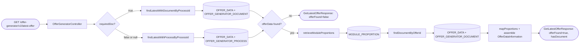

# Chain — OfferGeneratorController · GET /latest-offer

<!-- scaffold — phase 1 -->

- **Action point** — `OfferGeneratorController` (wpfe-am / ucc-offer-generator)
- **Kind** — rest-controller
- **Source** — `ucc-offer-generator/src/main/java/coba/wtp/wpfe/ucc/offer/generator/controller/OfferGeneratorController.java`
- **Handler** — `getLatestOffer(String, Boolean, String)` — `.../OfferGeneratorController.java:110`
- **Trigger** — `GET /offer-generator/v1/latest-offer`
- **Preconditions** — none observed
- **First hop** — `OfferGeneratorProcess.retrieveLatestOffer()` (wpfe-am / ucc-offer-generator)

<!-- analysis — phase 2 -->

## Story

As a **retail customer navigating the offer generator**, I want to retrieve the most recent offer that has been generated for my process so that I can review its details and module proportions without having to know which specific offer ID was assigned.

- **Given** an active offer-generator session identified by `technicalProcessId`
- **When** `GET /offer-generator/v1/latest-offer` is called with the process ID and a flag indicating whether a document is required
- **Then** the system returns the latest offer's full data (investment volume, module proportions, risk profile, etc.) along with whether an associated offer document exists
- **Unless** no offer data exists for that process — in which case `offerFound` is `false`

## Chain

```text
Branch 1 · primary
  OfferGeneratorController.getLatestOffer(String, Boolean, String)
  → OfferGeneratorProcessImpl.retrieveLatestOffer(String, Boolean, String)
    requiredDoc = true: findLatestOfferDataWithDocument(String)
      → OfferDataServiceImpl.findLatestOfferDataWithDocument(String)
        → OfferDataRepository.findLatestWithDocumentByProcessId(String)
        ⇒ [db]  OFFER_DATA + OFFER_GENERATOR_DOCUMENT (joined), filtered by processId
    requiredDoc = false or null: findLatestOfferDataForProcessId(String)
      → OfferDataServiceImpl.findLatestOfferDataForProcessId(String)
        → OfferDataRepository.findLatestWithProcessByProcessId(String)
        ⇒ [db]  OFFER_DATA + OFFER_GENERATOR_PROCESS (joined), filtered by processId
    offerData == null: return empty response
    retrieveModuleProportions(Long)
      → ModuleProportionServiceImpl.retrieveModuleProportions(Long)
        → ModuleProportionRepository.findAllById_OfferData_Id(Long)
        ⇒ [db]  MODULE_PROPORTION, filtered by offerId
    findDocumentByOfferId(Long)
      → OfferDataServiceImpl.findDocumentByOfferId(Long)
        → OfferDataRepository.findDocumentByOfferId(Long)
        ⇒ [db]  OFFER_DATA + OFFER_GENERATOR_DOCUMENT (joined), filtered by offerId
    OfferDataInformation.of(OfferData, OfferGeneratorProcess, List<ModuleProportion>)
      → OfferGeneratorProcessMapper.mapProportions(List<ModuleProportion>)
      ⇒ [none]  pure computation — assemble response DTO from in-memory objects
⇒ [db] + [none]
```

- **Terminals reached** — `db` (OFFER_DATA, OFFER_GENERATOR_DOCUMENT, OFFER_GENERATOR_PROCESS via JPA queries), `none` (OfferDataInformation assembly)

## Diagrams

### Process flow — primary



### Sequence — primary

```mermaid
sequenceDiagram
    participant Client
    participant Controller as OfferGeneratorController
    participant Process as OfferGeneratorProcessImpl
    participant DataService as OfferDataService
    participant ModuleService as ModuleProportionService
    participant Repo as OfferDataRepository
    participant ModRepo as ModuleProportionRepository
    participant DB1 as OFFER_DATA +
        OFFER_GENERATOR_DOCUMENT
    participant DB2 as OFFER_DATA +
        OFFER_GENERATOR_PROCESS
    participant DB3 as MODULE_PROPORTION

    Client->>Controller: GET /latest-offer?technicalProcessId=&requiredDoc=&customerNumber=
    Controller->>Process: retrieveLatestOffer(technicalProcessId, requiredDoc, customerNumber)
    alt requiredDoc = true
        Process->>DataService: findLatestOfferDataWithDocument(technicalProcessId)
        DataService->>Repo: findLatestWithDocumentByProcessId(processId)
        Repo->>DB1: JOIN query on processId ORDER BY creationDate DESC LIMIT 1
        DB1-->>Repo: Optional<OfferData>
    else requiredDoc = false or null
        Process->>DataService: findLatestOfferDataForProcessId(technicalProcessId)
        DataService->>Repo: findLatestWithProcessByProcessId(processId)
        Repo->>DB2: JOIN FETCH query on processId ORDER BY creationDate DESC LIMIT 1
        DB2-->>Repo: Optional<OfferData>
    end
    Repo-->>DataService: Optional<OfferData>
    DataService-->>Process: OfferData or empty
    alt offerData is null
        Process-->>Controller: GetLatestOfferResponse(null, false, false)
    else offerData found
        Controller->>Process: (continues in same method)
        Process->>ModuleService: retrieveModuleProportions(offerId)
        ModuleService->>ModRepo: findAllById_OfferData_Id(offerId)
        ModRepo->>DB3: query MODULE_PROPORTION WHERE id.offerData.id = offerId
        DB3-->>ModRepo: List<ModuleProportion>
        ModRepo-->>ModuleService: List<ModuleProportion>
        ModuleService-->>Process: List<ModuleProportion>
        Process->>DataService: findDocumentByOfferId(offerId)
        DataService->>Repo: findDocumentByOfferId(offerId)
        Repo->>DB1: JOIN query WHERE id = offerId
        DB1-->>Repo: Optional<OfferGeneratorDocument>
        Repo-->>DataService: Optional<OfferGeneratorDocument>
        DataService-->>Process: Optional<Document>
        Process->>Process: OfferDataInformation.of(offerData, process, proportions)
        Process->>Process: mapProportions(proportions) — pure computation
        Process-->>Controller: GetLatestOfferResponse(offerDataInfo, true, hasDocument)
    end
    Controller-->>Client: JsonResponse<GetLatestOfferResponse>
```

## Journey

When the **GET /offer-generator/v1/latest-offer** endpoint fires, the request enters at step 1 to retrieve the most recent offer for a given process. Once that completes, the flow moves to step 2 because the controller delegates business logic to the process layer. From there, step 3 takes over to resolve which query path to follow based on whether a document is required, and so on through every hop until a response is assembled.

1. **OfferGeneratorController.getLatestOffer** (wpfe-am / ucc-offer-generator)

   **Source.** `ucc-offer-generator/src/main/java/coba/wtp/wpfe/ucc/offer/generator/controller/OfferGeneratorController.java:103`

   **Role.** Entry point for the latest-offer query. Accepts a technical process ID, an optional boolean flag indicating whether a document is required, and an optional customer number. Delegates to the process layer.

   **Preconditions.** `technicalProcessId` — provided by the caller (typically from React session state). `requiredDoc` — defaults to null if omitted; controls which database query path is taken. `customerNumber` — used for authorization via `@PreAuthorize` on the process method.

   **Downstream.** `OfferGeneratorProcess.retrieveLatestOffer(technicalProcessId, requiredDoc, customerNumber)`

2. **OfferGeneratorProcessImpl.retrieveLatestOffer** (wpfe-am / ucc-offer-generator)

   **Source.** `ucc-offer-generator/src/main/java/coba/wtp/wpfe/ucc/offer/generator/process/impl/OfferGeneratorProcessImpl.java:130`

   **Role.** Resolves the latest offer for a process, branching on whether a document is required. Assembles the final response from offer data, module proportions, and document existence.

   **Preconditions.** `@PreAuthorize("protectWith('WPFE_AM_OG_READ', {'internalCustomerNumber': #customerNumber})")` — enforces read access for the offer-generator module against the customer number (line 130).

   **Steps.**

   - **2.1 Resolve latest OfferData — document required path** · `OfferGeneratorProcessImpl.java:133`

     **Role.** When `requiredDoc` is `true`, queries for the most recent offer that has an associated document in `OFFER_GENERATOR_DOCUMENT`. Uses `JOIN OFFER_GENERATOR_DOCUMENT ogd ON ogd.offerData = od` to ensure only offers with documents are returned.

     **Source.** `OfferGeneratorProcessImpl.java:133-134`

   - **2.2 Resolve latest OfferData — document not required path** · `OfferGeneratorProcessImpl.java:135`

     **Role.** When `requiredDoc` is `false` or `null`, queries for the most recent offer regardless of document presence. Uses `JOIN FETCH od.offerGeneratorProcess ogp` to eagerly load the process entity in a single query.

     **Source.** `OfferGeneratorProcessImpl.java:135-136`

   - **2.3 Check — no offer found** · `OfferGeneratorProcessImpl.java:138`

     **Role.** If neither query path returns an `OfferData`, the method short-circuits and returns a response with `offerFound = false` and `hasDocument = false`. No further database calls are made.

     **Source.** `OfferGeneratorProcessImpl.java:138-140`

   - **2.4 Retrieve module proportions** · `OfferGeneratorProcessImpl.java:144`

     **Role.** Fetches all module proportion records for the resolved offer, so that each module's weight can be included in the response.

     **Source.** `OfferGeneratorProcessImpl.java:144-145`

   - **2.5 Assemble OfferDataInformation** · `OfferGeneratorProcessImpl.java:147`

     **Role.** Calls the static factory method to build a rich DTO from the offer data, process entity, and module proportions — mapping 21 fields including investment volume, risk profiles, quotas, strategy info, and sustainability preference.

     **Source.** `OfferGeneratorProcessImpl.java:147`

   - **2.6 Check document existence** · `OfferGeneratorProcessImpl.java:149`

     **Role.** Performs a separate query to determine whether an offer document exists for this specific offer ID, independent of the initial fetch path. Uses `JOIN OfferGeneratorDocument ogd ON ogd.offerData = od WHERE od.id = :offerId`.

     **Source.** `OfferGeneratorProcessImpl.java:149`

   - **2.7 Return response** · `OfferGeneratorProcessImpl.java:151`

     **Role.** Wraps the assembled `OfferDataInformation`, a confirmed `true` for offerFound, and the document-existence flag into `GetLatestOfferResponse`.

     **Source.** `OfferGeneratorProcessImpl.java:151`

3. **OfferDataServiceImpl.findLatestOfferDataWithDocument** (wpfe-am / ucc-offer-generator)

   **Source.** `ucc-offer-generator/src/main/java/coba/wtp/wpfe/ucc/offer/generator/service/impl/OfferDataServiceImpl.java:97`

   **Role.** Delegates to the repository's JPQL query that finds the latest offer for a process, but only if it has an associated document in `OFFER_GENERATOR_DOCUMENT`.

   **Downstream.** `OfferDataRepository.findLatestWithDocumentByProcessId(String)`

4. **OfferDataServiceImpl.findLatestOfferDataForProcessId** (wpfe-am / ucc-offer-generator)

   **Source.** `ucc-offer-generator/src/main/java/coba/wtp/wpfe/ucc/offer/generator/service/impl/OfferDataServiceImpl.java:105`

   **Role.** Delegates to the repository's JPQL query that finds the latest offer for a process, eagerly fetching its associated `OfferGeneratorProcess` entity.

   **Downstream.** `OfferDataRepository.findLatestWithProcessByProcessId(String)`

5. **OfferDataServiceImpl.findDocumentByOfferId** (wpfe-am / ucc-offer-generator)

   **Source.** `ucc-offer-generator/src/main/java/coba/wtp/wpfe/ucc/offer/generator/service/impl/OfferDataServiceImpl.java:93`

   **Role.** Delegates to the repository's JPQL query that checks whether an offer document exists for a specific offer ID.

   **Downstream.** `OfferDataRepository.findDocumentByOfferId(Long)`

6. **OfferDataRepository.findLatestWithDocumentByProcessId** (wpfe-am / ucc-offer-generator)

   **Source.** `ucc-offer-generator/src/main/java/coba/wtp/wpfe/ucc/offer/generator/repository/OfferDataRepository.java:34`

   **Role.** Executes a JPQL query that joins `OfferData` with `OfferGeneratorDocument` on the offer data relationship, filters by process ID, orders by creation date descending, and limits to one result. Returns an empty Optional if no matching row exists.

   **Terminal — db**

7. **OfferDataRepository.findLatestWithProcessByProcessId** (wpfe-am / ucc-offer-generator)

   **Source.** `ucc-offer-generator/src/main/java/coba/wtp/wpfe/ucc/offer/generator/repository/OfferDataRepository.java:21`

   **Role.** Executes a JPQL query that joins and fetches the associated `OfferGeneratorProcess` entity, filters by process ID, orders by creation date descending, and limits to one result. Returns an empty Optional if no matching row exists.

   **Terminal — db**

8. **OfferDataRepository.findDocumentByOfferId** (wpfe-am / ucc-offer-generator)

   **Source.** `ucc-offer-generator/src/main/java/coba/wtp/wpfe/ucc/offer/generator/repository/OfferDataRepository.java:46`

   **Role.** Executes a JPQL query that joins `OfferData` with `OfferGeneratorDocument`, filters by offer ID, and returns an Optional containing the document if one exists.

   **Terminal — db**

9. **ModuleProportionServiceImpl.retrieveModuleProportions** (wpfe-am / ucc-offer-generator)

   **Source.** `ucc-offer-generator/src/main/java/coba/wtp/wpfe/ucc/offer/generator/service/impl/ModuleProportionServiceImpl.java:20`

   **Role.** Delegates to the repository's derived query method that finds all module proportion records whose composite key references a specific offer ID.

   **Downstream.** `ModuleProportionRepository.findAllById_OfferData_Id(Long)`

10. **ModuleProportionRepository.findAllById_OfferData_Id** (wpfe-am / ucc-offer-generator)

    **Source.** `ucc-offer-generator/src/main/java/coba/wtp/wpfe/ucc/offer/generator/repository/ModuleProportionRepository.java:14`

    **Role.** Spring Data JPA derived query that resolves to `SELECT * FROM MODULE_PROPORTION WHERE id.offerData.id = ?`. Returns all proportion records for the given offer.

    **Terminal — db**

11. **OfferDataInformation.of** (wpfe-am / ucc-offer-generator)

    **Source.** `ucc-offer-generator/src/main/java/coba/wtp/wpfe/ucc/offer/generator/model/OfferDataInformation.java:40`

    **Role.** Static factory method that assembles a 21-field record from an `OfferData` entity, its associated `OfferGeneratorProcess`, and a list of `ModuleProportion`. Maps module proportions via `mapProportions()`, applies default risk profile value (0) when null, and converts boolean fields safely.

    **Steps.**

    - **11.1 Map module proportions** · `OfferDataInformation.java:45`

      **Role.** Calls `OfferGeneratorProcessMapper.mapProportions()` to convert each `ModuleProportion` into a shared `ModelContractProportion(moduleId, currentValue)` record.

      **Source.** `ucc-offer-generator/src/main/java/coba/wtp/wpfe/ucc/offer/generator/mapper/OfferGeneratorProcessMapper.java:82`

    - **11.2 Apply default risk profile** · `OfferDataInformation.java:47-50`

      **Role.** Uses `Objects.requireNonNullElse()` to substitute `DEFAULT_RISK_PROFILE` (value 0) when either the offer's risk return profile or the process's customer risk profile is null.

      **Source.** `ucc-offer-generator/src/main/java/coba/wtp/wpfe/ucc/offer/generator/model/OfferDataInformation.java:47`

    - **11.3 Convert boolean fields safely** · `OfferDataInformation.java:46, 59`

      **Role.** Uses `Boolean.TRUE.equals()` to convert nullable Boolean fields (`influence`, `sustainabilityPreference`) to primitive booleans without throwing NPE.

      **Source.** `ucc-offer-generator/src/main/java/coba/wtp/wpfe/ucc/offer/generator/model/OfferDataInformation.java:46`

    - **11.4 Build the record** · `OfferDataInformation.java:52-70`

      **Role.** Populates all 21 fields of the `OfferDataInformation` builder and constructs the final immutable record.

      **Source.** `ucc-offer-generator/src/main/java/coba/wtp/wpfe/ucc/offer/generator/model/OfferDataInformation.java:52-70`

    **Terminal — none**

## Data reached

- **db — OFFER_DATA, OFFER_GENERATOR_DOCUMENT, OFFER_GENERATOR_PROCESS via `OfferDataRepository` (wpfe-am / ucc-offer-generator)**
  - Business problem solved — As the **offer generator process**, I need the latest offer data for a customer's active session so that I can present their most recent investment configuration. Therefore we query `OFFER_DATA` joined with either `OFFER_GENERATOR_DOCUMENT` (when a document is required) or `OFFER_GENERATOR_PROCESS` (for eager loading of process metadata) via `OfferDataRepository.findLatestWithDocumentByProcessId(processId)` or `findLatestWithProcessByProcessId(processId)`, ordered by creation date descending and limited to one result, so we can return the most recent offer without requiring the caller to know its ID (`OfferGeneratorProcessImpl.java:133-136`).

  - **Query** — `findLatestWithDocumentByProcessId(String processId)`:
    ```sql
    SELECT od FROM OfferData od
    JOIN OfferGeneratorDocument ogd ON ogd.offerData = od
    WHERE od.offerGeneratorProcess.processId = :processId
    ORDER BY od.creationDate DESC LIMIT 1
    ```
    `processId` ← request parameter `technicalProcessId`, origin: caller (React session state).

  - **Query** — `findLatestWithProcessByProcessId(String processId)`:
    ```sql
    SELECT od FROM OfferData od
    JOIN FETCH od.offerGeneratorProcess ogp
    WHERE ogp.processId = :processId
    ORDER BY od.creationDate DESC LIMIT 1
    ```
    `processId` ← request parameter `technicalProcessId`, origin: caller (React session state).

  - **Response fields used** — `id` (offer ID, used as key for proportion lookup), `investmentVolume`, `productLine`, `productLineMandate`, `productLineMandateName`, `quotaOffensiveInvestment`, `neutralRiskQuota`, `maximumStockQuota`, `maximumCurrencyQuota`, `riskReturnProfile`, `lowerVolumeApprovalPerson`, `productLineStrategyId`, `productLineStrategyName`, `modelContractId`, `furtherAgreements`, `furtherAgreementsApprovalPerson`, `furtherAgreementsApprovalDate` — all 17 fields consumed by `OfferDataInformation.of()` to build the response DTO (`OfferDataInformation.java:42-70`).

  - **Response fields discarded** — none observed; every field on `OfferData` is used in the assembly.

- **db — OFFER_DATA, OFFER_GENERATOR_DOCUMENT via `OfferDataRepository.findDocumentByOfferId(Long)` (wpfe-am / ucc-offer-generator)**
  - Business problem solved — As the **offer generator process**, I need to know whether an offer document has been generated for this specific offer so that I can report its availability to the caller. Therefore we query `OFFER_DATA` joined with `OFFER_GENERATOR_DOCUMENT` via `OfferDataRepository.findDocumentByOfferId(offerId)` and check `.isPresent()`, so we can set the `hasDocument` flag in the response (`OfferGeneratorProcessImpl.java:149`).

  - **Query** — `findDocumentByOfferId(Long offerId)`:
    ```sql
    SELECT od FROM OfferData od
    JOIN OfferGeneratorDocument ogd ON ogd.offerData = od
    WHERE od.id = :offerId
    ```
    `offerId` ← derived from the resolved `OfferData.getId()`, origin: database row fetched in step 6 or 7.

  - **Response fields used** — only existence (`.isPresent()`), no columns are read beyond the join match. The query returns an `Optional<OfferData>` but the caller only checks presence (`OfferGeneratorProcessImpl.java:149`).

- **db — MODULE_PROPORTION via `ModuleProportionRepository` (wpfe-am / ucc-offer-generator)**
  - Business problem solved — As the **offer generator process**, I need each module's weight within this offer so that the customer can see how their portfolio is allocated across offensive and defensive modules. Therefore we query `MODULE_PROPORTION` via `ModuleProportionRepository.findAllById_OfferData_Id(offerId)` for all proportion records tied to the resolved offer, so we can map them into `ModelContractProportion(moduleId, currentValue)` pairs (`OfferGeneratorProcessImpl.java:144-145`).

  - **Query** — `findAllById_OfferData_Id(Long offerId)` — derived Spring Data JPA query:
    ```sql
    SELECT * FROM MODULE_PROPORTION WHERE id.offerData_id = :offerId
    ```
    `offerId` ← derived from the resolved `OfferData.getId()`, origin: database row fetched in step 6 or 7.

  - **Response fields used** — `id.moduleId` (module identifier) and `proportion` (weight as BigDecimal, precision 11 scale 10). These two fields are consumed by `mapProportions()` to construct `ModelContractProportion(moduleId, currentValue)` records (`OfferGeneratorProcessMapper.java:87-90`).

## Acceptance Criteria

1. **Latest offer returned when it exists** — Given a valid `technicalProcessId` with at least one associated `OfferData` row, when the endpoint is called (with `requiredDoc = false` or null), then the response contains `offerFound: true`, a populated `offerDataInformation` record with all 21 fields, and `hasDocument` reflecting whether an `OFFER_GENERATOR_DOCUMENT` row exists for that offer.
   - Evidence: `OfferGeneratorProcessImpl.java:135-151`
   - How to: insert an `OfferGeneratorProcess` row with a known processId, create an `OfferData` row referencing it, and call the endpoint. Assert on the response body fields matching the database values.

2. **No offer returns offerFound = false** — Given a `technicalProcessId` that has no associated `OfferData` rows in either query path, when the endpoint is called, then the response is `GetLatestOfferResponse(null, false, false)` with no further queries executed.
   - Evidence: `OfferGeneratorProcessImpl.java:138-140`
   - How to: call the endpoint with a processId that has no matching rows in OFFER_DATA. Confirm the response body is `{"offerDataInformation": null, "offerFound": false, "offerHasDocument": false}` and verify from query logs that MODULE_PROPORTION and document queries are not executed.

3. **requiredDoc = true filters to offers with documents** — Given a processId where multiple `OfferData` rows exist but only some have associated `OFFER_GENERATOR_DOCUMENT` rows, when the endpoint is called with `requiredDoc = true`, then only the latest offer that has a document is returned.
   - Evidence: `OfferDataRepository.java:34-38` — the JOIN to OFFER_GENERATOR_DOCUMENT ensures no row without a document can match
   - How to: create two OfferData rows for the same processId, add an OFFER_GENERATOR_DOCUMENT only for the older one. Call with requiredDoc=true and confirm the response contains the older offer (which has a document), not the newer one.

4. **Document existence check is independent of initial query path** — Whether `requiredDoc` was true or false, the final `hasDocument` flag always reflects the actual presence of an OFFER_GENERATOR_DOCUMENT row for the resolved offer ID, because step 2.6 executes a separate query (`findDocumentByOfferId`) regardless of which fetch path was taken.
   - Evidence: `OfferGeneratorProcessImpl.java:149`
   - How to: trace lines 133-151 and confirm that the document existence check at line 149 is outside both branches of the requiredDoc conditional, so it always runs when an offer is found.

5. **Module proportions are mapped correctly** — Each `MODULE_PROPORTION` row for the resolved offer is converted to a `ModelContractProportion(moduleId, currentValue)` record with no transformation on the proportion value itself.
   - Evidence: `OfferGeneratorProcessMapper.java:87-90`
   - How to: insert MODULE_PROPORTION rows with known moduleId and proportion values for an offerId. Call the endpoint and assert that each returned ModelContractProportion matches the database values exactly.

6. **Null risk profiles default to 0** — When either `OfferData.riskReturnProfile` or `OfferGeneratorProcess.customerRiskProfile` is null, the response uses the default value of 0 rather than propagating a null.
   - Evidence: `OfferDataInformation.java:47-50`
   - How to: create an OfferData row with riskReturnProfile = null and call the endpoint. Confirm the returned riskReturnProfile field is 0, not null.

## Business Takeaways

- **What this does for the business** — retrieves the most recent investment offer generated for a customer's active session, including all module allocation weights, risk profiles, quotas, strategy details, and document availability, so that the frontend can display the latest offer state without requiring knowledge of internal offer IDs.
- **Depends on** — three database tables: OFFER_DATA (primary offer data), MODULE_PROPORTION (module weight allocations), OFFER_GENERATOR_DOCUMENT (offer document presence). All read-only in this chain.
- **Ingredients** — `technicalProcessId` (session identifier from React state), `requiredDoc` (optional boolean controlling query path), `customerNumber` (authorization context)
- **Preparation** — resolve the latest offer by process ID, optionally filtering to offers with documents; fetch module proportions and document existence in parallel-like sequence
- **Dish** — `GetLatestOfferResponse(offerDataInformation, offerFound, hasDocument)` containing 21 fields of offer data plus two boolean flags
---


