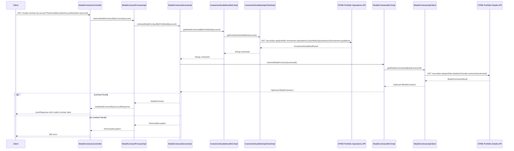

# Chain — ModelContractsController · GET /model-contract-by-account

<!-- scaffold — phase 1 -->

- **Action point** — `ModelContractsController` (wpfe-am / ucc-offer-generator)
- **Kind** — rest-controller
- **Source** — `ucc-offer-generator/src/main/java/coba/wtp/wpfe/ucc/offer/generator/controller/ModelContractsController.java`
- **Handler** — `getModelContractByAccount(String)` — `.../ModelContractsController.java:72`
- **Trigger** — `GET /offer-generator/v1/model-contract-by-account`
- **Preconditions** — none observed
- **First hop** — `ModelContractProcess.retrieveModelContractByAccount()` (wpfe-am / ucc-offer-generator)

<!-- analysis — phase 2 -->

## Story

As a **retail customer browsing the offer generator**, I want to retrieve the model contract associated with my technical securities account so that **I can see which investment strategy is currently assigned to me**.

- **Given** a `technicalSecuritiesAccountNumber` in the request query parameter
- **When** `GET /offer-generator/v1/model-contract-by-account` is called
- **Then** the system resolves the account number to an investment guideline, extracts the linked model contract ID, and returns the full model contract details from CPMS
- **Unless** no investment guideline exists for that portfolio — rejected with a technical exception

## Chain

Branch 1 · primary
  ModelContractsController
  → ModelContractProcessImpl
  → ModelContractServiceImpl
  → InvestmentGuidelinesMnCImpl
  → InvestmentGuidelineApiClientImpl
  ⇒ [external]  CPMS Portfolio Operations API (investment guidelines)
  → ModelContractsMnCImpl
  → ModelContractsApiClient
  ⇒ [external]  CPMS Portfolio Details API (model contracts)

- **Terminals reached** — `external` (CPMS Portfolio Operations API, via `InvestmentGuidelineApiClientImpl`), `external` (CPMS Portfolio Details API, via `ModelContractsApiClient`)

## Diagrams

### Process flow — primary

```mermaid
flowchart LR
  A(["GET /offer-generator/v1/model-contract-by-account"]) --> B[ModelContractsController]
  B --> C[ModelContractProcessImpl]
  C --> D[ModelContractServiceImpl]
  D --> E{Resolve contract ID}
  E --> F[InvestmentGuidelinesMnCImpl]
  F --> G[InvestmentGuidelineApiClientImpl]
  G --> H([external/CPMS Portfolio Operations API])
  H --> I{contractId found?}
  I -- yes --> J[ModelContractsMnCImpl]
  I -- no --> K([TechnicalException])
  J --> L[ModelContractsApiClient]
  L --> M([external/CPMS Portfolio Details API])
  M --> N([GetModelContractByAccountResponse])
```



### Sequence — primary



## Journey

When **the offer generator UI needs to display the customer's current model contract**, the request enters at **[step 1]** to handle a lookup by technical securities account number. Once that completes, the flow moves to **[step 2]** because the process layer delegates business logic to the service. From there, **[step 3]** takes over to resolve the portfolio ID into a model contract ID via investment guidelines, and so on through every hop until the full model contract is assembled or an error is raised.

1. **ModelContractsController.getModelContractByAccount** (wpfe-am / ucc-offer-generator)

   **Source.** `ucc-offer-generator/src/main/java/coba/wtp/wpfe/ucc/offer/generator/controller/ModelContractsController.java:68`

   **Role.** Receives the HTTP GET request with a `technicalSecuritiesAccountNumber` query parameter and delegates to the process layer.

   **Preconditions.** None observed — no authentication or session validation is enforced at this endpoint.

   **Effect.** Wraps the returned `ProcessResponse<GetModelContractByAccountResponse>` into a `JsonResponse` via `JsonResponseBuilder.buildJsonResultResponse()` and returns it as JSON (`application/json`).

2. **ModelContractProcessImpl.retrieveModelContractByAccount** (wpfe-am / ucc-offer-generator)

   **Source.** `ucc-offer-generator/src/main/java/coba/wtp/wpfe/ucc/offer/generator/process/impl/ModelContractProcessImpl.java:57`

   **Role.** Delegates to the service layer, passing through the account number unchanged, then wraps the returned `ModelContract` into a `GetModelContractByAccountResponse` and returns it as a `ProcessResponse`.

   **Downstream.** A `ProcessResponse<GetModelContractByAccountResponse>` carrying the model contract data back to the controller.

3. **ModelContractServiceImpl.retrieveModelContractByPortfolioId** (wpfe-am / ucc-offer-generator)

   **Source.** `ucc-offer-generator/src/main/java/coba/wtp/wpfe/ucc/offer/generator/service/impl/ModelContractServiceImpl.java:163`

   **Role.** Orchestrates the two-step lookup: first resolves the technical securities account number to a model contract ID via investment guidelines, then fetches the full model contract by that ID.

   **Steps.**

   - **3.1 Resolve — get contract ID from investment guidelines** · `ModelContractServiceImpl.java:164`

     **Role.** Calls `InvestmentGuidelinesMnC.getModelContractIdByPortfolioId(portfolioId)` to look up the model contract ID linked to this portfolio's investment guideline.

   - **3.2 Fetch — get full model contract by ID** · `ModelContractServiceImpl.java:166`

     **Role.** Calls `ModelContractsMnC.retrieveModelContract(contractId)` to fetch the complete model contract record from CPMS using the resolved ID.

     **On failure.** If the `Optional<ModelContract>` is empty, a `TechnicalException` is thrown with message "No Model Contract found for contractId={contractId}" (`ModelContractServiceImpl.java:170-173`).

   - **3.3 Return — unwrap and return** · `ModelContractServiceImpl.java:167`

     **Role.** If the optional is present, returns the `ModelContract` directly; otherwise throws.

4. **InvestmentGuidelinesMnCImpl.getModelContractIdByPortfolioId** (wpfe-shared / wpfe-shared-cpms)

   **Source.** `wpfe-shared/wpfe-shared-cpms/src/main/java/coba/wtp/wpfe/shared/cpms/mnc/impl/InvestmentGuidelinesMnCImpl.java:23`

   **Role.** Maps the portfolio ID to an investment guideline result via its API client, then extracts the model contract ID from the response. This is a Map-and-Call step: it translates between the Swagger-generated `InvestmentGuidelineResult` and the domain string.

   **Effect.** Returns the `modelContractId` string extracted from `response.getInvestmentGuidelines().getModelContractId()` (`InvestmentGuidelinesMnCImpl.java:25`).

   **Downstream.** A non-null contract ID string used by the service to fetch the full model contract.

5. **InvestmentGuidelineApiClientImpl.getInvestmentGuideline** (wpfe-shared / wpfe-shared-cpms)

   **Source.** `wpfe-shared/wpfe-shared-cpms/src/main/java/coba/wtp/wpfe/shared/cpms/api/investmentguidlines/InvestmentGuidelineApiClientImpl.java:34`

   **Role.** Builds the HTTP request URL by first converting the securities account number to a pseudonym via `PseudonymService`, then issues a GET call to the CPMS Portfolio Operations API.

   **On failure.** On any exception during the REST exchange, throws a `TechnicalException` with message "Exception during: GET /portfolios/{portfolioId}/investment-guidelines api call" (`InvestmentGuidelineApiClientImpl.java:46-51`).

   **Terminal — external** · CPMS Portfolio Operations API at `GET /securities-api/portfolio-investment-operations/v1/portfolios/{pseudonym}/investment-guidelines`.

6. **ModelContractsMnCImpl.retrieveModelContract** (wpfe-shared / wpfe-shared-cpms)

   **Source.** `wpfe-shared/wpfe-shared-cpms/src/main/java/coba/wtp/wpfe/shared/cpms/mnc/impl/ModelContractsMnCImpl.java:134`

   **Role.** Calls the CPMS Portfolio Details API to fetch a single model contract by ID, then maps the Swagger-generated `coba.wtp.wpfe.shared.cpms.api.model.v2.portfoliodetails.ModelContract` into a domain `ModelContract` object via `mapToModelContract()` (`ModelContractsMnCImpl.java:136-137`).

   **Effect.** Returns an `Optional<ModelContract>` — present if CPMS has the contract, empty otherwise.

7. **ModelContractsApiClient.getModelContractDataById** (wpfe-shared / wpfe-shared-cpms)

   **Source.** `wpfe-shared/wpfe-shared-cpms/src/main/java/coba/wtp/wpfe/shared/cpms/api/modelcontracts/ModelContractsApiClient.java:63`

   **Role.** Builds the request URL by appending the model contract ID to the base path, sets HTTP headers from the application context (channel and request ID), then issues a GET call to fetch the model contract data.

   **On failure.** On any exception during the REST exchange, throws a `TechnicalException` with message "Exception during: GET /model-contracts/{modelContractId} api call" (`ModelContractsApiClient.java:78-83`).

   **Terminal — external** · CPMS Portfolio Details API at `GET /securities-api/portfolio-details/v2/model-contracts/{modelContractId}`.

8. **Response assembly** (wpfe-am / ucc-offer-generator)

   **Source.** `ucc-offer-generator/src/main/java/coba/wtp/wpfe/ucc/offer/generator/controller/ModelContractsController.java:73`

   **Role.** Wraps the `ProcessResponse<GetModelContractByAccountResponse>` into a `JsonResponse` and returns it as JSON to the caller.

   **Terminal — external** · The HTTP response is sent back to the client with the model contract data serialized in the response body.

## Data reached

- **external — CPMS Portfolio Operations API, via `InvestmentGuidelineApiClientImpl` (wpfe-shared / wpfe-shared-cpms)**
  - Business problem solved — As the **offer generator service**, I need to resolve a customer's technical securities account number into a model contract ID so that I can look up the correct investment strategy. Therefore we call this API at `GET /securities-api/portfolio-investment-operations/v1/portfolios/{pseudonym}/investment-guidelines` to retrieve the investment guideline record for the portfolio. The pseudonym is derived from the raw account number via `PseudonymService.retrievePseudonym()` (`InvestmentGuidelineApiClientImpl.java:58`). Then we extract only `modelContractId` from the response, so we can use it as a key to fetch the full model contract (`InvestmentGuidelinesMnCImpl.java:25`).

  - **Request path**
    ```json
    {
      "pseudonym": "PSEUDONYM_12345"
    }
    ```
    `pseudonym` — derived from the request's `technicalSecuritiesAccountNumber` query parameter via `PseudonymService.retrievePseudonym()` (`InvestmentGuidelineApiClientImpl.java:58`). The raw account number is never sent to CPMS.

  - **Request body** — none (GET request).

  - **Response fields used**
    ```json
    {
      "investmentGuidelines": {
        "modelContractId": "MC-78901234"
      }
    }
    ```
    `investmentGuidelines.modelContractId` → the model contract ID used as a key to fetch the full contract (Journey step 6). Example value inferred from DTO definition at `InvestmentGuidelineResult.java:line`.

  - **Response fields discarded** — all other investment guideline properties such as strategy definitions, module weights, and risk parameters — only the model contract ID is extracted (`InvestmentGuidelinesMnCImpl.java:25`).

- **external — CPMS Portfolio Details API, via `ModelContractsApiClient` (wpfe-shared / wpfe-shared-cpms)**
  - Business problem solved — As the **offer generator service**, I need the full model contract details (proportions, properties, fees) so that I can present the customer's current investment strategy in the offer generator UI. Therefore we call this API at `GET /securities-api/portfolio-details/v2/model-contracts/{modelContractId}` to retrieve the complete model contract record (`ModelContractsApiClient.java:63`). Then we map the Swagger-generated response through `ModelContractsMnCImpl.mapToModelContract()` which extracts product line strategy, offensive assets share, module proportions, fee rates, sustainability categories, and all target market properties (`ModelContractsMnCImpl.java:248-270`), so we can return a fully populated `GetModelContractByAccountResponse`.

  - **Request path**
    ```json
    {
      "modelContractId": "MC-78901234"
    }
    ```
    `modelContractId` ← resolved from the investment guideline lookup (Journey step 5).

  - **Request body** — none (GET request).

  - **Response fields used**
    ```json
    {
      "modelContractId": "MC-78901234",
      "proportions": [
        { "moduleId": "mod-001", "currentValue": 65.0 },
        { "moduleId": "mod-002", "currentValue": 35.0 }
      ],
      "properties": {
        "productLine": "EFFICIENT",
        "offensiveAssetsShare": 65.0,
        "feeModelName": "STANDARD"
      }
    }
    ```
    `modelContractId` → returned as-is in the response DTO (`GetModelContractByAccountResponse.java`). Example value inferred from CPMS API schema.
    `proportions[].moduleId`, `proportions[].currentValue` → module weight breakdown for display (`ModelContractsMnCImpl.java:258-260`).
    `properties.productLine`, `properties.offensiveAssetsShare`, `properties.feeModelName` → key strategy attributes used by the UI to describe the contract (`ModelContractsMnCImpl.java:248-270`).

  - **Response fields discarded** — all CPMS model contract properties including `allowedCustomerChannels`, `investmentGoal`, `investmentHorizon`, `minimumKnowledgeAndExperience`, `salesStrategy`, `minimumFinancialLossCapacity`, `assetManagementFeeRate`, `currencyConversionCostRate`, `custodyFeeRate`, `externalServiceFeeRate`, `initialCostRate`, `initialTransactionCostRate`, `minimumFee`, `otherFeeRate`, `payedOutGrantsRate`, `productCostIncludingGrantsRate`, `profileShareRate`, `securitiesCommissionRate`, `categoryA`, `categoryB`, `categoryC`, `technicalMinimumPayoutAmount`, `avdDefaultStandardAccount` — mapped by the MnC but not all are consumed downstream (`ModelContractsMnCImpl.java:248-270`).

## Acceptance Criteria

1. **Valid account number returns model contract** — Given a `technicalSecuritiesAccountNumber` that has an investment guideline in CPMS, when `GET /offer-generator/v1/model-contract-by-account` is called with that account number, then the response contains the full `ModelContract` data including proportions and properties.
   - Evidence: `ModelContractsController.java:68-74`, `ModelContractProcessImpl.java:57-60`, `ModelContractServiceImpl.java:163-175`
   - How to: call the endpoint with a known valid account number; confirm from CPMS logs that both the investment guideline API and model contracts API are called in sequence, and assert on the response body for non-null contract data.

2. **Account without investment guideline returns technical exception** — Given a `technicalSecuritiesAccountNumber` whose portfolio has no investment guideline in CPMS, when the endpoint is called, then a `TechnicalException` is thrown with message "No Model Contract found for contractId={contractId}".
   - Evidence: `ModelContractServiceImpl.java:170-173`
   - How to: call the endpoint with an account number that has no investment guideline; confirm from CPMS logs that the investment guidelines API returns a result with null or empty modelContractId, and assert on the HTTP response for a 5xx error.

3. **Model contract not found in CPMS returns technical exception** — Given a `technicalSecuritiesAccountNumber` whose portfolio has an investment guideline pointing to a non-existent model contract ID, when the endpoint is called, then a `TechnicalException` is thrown with message "No Model Contract found for contractId={contractId}".
   - Evidence: `ModelContractServiceImpl.java:170-173`, `ModelContractsMnCImpl.java:134-137`
   - How to: call the endpoint with an account number whose investment guideline references a deleted or invalid model contract ID; confirm from CPMS logs that the portfolio details API returns empty, and assert on the HTTP response for a 5xx error.

4. **CPMS Portfolio Operations API outage aborts the flow** — Given `InvestmentGuidelineApiClientImpl.getInvestmentGuideline` returns a 5xx or times out, when the endpoint is called, then the request fails with no fallback and the model contracts API is never attempted.
   - Evidence: `InvestmentGuidelineApiClientImpl.java:46-51` — on-failure: fatal (TechnicalException thrown)
   - How to: open the call at `InvestmentGuidelineApiClientImpl.java:34` and check for a surrounding `catch` or `@Retryable`; none is present, so the exception propagates. Confirm the same in `InvestmentGuidelinesMnCImpl.getModelContractIdByPortfolioId` and `ModelContractServiceImpl.retrieveModelContractByPortfolioId` — neither wraps it.

5. **CPMS Portfolio Details API outage aborts the flow** — Given `ModelContractsApiClient.getModelContractDataById` returns a 5xx or times out, when the endpoint is called (and the investment guideline lookup succeeded), then the request fails with no fallback and retry.
   - Evidence: `ModelContractsApiClient.java:78-83` — on-failure: fatal (TechnicalException thrown)
   - How to: open the call at `ModelContractsApiClient.java:63` and check for a surrounding `catch` or `@Retryable`; none is present, so the exception propagates. Confirm the same in `ModelContractsMnCImpl.retrieveModelContract` and `ModelContractServiceImpl.retrieveModelContractByPortfolioId` — neither wraps it.

## Business Takeaways

- **What this does for the business** — retrieves the customer's current model contract (investment strategy) from CPMS by first resolving their technical securities account number to an investment guideline, then fetching the full contract details including module proportions and fee structure.
- **Depends on** — two external CPMS APIs: Portfolio Operations API (to resolve account → contract ID) and Portfolio Details API (to fetch the full contract)
- **Ingredients** — `technicalSecuritiesAccountNumber` (request query parameter)
- **Preparation** — pseudonymize the account number, look up investment guideline to get contract ID
- **Dish** — `GetModelContractByAccountResponse` containing the full model contract with proportions and properties, or a technical exception if no contract is found

