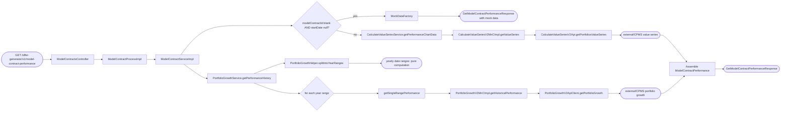
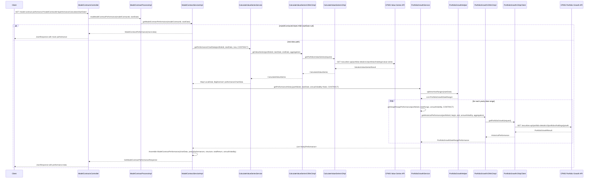

# Chain — ModelContractsController · GET /model-contract-performance

<!-- scaffold — phase 1 -->

- **Action point** — `ModelContractsController` (wpfe-am / ucc-offer-generator)
- **Kind** — rest-controller
- **Source** — `ucc-offer-generator/src/main/java/coba/wtp/wpfe/ucc/offer/generator/controller/ModelContractsController.java`
- **Handler** — `getModelContractPerformance(String, LocalDate)` — `.../ModelContractsController.java:108`
- **Trigger** — `GET /offer-generator/v1/model-contract-performance`
- **Preconditions** — none observed
- **First hop** — `ModelContractProcess.readModelContractPerformance()` (wpfe-am / ucc-offer-generator)

<!-- analysis — phase 2 -->

## Story

As an **advisor reviewing a model contract's track record**, I want to see its historical performance data so that I can evaluate how the contract has performed over time.

- **Given** a `modelContractId` and optionally a `performanceCalculationStartDate`
- **When** `GET /offer-generator/v1/model-contract-performance` is called with those parameters
- **Then** the system retrieves value series chart data, yearly performance history, and overall return/volatility metrics from CPMS
- **Unless** both `modelContractId` and `performanceCalculationStartDate` are absent — in which case mock data is returned for development use

## Chain

```text
Branch 1 · primary
  ModelContractsController
  → ModelContractProcessImpl
  → ModelContractServiceImpl
  → CalculateValueSeriesServiceImpl
  → CalculateValueSeriesV2MnCImpl
  → CalculateValueSeriesV2Api
  ⇒ [external] CPMS Portfolio Details API — value series endpoint

Branch 2 · diverges at ModelContractServiceImpl
  → PortfolioGrowthServiceImpl
  → PortfolioGrowthHelper
  ⇒ [none]
  → PortfolioGrowthServiceImpl.getSingleRangePerformance()
  → PortfolioGrowthV2MnCImpl
  → PortfolioGrowthV2ApiClient
  ⇒ [external] CPMS Portfolio Details API — portfolio growth endpoint
```

- **Terminals reached** — `external` (CPMS Portfolio Details API, via `wpfe-shared / wpfe-shared-cpms`), `none` (pure computation in `PortfolioGrowthHelper`)

## Diagrams

### Process flow — primary



### Sequence — primary



## Journey

When the **advisor opens a model contract's performance view**, the request enters at step 1 to retrieve historical performance data for a specific model contract. Once that completes, the flow moves to step 3 because the service layer orchestrates two independent data fetches from CPMS — value series chart data and yearly growth history — then assembles them into a single response.

Below is each step in call order — what it does, why it exists, how it handles failure, and what passes the baton forward.

1. **ModelContractsController.getModelContractPerformance(String, LocalDate)** (wpfe-am / ucc-offer-generator)

   **Source.** `ucc-offer-generator/src/main/java/coba/wtp/wpfe/ucc/offer/generator/controller/ModelContractsController.java:108`

   **Role.** Exposes the model contract performance endpoint as a GET handler that accepts a `modelContractId` and an optional `performanceCalculationStartDate`, then delegates to the process layer.

   **Preconditions.** None observed — both parameters are marked `required = false` on the controller method.

   **Effect.** Wraps the `ProcessResponse<GetModelContractPerformanceResponse>` into a `JsonResponse` via `JsonResponseBuilder.buildJsonResultResponse()` and returns it to the caller (`ucc-offer-generator/src/main/java/coba/wtp/wpfe/ucc/offer/generator/controller/ModelContractsController.java:120`).

   **Downstream.** The frontend offer-generator page that renders performance charts and yearly tables.

2. **ModelContractProcessImpl.readModelContractPerformance(String, LocalDate)** (wpfe-am / ucc-offer-generator)

   **Source.** `ucc-offer-generator/src/main/java/coba/wtp/wpfe/ucc/offer/generator/process/impl/ModelContractProcessImpl.java:73`

   **Role.** Delegates to the service layer for actual data retrieval, then wraps the resulting `ModelContractPerformance` domain object into a `GetModelContractPerformanceResponse` DTO.

   **On failure.** No error handling at this level — any exception from the service propagates up through the process layer to the controller and is surfaced as an HTTP error by Spring's global exception handler.

   **Effect.** Converts the domain model (`ModelContractPerformance`) into a response DTO (`GetModelContractPerformanceResponse`).

3. **ModelContractServiceImpl.getModelContractPerformance(String, LocalDate)** (wpfe-am / ucc-offer-generator)

   **Source.** `ucc-offer-generator/src/main/java/coba/wtp/wpfe/ucc/offer/generator/service/impl/ModelContractServiceImpl.java:108`

   **Role.** Orchestrates the performance data assembly: checks for a mock-data fallback, fetches value series chart data from CPMS, retrieves yearly growth history from CPMS, then assembles all pieces into a `ModelContractPerformance` object.

   **Steps.**

   3.1 **Check — mock data fallback** · `ModelContractServiceImpl.java:112`

       **Role.** Tests whether both `modelContractId` is blank and `performanceCalculationStartDate` is null using `StringUtils.hasText()`. If true, returns a pre-built mock performance object from `ModelContractMockDataFactory.MODEL_CONTRACT_PERFORMANCE_MOCK`, an empty chart data map, and the contract structure from `ModelContractStructureMockDataFactory.MODEL_CONTRACT_STRUCTURE`.

       **Effect.** Short-circuits the entire chain with synthetic data — no CPMS calls are made. This path exists for development and testing where real CPMS data is unavailable.

   3.2 **Fetch — value series chart data** · `ModelContractServiceImpl.java:118`

       **Role.** Calls `calculateValueSeriesService.getPerformanceChartData()` with the model contract ID (used as portfolio ID), the start date, today's date as end date, and `Aggregation.CONTRACT` to retrieve a date-to-value map for chart rendering.

       **Downstream.** The `Map<LocalDate, BigDecimal>` becomes the `performanceChartData` field of the final response, used by the frontend to render a line chart of portfolio value over time.

   3.3 **Fetch — yearly performance history** · `ModelContractServiceImpl.java:121`

       **Role.** Calls `portfolioGrowthService.getPerformanceHistory()` with the model contract ID, start date, `annualVolatility=false`, and `Aggregation.CONTRACT` to retrieve a list of yearly performance records.

       **Downstream.** The `List<YearlyPerformance>` becomes the `yearlyPerformances` field of the final response, used by the frontend to render a table of annual returns.

   3.4 **Fetch — single-range overall metrics** · `ModelContractServiceImpl.java:125`

       **Role.** Calls `portfolioGrowthService.getSingleRangePerformance()` with the full date range (start date to today) and `annualVolatility=true` to retrieve the total return and annual volatility for the entire period.

       **Effect.** Extracts `totalReturnRelative().doubleValue()` as the overall historical performance percentage, and `annualVolatility().doubleValue()` as the risk metric. Both default to `0.00` if the CPMS response is absent.

   3.5 **Assemble — ModelContractPerformance** · `ModelContractServiceImpl.java:132`

       **Role.** Constructs a new `ModelContractPerformance` object carrying all five fields: chart data map, yearly performance list, contract structure (from the static mock factory), total return percentage, and annual volatility.

4. **CalculateValueSeriesServiceImpl.getPerformanceChartData(String, LocalDate, LocalDate, Aggregation)** (wpfe-am / ucc-offer-generator)

   **Source.** `ucc-offer-generator/src/main/java/coba/wtp/wpfe/ucc/offer/generator/service/impl/CalculateValueSeriesServiceImpl.java:31`

   **Role.** Delegates to the CPMS MnC for value series data, then transforms the API response into a date-to-value map suitable for chart rendering.

   **Steps.**

   4.1 **Call — getValueSeries via MnC** · `CalculateValueSeriesServiceImpl.java:32`

       **Role.** Invokes `calculateValueSeriesV2MnC.getValueSeries(portfolioId, startDate, endDate, aggregation)` to fetch the raw value series from CPMS.

   4.2 **Transform — to performance chart data map** · `CalculateValueSeriesServiceImpl.java:39`

       **Role.** Iterates over each `ValueSeries` in the `CalculatedValueSeries.getValueSeries()` list, extracts the first entry's total value (`getCpValuedTotal`), and collects into a `Map<LocalDate, BigDecimal>` keyed by date. Only the valued total series is used — other series (purchase, disposition, credit amounts) are discarded.

5. **CalculateValueSeriesV2MnCImpl.getValueSeries(String, LocalDate, LocalDate, Aggregation)** (wpfe-shared / wpfe-shared-cpms)

   **Source.** `wpfe-shared/wpfe-shared-cpms/src/main/java/coba/wtp/wpfe/shared/cpms/mnc/impl/CalculateValueSeriesV2MnCImpl.java:108`

   **Role.** Prepares a CPMS API request with the portfolio ID, date range, and aggregation type, then calls through to the API client.

   **Steps.**

   5.1 **Prepare — build API request** · `CalculateValueSeriesV2MnCImpl.java:114`

       **Role.** Calls `prepareGetValueSeriesApiRequest()` which builds a `CalculateValueSeriesV2ApiRequest` with transaction origin set to ALL, the current channel and request ID from context, the technical securities account number, consolidation type CUSTOM, showcase enabled, begin/end dates, and the aggregation list.

   5.2 **Call — getPortfoliosValueSeries** · `CalculateValueSeriesV2MnCImpl.java:120`

       **Role.** Invokes `calculateValueSeriesV2Api.getPortfoliosValueSeries(request)` to send the HTTP request to CPMS.

   5.3 **Map — API response to domain model** · `CalculateValueSeriesV2MnCImpl.java:124`

       **Role.** If the API returns a result, maps it through `mapToCalculatedValueSeries()` which converts the API's `SolutionValueSeriesResult` (containing holdings with valued total value series as lists of BigDecimal) into a `CalculatedValueSeries` domain object with date-value maps. If the response is empty or absent, returns an empty `CalculatedValueSeries`.

6. **CalculateValueSeriesV2Api.getPortfoliosValueSeries(CalculateValueSeriesV2ApiRequest)** (wpfe-shared / wpfe-shared-cpms)

   **Source.** `wpfe-shared/wpfe-shared-cpms/src/main/java/coba/wtp/wpfe/shared/cpms/api/calculatevalueseries/v2/CalculateValueSeriesV2ApiClient.java:41`

   **Role.** Sends an HTTP GET request to the CPMS Portfolio Details API value series endpoint with pseudonymized portfolio IDs and query parameters, then returns the response body as `SolutionValueSeriesResult`.

   **On failure.** On `HttpClientErrorException`, if status is 409 CONFLICT the exception propagates unchanged; otherwise it is wrapped in a `TechnicalExceptionFactory.createAndLogTechnicalException()` call. Any other `Exception` is also wrapped and logged.

   **Terminal — external**

   HTTP GET to `/securities-api/portfolio-details/v2/portfolios/holdings/value-series?portfolioIds={pseudonymizedIds}&begin={date}&end={date}&aggregation=CONTRACT&...`

7. **PortfolioGrowthServiceImpl.getPerformanceHistory(String, LocalDate, Boolean, Aggregation)** (wpfe-am / ucc-offer-generator)

   **Source.** `ucc-offer-generator/src/main/java/coba/wtp/wpfe/ucc/offer/generator/service/impl/PortfolioGrowthServiceImpl.java:31`

   **Role.** Splits the date range into yearly segments, then fetches historical performance for each segment individually from CPMS and converts the results into `YearlyPerformance` records.

   **Steps.**

   7.1 **Split — date range into year ranges** · `PortfolioGrowthServiceImpl.java:34`

       **Role.** Calls `PortfolioGrowthHelper.splitIntoYearRanges(moduleStartDate)` to divide the period from start date to today into yearly chunks, ordered newest-to-oldest.

   7.2 **Fetch — per-year performance** · `PortfolioGrowthServiceImpl.java:39`

       **Role.** Iterates over each `PortfolioGrowthDateRange`, calls `getSingleRangePerformance()` for that range, and accumulates the results into a list. If any single-range call throws an exception, logs a warning and returns an empty list rather than failing the entire chain.

   7.3 **Transform — to yearly performance records** · `PortfolioGrowthServiceImpl.java:60`

       **Role.** Maps each `PortfolioGrowthDateRangePerformance` into a `YearlyPerformance` record, extracting the start date, end date, and total return relative (defaulting to 0.0 if absent).

8. **PortfolioGrowthHelper.splitIntoYearRanges(LocalDate)** (wpfe-am / ucc-offer-generator)

   **Source.** `ucc-offer-generator/src/main/java/coba/wtp/wpfe/ucc/offer/generator/helper/PortfolioGrowthHelper.java:63`

   **Role.** Pure computation that splits a date range into yearly segments. Clamps the start date to at most 5 years before today (`MAX_LOOKBACK_YEARS`), then iterates backwards from today in one-year increments, producing `PortfolioGrowthDateRange` objects ordered newest-to-oldest.

   **On failure.** Throws `IllegalArgumentException` if the input start date is after today's date. Logs a warning and clamps silently if the start date exceeds 5 years ago.

   **Terminal — [none]** — pure computation, no outbound calls.

9. **PortfolioGrowthServiceImpl.getSingleRangePerformance(String, PortfolioGrowthDateRange, Boolean, Aggregation)** (wpfe-am / ucc-offer-generator)

   **Source.** `ucc-offer-generator/src/main/java/coba/wtp/wpfe/ucc/offer/generator/service/impl/PortfolioGrowthServiceImpl.java:73`

   **Role.** Delegates to the CPMS MnC for a single date range's historical performance, then wraps the result into a `PortfolioGrowthDateRangePerformance` domain object.

   **Steps.**

   9.1 **Call — getHistoricalPerformance via MnC** · `PortfolioGrowthServiceImpl.java:82`

       **Role.** Invokes `portfolioGrowthV2MnC.getHistoricalPerformance(temporaryContractId, startDate, endDateExclusive, annualVolatility, aggregation)` to fetch the CPMS response for this specific date range.

   9.2 **Wrap — into domain object** · `PortfolioGrowthServiceImpl.java:85`

       **Role.** Constructs a new `PortfolioGrowthDateRangePerformance` carrying the date range (with end adjusted to inclusive) and the returned `HistoricalPerformance` data.

10. **PortfolioGrowthV2MnCImpl.getHistoricalPerformance(String, LocalDate, LocalDate, Boolean, Aggregation)** (wpfe-shared / wpfe-shared-cpms)

    **Source.** `wpfe-shared/wpfe-shared-cpms/src/main/java/coba/wtp/wpfe/shared/cpms/mnc/impl/PortfolioGrowthV2MnCImpl.java:41`

    **Role.** Prepares a CPMS API request with the portfolio ID, date range, and aggregation type, then calls through to the API client.

    **Steps.**

    10.1 **Prepare — build API request** · `PortfolioGrowthV2MnCImpl.java:43`

        **Role.** Calls `createPortfolioGrowthRequest()` which builds a `PortfolioGrowthV2Request` with transaction origin ALL, current channel and request ID from context, the technical securities account number, consolidation type CUSTOM, showcase enabled, begin/end dates, aggregations, and annual volatility flag.

    10.2 **Call — getPortfolioGrowth** · `PortfolioGrowthV2MnCImpl.java:46`

        **Role.** Invokes `portfolioGrowthV2ApiClient.getPortfolioGrowth(request)` to send the HTTP request to CPMS.

    10.3 **Map — API response to domain model** · `PortfolioGrowthV2MnCImpl.java:50`

        **Role.** Extracts the first holding from the `PortfolioGrowthResult`, then calls `createHistoricalPerformance()` which reads `totalReturnRelative` (defaulting to 0.00) and `annualVolatility` into a `HistoricalPerformance` domain object. If no holdings are present, returns a default `HistoricalPerformance` with zero total return.

11. **PortfolioGrowthV2ApiClient.getPortfolioGrowth(PortfolioGrowthV2Request)** (wpfe-shared / wpfe-shared-cpms)

    **Source.** `wpfe-shared/wpfe-shared-cpms/src/main/java/coba/wtp/wpfe/shared/cpms/api/portfoliogrowth/v2/PortfolioGrowthV2ApiClient.java:41`

    **Role.** Sends an HTTP GET request to the CPMS Portfolio Details API portfolio growth endpoint with pseudonymized portfolio IDs and query parameters, then returns the response body as `PortfolioGrowthResult`.

    **On failure.** On `HttpClientErrorException`, if status is 409 CONFLICT the exception propagates unchanged; otherwise it is wrapped in a `TechnicalExceptionFactory.createAndLogTechnicalException()` call. Any other `Exception` is also wrapped and logged.

    **Terminal — external**

    HTTP GET to `/securities-api/portfolio-details/v2/portfolios/holdings/growth?portfolioIds={pseudonymizedIds}&begin={date}&end={date}&aggregation=CONTRACT&...`

12. **ModelContractServiceImpl (response assembly)** (wpfe-am / ucc-offer-generator)

    **Source.** `ucc-offer-generator/src/main/java/coba/wtp/wpfe/ucc/offer/generator/service/impl/ModelContractServiceImpl.java:132`

    **Role.** Assembles the final response by constructing a `ModelContractPerformance` object with five fields: chart data map from step 4, yearly performance list from step 7, contract structure from mock factory (static field), total return percentage extracted from the single-range result, and annual volatility also extracted from the single-range result.

    **Effect.** Returns the assembled `ModelContractPerformance` to the process layer, which wraps it in a response DTO for the controller.

13. **Response — GetModelContractPerformanceResponse** (wpfe-am / ucc-offer-generator)

    **Source.** `ucc-offer-generator/src/main/java/coba/wtp/wpfe/ucc/offer/generator/dto/responses/GetModelContractPerformanceResponse.java:9`

    **Role.** Carries the single field `modelContractPerformance` (a `ModelContractPerformance` record) back through the process layer to the controller, which serializes it as JSON.

    **Terminal — response** returned to the frontend client.

## Data reached

- **external — CPMS Portfolio Details API, value series endpoint, via `CalculateValueSeriesV2Api` (wpfe-shared / wpfe-shared-cpms)**
  - Business problem solved — As the **offer generator service**, I need a date-to-value time series for the model contract's portfolio so that I can render a line chart showing how the contract's value has evolved over time. Therefore we call this API at `GET /securities-api/portfolio-details/v2/portfolios/holdings/value-series?portfolioIds={pseudonymizedIds}&begin={startDate}&end={today}&aggregation=CONTRACT&consolidationTypes=CUSTOM&showcase=true` to retrieve the portfolio value series. Then we extract only the valued total value series from each holding entry and map it by date, so we can feed a `Map<LocalDate, BigDecimal>` directly into the frontend chart component (`ModelContractServiceImpl.java:118`, `CalculateValueSeriesServiceImpl.java:39`).

  - **Request path**
    ```json
    {
      "portfolioIds": "PSEUDONYMIZED_ACCOUNT_ID",
      "begin": "2024-01-01",
      "end": "2026-08-05",
      "aggregation": "CONTRACT"
    }
    ```
    `portfolioIds` ← pseudonymized from the model contract's technical securities account number, origin: request parameter `modelContractId` passed through as portfolio ID. `begin` ← `performanceCalculationStartDate` from the HTTP query parameter. `end` ← computed as `LocalDate.now()` at call time.

  - **Request body** — none (GET request with query parameters).

  - **Response fields used**
    ```json
    {
      "holdings": [
        {
          "adjustedBegin": "2024-01-01",
          "adjustedEnd": "2026-08-05",
          "valuedTotalValueSeries": [100000.0, 101500.0, 103200.0]
        }
      ]
    }
    ```
    `holdings[].adjustedBegin` → used to align the date range in the calculated value series (`CalculateValueSeriesV2MnCImpl.java:168`). `holdings[].adjustedEnd` → same purpose (`CalculateValueSeriesV2MnCImpl.java:170`). `holdings[].valuedTotalValueSeries` → mapped into a `Map<LocalDate, BigDecimal>` for chart rendering (`CalculateValueSeriesV2MnCImpl.java:196`, `CalculateValueSeriesServiceImpl.java:43`).

  - **Response fields discarded** — `unvaluedTotalValueSeries`, `valuedPurchaseAmountSeries`, `valuedDispositionAmountSeries`, `valuedCreditAmountSeries`, `unvaluedPurchaseAmountSeries`, `unvaluedDispositionAmountSeries`, `unvaluedCreditAmountSeries`, `valuedDebitAmountSeries`, `unvaluedDebitAmountSeries` — all transaction-level series are present in the API response but never consumed by this chain; only the total valued series is used.

- **external — CPMS Portfolio Details API, portfolio growth endpoint, via `PortfolioGrowthV2ApiClient` (wpfe-shared / wpfe-shared-cpms)**
  - Business problem solved — As the **offer generator service**, I need historical performance metrics (total return and annual volatility) for specific yearly periods of the model contract so that I can display a table of annual returns alongside an overall summary. Therefore we call this API at `GET /securities-api/portfolio-details/v2/portfolios/holdings/growth?portfolioIds={pseudonymizedIds}&begin={dateRangeStart}&end={dateRangeEnd}&aggregation=CONTRACT&consolidationTypes=CUSTOM&showcase=true&annualVolatility=true` to retrieve the portfolio growth result. Then we extract `totalReturnRelative` and `annualVolatility` from the first holding entry, so we can populate both per-year performance records and an overall summary (`ModelContractServiceImpl.java:125`, `PortfolioGrowthV2MnCImpl.java:60`).

  - **Request path**
    ```json
    {
      "portfolioIds": "PSEUDONYMIZED_ACCOUNT_ID",
      "begin": "2024-07-17",
      "end": "2025-07-17",
      "aggregation": "CONTRACT",
      "annualVolatility": true
    }
    ```
    `portfolioIds` ← pseudonymized from the model contract's technical securities account number, origin: request parameter `modelContractId`. `begin`, `end` ← derived from each yearly date range produced by `PortfolioGrowthHelper.splitIntoYearRanges()`. `annualVolatility` ← passed as `true` only for the single-range overall metrics call (step 3.4), `false` for per-year history calls.

  - **Request body** — none (GET request with query parameters).

  - **Response fields used**
    ```json
    {
      "holdings": [
        {
          "totalReturnRelative": 0.1523,
          "annualVolatility": 0.0847
        }
      ]
    }
    ```
    `holdings[].totalReturnRelative` → extracted as the yearly or overall return percentage (`PortfolioGrowthV2MnCImpl.java:60`, mapped to `YearlyPerformance.totalReturn` at `PortfolioGrowthServiceImpl.java:68`). `holdings[].annualVolatility` → used only for the single-range call to populate the overall risk metric in `ModelContractPerformance.annualVolatility` (`ModelContractServiceImpl.java:137`).

  - **Response fields discarded** — all other fields on `PortfolioGrowthResultEntry` beyond `totalReturnRelative` and `annualVolatility` are not consumed by this chain.

- **none — pure computation in `PortfolioGrowthHelper.splitIntoYearRanges()` (wpfe-am / ucc-offer-generator)**
  - Business problem solved — As the **portfolio growth service**, I need to break a potentially multi-year date range into yearly segments so that CPMS can return one performance record per year. Therefore we compute this locally by iterating backwards from today in one-year increments, clamping the start date to at most 5 years ago (`MAX_LOOKBACK_YEARS`), and producing `PortfolioGrowthDateRange` objects ordered newest-to-oldest (`PortfolioGrowthHelper.java:63`). No external call is involved — this is pure date arithmetic.

## Acceptance Criteria

1. **Both parameters absent returns mock data** — Given a request with neither `modelContractId` nor `performanceCalculationStartDate`, when `GET /offer-generator/v1/model-contract-performance` is called, then the response contains a `GetModelContractPerformanceResponse` whose `modelContractPerformance` field carries mock chart data (from `MODEL_CONTRACT_PERFORMANCE_MOCK`), an empty yearly performance list, and contract structure from `MODEL_CONTRACT_STRUCTURE`, with total return and annual volatility both at 0.00.
   - Evidence: `ModelContractServiceImpl.java:112-116`
   - How to: call the endpoint without either query parameter and assert that no HTTP request is sent to CPMS; verify the response body contains mock values matching the constants defined in `ModelContractMockDataFactory` and `ModelContractStructureMockDataFactory`.

2. **Real data path fetches value series chart data** — Given a valid `modelContractId`, when the endpoint is called, then `CalculateValueSeriesV2Api.getPortfoliosValueSeries()` is invoked with the portfolio ID (derived from model contract ID), the start date as begin, today's date as end, and aggregation set to CONTRACT.
   - Evidence: `ModelContractServiceImpl.java:118`, `CalculateValueSeriesV2MnCImpl.java:114-120`
   - How to: trace the call from step 3.2 through steps 5–6; confirm the request URL is `/securities-api/portfolio-details/v2/portfolios/holdings/value-series` with query parameters `portfolioIds`, `begin`, `end`, and `aggregation=CONTRACT`. To reproduce: stub the CPMS value series endpoint to return a known response, call the endpoint, and verify the chart data map in the response matches the input.

3. **Real data path fetches yearly performance history** — Given a valid `modelContractId` and `performanceCalculationStartDate`, when the endpoint is called, then `PortfolioGrowthHelper.splitIntoYearRanges()` produces at most 5 yearly date ranges (clamped to 5-year lookback), and for each range `PortfolioGrowthV2ApiClient.getPortfolioGrowth()` is called with that range's begin/end dates.
   - Evidence: `ModelContractServiceImpl.java:121`, `PortfolioGrowthServiceImpl.java:34-48`, `PortfolioGrowthHelper.java:63`
   - How to: call the endpoint with a start date 3 years ago; verify from logs or network traces that exactly 3 calls are made to `/securities-api/portfolio-details/v2/portfolios/holdings/growth`, one per yearly range. To reproduce: stub the CPMS growth endpoint, call with `performanceCalculationStartDate=2023-01-01`, and count the number of HTTP requests.

4. **Overall return and volatility are extracted from single-range call** — Given a valid request, when the endpoint is called, then an additional call to `PortfolioGrowthV2ApiClient.getPortfolioGrowth()` is made with the full date range (start date to today) and `annualVolatility=true`, and its response provides both the total return percentage and annual volatility for the final response.
   - Evidence: `ModelContractServiceImpl.java:125-140`
   - How to: trace step 3.4 through steps 9–11; confirm the request carries `annualVolatility=true` and that the response's `totalReturnRelative` and `annualVolatility` fields are extracted into `ModelContractPerformance.totalReturn` and `.annualVolatility`. To reproduce: stub the CPMS growth endpoint to return a known total return of 0.1523 and volatility of 0.0847, call the endpoint, and assert on those values in the response.

5. **Per-year fetch failure returns empty yearly list** — Given that one of the per-year `PortfolioGrowthV2ApiClient.getPortfolioGrowth()` calls throws an exception (e.g., CPMS 5xx), when the endpoint is called, then the overall chain continues with an empty `yearlyPerformances` list rather than failing entirely.
   - Evidence: `PortfolioGrowthServiceImpl.java:43-48`
   - How to: stub one of the yearly growth endpoints to return a 500 error; call the endpoint and verify the response still contains chart data and overall metrics, but with an empty `yearlyPerformances[]` array.

6. **Mock contract structure is always included** — Regardless of whether mock or real data path is taken, the returned `ModelContractPerformance` always carries the static `MODEL_CONTRACT_STRUCTURE` from `ModelContractStructureMockDataFactory` as its structure field.
   - Evidence: `ModelContractServiceImpl.java:114` (mock path) and `ModelContractServiceImpl.java:132` (real path)
   - How to: read both branches of `getModelContractPerformance()` and confirm the same static constant is passed as the third constructor argument in both cases.

7. **Pseudonymization applied before CPMS calls** — Both external API calls pass pseudonymized portfolio IDs rather than raw account numbers, via `PseudonymService.retrievePseudonymList()`.
   - Evidence: `CalculateValueSeriesV2ApiClient.java:83` and `PortfolioGrowthV2ApiClient.java:97`
   - How to: trace the call chain from step 6 and step 11 through their respective `buildRequestUrl` methods; confirm `getPseudonymIds()` / `getPseudonymIdList()` is invoked before the HTTP request, calling into `PseudonymService`. To reproduce: add a log point in `PseudonymService.retrievePseudonymList()` and verify it is called with the model contract ID.

## Business Takeaways

- **What this does for the business** — retrieves and assembles historical performance data for a model contract, combining a value-over-time chart series, per-year return records, and an overall summary (total return + annual volatility), so that advisors can evaluate how a specific model contract has performed since its inception.
- **Depends on** — CPMS Portfolio Details API v2 (two distinct endpoints: value series for chart data, portfolio growth for yearly returns); pseudonymization service (transforms raw account IDs before any external call)
- **Ingredients** — `modelContractId` (request parameter, used as portfolio ID), `performanceCalculationStartDate` (optional request parameter, defines the lookback window)
- **Preparation** — if both parameters are absent, return mock data; otherwise split the date range into yearly segments (max 5 years), fetch value series chart data and per-year growth from CPMS
- **Dish** — `GetModelContractPerformanceResponse` carrying a `ModelContractPerformance` object with five fields: chart data map (`Map<LocalDate, BigDecimal>`), yearly performance list (`List<YearlyPerformance>`), contract structure, total return percentage (double), and annual volatility (double)

- **Two external calls to the same CPMS base API** — one for value series (`/holdings/value-series`) and one for portfolio growth (`/holdings/growth`), both under `/securities-api/portfolio-details/v2/portfolios/`. The growth endpoint is called once per yearly range (up to 5 times) plus once more for overall metrics.
- **Graceful degradation on per-year failures** — if any single year's CPMS call fails, the yearly performance list becomes empty but chart data and overall metrics are still returned; the entire request does not fail.

