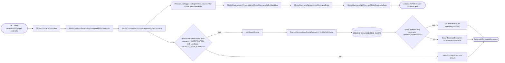
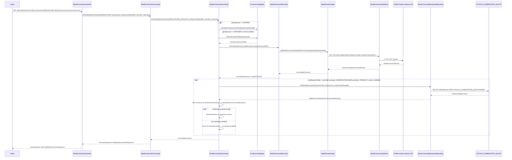

# Chain — ModelContractsController · GET /model-contracts

<!-- scaffold — phase 1 -->

- **Action point** — `ModelContractsController` (wpfe-am / ucc-offer-generator)
- **Kind** — rest-controller
- **Source** — `ucc-offer-generator/src/main/java/coba/wtp/wpfe/ucc/offer/generator/controller/ModelContractsController.java`
- **Handler** — `getModelContracts(Integer, ProductLineEnum, ProductLineMandateEnum, ScenarioEnum, UseCaseEnum)` — `.../ModelContractsController.java:48`
- **Trigger** — `GET /offer-generator/v1/model-contracts`
- **Preconditions** — none observed
- **First hop** — `ModelContractProcess.retrieveModelContracts()` (wpfe-am / ucc-offer-generator)

<!-- analysis — phase 2 -->

## Story

As an **advisor or retail customer browsing the offer generator**, I want to retrieve all available model contracts for a given product line and risk-return profile so that I can select one as the basis for my investment offer.

- **Given** a valid `riskReturnProfile`, `productLine` (and optionally `productLineMandate`, `scenario`, `useCase`) in the request parameters
- **When** `GET /offer-generator/v1/model-contracts` is called
- **Then** all model contracts matching the product line filter are returned from CPMS, and if a risk-return profile is provided (and not a modification scenario), one contract is marked as default based on the stocks-and-commodities quota
- **Unless** no matching contracts exist — an empty list is returned with no default set

## Chain

Branch 1 · primary
  ModelContractsController
  → ModelContractProcessImpl
  → ModelContractServiceImpl
  → ProductLineMapper (builds filter)
  → ModelContractsMnCImpl
  → ModelContractsApi
  → ModelContractsApiClient
  ⇒ [external]  CPMS model-contracts API, via `SecuritiesPortfolioDetailsApiAbstractRestClient`

Branch 2 · diverges at ModelContractServiceImpl
  → getDefaultQuota()
      riskReturnProfile is non-null AND scenario ≠ MODIFICATION AND useCase ≠ PRODUCT_LINE_CHANGE
  → StocksCommoditiesQuotaRepository
  ⇒ [db]  STOCKS_COMMODITIES_QUOTA

- **Terminals reached** — `external` (CPMS model-contracts API, via `wpfe-shared / wpfe-shared-cpms`), `db` (`STOCKS_COMMODITIES_QUOTA`, via `ucc-offer-generator`)

## Diagrams

### Process flow — primary



### Sequence — primary



## Journey

When the **offer generator UI** calls `GET /offer-generator/v1/model-contracts` to display available model contracts for a selected product line, the request enters at step 1 to handle retrieval of all matching model contracts. Once that completes, the flow moves to step 2 because the process layer delegates business logic to the service layer. From there, step 3 takes over to build the CPMS filter and fetch contracts, and so on through every hop until a terminal is reached or the response is assembled.

1. **ModelContractsController.getModelContracts** (wpfe-am / ucc-offer-generator)

   **Source.** `ucc-offer-generator/src/main/java/coba/wtp/wpfe/ucc/offer/generator/controller/ModelContractsController.java:48`

   **Role.** Receives the HTTP GET request with query parameters (`riskReturnProfile`, `productLine`, optional `productLineMandate`, `scenario`, `useCase`), delegates to the process layer, and wraps the result in a `JsonResponse`.

   **Preconditions.** None observed — all parameters are optional except `productLine` which is required by the caller but not enforced at this level.

   **Effect.** Returns a JSON response wrapping `ProcessResponse<GetModelContractsResponse>`.

2. **ModelContractProcessImpl.retrieveModelContracts** (wpfe-am / ucc-offer-generator)

   **Source.** `ucc-offer-generator/src/main/java/coba/wtp/wpfe/ucc/offer/generator/process/impl/ModelContractProcessImpl.java:63`

   **Role.** Delegates to the service layer and wraps the returned list of model contracts into a `GetModelContractsResponse` inside a `ProcessResponse`.

   **Downstream.** A `ProcessResponse<GetModelContractsResponse>` containing the full list of matching model contracts.

3. **ModelContractServiceImpl.retrieveModelContracts** (wpfe-am / ucc-offer-generator)

   **Source.** `ucc-offer-generator/src/main/java/coba/wtp/wpfe/ucc/offer/generator/service/impl/ModelContractServiceImpl.java:90`

   **Role.** Builds the product-line filter string, fetches all matching model contracts from CPMS via the MnC, then conditionally marks one contract as default based on the stocks-and-commodities quota for the given risk-return profile.

   **Steps.**

   - **3.1 Build product line filter** · `ModelContractServiceImpl.java:92`

     **Role.** Maps the incoming `ProductLineEnum` to a CPMS-compatible filter string. For `EXPERT` product lines, it delegates to `toExpertProductLinesFilter(productLineMandate)` which resolves the mandate name (e.g., "product-line-expert-active-selection"). For `EFFICIENT` or `EXCLUSIVE`, it uses `toProductLinesFilter(productLine)`. The `EXPERT` line without a mandate throws `UnsupportedOperationException`.

     **Source.** `wpfe-shared/wpfe-shared-cpms/src/main/java/coba/wtp/wpfe/shared/cpms/util/ProductLineMapper.java:38`

   - **3.2 Fetch model contracts from CPMS** · `ModelContractServiceImpl.java:95`

     **Role.** Calls `modelContractsMnC.retrieveModelContractsByProductLine(productLineFilter)` to retrieve all model contracts matching the filter from CPMS.

     **Source.** `ucc-offer-generator/src/main/java/coba/wtp/wpfe/ucc/offer/generator/service/impl/ModelContractServiceImpl.java:95`

   - **3.3 Decide whether to set a default contract** · `ModelContractServiceImpl.java:98`

     **Role.** Checks if the caller provided a `riskReturnProfile` and is not in a modification or product-line-change scenario. If so, it proceeds to find a matching default; otherwise it returns the raw list without setting any default.

     **Source.** `ucc-offer-generator/src/main/java/coba/wtp/wpfe/ucc/offer/generator/service/impl/ModelContractServiceImpl.java:98`

   - **3.4 Fetch default quota from DB** · `ModelContractServiceImpl.java:102`

     **Role.** Calls `getDefaultQuota()` which queries the `STOCKS_COMMODITIES_QUOTA` table for the matching row and returns its `defaultQuota`. If no row is found, it throws a `TechnicalException`.

     **Source.** `ucc-offer-generator/src/main/java/coba/wtp/wpfe/ucc/offer/generator/service/impl/ModelContractServiceImpl.java:63`

   - **3.5 Match and mark default contract** · `ModelContractServiceImpl.java:107`

     **Role.** Filters the returned model contracts to find one whose `offensiveAssetsShare` equals the fetched `defaultStocksCommoditiesQuota`. If found, sets `setDefault(true)` on it. If no match exists, throws a `TechnicalException` with the quota value.

     **Source.** `ucc-offer-generator/src/main/java/coba/wtp/wpfe/ucc/offer/generator/service/impl/ModelContractServiceImpl.java:107`

4. **ProductLineMapper.toExpertProductLinesFilter / toProductLinesFilter** (wpfe-shared / wpfe-shared-cpms)

   **Source.** `wpfe-shared/wpfe-shared-cpms/src/main/java/coba/wtp/wpfe/shared/cpms/util/ProductLineMapper.java:38`

   **Role.** Converts the incoming Spring enum (`ProductLineEnum`, `ProductLineMandateEnum`) into a CPMS-compatible string filter. Maps `EFFICIENT` → "product-line-efficient", `EXCLUSIVE` → "product-line-exclusive", and expert mandates to their respective strategy IDs.

5. **ModelContractsMnCImpl.retrieveModelContractsByProductLine** (wpfe-shared / wpfe-shared-cpms)

   **Source.** `wpfe-shared/wpfe-shared-cpms/src/main/java/coba/wtp/wpfe/shared/cpms/mnc/impl/ModelContractsMnCImpl.java:127`

   **Role.** Wraps the product-line filter string into a `ModelContractsRequest` with the property key `coba-asset-management-product-lines`, then delegates to `getModelContracts(request)` which calls the API client.

6. **ModelContractsApi.getModelContractsData** (wpfe-shared / wpfe-shared-cpms)

   **Source.** `wpfe-shared/wpfe-shared-cpms/src/main/java/coba/wtp/wpfe/shared/cpms/api/modelcontracts/ModelContractsApi.java:23`

   **Role.** Interface declaration for the CPMS model-contracts API call. The actual implementation is in `ModelContractsApiClient`.

7. **ModelContractsApiClient.getModelContractsData** (wpfe-shared / wpfe-shared-cpms)

   **Source.** `wpfe-shared/wpfe-shared-cpms/src/main/java/coba/wtp/wpfe/shared/cpms/api/modelcontracts/ModelContractsApiClient.java:45`

   **Role.** Builds the HTTP GET URL by appending query parameters (`properties=coba-asset-management-product-lines:<filter>`) to the CPMS base path, sends the request via `RestTemplate`, and returns the response body wrapped in an `Optional`. On failure, throws a `TechnicalException`.

   **Terminal — external**

8. **StocksCommoditiesQuotaRepository.findDefaultQuota** (wpfe-am / ucc-offer-generator)

   **Source.** `ucc-offer-generator/src/main/java/coba/wtp/wpfe/ucc/offer/generator/repository/StocksCommoditiesQuotaRepository.java:27`

   **Role.** Executes a JPQL query against the `STOCKS_COMMODITIES_QUOTA` table to find the default quota for the given risk-return profile, product line, and mandate. Returns an `Optional<BigDecimal>` — empty if no matching row exists.

   **Terminal — db**

## Data reached

- **external — CPMS model-contracts API, via `ModelContractsApiClient` (wpfe-shared / wpfe-shared-cpms)**
  - Business problem solved — As the **offer generator**, I need the full list of available model contracts filtered by product line strategy so that I can present them to the advisor or customer for selection. Therefore we call this API at `GET /securities-api/portfolio-details/v2/model-contracts?properties=coba-asset-management-product-lines:<filter>` to retrieve all matching model contracts from CPMS. Then we map each contract's properties (product line, fees, proportions, sustainability categories) into domain objects (`ModelContract`, `ModelContractProperties`), so we can offer them with full detail — citing every file where that data actually gets used, even one this chain's own Journey never opens.

  - **Request path**
    ```json
    {
      "properties": "coba-asset-management-product-lines:product-line-efficient"
    }
    ```
    `properties` — query parameter, origin: built from the request's `productLine` and optional `productLineMandate` via `ProductLineMapper`.

  - **Request body** — none (GET request with query parameters).

  - **Response fields used**
    ```json
    {
      "modelContracts": [
        {
          "modelContractId": "mc-12345",
          "properties": {
            "coba-asset-management-product-lines": "product-line-efficient",
            "coba-general-attributes-share-offensive-modules": 0.60,
            "coba-profile-costs-fee-model-name": "PROPORTIONAL"
          },
          "proportions": [
            {
              "moduleId": "mod-a1b2c3",
              "currentValue": 50.0
            }
          ]
        }
      ]
    }
    ```
    `modelContractId` → contract identifier used downstream for performance lookups and saving (`ModelContractServiceImpl.java:48`, `OfferDataService.java`).
    `properties.coba-general-attributes-share-offensive-modules` → compared against the default quota to determine which contract is marked as default (`ModelContractServiceImpl.java:107`).
    `proportions[].moduleId` and `currentValue` → module weight allocations for each contract, used in the UI display.

  - **Response fields discarded** — all other properties on each model contract (e.g., `coba-target-markets-*`, `coba-asset-management-pension-strategy`, fee rates, customer channels) are mapped into `ModelContractProperties` but not consumed by this chain's downstream logic beyond the offensive assets share.

- **db — `STOCKS_COMMODITIES_QUOTA`, via `StocksCommoditiesQuotaRepository` (wpfe-am / ucc-offer-generator)**
  - Business problem solved — As the **offer generator service**, I need the default stocks-and-commodities quota for a given risk-return profile and product line so that I can identify which model contract should be presented as the default selection. Therefore we query `STOCKS_COMMODITIES_QUOTA` via `StocksCommoditiesQuotaRepository.findDefaultQuota(riskReturnProfile, productLine, productLineMandate)` to retrieve the matching row's `defaultQuota`, so we can compare it against each contract's `offensiveAssetsShare` — citing every file where that data actually gets used. The quota is defined per risk-return profile and product line mandate combination in a configuration table maintained by business users.

  - **Query** — `findDefaultQuota(riskReturnProfile, productLine, productLineMandate)` — read-only JPQL query selecting only the `defaultQuota` column.
    ```sql
    SELECT scq.defaultQuota FROM StocksCommoditiesQuota scq
    WHERE scq.riskReturnProfile = :riskReturnProfile
      AND scq.productLine = :productLine
      AND ((:productLineMandate IS NULL AND scq.productLineMandate IS NULL) OR scq.productLineMandate = :productLineMandate)
    ```

  - **Argument**
    ```json
    {
      "riskReturnProfile": 3,
      "productLine": "EFFICIENT",
      "productLineMandate": null
    }
    ```
    `riskReturnProfile` ← request parameter, origin: caller's selection.
    `productLine` ← request parameter, origin: caller's selection.
    `productLineMandate` ← optional request parameter, origin: caller's selection or null.

  - **Response fields used** — `defaultQuota` (BigDecimal) → compared against each contract's `offensiveAssetsShare` to find the default (`ModelContractServiceImpl.java:107`). Example value: `60.00`.

## Acceptance Criteria

1. **All model contracts for a product line are returned** — Given a valid `productLine` (e.g., `EFFICIENT`) and no `riskReturnProfile`, when the endpoint is called, then all model contracts matching that product line filter from CPMS are returned in the response body with no default contract set.
   - Evidence: `ModelContractServiceImpl.java:95-100`
   - How to: call the endpoint with `productLine=EFFICIENT` and omit `riskReturnProfile`; confirm all contracts for that product line appear in the response, none have `default=true`, and no DB query against `STOCKS_COMMODITIES_QUOTA` is executed.

2. **Default contract is set when riskReturnProfile is provided** — Given a valid `productLine` and a non-null `riskReturnProfile` (and scenario ≠ MODIFICATION), when the endpoint is called, then one model contract whose `offensiveAssetsShare` matches the DB-stored default quota has `default=true` set on it.
   - Evidence: `ModelContractServiceImpl.java:98-115`
   - How to: call with `productLine=EFFICIENT&riskReturnProfile=3`; confirm a DB query returns a matching quota, and one contract in the response has its default flag set. To reproduce: insert a row in `STOCKS_COMMODITIES_QUOTA` for profile 3 / EFFICIENT with `defaultQuota = 60.00`, ensure a CPMS model contract exists with `offensiveAssetsShare = 60.0`, and assert the response contains exactly one contract with `default=true`.

3. **TechnicalException when no matching default quota in DB** — Given a valid `productLine` and `riskReturnProfile`, when the endpoint is called but no row exists in `STOCKS_COMMODITIES_QUOTA` for those parameters, then the request fails with a `TechnicalException` containing the message "No Model Contract available for default stocks and commodities quota".
   - Evidence: `ModelContractServiceImpl.java:63-70`, `ModelContractServiceImpl.java:112`
   - How to: call with `productLine=EFFICIENT&riskReturnProfile=99` where no matching row exists in `STOCKS_COMMODITIES_QUOTA`; confirm a 500 response with the technical exception message.

4. **TechnicalException when default quota matches no contract** — Given a valid `productLine`, `riskReturnProfile`, and a DB row that returns a default quota, when the endpoint is called but none of the returned model contracts have an `offensiveAssetsShare` matching that quota, then the request fails with a `TechnicalException` containing the quota value.
   - Evidence: `ModelContractServiceImpl.java:107-115`
   - How to: set `STOCKS_COMMODITIES_QUOTA.defaultQuota = 80.00` for profile 3 / EFFICIENT, but ensure all CPMS model contracts have `offensiveAssetsShare ≠ 80.0`; confirm the exception is thrown.

5. **Modification scenario skips default-setting** — Given a valid `productLine`, `riskReturnProfile`, and `scenario=MODIFICATION`, when the endpoint is called, then no DB query runs and all returned contracts have `default=false` (or unset).
   - Evidence: `ModelContractServiceImpl.java:98-100`
   - How to: call with `productLine=EFFICIENT&riskReturnProfile=3&scenario=MODIFICATION`; confirm the response contains all matching contracts without any default flag, and no query against `STOCKS_COMMODITIES_QUOTA` appears in logs.

6. **Product-line-change use case skips default-setting** — Given a valid `productLine`, `riskReturnProfile`, and `useCase=PRODUCT_LINE_CHANGE`, when the endpoint is called, then all returned contracts have no default set.
   - Evidence: `ModelContractServiceImpl.java:98-100`
   - How to: call with `productLine=EFFICIENT&riskReturnProfile=3&useCase=PRODUCT_LINE_CHANGE`; confirm no DB query and no contract has `default=true`.

7. **EXPERT product line requires mandate** — Given `productLine=EXPERT` without a `productLineMandate`, when the endpoint is called, then an `UnsupportedOperationException` is thrown before any CPMS call.
   - Evidence: `ProductLineMapper.java:38`
   - How to: call with `productLine=EXPERT` and no mandate; confirm the exception is thrown at the filter-building step. To reproduce: submit a request with `productLine=EXPERT` and omit `productLineMandate`.

## Business Takeaways

- **What this does for the business** — retrieves all model contracts available for a selected product line from CPMS, and when a risk-return profile is provided (outside of modification or product-line-change scenarios), identifies which contract should be presented as the default by matching its offensive assets share against a configurable quota stored in `STOCKS_COMMODITIES_QUOTA`.
- **Depends on** — the CPMS model-contracts API (external, returns full contract details including fees and proportions); the `STOCKS_COMMODITIES_QUOTA` table (read-only, configuration data maintained by business users)
- **Ingredients** — `riskReturnProfile` (request), `productLine` (request), optional `productLineMandate`, `scenario`, `useCase`
- **Preparation** — map the product line to a CPMS filter string, fetch all matching contracts from CPMS
- **Dish** — `GetModelContractsResponse` containing a list of `ModelContract` objects, one optionally marked as default
---

## Cross-cutting rules

- One chain file per trigger — endpoint, schedule, listener, runner or mount — never per class.
- No tables, anywhere. Lists only, at most one sub-bullet level.
- No Open questions section: `UNKNOWN` is written inline, where the missing fact belongs, with a one-line reason. `## Business Takeaways` is the terminal section.
- Every claim about behaviour cites a `file:line`. A claim with no path is not checkable.
- Every acronym is expanded on first use, or marked `UNKNOWN`. `MnC` is **Map and Call**.
- Every class is attributed to its repository, and a shared class to its shared module too: `PersonApiClient (wpfe-shared / person)`.
- No host, no `BASE_URL` — path templates and parameters only.
- A discarded response field is named, not summarised away.
- Cross-links use a relative path plus a target-file anchor, never a bare same-document anchor. **A heading containing an em dash produces a double hyphen in its anchor** — `## Step 1 — Prepare` becomes `#step-1--prepare`, and getting it wrong produces a link that silently goes nowhere.

## Write plan

| Pass | Written by | Sections |
|---|---|---|
| scaffold | step 02 | the header block above the analysis marker |
| 1 | the tracer | Story, Chain, Diagrams |
| 2 | the tracer | Journey |
| 3 | the tracer | Data reached, Acceptance Criteria, Business Takeaways |

Each pass stops on a section boundary — never mid-sentence, mid-list, or inside a fenced Mermaid block. Passes 2 and 3 append; they never re-emit what an earlier pass wrote, and never touch the scaffold. A chain whose Acceptance Criteria alone would break the 300-line budget splits them into `chain-traces/<slug>-criteria.md`, registered in `manifest.json` before the first write.

