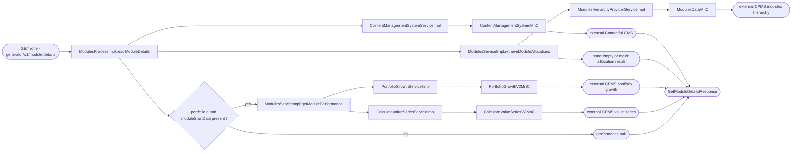
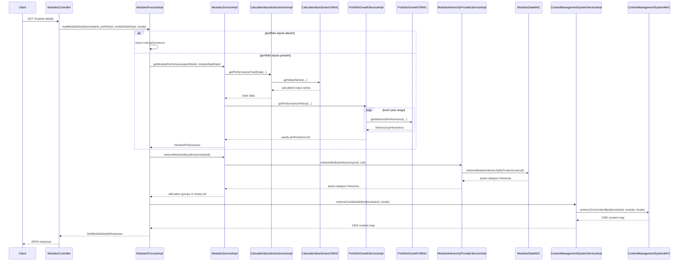

# Chain — ModulesController · GET /module-details

<!-- scaffold — phase 1 -->

- **Action point** — `ModulesController` (wpfe-am / ucc-offer-generator)
- **Kind** — rest-controller
- **Source** — `ucc-offer-generator/src/main/java/coba/wtp/wpfe/ucc/offer/generator/controller/ModulesController.java`
- **Handler** — `getModuleDetails(String, String, LocalDate, String)` — `.../ModulesController.java:63`
- **Trigger** — `GET /offer-generator/v1/module-details`
- **Preconditions** — none observed
- **First hop** — `ModulesProcess.readModuleDetails()` (wpfe-am / ucc-offer-generator)

<!-- analysis — phase 2 -->

## Story

As a client of the offer-generator module API, I want the details for one module so that the
module page can display performance, allocations, and localized CMS content.

- **Given** a required `moduleId` and `locale`
- **When** `GET /offer-generator/v1/module-details` is called
- **Then** the response contains module performance when both portfolio inputs are present,
  allocation groups, and localized CMS module content
- **When** either `portfolioId` is blank or `moduleStartDate` is absent, performance is `null`
  while allocations and CMS content are still retrieved

## Chain

**Branch 1 · primary**

```text
Branch 1 · primary
  ModulesController.getModuleDetails(String, String, LocalDate, String)
  → ModulesProcessImpl.readModuleDetails(String, String, LocalDate, String)
  → ModulesServiceImpl.getModulePerformance(String, LocalDate)
  → CalculateValueSeriesServiceImpl.getPerformanceChartData(String, LocalDate, LocalDate, Aggregation)
  → CalculateValueSeriesV2MnC.getValueSeries(String, LocalDate, LocalDate, Aggregation)
  ⇒ [external] CPMS calculated value-series service

Branch 2 · diverges at ModulesServiceImpl.getModulePerformance
  → PortfolioGrowthServiceImpl.getPerformanceHistory(String, LocalDate, Boolean, Aggregation)
  → PortfolioGrowthV2MnC.getHistoricalPerformance(String, LocalDate, LocalDate, Boolean, Aggregation)
  ⇒ [external] CPMS portfolio-growth service

Branch 3 · diverges at ModulesProcessImpl.readModuleDetails
  → ModulesServiceImpl.retrieveModuleAllocations(String)
  → ModulesHierarchyProviderServiceImpl.retrieveModulesHierarchy(ProductLineEnum, ProductLineMandateEnum)
  → ModulesDataMnC.retrieveModulesHierarchyByProductLine(String)
  ⇒ [external] CPMS modules hierarchy service

Branch 4 · diverges at ModulesProcessImpl.readModuleDetails
  → ContentManagementSystemServiceImpl.retrieveCmsModuleById(String, String)
  → ContentManagementSystemMnC.retrieveCmsContentById(String, String, String)
  ⇒ [external] Contentful CMS module content
```

- **Terminals reached** — `external` (CPMS value series, CPMS portfolio growth, CPMS modules
  hierarchy, and Contentful CMS); `none` (performance branch when required portfolio inputs are
  absent, and empty allocations when the module is not found or has no applicable strategy)

## Diagrams

### Process flow — primary



### Sequence — primary



## Journey

1. **ModulesController.getModuleDetails** (wpfe-am / ucc-offer-generator)

   **Source.** `ucc-offer-generator/src/main/java/coba/wtp/wpfe/ucc/offer/generator/controller/ModulesController.java:61-78`

   **Role.** Accepts the module identifier, optional portfolio inputs, and locale, then delegates
   the request to the module process and wraps its `ProcessResponse` as JSON.

   **Preconditions.** `moduleId` and `locale` are required request parameters. `portfolioId` and
   `moduleStartDate` are optional.

   **Downstream.** `ModulesProcessImpl.readModuleDetails` consumes all four request values.

2. **ModulesProcessImpl.readModuleDetails** (wpfe-am / ucc-offer-generator)

   **Source.** `ucc-offer-generator/src/main/java/coba/wtp/wpfe/ucc/offer/generator/process/impl/ModulesProcessImpl.java:46-63`

   **Role.** Orchestrates performance, allocation, and CMS lookups, then assembles
   `GetModuleDetailsResponse`.

   **Steps.**

   - **2.1 Performance selection** · `ModulesProcessImpl.java:51-53`

     **Role.** Returns `null` performance when either optional portfolio input is unavailable;
     otherwise delegates to the module service.

   - **2.2 Allocation lookup** · `ModulesProcessImpl.java:55`

     **Role.** Retrieves allocation groups for the requested module.

   - **2.3 CMS lookup** · `ModulesProcessImpl.java:56-59`

     **Role.** Retrieves localized CMS content for the requested module.

3. **ModulesServiceImpl.getModulePerformance** (wpfe-am / ucc-offer-generator)

   **Source.** `ucc-offer-generator/src/main/java/coba/wtp/wpfe/ucc/offer/generator/service/impl/ModulesServiceImpl.java:111-128`

   **Role.** Builds module performance from chart data and yearly historical performance.

   **Downstream.** The process places the resulting `ModulePerformance` in the response.

4. **CalculateValueSeriesServiceImpl.getPerformanceChartData** (wpfe-am / ucc-offer-generator)

   **Source.** `ucc-offer-generator/src/main/java/coba/wtp/wpfe/ucc/offer/generator/service/impl/CalculateValueSeriesServiceImpl.java:29-40`

   **Role.** Requests the value series for the portfolio from the MnC and maps the returned values
   by date to the first CPMS total value.

5. **CalculateValueSeriesV2MnC.getValueSeries** (wpfe-shared / shared dependency)

   **Source.** `CalculateValueSeriesServiceImpl.java:34-39`

   **Role.** Maps the request to the CPMS value-series integration and returns calculated series.

6. **PortfolioGrowthServiceImpl.getPerformanceHistory** (wpfe-am / ucc-offer-generator)

   **Source.** `ucc-offer-generator/src/main/java/coba/wtp/wpfe/ucc/offer/generator/service/impl/PortfolioGrowthServiceImpl.java:35-71`

   **Role.** Splits the module period into yearly ranges, requests each range, and converts the
   results into yearly performance values.

   **On failure.** If any range lookup throws, logs a warning and returns an empty list.

7. **PortfolioGrowthV2MnC.getHistoricalPerformance** (wpfe-shared / shared dependency)

   **Source.** `PortfolioGrowthServiceImpl.java:102-108`

   **Role.** Calls the CPMS portfolio-growth integration for one date range.

8. **ModulesServiceImpl.retrieveModuleAllocations** (wpfe-am / ucc-offer-generator)

   **Source.** `ucc-offer-generator/src/main/java/coba/wtp/wpfe/ucc/offer/generator/service/impl/ModulesServiceImpl.java:251-263`

   **Role.** Loads the unfiltered module hierarchy, finds the requested module, and maps its
   investment strategy to allocation data.

   **On failure.** An unknown module or `NOT_APPLICABLE` strategy produces an empty list.

9. **ModulesHierarchyProviderServiceImpl.retrieveModulesHierarchy** (wpfe-am / ucc-offer-generator)

   **Source.** `ucc-offer-generator/src/main/java/coba/wtp/wpfe/ucc/offer/generator/service/impl/ModulesHierarchyProviderServiceImpl.java:25-33`

   **Role.** For this call's null product line, requests the complete hierarchy from the modules
   MnC. The result is cacheable under the CPMS modules cache.

10. **ModulesDataMnC.retrieveModulesHierarchyByProductLine** (wpfe-shared / shared dependency)

    **Source.** `ModulesHierarchyProviderServiceImpl.java:31-33`

    **Role.** Retrieves the CPMS module hierarchy without a product-line filter.

11. **ContentManagementSystemServiceImpl.retrieveCmsModuleById** (wpfe-am / ucc-offer-generator)

    **Source.** `ucc-offer-generator/src/main/java/coba/wtp/wpfe/ucc/offer/generator/service/impl/ContentManagementSystemServiceImpl.java:28-35`

    **Role.** Retrieves and caches localized CMS content using the `module` content type.

12. **ContentManagementSystemMnC.retrieveCmsContentById** (wpfe-shared / shared dependency)

    **Source.** `ContentManagementSystemServiceImpl.java:33-34`

    **Role.** Calls the Contentful CMS integration for the module identifier, content type, and
    locale.

## Data reached

- **external — CPMS value-series service** · date-keyed calculated values used for the performance
  chart; request uses portfolio ID, start date, current date, and module aggregation.
- **external — CPMS portfolio-growth service** · historical performance for each yearly date
  range; request uses portfolio ID, range dates, annual-volatility flag, and module aggregation.
- **external — CPMS modules hierarchy service** · asset categories used to resolve the module's
  investment strategy; this lookup uses no product-line filter.
- **external — Contentful CMS** · localized module content for content type `module`, selected by
  module ID and locale.
- **none — optional performance and empty allocation outcomes** · no external performance lookup
  occurs when portfolio inputs are absent; unknown modules and non-applicable strategies produce
  an empty allocation list.

## Acceptance Criteria

1. **The controller passes all request values to the process.**

   Evidence: `ModulesController.java:62-78`.

2. **Missing portfolio inputs leave performance null but do not skip allocations or CMS content.**

   Evidence: `ModulesProcessImpl.java:51-59` and `ModulesProcessImpl.java:65-75`.

3. **Present portfolio inputs produce chart data and yearly performance.**

   Evidence: `ModulesServiceImpl.java:111-128`.

4. **A portfolio-growth failure returns an empty yearly-performance list.**

   Evidence: `PortfolioGrowthServiceImpl.java:46-69`.

5. **Allocation lookup returns strategy-specific mock allocations or an empty list.**

   Evidence: `ModulesServiceImpl.java:252-262`.

6. **CMS lookup uses the module ID, content type `module`, and requested locale.**

   Evidence: `ContentManagementSystemServiceImpl.java:28-35`.

7. **The process returns performance, allocations, and CMS content in one response.**

   Evidence: `ModulesProcessImpl.java:61-63`.

## Business Takeaways

- This endpoint is a read-only aggregation endpoint for the module-details view.
- Performance is optional, while allocations and localized CMS content are requested for every
  invocation.
- Portfolio history is intentionally tolerant of an individual integration failure by returning
  an empty history.
- Module allocation behavior is driven by the module's investment strategy; unknown modules do not
  fail the request.
