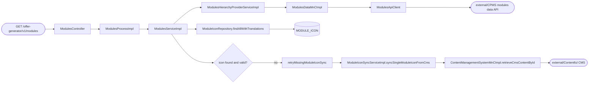
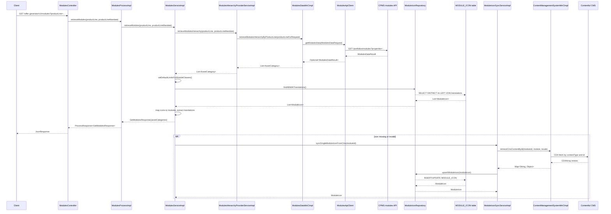

# Chain — ModulesController · GET /modules

<!-- scaffold — phase 1 -->

- **Action point** — `ModulesController` (wpfe-am / ucc-offer-generator)
- **Kind** — rest-controller
- **Source** — `ucc-offer-generator/src/main/java/coba/wtp/wpfe/ucc/offer/generator/controller/ModulesController.java`
- **Handler** — `getModules(ProductLineEnum, ProductLineMandateEnum)` — `.../ModulesController.java:43`
- **Trigger** — `GET /offer-generator/v1/modules`
- **Preconditions** — none observed
- **First hop** — `ModulesProcess.retrieveModules()` (wpfe-am / ucc-offer-generator)

<!-- analysis — phase 2 -->

## Story

As a **retail customer browsing their portfolio modules**, I want to see all available investment modules for my product line so that **I can understand what is available and make informed allocation decisions**.

- **Given** an active advisory session with a valid `productLine` parameter (and optionally `productLineMandate`)
- **When** `GET /offer-generator/v1/modules?productLine={value}&productLineMandate={value}` is called
- **Then** the system returns a complete module hierarchy — asset categories, classes, and modules — enriched with icons and translations from CMS
- **Unless** a required module icon or translation is missing in the database after retry — rejected with a technical error

## Chain

Branch 1 · primary
  ModulesController.getModules()
  → ModulesProcessImpl.retrieveModules()
  → ModulesServiceImpl.retrieveModules()
    → modulesHierarchyProviderService.retrieveModulesHierarchy()
      → ModulesHierarchyProviderServiceImpl.retrieveModulesHierarchy()
        → ModulesDataMnCImpl.retrieveModulesHierarchyByProductLine()
          → ModulesApiClient.getModulesData()
          ⇒ [external] CPMS modules data API (wpfe-shared / cpms)

Branch 2 · diverges at ModulesServiceImpl
  → includeModuleIconsInModuleList()
    → ModuleIconRepository.findAllWithTranslations()
    ⇒ [db] MODULE_ICON table (wpfe-am / ucc-offer-generator)

Branch 3 · diverges at ModulesServiceImpl.includeModuleIconsInModuleList
  → retryMissingModuleIconSync()
    → ModuleIconSyncServiceImpl.syncSingleModuleIconFromCms()
      → ContentManagementSystemMnCImpl.retrieveCmsContentById()
        → CDAClient (Contentful CMS SDK)
        ⇒ [external] Contentful CMS (wpfe-shared / cms)

- **Terminals reached** — external (CPMS modules data API, via `ModulesApiClient` in wpfe-shared / cpms), db (MODULE_ICON table, via `ModuleIconRepository` in ucc-offer-generator), external (Contentful CMS, via CDAClient SDK in wpfe-shared / cms)

## Diagrams

### Process flow — primary



### Sequence — primary



## Journey

When **the trigger fires** (a client calls `GET /offer-generator/v1/modules` with a `productLine` parameter), the request enters at **[step 1]** to handle **gathering all available investment modules for the requested product line**. Once that completes, the flow moves to **[step 2]** because **the process layer delegates business logic to the service**, and so on through every hop until a terminal is reached or the response is assembled.

Below is each step in call order — what it does, why it exists, how it handles failure, and what passes the baton forward.

1. **ModulesController.getModules(ProductLineEnum, ProductLineMandateEnum)** (wpfe-am / ucc-offer-generator)

   **Source.** `ucc-offer-generator/src/main/java/coba/wtp/wpfe/ucc/offer/generator/controller/ModulesController.java:43`

   **Role.** REST entry point that receives the product line and optional mandate from the HTTP request, delegates to the process layer, and wraps the result in a JSON response.

   **Preconditions.** `productLine` parameter is required; `productLineMandate` is optional. No authentication or session state enforced at this level — handled upstream by Spring Security.

   **Effect.** Returns a `JsonResponse` wrapping `ProcessResponse<GetModulesResponse>` containing the module hierarchy for the client.

2. **ModulesProcessImpl.retrieveModules(ProductLineEnum, ProductLineMandateEnum)** (wpfe-am / ucc-offer-generator)

   **Source.** `ucc-offer-generator/src/main/java/coba/wtp/wpfe/ucc/offer/generator/process/impl/ModulesProcessImpl.java:47`

   **Role.** Delegates to the service layer for module retrieval and wraps the result in a `GetModulesResponse` inside a `ProcessResponse`. No business logic here — pure delegation.

   **Downstream.** A `List<AssetCategory>` containing the full module hierarchy, or an empty list if no modules are found.

3. **ModulesServiceImpl.retrieveModules(ProductLineEnum, ProductLineMandateEnum)** (wpfe-am / ucc-offer-generator)

   **Source.** `ucc-offer-generator/src/main/java/coba/wtp/wpfe/ucc/offer/generator/service/impl/ModulesServiceImpl.java:87`

   **Role.** Orchestrates the module retrieval in three phases: fetches the hierarchy from CPMS, sets default limits on any missing module class limits, then enriches modules with icons and translations from CMS.

   **Steps.**

   - **3.1 Fetch — retrieve module hierarchy from CPMS** · `ModulesServiceImpl.java:90`

     **Role.** Calls `modulesHierarchyProviderService.retrieveModulesHierarchy(productLine, productLineMandate)` to get the full asset category → asset class → module class → module hierarchy from CPMS.

     **Downstream.** A `List<AssetCategory>` with modules populated but no icons or translations yet.

   - **3.2 Enrich — set default limits for module classes** · `ModulesServiceImpl.java:91`

     **Role.** Iterates through all asset categories, asset classes, and module classes in the hierarchy. For each `ModuleClass` whose `limits` is null or has null limit fields, sets a default upper limit of 100% (BigDecimal.ONE) for every limit type — ensuring no module class has an unbounded allocation.

     **Effect.** Mutates the hierarchy in-place; no new objects created. Pure computation with no outbound calls.

   - **3.3 Enrich — include module icons and translations** · `ModulesServiceImpl.java:92`

     **Role.** Fetches all module icons from the local database, maps each icon to its corresponding module in the hierarchy, extracts localized translations for CMS locales (de-DE, en-GB), and applies them to the modules. If an icon or translation is missing after a retry sync attempt, throws a technical exception.

     **Steps.**

     - **3.3.1 Fetch — all module icons from database** · `ModulesServiceImpl.java:94`

       **Role.** Calls `moduleIconRepository.findAllWithTranslations()` to load every module icon and its associated translations in a single JPA query with eager fetch.

       **Terminal — db.** Queries the MODULE_ICON table via JPQL `SELECT DISTINCT mi FROM ModuleIcon mi LEFT JOIN FETCH mi.translations` (`ModuleIconRepository.java:17-20`).

     - **3.3.2 Map — convert hierarchy to flat modules list** · `ModulesServiceImpl.java:95`

       **Role.** Calls `hierarchyToModules(hierarchy)` from `ModuleHierarchyHelper` to flatten the nested AssetCategory → AssetClass → ModuleClass tree into a stream of individual `Module` objects.

     - **3.3.3 Match — find icon for each module** · `ModulesServiceImpl.java:97`

       **Role.** For each module, looks up its matching `ModuleIcon` by comparing the module's ID or technical ID against the icon's moduleId. If a valid icon (with non-null icon bytes and non-blank translations) is found in the DB, uses it directly.

     - **3.3.4 Retry — sync missing icon from CMS** · `ModulesServiceImpl.java:100`

       **Role.** When no matching icon or an invalid one is found in the database, calls `retryMissingModuleIconSync()` to attempt a live fetch from Contentful CMS and upsert it into the local database. If this also fails (no content found or still missing data), throws a technical exception.

       **Terminal — external.** Calls through `ContentManagementSystemMnCImpl` to the Contentful CMS API via CDAClient SDK (`ModulesServiceImpl.java:100-102`).

     - **3.3.5 Extract — localized translations** · `ModulesServiceImpl.java:107`

       **Role.** For each CMS locale (de-DE, en-GB), extracts the module name and helper text from the icon's translation record and builds a `ModuleTranslation` object. If any required translation is missing after the retry, throws a technical exception.

     - **3.3.6 Apply — set icon and translations on module** · `ModulesServiceImpl.java:120`

       **Role.** Sets the icon bytes (base64-encoded image data) and the list of localized translations onto each module object in-place.

   **Downstream.** A fully enriched `List<AssetCategory>` with icons, translations, and default limits — ready to return to the client.

4. **ModulesHierarchyProviderServiceImpl.retrieveModulesHierarchy(ProductLineEnum, ProductLineMandateEnum)** (wpfe-am / ucc-offer-generator)

   **Source.** `ucc-offer-generator/src/main/java/coba/wtp/wpfe/ucc/offer/generator/service/impl/ModulesHierarchyProviderServiceImpl.java:34`

   **Role.** Maps the product line and mandate parameters to a CPMS request string, then delegates to the MnC. Uses Spring Cache (`@Cacheable` on cache named `cpmsModules`) so repeated calls with the same parameters hit the cache instead of calling CPMS.

   **Steps.**

   - **4.1 Map — product line to request string** · `ModulesHierarchyProviderServiceImpl.java:39`

     **Role.** Translates the Java enum values into CPMS-specific strings:
     - `EXCLUSIVE` → `"product-line-exclusive"`
     - `EFFICIENT` → `"product-line-efficient"`
     - `EXPERT` with `SUSTAINABLE` mandate → `"product-line-expert-sustainable"`
     - `EXPERT` with `INDEX_SELECTION` mandate → `"product-line-expert-index-selection"`
     - `EXPERT` with `ACTIVE_SELECTION` mandate → `"product-line-expert-active-selection"`
     - `null` product line → passes `null` to fetch all modules

   **Downstream.** A string key for the MnC call, or null.

5. **ModulesDataMnCImpl.retrieveModulesHierarchyByProductLine(String)** (wpfe-shared / wpfe-shared-cpms)

   **Source.** `wpfe-shared/wpfe-shared-cpms/src/main/java/coba/wtp/wpfe/shared/cpms/mnc/impl/ModulesDataMnCImpl.java:127`

   **Role.** Builds a `ModulesDataRequest` with the product line property, calls the API client to fetch raw module data from CPMS, then maps the flat response into a nested hierarchy of AssetCategory → AssetClass → ModuleClass → Module.

   **Steps.**

   - **5.1 Build request** · `ModulesDataMnCImpl.java:129`

     **Role.** Creates a properties map with key `coba-asset-management-product-line` and the product line string value, then wraps it in a `ModulesDataRequest`.

   - **5.2 Fetch — call CPMS API** · `ModulesDataMnCImpl.java:131`

     **Role.** Calls `modulesApi.getModulesData(request)` to retrieve raw module data from CPMS. Returns an empty list if the result is absent (404 or no matching modules).

   - **5.3 Map — flat response to nested hierarchy** · `ModulesDataMnCImpl.java:132`

     **Role.** Transforms the flat `ModulesDataResult` into a structured hierarchy:
     1. Filters out modules without a valid moduleId property (non-VV-flex modules)
     2. Maps each module's properties to typed fields (acquisition type, weight type, limits, etc.)
     3. Groups modules by tempModuleClassId into ModuleClass objects
     4. Groups module classes by asset class ID into AssetClass objects
     5. Groups asset classes into three AssetCategory buckets: offensive (stocks + commodities), defensive (bonds + liquidity), and alternative-investments
     6. Sets bidirectional parent-child relationships throughout the hierarchy

   **On failure.** CPMS returning null or empty yields an empty list, not an error — the endpoint returns an empty module list.

   **Downstream.** A `List<AssetCategory>` with three categories (offensive, defensive, alternative-investments), each containing asset classes, module classes, and modules.

6. **ModulesApiClient.getModulesData(ModulesDataRequest)** (wpfe-shared / wpfe-shared-cpms)

   **Source.** `wpfe-shared/wpfe-shared-cpms/src/main/java/coba/wtp/wpfe/shared/cpms/api/modules/ModulesApiClient.java:43`

   **Role.** Sends an HTTP GET request to the CPMS modules data endpoint with a properties filter, and returns the result as an Optional.

   **Steps.**

   - **6.1 Build URL** · `ModulesApiClient.java:62`

     **Role.** Constructs the request URL by combining the base path (`/portfolios/modules`) with query parameters. If a properties map is present, encodes each key-value pair as `key:"value"` joined by commas into a single `properties` query parameter.

   - **6.2 Send GET request** · `ModulesApiClient.java:47`

     **Role.** Executes an HTTP GET via RestTemplate with standard headers to the CPMS endpoint, deserializing the response body into `ModulesDataResult`.

   **On failure.** A 404 Not Found returns `Optional.empty()` (no modules found for the given product line). Any other HTTP error or exception throws a `TechnicalException` via `TechnicalExceptionFactory`, which propagates up and causes the endpoint to return an error response.

   **Terminal — external.** Calls CPMS at `GET /portfolios/modules?properties={key:"value",...}` (wpfe-shared / cpms).

7. **ModuleIconRepository.findAllWithTranslations()** (wpfe-am / ucc-offer-generator)

   **Source.** `ucc-offer-generator/src/main/java/coba/wtp/wpfe/ucc/offer/generator/repository/ModuleIconRepository.java:17`

   **Role.** Loads all module icons and their translations from the database in a single query with eager fetch, so the entire icon-to-translation relationship is available for matching against modules.

   **Query.** `SELECT DISTINCT mi FROM ModuleIcon mi LEFT JOIN FETCH mi.translations` — reads every row from MODULE_ICON with its associated translations.

   **Terminal — db.** Reads the MODULE_ICON table (wpfe-am / ucc-offer-generator).

8. **ModuleIconSyncServiceImpl.syncSingleModuleIconFromCms(String)** (wpfe-am / ucc-offer-generator)

   **Source.** `ucc-offer-generator/src/main/java/coba/wtp/wpfe/ucc/offer/generator/service/impl/ModuleIconSyncServiceImpl.java:79`

   **Role.** On-demand retry when a module icon is missing or invalid in the local database. Fetches the icon and translations from Contentful CMS for each locale (de-DE, en-GB), builds a ModuleIcon object, and returns it for upsert into the database.

   **Steps.**

   - **8.1 Fetch — CMS content per locale** · `ModuleIconSyncServiceImpl.java:93`

     **Role.** Calls `loadCmsContentForSingleModule(moduleId, locale)` which delegates to `contentManagementSystemMnC.retrieveCmsContentById(moduleId, "module", locale)` for each of the two CMS locales. If no content is found for a locale, skips it and continues.

   - **8.2 Extract — icon bytes and translation fields** · `ModuleIconSyncServiceImpl.java:97`

     **Role.** Uses `ModuleIconSyncHelper` to extract the base64-encoded icon bytes, module name, and helper text from the CMS content map.

   - **8.3 Upsert — persist to database** · `ModuleIconSyncServiceImpl.java:120`

     **Role.** Calls `moduleIconService.upsertModuleIcon(moduleIcon)` which saves or updates the ModuleEntity in the MODULE_ICON table with its translations.

   **On failure.** If no CMS content is found for any locale, returns null (which triggers a technical exception in the caller). If content exists but icon bytes or translation name are still missing, also returns null.

   **Terminal — external.** Calls Contentful CMS via `ContentManagementSystemMnCImpl.retrieveCmsContentById()` using the CDAClient SDK (`ModuleIconSyncServiceImpl.java:93`).

   **Also reached by:** [module-icon-sync-job-sync-module-icons](../chain-traces/module-icon-sync-job-sync-module-icons.md)

9. **ContentManagementSystemMnCImpl.retrieveCmsContentById(String, String, String)** (wpfe-shared / wpfe-shared-cms)

   **Source.** `wpfe-shared/wpfe-shared-cms/src/main/java/coba/wtp/wpfe/shared/cms/mnc/impl/ContentManagementSystemMnCImpl.java:43`

   **Role.** Maps the Contentful CMS query parameters (content type, entry ID, locale) into a CDAClient fetch request and processes the result. Throws `IllegalArgumentException` if no entries or more than one entry is found — ensuring data integrity.

   **Steps.**

   - **9.1 Fetch from Contentful** · `ContentManagementSystemMnCImpl.java:45`

     **Role.** Uses `contentfulClient.fetch(CDAEntry.class).withContentType(contentType).where("fields.id", entryId).withLocale(locale).all()` to retrieve entries from the Contentful CMS API.

   - **9.2 Validate and process** · `ContentManagementSystemMnCImpl.java:103`

     **Role.** Validates that exactly one entry was found (throws if zero or multiple), then processes its fields into a Map<String, Object> with locale-aware field resolution.

   **Terminal — external.** Calls Contentful CMS API via CDAClient SDK (`wpfe-shared / wpfe-shared-cms`).

## Data reached

- **external — CPMS modules data API, via `ModulesApiClient` (wpfe-shared / cpms)**
  - Business problem solved — As the **offer generator**, I need the complete module hierarchy for a product line to be able to present available investment options to the customer. Therefore we call this endpoint at `GET /portfolios/modules?properties=coba-asset-management-product-line:"product-line-expert-active-selection"` (or equivalent) to retrieve the full asset category → asset class → module class → module hierarchy from CPMS. Then we map the flat response into a nested structure with bidirectional parent-child relationships, so we can present a structured tree of investment options (`ModulesDataMnCImpl.java:132-180`).

  - **Request path**
    ```json
    {
      "properties": "coba-asset-management-product-line:\"product-line-expert-active-selection\""
    }
    ```
    `properties` — query parameter, origin: productLine enum mapped to CPMS string in `ModulesHierarchyProviderServiceImpl.java:39-46`. Optional `moduleIds` query param is not used on this path.

  - **Request body** — none (GET request).

  - **Response fields used**
    ```json
    {
      "modulesData": [
        {
          "moduleId": "germany",
          "properties": [
            {"definitionId": "coba-general-attributes-module-id", "propertyValue": "germany"},
            {"definitionId": "coba-general-attributes-asset-class", "propertyValue": "asset-class-stocks"},
            {"definitionId": "coba-general-attributes-module-class", "propertyValue": "mc-megatrends"},
            {"definitionId": "coba-general-attributes-is-mandatory", "propertyValue": ["is-mandatory-expert-active-selection"]},
            {"definitionId": "coba-general-attributes-acquisition-type", "propertyValue": "individual-securities"},
            {"definitionId": "coba-general-attributes-weight-type", "propertyValue": "market-cap-weighted"}
          ]
        }
      ]
    }
    ```
    `moduleId` → module identifier (Journey step 5.3). `properties` → key-value pairs defining module attributes including asset class, module class, mandatory flag per product line mandate, acquisition type, weight type, limits, expected return/volatility, and cost rates — all mapped to typed fields in `ModulesDataMnCImpl.java:148-170`.

  - **Response fields discarded** — none observed; the entire response is consumed during hierarchy construction.

- **db — MODULE_ICON table, via `ModuleIconRepository` (wpfe-am / ucc-offer-generator)**
  - Business problem solved — As the **module enrichment process**, I need module icons and their localized translations to be able to present visually identifiable modules with names and helper text in each supported language. Therefore we query MODULE_ICON via `ModuleIconRepository.findAllWithTranslations()` for every icon and its translations, so we can match them against modules in the hierarchy (`ModulesServiceImpl.java:94`).

  - **Query** — `SELECT DISTINCT mi FROM ModuleIcon mi LEFT JOIN FETCH mi.translations` — reads all rows with eager-joined translations.

  - **Argument** — none (fetches all icons, no filter).

  - **Response fields used**
    ```json
    {
      "moduleId": "germany",
      "icon": "<base64-encoded PNG bytes>",
      "translations": [
        {"lang": "de-DE", "name": "Deutschland-Aktien", "helperText": "Investiert in deutsche Aktien"},
        {"lang": "en-GB", "name": "Germany Stocks", "helperText": "Invests in German equities"}
      ]
    }
    ```
    `moduleId` → matches against module ID or technicalId (Journey step 3.3.3). `icon` → base64-encoded image bytes applied to the module (Journey step 3.3.6). `translations[].lang` → locale key for localization (de-DE, en-GB). `translations[].name` → display name extracted per locale (Journey step 3.3.5). `translations[].helperText` → descriptive helper text, defaults to empty string if null.

  - **Response fields discarded** — none; all columns are consumed during icon matching and translation extraction.

- **external — Contentful CMS, via CDAClient SDK (wpfe-shared / cms)**
  - Business problem solved — As the **icon retry mechanism**, I need to fetch a missing module icon and its translations from Contentful CMS so that we can upsert it into the local database and present it to the customer. Therefore we call the Contentful API at `GET /spaces/{spaceId}/environments/{envId}/entries?content_type=module&fields.id={moduleId}&locale={locale}` (via CDAClient SDK) to retrieve the module content entry, so we can extract icon bytes and translation fields (`ContentManagementSystemMnCImpl.java:45`).

  - **Request path** — Contentful CMS query parameters: `content_type=module`, `fields.id={moduleId}`, `locale={locale}` (de-DE or en-GB).

  - **Request body** — none (CDAClient fetch is a GET request).

  - **Response fields used**
    ```json
    {
      "sys": {"type": "Entry", "contentType": {"sys": {"id": "module"}}},
      "fields": {
        "id": "germany",
        "name": "Deutschland-Aktien",
        "icon": {
          "sys": {"type": "Asset", "url": "/spaces/abc123/files/xyz789"}
        },
        "helperText": "Investiert in deutsche Aktien"
      }
    }
    ```
    `fields.id` → module identifier matching the moduleId parameter. `fields.name` → localized display name (Journey step 8.2). `fields.icon.sys.url` → asset URL used to fetch image bytes via Contentful CDN. `fields.helperText` → localized helper text.

  - **Response fields discarded** — `sys.createdAt`, `sys.updatedAt`, `sys.version`, and any additional content model fields not mapped in this chain.

## Acceptance Criteria

1. **Valid product line returns complete module hierarchy** — Given a request with `productLine=EXPERT` and `productLineMandate=ACTIVE_SELECTION`, when the endpoint is called, then the response contains three asset categories (offensive, defensive, alternative-investments), each populated with their respective asset classes, module classes, and modules. Each module carries its icon bytes and localized translations for de-DE and en-GB.
   - Evidence: `ModulesDataMnCImpl.java:132-180` — hierarchy construction; `ModulesServiceImpl.java:94-122` — icon enrichment
   - How to: call the endpoint with a known product line that has modules in CPMS, and assert on the response body for non-empty assetCategories list with nested structure.

2. **Product line mapping is correct per mandate** — Given `productLine=EXPERT`, when different `productLineMandate` values are passed, then the CPMS request uses the correct product-line string: `"product-line-expert-sustainable"`, `"product-line-expert-index-selection"`, or `"product-line-expert-active-selection"`.
   - Evidence: `ModulesHierarchyProviderServiceImpl.java:41-46`
   - How to: read the switch expression at line 39-46 and confirm each mandate maps to its expected string. To reproduce: call with each mandate value and inspect the CPMS request log for the correct properties parameter.

3. **Null product line returns all modules** — Given a request where `productLine` is null or omitted, when the endpoint is called, then the system fetches all VV Flex modules from CPMS without filtering by product line.
   - Evidence: `ModulesHierarchyProviderServiceImpl.java:36-37` — passes null to MnC; `ModulesDataMnCImpl.java:129` — empty properties map when productLine is null
   - How to: call the endpoint with no productLine parameter and confirm all modules are returned.

4. **Default limits applied when module class has no limits** — Given a module class whose `limits` field is null or has null limit values, when the endpoint returns, then every upper-limit percentage field defaults to 100% (BigDecimal.ONE).
   - Evidence: `ModulesServiceImpl.java:157-182`
   - How to: read `setDefaultLimitsForModuleClass()` at line 163 and confirm that null limits are replaced with DEFAULT_UPPER_LIMIT (BigDecimal.ONE) for all three limit types.

5. **Missing module icon triggers CMS retry** — Given a module whose ID does not match any row in MODULE_ICON, when the endpoint is called, then `retryMissingModuleIconSync()` is invoked to fetch the icon from Contentful CMS and upsert it into the database.
   - Evidence: `ModulesServiceImpl.java:100-102` — orElseGet calls retryMissingModuleIconSync
   - How to: delete a module icon from MODULE_ICON for a known moduleId, call the endpoint with that product line, and confirm the CMS fetch is logged (WARN level) and the icon is re-inserted.

6. **Missing icon after CMS retry throws technical error** — Given a module whose icon is missing in both the database AND Contentful CMS, when the endpoint is called, then a TechnicalException is thrown with message "Module icon/translations could not be loaded after CMS retry for moduleId={moduleId}".
   - Evidence: `ModulesServiceImpl.java:104-106` — throws on isModuleIconOrAnyTranslationMissing(icon)
   - How to: delete an icon from MODULE_ICON and ensure no matching entry exists in Contentful CMS, then call the endpoint and confirm a 500 response with the technical error message.

7. **CPMS 404 returns empty module list** — Given that CPMS returns HTTP 404 for the requested product line (no modules found), when the endpoint is called, then the response contains an empty `assetCategories` list, not an error.
   - Evidence: `ModulesApiClient.java:53-55` — catches HttpClientErrorException.NOT_FOUND and returns Optional.empty(); `ModulesDataMnCImpl.java:132` — orElse(Collections.emptyList())
   - How to: stub the CPMS endpoint to return 404 for a product line that has no modules, and confirm the response body contains an empty list.

8. **CPMS other errors propagate as technical exceptions** — Given that CPMS returns HTTP 5xx or any non-404 error, when the endpoint is called, then a TechnicalException is thrown with message "Exception during: /portfolios/modules api call".
   - Evidence: `ModulesApiClient.java:56-60` — catches other exceptions and throws TechnicalException
   - How to: stub the CPMS endpoint to return 500 and confirm the offer-generator returns a 500 with the technical error message.

9. **Missing translation after retry throws technical error** — Given a module whose icon exists in CMS but lacks a required locale translation (de-DE or en-GB), when the endpoint is called, then a TechnicalException is thrown with message "Translation missing for locale={locale}, moduleId={moduleId}".
   - Evidence: `ModulesServiceImpl.java:108-110` — orElseThrow on getTranslation(locale)
   - How to: create a CMS entry with icon but without the de-DE translation, call the endpoint, and confirm the technical error.

## Business Takeaways

**Restatement only.** Every line here cites a fact already established earlier in this same file. No source file is opened for this section.

- **What this does for the business** — retrieves the complete investment module hierarchy (asset categories → asset classes → module classes → modules) from CPMS for a given product line, enriches it with visual icons and localized translations from Contentful CMS, and ensures every module class has sensible default allocation limits before returning the structured tree to the client.
- **Depends on** — CPMS modules data API (external, provides raw module hierarchy); MODULE_ICON table (read-only for happy path, write-on-retry via upsert); Contentful CMS (error recovery only, fetches missing icons)
- **Ingredients** — `productLine` (request parameter, required), `productLineMandate` (request parameter, optional)
- **Preparation** — map product line enum to CPMS string key, fetch hierarchy from CPMS, set default 100% limits on any unbounded module classes
- **Dish** — `GetModulesResponse` containing a nested list of AssetCategory objects with modules enriched by icon bytes and localized translations (de-DE, en-GB)

