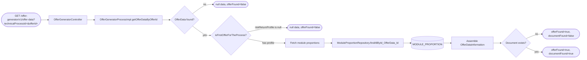
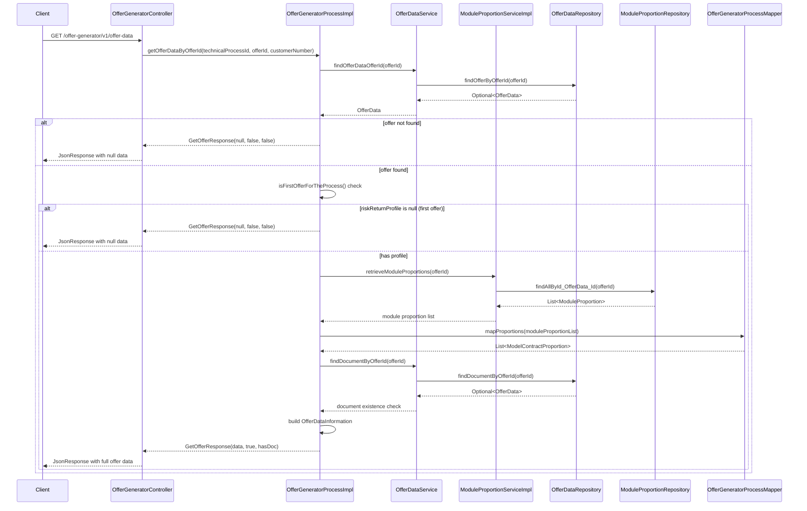

# Chain — OfferGeneratorController · GET /offer-data

<!-- scaffold — phase 1 -->

- **Action point** — `OfferGeneratorController` (wpfe-am / ucc-offer-generator)
- **Kind** — rest-controller
- **Source** — `ucc-offer-generator/src/main/java/coba/wtp/wpfe/ucc/offer/generator/controller/OfferGeneratorController.java`
- **Handler** — `getOfferDataByOfferId(String, Long, String)` — `.../OfferGeneratorController.java:94`
- **Trigger** — `GET /offer-generator/v1/offer-data`
- **Preconditions** — none observed
- **First hop** — `OfferGeneratorProcess.getOfferDataByOfferId()` (wpfe-am / ucc-offer-generator)

<!-- analysis — phase 2 -->

## Story

As a **retail customer navigating the offer generator**, I want to retrieve the full details of a specific saved offer so that I can review my investment selections, module proportions, and document availability before proceeding.

- **Given** an active offer generation session identified by `technicalProcessId` with at least one saved offer (identified by `offerId`)
- **When** `GET /offer-generator/v1/offer-data?technicalProcessId={technicalProcessId}&offerId={offerId}` is called (optionally with `customerNumber`)
- **Then** the system returns the complete offer data — investment volume, product line, module proportions, risk profiles, quotas — along with flags indicating whether the offer was found and whether a document exists
- **Unless** no offer exists for that `offerId`, or the offer is still in its initial (first-offer) state with no risk-return profile set — in which case the response carries `null` data and both flags are `false`

## Chain

```text
Branch 1 · primary
  OfferGeneratorController.getOfferDataByOfferId(String, Long, String)
  → OfferGeneratorProcessImpl.getOfferDataByOfferId(String, Long, String)
    → find offer by id
      → OfferDataService.findOfferDataOfferId(Long)
        → OfferDataRepository.findOfferByOfferId(Long)
        ⇒ [db]  OFFER_DATA
    → check first-offer gate (riskReturnProfile == null)
    → fetch module proportions
      → ModuleProportionService.retrieveModuleProportions(Long)
        → ModuleProportionRepository.findAllById_OfferData_Id(Long)
        ⇒ [db]  MODULE_PROPORTION
    → assemble OfferDataInformation via mapper
      → OfferGeneratorProcessMapper.mapProportions(List<ModuleProportion>)
      ⇒ [none]
    → check document existence
      → OfferDataService.findDocumentByOfferId(Long)
        → OfferDataRepository.findDocumentByOfferId(Long)
        ⇒ [db]  OFFER_DATA + OFFER_GENERATOR_DOCUMENT (join)
```

- **Terminals reached** — `db` (OFFER_DATA, MODULE_PROPORTION, OFFER_GENERATOR_DOCUMENT), `none` (pure computation in OfferGeneratorProcessMapper.mapProportions)

## Diagrams

### Process flow — primary



### Sequence — primary



## Journey

When **the frontend calls the offer-data endpoint to display a saved offer**, the request enters at **[step 1]** to handle **retrieving the complete offer details for a specific `offerId`**. Once that completes, the flow moves to **[step 2]** because **the process layer enforces authorization and orchestrates data assembly**.

1. **OfferGeneratorController.getOfferDataByOfferId** (wpfe-am / ucc-offer-generator)

   **Source.** `ucc-offer-generator/src/main/java/coba/wtp/wpfe/ucc/offer/generator/controller/OfferGeneratorController.java:94`

   **Role.** REST entry point that accepts a `technicalProcessId`, an `offerId`, and an optional `customerNumber`, then delegates to the process layer to assemble and return the offer data.

   **Preconditions.** None at this level — authorization is enforced downstream in the process method via `@PreAuthorize`.

   **Downstream.** Wraps the `ProcessResponse<GetOfferResponse>` into a `JsonResponse` using `JsonResponseBuilder.buildJsonResultResponse()` and returns it to the caller.

2. **OfferGeneratorProcessImpl.getOfferDataByOfferId** (wpfe-am / ucc-offer-generator)

   **Source.** `ucc-offer-generator/src/main/java/coba/wtp/wpfe/ucc/offer/generator/process/impl/OfferGeneratorProcessImpl.java:150`

   **Role.** Orchestrates the retrieval of a single offer's complete data: fetches the offer entity, validates it is not in its initial state, assembles module proportions and document status, then returns a structured response.

   **Preconditions.** `@PreAuthorize("protectWith('WPFE_AM_OG_READ', {'internalCustomerNumber': #customerNumber})")` — the caller must hold the `WPFE_AM_OG_READ` permission for the given customer number.

   **Steps.**

   2.1 **Fetch offer by id** · `OfferGeneratorProcessImpl.java:153`
       **Role.** Looks up the `OfferData` entity matching the provided `offerId` via the service layer.
       **Source.** `ucc-offer-generator/src/main/java/coba/wtp/wpfe/ucc/offer/generator/process/impl/OfferGeneratorProcessImpl.java:153`
       **Downstream.** Calls `offerDataService.findOfferDataOfferId(offerId)` which reaches the database.

   2.2 **Gate — offer existence** · `OfferGeneratorProcessImpl.java:155`
       **Role.** If no `OfferData` row exists for the given `offerId`, returns a response with `null` data, `offerFound=false`, and `documentFound=false`. No further processing occurs.
       **Source.** `ucc-offer-generator/src/main/java/coba/wtp/wpfe/ucc/offer/generator/process/impl/OfferGeneratorProcessImpl.java:155`

   2.3 **Gate — first-offer check** · `OfferGeneratorProcessImpl.java:160`
       **Role.** Checks whether this is the first offer for the process by evaluating `offerData.isFirstOfferForTheProcess()`. This method returns true when `riskReturnProfile` is null, meaning the customer has not yet completed their risk-return profile selection. If true, the response carries `null` data and both flags are false — the frontend should prompt the user to complete the profile.
       **Source.** `ucc-offer-generator/src/main/java/coba/wtp/wpfe/ucc/offer/generator/model/entity/OfferData.java:238`

   2.4 **Fetch module proportions** · `OfferGeneratorProcessImpl.java:165`
       **Role.** Retrieves the list of `ModuleProportion` entities for this offer, each carrying a module ID and its proportion value (a BigDecimal between 0 and 1). These represent the customer's selected asset allocation across investment modules.
       **Source.** `ucc-offer-generator/src/main/java/coba/wtp/wpfe/ucc/offer/generator/process/impl/OfferGeneratorProcessImpl.java:165`
       **Downstream.** Calls `moduleProportionService.retrieveModuleProportions(offerId)` which reaches the MODULE_PROPORTION table.

   2.5 **Assemble OfferDataInformation** · `OfferGeneratorProcessImpl.java:167`
       **Role.** Maps the raw entity data (`OfferData`, `OfferGeneratorProcess`, and `List<ModuleProportion>`) into a flat `OfferDataInformation` record. This involves reading investment volume, influence flag, product line details, module proportions (mapped via `mapProportions`), risk return profile, customer risk profile, offensive asset share, strategy info, model contract ID, further agreements, sustainability preference, and quota limits.
       **Source.** `ucc-offer-generator/src/main/java/coba/wtp/wpfe/ucc/offer/generator/model/OfferDataInformation.java:40`

   2.6 **Check document existence** · `OfferGeneratorProcessImpl.java:169`
       **Role.** Queries whether an `OfferGeneratorDocument` row exists for this offer ID. The query performs a JOIN between OFFER_DATA and OFFER_GENERATOR_DOCUMENT; if the join finds a match, `.isPresent()` returns true.
       **Source.** `ucc-offer-generator/src/main/java/coba/wtp/wpfe/ucc/offer/generator/process/impl/OfferGeneratorProcessImpl.java:169`
       **Downstream.** Calls `offerDataService.findDocumentByOfferId(offerId)` which reaches the database with a join query.

   2.7 **Return response** · `OfferGeneratorProcessImpl.java:171`
       **Role.** Assembles and returns a `GetOfferResponse` carrying the assembled `OfferDataInformation`, `offerFound=true`, and `documentFound` (true if a document row exists, false otherwise).
       **Source.** `ucc-offer-generator/src/main/java/coba/wtp/wpfe/ucc/offer/generator/process/impl/OfferGeneratorProcessImpl.java:171`

3. **OfferDataServiceImpl.findOfferDataOfferId** (wpfe-am / ucc-offer-generator)

   **Source.** `ucc-offer-generator/src/main/java/coba/wtp/wpfe/ucc/offer/generator/service/impl/OfferDataServiceImpl.java:98`

   **Role.** Delegates to the JPA repository to look up a single `OfferData` row by its primary key (`id`).

   **Source.** `ucc-offer-generator/src/main/java/coba/wtp/wpfe/ucc/offer/generator/service/impl/OfferDataServiceImpl.java:98`

   **Downstream.** Calls `offerDataRepository.findOfferByOfferId(offerId)` — a JPQL query that reads from the OFFER_DATA table.

4. **OfferDataRepository.findOfferByOfferId** (wpfe-am / ucc-offer-generator)

   **Source.** `ucc-offer-generator/src/main/java/coba/wtp/wpfe/ucc/offer/generator/repository/OfferDataRepository.java:52`

   **Role.** Executes a JPQL query `SELECT od FROM OfferData od WHERE od.id = :offerId` to retrieve the offer data row. Returns an `Optional<OfferData>` — empty if no row matches.

   **Terminal — db** · OFFER_DATA table via JPA entity `OfferData`

5. **ModuleProportionServiceImpl.retrieveModuleProportions** (wpfe-am / ucc-offer-generator)

   **Source.** `ucc-offer-generator/src/main/java/coba/wtp/wpfe/ucc/offer/generator/service/impl/ModuleProportionServiceImpl.java:18`

   **Role.** Delegates to the JPA repository to retrieve all module proportion rows for a given offer ID.

   **Source.** `ucc-offer-generator/src/main/java/coba/wtp/wpfe/ucc/offer/generator/service/impl/ModuleProportionServiceImpl.java:18`

   **Downstream.** Calls `moduleProportionRepository.findAllById_OfferData_Id(offerId)` — a Spring Data derived query that reads from the MODULE_PROPORTION table.

6. **ModuleProportionRepository.findAllById_OfferData_Id** (wpfe-am / ucc-offer-generator)

   **Source.** `ucc-offer-generator/src/main/java/coba/wtp/wpfe/ucc/offer/generator/repository/ModuleProportionRepository.java:13`

   **Role.** Spring Data JPA derived query method that finds all `ModuleProportion` entities whose composite key's `id.offerData.id` matches the given offer ID. Returns a `List<ModuleProportion>`.

   **Terminal — db** · MODULE_PROPORTION table via JPA entity `ModuleProportion`

7. **OfferGeneratorProcessMapper.mapProportions** (wpfe-am / ucc-offer-generator)

   **Source.** `ucc-offer-generator/src/main/java/coba/wtp/wpfe/ucc/offer/generator/mapper/OfferGeneratorProcessMapper.java:80`

   **Role.** Pure computation — maps a list of internal `ModuleProportion` entities to a list of `ModelContractProportion` DTOs (from wpfe-shared / cpms), each carrying a `moduleId` string and a `currentValue` BigDecimal. If the input is null, returns an empty list.

   **Terminal — none** · pure computation, no outbound calls

8. **OfferDataServiceImpl.findDocumentByOfferId** (wpfe-am / ucc-offer-generator)

   **Source.** `ucc-offer-generator/src/main/java/coba/wtp/wpfe/ucc/offer/generator/service/impl/OfferDataServiceImpl.java:106`

   **Role.** Delegates to the JPA repository to check whether an `OfferGeneratorDocument` row exists for a given offer ID.

   **Source.** `ucc-offer-generator/src/main/java/coba/wtp/wpfe/ucc/offer/generator/service/impl/OfferDataServiceImpl.java:106`

   **Downstream.** Calls `offerDataRepository.findDocumentByOfferId(offerId)` — a JPQL query that JOINs OFFER_DATA with OFFER_GENERATOR_DOCUMENT.

9. **OfferDataRepository.findDocumentByOfferId** (wpfe-am / ucc-offer-generator)

   **Source.** `ucc-offer-generator/src/main/java/coba/wtp/wpfe/ucc/offer/generator/repository/OfferDataRepository.java:58`

   **Role.** Executes a JPQL query `SELECT od FROM OfferData od JOIN OfferGeneratorDocument ogd ON ogd.offerData = od WHERE od.id = :offerId`. Returns an `Optional<OfferData>` — present if a document row exists for this offer, empty otherwise. The query only checks existence; the returned entity is not consumed beyond `.isPresent()`.

   **Terminal — db** · OFFER_DATA + OFFER_GENERATOR_DOCUMENT tables via JPA join

## Data reached

- **db — OFFER_DATA, via `OfferDataRepository.findOfferByOfferId()` (wpfe-am / ucc-offer-generator)**
  - Business problem solved — As the **offer retrieval process**, I need the customer's saved offer data — investment volume, product line, risk-return profile, strategy selection, quotas, and module allocation — to be able to present a complete offer summary on the frontend. Therefore we query `OFFER_DATA` via `OfferDataRepository.findOfferByOfferId(offerId)` for the row matching the given `offerId`, so we can assemble the full `GetOfferResponse` (`OfferDataServiceImpl.java:98`).

  - **Query** — `SELECT od FROM OfferData od WHERE od.id = :offerId`

  - **Argument**
    ```json
    {
      "offerId": 42
    }
    ```
    `offerId` ← request parameter, origin: frontend URL query string.

  - **Response fields used** — `id`, `investmentVolume`, `productLine`, `productLineMandateName`, `productLineMandate`, `neutralRiskQuota`, `quotaOffensiveInvestment`, `riskReturnProfile`, `productLineStrategyId`, `productLineStrategyName`, `lowerVolumeApprovalPerson`, `furtherAgreements`, `furtherAgreementsApprovalPerson`, `furtherAgreementsApprovalDate`, `maximumStockQuota`, `maximumCurrencyQuota`, `modelContractId`, and the joined `offerGeneratorProcess` entity (for `influence`, `sustainabilityPreference`, `customerRiskProfile`).

  - **Response fields discarded** — none observed; all columns on the OFFER_DATA row are consumed by `OfferDataInformation.of()`.

- **db — MODULE_PROPORTION, via `ModuleProportionRepository.findAllById_OfferData_Id()` (wpfe-am / ucc-offer-generator)**
  - Business problem solved — As the **offer retrieval process**, I need the customer's selected module allocation proportions to be able to display their portfolio composition. Therefore we query `MODULE_PROPORTION` via `ModuleProportionRepository.findAllById_OfferData_Id(offerId)` for all rows whose composite key references this offer, so we can map each proportion into a `ModelContractProportion` DTO (`OfferGeneratorProcessImpl.java:165`).

  - **Query** — derived Spring Data JPA query on `ModuleProportion.id.offerData.id = :offerId`

  - **Argument**
    ```json
    {
      "offerId": 42
    }
    ```
    `offerId` ← request parameter, same origin as above.

  - **Response fields used** — `id.moduleId` (the module identifier string) and `proportion` (a BigDecimal between 0.00 and 1.00 representing the allocation weight). Each row maps to one `ModelContractProportion(moduleId, currentValue)` in the response.

- **db — OFFER_DATA + OFFER_GENERATOR_DOCUMENT (join), via `OfferDataRepository.findDocumentByOfferId()` (wpfe-am / ucc-offer-generator)**
  - Business problem solved — As the **offer retrieval process**, I need to know whether a rendered offer document has been generated and stored for this offer so that the frontend can display or hide the "view/download document" control. Therefore we query `OFFER_DATA` joined with `OFFER_GENERATOR_DOCUMENT` via `OfferDataRepository.findDocumentByOfferId(offerId)`, checking only row existence (`isPresent()`), not consuming any column values (`OfferGeneratorProcessImpl.java:169`).

  - **Query** — `SELECT od FROM OfferData od JOIN OfferGeneratorDocument ogd ON ogd.offerData = od WHERE od.id = :offerId`

  - **Argument**
    ```json
    {
      "offerId": 42
    }
    ```
    `offerId` ← request parameter, same origin as above.

  - **Response fields used** — none; the query result is consumed only via `.isPresent()` to set the `documentFound` boolean flag. The actual document content (`DOCUMENT`, `DOCUMENT_LANGUAGE`, `ARCHIVED_DOCUMENT_DATA_ID`) is not read in this chain.

## Acceptance Criteria

1. **Existing offer with completed profile returns full data** — Given an `offerId` that references a non-null `OfferData` row whose `riskReturnProfile` is set, when the endpoint is called, then the response carries `offerFound=true`, `documentFound` (true or false depending on document existence), and a populated `OfferDataInformation` record with all fields.
   - Evidence: `OfferGeneratorProcessImpl.java:153-171`
   - How to: call the endpoint with an `offerId` for a completed offer; assert that `GetOfferResponse.offerFound == true`, `GetOfferResponse.offerDataInformation` is non-null, and all fields (investmentVolume, productLine, moduleProportions, riskReturnProfile, etc.) are populated.

2. **Non-existent offer returns null data** — Given an `offerId` that does not match any row in OFFER_DATA, when the endpoint is called, then the response carries `null` data with both `offerFound=false` and `documentFound=false`.
   - Evidence: `OfferGeneratorProcessImpl.java:155`
   - How to: call the endpoint with an `offerId` that does not exist in the database; assert on the response body that `offerFound == false`, `documentFound == false`, and `offerDataInformation == null`. Confirm from a query log that no MODULE_PROPORTION or OFFER_GENERATOR_DOCUMENT queries are executed.

3. **First offer (no risk-return profile) returns null data** — Given an `offerId` referencing an `OfferData` row whose `riskReturnProfile` is null, when the endpoint is called, then the response carries `null` data with both flags false — the frontend should interpret this as "profile not yet completed."
   - Evidence: `OfferGeneratorProcessImpl.java:160`, `OfferData.java:238`
   - How to: call the endpoint with an `offerId` for a first-offer row (riskReturnProfile IS NULL); assert that `offerFound == false`. Confirm from a query log that MODULE_PROPORTION and document queries are not executed.

4. **Document flag reflects OFFER_GENERATOR_DOCUMENT existence** — Given an existing offer, when the endpoint is called, then `documentFound` is true if and only if an `OfferGeneratorDocument` row exists with `offerDataId = offerId`.
   - Evidence: `OfferGeneratorProcessImpl.java:169`, `OfferDataRepository.java:58`
   - How to: call the endpoint for an existing offer; assert that `documentFound == true`. Then insert a new OFFER_DATA row without a corresponding OFFER_GENERATOR_DOCUMENT row and call again; assert `documentFound == false`.

5. **Module proportions are correctly mapped** — Given an existing offer with N module proportion rows, when the endpoint is called, then the response's `moduleProportions` list contains exactly N entries, each carrying the correct `moduleId` and `currentValue` (proportion) from the database.
   - Evidence: `OfferGeneratorProcessImpl.java:165`, `OfferDataInformation.java:40`, `OfferGeneratorProcessMapper.java:80`
   - How to: call the endpoint for an existing offer; assert that `moduleProportions.size() == N` and each entry's `moduleId` and `currentValue` match the corresponding MODULE_PROPORTION row.

6. **Authorization is enforced** — Given a caller without `WPFE_AM_OG_READ` permission, when the endpoint is called with a `customerNumber`, then access is denied before any database query runs.
   - Evidence: `OfferGeneratorProcessImpl.java:150`
   - How to: call the endpoint without the required Spring Security authority; confirm a 403 response. Confirm from a query log that no OFFER_DATA queries are executed.

## Business Takeaways

- **What this does for the business** — retrieves and presents a complete snapshot of a customer's saved offer in the offer generator flow, including their investment selections (product line, strategy, quotas), module allocation proportions, risk profiles, and document availability status. This is the primary data-fetching endpoint used when a user navigates to view or edit an existing offer.
- **Depends on** — three database tables: OFFER_DATA (core offer fields), MODULE_PROPORTION (customer's asset allocation per module), and OFFER_GENERATOR_DOCUMENT (document existence flag). All read-only in this chain.
- **Ingredients** — `technicalProcessId` (request parameter, used for authorization context but not directly queried in this handler), `offerId` (request parameter, primary lookup key), `customerNumber` (request parameter, origin: session or URL, used only for authorization)
- **Preparation** — fetch the offer entity by ID; reject if missing or if still in first-offer state (no risk-return profile); fetch module proportions and map them to DTOs; check document existence via a join query
- **Dish** — `GetOfferResponse(offerDataInformation, offerFound, documentFound)` — a JSON response carrying the full offer data record plus two boolean flags indicating whether the offer was found and whether a rendered document is available


