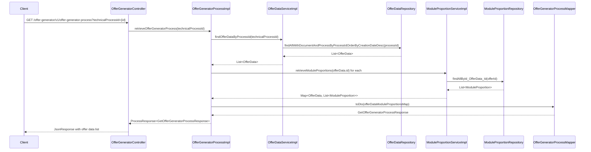

# Chain — OfferGeneratorController · GET /offer-generator-process

<!-- scaffold — phase 1 -->

- **Action point** — `OfferGeneratorController` (wpfe-am / ucc-offer-generator)
- **Kind** — rest-controller
- **Source** — `ucc-offer-generator/src/main/java/coba/wtp/wpfe/ucc/offer/generator/controller/OfferGeneratorController.java`
- **Handler** — `getOfferGeneratorProcess(String)` — `.../OfferGeneratorController.java:82`
- **Trigger** — `GET /offer-generator/v1/offer-generator-process`
- **Preconditions** — none observed
- **First hop** — `OfferGeneratorProcess.retrieveOfferGeneratorProcess()` (wpfe-am / ucc-offer-generator)

<!-- analysis — phase 2 -->

## Story

As a **retail customer navigating the offer generator flow**, I want to retrieve the current state of my offer generation process (including module proportions and configuration) so that the React application can render the next screen.

- **Given** a `technicalProcessId` identifying an active offer generation session
- **When** `GET /offer-generator/v1/offer-generator-process` is called with that ID
- **Then** all offer data records for that process are returned together with their module proportions, risk profiles, and investment configuration
- **Unless** no offer data exists for the given process ID — a technical exception is thrown before any response is assembled

## Chain

```text
Branch 1 · primary
  OfferGeneratorController.getOfferGeneratorProcess(String)
  → OfferGeneratorProcessImpl.retrieveOfferGeneratorProcess(String)
    → OfferDataServiceImpl.findOfferDataByProcessId(String)
      → OfferDataRepository.findAllWithDocumentAndProcessByProcessIdOrderByCreationDateDesc(String)
        ⇒ [db] OFFER_DATA (joined with OFFER_GENERATOR_DOCUMENT and OFFER_GENERATOR_PROCESS)
    → ModuleProportionServiceImpl.retrieveModuleProportions(Long) — per offer data
      → ModuleProportionRepository.findAllById_OfferData_Id(Long)
        ⇒ [db] MODULE_PROPORTION
  → OfferGeneratorProcessMapper.toDto(Map<OfferData, List<ModuleProportion>>)
    ⇒ [none] pure computation: maps entities to DTOs
```

- **Terminals reached** — `db` (OFFER_DATA joined with OFFER_GENERATOR_DOCUMENT and OFFER_GENERATOR_PROCESS), `db` (MODULE_PROPORTION), `none` (pure computation in OfferGeneratorProcessMapper)

## Diagrams

### Process flow — primary

```mermaid
flowchart LR
  A(["GET /offer-generator/v1/offer-generator-process"]) --> B[OfferGeneratorController]
  B --> C[OfferGeneratorProcessImpl.retrieveOfferGeneratorProcess]
  C --> D[OfferDataServiceImpl.findOfferDataByProcessId]
  D --> E[OfferDataRepository.findAllWithDocumentAndProcessByProcessIdOrderByCreationDateDesc]
  E --> F[(OFFER_DATA)]
  F --> G{offer data list empty?}
  G -- yes --> H([TechnicalException thrown])
  G -- no --> I[ModuleProportionServiceImpl.retrieveModuleProportions per offerData]
  I --> J[ModuleProportionRepository.findAllById_OfferData_Id]
  J --> K[(MODULE_PROPORTION)]
  K --> L[OfferGeneratorProcessMapper.toDto]
  L --> M([GetOfferGeneratorProcessResponse])
```



### Sequence — primary



## Journey

When **the trigger fires**, the request enters at **[step 1]** to handle **retrieving the current state of an offer generation process for a given technical process ID**. Once that completes, the flow moves to **[step 2]** because **the process layer orchestrates data retrieval from multiple sources** and assembles the response. From there, **[step 3]** takes over to **fetch all offer data records associated with the process**, and so on through every hop until a terminal is reached or the response is assembled.

1. **OfferGeneratorController.getOfferGeneratorProcess(String technicalProcessId)** (wpfe-am / ucc-offer-generator)

   **Source.** `ucc-offer-generator/src/main/java/coba/wtp/wpfe/ucc/offer/generator/controller/OfferGeneratorController.java:82`

   **Role.** REST entry point that receives a `technicalProcessId` and delegates to the process layer for data retrieval, wrapping the result in a `JsonResponse`.

   **Preconditions.** None observed — no authentication or session guard is applied at this endpoint (unlike other endpoints on this controller which carry `@PreAuthorize`).

   **Downstream.** `OfferGeneratorProcess.retrieveOfferGeneratorProcess(technicalProcessId)`

2. **OfferGeneratorProcessImpl.retrieveOfferGeneratorProcess(String technicalProcessId)** (wpfe-am / ucc-offer-generator)

   **Source.** `ucc-offer-generator/src/main/java/coba/wtp/wpfe/ucc/offer/generator/process/impl/OfferGeneratorProcessImpl.java:148`

   **Role.** Orchestrates the retrieval of offer generation process state by fetching all offer data records for the given process ID, then enriching each with its module proportions, and finally mapping everything to a DTO response.

   **On failure.** If no `OfferData` rows exist for the given `technicalProcessId`, throws a `TechnicalException` (logged at `OfferGeneratorProcessImpl.java:153-156`).

   **Steps.**

   - **2.1 Fetch — all offer data for process** · `OfferGeneratorProcessImpl.java:150`

     **Role.** Calls `offerDataService.findOfferDataByProcessId(technicalProcessId)` to retrieve every offer data record associated with the given process ID, ordered by creation date descending.

   - **2.2 Guard — empty list check** · `OfferGeneratorProcessImpl.java:152`

     **Role.** If the returned list is empty, throws a `TechnicalException` with message "No OfferData found for technicalProcessId {id}". This prevents returning an empty response to the client.

   - **2.3 Enrich — module proportions per offer data** · `OfferGeneratorProcessImpl.java:156-164`

     **Role.** For each `OfferData` in the list, calls `moduleProportionService.retrieveModuleProportions(offerData.getId())` to fetch its associated module proportions. Collects them into a `LinkedHashMap<OfferData, List<ModuleProportion>>` preserving insertion order.

   - **2.4 Map — entities to DTO** · `OfferGeneratorProcessImpl.java:165`

     **Role.** Delegates to `OfferGeneratorProcessMapper.toDto()` to convert the enriched entity map into a `GetOfferGeneratorProcessResponse` DTO.

3. **OfferDataServiceImpl.findOfferDataByProcessId(String processId)** (wpfe-am / ucc-offer-generator)

   **Source.** `ucc-offer-generator/src/main/java/coba/wtp/wpfe/ucc/offer/generator/service/impl/OfferDataServiceImpl.java:120`

   **Role.** Delegates to the repository to fetch all offer data records for a given process ID, joined with their associated documents and generator process entities, ordered by creation date descending.

   **Downstream.** `OfferDataRepository.findAllWithDocumentAndProcessByProcessIdOrderByCreationDateDesc(processId)`

4. **OfferDataRepository.findAllWithDocumentAndProcessByProcessIdOrderByCreationDateDesc(String processId)** (wpfe-am / ucc-offer-generator)

   **Source.** `ucc-offer-generator/src/main/java/coba/wtp/wpfe/ucc/offer/generator/repository/OfferDataRepository.java:17`

   **Role.** Executes a JPQL query that joins `OfferData` with `OfferGeneratorProcess` (via fetch join) and `OfferGeneratorDocument`, filtering by process ID and ordering by creation date descending. Returns all matching offer data records.

   **Terminal — db**

5. **ModuleProportionServiceImpl.retrieveModuleProportions(Long offerId)** (wpfe-am / ucc-offer-generator)

   **Source.** `ucc-offer-generator/src/main/java/coba/wtp/wpfe/ucc/offer/generator/service/impl/ModuleProportionServiceImpl.java:20`

   **Role.** Delegates to the repository to fetch all module proportion records for a given offer ID.

   **Downstream.** `ModuleProportionRepository.findAllById_OfferData_Id(offerId)`

6. **ModuleProportionRepository.findAllById_OfferData_Id(Long offerId)** (wpfe-am / ucc-offer-generator)

   **Source.** `ucc-offer-generator/src/main/java/coba/wtp/wpfe/ucc/offer/generator/repository/ModuleProportionRepository.java:14`

   **Role.** Spring Data JPA derived query that finds all `ModuleProportion` entities whose composite key's `OfferData.id` matches the given offer ID.

   **Terminal — db**

7. **OfferGeneratorProcessMapper.toDto(Map<OfferData, List<ModuleProportion>>)** (wpfe-am / ucc-offer-generator)

   **Source.** `ucc-offer-generator/src/main/java/coba/wtp/wpfe/ucc/offer/generator/mapper/OfferGeneratorProcessMapper.java:35`

   **Role.** Pure computation that maps each `OfferData` + its list of `ModuleProportion` objects into an `OfferDataInformation` DTO, extracting fields such as investment volume, influence flag, product line, risk profiles, module proportions, and various quota values. Uses `DEFAULT_RISK_PROFILE = 0` as fallback when `riskReturnProfile` or `customerRiskProfile` is null.

   **Terminal — none**

## Data reached

- **db — OFFER_DATA (joined with OFFER_GENERATOR_DOCUMENT and OFFER_GENERATOR_PROCESS), via `OfferDataRepository.findAllWithDocumentAndProcessByProcessIdOrderByCreationDateDesc()` (wpfe-am / ucc-offer-generator)**
  - Business problem solved — As the **offer generator process**, I need all offer data records associated with a customer's active session to be able to present their current configuration state. Therefore we query `OFFER_DATA` via `OfferDataRepository.findAllWithDocumentAndProcessByProcessIdOrderByCreationDateDesc(processId)` for every offer record linked to this process, joined with `OFFER_GENERATOR_PROCESS` (for influence and sustainability flags) and `OFFER_GENERATOR_DOCUMENT` (to confirm document association), ordered by creation date descending so the most recent offers surface first (`OfferDataRepository.java:17-23`).

  - **Query** — `findAllWithDocumentAndProcessByProcessIdOrderByCreationDateDesc(processId)` — read-only, no write anywhere in this chain.

  - **Argument**
    ```json
    {
      "processId": "abc123-def456"
    }
    ```
    `processId` ← request parameter `technicalProcessId`, origin: HTTP query string from the client.

  - **Response fields used** — `id` (offer ID, used as key for module proportion lookup), `investmentVolume`, `productLine`, `productLineMandate`, `productLineMandateName`, `riskReturnProfile`, `quotaOffensiveInvestment`, `lowerVolumeApprovalPerson`, `productLineStrategyId`, `productLineStrategyName`, `modelContractId`, `furtherAgreements`, `furtherAgreementsApprovalPerson`, `furtherAgreementsApprovalDate`, `maximumStockQuota`, `maximumCurrencyQuota`, `neutralRiskQuota`; from the joined `OfferGeneratorProcess`: `influence`, `sustainabilityPreference`, `customerRiskProfile`.

  - **Response fields discarded** — all columns not referenced in `OfferGeneratorProcessMapper.toDto()`, including any internal audit or timestamp fields on `OFFER_DATA` and `OFFER_GENERATOR_PROCESS` entities beyond those explicitly mapped.

- **db — MODULE_PROPORTION, via `ModuleProportionRepository.findAllById_OfferData_Id()` (wpfe-am / ucc-offer-generator)**
  - Business problem solved — As the **offer generator process**, I need each offer's module allocation percentages to be able to show the customer how their investment is distributed across modules. Therefore we query `MODULE_PROPORTION` via `ModuleProportionRepository.findAllById_OfferData_Id(offerId)` for every offer data record, so we can present the proportional breakdown of offensive and defensive allocations (`ModuleProportionServiceImpl.java:20`).

  - **Query** — `findAllById_OfferData_Id(offerId)` — read-only, no write anywhere in this chain.

  - **Argument**
    ```json
    {
      "offerId": 42
    }
    ```
    `offerId` ← derived from `OfferData.id`, origin: the database row fetched in step 4 above.

  - **Response fields used** — `id.moduleId` (the module identifier), `proportion` (the allocation percentage as a BigDecimal).

- **none — pure computation, no outbound calls**
  - Business problem solved — As the **offer generator process**, I need to transform raw entity objects into a serializable DTO structure that the React frontend can consume. Therefore we map each `OfferData` + its module proportions into an `OfferDataInformation` record, applying default values for null risk profiles and extracting only the fields the UI needs (`OfferGeneratorProcessMapper.java:35-80`).

## Acceptance Criteria

1. **All offer data records returned for a valid process ID** — Given a `technicalProcessId` that has one or more associated `OfferData` rows, when `GET /offer-generator/v1/offer-generator-process` is called, then the response contains a list of `GetOfferGeneratorProcessResponse.offerDataInformationList` with one entry per offer data record, each enriched with its module proportions.
   - Evidence: `OfferGeneratorProcessImpl.java:150-165`
   - How to: call the endpoint with a valid `technicalProcessId`, verify the response body contains an array of `offerDataInformationList` entries; confirm from query logs that both `OFFER_DATA` and `MODULE_PROPORTION` tables are queried.

2. **Technical exception when no offer data exists** — Given a `technicalProcessId` with zero matching rows in `OFFER_DATA`, when the endpoint is called, then a technical exception is thrown with message "No OfferData found for technicalProcessId {id}" and logged at `OfferGeneratorProcessImpl.java:153-156`.
   - Evidence: `OfferGeneratorProcessImpl.java:152`
   - How to: call the endpoint with a non-existent `technicalProcessId`; confirm from application logs that `TechnicalExceptionFactory.createAndLogTechnicalException` is invoked and the HTTP response carries an error status.

3. **Module proportions correctly associated per offer** — Given multiple offer data records for one process, when the endpoint is called, then each entry in the response has its own list of module proportions corresponding to that specific offer's ID.
   - Evidence: `OfferGeneratorProcessImpl.java:156-164` and `ModuleProportionServiceImpl.java:20`
   - How to: call with a process ID having multiple offers; verify each entry in the response has module proportions matching only its own `offerId`, not cross-contaminated from other offers.

4. **Null risk profiles default to 0** — Given an offer data record where `riskReturnProfile` or `customerRiskProfile` is null, when the endpoint is called, then both values in the response are set to `0` (the `DEFAULT_RISK_PROFILE` constant).
   - Evidence: `OfferGeneratorProcessMapper.java:43-48`
   - How to: insert an `OfferData` row with NULL `risk_return_profile`, call the endpoint, and assert that both `riskReturnProfile` and `customerRiskProfile` in the response are `0`.

5. **Ordering by creation date descending** — Given multiple offer data records for one process, when the endpoint is called, then entries appear ordered by `creationDate` descending (most recent first).
   - Evidence: `OfferDataRepository.java:21-23` (`ORDER BY od.creationDate DESC`)
   - How to: create two offers with different creation dates for the same process; call the endpoint and verify the most recently created offer appears first in the response list.

## Business Takeaways

**Restatement only.** Every line here cites a fact already established earlier in this same file. No source file is opened for this section.

- **What this does for the business** — retrieves the complete state of an active offer generation session, including all historical offers and their module allocation percentages, so the frontend can render the current configuration screen without requiring additional API calls.
- **Depends on** — `OFFER_DATA` table (read-only, joined with `OFFER_GENERATOR_DOCUMENT` and `OFFER_GENERATOR_PROCESS`), `MODULE_PROPORTION` table (read-only)
- **Ingredients** — `technicalProcessId` (HTTP query parameter from the client)
- **Preparation** — fetch all offer data records for the process, enrich each with its module proportions
- **Dish** — `GetOfferGeneratorProcessResponse` containing a list of `OfferDataInformation`, each carrying investment volume, influence flag, product line details, risk profiles, module proportions, and quota values
---

