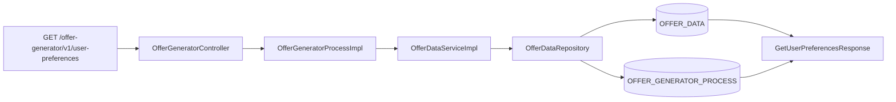
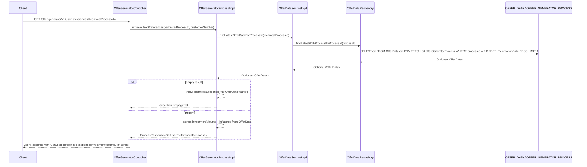

# Chain — OfferGeneratorController · GET /user-preferences

<!-- scaffold — phase 1 -->

- **Action point** — `OfferGeneratorController` (wpfe-am / ucc-offer-generator)
- **Kind** — rest-controller
- **Source** — `ucc-offer-generator/src/main/java/coba/wtp/wpfe/ucc/offer/generator/controller/OfferGeneratorController.java`
- **Handler** — `getUserPreferencesData(String, String)` — `.../OfferGeneratorController.java:74`
- **Trigger** — `GET /offer-generator/v1/user-preferences`
- **Preconditions** — none observed
- **First hop** — `OfferGeneratorProcess.retrieveUserPreferences()` (wpfe-am / ucc-offer-generator)

<!-- analysis — phase 2 -->

## Story

As a **retail customer navigating the offer generator**, I want my previously saved user preferences (investment volume and portfolio influence setting) to be retrieved so that the UI can pre-fill the form with my existing choices.

- **Given** a technical process ID identifying an active offer-generation session, optionally accompanied by a customer number for authorization
- **When** `GET /offer-generator/v1/user-preferences` is called with `technicalProcessId`
- **Then** the latest saved offer data for that process is loaded from the database and only two fields — `investmentVolume` and `influence` — are returned in the response
- **Unless** no OfferData row exists for the given `technicalProcessId` — a technical exception is thrown, indicating the session has no saved state

## Chain

Branch 1 · primary
  OfferGeneratorController.getUserPreferencesData(String, String)
  → OfferGeneratorProcessImpl.retrieveUserPreferences(String, String)
  → OfferDataServiceImpl.findLatestOfferDataForProcessId(String)
  → OfferDataRepository.findLatestWithProcessByProcessId(String)
  ⇒ [db]  OFFER_DATA + OFFER_GENERATOR_PROCESS (JPA JOIN FETCH)

- **Terminals reached** — `db` (`OFFER_DATA`, `OFFER_GENERATOR_PROCESS`, via JPA repository in wpfe-am / ucc-offer-generator)

## Diagrams

### Process flow — primary



### Sequence — primary



## Journey

When **the trigger fires**, the request enters at **[step 1]** to handle **a GET request for user preferences data associated with an offer-generation process**. Once that completes, the flow moves to **[step 2]** because **the controller delegates business logic to the process layer**. From there, **[step 3]** takes over to **load the latest saved offer data from persistence**, and so on through every hop until a terminal is reached or the response is assembled.

1. **OfferGeneratorController.getUserPreferencesData** (wpfe-am / ucc-offer-generator)

   **Source.** `ucc-offer-generator/src/main/java/coba/wtp/wpfe/ucc/offer/generator/controller/OfferGeneratorController.java:74`

   **Role.** REST endpoint handler that accepts a `technicalProcessId` and optional `customerNumber`, delegates to the process layer, and wraps the result in a `JsonResponse`.

   **Preconditions.** None observed — no request body validation beyond Spring's standard parameter binding. The `@RequestParam String technicalProcessId` is required; `customerNumber` is optional.

   **On failure.** If the process layer throws (e.g., no OfferData found), the exception propagates unhandled through the controller, resulting in a 500 response from Spring's default error handler.

   **Effect.** Returns a JSON-wrapped `ProcessResponse<GetUserPreferencesResponse>` containing two fields: `investmentVolume` and `influence`.

   **Downstream.** The frontend offer-generator page reads this response to pre-fill the user preferences form with previously saved values.

2. **OfferGeneratorProcessImpl.retrieveUserPreferences** (wpfe-am / ucc-offer-generator)

   **Source.** `ucc-offer-generator/src/main/java/coba/wtp/wpfe/ucc/offer/generator/process/impl/OfferGeneratorProcessImpl.java:93`

   **Role.** Loads the latest saved offer data for a given process ID, extracts two fields from it (`investmentVolume` and `influence`), and constructs the response DTO. Throws a technical exception if no OfferData row exists.

   **Preconditions.** The `technicalProcessId` must correspond to an existing `OfferGeneratorProcess` record that has at least one associated `OfferData` row.

   **On failure.** If `offerDataService.findLatestOfferDataForProcessId(technicalProcessId)` returns empty, a `TechnicalException` is thrown with message "No OfferData found for technicalProcessId {id}" (`OfferGeneratorProcessImpl.java:97-100`).

   **Effect.** Constructs and returns `GetUserPreferencesResponse(investmentVolume, influence)` from the loaded entity.

   **Steps.**

   - **2.1 Fetch — latest offer data for process** · `OfferDataServiceImpl.java:97`

     **Role.** Calls `offerDataService.findLatestOfferDataForProcessId(technicalProcessId)` to retrieve the most recent OfferData row for this process.

   - **2.2 Guard — no data found** · `OfferGeneratorProcessImpl.java:96-100`

     **Role.** If the Optional is empty, throws a technical exception with a descriptive message identifying which process ID had no data.

   - **2.3 Extract — investment volume and influence** · `OfferGeneratorProcessImpl.java:102-105`

     **Role.** Reads `offerData.getInvestmentVolume()` from the OFFER_DATA entity and `offerData.getOfferGeneratorProcess().getInfluence()` from the joined OFFER_GENERATOR_PROCESS entity, then constructs `GetUserPreferencesResponse`.

3. **OfferDataServiceImpl.findLatestOfferDataForProcessId** (wpfe-am / ucc-offer-generator)

   **Source.** `ucc-offer-generator/src/main/java/coba/wtp/wpfe/ucc/offer/generator/service/impl/OfferDataServiceImpl.java:97`

   **Role.** Thin service-layer pass-through that delegates to the repository. No business logic or transformation is applied — it simply forwards the process ID and returns whatever the repository resolves.

   **Downstream.** The Optional<OfferData> returned here flows back up through the process layer to be consumed by `retrieveUserPreferences`.

4. **OfferDataRepository.findLatestWithProcessByProcessId** (wpfe-am / ucc-offer-generator)

   **Source.** `ucc-offer-generator/src/main/java/coba/wtp/wpfe/ucc/offer/generator/repository/OfferDataRepository.java:27`

   **Role.** Executes a JPQL query that selects the latest OfferData row for a given process ID, eagerly fetching the associated OfferGeneratorProcess entity in a single JOIN FETCH. Orders by `creationDate DESC` and limits to one result.

   **Terminal — db**

## Data reached

- **db — OFFER_DATA and OFFER_GENERATOR_PROCESS, via `OfferDataRepository.findLatestWithProcessByProcessId(String)` (wpfe-am / ucc-offer-generator)**
  - Business problem solved — As the **offer generator process**, I need the customer's latest saved offer data including their investment volume and portfolio influence setting to be able to pre-fill the user preferences form. Therefore we query `OFFER_DATA` via `OfferDataRepository.findLatestWithProcessByProcessId(processId)` with a JOIN FETCH on `offerGeneratorProcess`, so we can retrieve both tables in a single database round-trip (`OfferDataRepository.java:27-31`). Then we extract only `investmentVolume` from OFFER_DATA and `influence` from the joined OFFER_GENERATOR_PROCESS row, so we can return just those two fields to the frontend (`OfferGeneratorProcessImpl.java:102-105`).

  - **Query** — `findLatestWithProcessByProcessId(processId)` — read-only JPQL query with JOIN FETCH.
    ```sql
    SELECT od FROM OfferData od
    JOIN FETCH od.offerGeneratorProcess ogp
    WHERE ogp.processId = :processId
    ORDER BY od.creationDate DESC
    LIMIT 1
    ```

  - **Argument**
    ```json
    {
      "processId": "a1b2c3d4-e5f6-7890-abcd-ef1234567890"
    }
    ```
    `processId` ← request parameter `technicalProcessId`, origin: frontend session context.

  - **Response fields used** —
    ```json
    {
      "investmentVolume": "50000.00",
      "influence": true
    }
    ```
    `investmentVolume` → the investment volume stored in OFFER_DATA.INVESTMENT_VOLUME (Journey step 2.3). Example value inferred from BigDecimal column type.
    `influence` → the portfolio influence flag stored in OFFER_GENERATOR_PROCESS.INFLUENCE, accessed via the eagerly fetched relationship (Journey step 2.3). Example value inferred from Boolean column type.

  - **Response fields discarded** — All other OfferData columns (`quotaOffensiveInvestment`, `productLine`, `neutralRiskQuota`, `moduleProportions`, `riskReturnProfile`, `productLineStrategyId`, etc.) and all other OFFER_GENERATOR_PROCESS columns (`sustainabilityPreference`, `scenario`, `customerRiskProfile`) are loaded by the JOIN FETCH but never read in this chain.

## Acceptance Criteria

1. **Existing process data is returned** — Given a `technicalProcessId` that has at least one associated OfferData row, when `GET /offer-generator/v1/user-preferences` is called, then the response contains `investmentVolume` and `influence` from the most recent (highest `creationDate`) OfferData row.
   - Evidence: `OfferGeneratorProcessImpl.java:93-107`, `OfferDataRepository.java:27-31`
   - How to: read `findLatestWithProcessByProcessId` and confirm it orders by `creationDate DESC LIMIT 1`; follow the result through `retrieveUserPreferences` to confirm only `investmentVolume` and `influence` are extracted. To reproduce: insert an OfferData row with known values, call the endpoint with that process ID, and assert on the response body.

2. **No data for a process throws** — Given a `technicalProcessId` with no associated OfferData rows, when `GET /offer-generator/v1/user-preferences` is called, then a technical exception is thrown with message "No OfferData found for technicalProcessId {id}".
   - Evidence: `OfferGeneratorProcessImpl.java:96-100`
   - How to: open `retrieveUserPreferences` and confirm the `.orElseThrow()` branch on line 96 throws a TechnicalException. To reproduce: call the endpoint with a process ID that has no OfferData rows, and confirm a 500 response is returned.

3. **Single database round-trip** — The query uses `JOIN FETCH` to load both OFFER_DATA and OFFER_GENERATOR_PROCESS in one SQL statement, avoiding N+1 queries.
   - Evidence: `OfferDataRepository.java:27-31`
   - How to: read the JPQL query and confirm the `JOIN FETCH od.offerGeneratorProcess ogp` clause is present. To reproduce: enable Hibernate SQL logging and call the endpoint; observe a single SELECT with an INNER JOIN.

4. **Authorization enforced** — The handler carries `@PreAuthorize("protectWith('WPFE_AM_OG_READ', {'internalCustomerNumber': #customerNumber})")`, so access requires the WPFE_AM_OG_READ permission for the given customer number.
   - Evidence: `OfferGeneratorProcessImpl.java:92`
   - How to: confirm the annotation is present on `retrieveUserPreferences`. To reproduce: call the endpoint without proper authorization and confirm a 403 response.

## Business Takeaways

- **What this does for the business** — retrieves a customer's previously saved offer-generation preferences (investment volume and portfolio influence setting) from persistent storage, so the frontend can pre-fill the form with existing choices rather than requiring re-entry.
- **Depends on** — the `OFFER_DATA` table (read-only, latest row by creation date); the `OFFER_GENERATOR_PROCESS` table (read-only, joined via foreign key)
- **Ingredients** — `technicalProcessId` (request parameter), optional `customerNumber` (for authorization)
- **Preparation** — load the latest OfferData for the process with a single JOIN FETCH query
- **Dish** — `GetUserPreferencesResponse(investmentVolume, influence)`, or a technical exception if no data exists
---

