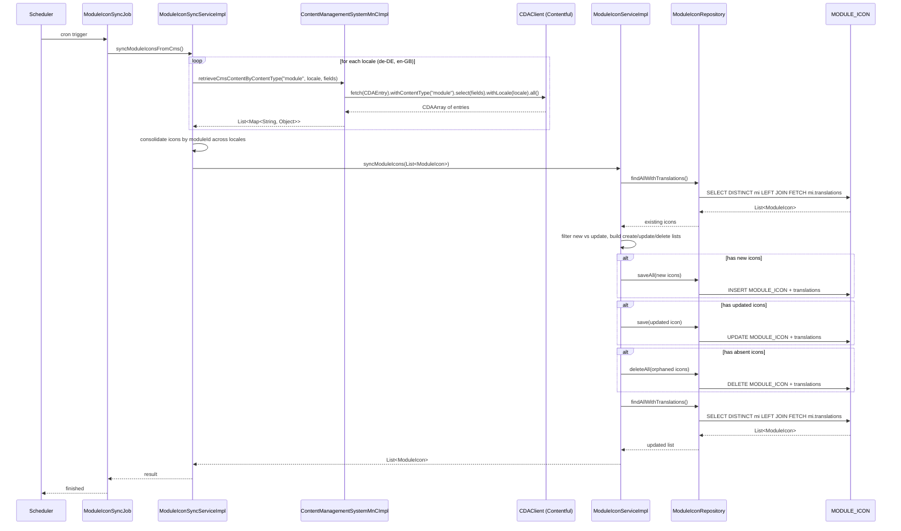

# Chain — ModuleIconSyncJob · syncModuleIcons

<!-- scaffold — phase 1 -->

- **Action point** — `ModuleIconSyncJob` (wpfe-am / wpfe-am-app)
- **Kind** — job
- **Source** — `wpfe-am-app/src/main/java/com/commerzbank/wtp/wpfe/am/app/jobs/scheduling/ModuleIconSyncJob.java`
- **Handler** — `syncModuleIcons()` — `.../ModuleIconSyncJob.java:30`
- **Trigger** — `cron = ${application.offer-generator.module-icon-sync.cronExpression:-}` ( ShedLock name: moduleIconSyncJob)
- **Preconditions** — none observed; @SchedulerLock prevents concurrent execution
- **First hop** — `ModuleIconSyncService.syncModuleIconsFromCms()` (wpfe-am / ucc-offer-generator)

<!-- analysis — phase 2 -->

## Story

As a **system administrator**, I want module icons and their translations to be kept in sync with the Contentful CMS on a regular schedule so that the offer generator always displays up-to-date visual content for each investment module without manual intervention.

- **Given** a cron expression configured via `application.offer-generator.module-icon-sync.cronExpression`
- **When** the scheduled job fires (protected by ShedLock to prevent concurrent execution)
- **Then** all module icons of content type "module" are fetched from Contentful CMS for both locales (`de-DE`, `en-GB`), consolidated into single icon records with multi-language translations, and synced to the local database — creating new entries, updating existing ones, and deleting orphaned entries no longer present in CMS
- **Unless** a CMS retrieval fails for a locale — that locale's data is silently skipped with an error logged, and other locales continue processing

## Chain

```text
Branch 1 · primary
  ModuleIconSyncJob.syncModuleIcons()
  → ModuleIconSyncServiceImpl.syncModuleIconsFromCms()
    → ContentManagementSystemMnCImpl.retrieveCmsContentByContentType(contentType="module", locale, fields)
      → CDAClient.fetch(CDAEntry.class).withContentType("module").select(fields).withLocale(locale).all()
      ⇒ [external]  Contentful CMS (CDAClient SDK)
    → ModuleIconServiceImpl.syncModuleIcons(List<ModuleIcon>)
      → ModuleIconRepository.findAllWithTranslations()
        ⇒ [db]  MODULE_ICON
      → ModuleIconRepository.saveAll(List<ModuleIcon>) / save(ModuleIcon) / deleteAll(List<ModuleIcon>)
        ⇒ [db]  MODULE_ICON
```

- **Terminals reached** — `external` (Contentful CMS via CDAClient SDK), `db` (`MODULE_ICON`)

## Diagrams

### Process flow — primary

```mermaid
flowchart LR
  A([Cron trigger]) --> B[ModuleIconSyncJob.syncModuleIcons]
  B --> C[ModuleIconSyncServiceImpl.syncModuleIconsFromCms]
  C --> D{For each locale de-DE, en-GB}
  D --> E[ContentManagementSystemMnCImpl.retrieveCmsContentByContentType]
  E --> F["CDAClient.fetch(CDAEntry).withContentType(\"module\").select(fields).withLocale(locale).all()"]
  F --> G([external/Contentful CMS])
  G --> H[Map CDAEntry to ModuleIcon with translations]
  H --> I[Consolidate icons across locales by moduleId]
  I --> J[ModuleIconServiceImpl.syncModuleIcons]
  J --> K[ModuleIconRepository.findAllWithTranslations]
  K --> L[(MODULE_ICON)]
  L --> M{New or existing?}
  M -->|new| N["saveAll(new icons)"]
  M -->|existing| O[updateExistingModuleIcon]
  O --> P["save(updated icon)"]
  N --> Q[deleteAbsentModuleIcons]
  Q --> R["deleteAll(orphaned icons)"]
  P --> S([List<ModuleIcon> result])
  R --> S
```

### Sequence — primary



## Journey

When the cron schedule fires, the request enters at step 1 to trigger a full module icon synchronization from Contentful CMS. Once that completes, the flow moves to step 2 because the job needs to fetch fresh data from the CMS before persisting it.

1. **ModuleIconSyncJob.syncModuleIcons** (wpfe-am / wpfe-am-app)

   **Source.** `wpfe-am-app/src/main/java/com/commerzbank/wtp/wpfe/am/app/jobs/scheduling/ModuleIconSyncJob.java:30`

   **Role.** Scheduled entry point that triggers the module icon synchronization. Protected by ShedLock (`@SchedulerLock(name = "moduleIconSyncJob")`) to prevent concurrent execution across multiple instances.

   **Preconditions.** Cron expression configured via `application.offer-generator.module-icon-sync.cronExpression` (defaults to empty string, meaning no scheduling if unset).

   **On failure.** If the service call throws an exception, it propagates and the job fails — no retry or fallback is implemented at this level.

   **Effect.** Logs start/finish messages; delegates all work to `ModuleIconSyncService`.

   **Downstream.** `ModuleIconSyncServiceImpl.syncModuleIconsFromCms()`

2. **ModuleIconSyncServiceImpl.syncModuleIconsFromCms** (wpfe-am / ucc-offer-generator)

   **Source.** `ucc-offer-generator/src/main/java/coba/wtp/wpfe/ucc/offer/generator/service/impl/ModuleIconSyncServiceImpl.java:50`

   **Role.** Orchestrates the full sync cycle: fetches module icon data from Contentful CMS for each configured locale, maps raw CMS entries to `ModuleIcon` domain objects with their translations, consolidates multi-locale data into single icon records keyed by `moduleId`, then delegates persistence to `ModuleIconService`.

   **Preconditions.** None — the method is self-contained and handles all error cases internally.

   **On failure.** CMS retrieval failures per locale are caught at the locale loop level (line 58-64): the exception is logged with `LOG.error`, and processing continues to the next locale. No locale failure aborts the entire sync.

   **Effect.** Produces a consolidated list of `ModuleIcon` objects, each carrying translations for all available locales, ready for database synchronization.

   **Steps.**

   - **2.1 Fetch — CMS content per locale** · `ModuleIconSyncServiceImpl.java:54`

     **Role.** Iterates over the two configured locales (`de-DE`, `en-GB`) and calls `ContentManagementSystemMnC.retrieveCmsContentByContentType("module", locale, fields)` for each. The fields requested are `fields.id`, `fields.name`, `fields.icon`, and `fields.helperText`.

     **On failure.** If the CMS call throws any exception, it is caught at line 58-64, logged with the contentType/locale/error details, and processing continues to the next locale. The failed locale contributes zero icons to the result.

   - **2.2 Map — CMS entry to ModuleIcon** · `ModuleIconSyncServiceImpl.java:60`

     **Role.** For each CMS content map returned by the MnC, calls `mapModuleIconContentCmsToModuleIcon()` which uses `ModuleIconSyncHelper` to extract `moduleId`, icon bytes (Base64-decoded from the CMS image field), name, and helperText. Builds a `ModuleIcon` entity with one `ModuleIconTranslation` for the current locale.

   - **2.3 Consolidate — merge translations across locales** · `ModuleIconSyncServiceImpl.java:71`

     **Role.** Collects all icons from both locales into a single map keyed by `moduleId`. When the same `moduleId` appears in multiple locales (which it always does), merges their translation sets so each resulting `ModuleIcon` carries translations for all available locales. Uses `(existing, replacement) -> { existing.getTranslations().addAll(replacement.getTranslations()); return existing; }` as the merge function.

   - **2.4 Sync — persist to database** · `ModuleIconSyncServiceImpl.java:78`

     **Role.** Delegates to `moduleIconService.syncModuleIcons(moduleIconsWithAllLocales)` which handles create/update/delete logic against the local database.

3. **ContentManagementSystemMnCImpl.retrieveCmsContentByContentType(contentType, locale, fields)** (wpfe-shared / wpfe-shared-cms)

   **Source.** `wpfe-shared/wpfe-shared-cms/src/main/java/coba/wtp/wpfe/shared/cms/mnc/impl/ContentManagementSystemMnCImpl.java:73`

   **Role.** Map and Call layer that translates the service's request into a Contentful SDK call. Fetches all entries of the given content type from Contentful, applies field selection and locale filtering, then processes each `CDAEntry` into a `Map<String, Object>` by extracting fields (handling strings, lists, rich documents, images as Base64-encoded data URIs, nested entries).

   **On failure.** The SDK call itself is not wrapped in try-catch at this layer — exceptions propagate up to the caller (`ModuleIconSyncServiceImpl`), which catches them per locale.

   **Effect.** Returns `List<Map<String, Object>>` where each map represents one CMS entry with its fields processed (images converted to Base64 data URIs via `handleImageField`).

   **Downstream.** Contentful CMS via CDAClient SDK — an external system call.

4. **CDAClient.fetch(CDAEntry.class).withContentType("module").select(fields).withLocale(locale).all()** (wpfe-shared / wpfe-shared-cms)

   **Source.** `wpfe-shared/wpfe-shared-cms/src/main/java/coba/wtp/wpfe/shared/cms/mnc/impl/ContentManagementSystemMnCImpl.java:75`

   **Role.** The Contentful Java SDK client makes an HTTP GET request to the Contentful Delivery API, fetching entries of content type "module" with field selection and locale filtering. Returns a `CDAArray` containing all matching entries.

   **Terminal — external** · Contentful CMS (CDAClient SDK) — the CDAClient is injected as a Spring bean (`final CDAClient client`) configured via Contentful's delivery API credentials. This is an outbound HTTP call to `cdn.contentful.com` (or the organization-specific endpoint).

5. **ModuleIconServiceImpl.syncModuleIcons(List<ModuleIcon>)** (wpfe-am / ucc-offer-generator)

   **Source.** `ucc-offer-generator/src/main/java/coba/wtp/wpfe/ucc/offer/generator/service/impl/ModuleIconServiceImpl.java:38`

   **Role.** Performs a full-database sync of module icons. Loads all existing icons from the database, then classifies each incoming icon as new (create), updated (update in place with translation merge), or absent (delete). Executes creates, updates, and deletes atomically within a `@Transactional` boundary.

   **Preconditions.** The input list must contain complete `ModuleIcon` objects with all translations for every locale.

   **On failure.** Any database error during the transaction causes a rollback — no partial state is left. The exception propagates to the caller (`ModuleIconSyncServiceImpl`).

   **Effect.** Irreversible writes to the `MODULE_ICON` table and its associated `MODULE_ICON_TRANSLATION` rows: new icons created, existing ones updated with merged translations, orphaned entries deleted.

   **Steps.**

   - **5.1 Load — all existing icons** · `ModuleIconServiceImpl.java:42`

     **Role.** Calls `moduleIconRepository.findAllWithTranslations()` to load every module icon currently in the database along with its translations, building a lookup map keyed by `moduleId`.

   - **5.2 Classify — new vs existing** · `ModuleIconServiceImpl.java:46`

     **Role.** Iterates over incoming icons and checks if each `moduleId` exists in the database map. Existing icons are updated in place (translation merge + icon replacement); new icons are collected for batch creation.

   - **5.3 Create — save new icons** · `ModuleIconServiceImpl.java:54`

     **Role.** If any new icons were identified, calls `moduleIconRepository.saveAll(iconsToCreate)` to persist them in a single batch operation.

   - **5.4 Delete — remove orphans** · `ModuleIconServiceImpl.java:60`

     **Role.** Extracts all `moduleId` values from the incoming list and compares against existing database entries. Icons whose `moduleId` is absent from the incoming set are collected for deletion via `deleteAbsentModuleIcons()`, which calls `moduleIconRepository.deleteAll(iconsToDelete)`.

   - **5.5 Return — refreshed state** · `ModuleIconServiceImpl.java:67`

     **Role.** After all creates/updates/deletes complete, re-queries the database (`findAllWithTranslations()`) to return the authoritative current state of all module icons with translations.

6. **ModuleIconRepository.findAllWithTranslations() / saveAll() / save() / deleteAll()** (wpfe-am / ucc-offer-generator)

   **Source.** `ucc-offer-generator/src/main/java/coba/wtp/wpfe/ucc/offer/generator/repository/ModuleIconRepository.java:14` (findAllWithTranslations), line 23 (findByIdWithTranslations)

   **Role.** Spring Data JPA repository providing database access to the `MODULE_ICON` table. Uses a JPQL query with `LEFT JOIN FETCH mi.translations` to eagerly load translations in a single query, avoiding N+1 fetch problems.

   **Terminal — db** · `MODULE_ICON` table (wpfe-am / ucc-offer-generator) via JPA entity `ModuleIcon`. The table stores module icon binary data (`ICON` column as LOB), the module identifier (`MODULE_ID` as primary key), and has a one-to-many relationship with `ModuleIconTranslation` for multi-language name and helper text.

## Data reached

- **external — Contentful CMS via CDAClient SDK (wpfe-shared / wpfe-shared-cms)**
  - Business problem solved — As the **module icon sync job**, I need the latest module icons, names, and helper texts from Contentful CMS to be able to keep the local database in sync with the content management system. Therefore we call the Contentful Delivery API via `CDAClient.fetch(CDAEntry.class).withContentType("module").select(fields).withLocale(locale).all()` to retrieve all module entries for a given locale. Then we process each entry — converting image assets to Base64 data URIs, extracting name and helperText strings — so we can build domain `ModuleIcon` objects with their translations (`ContentManagementSystemMnCImpl.java:75-80`).

  - **Request path**
    ```json
    {
      "content_type": "module",
      "locale": "de-DE",
      "fields": ["fields.id", "fields.name", "fields.icon", "fields.helperText"]
    }
    ```
    `content_type` — hardcoded as `"module"` in the service.
    `locale` — iterated over `List.of("de-DE", "en-GB")`.
    `fields` — hardcoded array of four field selectors.

  - **Response fields used**
    ```json
    {
      "id": "module-equity-growth",
      "name": "Aktienwachstum",
      "icon": "data:image/png;charset=utf-8;base64,iVBORw0KGgo...",
      "helperText": "Langfristiger Aktienaufbau"
    }
    ```
    `id` → module identifier, used as the primary key for consolidation and database lookup (`ModuleIconSyncHelper.java:37`).
    `name` → localized display name for the module icon translation (`ModuleIconSyncHelper.java:41`).
    `icon` → Base64-encoded image data URI (data:image/...;charset=utf-8;base64,...), stored as binary in the MODULE_ICON.ICON column (`ContentManagementSystemMnCImpl.java:173`, `ModuleIconSyncHelper.java:25`).
    `helperText` → localized helper text displayed alongside the icon translation (`ModuleIconSyncHelper.java:45`).

  - **Response fields discarded** — Contentful system fields such as `sys.id`, `sys.createdAt`, `sys.updatedAt`, `sys.version`, and any additional content model fields not in the selected field list.

- **db — MODULE_ICON, via ModuleIconRepository (wpfe-am / ucc-offer-generator)**
  - Business problem solved — As the **module icon sync service**, I need to persist module icons with their multi-language translations in the local database so that the offer generator can serve them without hitting Contentful on every request. Therefore we query `MODULE_ICON` via `ModuleIconRepository.findAllWithTranslations()` for existing entries, then perform a full-diff sync: creating new icons whose moduleId is absent from the DB, updating existing ones with fresh icon bytes and merged translations, and deleting orphaned entries no longer present in CMS (`ModuleIconServiceImpl.java:42-67`). The result is an authoritative, transactionally consistent copy of all module icons.

  - **Query** — `findAllWithTranslations()` → `SELECT DISTINCT mi FROM ModuleIcon mi LEFT JOIN FETCH mi.translations` (line 14-18); `saveAll()`, `save()`, `deleteAll()` — standard JPA CRUD operations on the MODULE_ICON entity and its cascaded translations.

  - **Argument**
    ```json
    {
      "moduleId": "module-equity-growth",
      "icon": [byte array],
      "translations": [
        {"lang": "de-DE", "name": "Aktienwachstum", "helperText": "Langfristiger Aktienaufbau"},
        {"lang": "en-GB", "name": "Equity Growth", "helperText": "Long-term equity buildup"}
      ]
    }
    ```
    `moduleId` ← from CMS entry id, used as the primary key.
    `icon` ← Base64-decoded image bytes from CMS asset field.
    `translations` ← one per locale, each with lang (locale), name, and helperText extracted from CMS fields.

  - **Response fields used** — The full `ModuleIcon` entity: `moduleId`, `icon` (byte[]), and the cascaded `translations` set (`ModuleIconTranslationId(moduleId, lang)`, `name`, `helperText`). All fields are returned by `findAllWithTranslations()` after each sync cycle.

  - **Response fields discarded** — Audit fields inherited from `AuditableEntity`: `creationDate`, `updateDate`. These are maintained by JPA but not consumed by the sync logic.

## Acceptance Criteria

1. **Full sync on cron trigger** — Given a valid cron expression configured, when the scheduled job fires, then all module icons of content type "module" are fetched from Contentful CMS for both locales (de-DE and en-GB), consolidated by moduleId, and persisted to the MODULE_ICON table with all translations.
   - Evidence: `ModuleIconSyncJob.java:30` → `ModuleIconSyncServiceImpl.java:50-78`
   - How to: verify the cron expression is set in application properties; trigger the job (or wait for the next scheduled run); query MODULE_ICON and confirm all module entries from CMS are present with both locale translations.

2. **Per-lobe error isolation** — Given a Contentful API failure for one locale (e.g., de-DE returns an error), when the sync runs, then the other locale's data is still processed and synced successfully, and only the failed locale contributes zero icons.
   - Evidence: `ModuleIconSyncServiceImpl.java:58-64` — try/catch around each locale's CMS call; exception logged, loop continues
   - How to: stub the Contentful API to fail for one locale while succeeding for the other; run the sync job; confirm that only the successful locale's icons appear in MODULE_ICON.

3. **New icons are created** — Given a moduleId present in CMS but absent from the database, when the sync runs, then a new ModuleIcon row is inserted into MODULE_ICON with its translations and icon bytes.
   - Evidence: `ModuleIconServiceImpl.java:46-55` — filter for missing moduleId → saveAll()
   - How to: delete an existing module icon from MODULE_ICON; run the sync job; confirm the icon reappears in the database.

4. **Existing icons are updated** — Given a moduleId present in both CMS and the database, when the sync runs, then the icon bytes are replaced with the latest version from CMS, and translations are merged (new locales added, existing ones overwritten).
   - Evidence: `ModuleIconServiceImpl.java:47-50` (updateExistingModuleIcon), `ModuleIconSyncServiceImpl.java:73-76` (translation merge)
   - How to: modify an icon's image in CMS; run the sync job; query MODULE_ICON and confirm the ICON column contains the new bytes.

5. **Orphaned icons are deleted** — Given a moduleId present in the database but absent from CMS, when the sync runs, then that ModuleIcon row and all its translations are deleted from the database.
   - Evidence: `ModuleIconServiceImpl.java:60-64` (deleteAbsentModuleIcons → deleteAll)
   - How to: insert a fake moduleId into MODULE_ICON that does not exist in CMS; run the sync job; confirm the orphaned row is removed.

6. **ShedLock prevents concurrent execution** — Given multiple application instances running simultaneously, when the cron fires, then only one instance executes the sync while others skip it.
   - Evidence: `ModuleIconSyncJob.java:27` — `@SchedulerLock(name = "moduleIconSyncJob")`
   - How to: start two instances with the same ShedLock database configuration; trigger the job; confirm only one instance logs "started" and performs the sync.

7. **Translation merge preserves all locales** — Given a module icon that has translations in de-DE from CMS but en-GB was previously deleted, when the sync runs, then the en-GB translation is restored (if still present in CMS) or removed (if absent from CMS).
   - Evidence: `ModuleIconServiceImpl.java:78-92` — updateExistingModuleIcon adds missing translations and removes those no longer present
   - How to: remove a locale's entry from CMS for an existing module; run the sync job; confirm the corresponding translation row is deleted from MODULE_ICON_TRANSLATION.

## Business Takeaways

**Restatement only.** Every line here cites a fact already established earlier in this same file. No source file is opened for this section.

- **What this does for the business** — keeps module icons and their multi-language display names up to date by periodically pulling all "module" content type entries from Contentful CMS, consolidating translations across locales (de-DE and en-GB), and performing a full-diff sync against the local MODULE_ICON database table — creating new icons, updating existing ones with fresh image bytes and merged translations, and deleting orphaned entries no longer present in CMS.

- **Depends on** — Contentful CMS (external system, CDAClient SDK, content type "module", two locales); the MODULE_ICON database table (read-write via JPA)

- **Ingredients** — cron expression (`application.offer-generator.module-icon-sync.cronExpression`), CMS credentials (injected as CDAClient bean), locale list (`de-DE`, `en-GB`), field selectors (`id`, `name`, `icon`, `helperText`)

- **Preparation** — fetch module entries from Contentful for each locale, map CMS fields to ModuleIcon domain objects with translations, consolidate by moduleId across locales

- **Dish** — MODULE_ICON table fully synchronized: all icons present in CMS are created or updated with latest image bytes and merged multi-language translations; orphaned entries deleted. Result returned as `List<ModuleIcon>`.

- **An irreversible effect appears twice** — the full-diff sync (create/update/delete) to MODULE_ICON is described in Journey step 5 (ModuleIconServiceImpl.syncModuleIcons) and again here under Dish.

