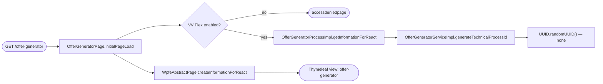
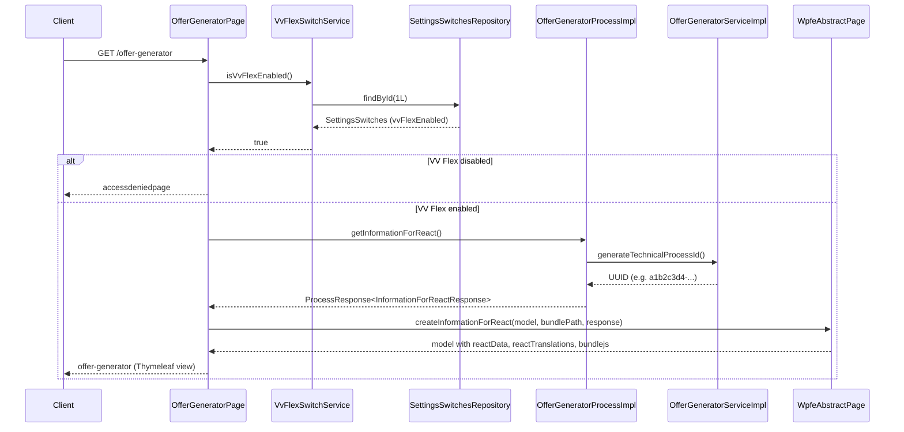

# Chain — OfferGeneratorPage · GET /offer-generator

<!-- scaffold — phase 1 -->

- **Action point** — `OfferGeneratorPage` (wpfe-am / ucc-offer-generator)
- **Kind** — page-controller
- **Source** — `ucc-offer-generator/src/main/java/coba/wtp/wpfe/ucc/offer/generator/pages/OfferGeneratorPage.java`
- **Handler** — `initialPageLoad(Model, HttpServletRequest)` — `.../OfferGeneratorPage.java:60`
- **Trigger** — `GET /offer-generator`
- **Preconditions** — Spring Security authentication (AccessDeniedException handling); VV Flex switch must be enabled (`vvFlexSwitchService.isVvFlexEnabled()`); BusinessException caught and redirected to error page
- **First hop** — `OfferGeneratorProcess.getInformationForReact()` (wpfe-am / ucc-offer-generator)

<!-- analysis — phase 2 -->

## Story

As a **retail customer navigating to the offer generator** from the top menu, I want my browser page to load with an initial technical process ID and all necessary React configuration so that the single-page application can begin the investment configuration flow.

- **Given** a logged-in customer whose session carries authentication context
- **When** `GET /offer-generator` is called (the MVC handler for the offer generator overview)
- **Then** the VV Flex feature switch is checked, a technical process ID is generated, and the Thymeleaf page renders with React bundle path, translations, and initial data in the model
- **Unless** the VV Flex switch is disabled — the customer is redirected to the access-denied page instead

## Chain

Branch 1 · primary
  OfferGeneratorPage.initialPageLoad(Model, HttpServletRequest)
  → VvFlexSwitchService.isVvFlexEnabled()
    → SettingsSwitchesRepository.findById(SETTINGS_ROW_ID)
    ⇒ [db] SETTINGS_SWITCHES (VV_FLEX_ENABLED flag)

Branch 2 · diverges at OfferGeneratorPage
  → OfferGeneratorProcessImpl.getInformationForReact()
    → OfferGeneratorServiceImpl.generateTechnicalProcessId()
    ⇒ [none] UUID.randomUUID() pure computation

- **Terminals reached** — `db` (SETTINGS_SWITCHES, via SettingsSwitchesRepository in wpfe-am-commons), `none` (UUID generation, pure computation)

## Diagrams

### Process flow — primary



### Sequence — primary



## Journey

When **the customer clicks the offer generator link in the top menu**, the request enters at **[step 1]** to handle **the initial page load for the React-based offer generator SPA**. Once that completes, the flow moves to **[step 2]** because **the feature switch must be checked before any business data is assembled**.

Below is each step in call order — what it does, why it exists, how it handles failure, and what passes the baton forward.

1. **OfferGeneratorPage.initialPageLoad(Model, HttpServletRequest)** (wpfe-am / ucc-offer-generator)

   **Source.** `ucc-offer-generator/src/main/java/coba/wtp/wpfe/ucc/offer/generator/pages/OfferGeneratorPage.java:60`

   **Role.** MVC handler for the offer generator overview page. It gates access on the VV Flex feature switch, assembles initial data by calling the process layer, and renders a Thymeleaf view with React bundle path, translations, and serialized process response in the model.

   **Preconditions.** Spring Security authentication (AccessDeniedException caught and redirected to `accessdeniedpage`).

   **On failure.** BusinessException → logs error details and returns `errorcancellingpage`. AccessDeniedException → returns `accessdeniedpage`. Any other Exception → returns `errorcancellingpage`.

   **Effect.** Sets model attributes (`reactData`, `bundlejs`, `contextRoot`, `locale`, `channel`, `wpfeSessionId`) and selects the Thymeleaf view name.

   **Downstream.** The rendered HTML page is sent to the browser, where the React SPA hydrates using the serialized initial data.

2. **VvFlexSwitchServiceImpl.isVvFlexEnabled()** (wpfe-am / ucc-offer-generator)

   **Source.** `ucc-offer-generator/src/main/java/coba/wtp/wpfe/ucc/offer/generator/service/impl/VvFlexSwitchServiceImpl.java:34`

   **Role.** Reads the VV Flex feature toggle from the SETTINGS_SWITCHES database table. Cached with `@Cacheable(value = "vvFlexEnabled")` using `settingsSwitchesCacheManager`, so repeated calls during a session avoid redundant DB reads. The cache refreshes periodically (per `spring/caching.xml`), meaning toggling the switch takes effect within that TTL rather than immediately.

   **On failure.** If the SETTINGS_SWITCHES row with ID=1 is not found, logs a warning and defaults to `false` (disabled).

   **Effect.** Returns `true` or `false`, controlling whether the offer generator page is accessible.

3. **SettingsSwitchesRepository.findById(Long)** (wpfe-am / wpfe-am-commons)

   **Source.** `wpfe-am-commons/src/main/java/coba/wtp/wpfe/am/commons/repository/SettingsSwitchesRepository.java:12`

   **Role.** JPA repository interface extending JpaRepository<SettingsSwitches, Long>. Reads the single-row SETTINGS_SWITCHES table by its fixed primary key (ID = 1L) to retrieve feature switch flags including `vvFlexEnabled`.

   **Effect.** Returns an Optional<SettingsSwitches> containing the row's data, or empty if the row does not exist.

4. **OfferGeneratorProcessImpl.getInformationForReact()** (wpfe-am / ucc-offer-generator)

   **Source.** `ucc-offer-generator/src/main/java/coba/wtp/wpfe/ucc/offer/generator/process/impl/OfferGeneratorProcessImpl.java:178`

   **Role.** Process-layer method that assembles the initial data needed by the React application before it initializes. For this trigger, it generates a technical process ID (UUID) that identifies the customer's offer generation session.

   **Effect.** Wraps the UUID in an InformationForReactResponse inside a ProcessResponse.

5. **OfferGeneratorServiceImpl.generateTechnicalProcessId()** (wpfe-am / ucc-offer-generator)

   **Source.** `ucc-offer-generator/src/main/java/coba/wtp/wpfe/ucc/offer/generator/service/impl/OfferGeneratorServiceImpl.java:123`

   **Role.** Generates a unique UUID for the customer's offer generation session. This technical process ID is stored in the database when the customer saves preferences or product configurations, linking all subsequent data to this session.

   **Effect.** Returns `UUID.randomUUID()` — pure computation with no outbound calls.

6. **WpfeAbstractPage.createInformationForReact(Model, String, ProcessResponse)** (wpfe-shared / wpfe-shared-frontend)

   **Source.** `wpfe-shared/wpfe-shared-frontend/src/main/java/coba/wtp/wpfe/shared/frontend/page/WpfeAbstractPage.java:108`

   **Role.** Framework method that prepares the Spring MVC model for React SPA hydration. It serializes the ProcessResponse to JSON (as `reactData`), computes the bundle JS path, loads translations from Java resource bundles (page-specific, messages, unittype, depositorytype), adds context root and locale, and loads dynamic links from a classpath JSON file.

   **Effect.** Model attributes set: `reactData`, `bundlejs`, `contextRoot`, `locale`, `channel`, `wpfeSessionId`, `reactTranslations`, `reactDynamicLinks`.

## Data reached

- **db — SETTINGS_SWITCHES, via SettingsSwitchesRepository (wpfe-am / wpfe-am-commons)**
  - Business problem solved — As the **offer generator page**, I need to know whether the VV Flex feature is enabled so that I can gate access to the offer generator SPA. Therefore we query `SETTINGS_SWITCHES` via `SettingsSwitchesRepository.findById(1L)` for the single-row settings record, so we can read the `VV_FLEX_ENABLED` column and either serve the page or redirect to the access-denied view (`VvFlexSwitchServiceImpl.java:34-40`).

  - **Query** — `findById(SETTINGS_ROW_ID)` where `SETTINGS_ROW_ID = 1L` — read-only, no write anywhere in this chain.

  - **Argument**
    ```json
    {
      "id": 1
    }
    ```
    `id` ← fixed constant `SettingsSwitchesRepository.SETTINGS_ROW_ID`, always `1L`. The SETTINGS_SWITCHES table is a single-row design: one row per application, with boolean columns for each feature switch.

  - **Response fields used** — `vvFlexEnabled`
    ```json
    {
      "id": 1,
      "vvFlexEnabled": true
    }
    ```
    `vvFlexEnabled` → the gate decision (Journey step 2). Example value inferred from entity definition at `SettingsSwitches.java:30`. The entity carries additional switch columns on the same row, but only `vvFlexEnabled` is read in this chain.

  - **Response fields discarded** — all other feature switch columns on the SETTINGS_SWITCHES row (e.g. any future switches added as new columns) — a single-row design where each column is a separate feature flag.

- **none — UUID generation, pure computation**
  - Business problem solved — As the **offer generator process**, I need a unique session identifier so that all subsequent customer preferences and product configurations can be linked to this specific offer generation flow. Therefore we call `UUID.randomUUID()` in `OfferGeneratorServiceImpl.generateTechnicalProcessId()` to produce a version-4 UUID, which is then wrapped in an InformationForReactResponse and passed back to the page controller for serialization into the React initial data.

  - **Argument** — none (no input parameters).

  - **Result used** — `UUID` value (e.g. `a1b2c3d4-e5f6-7890-abcd-ef1234567890`)
    ```json
    {
      "technicalProcessId": "a1b2c3d4-e5f6-7890-abcd-ef1234567890"
    }
    ```
    `technicalProcessId` → stored in InformationForReactResponse, serialized as JSON into the page model's `reactData`, consumed by the React SPA to initialize its Redux store. Example value inferred from UUID format.

## Acceptance Criteria

1. **VV Flex enabled — page loads with initial data** — Given a logged-in customer and SETTINGS_SWITCHES row (ID=1) where VV_FLEX_ENABLED is true, when `GET /offer-generator` is called, then the response is an HTML page rendering the Thymeleaf view `offer-generator`, with model attributes containing a valid UUID in `reactData.technicalProcessId`, the bundle JS path, translations, and locale.
   - Evidence: `OfferGeneratorPage.java:60-82` — when vvFlexEnabled returns true, the handler proceeds to call getInformationForReact() and createInformationForReact(), then returns "offer-generator".
   - How to: set VV_FLEX_ENABLED = true in SETTINGS_SWITCHES; call GET /offer-generator with a valid session; assert on the response body for the Thymeleaf-rendered HTML containing the reactData JSON with a UUID pattern.

2. **VV Flex disabled — access denied** — Given SETTINGS_SWITCHES row (ID=1) where VV_FLEX_ENABLED is false, when `GET /offer-generator` is called, then the response redirects to the `accessdeniedpage` view without calling the process layer or generating a technical process ID.
   - Evidence: `OfferGeneratorPage.java:67-69` — the if-block checks vvFlexSwitchService.isVvFlexEnabled() and returns PAGE_ACCESS_DENIED immediately when false, before any process call.
   - How to: set VV_FLEX_ENABLED = false in SETTINGS_SWITCHES; call GET /offer-generator; assert that the response is the accessdeniedpage view and no UUID appears in the model.

3. **Missing SETTINGS_SWITCHES row — defaults to disabled** — Given the SETTINGS_SWITCHES table has no row with ID=1, when `GET /offer-generator` is called, then vvFlexSwitchService.isVvFlexEnabled() returns false (disabled), and the customer sees the access-denied page.
   - Evidence: `VvFlexSwitchServiceImpl.java:37-40` — the .orElseGet() branch logs a warning and returns false when findById returns empty.
   - How to: delete or ensure no row exists with ID=1 in SETTINGS_SWITCHES; call GET /offer-generator; assert on accessdeniedpage response and check application log for the "SETTINGS_SWITCHES row not found" warning.

4. **Technical process ID is a valid UUID** — Given VV Flex is enabled, when `GET /offer-generator` is called, then the InformationForReactResponse contains a version-4 UUID that matches the RFC 4122 format (8-4-4-4-12 hex digits).
   - Evidence: `OfferGeneratorServiceImpl.java:123` — returns UUID.randomUUID() directly.
   - How to: call GET /offer-generator with VV Flex enabled; parse the reactData JSON from the response body; assert that technicalProcessId matches the UUID regex pattern `[0-9a-f]{8}-[0-9a-f]{4}-4[0-9a-f]{3}-[89ab][0-9a-f]{3}-[0-9a-f]{12}`.

5. **React SPA receives serialized initial data** — Given VV Flex is enabled, when `GET /offer-generator` is called, then the Thymeleaf-rendered HTML contains a reactData model attribute with JSON containing `{"technicalProcessId":"<uuid>"}`, plus bundlejs, contextRoot, locale, channel, wpfeSessionId, reactTranslations, and reactDynamicLinks attributes.
   - Evidence: `WpfeAbstractPage.java:108-123` — createInformationForReact serializes the ProcessResponse to JSON as reactData; `addBundleJS`, `addContextRoot`, `addTranslationsForReact`, `addDynamicLinksForReact`, and `addWpfeSessionId` set the remaining model attributes.
   - How to: call GET /offer-generator with VV Flex enabled; inspect the HTML response for script tags or JavaScript variables containing the reactData JSON string.

## Business Takeaways

- **What this does for the business** — serves as the entry point for the offer generator SPA, gating access on a feature flag and providing the customer's session identifier so that all subsequent configuration steps (preferences, product selection, module proportions) can be tracked under one technical process.
- **Depends on** — SETTINGS_SWITCHES table (read-only, single-row feature toggle design); UUID generation (pure computation)
- **Ingredients** — authenticated session (Spring Security), VV Flex enabled flag
- **Preparation** — check the feature switch; if enabled, generate a unique technical process ID and serialize it into the page model alongside React bundle path and translations
- **Dish** — Thymeleaf-rendered HTML page with `offer-generator` view name, carrying serialized initial data (technical process ID) for React SPA hydration, or an access-denied/error-cancelling fallback page
---

