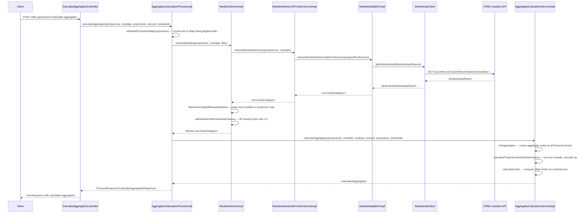

# Chain — CalculateAggregatesController · POST /calculate-aggregates

<!-- scaffold — phase 1 -->

- **Action point** — `CalculateAggregatesController` (wpfe-am / ucc-offer-generator)
- **Kind** — rest-controller
- **Source** — `ucc-offer-generator/src/main/java/coba/wtp/wpfe/ucc/offer/generator/controller/CalculateAggregatesController.java`
- **Handler** — `calculateAggregates(CalculateAggregatesRequest)` — `.../CalculateAggregatesController.java:41`
- **Trigger** — `POST /offer-generator/v1/calculate-aggregates`
- **Preconditions** — `@Valid` on request body; no explicit security annotation observed
- **First hop** — `AggregatesCalculationProcess.calculateAggregates()` (wpfe-am / ucc-offer-generator)

<!-- analysis — phase 2 -->

## Story

As an **advisor or retail customer** building a model contract, I want the system to calculate aggregate proportions and investment limits across all modules so that the UI can display the portfolio composition with enforceable slider constraints.

- **Given** a product line (EXCLUSIVE / EFFICIENT / EXPERT), its mandate, a list of module proportions, an optional entire investment amount, and a flag for alternative investments
- **When** `POST /offer-generator/v1/calculate-aggregates` is called with those parameters
- **Then** the system retrieves the full module hierarchy from CPMS, filters it to only the modules present in the request, computes proportions and absolute values at every level of the hierarchy (asset category → asset class → module class → module), calculates enforceable slider limits for each module, and returns a `CalculatedAggregates` object
- **Unless** the product line is EXPERT — then the mandate (SUSTAINABLE / INDEX_SELECTION / ACTIVE_SELECTION) further narrows which modules are returned from CPMS

## Chain

```text
Branch 1 · primary
  CalculateAggregatesController
  → AggregatesCalculationProcessImpl
  → ModulesServiceImpl
  → ModulesHierarchyProviderServiceImpl
  → ModulesDataMnCImpl
  → ModulesApiClient
  ⇒ [external]  CPMS modules data API (wpfe-shared / wpfe-shared-cpms)

Branch 2 · diverges at AggregatesCalculationProcessImpl
  → AggregatesCalculationServiceImpl
  ⇒ [none]  pure computation — proportions, absolute values, and slider limits
```

- **Terminals reached** — `external` (CPMS modules data API, via `wpfe-shared / wpfe-shared-cpms`), `none` (pure computation of aggregate values and limits)

## Diagrams

### Process flow — primary

```mermaid
flowchart LR
  A(["POST /offer-generator/v1/calculate-aggregates"]) --> B[CalculateAggregatesController]
  B --> C[AggregatesCalculationProcessImpl.calculateAggregates]
  C --> D[Convert proportions to Map<String,BigDecimal>]
  D --> E{modulesService.retrieveModules}
  E --> F[ModulesServiceImpl.retrieveModules with filter]
  F --> G[ModulesHierarchyProviderServiceImpl.retrieveModulesHierarchy]
  G --> H[ModulesDataMnCImpl.retrieveModulesHierarchyByProductLine]
  H --> I[ModulesApiClient.getModulesData]
  I --> J([external/CPMS modules data API])
  J --> K[Map ModulesDataResult to AssetCategory hierarchy]
  K --> L[Filter hierarchy by relevant module IDs]
  L --> M[Set default limits for module classes]
  M --> N[AggregatesCalculationServiceImpl.calculateAggregates]
  N --> O[Initialize aggregate structures at all levels]
  O --> P[Calculate proportions and absolute values per module]
  P --> Q{includeAlternativeInvestments?}
  Q -- yes --> R[Recalculate liquid proportion and adjust]
  Q -- no --> S[Use raw proportions directly]
  R --> T[Calculate limits via LimitsService]
  S --> T
  T --> U([CalculatedAggregates response])
```



### Sequence — primary



## Journey

When the **POST /offer-generator/v1/calculate-aggregates** endpoint fires, the request enters at step 1 to handle a client's request for aggregate portfolio calculations. Once that completes, the flow moves to step 2 because the process orchestrator coordinates both module retrieval and calculation.

1. **CalculateAggregatesController.calculateAggregates** (wpfe-am / ucc-offer-generator)

   **Source.** `ucc-offer-generator/src/main/java/coba/wtp/wpfe/ucc/offer/generator/controller/CalculateAggregatesController.java:41`

   **Role.** Receives the HTTP POST with a validated request body containing product line, mandate, module proportions, investment amount, and alternative-investment flag. Delegates to the process layer and wraps the result in a `JsonResponse`.

   **Preconditions.** `@Valid` on the request body; Spring validates required fields (`productLine`, `moduleProportions`). No explicit security annotation observed.

   **Effect.** Returns a `JsonResponse<CalculateAggregatesResponse>` containing the calculated aggregates.

2. **AggregatesCalculationProcessImpl.calculateAggregates** (wpfe-am / ucc-offer-generator)

   **Source.** `ucc-offer-generator/src/main/java/coba/wtp/wpfe/ucc/offer/generator/process/impl/AggregatesCalculationProcessImpl.java:47`

   **Role.** Orchestrates the aggregate calculation in two phases: first retrieves and filters the module hierarchy from CPMS, then computes proportions, absolute values, and slider limits across all hierarchy levels.

   **Steps.**

   - **2.1 Convert — proportions list to map** · `AggregatesCalculationProcessImpl.java:50`

     **Role.** Calls `ModelContractProportionMapper.toModuleProportionMap()` (wpfe-shared / wpfe-shared-cpms) to convert the request's `List<ModelContractProportion>` into a `Map<String, BigDecimal>` keyed by module ID. This map is used both for filtering modules and for computing proportions.

   - **2.2 Retrieve — filtered module hierarchy** · `AggregatesCalculationProcessImpl.java:51`

     **Role.** Calls `modulesService.retrieveModules(productLine, productLineMandate, filter)` where the filter keeps only modules whose ID or technicalId appears in the proportion map. This is Branch 1.

   - **2.3 Calculate — aggregates** · `AggregatesCalculationProcessImpl.java:56`

     **Role.** Calls `aggregatesCalculationService.calculateAggregates()` with the filtered modules, proportions, investment amount, and alternative-investment flag. This is Branch 2.

   **Downstream.** A sorted `List<AssetCategory>` (Branch 1) and a `CalculatedAggregates` object (Branch 2).

3. **ModulesServiceImpl.retrieveModules** (wpfe-am / ucc-offer-generator)

   **Source.** `ucc-offer-generator/src/main/java/coba/wtp/wpfe/ucc/offer/generator/service/impl/ModulesServiceImpl.java:87`

   **Role.** Retrieves the full module hierarchy for a product line from CPMS, filters it to only modules relevant to the request, and enriches each module with icon data from CMS.

   **Steps.**

   - **3.1 Fetch — full hierarchy from CPMS** · `ModulesServiceImpl.java:90`

     **Role.** Calls `modulesHierarchyProviderService.retrieveModulesHierarchy(productLine, productLineMandate)` to get the complete module tree (AssetCategory → AssetClass → ModuleClass → Module) from CPMS.

   - **3.2 Filter — by relevant modules** · `ModulesServiceImpl.java:95`

     **Role.** Calls `ModuleHierarchyHelper.filterHierarchyByRelevantModules()` to drop every node whose modules do not appear in the proportion map, so only requested modules flow through.

   - **3.3 Set defaults — module class limits** · `ModulesServiceImpl.java:96`

     **Role.** Walks the hierarchy and sets default upper limits of 1.0 (100%) on any `ModuleClassLimits` that are null or have null sub-limits, so downstream calculations always have a value to work with.

   - **3.4 Enrich — module icons from CMS** · `ModulesServiceImpl.java:98`

     **Role.** Fetches all `ModuleIcon` records (with translations) from the local database via `moduleIconRepository.findAllWithTranslations()`, matches each icon to a module by ID or technicalId, and attaches the icon image URL and translated name/helper text. If an icon is missing after a CMS sync retry, throws a `TechnicalException`.

   **On failure.** A missing module icon that cannot be synced from CMS triggers a `TechnicalException` with message "Module icon/translations could not be loaded after CMS retry" (`ModulesServiceImpl.java:120`).

4. **ModulesHierarchyProviderServiceImpl.retrieveModulesHierarchy** (wpfe-am / ucc-offer-generator)

   **Source.** `ucc-offer-generator/src/main/java/coba/wtp/wpfe/ucc/offer/generator/service/impl/ModulesHierarchyProviderServiceImpl.java:32`

   **Role.** Translates the product-line and mandate enums into a CPMS-compatible string, then delegates to the MnC. Results are cached under `cpmsModules` keyed by `productLine:name() + ':' + productLineMandate?.name()`.

   **Steps.**

   - **4.1 Map — product line to CPMS string** · `ModulesHierarchyProviderServiceImpl.java:38`

     **Role.** Converts the enum into a path-like string:
       - EXCLUSIVE → "product-line-exclusive"
       - EFFICIENT → "product-line-efficient"
       - EXPERT + SUSTAINABLE → "product-line-expert-sustainable"
       - EXPERT + INDEX_SELECTION → "product-line-expert-index-selection"
       - EXPERT + ACTIVE_SELECTION → "product-line-expert-active-selection"

   - **4.2 Call — MnC** · `ModulesHierarchyProviderServiceImpl.java:45`

     **Role.** Calls `modulesDataMnC.retrieveModulesHierarchyByProductLine(mappedString)` to fetch the module hierarchy from CPMS.

   **Downstream.** A `List<AssetCategory>` representing the full module tree, or an empty list if CPMS returns nothing.

5. **ModulesDataMnCImpl.retrieveModulesHierarchyByProductLine** (wpfe-shared / wpfe-shared-cpms)

   **Source.** `wpfe-shared/wpfe-shared-cpms/src/main/java/coba/wtp/wpfe/shared/cpms/mnc/impl/ModulesDataMnCImpl.java:109`

   **Role.** Maps the flat list of modules returned from CPMS into a hierarchical domain model (AssetCategory → AssetClass → ModuleClass → Module), applying property-to-field mappings and grouping logic.

   **Steps.**

   - **5.1 Request — build ModulesDataRequest** · `ModulesDataMnCImpl.java:110`

     **Role.** Creates a `ModulesDataRequest` with a properties map containing the product-line key-value pair, then calls `modulesApi.getModulesData(request)`.

   - **5.2 Map — flat modules to hierarchy** · `ModulesDataMnCImpl.java:134`

     **Role.** Filters out non-VV-flex modules (those without a `coba-general-attributes-module-id` property), then groups modules into module classes, asset classes, and asset categories:
       - Stocks + Commodities → offensive category
       - Bonds + Liquidity → defensive category
       - Alternative investments → alternative-investments category
     Each module's properties (limits, risk profile, acquisition type, weighting type, group info, costs) are mapped from CPMS property definitions to domain fields.

   **On failure.** If CPMS returns an empty `Optional`, the method returns an empty list — not an error. This is a valid outcome when no modules match the product line filter.

6. **ModulesApiClient.getModulesData** (wpfe-shared / wpfe-shared-cpms)

   **Source.** `wpfe-shared/wpfe-shared-cpms/src/main/java/coba/wtp/wpfe/shared/cpms/api/modules/ModulesApiClient.java:47`

   **Role.** Sends an HTTP GET request to the CPMS modules data API, building the URL with query parameters for properties and module IDs. Handles 404 as empty result and propagates all other errors as `TechnicalException`.

   **On failure.**
   - 404 Not Found → returns `Optional.empty()` (no modules found)
   - Any other HTTP error or exception → throws `TechnicalException` with message "Exception during: /portfolios/modules api call"

   **Terminal — external** · CPMS modules data API at `https://cpms-midtier-int-snap.tuc.apps.cloud.internal/securities-int/v1/portfolios/modules?properties=...`

7. **AggregatesCalculationServiceImpl.calculateAggregates** (wpfe-am / ucc-offer-generator)

   **Source.** `ucc-offer-generator/src/main/java/coba/wtp/wpfe/ucc/offer/generator/service/impl/AggregatesCalculationServiceImpl.java:58`

   **Role.** Computes the complete aggregate structure for a portfolio: initializes nodes at every hierarchy level, calculates proportions and absolute values per module, then derives enforceable slider limits.

   **Steps.**

   - **7.1 Initialize — all aggregate levels** · `AggregatesCalculationServiceImpl.java:60`

     **Role.** Creates `ModelContractAggregate`, `AssetCategoryAggregate`, `AssetClassAggregate`, `ModuleClassAggregate`, and `ModuleAggregate` objects for every node in the hierarchy, initializing their proportion and absolute value to zero.

   - **7.2 Calculate — proportions and absolute values** · `AggregatesCalculationServiceImpl.java:143`

     **Role.** Iterates through all modules and computes:
       - Per-module proportion from the request's proportion map (using either module ID or technicalId as key)
       - Absolute value = proportion × entireInvestmentAmount
       - Cascades sums upward: module → module class → asset class → asset category
     When `includeAlternativeInvestments` is true, liquid modules are recalculated to redistribute their proportion across non-liquid modules.

   - **7.3 Calculate — slider limits** · `AggregatesCalculationServiceImpl.java:62`

     **Role.** Calls three limit-calculation methods:
       - `calculateModuleLimits` — computes lower and upper slider bounds per module using `LimitsService.calculateLowerLimit()` and `LimitsService.calculateUpperLimit()`, which take the max of absolute, liquid-part-percentage, and asset-category-percentage constraints
       - `calculateGroupLowerLimits` — computes group-level lower limits by summing modules sharing a groupId that have groupingDefault=true
       - `calculateModuleClassLimits` — computes module class upper limits as the minimum of the class-level cap and the sum of its constituent modules' individual caps
     Also calculates the key risk indicator as a weighted average of module minimum-risk-return-profiles.

   **Terminal — none** · Pure computation; no outbound calls, no persistence. The result is assembled entirely in memory from the module hierarchy and proportion data already retrieved.

## Data reached

- **external — CPMS modules data API, via `ModulesApiClient` (wpfe-shared / wpfe-shared-cpms)**
  - Business problem solved — As the **aggregate calculation process**, I need the full module hierarchy with all properties (limits, risk profiles, costs, grouping info) to be able to compute portfolio proportions and enforceable slider constraints. Therefore we call this API at `GET /securities-int/v1/portfolios/modules?properties={propertyKey}:{propertyValue}` to retrieve the complete modules catalogue filtered by product line. Then we map each module's flat property list into a hierarchical domain model (AssetCategory → AssetClass → ModuleClass → Module), so we can compute aggregates at every level (`ModulesDataMnCImpl.java:134-200`).

  - **Request path**
    ```json
    {
      "properties": "coba-asset-management-product-line:\"product-line-efficient\""
    }
    ```
    `properties` — query parameter, origin: product line enum mapped to a string key-value pair in `ModulesHierarchyProviderServiceImpl.java:38-44`. For EXPERT mandates, the value includes the mandate (e.g., "product-line-expert-sustainable").

  - **Request body** — none (GET request).

  - **Response fields used**
    ```json
    {
      "modulesData": [
        {
          "moduleId": "mod-equity-growth",
          "properties": [
            {"definitionId": "coba-general-attributes-module-id", "propertyValue": "equity-growth"},
            {"definitionId": "coba-general-attributes-asset-class", "propertyValue": "stocks"},
            {"definitionId": "coba-general-attributes-module-class", "propertyValue": "mc-equities"},
            {"definitionId": "coba-target-markets-minimum-risk-profile", "propertyValue": "5"},
            {"definitionId": "coba-general-attributes-lower-limit-percentage-liquid-part", "propertyValue": "0.1"},
            {"definitionId": "coba-general-attributes-upper-limit-percentage-liquid-part", "propertyValue": "0.8"}
          ]
        }
      ]
    }
    ```
    `moduleId` → module identifier (Journey step 5.2). `properties[].definitionId` + `propertyValue` → mapped to domain fields: minimumRiskReturnProfile, limits (lower/upper absolute and percentage), acquisitionType, weightingType, groupId, groupingDefault, expectedReturn, expectedVolatility, productCosts (`ModulesDataMnCImpl.java:206-238`). Example values inferred from property constant definitions at `ModulesDataMnCImpl.java:41-79`.

  - **Response fields discarded** — none explicitly; the entire ModulesDataResult is consumed. However, only properties matching known definition IDs are mapped; any unknown property definitions are silently ignored (`findValueForGivenProperty` returns empty).

- **none — in-memory aggregate computation (wpfe-am / ucc-offer-generator)**
  - Business problem solved — As the **aggregate calculation service**, I need to compute proportional allocations and enforceable investment limits at every level of the portfolio hierarchy so that the UI can display accurate composition data with valid slider ranges. Therefore we iterate through all modules in the hierarchy, multiply each module's proportion by the entire investment amount to get absolute values, cascade sums upward (module → class → asset class → category), then derive lower and upper limits per module using the max of absolute constraints and percentage-of-liquid-part or percentage-of-asset-category constraints (`AggregatesCalculationServiceImpl.java:143-208`).

  - **Input data** — `List<AssetCategory>` (from CPMS, filtered), `Map<String, BigDecimal>` module proportions, `BigDecimal` entireInvestmentAmount, `boolean` includeAlternativeInvestments.

  - **Output produced** — `CalculatedAggregates` containing:
    ```json
    {
      "modelContractAggregate": {"aggregatedKeyRiskIndicator": 4},
      "moduleAggregates": [
        {
          "moduleId": "mod-equity-growth",
          "proportionOfEntireInvestment": 0.35,
          "absoluteValue": 35000.00,
          "sliderLimits": {"lowerLimit": 0.10, "upperLimit": 0.80}
        }
      ],
      "moduleClassAggregates": [...],
      "assetClassAggregates": [...],
      "assetCategoryAggregates": [...]
    }
    ```
    Values inferred from the calculation logic at `AggregatesCalculationServiceImpl.java:143-208` and `LimitsServiceImpl.java:29-56`. Example proportion 0.35 (35%), absolute value 35,000 for a 100,000 investment.

## Acceptance Criteria

1. **Valid request returns calculated aggregates** — Given a product line (e.g., EFFICIENT), a list of module proportions with valid module IDs, and an entireInvestmentAmount, when `POST /offer-generator/v1/calculate-aggregates` is called, then the response contains a `CalculatedAggregates` object with proportion and absoluteValue populated for each requested module, and slider limits computed from the module's limit constraints.
   - Evidence: `AggregatesCalculationProcessImpl.java:47-62`, `AggregatesCalculationServiceImpl.java:58-63`
   - How to: call the endpoint with a known product line and proportion list; assert that each module in the response has non-zero proportion and absoluteValue = proportion × entireInvestmentAmount.

2. **Only requested modules appear in aggregates** — Given a request containing proportions for modules A, B, and C only, when the endpoint is called, then the returned `CalculatedAggregates` contains entries only for those three modules (and their parent asset categories/classes), not for any other module in the CPMS catalogue.
   - Evidence: `ModulesServiceImpl.java:95` — `filterHierarchyByRelevantModules(assetCategories, filter)` where filter checks `moduleProportions.containsKey(m.getId()) || moduleProportions.containsKey(m.getTechnicalId())`
   - How to: call with proportions for a subset of modules; verify the response contains no entries for unrequested modules.

3. **EXPERT product line respects mandate** — Given productLine=EXPERT and productLineMandate=SUSTAINABLE, when the endpoint is called, then the CPMS request uses "product-line-expert-sustainable" as the property filter value, returning only sustainable-mandate modules.
   - Evidence: `ModulesHierarchyProviderServiceImpl.java:40-43` — switch expression mapping EXPERT + SUSTAINABLE to "product-line-expert-sustainable"
   - How to: call with EXPERT/SUSTAINABLE; verify the CPMS request URL contains `properties=coba-asset-management-product-line:"product-line-expert-sustainable"`.

4. **Alternative investments flag affects liquid proportion** — Given includeAlternativeInvestments=true, when modules are calculated, then liquid module proportions are recalculated to redistribute their share across non-liquid modules using the formula: `newProportion = oldLiquidProportion × (moduleProportion / oldLiquidPart)`.
   - Evidence: `AggregatesCalculationServiceImpl.java:173-180` — `getNewProportion()` computes `currentValue.divide(oldLiquidPart, DEFAULT_ROUNDING).multiply(calculateLiquidInvestmentProportion)`
   - How to: call with includeAlternativeInvestments=true and verify liquid module proportions differ from the raw input; compare against a call with false where they should match.

5. **Slider limits respect all constraint types** — Given a module with lowerLimitAbsolute=1000, lowerLimitPercentageOfLiquidPart=0.1, and entireInvestmentAmount=100000, when aggregates are calculated, then the module's slider lower limit equals max(1000/100000, 0.1 × liquidProportion).
   - Evidence: `LimitsServiceImpl.java:35-48` — lowerLimit starts at ZERO, takes max with absolute-derived proportion and percentage-of-liquid-part
   - How to: set known limits on a module in CPMS; call the endpoint; verify the returned sliderLimits.lowerLimit matches the computed max.

6. **Module class upper limit is capped by sum of modules** — Given a module class whose individual cap is 0.5 but whose constituent modules each have caps summing to 0.8, when aggregates are calculated, then the module class upper limit equals 0.5 (the smaller value).
   - Evidence: `LimitsServiceImpl.java:103-106` — `moduleClassUpperLimit.min(sumOfModuleUpperLimits)`
   - How to: configure a module class with a tight cap and loose individual module caps; verify the aggregate reflects the tighter constraint.

7. **404 from CPMS returns empty aggregates** — Given that the CPMS modules API returns HTTP 404, when `POST /offer-generator/v1/calculate-aggregates` is called, then the response contains a `CalculatedAggregates` with empty lists for all aggregate types (no modules to calculate).
   - Evidence: `ModulesApiClient.java:57-59` — returns `Optional.empty()` on 404; `ModulesDataMnCImpl.java:113` — `.orElse(Collections.emptyList())`
   - How to: stub the CPMS endpoint to return 404; assert that the response contains empty aggregate lists.

8. **Missing module icon triggers TechnicalException** — Given a module whose ID does not match any ModuleIcon in the database and for which CMS sync also fails, when the endpoint is called, then a `TechnicalException` is thrown with message "Module icon/translations could not be loaded after CMS retry".
   - Evidence: `ModulesServiceImpl.java:117-120` — throws TechnicalException after both direct lookup and retryMissingModuleIconSync fail
   - How to: remove the ModuleIcon record for a module present in the proportion list; assert that the call fails with TechnicalException.

## Business Takeaways

**What this does for the business** — computes the complete portfolio composition from a set of module proportions, retrieving the full module catalogue from CPMS, filtering it to only requested modules, and calculating enforceable investment limits (slider constraints) at every level of the hierarchy so that advisors can adjust allocations within valid bounds.

**Depends on** — the CPMS modules data API (external, returns the full module hierarchy with properties); the local ModuleIcon database (for icon enrichment)

**Ingredients** — productLine (EXCLUSIVE/EFFICIENT/EXPERT), productLineMandate (SUSTAINABLE/INDEX_SELECTION/ACTIVE_SELECTION for EXPERT), List of module proportions (moduleId → currentValue), entireInvestmentAmount, includeAlternativeInvestments flag

**Preparation** — convert proportion list to map; fetch full module hierarchy from CPMS filtered by product line; filter hierarchy to requested modules; enrich with CMS icons and set default limits

**Dish** — `CalculatedAggregates` containing proportions, absolute values, and slider limits at model contract, asset category, asset class, module class, and module levels

