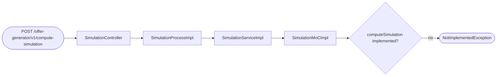
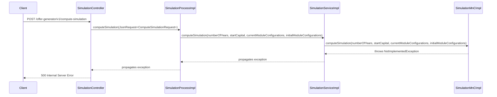

# Chain — SimulationController · POST /compute-simulation

<!-- scaffold — phase 1 -->

- **Action point** — `SimulationController` (wpfe-am / ucc-offer-generator)
- **Kind** — rest-controller
- **Source** — `ucc-offer-generator/src/main/java/coba/wtp/wpfe/ucc/offer/generator/controller/SimulationController.java`
- **Handler** — `computeSimulations(ComputeSimulationRequest)` — `.../SimulationController.java:34`
- **Trigger** — `POST /offer-generator/v1/compute-simulation`
- **Preconditions** — `@Valid` on request body; no explicit security annotation observed
- **First hop** — `SimulationProcess.computeSimulation()` (wpfe-am / ucc-offer-generator)

<!-- analysis — phase 2 -->

## Story

As an **advisor or the system itself**, I want to compute a financial simulation for a portfolio's module configurations so that projected performance metrics (KPIs and fractile graphs) can be displayed to support investment decisions.

- **Given** a customer's current and initial module configurations, a start capital amount, and a number of years
- **When** `POST /offer-generator/v1/compute-simulation` is called with those parameters
- **Then** the system computes projected KPIs (expected performance, return, volatility, Sharpe ratio) and fractile graph data for both current and initial configurations over the requested time horizon
- **Unless** the method is not yet implemented — currently it throws `NotImplementedException` pending CPMS integration

## Chain

```text
Branch 1 · primary
  SimulationController
  → SimulationProcessImpl
  → SimulationServiceImpl
  → SimulationMnCImpl
  ⇒ [none]  stub — NotImplementedException thrown, no outbound calls yet
```

- **Terminals reached** — `none` (stub method throws NotImplementedException; CPMS integration not wired)

## Diagrams

### Process flow — primary



### Sequence — primary



## Journey

When the **POST /offer-generator/v1/compute-simulation** endpoint fires, the request enters at step 1 to receive a JSON-wrapped `ComputeSimulationRequest` containing simulation parameters. Once that completes, the flow moves to step 2 because the controller delegates business logic to the process layer. From there, step 3 takes over to delegate further down to the service layer, and so on through every hop until the stub throws an exception.

1. **SimulationController.computeSimulations** (wpfe-am / ucc-offer-generator)

   **Source.** `ucc-offer-generator/src/main/java/coba/wtp/wpfe/ucc/offer/generator/controller/SimulationController.java:34`

   **Role.** Receives the POST request, validates the body via `@Valid`, and delegates to the simulation process layer.

   **Preconditions.** Request body must be a valid `JsonRequest<ComputeSimulationRequest>` — validated by Jakarta validation annotations on the parameter.

   **On failure.** Invalid request body yields a 400 Bad Request from Spring's validation. Any exception propagating from downstream is not caught here and surfaces as a 500 Internal Server Error.

   **Effect.** Wraps the `ProcessResponse<Simulation>` into a `JsonResponse` via `JsonResponseBuilder.buildJsonResultResponse()`.

   **Downstream.** `SimulationProcess.computeSimulation(JsonRequest<ComputeSimulationRequest>)`

2. **SimulationProcessImpl.computeSimulation** (wpfe-am / ucc-offer-generator)

   **Source.** `ucc-offer-generator/src/main/java/coba/wtp/wpfe/ucc/offer/generator/process/impl/SimulationProcessImpl.java:27`

   **Role.** Extracts the typed request data from the JSON wrapper and delegates to the simulation service with flattened parameters.

   **Effect.** Unwraps `request.getData()` into four separate arguments: `numberOfYears`, `startCapital`, `currentModuleConfigurations`, and `initialModuleConfigurations`.

   **Downstream.** `SimulationService.computeSimulation(int, BigDecimal, List<ModuleConfiguration>, List<ModuleConfiguration>)`

3. **SimulationServiceImpl.computeSimulation** (wpfe-am / ucc-offer-generator)

   **Source.** `ucc-offer-generator/src/main/java/coba/wtp/wpfe/ucc/offer/generator/service/impl/SimulationServiceImpl.java:32`

   **Role.** Passes through the simulation parameters to the Map and Call (MnC) layer, which is responsible for integrating with CPMS.

   **Downstream.** `SimulationMnC.computeSimulation(int, BigDecimal, List<ModuleConfiguration>, List<ModuleConfiguration>)`

4. **SimulationMnCImpl.computeSimulation** (wpfe-am / ucc-offer-generator)

   **Source.** `ucc-offer-generator/src/main/java/coba/wtp/wpfe/ucc/offer/generator/mnc/impl/SimulationMnCImpl.java:17`

   **Role.** Currently a stub — throws `NotImplementedException` with the message "Method will be implemented in the future, when there are CPMS integration." No API client is wired below this MnC.

   **On failure.** Throws `org.apache.commons.lang3.NotImplementedException`, which propagates up the entire call stack as an unhandled exception.

   **Effect.** The chain terminates here — no external call, no database query, no computation. The endpoint returns a 500 error to the caller.

## Data reached

- **none** — stub method throws NotImplementedException; no data is retrieved or persisted in this chain.

## Acceptance Criteria

1. **Endpoint accepts valid simulation request parameters** — Given a POST to `/offer-generator/v1/compute-simulation` with a valid `ComputeSimulationRequest` body (numberOfYears, startCapital, currentModuleConfigurations, initialModuleConfigurations), when the request is received, then it passes Spring's `@Valid` validation and reaches SimulationProcessImpl.
   - Evidence: `SimulationController.java:34`
   - How to: send a POST with a valid JSON body matching the ComputeSimulationRequest record schema; confirm the request reaches SimulationProcessImpl.computeSimulation without a 400 response.

2. **Stub throws NotImplementedException on every call** — Given any valid request, when `POST /offer-generator/v1/compute-simulation` is called, then the response is a 500 Internal Server Error caused by `NotImplementedException` thrown from SimulationMnCImpl.computeSimulation().
   - Evidence: `SimulationMnCImpl.java:23`
   - How to: send any valid request and confirm the HTTP status is 500 with an exception message containing "Method will be implemented in the future, when there are CPMS integration."

3. **No external or database calls are made** — Given that the MnC implementation throws immediately, when the endpoint is called, then no outbound API call to CPMS and no database query occurs.
   - Evidence: `SimulationMnCImpl.java:17-24` — method body contains only a throw statement; no field references to any API client or repository.
   - How to: enable SQL logging and HTTP traffic monitoring during a test call; confirm zero queries and zero outbound requests.

## Business Takeaways

**Restatement only.**

- **What this does for the business** — computes projected financial simulation data (KPIs and fractile graphs) for a portfolio's module configurations over a specified time horizon, so that advisors and customers can evaluate investment scenarios. Currently not functional.
- **Depends on** — CPMS integration (not yet wired); no database or external calls exist in the current implementation
- **Ingredients** — numberOfYears (request), startCapital (request), currentModuleConfigurations (request), initialModuleConfigurations (request)
- **Preparation** — extract parameters from JSON request wrapper, pass through process and service layers to MnC
- **Dish** — NotImplementedException / 500 error; no simulation data returned
---

