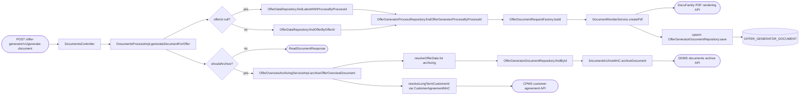
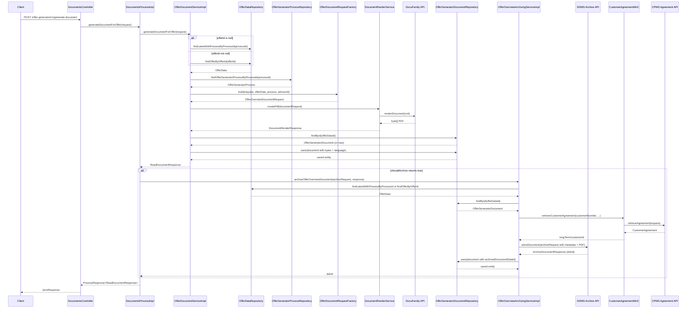

# Chain — DocumentsController · POST /generate-document

<!-- scaffold — phase 1 -->

- **Action point** — `DocumentsController` (wpfe-am / ucc-offer-generator)
- **Kind** — rest-controller
- **Source** — `ucc-offer-generator/src/main/java/coba/wtp/wpfe/ucc/offer/generator/controller/DocumentsController.java`
- **Handler** — `generateOfferGeneratorDocument(GenerateOfferDocumentRequest)` — `.../DocumentsController.java:38`
- **Trigger** — `POST /offer-generator/v1/generate-document`
- **Preconditions** — `@Valid` on request body; no explicit security annotation observed
- **First hop** — `DocumentsProcess.generateDocumentForOffer()` (wpfe-am / ucc-offer-generator)

<!-- analysis — phase 2 -->

## Story

As a **retail customer or advisor in an advisory session**, I want the offer overview document rendered as a PDF and returned to me so that I can review my investment proposal, with an optional copy archived in DDMS for compliance.

- **Given** a technical process id (and optionally an explicit offer id)
- **When** `POST /offer-generator/v1/generate-document` is called with the request body
- **Then** the latest offer data is resolved, the document XML is assembled and rendered to PDF via DocuFamily, persisted in `OFFER_GENERATOR_DOCUMENT`, and returned as a base64-ready byte array — and if archiving applies (not a non-customer process), a copy is stored in DDMS with full metadata
- **Unless** no offer data or process record exists for the given ids — rejected with a technical exception before rendering starts

## Chain

```text
Branch 1 · primary
  DocumentsController.generateOfferGeneratorDocument(JsonRequest<GenerateOfferDocumentRequest>)
  → DocumentsProcessImpl.generateDocumentForOffer(GenerateOfferDocumentRequest)
  → OfferDocumentServiceImpl.generateDocumentForOffer(GenerateOfferDocumentRequest)
    → resolveOfferData(processId, offerId)
      → OfferDataRepository.findLatestWithProcessByProcessId(String) — when offerId is null
      → OfferDataRepository.findOfferByOfferId(Long) — when offerId is not null
    → OfferGeneratorProcessRepository.findOfferGeneratorProcessByProcessId(String)
    → OfferDocumentRequestFactory.build(GenerateOfferDocumentRequest, OfferData, OfferGeneratorProcess, String)
      → populateCommonData() — sender, shipment address, salutations, ex-ante data, investment info
      → populateVvFlexData() — modules config, CMS product line details, simulation (VV-Flex only)
    → DocumentRenderService.createPdf(OfferOverviewDocumentRequest) [offerDocumentRenderService]
    → upsert(offerData, renderResult, documentLanguage)
      → OfferGeneratorDocumentRepository.findById(Long)
      → OfferGeneratorDocumentRepository.save(OfferGeneratorDocument)
  ⇒ [external]  DocuFamily PDF rendering API

Branch 2 · diverges at DocumentsProcessImpl
  → OfferOverviewArchivingService.shouldArchive(String, ReadDocumentResponse)
    → OfferGeneratorProcessRepository.findOfferGeneratorProcessByProcessId(String)
    ⇒ [db]  OFFER_GENERATOR_PROCESS (scenario check)

Branch 3 · diverges at DocumentsProcessImpl
  → OfferOverviewArchivingServiceImpl.archiveOfferOverviewDocument(OfferOverviewArchiveRequest, ReadDocumentResponse)
    → resolveOfferData() — same repo calls as Branch 1
      → OfferDataRepository.findLatestWithProcessByProcessId(String) or findOfferByOfferId(Long)
    → OfferGeneratorDocumentRepository.findById(Long)
    → DocumentArchiveMnC.archiveDocument(ArchiveDocumentRequest)
      → mapStoreDocumentRequest()
      → DocumentsArchiveApiClient.storeDocument(StoreDocumentRequest)
      ⇒ [external]  DDMS documents archive API (POST /documents-api/11/v1/documents)

Branch 4 · diverges at OfferOverviewArchivingServiceImpl.resolveLongTermCustomerId(String)
  → CustomerAgreementMnC.retrieveCustomerAgreement(String, String, Locale, String, String) [CustomerAgreementMnCImplV3]
    → CustomerAgreementApiV3.retrieveAgreement(CustomerAgreementApiRequest)
    ⇒ [external]  CPMS customer agreement API
```

- **Terminals reached** — `db` (OFFER_DATA, OFFER_GENERATOR_PROCESS, OFFER_GENERATOR_DOCUMENT), `external` (DocuFamily PDF rendering API, DDMS documents archive API, CPMS customer agreement API)

## Diagrams

### Process flow — primary



### Sequence — primary



## Journey

When **the trigger fires** (a client calls `POST /offer-generator/v1/generate-document`), the request enters at **[step 1]** to handle **generating an offer overview document as a PDF**. Once that completes, the flow moves to **[step 2]** because **the process layer orchestrates both document generation and conditional archiving**.

Below is each step in call order — what it does, why it exists, how it handles failure, and what passes the baton forward.

1. **DocumentsController.generateOfferGeneratorDocument(JsonRequest<GenerateOfferDocumentRequest>)** (wpfe-am / ucc-offer-generator)

   **Source.** `ucc-offer-generator/src/main/java/coba/wtp/wpfe/ucc/offer/generator/controller/DocumentsController.java:38`

   **Role.** Receives the HTTP POST, validates the request body via `@Valid`, delegates to the process layer, and wraps the result in a `JsonResponse`.

   **Preconditions.** `@Valid` on the JSON request body; no explicit security annotation observed (authorization handled by `@PreAuthorize` on the process method).

   **Effect.** Returns `JsonResponse<ReadDocumentResponse>` containing document name, PDF bytes, and a rendering-error flag.

2. **DocumentsProcessImpl.generateDocumentForOffer(GenerateOfferDocumentRequest)** (wpfe-am / ucc-offer-generator)

   **Source.** `ucc-offer-generator/src/main/java/coba/wtp/wpfe/ucc/offer/generator/process/impl/DocumentsProcessImpl.java:30`

   **Role.** Orchestrates the document generation flow: calls the document service to render and persist, then conditionally archives the rendered PDF in DDMS if archiving applies.

   **Preconditions.** `@PreAuthorize("protectWith('WPFE_AM_OG_WRITE', {'internalCustomerNumber': #request.customerNumber()})")` — requires the `WPFE_AM_OG_WRITE` permission scoped to the customer number.

   **Steps.**

   2.1 **Generate document** · `DocumentsProcessImpl.java:34`
       **Role.** Calls `OfferDocumentService.generateDocumentForOffer()` to resolve offer data, build the render request, produce a PDF via DocuFamily, and persist it.
       **Downstream.** A `ReadDocumentResponse` with document name, byte array, and error flag.

   2.2 **Check archiving eligibility** · `DocumentsProcessImpl.java:35`
       **Role.** Calls `OfferOverviewArchivingService.shouldArchive()` to determine whether the rendered document should be archived in DDMS — skipped for non-customer processes or failed renders.
       **On failure.** Returns `false`, no archiving occurs; the document is still returned to the caller.

   2.3 **Archive if eligible** · `DocumentsProcessImpl.java:36-40`
       **Role.** When archiving applies, constructs an `OfferOverviewArchiveRequest` and calls `archiveOfferOverviewDocument()` to store the PDF in DDMS with full compliance metadata.
       **Effect.** The document is persisted in DDMS; its `dokId` is written back into `OFFER_GENERATOR_DOCUMENT.archivedDocumentDataId`.

3. **OfferDocumentServiceImpl.generateDocumentForOffer(GenerateOfferDocumentRequest)** (wpfe-am / ucc-offer-generator)

   **Source.** `ucc-offer-generator/src/main/java/coba/wtp/wpfe/ucc/offer/generator/service/document/impl/OfferDocumentServiceImpl.java:79`

   **Role.** Resolves the offer data and process record, builds a document render request via the factory, calls DocuFamily to produce a PDF, persists the result in `OFFER_GENERATOR_DOCUMENT`, and returns it.

   **On failure.** If any repository lookup fails (no OfferData or no OfferGeneratorProcess), throws `TechnicalException` with message ID `coba.wtp.wpfe.ucc.offer.generator.service.document.impl.DocumentsServiceImpl`. If rendering fails, wraps the exception in a `TechnicalException` — the entire request aborts.

   **Steps.**

   3.1 **Resolve offer data** · `OfferDocumentServiceImpl.java:85`
       **Role.** Calls `resolveOfferData(processId, offerId)`:
       - If `offerId` is null → queries `OFFER_DATA` for the latest record matching `processId`, ordered by creation date descending.
       - If `offerId` is not null → queries `OFFER_DATA` for the exact match on `id = offerId`.
       **On failure.** Throws `TechnicalException` with "No OfferData found" message.

   3.2 **Resolve process record** · `OfferDocumentServiceImpl.java:87`
       **Role.** Queries `OFFER_GENERATOR_PROCESS` via `findOfferGeneratorProcessByProcessId(processId)` to obtain the customer's risk profile, sustainability preference, and scenario enum.
       **On failure.** Throws `TechnicalException` with "No OfferGeneratorProcess found" message.

   3.3 **Resolve advisor ID** · `OfferDocumentServiceImpl.java:91-94`
       **Role.** Determines the advisor identifier based on channel:
       - Online channel → uses the configured technical user (`api.core.technicalUser`).
       - Branch/other channels → extracts from the authenticated security context via `AuthenticationContextProvider.getComsiIdentifier()`.

   3.4 **Build render request** · `OfferDocumentServiceImpl.java:96`
       **Role.** Delegates to `OfferDocumentRequestFactory.build()` which assembles all sender, address, salutation, ex-ante, and VV-Flex-specific data into an `OfferOverviewDocumentRequest`.

   3.5 **Render PDF** · `OfferDocumentServiceImpl.java:98`
       **Role.** Calls `documentRenderService.createPdf(documentRequest)` which transforms the request into XML, sends it to DocuFamily, and returns a byte array PDF.
       **On failure.** Catches any exception and throws `TechnicalException` with "Failed to render/persist offer document" message.

   3.6 **Persist rendered document** · `OfferDocumentServiceImpl.java:100`
       **Role.** Calls `upsert(offerData, renderResult, documentsLanguage)` which loads or creates an `OfferGeneratorDocument` entity, sets the PDF bytes and language, then saves it.

4. **OfferDocumentRequestFactoryImpl.build(...)** (wpfe-am / ucc-offer-generator)

   **Source.** `ucc-offer-generator/src/main/java/coba/wtp/wpfe/ucc/offer/generator/service/document/impl/OfferDocumentRequestFactoryImpl.java:53`

   **Role.** Assembles the full document render request in two phases: common data (sender, address, salutations, ex-ante) and VV-Flex-specific data (modules config, CMS product line details, simulation).

   **Steps.**

   4.1 **Populate common data** · `OfferDocumentRequestFactoryImpl.java:68`
       **Role.** Calls:
       - `documentDataPreparationService.retrieveSenderData(advisorId)` — sender contact info.
       - `shipmentAddressService.retrieveMainShipmentAddress(...)` — customer's main shipping address from CPMS (only when customerNumber is present).
       - `documentDataPreparationService.retrieveSalutations(advisorId, customerNumber)` — salutation data.
       - `documentDataPreparationService.retrieveExanteData(offerData, processId, customerNumber, language)` — ex-ante cost disclosures.
       - Sets investment information (pension/stock/alternate strategies and fee rate).

   4.2 **Populate VV-Flex data** · `OfferDocumentRequestFactoryImpl.java:97` (guarded by `offerData.getProductLine() != null`)
       **Role.** For VV-Flex product lines only:
       - `documentDataPreparationService.prepareModulesConfiguration(offerData, language)` — module asset class breakdown.
       - `contentManagementSystemService.retrieveCmsProductLineById(...)` — CMS content for the product line (description, strategy, cards).
       - `documentDataPreparationService.retrieveSimulationData(...)` — performance simulation data.
       - Conditionally: `retrieveKeyFigures(offerData)` and `retrieveModuleData(...)` based on request flags.

5. **DocumentRenderServiceImpl.createPdf(OfferOverviewDocumentRequest)** (wpfe-am / ucc-offer-generator)

   **Source.** `ucc-offer-generator/src/main/java/coba/wtp/wpfe/ucc/offer/generator/service/document/impl/OfferDocumentRenderServiceImpl.java:147` (constructor injection of `DocumentRenderMnC`)

   **Role.** Extends `AbstractDocumentRenderServiceImpl`, generating an XML document tree with event metadata, shipment metadata, and business data payload — then delegates to `DocumentRenderMnC.createPdf()` which sends the XML to DocuFamily for PDF rendering.

   **Steps.**

   5.1 **Generate event metadata** · `OfferDocumentRenderServiceImpl.java:163`
       **Role.** Sets template ID (100CB0390037), client ID (CB), system ID, interface version, author (Commerzbank AG), and title in English or German based on document language.

   5.2 **Generate shipment metadata** · `OfferDocumentRenderServiceImpl.java:174`
       **Role.** Sets shipment locale, delivery address from the request's shipment address, and output channels element.

   5.3 **Generate business data payload** · `OfferDocumentRenderServiceImpl.java:190`
       **Role.** Populates the XML businessData element with:
       - Ex-ante cost fields (from exanteData map).
       - Customer/process context (name, number, process ID, print date).
       - Summary page phrase (product-line-dependent translation).
       - Product line mandate name, offensive quota, investment volume.
       - Sustainability preference and risk-return profile from the process record.
       - Investment horizon paragraph (based on risk profile level 1-7).
       - Investment strategy allocation and quota paragraphs.
       - Fee agreement paragraph.
       - VV-Flex specific: product line details, asset classes, performance series, key figures, module details — all conditional on flags and product line type.

   5.4 **Send to DocuFamily** · `AbstractDocumentRenderServiceImpl` (wpfe-shared / documents)
       **Role.** Transforms the XML document to a string via `DocumentsTransformerFactory`, wraps it in a `RenderDocumentRequest`, and calls `documentRenderMnC.createPdf()`.

6. **DocumentRenderMnCImpl.createPdf(RenderDocumentRequest)** (wpfe-shared / wpfe-shared-documents)

   **Source.** `wpfe-shared/wpfe-shared-documents/src/main/java/coba/wtp/wpfe/shared/documents/v1/mnc/impl/DocumentRenderMnCImpl.java:54`

   **Role.** Maps the render request to an API request, calls `DocumentRenderApi.renderDocument()`, and returns the rendered PDF bytes or an error.

   **On failure.** Catches `HttpServerErrorException` / `HttpClientErrorException` and sets a `DocumentRenderError` on the response — does not throw. The error propagates up through OfferDocumentServiceImpl where it is wrapped in a `TechnicalException`.

7. **OfferDocumentServiceImpl.upsert(OfferData, DocumentRenderResult, DocumentLanguage)** (wpfe-am / ucc-offer-generator)

   **Source.** `ucc-offer-generator/src/main/java/coba/wtp/wpfe/ucc/offer/generator/service/document/impl/OfferDocumentServiceImpl.java:123`

   **Role.** Loads an existing `OfferGeneratorDocument` by offer data ID (or creates a new one), sets the PDF bytes, document language, and saves it to `OFFER_GENERATOR_DOCUMENT`.

8. **DocumentsProcessImpl.shouldArchive(String, ReadDocumentResponse)** — via OfferOverviewArchivingServiceImpl (wpfe-am / ucc-offer-generator)

   **Source.** `ucc-offer-generator/src/main/java/coba/wtp/wpfe/ucc/offer/generator/service/document/impl/OfferOverviewArchivingServiceImpl.java:128`

   **Role.** Determines whether the rendered document should be archived in DDMS. Skips archiving when:
   - The rendered document is null, has a rendering error flag set to true, or has no content.
   - No `OfferGeneratorProcess` record exists for the process ID.
   - The process scenario is `NON_CUSTOMER`.

   **Steps.**

   8.1 **Check render success** · `OfferOverviewArchivingServiceImpl.java:130-132`
       **Role.** Drops out if document is null, renderingError is true, or content bytes are absent.

   8.2 **Check process exists** · `OfferOverviewArchivingServiceImpl.java:134-138`
       **Role.** Queries `OFFER_GENERATOR_PROCESS` for the process record; skips archiving if not found.

   8.3 **Check scenario** · `OfferOverviewArchivingServiceImpl.java:140-142`
       **Role.** Skips archiving when `process.getScenario() == ScenarioEnum.NON_CUSTOMER`. Only customer processes (including modifications) are archived.

9. **OfferOverviewArchivingServiceImpl.archiveOfferOverviewDocument(OfferOverviewArchiveRequest, ReadDocumentResponse)** (wpfe-am / ucc-offer-generator)

   **Source.** `ucc-offer-generator/src/main/java/coba/wtp/wpfe/ucc/offer/generator/service/document/impl/OfferOverviewArchivingServiceImpl.java:73`

   **Role.** Archives the rendered offer overview PDF in DDMS with full compliance metadata, then writes back the DDMS document ID (`dokId`) to `OFFER_GENERATOR_DOCUMENT.archivedDocumentDataId`.

   **Steps.**

   9.1 **Resolve offer data for archiving** · `OfferOverviewArchivingServiceImpl.java:78`
       **Role.** Same logic as step 3.1 — finds the latest offer or exact match by offer ID.
       **On failure.** Throws `IllegalStateException` if no OfferData found.

   9.2 **Load document entity** · `OfferOverviewArchivingServiceImpl.java:80-84`
       **Role.** Queries `OFFER_GENERATOR_DOCUMENT` by offer data ID; throws `IllegalStateException` if not found.

   9.3 **Build archive request with metadata** · `OfferOverviewArchivingServiceImpl.java:86-87`
       **Role.** Generates a UUID as the internal document ID, then calls `buildArchiveDocumentRequest()` which:
       - Encodes the PDF bytes in Base64.
       - Builds a full file name from language-dependent prefix + product line strategy name (bilingual resolved).
       - Calls `generateMetadata()` to populate 30+ DDMS metadata fields including storage quality, rules, document type ID, creator info, tenant, damage potential, confidentiality level, and CKA document type ID.

   9.4 **Resolve long-term customer ID** · `OfferOverviewArchivingServiceImpl.java:187`
       **Role.** Calls `CustomerAgreementMnC.retrieveCustomerAgreement()` to get the long-term customer ID (VECKNDNR) from CPMS. This is a side effect — if it fails, archiving continues with `null` for this field.

   9.5 **Archive in DDMS** · `OfferOverviewArchivingServiceImpl.java:89`
       **Role.** Calls `DocumentArchiveMnC.archiveDocument(archiveDocumentRequest)` which maps the request to a `StoreDocumentRequest`, then calls `DocumentsArchiveApiClient.storeDocument()` — an HTTP POST to DDMS.
       **On failure.** If response is null or contains an error, throws `IllegalStateException` with the error details. TODO: proper error handling noted in code comment.

   9.6 **Write back dokId** · `OfferOverviewArchivingServiceImpl.java:93`
       **Role.** Sets `archivedDocumentDataId` on the entity and saves it to `OFFER_GENERATOR_DOCUMENT`.

10. **DocumentArchiveMnCImpl.archiveDocument(ArchiveDocumentRequest)** (wpfe-shared / wpfe-shared-documents)

    **Source.** `wpfe-shared/wpfe-shared-documents/src/main/java/coba/wtp/wpfe/shared/documents/v1/mnc/impl/DocumentArchiveMnCImpl.java:48`

    **Role.** Maps the domain `ArchiveDocumentRequest` to the API-level `StoreDocumentRequest`, then calls `DocumentsArchiveApiClient.storeDocument()`. Catches HTTP errors and returns them in an `ArchiveDocumentResponse` with error details rather than throwing.

11. **DocumentsArchiveApiClient.storeDocument(StoreDocumentRequest)** (wpfe-shared / wpfe-shared-documents)

    **Source.** `wpfe-shared/wpfe-shared-documents/src/main/java/coba/wtp/wpfe/shared/documents/api/archivedocument/DocumentsArchiveApiClient.java:53`

    **Role.** Performs an HTTP POST to `/documents-api/11/v1/documents` with the archive document request body and channel/request headers. Returns `Optional<ArchiveDocumentServiceResponse>` containing external and internal document UUIDs.

12. **CustomerAgreementMnCImplV3.retrieveCustomerAgreement(...)** (wpfe-shared / wpfe-shared-customer)

    **Source.** `wpfe-shared/wpfe-shared-customer/src/main/java/coba/wtp/wpfe/shared/customer/v1/mnc/impl/CustomerAgreementMnCImplV3.java:72`

    **Role.** Maps the customer number and channel context to a `CustomerAgreementApiRequest`, calls `CustomerAgreementApiV3.retrieveAgreement()`, then maps the API response into a domain `CustomerAgreement` object containing tenant, long-term customer ID, type of customer/agreement, agreement roles with labels, and shipment addresses.

13. **CustomerAgreementApiV3.retrieveAgreement(CustomerAgreementApiRequest)** (wpfe-shared / wpfe-shared-customer)

    **Source.** `wpfe-shared/wpfe-shared-customer/src/main/java/coba/wtp/wpfe/shared/customer/api/agreement/CustomerAgreementApiV3.java:14`

    **Role.** HTTP client interface that sends the agreement request to CPMS and returns an `Optional<CustomerAgreement>`.

**Terminal — external** — CPMS customer agreement API (`CustomerAgreementApiV3.retrieveAgreement()`).

## Data reached

- **db — OFFER_DATA, via `OfferDataRepository` (wpfe-am / ucc-offer-generator)**
  - Business problem solved — As the **document generation process**, I need the customer's offer data (investment volume, offensive quota, product line, module proportions, risk-return profile) to be able to assemble a complete document render request. Therefore we query `OFFER_DATA` via `OfferDataRepository.findLatestWithProcessByProcessId(processId)` or `findOfferByOfferId(offerId)` for the offer record, so we can populate the PDF with accurate investment figures and product line details (`OfferDocumentServiceImpl.java:85-94`).

  - **Query** — `findLatestWithProcessByProcessId(String processId)` / `findOfferByOfferId(Long offerId)` — read-only JPA queries.

  - **Argument**
    ```json
    {
      "processId": "PROC-2024-001",
      "offerId": null
    }
    ```
    `processId` ← request body (`GenerateOfferDocumentRequest.technicalProcessId`). `offerId` ← optional, from request body.

  - **Response fields used** — `id`, `quotaOffensiveInvestment`, `investmentVolume`, `productLine`, `productLineMandate`, `productLineStrategyName`, `moduleProportions`, `riskReturnProfile`, `creationDate`. Example:
    ```json
    {
      "id": 42,
      "quotaOffensiveInvestment": "0.65",
      "investmentVolume": "1000000",
      "productLine": "EXPERT",
      "riskReturnProfile": 5
    }
    ```
    Inferred from `OfferData.java` entity fields.

- **db — OFFER_GENERATOR_PROCESS, via `OfferGeneratorProcessRepository` (wpfe-am / ucc-offer-generator)**
  - Business problem solved — As the **document generation process**, I need the customer's risk profile, sustainability preference, and scenario enum to be able to render the correct document content (investment horizon paragraph based on risk level, sustainability flag, VV-Flex vs non-VV-Flex). Therefore we query `OFFER_GENERATOR_PROCESS` via `findOfferGeneratorProcessByProcessId(processId)` for the process record (`OfferDocumentServiceImpl.java:87`).

  - **Query** — `findOfferGeneratorProcessByProcessId(String processId)` — read-only JPA method.

  - **Argument**
    ```json
    {
      "processId": "PROC-2024-001"
    }
    ```
    `processId` ← request body.

  - **Response fields used** — `scenario`, `sustainabilityPreference`, `customerRiskProfile`. Example:
    ```json
    {
      "scenario": "NEW",
      "sustainabilityPreference": true,
      "customerRiskProfile": 5
    }
    ```
    Inferred from `OfferGeneratorProcess` entity.

- **db — OFFER_GENERATOR_DOCUMENT, via `OfferGeneratorDocumentRepository` (wpfe-am / ucc-offer-generator)**
  - Business problem solved — As the **document generation process**, I need to persist the rendered PDF bytes and document language so that the document is retrievable later. Additionally, after archiving in DDMS, I need to write back the `dokId` for traceability. Therefore we use `findById(offerDataId)` (read) and `save(OfferGeneratorDocument)` (write) on `OFFER_GENERATOR_DOCUMENT` (`OfferDocumentServiceImpl.java:123-130`, `OfferOverviewArchivingServiceImpl.java:93`).

  - **Query** — JPA `findById(Long)` / `save(entity)`.

  - **Response fields used (write)** — `offerDataId` (PK), `document` (Lob byte[]), `documentsLanguage`, `archivedDocumentDataId`. Example persisted entity:
    ```json
    {
      "offerDataId": 42,
      "documentsLanguage": "DE",
      "archivedDocumentDataId": "a1b2c3d4-e5f6-7890-abcd-ef1234567890"
    }
    ```

- **external — DocuFamily PDF rendering API, via `DocumentRenderApi` (wpfe-shared / wpfe-shared-documents)**
  - Business problem solved — As the **document render service**, I need to transform an XML document tree into a rendered PDF so that the client receives a viewable offer overview. Therefore we call this API at `POST /documents-api/render-document` (path template inferred from `DocumentRenderApi.renderDocument()`) with the XML payload, locale, output type "pdf", and template name "100CB0390037" (`DocumentRenderMnCImpl.java:65-82`).

  - **Request body** — `RenderDocumentApiRequest` containing:
    ```json
    {
      "documentXml": "<?xml version=\"1.0\"?><eventTemplate>...</eventTemplate>",
      "locale": "de",
      "outputType": "pdf",
      "templateName": "100CB0390037",
      "templateType": "shipeventdef"
    }
    ```
    `documentXml` ← XML tree built by `OfferDocumentRenderServiceImpl.generatePayload()` and related methods. `locale` ← from request document language. `templateName` ← hardcoded as "100CB0390037".

  - **Response fields used** — `byte[]` PDF content. The response is a raw byte array containing the rendered PDF.
    ```json
    {
      "pdfBytes": "JVBERi0xLjQKJeLjz9..."
    }
    ```
    Example value inferred from `DocumentRenderResponse.bytes()` — Base64-encoded PDF content.

  - **On failure.** HTTP errors (4xx/5xx) are caught by `DocumentRenderMnCImpl` and returned as a `DocumentRenderError` on the response object. The error propagates up to `OfferDocumentServiceImpl` where it is wrapped in a `TechnicalException`, aborting the entire request.

- **external — DDMS documents archive API, via `DocumentsArchiveApiClient` (wpfe-shared / wpfe-shared-documents)**
  - Business problem solved — As the **archiving service**, I need to store the rendered offer overview PDF in DDMS with full compliance metadata so that it is retained per regulatory requirements. Therefore we call this API at `POST /documents-api/11/v1/documents` (path template from `DocumentsArchiveApiClient.buildStoreDocumentUrl()`) with the Base64-encoded PDF and 30+ metadata fields (`DocumentsArchiveApiClient.java:53-67`).

  - **Request body** — `StoreDocumentRequest` wrapping an `ArchiveDocumentRequest` containing:
    ```json
    {
      "documentParams": {
        "supplierId": "01-36-63",
        "processRunId": "PROC-2024-001",
        "dataHandler": "JVBERi0xLjQKJeLjz9...",
        "fullFileName": "Angebotsübersicht Expert-Line",
        "representationDescr": "representationDescr",
        "metadata": {
          "archivierung": "1",
          "aufbRegel": "B002",
          "bezugsebene": "K",
          "datFormat": "pdf/ua1",
          "dokTypId": "800100029068",
          "persId": "BPKN-12345",
          "kdNr": "KDNR-67890",
          "status": "archiviert",
          "titel": "VV Angebotsübersicht",
          "vertrauKat": "4",
          "vertraulichkeit": "2"
        }
      }
    }
    ```
    `dataHandler` ← Base64-encoded PDF bytes. `metadata` ← 30+ fields from `Metadata.generateMetadata()` including storage quality, rules, document type ID, creator info (Berater/B), creating system (44-04-21), tenant, damage potential, confidentiality level.

  - **Response fields used** — `externalDocumentId`, `internalDocumentId` from `ArchiveDocumentServiceResponse`. Example:
    ```json
    {
      "externalDocumentId": "EXT-DOC-98765",
      "internalDocumentId": "INT-DOC-54321"
    }
    ```
    Inferred from `ArchiveDocumentServiceResponse` schema.

  - **On failure.** HTTP errors are caught by `DocumentArchiveMnCImpl.archiveDocument()` and returned as an `ApiCallError` on the response. The archiving service then throws `IllegalStateException` with the error details (`OfferOverviewArchivingServiceImpl.java:90-94`).

- **external — CPMS customer agreement API, via `CustomerAgreementApiV3` (wpfe-shared / wpfe-shared-customer)**
  - Business problem solved — As the **archiving service**, I need the long-term customer ID (VECKNDNR) to be able to populate DDMS metadata with the correct customer identifier. Therefore we call this API at `POST /customer-agreement/v3/retrieveAgreement` (path template inferred from `CustomerAgreementApiV3`) with the internal customer number, channel, and locale (`CustomerAgreementMnCImplV3.java:72-108`).

  - **Request body** — `CustomerAgreementApiRequest` containing:
    ```json
    {
      "channel": "ONLINE",
      "requestId": "req-abc-123",
      "comsiId": "TECH-USER-01",
      "internalCustomerNumber": "KDNR-67890"
    }
    ```

  - **Response fields used** — `agreement.uniqueAgreementId` (long-term customer ID). Example:
    ```json
    {
      "customerId": "KDNR-67890",
      "longTermCustomerId": "VECKNDNR-12345"
    }
    ```
    Inferred from `CustomerAgreement` builder at `CustomerAgreementMnCImplV3.java:82-86`.

  - **On failure.** The call is wrapped in a try-catch in `resolveLongTermCustomerId()` (`OfferOverviewArchivingServiceImpl.java:195-204`) that logs a warning and returns `null`. Archiving continues without the long-term customer ID — it is treated as an optional side effect.

## Acceptance Criteria

1. **Happy path — document generated and returned** — Given a valid `technicalProcessId` (and optionally an `offerId`), when `POST /offer-generator/v1/generate-document` is called, then the response contains a `ReadDocumentResponse` with a non-null document name ("Angebotsübersicht.pdf" or "Offer Overview.pdf" depending on language), a non-empty PDF byte array, and `renderingError: false`.
   - Evidence: `DocumentsController.java:43`, `OfferDocumentServiceImpl.java:102-106`
   - How to: call the endpoint with a valid process ID that has associated offer data; assert on the response body for document name, byte array length > 0, and renderingError = false.

2. **No offer data found — rejected** — Given a `technicalProcessId` that does not match any `OfferData` record (and no explicit `offerId`), when the endpoint is called, then the request fails with a technical exception containing "No OfferData found for technicalProcessId".
   - Evidence: `OfferDocumentServiceImpl.java:86-89`
   - How to: call the endpoint with an invalid process ID; confirm from logs that a `TechnicalException` is thrown before any rendering occurs.

3. **Explicit offer ID overrides latest** — Given both a valid `technicalProcessId` and a specific `offerId`, when the endpoint is called, then the document is generated for the exact offer matching `offerId`, not the latest one by creation date.
   - Evidence: `OfferDocumentServiceImpl.java:85-94`
   - How to: create two offers under the same process; call with both IDs present; confirm from a query log that `findOfferByOfferId(offerId)` is executed, not `findLatestWithProcessByProcessId`.

4. **VV-Flex product line includes additional sections** — Given an offer whose `productLine` is not null (VV-Flex), when the document is generated, then the rendered PDF XML contains VV-Flex-specific elements: modules configuration, CMS product line details, simulation data, and optionally key figures and module details.
   - Evidence: `OfferDocumentRequestFactoryImpl.java:97-108`, `OfferDocumentRenderServiceImpl.java:264-315`
   - How to: call with an offer having a VV-Flex product line; inspect the XML sent to DocuFamily (logged at DEBUG level in `AbstractDocumentRenderServiceImpl.logRequestXML()`) for presence of `<businessData>` elements like `offensiveQuotaByProfileBlock`, `performanceSeries`, and `keyFiguresRecord`.

5. **Non-VV-Flex product line omits VV-Flex sections** — Given an offer whose `productLine` is null (non-VV-Flex), when the document is generated, then the rendered PDF XML does not contain VV-Flex-specific elements.
   - Evidence: `OfferDocumentRequestFactoryImpl.java:97`
   - How to: call with a non-VV-Flex offer; inspect the XML for absence of `modulesConfiguration`, `productLineDetailsCms`, and `simulationData` fields.

6. **Archiving skipped for failed renders** — Given a document render that fails (renderingError = true), when archiving is checked, then `shouldArchive()` returns false and no DDMS call is made.
   - Evidence: `OfferOverviewArchivingServiceImpl.java:130-132`
   - How to: stub the DocuFamily API to return a response with `documentRenderError` set; confirm from logs that "Skipping DDMS archiving" message appears and no POST to `/documents-api/11/v1/documents` is made.

7. **Archiving skipped for non-customer processes** — Given an `OfferGeneratorProcess` whose `scenario` is `NON_CUSTOMER`, when the document is generated, then archiving is skipped regardless of render success.
   - Evidence: `OfferOverviewArchivingServiceImpl.java:140-142`
   - How to: create a process with `ScenarioEnum.NON_CUSTOMER`; call the endpoint; confirm from logs that "Skipping DDMS archiving for processId=X - not a customer process" appears.

8. **Archiving performed for customer processes** — Given an `OfferGeneratorProcess` whose `scenario` is not `NON_CUSTOMER`, when the document renders successfully, then the PDF is archived in DDMS and the returned `dokId` is persisted in `OFFER_GENERATOR_DOCUMENT.archivedDocumentDataId`.
   - Evidence: `OfferOverviewArchivingServiceImpl.java:89-93`
   - How to: call with a valid customer process; confirm from logs that "Successfully archived offer overview document" appears and query `OFFER_GENERATOR_DOCUMENT` for the non-null `archivedDocumentDataId`.

9. **Long-term customer ID failure does not break archiving** — Given a CPMS customer agreement API failure, when archiving is performed, then the archive request proceeds with `longTermCustomerId = null` and the document is still archived successfully.
   - Evidence: `OfferOverviewArchivingServiceImpl.java:195-204`
   - How to: stub the CPMS customer agreement API to return 500; confirm from logs that a warning is logged but archiving continues with "Successfully archived" message.

10. **Document persisted in OFFER_GENERATOR_DOCUMENT** — Given any successful call, when the endpoint returns, then `OFFER_GENERATOR_DOCUMENT` contains an entry with the PDF bytes (Lob), document language, and offer data ID as the primary key.
    - Evidence: `OfferDocumentServiceImpl.java:123-130`, `OfferGeneratorDocument.java`
    - How to: call the endpoint; query `OFFER_GENERATOR_DOCUMENT` by `offerDataId`; assert on non-null `document` bytes and correct `documentsLanguage` value.

## Business Takeaways

**What this does for the business** — generates a customer-facing offer overview PDF from investment data, renders it via DocuFamily using template 100CB0390037, persists it in the application database, and optionally archives a copy in DDMS with full compliance metadata (storage rules, document type ID, confidentiality level) for regulatory retention.

**Depends on** —
- `OFFER_DATA` table (read-only, offer investment data)
- `OFFER_GENERATOR_PROCESS` table (read-only, customer risk profile and scenario)
- `OFFER_GENERATOR_DOCUMENT` table (read-write, stores rendered PDF bytes and archive reference)
- DocuFamily API (external, PDF rendering service)
- DDMS documents archive API (external, regulatory document storage)
- CPMS customer agreement API (external, long-term customer ID lookup — optional side effect)

**Ingredients** — `technicalProcessId` (request body), `offerId` (optional request body), `customerNumber` (optional), `documentsLanguage` (DE/EN), investment strategy flags (`pensionStrategy`, `stockStrategy`, `alternateStrategy`), fee rate, and rendering option flags (`performanceMetricsIncluded`, `moduleDetailsIncluded`).

**Preparation** — resolve the offer data by process ID or explicit offer ID; load the process record for risk profile and scenario; build a document render request with sender info, shipment address, salutations, ex-ante disclosures, and VV-Flex-specific module/CMS/simulation data.

**Dish** — `ReadDocumentResponse` (document name, PDF byte array, renderingError flag), or an `TechnicalException` if any prerequisite lookup fails. If archiving applies: a side effect writing the document to DDMS and persisting the `dokId` back into `OFFER_GENERATOR_DOCUMENT.archivedDocumentDataId`.

