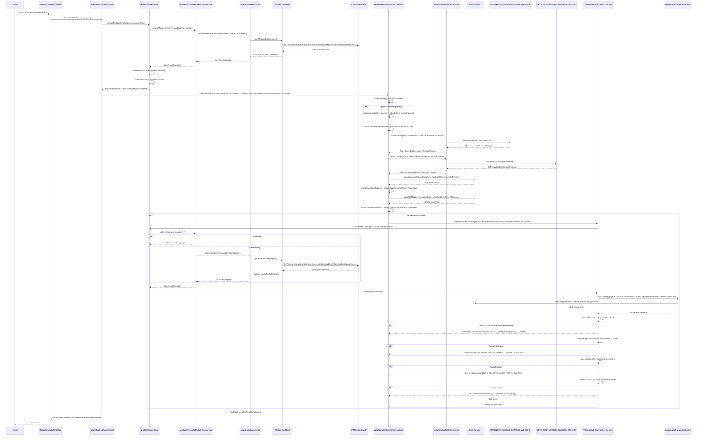

# Chain — ModelContractsController · POST /reallocate-modules-weights

<!-- scaffold — phase 1 -->

- **Action point** — `ModelContractsController` (wpfe-am / ucc-offer-generator)
- **Kind** — rest-controller
- **Source** — `ucc-offer-generator/src/main/java/coba/wtp/wpfe/ucc/offer/generator/controller/ModelContractsController.java`
- **Handler** — `reallocateModulesWeights(ReallocateModulesWeightsRequest)` — `.../ModelContractsController.java:129`
- **Trigger** — `POST /offer-generator/v1/reallocate-modules-weights`
- **Preconditions** — `@Valid` on request body; no explicit security annotation observed
- **First hop** — `ModelContractProcess.reallocateModulesWeights()` (wpfe-am / ucc-offer-generator)

<!-- analysis — phase 2 -->

## Story

As an **advisor or customer in the offer-generation flow**, I want to reallocate module weights within a model contract so that the selected modules receive proportions derived from the WRL (Weighting Reallocation Logic) algorithm, respecting investment limits and producing a valid allocation.

- **Given** a product line, a set of selected module IDs, an entire investment amount, and a stock-and-commodities quota
- **When** `POST /offer-generator/v1/reallocate-modules-weights` is called with those parameters
- **Then** the system fetches the module hierarchy from CPMS, filters it to the requested modules, runs the WRL algorithm to compute proportions for each selected module, and returns either the computed proportions or a list of validation violations
- **Unless** the WRL-produced proportions fail contract validation — in which case the response carries violation errors instead of proportions

## Chain

```text
Branch 1 · primary
  ModelContractsController
  → ModelContractProcessImpl
  → ModulesServiceImpl
  → ModulesHierarchyProviderServiceImpl
  → ModulesDataMnCImpl
  → ModulesApiClient
  ⇒ [external]  CPMS modules data API (wpfe-shared / wpfe-shared-cpms)

Branch 2 · diverges at ModelContractProcessImpl
  → WeightingReallocationServiceImpl
  → InitialWeightsTableServiceImpl
  → OffensiveModuleClassesWeightsRepository
  ⇒ [db]  OFFENSIVE_MODULE_CLASSES_WEIGHTS
  → DefensiveModuleClassesWeightsRepository
  ⇒ [db]  DEFENSIVE_MODULE_CLASSES_WEIGHTS
  → OffensiveBasicModuleClassesWeightsRepository
  ⇒ [db]  OFFENSIVE_BASIC_MODULE_CLASSES_WEIGHTS
  → DefensiveBasicModuleClassesWeightsRepository
  ⇒ [db]  DEFENSIVE_BASIC_MODULE_CLASSES_WEIGHTS
  → LimitsServiceImpl
  ⇒ [none]  pure computation — limit calculations from module limits data in memory
  → ValidateModelContractServiceImpl (conditional, when wrlValidationEnabled)
  → ModulesServiceImpl (second call for validation)
  → AggregatesCalculationServiceImpl
  → LimitsServiceImpl (pure computation)
  ⇒ [none]  pure computation — aggregate calculations from in-memory data
```

- **Terminals reached** — `external` (CPMS modules data API, via `wpfe-shared / wpfe-shared-cpms`), `db` (OFFENSIVE_MODULE_CLASSES_WEIGHTS, DEFENSIVE_MODULE_CLASSES_WEIGHTS, OFFENSIVE_BASIC_MODULE_CLASSES_WEIGHTS, DEFENSIVE_BASIC_MODULE_CLASSES_WEIGHTS), `none` (LimitsServiceImpl pure computation)

## Diagrams

### Process flow — primary

```mermaid
flowchart LR
  A(["POST /offer-generator/v1/reallocate-modules-weights"]) --> B[ModelContractsController]
  B --> C[ModelContractProcessImpl.reallocateModulesWeights]
  C --> D[ModulesServiceImpl.retrieveModules]
  D --> E[ModulesHierarchyProviderServiceImpl.retrieveModulesHierarchy]
  E --> F[ModulesDataMnCImpl.retrieveModulesHierarchyByProductLine]
  F --> G[ModulesApiClient.getModulesData]
  G --> H([external/CPMS modules data API])
  H --> I[Map flat list to AssetCategory hierarchy]
  I --> J[Filter by selected module IDs]
  J --> K[Set default limits for ModuleClasses]
  K --> L[WeightingReallocationServiceImpl.reallocateModelContractProportions]
  L --> M{"Are illiquid modules selected?"}
  M -- yes --> N[weightAlternativeInvestments — distribute by weighting points]
  M -- no --> O[liquidPartProportion = 1.0]
  N --> P[Calculate offensive/defensive proportions from stockAndCommoditiesQuota]
  O --> P
  P --> Q[InitialWeightsTableService.readInitialWeightsForOffensiveModuleClasses]
  P --> R[InitialWeightsTableService.readInitialWeightsForDefensiveModuleClasses]
  Q --> S[(OFFENSIVE_MODULE_CLASSES_WEIGHTS)]
  R --> T[(DEFENSIVE_MODULE_CLASSES_WEIGHTS)]
  S --> U[calculateProportionsForAssetCategory — offensive]
  T --> V[calculateProportionsForAssetCategory — defensive]
  U --> W[LimitsService.calculateModuleClassUpperLimit / calculateLowerLimit]
  V --> X[LimitsService.calculateModuleClassUpperLimit / calculateLowerLimit]
  W --> Y[adjustProportionsToLimits]
  X --> Z[adjustProportionsToLimits]
  Y --> AA[adjustValuesAmongObjects — recursive redistribution]
  Z --> AB[adjustValuesAmongObjects — recursive redistribution]
  AA --> AC{"wrlValidationEnabled?"}
  AB --> AC
  AC -- yes --> AD[ValidateModelContractServiceImpl.validateModelContract]
  AC -- no --> AE([ReallocateModulesWeightsResponse.ofProportions])
  AD --> AF[ModulesService.retrieveModules — second call for validation]
  AF --> AG[AggregatesCalculationService.calculateAggregates]
  AG --> AH[LimitsService pure computation]
  AH --> AI{"Validation checks"}
  AI -- sum != 1 --> AJ([violations: MODULE_WEIGHTINGS_SUM_NOT_EQUAL_TO_ONE])
  AI -- alternative < 500k --> AK([violations: ALTERNATIVE_INVESTMENT_BELOW_MINIMUM])
  AI -- module out of range --> AL([violations: MODULE_RELATIVE_VALUE_NOT_IN_RANGE])
  AI -- sum > upper limit --> AM([violations: MODULE_RELATIVE_VALUES_SUM_MORE_THAN_MODULE_CLASS_UPPER_LIMIT])
  AI -- sum < lower limit --> AN([violations: MODULE_RELATIVE_VALUES_SUM_LESS_THAN_MODULE_CLASS_LOWER_LIMIT])
  AI -- all pass --> AE
```



### Sequence — primary



## Journey

When **the offer-generation UI calls the reallocation endpoint** to compute new module proportions after a user changes their module selection or adjusts the offensive/defensive slider, the request enters at **[step 1]** to handle **a POST carrying product line context, selected module IDs, total investment amount, and stock-and-commodities quota**. Once that completes, the flow moves to **[step 2]** because **the controller delegates business logic to the process layer**.

From there, **[step 3]** takes over to **fetch the full module hierarchy from CPMS**, then **[step 4]** filters it down to only the modules the user selected. After that, **[step 5]** hands control to the WRL (Weighting Reallocation Logic) algorithm which computes proportions.

Below is each step in call order — what it does, why it exists, how it handles failure, and what passes the baton forward.

1. **ModelContractsController.reallocateModulesWeights** (wpfe-am / ucc-offer-generator)

   **Source.** `ucc-offer-generator/src/main/java/coba/wtp/wpfe/ucc/offer/generator/controller/ModelContractsController.java:129`

   **Role.** REST entry point that receives the reallocation request, validates it with `@Valid`, and delegates to the process layer. Wraps the ProcessResponse into a JsonResponse for the HTTP client.

   **Preconditions.** `@Valid` on the `JsonRequest<ReallocateModulesWeightsRequest>` body; `productLine` is required (`@NotNull`). No explicit security annotation observed on this handler.

   **On failure.** Spring validation failures produce a 400 Bad Request before any business logic runs. No retry or fallback — the exception propagates as an HTTP error.

   **Effect.** None — purely request routing and response wrapping.

   **Downstream.** `ModelContractProcess.reallocateModulesWeights(ReallocateModulesWeightsRequest)`

2. **ModelContractProcessImpl.reallocateModulesWeights** (wpfe-am / ucc-offer-generator)

   **Source.** `ucc-offer-generator/src/main/java/coba/wtp/wpfe/ucc/offer/generator/process/impl/ModelContractProcessImpl.java:95`

   **Role.** Orchestrates the two-phase reallocation: first fetches and filters the module hierarchy, then runs the WRL algorithm to compute proportions. Assembles the final response.

   **Steps.**

   2.1 **Fetch — retrieve modules from CPMS** · `ModelContractProcessImpl.java:97`
       **Role.** Calls `modulesService.retrieveModules()` with a filter predicate that matches selected module IDs (both `id` and `technicalId`). Returns the full hierarchy filtered to only those modules.

   2.2 **Compute — run WRL algorithm** · `ModelContractProcessImpl.java:103`
       **Role.** Delegates to `weightingReallocationService.reallocateModelContractProportions()` with the product line, mandate, selected module hierarchy, investment amount, and stock quota.

   **Downstream.** A `ReallocateModulesWeightsResponse` containing either computed proportions or validation violations.

3. **ModulesServiceImpl.retrieveModules** (wpfe-am / ucc-offer-generator)

   **Source.** `ucc-offer-generator/src/main/java/coba/wtp/wpfe/ucc/offer/generator/service/impl/ModulesServiceImpl.java:87`

   **Role.** Retrieves the module hierarchy for a product line, filters it to relevant modules via the predicate, sets default limits on any missing ModuleClass limits, and enriches each module with icons and translations from CMS.

   **Steps.**

   3.1 **Fetch — retrieve full hierarchy** · `ModulesServiceImpl.java:89`
       **Role.** Calls `modulesHierarchyProviderService.retrieveModulesHierarchy(productLine, productLineMandate)` to get the complete module tree from CPMS (cached).

   3.2 **Filter — by selected modules** · `ModulesServiceImpl.java:91`
       **Role.** Applies `filterHierarchyByRelevantModules()` which walks the hierarchy and keeps only AssetCategories whose descendant Modules match the filter predicate on either `id` or `technicalId`. Non-matching branches are pruned.

   3.3 **Set defaults — module class limits** · `ModulesServiceImpl.java:92`
       **Role.** Traverses every ModuleClass in the filtered hierarchy and sets default upper limits (100% of entire investment, liquid part, and asset category) when any limit field is null. Ensures downstream calculations have non-null bounds.

   3.4 **Enrich — module icons and translations** · `ModulesServiceImpl.java:96`
       **Role.** Fetches all ModuleIcons from the local database (via `moduleIconRepository.findAllWithTranslations()`), matches each module to its icon by ID or technicalId, and applies CMS translations for de-DE and en-GB locales. If an icon is missing, triggers a one-time sync retry via `ModuleIconSyncService`.

   **On failure.** Missing module icon after CMS sync retry throws a TechnicalException with message "Module icon/translations could not be loaded after CMS retry" (`ModulesServiceImpl.java:120`).

   **Downstream.** Filtered and enriched `List<AssetCategory>` passed to the WRL algorithm.

4. **ModulesHierarchyProviderServiceImpl.retrieveModulesHierarchy** (wpfe-am / ucc-offer-generator)

   **Source.** `ucc-offer-generator/src/main/java/coba/wtp/wpfe/ucc/offer/generator/service/impl/ModulesHierarchyProviderServiceImpl.java:35`

   **Role.** Translates the product-line enum into a CPMS property key string, then delegates to the MnC. Results are cached under "cpmsModules" keyed by `productLine:name() + ':' + productLineMandate:name()`.

   **Steps.**

   4.1 **Map — product line to CPMS key** · `ModulesHierarchyProviderServiceImpl.java:39`
       **Role.** Converts the Java enum into a string that CPMS understands:
       - EXCLUSIVE → "product-line-exclusive"
       - EFFICIENT → "product-line-efficient"
       - EXPERT + SUSTAINABLE → "product-line-expert-sustainable"
       - EXPERT + INDEX_SELECTION → "product-line-expert-index-selection"
       - EXPERT + ACTIVE_SELECTION → "product-line-expert-active-selection"

   4.2 **Call — retrieve via MnC** · `ModulesHierarchyProviderServiceImpl.java:47`
       **Role.** Calls `modulesDataMnC.retrieveModulesHierarchyByProductLine(productLineForRequest)`.

   **On failure.** If CPMS returns no data, the MnC returns an empty list (not null), so this step yields an empty hierarchy rather than failing.

   **Downstream.** `List<AssetCategory>` from the MnC.

5. **ModulesDataMnCImpl.retrieveModulesHierarchyByProductLine** (wpfe-shared / wpfe-shared-cpms)

   **Source.** `wpfe-shared/wpfe-shared-cpms/src/main/java/coba/wtp/wpfe/shared/cpms/mnc/impl/ModulesDataMnCImpl.java:139`

   **Role.** Map and Call layer: builds a `ModulesDataRequest` with the product-line property filter, calls the API client to fetch raw module data from CPMS, then maps the flat list of `ModuleData` objects into a hierarchical structure of AssetCategory → AssetClass → ModuleClass → Module.

   **Steps.**

   5.1 **Call — get modules data** · `ModulesDataMnCImpl.java:143`
       **Role.** Calls `modulesApi.getModulesData(request)` which sends an HTTP GET to CPMS with the product-line property filter.

   5.2 **Map — flat list to hierarchy** · `ModulesDataMnCImpl.java:150`
       **Role.** Transforms the raw API response:
       - Filters out modules without a module-id property (non-VV-flex modules)
       - Maps each ModuleData to a domain Module by extracting 20+ properties from the flat property list
       - Groups modules into ModuleClasses by tempModuleClassId
       - Groups ModuleClasses into AssetClasses by asset-class ID (stocks, bonds, commodities, liquidity, alternative-investments)
       - Groups AssetClasses into three AssetCategories: OFFENSIVE (stocks + commodities), DEFENSIVE (bonds + liquidity), ALTERNATIVE_INVESTMENTS
       - Sets bidirectional parent-child relationships throughout the tree
       - Maps module limits from property values and applies hardcoded defaults for special ModuleClass IDs (commodities, megatrends, alt-investment)

   **On failure.** If CPMS returns 404, the API client returns `Optional.empty()` and this step yields an empty list. Other HTTP errors propagate as TechnicalException.

   **Downstream.** Hierarchical `List<AssetCategory>` (offensive, defensive, alternative-investments).

6. **ModulesApiClient.getModulesData** (wpfe-shared / wpfe-shared-cpms)

   **Source.** `wpfe-shared/wpfe-shared-cpms/src/main/java/coba/wtp/wpfe/shared/cpms/api/modules/ModulesApiClient.java:47`

   **Role.** HTTP client that sends a GET request to the CPMS modules data endpoint with property filter query parameters, and returns the parsed response.

   **On failure.** 404 → returns `Optional.empty()`. Any other HttpClientErrorException or Exception → throws TechnicalException. No retry logic.

   **Terminal — external** · CPMS Portfolio Investment Operations API at path template `/securities-api/portfolio-investment-operations/v1/portfolios/modules?properties={propertyKey}:{propertyValue}`

7. **WeightingReallocationServiceImpl.reallocateModelContractProportions** (wpfe-am / ucc-offer-generator)

   **Source.** `ucc-offer-generator/src/main/java/coba/wtp/wpfe/ucc/offer/generator/service/impl/WeightingReallocationServiceImpl.java:80`

   **Role.** Implements the WRL (Weighting Reallocation Logic) algorithm in three major steps: allocate illiquid part, allocate liquid part across offensive and defensive asset categories, then optionally validate the result against model contract rules.

   **Steps.**

   7.1 **Check — are illiquid modules selected?** · `WeightingReallocationServiceImpl.java:86`
       **Role.** Streams through selected AssetCategories and checks if any is an alternative investment (`AssetCategory.IS_AN_ALTERNATIVE_INVESTMENT`). If yes, allocates a fixed initial proportion (from `appProperties.alternativeInvestmentsInitialPercentageOfEntireInvestment()`) to the illiquid part; otherwise liquidPartProportion = 1.0.

   7.2 **Split — offensive vs defensive proportions** · `WeightingReallocationServiceImpl.java:96`
       **Role.** Converts stockAndCommoditiesQuota (a percentage 0–100) to a proportion, multiplies by liquidPartProportion to get the offensive share of total investment. Defensive proportion = liquidPartProportion − offensive proportion.

   7.3 **Allocate — illiquid part** · `WeightingReallocationServiceImpl.java:92`
       **Role.** If illiquid modules were selected, calls `weightAlternativeInvestments()` which distributes the illiquid proportion among alternative-investment modules using their weighting points (proportional distribution), then rounds to target sum.

   7.4 **Allocate — liquid part** · `WeightingReallocationServiceImpl.java:98`
       **Role.** Calls `reallocateLiquidPartInvestment()` which:
       - Extracts ModuleClass objects from the hierarchy
       - Reads initial weights for offensive and defensive module classes from DB tables (steps 7.5–7.6)
       - For each asset category with matching modules, calls `calculateProportionsForAssetCategory()` (step 7.7)

   7.5 **Read — offensive initial weights** · `WeightingReallocationServiceImpl.java:104`
       **Role.** Calls `initialWeightsTableService.readInitialWeightsForOffensiveModuleClasses(moduleClassIds)` to look up Table 1 and Table 2 weights from the database.

   7.6 **Read — defensive initial weights** · `WeightingReallocationServiceImpl.java:113`
       **Role.** Calls `initialWeightsTableService.readInitialWeightsForDefensiveModuleClasses(moduleClassIds)` to look up corresponding defensive weights.

   7.7 **Compute — proportions for one asset category** · `WeightingReallocationServiceImpl.java:140`
       **Role.** For a single asset category (offensive or defensive):
       - Adjusts initial weights from asset-category-relative to entire-investment-relative
       - Calculates module class limits via LimitsService (step 8)
       - Clamps proportions to those limits (`adjustProportionsToLimits`)
       - Recursively redistributes remaining value among non-fixed objects using weighting points (`adjustValuesAmongObjects`) until the sum matches the target proportion
       - Distributes each ModuleClass's final proportion down to its individual modules, again respecting per-module limits and recursively redistributing
       - Performs a global adjustment pass across all module classes to fix any residual rounding differences

   7.8 **Validate — contract rules** · `WeightingReallocationServiceImpl.java:123`
       **Role.** When `appProperties.wrlValidationEnabled()` is true, calls `validateModelContractService.validateModelContract()` with the computed proportions. If violations are found, returns early with `ReallocateModulesWeightsResponse.ofViolations()`. Otherwise proceeds to return proportions.

   **Downstream.** `ReallocateModulesWeightsResponse` — either proportions or violations.

8. **InitialWeightsTableServiceImpl.readInitialWeightsForOffensiveModuleClasses** (wpfe-am / ucc-offer-generator)

   **Source.** `ucc-offer-generator/src/main/java/coba/wtp/wpfe/ucc/offer/generator/service/impl/InitialWeightsTableServiceImpl.java:79`

   **Role.** Reads the WRL initial weights table for offensive module classes. Handles both regular and basic module class tables, then replaces a placeholder total weight with individual basic-module-class weights.

   **Steps.**

   8.1 **Check — are basic modules selected?** · `InitialWeightsTableServiceImpl.java:82`
       **Role.** Checks if any of the four offensive basic module IDs (commerzbank individual securities stocks, ETF regions, ETF countries, basis efficient stocks) appear in the selection.

   8.2 **Read — regular weights** · `InitialWeightsTableServiceImpl.java:86`
       **Role.** Calls `retrieveOffensiveModuleClassesWeights()` which queries OFFENSIVE_MODULE_CLASSES_WEIGHTS via a dynamic JPQL query matching the module-class combination (basic modules present/absent, exclusive partner stocks, megatrends, commodities).

   8.3 **Read — basic weights** · `InitialWeightsTableServiceImpl.java:91`
       **Role.** If basic modules are selected, calls `retrieveBasicOffensiveModuleClassesWeights()` which queries OFFENSIVE_BASIC_MODULE_CLASSES_WEIGHTS with a different JPQL query matching the specific combination of four basic module IDs.

   8.4 **Replace — placeholder total** · `InitialWeightsTableServiceImpl.java:107`
       **Role.** Removes the "basicModuleClasses" placeholder entry from regular weights and replaces it with individual weights multiplied by the placeholder's total weight value.

   **Terminal — db** · OFFENSIVE_MODULE_CLASSES_WEIGHTS (via OffensiveModuleClassesWeightsRepository.findWeightsByModulesSelection) and optionally OFFENSIVE_BASIC_MODULE_CLASSES_WEIGHTS (via OffensiveBasicModuleClassesWeightsRepository.findWeightsByModulesSelection)

9. **InitialWeightsTableServiceImpl.readInitialWeightsForDefensiveModuleClasses** (wpfe-am / ucc-offer-generator)

   **Source.** `ucc-offer-generator/src/main/java/coba/wtp/wpfe/ucc/offer/generator/service/impl/InitialWeightsTableServiceImpl.java:100`

   **Role.** Same pattern as step 8 but for defensive module classes. Queries DEFENSIVE_MODULE_CLASSES_WEIGHTS and optionally DEFENSIVE_BASIC_MODULE_CLASSES_WEIGHTS.

   **Steps.**

   9.1 **Check — are basic modules selected?** · `InitialWeightsTableServiceImpl.java:103`
       **Role.** Checks if any of the four defensive basic module IDs (commerzbank individual securities bonds, ETF government bonds, ETF corporate bonds, basis efficient bonds) appear in the selection.

   9.2 **Read — regular weights** · `InitialWeightsTableServiceImpl.java:107`
       **Role.** Calls `retrieveDefensiveModuleClassesWeights()` querying DEFENSIVE_MODULE_CLASSES_WEIGHTS with JPQL matching basic modules present/absent, exclusive partner bonds, and liquidity.

   9.3 **Read — basic weights** · `InitialWeightsTableServiceImpl.java:112`
       **Role.** If basic modules selected, queries DEFENSIVE_BASIC_MODULE_CLASSES_WEIGHTS.

   9.4 **Replace — placeholder total** · Same replacement logic as step 8.4.

   **Terminal — db** · DEFENSIVE_MODULE_CLASSES_WEIGHTS and optionally DEFENSIVE_BASIC_MODULE_CLASSES_WEIGHTS

10. **LimitsServiceImpl.calculateModuleClassUpperLimit / calculateLowerLimit** (wpfe-am / ucc-offer-generator)

    **Source.** `ucc-offer-generator/src/main/java/coba/wtp/wpfe/ucc/offer/generator/service/impl/LimitsServiceImpl.java:76` (upper) and line 42 (lower)

    **Role.** Pure computation that converts module or module class limits from CPMS into effective proportions. For lower limits, takes the maximum of absolute limit (converted to proportion), percentage-of-liquid-part, and percentage-of-asset-category. For upper limits, takes the minimum of those same three values.

    **On failure.** Returns ZERO for null ModuleLimits on lower-limit calculation; returns proportionOfLiquidInvestment as default upper limit when module limits are null.

    **Effect.** None — pure computation with no side effects or outbound calls.

    **Terminal — none** · Pure computation from in-memory data (module limits already loaded from CPMS).

11. **ValidateModelContractServiceImpl.validateModelContract** (wpfe-am / ucc-offer-generator)

    **Source.** `ucc-offer-generator/src/main/java/coba/wtp/wpfe/ucc/offer/generator/service/impl/ValidateModelContractServiceImpl.java:57`

    **Role.** Validates the WRL-computed proportions against model contract business rules. Returns a list of violation errors (empty if all checks pass).

    **Steps.**

   11.1 **Fetch — module hierarchy for validation** · `ValidateModelContractServiceImpl.java:62`
       **Role.** Calls `modulesService.retrieveModules()` again with a filter matching the proportion keys, to get the full context of selected modules including their limits and structure.

   11.2 **Compute — aggregates** · `ValidateModelContractServiceImpl.java:68`
       **Role.** Calls `aggregatesCalculationService.calculateAggregates()` which computes per-module and per-module-class aggregates (proportions, absolute values, slider limits) from the module hierarchy and proportions.

   11.3 **Check — sum equals one** · `ValidateModelContractServiceImpl.java:74`
       **Role.** If no alternative investments are present, verifies that all module proportions sum to exactly 1.0. Violation: MODULE_WEIGHTINGS_SUM_NOT_EQUAL_TO_ONE.

   11.4 **Check — alternative investment minimum** · `ValidateModelContractServiceImpl.java:82`
       **Role.** If alternative investments exist and entireInvestmentAmount < 500,000, rejects with ALTERNATIVE_INVESTMENT_BELOW_MINIMUM.

   11.5 **Check — offensive asset category sum** · `ValidateModelContractServiceImpl.java:96`
       **Role.** For each offensive asset category (when no alternative investments), verifies the sum of module weightings equals the model contract's offensive asset share. Violation: MODULE_WEIGHTINGS_SUM_IN_OFFENSIVE_ASSET_CATEGORIES_NOT_EQUAL_TO_OFFENSIVE_ASSET_SHARE.

   11.6 **Check — per-module relative value range** · `ValidateModelContractServiceImpl.java:120`
       **Role.** For each module aggregate, normalizes its proportion and compares against the module's slider limits (lower/upper). Violation: MODULE_RELATIVE_VALUE_NOT_IN_RANGE.

   11.7 **Check — alternative investment lower limit within group** · `ValidateModelContractServiceImpl.java:130`
       **Role.** When alternative investments are present, checks if any module's relative value falls below its normalized lower limit but above the group lower limit (a special case). Violation: MODULE_WEIGHT_UNDER_LIMIT_WITHIN_GROUP_LIMIT.

   11.8 **Check — module class sum upper limit** · `ValidateModelContractServiceImpl.java:150`
       **Role.** For each module class, sums all its modules' relative values and checks against the module class aggregate's normalized upper limit. Violation: MODULE_RELATIVE_VALUES_SUM_MORE_THAN_MODULE_CLASS_UPPER_LIMIT.

   11.9 **Check — module class sum lower limit** · `ValidateModelContractServiceImpl.java:160`
       **Role.** Same as 11.8 but checks against the normalized lower limit. Violation: MODULE_RELATIVE_VALUES_SUM_LESS_THAN_MODULE_CLASS_LOWER_LIMIT.

    **Downstream.** List of ValidateModelContractError objects (empty if valid).

12. **AggregatesCalculationServiceImpl.calculateAggregates** (wpfe-am / ucc-offer-generator)

    **Source.** `ucc-offer-generator/src/main/java/coba/wtp/wpfe/ucc/offer/generator/service/impl/AggregatesCalculationServiceImpl.java:57`

    **Role.** Computes CalculatedAggregates containing per-module and per-module-class aggregates (proportions, absolute values, slider limits) from the module hierarchy and user-provided proportions. Uses LimitsService to compute limit boundaries.

    **Steps.**

   12.1 **Initialize — module aggregates** · `AggregatesCalculationServiceImpl.java:64`
       **Role.** Creates ModuleAggregate objects for each selected module, computing proportionOfEntireInvestment and absoluteValue from the input proportions.

   12.2 **Calculate — proportions and absolute values** · `AggregatesCalculationServiceImpl.java:65`
       **Role.** Computes aggregate-level proportions (module class, asset class, asset category) by summing child module proportions.

   12.3 **Calculate — limits** · `AggregatesCalculationServiceImpl.java:66`
       **Role.** Calls LimitsService to compute slider limits for each module and module class based on their CPMS-defined limits and the entire investment amount.

    **Effect.** None — returns a CalculatedAggregates object consumed only by the validation step.

    **Terminal — none** · Pure computation from in-memory data.

## Data reached

- **external — CPMS modules data API, via `ModulesApiClient` (wpfe-shared / wpfe-shared-cpms)**
  - Business problem solved — As the **reallocation process**, I need the full module hierarchy for a product line to be able to compute valid weight proportions across all selected modules. Therefore we call this API at `GET /securities-api/portfolio-investment-operations/v1/portfolios/modules?properties={propertyKey}:{propertyValue}` to retrieve the complete module catalogue filtered by product line. Then we map the flat list of module data into a hierarchical structure (AssetCategory → AssetClass → ModuleClass → Module) with all limits, weighting points, and properties, so we can run the WRL algorithm against real module boundaries.

  - **Request path**
    ```json
    {
      "properties": {"coba-asset-management-product-line": "product-line-efficient"}
    }
    ```
    `properties` — query parameter, origin: productLine enum from request body, mapped to CPMS string key at `ModulesHierarchyProviderServiceImpl.java:39`.

  - **Request body** — none (GET request).

  - **Response fields used**
    ```json
    {
      "modulesData": [
        {
          "moduleId": "mc-coba-ind-sec-stock",
          "properties": [
            {"definitionId": "coba-general-attributes-module-id", "propertyValue": "mod-coba-individual-securities"},
            {"definitionId": "coba-general-attributes-weighting-points", "propertyValue": 1.0},
            {"definitionId": "coba-general-attributes-lower-limit-percentage-liquid-part", "propertyValue": 0.05},
            {"definitionId": "coba-general-attributes-upper-limit-percentage-liquid-part", "propertyValue": 0.30}
          ]
        }
      ]
    }
    ```
    `moduleId` → module technical ID (Journey step 5.2). `properties[].definitionId` + `propertyValue` → extracted into Module fields: weightingPoints, limits (lower/upper percentage of liquid part and asset category), expected return/volatility, acquisition type, grouping type, etc. (`ModulesDataMnCImpl.java:183-207`). Example values inferred from property constants at `ModulesDataMnCImpl.java:46-95`.

  - **Response fields discarded** — All properties not mapped by the MnC (e.g., `coba-general-attributes-group-id`, `coba-general-attributes-group-default`, `coba-general-attributes-group-type`, `coba-target-markets-minimum-risk-profile`, `coba-target-markets-product-groups`, `coba-profile-costs-*`, `coba-general-attributes-us-person-product`, `coba-general-attributes-only-international-client`, `coba-general-attributes-lookthrough`, `coba-general-attributes-module-start-date`) are read but not used in the reallocation flow.

- **db — OFFENSIVE_MODULE_CLASSES_WEIGHTS, via `OffensiveModuleClassesWeightsRepository` (wpfe-am / ucc-offer-generator)**
  - Business problem solved — As the **WRL algorithm**, I need the initial weight table for offensive module classes to be able to distribute the offensive asset category proportion among modules according to the WRL specification. Therefore we query `OFFENSIVE_MODULE_CLASSES_WEIGHTS` via `OffensiveModuleClassesWeightsRepository.findWeightsByModulesSelection(areBasicModulesSelected, areExclusivePartnerStocksSelected, areMegatrendsSelected, areCommoditiesSelected)` for the row matching the current module-class combination, so we can compute proportional weights. (`WeightingReallocationServiceImpl.java:104`, `InitialWeightsTableServiceImpl.java:125`).

  - **Query** — `findWeightsByModulesSelection(boolean, boolean, boolean, boolean)` — read-only JPQL query with dynamic WHERE clause matching the selected module-class combination.

  - **Argument**
    ```json
    {
      "areBasicModulesSelected": true,
      "areModulesExclusivePartnerStocksSelected": false,
      "areMegatrendsSelected": true,
      "areCommoditiesSelected": false
    }
    ```
    All four booleans ← derived from the selected module IDs in the request body, checked against hardcoded ID constants at `InitialWeightsTableServiceImpl.java:43-68`.

  - **Response fields used** — `basicModuleClassStocksWeight`, `moduleExclusivePartnerStocksWeight`, `megatrendsWeight`, `commoditiesWeight` (all `BigDecimal`). These are the initial weight values from WRL Table 1 and Table 2. (`InitialWeightsTableServiceImpl.java:130-134`). Example value inferred from entity at `OffensiveModuleClassesWeights.java:26`: `basicModuleClassStocksWeight = 0.25`.

  - **Response fields discarded** — None; all four weight columns are used when present (null values are filtered out at line 134).

- **db — DEFENSIVE_MODULE_CLASSES_WEIGHTS, via `DefensiveModuleClassesWeightsRepository` (wpfe-am / ucc-offer-generator)**
  - Business problem solved — As the **WRL algorithm**, I need the initial weight table for defensive module classes to be able to distribute the defensive asset category proportion. Therefore we query `DEFENSIVE_MODULE_CLASSES_WEIGHTS` via `DefensiveModuleClassesWeightsRepository.findWeightsByModulesSelection(areBasicModulesSelected, areExclusivePartnerBondsSelected, areLiquiditySelected)` for the matching row. (`InitialWeightsTableServiceImpl.java:137`).

  - **Query** — `findWeightsByModulesSelection(boolean, boolean, boolean)` — read-only JPQL query.

  - **Argument**
    ```json
    {
      "areBasicModulesSelected": true,
      "areModulesExclusivePartnerBondsSelected": false,
      "areLiquiditySelected": true
    }
    ```
    Booleans ← derived from selected module IDs checked against defensive ID constants at `InitialWeightsTableServiceImpl.java:53-60`.

  - **Response fields used** — `basicModuleClassesBondsWeight`, `modulesExclusivePartnerBondsWeight`, `liquditiesWeight`. (`InitialWeightsTableServiceImpl.java:142-144`). Example value inferred from entity at `DefensiveModuleClassesWeights.java`: `basicModuleClassesBondsWeight = 0.35`.

- **db — OFFENSIVE_BASIC_MODULE_CLASSES_WEIGHTS, via `OffensiveBasicModuleClassesWeightsRepository` (wpfe-am / ucc-offer-generator)**
  - Business problem solved — As the **WRL algorithm**, I need the detailed breakdown of basic offensive module class weights to be able to replace a placeholder total weight with individual weights for each basic module class. Therefore we query `OFFENSIVE_BASIC_MODULE_CLASSES_WEIGHTS` via `OffensiveBasicModuleClassesWeightsRepository.findWeightsByModulesSelection(...)` when any basic offensive modules are selected. (`InitialWeightsTableServiceImpl.java:147`).

  - **Query** — `findWeightsByModulesSelection(boolean, boolean, boolean, boolean)` matching the four basic offensive module IDs.

  - **Response fields used** — `commerzbankIndividualSecurityModulesStocksWeight`, `etfModulesRegionsStocksWeight`, `etfModulesCountriesStocksWeight`, `basisModulesEfficientStocksWeight`. (`InitialWeightsTableServiceImpl.java:152-155`).

- **db — DEFENSIVE_BASIC_MODULE_CLASSES_WEIGHTS, via `DefensiveBasicModuleClassesWeightsRepository` (wpfe-am / ucc-offer-generator)**
  - Business problem solved — As the **WRL algorithm**, I need the detailed breakdown of basic defensive module class weights to replace a placeholder total weight with individual weights. Therefore we query `DEFENSIVE_BASIC_MODULE_CLASSES_WEIGHTS` when any basic defensive modules are selected.

  - **Query** — `findWeightsByModulesSelection(boolean, boolean, boolean, boolean)` matching the four basic defensive module IDs.

  - **Response fields used** — `commerzbankIndividualSecurityModulesBondsWeight`, `etfModulesGovernmentBondsWeight`, `etfModulesCorporateBondsWeight`, `basisModulesEfficientBondsWeight`. (`InitialWeightsTableServiceImpl.java:162-165`).

## Acceptance Criteria

1. **Selected modules receive WRL-computed proportions** — Given a product line, selected module IDs that exist in the CPMS hierarchy, an entire investment amount, and a stock-and-commodities quota, when `POST /offer-generator/v1/reallocate-modules-weights` is called, then the response contains `modelContractProportions` where each selected module has a proportion computed by the WRL algorithm such that all proportions for a given asset category sum to that category's target proportion (offensive or defensive).
   - Evidence: `WeightingReallocationServiceImpl.java:80-132`, `ModulesDataMnCImpl.java:150-197`
   - How to: read the reallocateModelContractProportions method end-to-end and confirm that offensive and defensive proportions are each distributed among modules using weighting points, clamped to limits, and recursively redistributed until the sum matches. To reproduce: call the endpoint with a known product line and module selection, then verify from a query log that CPMS returns module data and the response contains non-zero proportions for all selected modules.

2. **Illiquid (alternative investment) modules get a fixed initial proportion** — Given selected modules that include at least one alternative-investment asset category, when `POST /offer-generator/v1/reallocate-modules-weights` is called, then those modules receive an initial proportion equal to `appProperties.alternativeInvestmentsInitialPercentageOfEntireInvestment()` distributed among them by weighting points, and the remaining liquid investment amount is allocated only to offensive/defensive modules.
   - Evidence: `WeightingReallocationServiceImpl.java:86-92`
   - How to: open `WeightingReallocationServiceImpl.java` at line 86 and confirm that `areIlliquidModulesSelected` triggers the call to `weightAlternativeInvestments()` with `illiquidPartProportion`, while `liquidPartProportion = ONE.subtract(illiquidPartProportion)`. To reproduce: submit a request including an alternative-investment module ID (e.g., one whose AssetCategory has `investmentStrategy == NOT_APPLICABLE`) and verify the response contains proportions for those modules derived from the configured initial percentage.

3. **Offensive/defensive split follows stock-and-commodities quota** — Given a stockAndCommoditiesQuota of X%, when `POST /offer-generator/v1/reallocate-modules-weights` is called, then the offensive asset category receives proportion X/100 × liquidPartProportion of the entire investment amount and the defensive category receives the remainder (liquidPartProportion − offensiveProportion).
   - Evidence: `WeightingReallocationServiceImpl.java:96`
   - How to: read line 96-97 and confirm `offensiveProportion = stockAndCommoditiesQuota.divide(100) × liquidPartProportion` and `defensiveProportion = liquidPartProportion − offensiveProportion`. To reproduce: call the endpoint with different quota values (e.g., 20%, 50%, 80%) and verify that the sum of offensive module proportions scales proportionally.

4. **Initial weights come from database tables matching the selected module-class combination** — Given a set of selected modules, when `POST /offer-generator/v1/reallocate-modules-weights` is called, then the WRL algorithm reads initial weight values from OFFENSIVE_MODULE_CLASSES_WEIGHTS and DEFENSIVE_MODULE_CLASSES_WEIGHTS (and optionally their basic variants) using JPQL queries that match the specific combination of module classes present in the selection.
   - Evidence: `InitialWeightsTableServiceImpl.java:125-167`, JPQL query at `OffensiveModuleClassesWeightsRepository.java:13`
   - How to: open the repository files and confirm the dynamic WHERE clause matches on null/non-null weight columns corresponding to selected module classes. To reproduce: call with different module selections that trigger different rows in the weights tables, then verify from a SQL query log that different rows are returned.

5. **Module proportions respect per-module and per-module-class limits** — Given modules with CPMS-defined limits (absolute, percentage-of-liquid-part, percentage-of-asset-category), when `POST /offer-generator/v1/reallocate-modules-weights` is called, then each module's computed proportion lies within its calculated lower and upper bounds.
   - Evidence: `LimitsServiceImpl.java:42-95`, `WeightingReallocationServiceImpl.java:168-173`
   - How to: read LimitsService methods at lines 42 (lower) and 76 (upper) and confirm the max-of-lower-bounds / min-of-upper-bounds logic. Then trace into `adjustProportionsToLimits` at line 168 which clamps computed proportions. To reproduce: call with modules that have tight limits and verify no returned proportion exceeds its upper limit or falls below its lower limit.

6. **Validation is skipped when wrlValidationEnabled is false** — Given the application property `wrlValidationEnabled` is set to false, when `POST /offer-generator/v1/reallocate-modules-weights` is called with proportions that would violate contract rules, then the response still contains the computed proportions (not violations), because validation is not executed.
   - Evidence: `WeightingReallocationServiceImpl.java:123`
   - How to: open line 123 and confirm the `if (appProperties.wrlValidationEnabled())` guard. To reproduce: set the property to false in application configuration, call with known-violating proportions, and verify the response carries proportions rather than violations.

7. **Proportions that fail validation return violation errors instead** — Given `wrlValidationEnabled` is true and the WRL-computed proportions violate one or more contract rules (sum not equal to 1, alternative investment below minimum, module out of range, module class sum exceeds limits), when `POST /offer-generator/v1/reallocate-modules-weights` is called, then the response contains `violations` with the specific violation codes and an empty `modelContractProportions` list.
   - Evidence: `WeightingReallocationServiceImpl.java:128`, `ValidateModelContractServiceImpl.java:74-165`
   - How to: read ValidateModelContractService at lines 74-165 and confirm each violation code is added to the errors list. Then check line 128 of WeightingReallocationServiceImpl which returns `ofViolations()` when the list is non-empty. To reproduce: call with proportions that sum to a value other than 1.0 (when no alternative investments are present) and verify the response contains `MODULE_WEIGHTINGS_SUM_NOT_EQUAL_TO_ONE`.

8. **Module hierarchy is fetched from CPMS on first call, served from cache on subsequent calls** — Given the same product line and mandate are requested twice in succession, when both `POST /offer-generator/v1/reallocate-modules-weights` calls are made, then only the first call hits the external CPMS API; the second call serves the cached result.
   - Evidence: `ModulesHierarchyProviderServiceImpl.java:32` (`@Cacheable(value = "cpmsModules", ...)`)
   - How to: open line 32 and confirm the `@Cacheable` annotation with cache manager "cpmsCacheManager". To reproduce: call the endpoint twice in quick succession with identical parameters, then check the CPMS API access logs for only one outbound request.

## Business Takeaways

- **What this does for the business** — computes valid module weight proportions for a model contract after a user changes their module selection or adjusts the offensive/defensive slider. The WRL algorithm distributes investment amounts across selected modules using weighting points, respects CPMS-defined limits at every level (module, module class), and optionally validates the result against MiFID II-style suitability rules.
- **Depends on** — the CPMS modules data API (external, full module hierarchy with limits); four database tables storing WRL initial weight values; application properties for alternative investment percentage and validation toggle
- **Ingredients** — `productLine` (request body), `productLineMandate` (request body), `selectedModules` (list of module IDs, request body), `entireInvestmentAmount` (BigDecimal, request body), `stockAndCommoditiesQuota` (0–100 percentage, request body)
- **Preparation** — fetch the full module hierarchy from CPMS filtered by product line; filter to selected modules only; set default limits where missing
- **Dish** — `modelContractProportions` (list of moduleId → proportion pairs) or `violations` (list of ValidateModelContractError objects), returned as a JsonResponse

