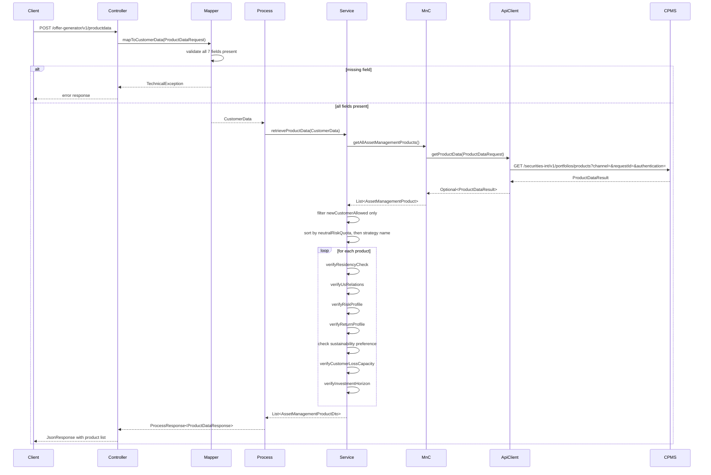

# Chain — OfferGeneratorProductDataController · POST /productdata

<!-- scaffold — phase 1 -->

- **Action point** — `OfferGeneratorProductDataController` (wpfe-am / ucc-offer-generator)
- **Kind** — rest-controller
- **Source** — `ucc-offer-generator/src/main/java/coba/wtp/wpfe/ucc/offer/generator/controller/OfferGeneratorProductDataController.java`
- **Handler** — `retrieveProductData(ProductDataRequest)` — `.../OfferGeneratorProductDataController.java:43`
- **Trigger** — `POST /offer-generator/v1/productdata`
- **Preconditions** — none observed (no @Valid on request body)
- **First hop** — `OfferGeneratorProductDataProcess.retrieveProductData()` (wpfe-am / ucc-offer-generator)

<!-- analysis — phase 2 -->

## Story

As a **retail customer in an advisory session**, I want the system to retrieve all asset management products available from CPMS, filter them to only those open to new customers, sort them by risk level, and verify each one against my suitability profile so that the advisor sees only the products I am eligible for.

- **Given** a product data request carrying the customer's residency status, US relations result, risk profile, return profile, sustainability preference, investment horizon, and loss capacity — all pre-computed by the frontend
- **When** `POST /offer-generator/v1/productdata` is called with that request body
- **Then** every asset management product from CPMS is fetched, filtered to new-customer-allowed only, sorted by neutral risk quota then strategy name, and each survivor is verified against seven suitability rules — residency, US relations, risk profile, return profile, sustainability preference, loss capacity, investment horizon
- **Unless** the customer data is missing required fields — rejected at the mapper before any CPMS call runs

## Chain

Branch 1 · primary
  OfferGeneratorProductDataController
  → CustomerDataMapper
  → OfferGeneratorProductDataProcessImpl
  → OfferGeneratorProductDataServiceImpl
  → AssetManagementProductMnCImpl
  → ProductDataApiClient
  ⇒ [external]  CPMS product data API (wpfe-shared / wpfe-shared-cpms)

- **Terminals reached** — `external` (CPMS product data API, via `ProductDataApi` in wpfe-shared / wpfe-shared-cpms)

## Diagrams

### Process flow — primary

```mermaid
flowchart LR
  A(["POST /offer-generator/v1/productdata"]) --> B[OfferGeneratorProductDataController]
  B --> C[CustomerDataMapper.mapToCustomerData]
  C --> D{all fields present?}
  D -- no --> E([TechnicalException — missing field])
  D -- yes --> F[OfferGeneratorProductDataProcessImpl.retrieveProductData]
  F --> G[OfferGeneratorProductDataServiceImpl.retrieveProductData]
  G --> H[AssetManagementProductMnCImpl.getAllAssetManagementProducts]
  H --> I[ProductDataApiClient.getProductData]
  I --> J([external/CPMS product data API])
  J --> K{products returned?}
  K -- no --> L([empty list])
  K -- yes --> M[Filter — newCustomerAllowed only]
  M --> N[Sort — neutralRiskQuota, then strategy name]
  N --> O[Verify each product against customer profile]
  O --> P{residency check?}
  P -- GREEN + onlyInternationalClients --> Q[flag deniedByTargetMarketOrResidency]
  P -- other --> R{US relations?}
  R -- GREEN + usPersonProduct --> S[flag deniedByUSRelations]
  R -- WARNING + not usPersonProduct --> S
  R -- other --> T{risk profile match?}
  T -- no --> U[flag deniedByTargetMarketOrResidency]
  T -- yes --> V{return profile match?}
  V -- no --> U
  V -- yes --> W{sustainability preference?}
  W -- true + !overallSustainabilityPreferences --> X[flag deniedBySustainabilityPreference]
  W -- other --> Y{loss capacity sufficient?}
  Y -- no --> Q
  Y -- yes --> Z{investment horizon match?}
  Z -- no --> Q
  Z -- yes --> AA([AssetManagementProductDto list])
```



### Sequence — primary



## Journey

When **the trigger fires**, the request enters at **[step 1]** to handle **parsing and delegating the REST call**. Once that completes, the flow moves to **[step 2]** because **the controller delegates all business logic to the process layer**. From there, **[step 3]** takes over to **validate and map the incoming request fields into a domain CustomerData object**, and so on through every hop until a terminal is reached or the response is assembled.

1. **OfferGeneratorProductDataController.retrieveProductData** (wpfe-am / ucc-offer-generator)

   **Source.** `ucc-offer-generator/src/main/java/coba/wtp/wpfe/ucc/offer/generator/controller/OfferGeneratorProductDataController.java:43`

   **Role.** REST entry point that extracts the request body, delegates to the process layer, and wraps the result in a JsonResponse.

   **Preconditions.** None observed — no `@Valid` annotation on the request body; validation is deferred to the mapper.

   **On failure.** No try-catch or error handling at this level — exceptions propagate as 500 responses from Spring MVC.

   **Effect.** Returns a `JsonResponse<ProductDataResponse>` wrapping the process result.

2. **CustomerDataMapper.mapToCustomerData** (wpfe-am / ucc-offer-generator)

   **Source.** `ucc-offer-generator/src/main/java/coba/wtp/wpfe/ucc/offer/generator/process/impl/CustomerDataMapper.java:17`

   **Role.** Validates that all seven customer profile fields are present in the request, then maps them into a strongly-typed `CustomerData` record.

   **Preconditions.** The `ProductDataRequest` from the controller must carry non-null values for every field.

   **On failure.** Throws `TechnicalException` with a descriptive message naming which field is missing — `usRelationsResult`, `residenceCheckResult`, `customerRiskProfile`, `customerReturnProfile`, `customerSustainabilityPreference`, `customerInvestmentHorizon`, or `customerLossCapacity`. The exception propagates up to the controller and becomes an HTTP 500.

   **Effect.** Produces a `CustomerData` record with typed fields: `UsRelationsResult`, `ResidencyCheckResult`, `Integer` risk/return profiles, `Boolean` sustainability preference, and `Integer` investment horizon and loss capacity.

3. **OfferGeneratorProductDataProcessImpl.retrieveProductData** (wpfe-am / ucc-offer-generator)

   **Source.** `ucc-offer-generator/src/main/java/coba/wtp/wpfe/ucc/offer/generator/process/impl/OfferGeneratorProductDataProcessImpl.java:29`

   **Role.** Orchestrates the product data retrieval: calls the service with customer data, then handles a null result by returning an empty list instead of propagating it.

   **On failure.** If `productDataService.retrieveProductData()` returns `null`, the process wraps it in a `ProcessResponse` carrying an empty list — so the caller never sees a null response.

   **Effect.** Returns `ProcessResponse<ProductDataResponse>` containing either the product list or an empty one.

4. **OfferGeneratorProductDataServiceImpl.retrieveProductData** (wpfe-am / ucc-offer-generator)

   **Source.** `ucc-offer-generator/src/main/java/coba/wtp/wpfe/ucc/offer/generator/service/impl/OfferGeneratorProductDataServiceImpl.java:50`

   **Role.** Assembles the eligible product list for one customer: fetches all products from CPMS via the MnC, filters to new-customer-allowed only, sorts by neutral risk quota then strategy name, then maps each product through seven suitability verifications against the customer's profile.

   **On failure.** If CPMS returns null or empty, the stream produces an empty list — not an error. Missing target market attributes (investment horizon, minimum financial loss capacity, minimum return profile, minimum risk profile) cause a `TechnicalException` with message "Missing cpms data".

   **Effect.** A sorted `List<AssetManagementProductDto>`, each carrying denial flags set by the verifications below.

   **Steps.**

   - **4.1 Fetch — all products from CPMS** · `OfferGeneratorProductDataServiceImpl.java:50`

     **Role.** Calls `assetManagementProductMnC.getAllAssetManagementProducts()` for the full product catalogue.

   - **4.2 Filter — products open to new customers** · `OfferGeneratorProductDataServiceImpl.java:51`

     **Role.** Drops every product whose `generalAttributes.newCustomerAllowed` is false, so a closed product is never offered even where the customer would otherwise qualify.

     **Effect.** Shrinks the candidate list; nothing is marked, the product is simply gone.

   - **4.3 Sort — by neutral risk quota, then strategy name** · `OfferGeneratorProductDataServiceImpl.java:52`

     **Role.** Orders the survivors lowest-risk first (nulls last); ties break alphabetically by strategy name, so the ordering the advisor sees is deterministic.

   - **4.4 Verify — residency** · `OfferGeneratorProductDataServiceImpl.java:107`

     **Source.** `ucc-offer-generator/src/main/java/coba/wtp/wpfe/ucc/offer/generator/service/impl/OfferGeneratorProductDataServiceImpl.java:107`

     **Role.** Sets `deniedByTargetMarketOrResidency` when the customer's residency is GREEN but the product restricts to international-only clients (`onlyInternationalClients = true`). A domestic customer cannot buy an international-only product.

     **Effect.** Sets a denial flag on the DTO; the product stays in the list, marked.

   - **4.5 Verify — US relations** · `OfferGeneratorProductDataServiceImpl.java:96`

     **Source.** `ucc-offer-generator/src/main/java/coba/wtp/wpfe/ucc/offer/generator/service/impl/OfferGeneratorProductDataServiceImpl.java:96`

     **Role.** Two rules:
       - If the customer is GREEN (no US relations) but the product is a US-person product (`usPersonProduct = true`), flag `deniedByUSRelations` — a non-US person cannot buy a US-restricted product.
       - If the customer has WARNING-level US relations but the product is NOT a US-person product (`usPersonProduct = false`), flag `deniedByUSRelations` — a US-related customer cannot buy a non-US product.

     **Effect.** Sets `deniedByUSRelations` on the DTO when either rule fires.

   - **4.6 Verify — risk profile** · `OfferGeneratorProductDataServiceImpl.java:85`

     **Source.** `ucc-offer-generator/src/main/java/coba/wtp/wpfe/ucc/offer/generator/service/impl/OfferGeneratorProductDataServiceImpl.java:85`

     **Role.** Reads the product's `minimumRiskProfile` from target market attributes. The customer's risk profile must fall within `[minimumRiskProfile, minimumRiskProfile + 2]`. If outside this band, flag `deniedByTargetMarketOrResidency`.

     **Effect.** A customer with a risk profile too low or too high for the product is denied.

   - **4.7 Verify — return profile** · `OfferGeneratorProductDataServiceImpl.java:76`

     **Source.** `ucc-offer-generator/src/main/java/coba/wtp/wpfe/ucc/offer/generator/service/impl/OfferGeneratorProductDataServiceImpl.java:76`

     **Role.** Reads the product's `minimumReturnProfile` from target market attributes. The customer's return profile must fall within `[minimumReturnProfile, minimumReturnProfile + 2]`. If outside this band, flag `deniedByTargetMarketOrResidency`.

     **Effect.** A customer with a return profile too low or too high for the product is denied.

   - **4.8 Verify — sustainability preference** · `OfferGeneratorProductDataServiceImpl.java:67`

     **Source.** `ucc-offer-generator/src/main/java/coba/wtp/wpfe/ucc/offer/generator/service/impl/OfferGeneratorProductDataServiceImpl.java:67`

     **Role.** If the customer has sustainability preference enabled (`customerSustainabilityPreference = true`) but the product does not support overall sustainability preferences (`overallSustainabilityPreferences = false`), flag `deniedBySustainabilityPreference`.

     **Effect.** Sets `deniedBySustainabilityPreference` on the DTO.

   - **4.9 Verify — loss capacity** · `OfferGeneratorProductDataServiceImpl.java:100`

     **Source.** `ucc-offer-generator/src/main/java/coba/wtp/wpfe/ucc/offer/generator/service/impl/OfferGeneratorProductDataServiceImpl.java:100`

     **Role.** Reads the product's `minimumFinancialLossCapacity` from target market attributes. If the customer's loss capacity is below this minimum, flag `deniedByTargetMarketOrResidency`.

     **Effect.** A customer who cannot absorb the required financial losses is denied.

   - **4.10 Verify — investment horizon** · `OfferGeneratorProductDataServiceImpl.java:89`

     **Source.** `ucc-offer-generator/src/main/java/coba/wtp/wpfe/ucc/offer/generator/service/impl/OfferGeneratorProductDataServiceImpl.java:89`

     **Role.** Reads the product's allowed investment horizons (a list of integers) from target market attributes. If the customer's investment horizon is not in this list, flag `deniedByTargetMarketOrResidency`.

     **Effect.** A customer whose time horizon does not match any allowed horizon for the product is denied.

5. **AssetManagementProductMnCImpl.getAllAssetManagementProducts** (wpfe-am / wpfe-am-commons)

   **Source.** `wpfe-am-commons/src/main/java/coba/wtp/wpfe/am/commons/mnc/impl/AssetManagementProductMnCImpl.java:42`

   **Role.** Map and Call layer: calls the CPMS ProductDataApi to fetch raw product data, logs how many products were returned (or that none were), then maps each `AssetManagementProduct` from the CPMS API model into the domain `AssetManagementProduct` object. Results are cached under "getAllAssetManagementProducts".

   **On failure.** If CPMS returns an empty result or null, the method returns an empty list — not an error. Missing target market attributes during mapping cause a `TechnicalException` with message "Missing cpms data".

   **Effect.** A `List<AssetManagementProduct>` in domain form, ready for filtering and verification.

6. **ProductDataApiClient.getProductData** (wpfe-shared / wpfe-shared-cpms)

   **Source.** `wpfe-shared/wpfe-shared-cpms/src/main/java/coba/wtp/wpfe/shared/cpms/api/productData/ProductDataApiClient.java:47`

   **Role.** HTTP client that sends a GET request to the CPMS product data endpoint with channel, requestId, and authentication headers. Returns an `Optional<ProductDataResult>`.

   **On failure.** Any exception during the REST call (network error, 5xx response) is caught and re-thrown as a `TechnicalException` — no retry, no fallback. The exception propagates up through MnC → Service → Process → Controller as an HTTP 500.

   **Effect.** An `Optional<ProductDataResult>` containing the raw product data from CPMS.

7. **CPMS Product Data API** (external)

   **Terminal — external**

   **Source.** `wpfe-shared/wpfe-shared-cpms/src/main/java/coba/wtp/wpfe/shared/cpms/api/productData/ProductDataApiClient.java:52`

   **Role.** The CPMS investment operations API endpoint that serves the full asset management product catalogue.

   **Effect.** Returns a `ProductDataResult` containing a list of `AssetManagementProduct` objects, each with general attributes (newCustomerAllowed, onlyInternationalClients, usPersonProduct, overallSustainabilityPreferences), target market attributes (minimumRiskProfile, minimumReturnProfile, investmentHorizon, minimumFinancialLossCapacity), and cost/sustainability details.

## Data reached

- **external — CPMS product data API, via `ProductDataApi` (wpfe-shared / wpfe-shared-cpms)**
  - Business problem solved — As the **offer generator service**, I need the full asset management product catalogue from CPMS to be able to filter and verify each product against the customer's suitability profile. Therefore we call this API at `GET /securities-int/v1/portfolios/products?channel={channel}&requestId={requestId}` to retrieve all products. Then we map, filter, sort, and verify them so we can return only the products the customer is eligible for — citing every file where that data actually gets used: `AssetManagementProductMnCImpl.java:42` (fetch), `OfferGeneratorProductDataServiceImpl.java:50-113` (filter/verify), `AssetManagementProductMapper.java:19` (map to DTO).

  - **Request path**
    ```json
    {
      "channel": "WEB",
      "requestId": "uuid-string"
    }
    ```
    `channel` — from `ApplicationContextProvider.getChannel()`, the current application channel.
    `requestId` — from `ApplicationContextProvider.getRequestId()`, a unique request identifier.

  - **Request body** — none (GET request).

  - **Response fields used**
    ```json
    {
      "productData": [
        {
          "id": "AM-001",
          "productLineStrategyId": "STRAT-001",
          "productLineStrategyName": "Conservative Growth",
          "generalAttributes": {
            "newCustomerAllowed": true,
            "onlyInternationalClients": false,
            "usPersonProduct": false,
            "overallSustainabilityPreferences": true
          },
          "targetMarketAttributes": {
            "minimumRiskProfile": 3,
            "minimumReturnProfile": 3,
            "investmentHorizon": ["1", "2", "3", "4", "5"],
            "minimumFinancialLossCapacity": 10000
          }
        }
      ]
    }
    ```
    `productData[].id` → unique product identifier (Journey step 6, mapped through MnC).
    `productData[].generalAttributes.newCustomerAllowed` → filter predicate (step 4.2).
    `productData[].generalAttributes.onlyInternationalClients` → residency verification (step 4.4).
    `productData[].generalAttributes.usPersonProduct` → US relations verification (step 4.5).
    `productData[].generalAttributes.overallSustainabilityPreferences` → sustainability preference check (step 4.8).
    `productData[].targetMarketAttributes.minimumRiskProfile` → risk profile band (step 4.6).
    `productData[].targetMarketAttributes.minimumReturnProfile` → return profile band (step 4.7).
    `productData[].targetMarketAttributes.investmentHorizon` → investment horizon match (step 4.10).
    `productData[].targetMarketAttributes.minimumFinancialLossCapacity` → loss capacity check (step 4.9).
    `productData[].generalAttributes.allocationStrategy.neutralRiskQuota` → sort key (step 4.3).

## Acceptance Criteria

1. **All seven customer fields present, CPMS returns products** — Given a request with all required fields (`usRelationsResult`, `residenceCheckResult`, `customerRiskProfile`, `customerReturnProfile`, `customerSustainabilityPreference`, `customerInvestmentHorizon`, `customerLossCapacity`) and non-null values, when the endpoint is called and CPMS returns product data, then the response contains a list of products filtered to new-customer-allowed only, sorted by neutral risk quota ascending then strategy name alphabetically, each with denial flags set according to the seven suitability verifications.
   - Evidence: `CustomerDataMapper.java:17` (validation), `OfferGeneratorProductDataServiceImpl.java:50-113` (filter/verify/sort)
   - How to: call the endpoint with a complete request body and assert on the response product list — verify filtering, sorting order, and denial flags.

2. **Missing customer field rejected** — Given a request where any of the seven fields is null, when the endpoint is called, then the mapper throws `TechnicalException` before any CPMS call runs, and the controller returns an HTTP 500.
   - Evidence: `CustomerDataMapper.java:23-67` (seven null checks)
   - How to: submit a request with one field omitted and confirm the response is a 500 with a TechnicalException naming that specific field.

3. **CPMS returns no products** — Given CPMS returns an empty product list or null, when the endpoint is called, then the process layer converts this to an empty `ProductDataResponse` (not null), and the client receives `{"productData": []}`.
   - Evidence: `OfferGeneratorProductDataProcessImpl.java:31-32`
   - How to: stub CPMS to return empty data and confirm the response body contains an empty product list, not a null reference.

4. **Residency denial** — Given a customer with `residenceCheckResult = GREEN` and a product where `onlyInternationalClients = true`, when the endpoint is called, then that product's DTO has `deniedByTargetMarketOrResidency = true`.
   - Evidence: `OfferGeneratorProductDataServiceImpl.java:107-110`
   - How to: submit with `residenceCheckResult=GREEN` and verify against a product flagged as international-only; assert the denial flag is set.

5. **US relations — green customer, US product** — Given a customer with `usRelationsResult = GREEN` and a product where `usPersonProduct = true`, when the endpoint is called, then that product's DTO has `deniedByUSRelations = true`.
   - Evidence: `OfferGeneratorProductDataServiceImpl.java:96-98`
   - How to: submit with `usRelationsResult=GREEN` and verify against a US-person product; assert the denial flag is set.

6. **US relations — warning customer, non-US product** — Given a customer with `usRelationsResult = WARNING` and a product where `usPersonProduct = false`, when the endpoint is called, then that product's DTO has `deniedByUSRelations = true`.
   - Evidence: `OfferGeneratorProductDataServiceImpl.java:100-102`
   - How to: submit with `usRelationsResult=WARNING` and verify against a non-US-person product; assert the denial flag is set.

7. **Risk profile out of band** — Given a customer whose `customerRiskProfile` falls outside `[minimumRiskProfile, minimumRiskProfile + 2]` for a product, when the endpoint is called, then that product's DTO has `deniedByTargetMarketOrResidency = true`.
   - Evidence: `OfferGeneratorProductDataServiceImpl.java:85-88`
   - How to: submit with a risk profile value outside the allowed band and assert the denial flag.

8. **Return profile out of band** — Given a customer whose `customerReturnProfile` falls outside `[minimumReturnProfile, minimumReturnProfile + 2]` for a product, when the endpoint is called, then that product's DTO has `deniedByTargetMarketOrResidency = true`.
   - Evidence: `OfferGeneratorProductDataServiceImpl.java:76-79`
   - How to: submit with a return profile value outside the allowed band and assert the denial flag.

9. **Sustainability preference mismatch** — Given a customer with `customerSustainabilityPreference = true` and a product where `overallSustainabilityPreferences = false`, when the endpoint is called, then that product's DTO has `deniedBySustainabilityPreference = true`.
   - Evidence: `OfferGeneratorProductDataServiceImpl.java:67-69`
   - How to: submit with sustainability preference enabled and verify against a non-sustainable product; assert the denial flag.

10. **Loss capacity below minimum** — Given a customer whose `customerLossCapacity` is less than the product's `minimumFinancialLossCapacity`, when the endpoint is called, then that product's DTO has `deniedByTargetMarketOrResidency = true`.
    - Evidence: `OfferGeneratorProductDataServiceImpl.java:100-103`
    - How to: submit with a low loss capacity and verify against a high-threshold product; assert the denial flag.

11. **Investment horizon mismatch** — Given a customer whose `customerInvestmentHorizon` is not in the product's allowed investment horizon list, when the endpoint is called, then that product's DTO has `deniedByTargetMarketOrResidency = true`.
    - Evidence: `OfferGeneratorProductDataServiceImpl.java:89-94`
    - How to: submit with an investment horizon value not in the product's allowed list and assert the denial flag.

12. **CPMS outage aborts the call** — Given `ProductDataApiClient.getProductData` throws a `TechnicalException` (network error or 5xx), when the endpoint is called, then the request fails with no fallback and no retry, propagating as an HTTP 500.
    - Evidence: `ProductDataApiClient.java:62-67` — on-failure: fatal, re-thrown as TechnicalException
    - How to: stub the CPMS endpoint to return 500 or disconnect and confirm the offer-generator call surfaces a 500 with no retry.

## Business Takeaways

**Restatement only.** Every line here cites a fact already established earlier in this same file. No source file is opened for this section.

- **What this does for the business** — retrieves the full asset management product catalogue from CPMS, filters it to products open to new customers, sorts by risk level, and verifies each product against seven customer suitability rules (residency, US relations, risk profile, return profile, sustainability preference, loss capacity, investment horizon) so that only eligible products are presented to the advisor.
- **Depends on** — CPMS product data API (external, full product catalogue with general attributes and target market constraints)
- **Ingredients** — `usRelationsResult`, `residenceCheckResult`, `customerRiskProfile`, `customerReturnProfile`, `customerSustainabilityPreference`, `customerInvestmentHorizon`, `customerLossCapacity` (all from request body, pre-computed by the frontend)
- **Preparation** — validate all seven fields present, reject with TechnicalException if any is missing; otherwise fetch products from CPMS
- **Dish** — `List<AssetManagementProductDto>` sorted by risk quota, each carrying denial flags (`deniedByTargetMarketOrResidency`, `deniedByUSRelations`, `deniedBySustainabilityPreference`) or included unflagged if eligible
---

