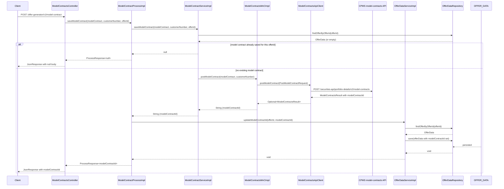

# Chain — ModelContractsController · POST /model-contract

<!-- scaffold — phase 1 -->

- **Action point** — `ModelContractsController` (wpfe-am / ucc-offer-generator)
- **Kind** — rest-controller
- **Source** — `ucc-offer-generator/src/main/java/coba/wtp/wpfe/ucc/offer/generator/controller/ModelContractsController.java`
- **Handler** — `saveModelContract(SaveModelContractRequest)` — `.../ModelContractsController.java:91`
- **Trigger** — `POST /offer-generator/v1/model-contract`
- **Preconditions** — `@Valid` on request body; no explicit security annotation observed
- **First hop** — `ModelContractProcess.saveModelContract()` (wpfe-am / ucc-offer-generator)

<!-- analysis — phase 2 -->

## Story

As an **advisor completing an offer generation**, I want the user's chosen model contract saved to CPMS and linked back to the local offer so that the contract persists in the portfolio system and the offer record reflects the save.

- **Given** a valid `SaveModelContractRequest` carrying a fully assembled `ModelContract`, a `customerNumber`, and an `offerId`
- **When** `POST /offer-generator/v1/model-contract` is called with that request body
- **Then** the contract is posted to CPMS (if not already saved for this offer), the returned CPMS ID is stored in `OFFER_DATA`, and the response carries the model contract ID back to the caller
- **Unless** a model contract was previously saved for this `offerId` — the call is skipped, `null` is returned, and no CPMS request is made

## Chain

Branch 1 · primary
  ModelContractsController.saveModelContract(JsonRequest<SaveModelContractRequest>)
  → ModelContractProcessImpl.saveModelContract(ModelContract, String, Long)
  → ModelContractServiceImpl.saveModelContract(ModelContract, String, Long)
  ⇒ [db]  OFFER_DATA (via OfferDataRepository.findOfferByOfferId)

Branch 2 · diverges at ModelContractServiceImpl.saveModelContract
  → ModelContractsMnCImpl.postModelContract(ModelContract, String)
  → ModelContractsApi.postModelContract(PostModelContractRequest)
  ⇒ [external]  CPMS model-contracts API (via ModelContractsApiClient)

Branch 3 · diverges at ModelContractProcessImpl.saveModelContract
  → OfferDataServiceImpl.updateModelContractId(Long, String)
  → OfferDataRepository.findOfferByOfferId(Long)
  ⇒ [db]  OFFER_DATA (via OfferDataRepository)

- **Terminals reached** — `external` (CPMS model-contracts API, via `wpfe-shared / wpfe-shared-cpms`), `db` (`OFFER_DATA`, via `OfferDataRepository` in wpfe-am / ucc-offer-generator)

## Diagrams

### Process flow — primary

```mermaid
flowchart LR
  A([POST /offer-generator/v1/model-contract]) --> B[ModelContractsController]
  B --> C[ModelContractProcessImpl.saveModelContract]
  C --> D{Already saved for offerId?}
  D -- no --> E[ModelContractServiceImpl.saveModelContract]
  D -- yes, already saved --> F([null — skip CPMS])
  E --> G{CPMS call succeeds?}
  G -- no --> H([exception propagated])
  G -- yes --> I[ModelContractsMnCImpl.postModelContract]
  I --> J[ModelContractsApi.postModelContract]
  J --> K([external/CPMS model-contracts API])
  K --> L(Model contract ID from CPMS)
  L --> M[OfferDataServiceImpl.updateModelContractId]
  M --> N[OfferDataRepository.findOfferByOfferId]
  N --> O[(OFFER_DATA)]
  O --> P([modelContractId response])
```



### Sequence — primary



## Journey

When the **POST /offer-generator/v1/model-contract** trigger fires, the request enters at step 1 to save a user-selected model contract into CPMS and link it back to the local offer record. Once that completes, the flow moves to step 2 because the process layer orchestrates the service call and the subsequent persistence of the returned ID.

Below is each step in call order — what it does, why it exists, how it handles failure, and what passes the baton forward.

1. **ModelContractsController.saveModelContract** (wpfe-am / ucc-offer-generator)

   **Source.** `ucc-offer-generator/src/main/java/coba/wtp/wpfe/ucc/offer/generator/controller/ModelContractsController.java:91`

   **Role.** Receives the POST request carrying a `JsonRequest<SaveModelContractRequest>`, extracts the model contract, customer number, and offer ID from the request body, delegates to the process layer, and wraps the result in a `JsonResponse`.

   **Preconditions.** `@Valid` on the request body (Jakarta validation). No explicit security annotation on this handler — authorization is enforced downstream at the process layer via `@PreAuthorize`.

   **Effect.** Delegates to `modelContractProcess.saveModelContract()` and returns a `JsonResponse<ProcessResponse<String>>` wrapping whatever the process returns.

2. **ModelContractProcessImpl.saveModelContract** (wpfe-am / ucc-offer-generator)

   **Source.** `ucc-offer-generator/src/main/java/coba/wtp/wpfe/ucc/offer/generator/process/impl/ModelContractProcessImpl.java:108`

   **Role.** Orchestrates the save flow: enforces write authorization, calls the service to persist the contract in CPMS, and if a non-null ID is returned, links it back to the local `OfferData` record.

   **Preconditions.** `@PreAuthorize("protectWith('WPFE_AM_OG_WRITE', {'internalCustomerNumber': #customerNumber})")` — the caller must hold the `WPFE_AM_OG_WRITE` permission scoped to the customer number. If authorization fails, Spring Security rejects the request before any service call.

   **On failure.** Authorization failure is handled by Spring Security (403 Forbidden). No retry or fallback logic in this layer.

   **Steps.**

   - **2.1 Call service to save model contract** · `ModelContractProcessImpl.java:110`

     **Role.** Invokes `modelContractService.saveModelContract(modelContract, customerNumber, offerId)` and captures the returned CPMS-generated ID.

   - **2.2 Check — was a contract saved?** · `ModelContractProcessImpl.java:111`

     **Role.** Tests whether the service returned a non-null `modelContractId`. If null, it means the contract was already saved for this offer (idempotency guard) and no further action is needed.

   - **2.3 Link — persist CPMS ID to OfferData** · `ModelContractProcessImpl.java:112`

     **Role.** Calls `offerDataService.updateModelContractId(offerId, modelContractId)` so the local offer record carries the CPMS contract ID for future lookups.

   **Downstream.** A `ProcessResponse<String>` carrying either the new model contract ID or null.

3. **ModelContractServiceImpl.saveModelContract** (wpfe-am / ucc-offer-generator)

   **Source.** `ucc-offer-generator/src/main/java/coba/wtp/wpfe/ucc/offer/generator/service/impl/ModelContractServiceImpl.java:147`

   **Role.** Implements the core save logic with an idempotency guard: checks whether a model contract was previously saved for this offer, and if not, posts it to CPMS.

   **Steps.**

   - **3.1 Check — already saved?** · `ModelContractServiceImpl.java:149`

     **Role.** Queries `offerDataService.findOfferDataOfferId(offerId)` to see whether an `OfferData` record exists for this offer and carries a non-null `modelContractId`. If so, the contract was previously saved — log an info message and return null.

     **Effect.** Skips the CPMS call entirely when the contract is already persisted. Prevents duplicate model contracts in CPMS for the same offer.

   - **3.2 Post to CPMS** · `ModelContractServiceImpl.java:154`

     **Role.** Calls `modelContractsMnC.postModelContract(modelContract, customerNumber)` when no prior contract exists. This is where the actual HTTP call to CPMS happens.

     **On failure.** The MnC layer throws an `IllegalStateException` if CPMS returns no model contract ID in its response (see step 5). Any other exception from the API client propagates up as a technical exception.

   **Downstream.** Either null (already saved) or a String — the CPMS-generated model contract ID.

4. **ModelContractsMnCImpl.postModelContract** (wpfe-shared / wpfe-shared-cpms)

   **Source.** `wpfe-shared/wpfe-shared-cpms/src/main/java/coba/wtp/wpfe/shared/cpms/mnc/impl/ModelContractsMnCImpl.java:137`

   **Role.** Maps the domain `ModelContract` object into a CPMS-specific `ModelContractCreationBody`, including all properties (target market, fees, sustainability categories, etc.) and module proportions, then delegates to the API client.

   **Steps.**

   - **4.1 Map — contract name** · `ModelContractsMnCImpl.java:150`

     **Role.** Constructs a contract name from customer number, product line mandate name, offensive assets share, and current timestamp (e.g., `123456789-VVFlex-0.30-2025-01-15T10:30:00`).

   - **4.2 Map — module proportions** · `ModelContractsMnCImpl.java:154`

     **Role.** Converts each `ModelContractProportion` into a `ModelContractCreationBodyProportions`, mapping the moduleId to a UUID and converting currentValue (BigDecimal) to float.

   - **4.3 Map — contract properties** · `ModelContractsMnCImpl.java:162`

     **Role.** Transforms all model contract properties through dedicated mappers: allowed customer channels, product line strategy, pension/stock/alternate strategies, offensive module share, investment goal, investment horizon, knowledge/experience level, sales strategy, loss capacity, fee model and rates (asset management, currency conversion, custody, external service, initial cost, minimum fee, etc.), sustainability categories (A/B/C), technical minimum payout amount. Null properties are filtered out before sending.

   - **4.4 Call API client** · `ModelContractsMnCImpl.java:139`

     **Role.** Wraps the creation body in a `PostModelContractRequest` and calls `modelContractsApi.postModelContract(request)`. Extracts the first model contract's ID from the result.

     **On failure.** If CPMS returns no model contracts in its response, throws `IllegalStateException("No model contract returned after creation.")` — a fatal error with no retry.

5. **ModelContractsApiClient.postModelContract** (wpfe-shared / wpfe-shared-cpms)

   **Source.** `wpfe-shared/wpfe-shared-cpms/src/main/java/coba/wtp/wpfe/shared/cpms/api/modelcontracts/ModelContractsApiClient.java:93`

   **Role.** Executes the HTTP POST to CPMS using RestTemplate, building headers from the application context (channel and request ID), and returning the response body wrapped in Optional.

   **Source.** `wpfe-shared/wpfe-shared-cpms/src/main/java/coba/wtp/wpfe/shared/cpms/api/modelcontracts/ModelContractsApiClient.java:93-108`

   **On failure.** Catches any exception from RestTemplate and throws a technical exception via `TechnicalExceptionFactory.createAndLogTechnicalException` — fatal, no retry. The error message includes the path template.

   **Terminal — external**

   - HTTP method: POST
   - Path template: `/securities-api/portfolio-details/v2/model-contracts`
   - Base URL: resolved from `baseurl` (or `cpmsDirectUrl` if set) on the abstract REST client
   - Request body: `PostModelContractRequest` containing a `ModelContractCreationBody` with name, currency (EUR), proportions list, and properties list
   - Response: `Optional<ModelContractsResult>` carrying the created model contract data including its CPMS-generated ID

6. **OfferDataServiceImpl.updateModelContractId** (wpfe-am / ucc-offer-generator)

   **Source.** `ucc-offer-generator/src/main/java/coba/wtp/wpfe/ucc/offer/generator/service/impl/OfferDataServiceImpl.java:130`

   **Role.** Finds the `OfferData` record for the given offer ID, sets its `modelContractId` field to the CPMS-generated ID, and saves it back. This links the local offer to the persisted contract in CPMS.

   **On failure.** If no `OfferData` exists for the given `offerId`, throws a technical exception — this should not happen because the idempotency check at step 3.1 already confirmed the record exists.

7. **OfferDataRepository.findOfferByOfferId** (wpfe-am / ucc-offer-generator)

   **Source.** `ucc-offer-generator/src/main/java/coba/wtp/wpfe/ucc/offer/generator/repository/OfferDataRepository.java:53`

   **Role.** JPA repository query that loads an `OfferData` entity by its primary key (`id = :offerId`). Called twice in this chain: once for the idempotency check (step 3.1) and once to load the record before updating it (step 6).

   **Terminal — db**

   - Table: `OFFER_DATA`
   - Query: `SELECT od FROM OfferData od WHERE od.id = :offerId`
   - Used fields: `id` (primary key, for lookup), `modelContractId` (for the idempotency check and update)

## Data reached

- **external — CPMS model-contracts API, via `ModelContractsApiClient` (wpfe-shared / wpfe-shared-cpms)**
  - Business problem solved — As the **offer generator**, I need to persist the user's chosen model contract in CPMS so that it becomes part of the customer's portfolio data and is visible across all CPMS downstream systems. Therefore we call this API at `POST /securities-api/portfolio-details/v2/model-contracts` to create a new model contract record. Then we read only the `modelContractId` from the response, so we can link it back to our local offer (`ModelContractsMnCImpl.java:143`).

  - **Request path** — POST `/securities-api/portfolio-details/v2/model-contracts`

  - **Request body**
    ```json
    {
      "name": "123456789-VVFlex-0.30-2025-01-15T10:30:00",
      "currency": "EUR",
      "proportions": [
        { "moduleId": "a1b2c3d4-e5f6-7890-abcd-ef1234567890", "value": 0.6 },
        { "moduleId": "b2c3d4e5-f6a7-8901-bcde-f12345678901", "value": 0.4 }
      ],
      "properties": [
        { "definitionId": "coba-asset-management-product-line-strategy", "value": "STRATEGY_001" },
        { "definitionId": "coba-target-markets-investment-goal", "value": 2.0 },
        { "definitionId": "coba-profile-costs-fee-model-name", "value": "STANDARD_FEE" }
      ]
    }
    ```
    `name` — constructed from customerNumber, productLineMandateName, offensiveAssetsShare, and current timestamp (`ModelContractsMnCImpl.java:150`).
    `currency` — hardcoded to EUR (`ModelContractsMnCImpl.java:49`).
    `proportions[].moduleId` — UUID parsed from the model contract's proportion moduleId (`ModelContractsMnCImpl.java:156`).
    `proportions[].value` — float conversion of the BigDecimal currentValue (`ModelContractsMnCImpl.java:158`).
    `properties[]` — all non-null properties from ModelContractProperties, each with a definitionId and value mapped through dedicated mappers (`ModelContractsMnCImpl.java:162-230`).

  - **Response fields used**
    ```json
    {
      "modelContracts": [
        { "modelContractId": "CPMS-MC-98765" }
      ]
    }
    ```
    `modelContracts[].modelContractId` → the CPMS-generated ID returned to the caller (Journey step 5). Example value inferred from the DTO definition at `ModelContract.java:line` in wpfe-shared-cpms.

  - **Response fields discarded** — all other fields on `ModelContractsResult` and nested `ModelContract` objects beyond `modelContractId`, since only the ID is extracted (`ModelContractsMnCImpl.java:143`).

- **db — OFFER_DATA, via `OfferDataRepository.findOfferByOfferId()` (wpfe-am / ucc-offer-generator)**
  - Business problem solved — As the **offer generator save flow**, I need to check whether a model contract was previously saved for this offer and later persist the new CPMS ID back. Therefore we query `OFFER_DATA` via `findOfferByOfferId(offerId)` for the offer's record, so we can gate the CPMS call on whether one already exists (`ModelContractServiceImpl.java:149`) and update it with the returned contract ID (`OfferDataServiceImpl.java:130`).

  - **Query** — `SELECT od FROM OfferData od WHERE od.id = :offerId` — read for idempotency check, then write to persist the modelContractId.

  - **Argument**
    ```json
    {
      "offerId": 42
    }
    ```
    `offerId` ← request body, from `SaveModelContractRequest.offerId`, origin: the caller (frontend) that initiated the offer generation flow.

  - **Response fields used** — `id` (primary key for lookup), `modelContractId` (checked for null to determine idempotency; set to the new CPMS ID on update). Example value inferred from entity definition at `OfferData.java:24` (`@Table(name = "OFFER_DATA")`).

  - **Response fields discarded** — all other columns on OFFER_DATA (investmentVolume, quotaOffensiveInvestment, productLine, riskReturnProfile, moduleProportions, etc.) are not accessed in this chain.

## Acceptance Criteria

1. **New model contract saved to CPMS and linked to offer** — Given a valid request with an `offerId` that has no existing `modelContractId`, when the endpoint is called and authorization passes, then CPMS receives a POST with the full contract data (name, proportions, properties), returns a new ID, and the local `OFFER_DATA` record is updated with that ID.
   - Evidence: `ModelContractsController.java:91-97`, `ModelContractProcessImpl.java:108-115`, `ModelContractServiceImpl.java:147-156`, `ModelContractsMnCImpl.java:137-145`
   - How to: call the endpoint with a fresh offerId and assert that CPMS receives exactly one POST request; confirm from a DB query that OFFER_DATA.modelContractId is now set.

2. **Already-saved contract returns null without calling CPMS** — Given an `offerId` whose OfferData record already carries a non-null modelContractId, when the endpoint is called, then no CPMS POST is made and the response body is null.
   - Evidence: `ModelContractServiceImpl.java:149-152`
   - How to: pre-populate OFFER_DATA with a modelContractId for a given offerId; call the endpoint and confirm from logs that "ModelContract already saved" appears and no HTTP POST reaches CPMS.

3. **Authorization enforced before any service call** — Given a caller without `WPFE_AM_OG_WRITE` permission, when the endpoint is called, then Spring Security rejects the request with 403 Forbidden before ModelContractService.saveModelContract is invoked.
   - Evidence: `ModelContractProcessImpl.java:108` (`@PreAuthorize("protectWith('WPFE_AM_OG_WRITE', {'internalCustomerNumber': #customerNumber})")`).
   - How to: call the endpoint with a valid request body but without the required permission; confirm 403 response and that no CPMS or DB calls are made.

4. **CPMS failure propagates as technical exception** — Given that the CPMS POST returns an empty result (no model contracts in response), when the MnC layer processes it, then an `IllegalStateException` is thrown with message "No model contract returned after creation." and no OfferData update occurs.
   - Evidence: `ModelContractsMnCImpl.java:143-145`
   - How to: stub CPMS to return a ModelContractsResult with an empty modelContracts list; confirm the exception is thrown and OFFER_DATA is not updated.

5. **Missing OfferData record throws technical exception** — Given that `updateModelContractId` is called for an offerId where no OfferData row exists, when it runs, then a TechnicalException is thrown with message "No OfferData found for offerId ..." and the transaction rolls back.
   - Evidence: `OfferDataServiceImpl.java:130-132`
   - How to: call the endpoint with an offerId that has no OFFER_DATA row; confirm 500 response and no CPMS POST (this case should not occur in normal flow since step 3.1 already verified existence).

## Business Takeaways

**Restatement only.** Every line here cites a fact already established earlier in this same file.

- **What this does for the business** — persists the user's selected model contract into CPMS (the central portfolio system), ensuring it is visible across all downstream CPMS consumers, and links it back to the local offer record so future queries can find which CPMS contract belongs to which offer.
- **Depends on** — CPMS model-contracts API (external POST endpoint for creating contracts); OFFER_DATA table (read for idempotency check, write to persist the returned ID)
- **Ingredients** — `modelContract` (fully assembled with proportions and properties), `customerNumber` (for contract naming and authorization scope), `offerId` (local offer reference)
- **Preparation** — validate request body, enforce WPFE_AM_OG_WRITE authorization on the customer number
- **Dish** — model contract ID from CPMS (or null if already saved), persisted in OFFER_DATA.modelContractId

