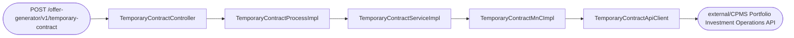
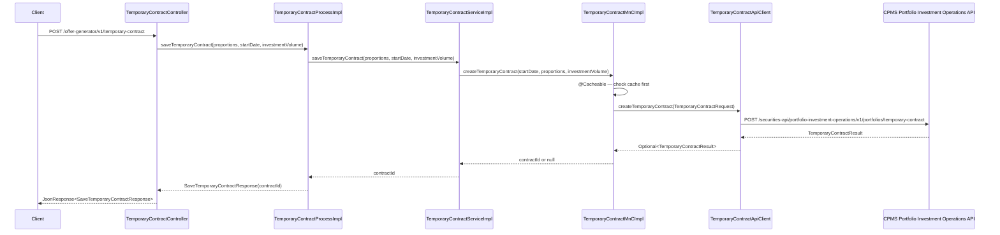

# Chain — TemporaryContractController · POST /temporary-contract

<!-- scaffold — phase 1 -->

- **Action point** — `TemporaryContractController` (wpfe-am / ucc-offer-generator)
- **Kind** — rest-controller
- **Source** — `ucc-offer-generator/src/main/java/coba/wtp/wpfe/ucc/offer/generator/controller/TemporaryContractController.java`
- **Handler** — `saveTemporaryContract(SaveTemporaryContractRequest)` — `.../TemporaryContractController.java:40`
- **Trigger** — `POST /offer-generator/v1/temporary-contract`
- **Preconditions** — `@Valid` on request body; no explicit security annotation observed
- **First hop** — `TemporaryContractProcess.saveTemporaryContract()` (wpfe-am / ucc-offer-generator)

<!-- analysis — phase 2 -->

## Story

As a **retail customer completing an offer generation flow**, I want my temporary contract saved to CPMS so that the system can later retrieve historical performance data for the selected modules.

- **Given** a set of module proportions, a start date, and an investment volume from the customer's selection
- **When** `POST /offer-generator/v1/temporary-contract` is called with those values
- **Then** CPMS creates a temporary contract and returns its ID for subsequent lookups
- **Unless** the API call fails — in which case the error propagates to the caller without retry or fallback

## Chain

```text
Branch 1 · primary
  TemporaryContractController
  → TemporaryContractProcessImpl
  → TemporaryContractServiceImpl
  → TemporaryContractMnCImpl
  → TemporaryContractApiClient
  ⇒ [external]  CPMS Portfolio Investment Operations API (wpfe-shared / wpfe-shared-cpms)
```

- **Terminals reached** — `external` (CPMS Portfolio Investment Operations API, via `TemporaryContractApiClient` in wpfe-shared / wpfe-shared-cpms)

## Diagrams

### Process flow — primary



### Sequence — primary



## Journey

When **the trigger fires** (a customer submits their module selection at the end of the offer generation flow), the request enters at **[step 1]** to handle **saving a temporary contract to CPMS**. Once that completes, the flow moves to **[step 2]** because **the process layer orchestrates the business operation**, and so on through every hop until the external API call returns.

Below is each step in call order — what it does, why it exists, how it handles failure, and what passes the baton forward.

1. **TemporaryContractController.saveTemporaryContract** (wpfe-am / ucc-offer-generator)

   **Source.** `ucc-offer-generator/src/main/java/coba/wtp/wpfe/ucc/offer/generator/controller/TemporaryContractController.java:40`

   **Role.** Receives the customer's temporary contract submission — a set of module proportions, a start date, and an investment volume — wraps it in a `ProcessResponse`, and delegates to the process layer.

   **Preconditions.** `@Valid` on the request body; no explicit security annotation observed. The request is wrapped in `JsonRequest<SaveTemporaryContractRequest>` by the shared frontend framework.

   **Effect.** Returns a `JsonResponse<SaveTemporaryContractResponse>` containing the contract ID assigned by CPMS.

   **Downstream.** `TemporaryContractProcess.saveTemporaryContract()`

2. **TemporaryContractProcessImpl.saveTemporaryContract** (wpfe-am / ucc-offer-generator)

   **Source.** `ucc-offer-generator/src/main/java/coba/wtp/wpfe/ucc/offer/generator/process/impl/TemporaryContractProcessImpl.java:30`

   **Role.** Extracts the three fields (`proportions`, `startDate`, `investmentVolume`) from the request DTO and delegates to the service layer. Acts as a thin orchestration step between controller and service.

   **Downstream.** `TemporaryContractService.saveTemporaryContract(proportions, startDate, investmentVolume)`

3. **TemporaryContractServiceImpl.saveTemporaryContract** (wpfe-am / ucc-offer-generator)

   **Source.** `ucc-offer-generator/src/main/java/coba/wtp/wpfe/ucc/offer/generator/service/impl/TemporaryContractServiceImpl.java:28`

   **Role.** Delegates to the MnC layer, which maps the parameters into CPMS API model objects and calls out. The service itself performs no business logic beyond this delegation.

   **Downstream.** `TemporaryContractMnC.createTemporaryContract(startDate, proportions, investmentVolume)`

4. **TemporaryContractMnCImpl.createTemporaryContract** (wpfe-shared / wpfe-shared-cpms)

   **Source.** `wpfe-shared/wpfe-shared-cpms/src/main/java/coba/wtp/wpfe/shared/cpms/mnc/impl/TemporaryContractMnCImpl.java:38`

   **Role.** Maps the caller's parameters into CPMS API model objects — converts each module proportion entry into a `TemporaryContractModule` (moduleId + proportion), wraps the investment volume in a `TemporaryContractInvestmentValue`, and assembles them into a `TemporaryContractRequest`. Then calls out through the API client.

   **Steps.**

   - **4.1 Map — proportions to module list** · `TemporaryContractMnCImpl.java:40`

     **Role.** Iterates over the input `Map<String, BigDecimal>` and creates a `List<TemporaryContractModule>`, each carrying one technical module ID and its proportion value.

   - **4.2 Map — investment volume to investment value** · `TemporaryContractMnCImpl.java:43`

     **Role.** Wraps the `BigDecimal` investment volume in a `TemporaryContractInvestmentValue`. If the amount is null, passes null through so CPMS can handle the absence.

   - **4.3 Assemble — build the request** · `TemporaryContractMnCImpl.java:45`

     **Role.** Constructs a `TemporaryContractRequest` with the start date (`when`), module list, and investment value, then calls through to the API client.

   **On failure.** The cache miss path proceeds directly to the API call; no retry or fallback is applied. If the API call throws an exception (see step 5), it propagates up unchanged.

   **Effect.** `@Cacheable` annotation on this method means repeated calls with identical parameters (`when`, proportions, portfolioAmount) are served from Redis cache instead of hitting CPMS again. Cache key is generated by `generateCreateTemporaryContractCacheKey()` which serializes all three parameters into a deterministic string.

   **Downstream.** `TemporaryContractApi.createTemporaryContract(TemporaryContractRequest)`

5. **TemporaryContractApiClient.createTemporaryContract** (wpfe-shared / wpfe-shared-cpms)

   **Source.** `wpfe-shared/wpfe-shared-cpms/src/main/java/coba/wtp/wpfe/shared/cpms/api/temporaryContract/TemporaryContractApiClient.java:42`

   **Role.** Sends an HTTP POST to the CPMS Portfolio Investment Operations API with the assembled request body, then extracts the response body into an `Optional<TemporaryContractResult>`.

   **On failure.** Three distinct error paths:

   - **HttpClientErrorException** (4xx) — logged and re-thrown as-is. No retry.
   - **HttpServerErrorException** (5xx) — logged and re-thrown as-is. No retry.
   - **Any other Exception** — wrapped in a `TechnicalException` via `TechnicalExceptionFactory.createAndLogTechnicalException()` and thrown.

   **Effect.** Returns `Optional<TemporaryContractResult>` containing the result body, or empty if the response body was null.

   **Downstream.** External CPMS API call at `POST /securities-api/portfolio-investment-operations/v1/portfolios/temporary-contract`

6. **Terminal — external** (CPMS Portfolio Investment Operations API)

   **Source.** `InvestmentOperationsApiAbstractRestClient.java:PORTFOLIOS_PATH + TEMPORARY_CONTRACT_PATH` → `/portfolios/temporary-contract`, prefixed with `SECURITIES_API_PATH` (`/securities-api/portfolio-investment-operations/v1`) and the configured `cpmsDirectUrl`.

   **Role.** CPMS receives the temporary contract creation request, persists it, and returns a result containing the assigned contract ID.

   **Effect.** The response body's `temporaryContractId` is extracted by the MnC (step 4) and returned up through the chain as the final answer.

## Data reached

- **external — CPMS Portfolio Investment Operations API, via `TemporaryContractApiClient` (wpfe-shared / wpfe-shared-cpms)**
  - Business problem solved — As the **offer generator**, I need a temporary contract created in CPMS to be able to later retrieve historical performance data for the customer's selected module configuration. Therefore we call this API at `POST /securities-api/portfolio-investment-operations/v1/portfolios/temporary-contract` to create the contract with the customer's proportions and investment volume. Then we extract only `temporaryContractId` from the response so we can return it to the caller for subsequent lookups (`TemporaryContractMnCImpl.java:47`).

  - **Request path** — `/securities-api/portfolio-investment-operations/v1/portfolios/temporary-contract`

  - **Request body**
    ```json
    {
      "when": "2025-06-15",
      "modules": [
        { "moduleId": "MOD001", "proportion": 0.6 },
        { "moduleId": "MOD002", "proportion": 0.4 }
      ],
      "investmentValue": {
        "amount": 50000
      }
    }
    ```
    `when` — start date of the contract, origin: request body field `startDate`, format YYYY-MM-DD.
    `modules` — list of module proportions, origin: request body field `proportions`, keys are technical module IDs, values are BigDecimal weights in range 0 to 1.
    `investmentValue.amount` — total investment volume, origin: request body field `investmentVolume`, a `BigDecimal`.

  - **Response fields used**
    ```json
    {
      "temporaryContractId": "TC-2025-ABC123"
    }
    ```
    `temporaryContractId` → returned to the caller as the contract ID (Journey step 4, line 47). Example value inferred from DTO definition at `TemporaryContractResult.java:UNKNOWN`.

  - **Response fields discarded** — **UNKNOWN** — the traced code calls only `getTemporaryContractId()` on the result; which other columns exist in `TemporaryContractResult` is not confirmed (the class is generated from an OpenAPI spec and not present as a source file in this workspace).

## Acceptance Criteria

1. **Valid request creates a temporary contract in CPMS** — Given a valid request with module proportions summing to 100%, a start date, and an investment volume, when `POST /offer-generator/v1/temporary-contract` is called, then CPMS creates the contract and returns its ID wrapped in `SaveTemporaryContractResponse(contractId)`.
   - Evidence: `TemporaryContractController.java:40-43`, `TemporaryContractMnCImpl.java:47`
   - How to: read the full chain from controller through MnC to API client; confirm the request body is assembled correctly and the response ID is extracted. To reproduce: call the endpoint with a valid proportions map, start date, and investment volume, then assert on the `contractId` in the response.

2. **Null investment volume is passed through** — Given a request where `investmentVolume` is null, when the chain executes, then CPMS receives `null` for the `investmentValue` field rather than a zero or omitted value.
   - Evidence: `TemporaryContractMnCImpl.java:43-44`
   - How to: at line 43–44, read the ternary that checks `portfolioAmount != null`; when false it passes `null` directly. To reproduce: call with `investmentVolume: null` and confirm the CPMS request body contains `"investmentValue": null`.

3. **Proportions are sorted for cache key stability** — Given a map of proportions, when the MnC generates its cache key, then entries are sorted by module ID before serialization so that equivalent maps produce identical keys regardless of insertion order.
   - Evidence: `TemporaryContractMnCImpl.java:62`
   - How to: at line 62, read `.sorted(Map.Entry.comparingByKey())` in the `serializeProportions()` method. To reproduce: call with two different map insertions containing the same key-value pairs and confirm the cache hit occurs.

4. **HTTP errors propagate without retry** — Given a 4xx or 5xx response from CPMS, when the API client receives it, then the exception is logged and re-thrown as-is (or wrapped in `TechnicalException` for other exceptions), with no retry logic.
   - Evidence: `TemporaryContractApiClient.java:56-67`
   - How to: read lines 56–67; confirm three catch blocks — two re-throw the caught exception directly, one wraps it. No `@Retryable` or surrounding try-catch with retry exists in any layer of this chain.

5. **Cache hit serves repeated identical requests** — Given a request whose parameters (`when`, proportions, portfolioAmount) match a previous call exactly, when the MnC is invoked again, then the cached result is returned without calling the API client.
   - Evidence: `TemporaryContractMnCImpl.java:32-36`
   - How to: at lines 32–36, read the `@Cacheable` annotation with its cache name and key generator. To reproduce: call the endpoint twice with identical parameters and confirm from Redis logs that only one HTTP request is made.

## Business Takeaways

- **What this does for the business** — persists a customer's temporary module contract into CPMS so that historical performance data can be retrieved later for the selected configuration. It takes three inputs (module proportions, start date, investment volume) and returns a single contract ID.
- **Depends on** — the CPMS Portfolio Investment Operations API (external, POST to `/securities-api/portfolio-investment-operations/v1/portfolios/temporary-contract`)
- **Ingredients** — `proportions` (request body: map of technical module IDs to BigDecimal weights), `startDate` (request body: YYYY-MM-DD string), `investmentVolume` (request body: BigDecimal amount, nullable)
- **Preparation** — the MnC maps proportions into a list of module objects and wraps the investment volume; the API client sends an HTTP POST with JSON body
- **Dish** — `contractId` (string returned in `SaveTemporaryContractResponse`), or propagated exception on failure
- **Cache optimization** — repeated identical calls are served from Redis cache via `@Cacheable`, reducing CPMS load for duplicate submissions
---

