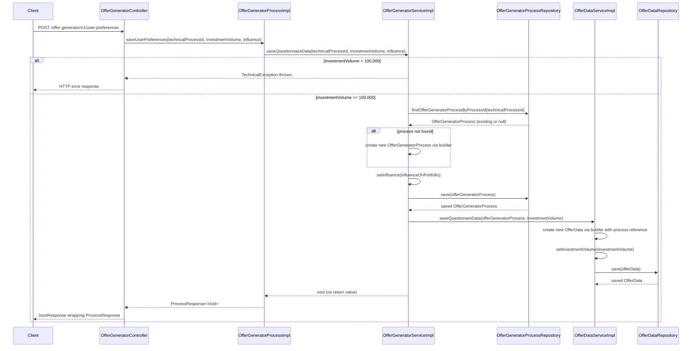

# Chain — OfferGeneratorController · POST /user-preferences

<!-- scaffold — phase 1 -->

- **Action point** — `OfferGeneratorController` (wpfe-am / ucc-offer-generator)
- **Kind** — rest-controller
- **Source** — `ucc-offer-generator/src/main/java/coba/wtp/wpfe/ucc/offer/generator/controller/OfferGeneratorController.java`
- **Handler** — `saveUserPreferencesData(SaveUserPreferencesRequest)` — `.../OfferGeneratorController.java:51`
- **Trigger** — `POST /offer-generator/v1/user-preferences`
- **Preconditions** — `@Valid` on request body; no explicit security annotation observed
- **First hop** — `OfferGeneratorProcess.saveUserPreferences()` (wpfe-am / ucc-offer-generator)

<!-- analysis — phase 2 -->

## Story

As a **retail customer completing an investment questionnaire**, I want my preferences (investment volume and portfolio influence choice) saved so that the offer generator can produce personalised investment offers based on my profile.

- **Given** a valid technical process ID from an active session
- **When** `POST /offer-generator/v1/user-preferences` is called with an investment volume of at least 100,000 and an influence flag
- **Then** the offer generator process record is updated (or created) with the influence setting, and a new offer data record is persisted with the investment volume
- **Unless** the investment volume is below 100,000 — rejected before any persistence occurs

## Chain

Branch 1 · primary
  OfferGeneratorController.saveUserPreferencesData
  → OfferGeneratorProcessImpl.saveUserPreferences
  → OfferGeneratorServiceImpl.saveQuestionnaireData
    Steps:
    - Validate investment volume >= MIN_INVESTMENT_VOLUME (100,000)
      On failure: throws TechnicalException via exception factory
    - Find or create OfferGeneratorProcess entity
      → OfferGeneratorProcessRepository.findOfferGeneratorProcessByProcessId(String)
    - Set influence flag and persist process
      → OfferGeneratorProcessRepository.save(OfferGeneratorProcess)
    - Create new OfferData with investment volume and process reference
      → OfferDataServiceImpl.saveQuestionareData(OfferGeneratorProcess, BigDecimal)
        → OfferDataRepository.save(OfferData)
  → JsonResponseBuilder.buildJsonResultResponse(ProcessResponse<Void>)
  ⇒ [none] ProcessResponse wrapping (after two db writes: OFFER_GENERATOR_PROCESS and OFFER_DATA)

Branch 2 · diverges at OfferGeneratorServiceImpl
  → investment volume < MIN_INVESTMENT_VOLUME (100,000)
    → TechnicalExceptionFactory.createAndLogTechnicalException(Logger, String, String)
    ⇒ [none] exception factory (ignored category: exception types and factories)

Terminals reached — db (OFFER_GENERATOR_PROCESS via OfferGeneratorProcessRepository), db (OFFER_DATA via OfferDataRepository), none (exception factory)

## Diagrams

### Process flow — primary

```mermaid
flowchart LR
  A["POST /offer-generator/v1/user-preferences"] --> B[OfferGeneratorController]
  B --> C[OfferGeneratorProcessImpl.saveUserPreferences]
  C --> D[OfferGeneratorServiceImpl.saveQuestionnaireData]
  D --> E{"investmentVolume >= 100,000?"}
  E -- no --> F["TechnicalExceptionFactory.createAndLogTechnicalException"]
  F --> G([rejected: investment volume too low])
  E -- yes --> H[OfferGeneratorProcessRepository.findOfferGeneratorProcessByProcessId]
  H --> I[(OFFER_GENERATOR_PROCESS)]
  I --> J[Set influence flag on process entity]
  J --> K[OfferGeneratorProcessRepository.save]
  K --> L[(OFFER_GENERATOR_PROCESS)]
  L --> M["OfferDataServiceImpl.saveQuestionareData"]
  M --> N["OfferDataBuilder.anOfferData().withProcess().build()"]
  N --> O[Set investment volume on OfferData entity]
  O --> P[OfferDataRepository.save]
  P --> Q[(OFFER_DATA)]
  Q --> R[JsonResponseBuilder.buildJsonResultResponse]
  R --> S([ProcessResponse<Void>])
```



### Sequence — primary



## Journey

When **the trigger fires**, the request enters at **step 1** to handle **a customer's investment questionnaire submission**. Once that completes, the flow moves to **step 2** because **the process layer delegates business logic to the service layer**. From there, **step 3** takes over to **validate the investment volume, find or create a process entity, set the influence flag, and persist both records**, and so on through every hop until a terminal is reached.

1. **OfferGeneratorController.saveUserPreferencesData** (wpfe-am / ucc-offer-generator)

   **Source.** `ucc-offer-generator/src/main/java/coba/wtp/wpfe/ucc/offer/generator/controller/OfferGeneratorController.java:51`

   **Role.** Receives the customer's investment questionnaire submission — technical process ID, investment volume, and portfolio influence choice — extracts the data from the JSON request body, and delegates to the process layer for persistence.

   **Preconditions.** `@Valid` annotation on the request body ensures structural validation of the incoming JSON; no explicit security annotation observed on this handler.

   **Effect.** Returns a `JsonResponse<Void>` wrapping a `ProcessResponse<Void>`, indicating success or failure of the save operation.

   **Downstream.** The process layer persists both the offer generator process record and a new offer data record to the database.

2. **OfferGeneratorProcessImpl.saveUserPreferences** (wpfe-am / ucc-offer-generator)

   **Source.** `ucc-offer-generator/src/main/java/coba/wtp/wpfe/ucc/offer/generator/process/impl/OfferGeneratorProcessImpl.java:103`

   **Role.** Thin process-layer delegation — receives the three questionnaire parameters and forwards them to the service layer for business logic and persistence. Returns an empty `ProcessResponse<Void>` on success.

   **Downstream.** `OfferGeneratorService.saveQuestionnaireData()` handles all validation, entity management, and database writes.

3. **OfferGeneratorServiceImpl.saveQuestionnaireData** (wpfe-am / ucc-offer-generator)

   **Source.** `ucc-offer-generator/src/main/java/coba/wtp/wpfe/ucc/offer/generator/service/impl/OfferGeneratorServiceImpl.java:82`

   **Role.** Core business logic for saving questionnaire data. Validates the investment volume against a minimum threshold, finds or creates an offer generator process entity, sets the customer's portfolio influence flag, and persists both the process record and a new offer data record containing the investment volume.

   **Preconditions.** `@Transactional` annotation ensures all database writes are atomic — either both the process and offer data records are saved, or neither is.

   **Steps.**

   - **3.1 Validate — minimum investment volume** · `OfferGeneratorServiceImpl.java:85`

     **Role.** Rejects any submission where `investmentVolume` is below 100,000 (the constant `MIN_INVESTMENT_VOLUME`). This enforces a business rule that only customers with sufficient capital can proceed to the offer generation flow.

     **On failure.** Throws `TechnicalException` via `TechnicalExceptionFactory.createAndLogTechnicalException()`, which propagates up through Spring's exception handling to produce an HTTP error response. The exception factory is an ignored class (exception types and factories category), so this branch terminates here as `[none]`.

   - **3.2 Find or create — offer generator process entity** · `OfferGeneratorServiceImpl.java:90`

     **Role.** Looks up an existing `OfferGeneratorProcess` by `technicalProcessId` via the repository. If no record exists, creates a new one using the builder pattern (`OfferGeneratorProcessBuilder.anOfferGeneratorProcess().withProcessId(...).build()`), ensuring the process ID is never null. This supports both questionnaire resubmissions (where a process already exists) and first-time submissions (where it does not).

     **Downstream.** `OfferGeneratorProcessRepository.findOfferGeneratorProcessByProcessId(String)` — db terminal: OFFER_GENERATOR_PROCESS table.

   - **3.3 Set influence flag** · `OfferGeneratorServiceImpl.java:97`

     **Role.** Sets the `influence` field on the process entity to reflect whether the customer wants to influence the portfolio composition. This is a simple setter call on an in-memory entity.

   - **3.4 Persist — offer generator process** · `OfferGeneratorServiceImpl.java:98`

     **Role.** Saves (or updates) the `OfferGeneratorProcess` entity through JPA, which writes or overwrites the row in the OFFER_GENERATOR_PROCESS table. The saved entity is reassigned to the local variable for use in subsequent steps.

   - **3.5 Save questionnaire data — offer data record** · `OfferGeneratorServiceImpl.java:100`

     **Role.** Delegates to `offerDataService.saveQuestionareData()` to create and persist a new `OfferData` entity linked to the process, carrying only the investment volume at this stage. The full product configuration is saved later via a separate endpoint (`POST /offer-generator/v1/product-config`).

4. **OfferGeneratorProcessRepository.findOfferGeneratorProcessByProcessId** (wpfe-am / ucc-offer-generator)

   **Source.** `ucc-offer-generator/src/main/java/coba/wtp/wpfe/ucc/offer/generator/repository/OfferGeneratorProcessRepository.java:18`

   **Role.** JPA repository method that queries the OFFER_GENERATOR_PROCESS table for a row matching the given process ID. Returns an `Optional<OfferGeneratorProcess>` — empty if no record exists, which triggers entity creation in the calling service.

   **Terminal — db**

5. **OfferGeneratorProcessRepository.save** (wpfe-am / ucc-offer-generator)

   **Source.** `ucc-offer-generator/src/main/java/coba/wtp/wpfe/ucc/offer/generator/repository/OfferGeneratorProcessRepository.java:14` (inherited from `JpaRepository`)

   **Role.** JPA save operation that persists the `OfferGeneratorProcess` entity to the OFFER_GENERATOR_PROCESS table. If the entity has a new process ID, it inserts; if it already exists, it updates.

   **Terminal — db**

6. **OfferDataServiceImpl.saveQuestionareData** (wpfe-am / ucc-offer-generator)

   **Source.** `ucc-offer-generator/src/main/java/coba/wtp/wpfe/ucc/offer/generator/service/impl/OfferDataServiceImpl.java:82`

   **Role.** Creates a new `OfferData` entity linked to the provided offer generator process, sets its investment volume field, and persists it. This method is specifically for questionnaire data — it creates a fresh record (not an upsert), so each call produces a new offer data row associated with the same process.

   **Preconditions.** `@Transactional` ensures the save is atomic.

7. **OfferDataRepository.save** (wpfe-am / ucc-offer-generator)

   **Source.** `ucc-offer-generator/src/main/java/coba/wtp/wpfe/ucc/offer/generator/repository/OfferDataRepository.java:12` (inherited from `JpaRepository`)

   **Role.** JPA save operation that persists the new `OfferData` entity to the OFFER_DATA table. The entity carries a generated primary key (`id`) assigned by JPA, and a many-to-one relationship back to the `OfferGeneratorProcess` via the `PROCESS_ID` foreign key column.

   **Terminal — db**

8. **JsonResponseBuilder.buildJsonResultResponse** (wpfe-shared / frontend)

   **Source.** `wpfe-shared/src/main/java/coba/wtp/wpfe/shared/frontend/ui/json/model/JsonResponseBuilder.java:UNKNOWN`

   **Role.** Wraps the `ProcessResponse<Void>` into a `JsonResponse` object that Spring serializes to JSON for the HTTP response body. Pure computation — no outbound calls, no database access.

   **Terminal — none** (pure computation, framework utility)

## Data reached

- **db — OFFER_GENERATOR_PROCESS, via `OfferGeneratorProcessRepository` (wpfe-am / ucc-offer-generator)**
  - Business problem solved — As the **offer generator process**, I need to persist the customer's portfolio influence preference so that subsequent steps in the offer generation flow can read whether the customer wants to actively shape their portfolio composition. Therefore we query `OFFER_GENERATOR_PROCESS` via `OfferGeneratorProcessRepository.findOfferGeneratorProcessByProcessId(technicalProcessId)` for an existing row, and write it back via `.save()` after setting the `INFLUENCE` column (`OfferGeneratorServiceImpl.java:90-98`). The saved entity is used as a foreign key reference when creating the associated offer data row.

  - **Query** — `findOfferGeneratorProcessByProcessId(String processId)` — read-only lookup; followed by `.save()` for an upsert.

  - **Argument**
    ```json
    {
      "processId": "550e8400-e29b-41d4-a716-446655440000"
    }
    ```
    `processId` ← request body, extracted from `JsonRequest<SaveUserPreferencesRequest>.data.technicalProcessId`.

  - **Response fields used** — `PROCESS_ID` (primary key), `INFLUENCE` (set to the customer's choice: `true` or `false`). The entity also carries `SUSTAINABILITY`, `SCENARIO`, and `CUSTOMER_RISK_PROFILE` columns, but these are not touched by this chain.

  - **Response fields discarded** — `SUSTAINABILITY`, `SCENARIO`, `CUSTOMER_RISK_PROFILE`, plus audit columns (`CREATION_DATE`, `UPDATE_DATE`) inherited from `AuditableEntity`.

- **db — OFFER_DATA, via `OfferDataRepository` (wpfe-am / ucc-offer-generator)**
  - Business problem solved — As the **offer generator process**, I need to record the customer's investment volume at the questionnaire stage so that it is available for later stages of the offer generation flow where product recommendations are computed. Therefore we create a new row in `OFFER_DATA` via `OfferDataRepository.save()` with only the `INVESTMENT_VOLUME` column populated (along with the foreign key to `OFFER_GENERATOR_PROCESS`). Additional fields such as module proportions, risk profile, and product line details are filled in later through separate endpoints (`POST /offer-generator/v1/product-config`).

  - **Query** — `.save(offerData)` — write-only insert; no read query in this chain.

  - **Argument**
    ```json
    {
      "id": null,
      "investmentVolume": 250000.00,
      "processId": "550e8400-e29b-41d4-a716-446655440000"
    }
    ```
    `id` ← generated by JPA on insert (auto-generated primary key). `investmentVolume` ← request body, passed through from the controller. `processId` ← foreign key reference to the saved `OFFER_GENERATOR_PROCESS` row.

  - **Response fields used** — The persisted entity's generated `id` (primary key) and all columns set during construction: `INVESTMENT_VOLUME`, `PROCESS_ID`. All other columns (`QUOTA_OFFENSIVE_INVESTMENT`, `PRODUCT_LINE`, `RISK_RETURN_PROFILE`, etc.) are null at this stage.

  - **Response fields discarded** — `QUOTA_OFFENSIVE_INVESTMENT`, `PRODUCT_LINE`, `PRODUCT_LINE_MANDATE_NAME_ENGLISH`, `PRODUCT_LINE_MANDATE_NAME_GERMAN`, `NEUTRAL_RISK_QUOTA`, `MODULE_PROPORTIONS` (empty list), `LOWER_VOLUME_APPROVAL_PERSON`, `RISK_RETURN_PROFILE`, `PRODUCT_LINE_STRATEGY_ID`, `PRODUCT_LINE_STRATEGY_NAME_ENGLISH`, `PRODUCT_LINE_STRATEGY_NAME_GERMAN`, `FURTHER_AGREEMENTS`, `FURTHER_AGREEMENTS_APPROVAL_PERSON`, `FURTHER_AGREEMENTS_APPROVAL_DATE`, `MAXIMUM_STOCK_QUOTA`, `MAXIMUM_CURRENCY_QUOTA`, `MODEL_CONTRACT_ID`, plus audit columns inherited from `AuditableBaseEntity`.

- **none — exception factory, `TechnicalExceptionFactory` (wpfe-shared / base)**
  - Business problem solved — As the **service layer**, I need a standardized way to reject invalid questionnaire submissions with a structured error code so that the frontend can display a meaningful message. Therefore we call `TechnicalExceptionFactory.createAndLogTechnicalException()` which creates and logs a `TechnicalException` containing an error code (`TECH_ERROR_MESSAGE_ID`) and a formatted message describing the validation failure. This exception propagates through Spring's exception handling to produce an HTTP error response.

  - **Argument**
    ```json
    {
      "logger": "Logger for OfferGeneratorServiceImpl",
      "messageId": "coba.wtp.wpfe.ucc.offer.generator.service.impl.OfferGeneratorServiceImpl",
      "message": "Investment volume 50000.00 is below the minimum required 100000"
    }
    ```
    `logger` ← class-level logger instance. `messageId` ← constant identifying this service for error code lookup. `message` ← formatted string with actual and expected values.

## Acceptance Criteria

1. **Investment volume at or above minimum (100,000) — questionnaire saved successfully** — Given a valid `technicalProcessId`, an `investmentVolume` of 100,000 or more, and an `influence` flag, when the endpoint is called, then an existing `OfferGeneratorProcess` row is updated with the influence value (or a new one created if none exists), and a new `OfferData` row is inserted with the investment volume.
   - Evidence: `OfferGeneratorServiceImpl.java:85-100`
   - How to: call the endpoint with `investmentVolume=100000`, verify from query logs that both `OFFER_GENERATOR_PROCESS` and `OFFER_DATA` are written, and confirm the response is a 200 OK.

2. **Investment volume below minimum (100,000) — rejected with error** — Given an `investmentVolume` below 100,000, when the endpoint is called, then a `TechnicalException` is thrown before any database write occurs, and no rows are inserted or updated.
   - Evidence: `OfferGeneratorServiceImpl.java:85-90` — validation check at line 85 short-circuits to exception; transaction annotation on method means rollback on exception.
   - How to: call the endpoint with `investmentVolume=50000`, confirm from query logs that neither table is touched, and assert the response is a 4xx error with an error code matching the technical exception message ID.

3. **Existing process record — influence flag updated in place** — Given a `technicalProcessId` for which an `OfferGeneratorProcess` row already exists, when the endpoint is called, then the existing row's `INFLUENCE` column is updated (not duplicated), and a new `OfferData` row is created.
   - Evidence: `OfferGeneratorServiceImpl.java:90-98` — `findOfferGeneratorProcessByProcessId` returns an existing entity; `.setInfluence()` modifies it in place; `.save()` performs an update.
   - How to: pre-create a row in `OFFER_GENERATOR_PROCESS`, call the endpoint with that process ID, and confirm from query logs that only one UPDATE hits `OFFER_GENERATOR_PROCESS` (not INSERT) plus one INSERT into `OFFER_DATA`.

4. **No existing process record — new process created** — Given a `technicalProcessId` for which no `OfferGeneratorProcess` row exists, when the endpoint is called, then a new row is inserted with that process ID as primary key, and a corresponding `OfferData` row is also inserted.
   - Evidence: `OfferGeneratorServiceImpl.java:92-97` — `.orElseGet()` branch creates a new entity via builder; `.save()` performs an insert.
   - How to: call the endpoint with a fresh `technicalProcessId`, and confirm from query logs that both tables receive INSERT statements.

5. **Transaction rollback on validation failure** — Given any exception thrown within `saveQuestionnaireData` (investment volume too low), when the method exits, then no database changes are committed due to the `@Transactional` annotation.
   - Evidence: `OfferGeneratorServiceImpl.java:82` — `@Transactional` on method; `TechnicalExceptionFactory.createAndLogTechnicalException()` at line 85 throws before any repository call.
   - How to: call with invalid volume, confirm from query logs that no writes occur.

## Business Takeaways

- **What this does for the business** — captures a customer's investment questionnaire responses — specifically their total investment volume and whether they want to influence portfolio composition — as the first step in the offer generation workflow. The investment volume gates eligibility (minimum 100,000), and the influence flag determines how much control the customer has over module selection.
- **Depends on** — the application database (`OFFER_GENERATOR_PROCESS` table for process state; `OFFER_DATA` table for offer records, both read-write)
- **Ingredients** — `technicalProcessId` (session), `investmentVolume` (request body, must be >= 100,000), `influence` (request body, boolean)
- **Preparation** — validate minimum investment volume of 100,000; find or create the process record; set the influence flag
- **Dish** — `ProcessResponse<Void>` indicating success, with two database rows written — one in `OFFER_GENERATOR_PROCESS` and one in `OFFER_DATA`
- **An irreversible effect appears twice** — the dual writes to `OFFER_GENERATOR_PROCESS` (process record) and `OFFER_DATA` (offer data record) are both side effects committed atomically within a single transaction, and again listed here as the terminal outcome of this chain.

